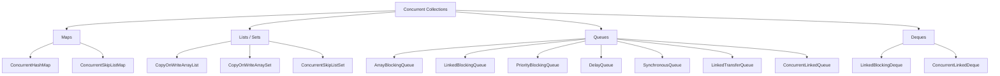

# Java Concurrent Collections — Navigation Guide & Master Overview

## Reading Order

Read this root file first (full overview + comparison tables), then go through each collection in the order below. Start with ConcurrentHashMap — it's the most commonly used and most asked about in interviews.

| # | Folder | What You Learn |
|---|---|---|
| 1 | `README.md` ← **you are here** | Why concurrent collections exist, full comparison table, decision tree for choosing the right one, use cases by context |
| 2 | `ConcurrentHashMap/` | **Most important.** Bucket-level CAS + synchronized internals (Java 8), reads vs writes locking, atomic compound ops (`computeIfAbsent`, `merge`), vs HashMap/Hashtable/synchronizedMap |
| 3 | `CopyOnWriteCollections/` | Copy-on-write strategy, lock-free reads, snapshot iterators, `CopyOnWriteArrayList` and `CopyOnWriteArraySet`, read-heavy use cases (event listeners, service registries) |
| 4 | `ConcurrentLinkedCollections/` | Non-blocking lock-free queues (CAS-based), `ConcurrentLinkedQueue`, `ConcurrentLinkedDeque`, work-stealing pattern, when to use non-blocking vs blocking |
| 5 | `BlockingQueues/` | Producer-consumer pattern, `ArrayBlockingQueue` vs `LinkedBlockingQueue`, `PriorityBlockingQueue`, `DelayQueue` (retry/TTL), `SynchronousQueue` (direct handoff), backpressure |
| 6 | `ConcurrentSkipList/` | Skip list internals, `ConcurrentSkipListMap` (sorted + range queries), `ConcurrentSkipListSet`, use cases: leaderboards, time-series, order books, consistent hashing |

---

## Why This Order

```
README → ConcurrentHashMap: the most fundamental and most used concurrent collection
ConcurrentHashMap → CopyOnWrite: contrasting mechanism (copy vs bucket locking)
CopyOnWrite → ConcurrentLinked: from write-heavy copy to lock-free CAS
ConcurrentLinked → BlockingQueues: from non-blocking to blocking (producer-consumer)
BlockingQueues → ConcurrentSkipList: from queues to sorted maps
```

---

## Quick Reference

```
Need a shared map?           → ConcurrentHashMap
Need a sorted shared map?    → ConcurrentSkipList/
Read-heavy list or set?      → CopyOnWriteCollections/
Producer-consumer pattern?   → BlockingQueues/
High-throughput non-blocking queue? → ConcurrentLinkedCollections/
```

---

This folder covers Java's concurrent collection classes — data structures designed to be safely used by multiple threads simultaneously without external synchronization.

> **Why do these exist? Because regular collections (ArrayList, HashMap, etc.) are NOT thread-safe. Concurrent collections provide thread-safety with much better performance than simply wrapping everything in `synchronized`.**

---

# 1. The Problem with Regular Collections

```java
// NOT thread-safe — DO NOT share between threads without synchronization
Map<String, Integer> map = new HashMap<>();
List<String> list = new ArrayList<>();
Queue<String> queue = new LinkedList<>();
```

When two threads modify these simultaneously:

```text
Thread 1: map.put("key", 1)
Thread 2: map.put("key", 2)   ← concurrent modification
Result: data corruption, infinite loops, ClassCastException, ConcurrentModificationException
```

The naive fix — `synchronized` on every operation — works but causes terrible performance under contention:

```java
// Hashtable: synchronized on every method → one thread at a time
Hashtable<String, Integer> table = new Hashtable<>();

// Collections.synchronizedMap: same problem
Map<String, Integer> syncMap = Collections.synchronizedMap(new HashMap<>());
```

```text
Thread 1: get("order-1") → acquires lock → Thread 2 must WAIT
Thread 2: get("order-2") → WAITING (even though it's a different key!)
```

Concurrent collections solve this by using:
- **Fine-grained locking** (lock per segment/bucket)
- **Lock-free algorithms** (CAS — Compare-And-Swap)
- **Copy-on-write** (create a new copy for every write)
- **Separation of read/write locks**

---

# 2. The Complete Map of Concurrent Collections



---

# 3. Quick Comparison — All Concurrent Collections

| Collection | Thread-Safety Mechanism | Blocking | Bounded | Ordered | Best For |
|---|---|---|---|---|---|
| `ConcurrentHashMap` | Bucket-level CAS + synchronized | No | No | No (insertion) | High-throughput shared map |
| `ConcurrentSkipListMap` | CAS (lock-free) | No | No | Yes (sorted) | Sorted concurrent map |
| `CopyOnWriteArrayList` | Copy-on-write | No | No | Yes (insertion) | Read-heavy lists |
| `CopyOnWriteArraySet` | Copy-on-write | No | No | No | Read-heavy sets |
| `ConcurrentSkipListSet` | CAS (lock-free) | No | No | Yes (sorted) | Sorted concurrent set |
| `ArrayBlockingQueue` | Single lock | Yes | Yes | FIFO | Bounded producer-consumer |
| `LinkedBlockingQueue` | Two locks (head/tail) | Yes | Optional | FIFO | High-throughput work queue |
| `PriorityBlockingQueue` | Single lock | Yes | No | Priority | Priority task scheduling |
| `DelayQueue` | Single lock | Yes | No | Delay-ordered | Scheduled/TTL-based tasks |
| `SynchronousQueue` | CAS | Yes | Zero-capacity | N/A | Direct thread handoff |
| `LinkedTransferQueue` | CAS (lock-free) | Optional | No | FIFO | Producer waits for consumer |
| `ConcurrentLinkedQueue` | CAS (lock-free) | No | No | FIFO | Non-blocking FIFO |
| `ConcurrentLinkedDeque` | CAS (lock-free) | No | No | FIFO/LIFO | Non-blocking deque |
| `LinkedBlockingDeque` | Single lock | Yes | Optional | FIFO/LIFO | Bounded deque |

---

# 4. Choosing the Right Concurrent Collection

```text
NEED A MAP?
  ├── Need sorting by key?
  │     → ConcurrentSkipListMap
  └── Don't need sorting?
        → ConcurrentHashMap (almost always the right choice)

NEED A LIST/SET?
  ├── Read frequency >> write frequency?
  │     → CopyOnWriteArrayList / CopyOnWriteArraySet
  ├── Need sorted set?
  │     → ConcurrentSkipListSet
  └── Frequent writes?
        → Don't use CopyOnWrite — consider ConcurrentSkipListSet or
          external synchronization on ArrayList

NEED A QUEUE?
  ├── Need blocking behavior (producers wait when full)?
  │     ├── Bounded (fixed max capacity)?
  │     │     ├── Fast, predictable, memory-efficient?
  │     │     │     → ArrayBlockingQueue
  │     │     └── Higher throughput, linked nodes?
  │     │           → LinkedBlockingQueue (bounded)
  │     ├── Need priority ordering?
  │     │     → PriorityBlockingQueue
  │     ├── Need delay / scheduling?
  │     │     → DelayQueue
  │     ├── Direct handoff (no buffering)?
  │     │     → SynchronousQueue
  │     └── Unbounded, high-throughput?
  │           → LinkedBlockingQueue (unbounded)
  └── Don't need blocking (non-blocking)?
        → ConcurrentLinkedQueue (FIFO, lock-free)
```

---

# 5. Use Cases by Context

## In DSA / Coding Problems

```text
Producer-Consumer pattern         → ArrayBlockingQueue / LinkedBlockingQueue
BFS level-order traversal         → ConcurrentLinkedQueue (if multithreaded BFS)
Priority-based processing         → PriorityBlockingQueue
Caching key → value               → ConcurrentHashMap
Thread-safe list iteration        → CopyOnWriteArrayList
Scheduling / delayed execution    → DelayQueue
```

## In Microservices (Spring Boot)

```text
In-memory cache (per instance)    → ConcurrentHashMap
Rate limiting (per endpoint)      → ConcurrentHashMap<String, AtomicInteger>
Request deduplication             → ConcurrentHashMap with computeIfAbsent
Event queue (internal)            → LinkedBlockingQueue
Async task processing             → ArrayBlockingQueue → ThreadPoolExecutor
Sensor data aggregation           → ConcurrentHashMap + compute()
Hot config (read-many, rare write)→ CopyOnWriteArrayList
```

## In Distributed Systems

```text
Local shard of distributed cache  → ConcurrentHashMap
Message buffer before Kafka send  → LinkedBlockingQueue / ArrayBlockingQueue
Retry queue with backoff          → DelayQueue
Priority message routing          → PriorityBlockingQueue
Local rate limiter (per-node)     → ConcurrentHashMap + AtomicLong
Leader election task queue        → SynchronousQueue (direct handoff)
```

---

# 6. The Non-Thread-Safe → Concurrent Collection Migration Map

| If you use this... | And it's shared between threads... | Use this instead |
|---|---|---|
| `HashMap` | Yes | `ConcurrentHashMap` |
| `TreeMap` | Yes | `ConcurrentSkipListMap` |
| `ArrayList` | Yes, read-heavy | `CopyOnWriteArrayList` |
| `HashSet` | Yes, read-heavy | `CopyOnWriteArraySet` |
| `TreeSet` | Yes | `ConcurrentSkipListSet` |
| `LinkedList` (as Queue) | Yes | `ConcurrentLinkedQueue` or `LinkedBlockingQueue` |
| `PriorityQueue` | Yes | `PriorityBlockingQueue` |

---

# 7. Documents in This Folder

```text
ConcurrentHashMap/       — The most important concurrent collection
BlockingQueues/          — ArrayBlockingQueue, LinkedBlockingQueue, PriorityBlockingQueue,
                           DelayQueue, SynchronousQueue, LinkedTransferQueue
CopyOnWriteCollections/  — CopyOnWriteArrayList, CopyOnWriteArraySet
ConcurrentLinkedCollections/ — ConcurrentLinkedQueue, ConcurrentLinkedDeque
ConcurrentSkipList/      — ConcurrentSkipListMap, ConcurrentSkipListSet
```

---

# Interview Preparation — Overview

## Q1: Why can't we just use HashMap in a multithreaded environment?

HashMap is not thread-safe. Concurrent reads are generally fine, but concurrent writes (or concurrent read + write) can cause:
- **Infinite loop**: Java 7's HashMap can create a circular linked list in the bucket during concurrent resize
- **Data corruption**: put() by two threads simultaneously may lose one entry
- **ConcurrentModificationException**: if iterating while another thread modifies

## Q2: What's wrong with Collections.synchronizedMap()?

`synchronizedMap` wraps every method in `synchronized(this)` — one global lock. Only one thread can access the entire map at a time, regardless of which key they're accessing. Under contention, this serializes all operations → terrible throughput.

`ConcurrentHashMap` uses bucket-level locking (Java 8) — threads accessing different buckets don't block each other → orders of magnitude better throughput.

## Q3: What is the difference between blocking and non-blocking concurrent collections?

**Blocking**: operations wait (block) when conditions aren't met — e.g., `take()` blocks if queue is empty, `put()` blocks if queue is full. Useful for producer-consumer patterns where you want backpressure.

**Non-blocking**: operations never block — they return immediately with a result (null, false, etc.) or use retry loops with CAS. Higher throughput but requires the caller to handle the "nothing available" case.
