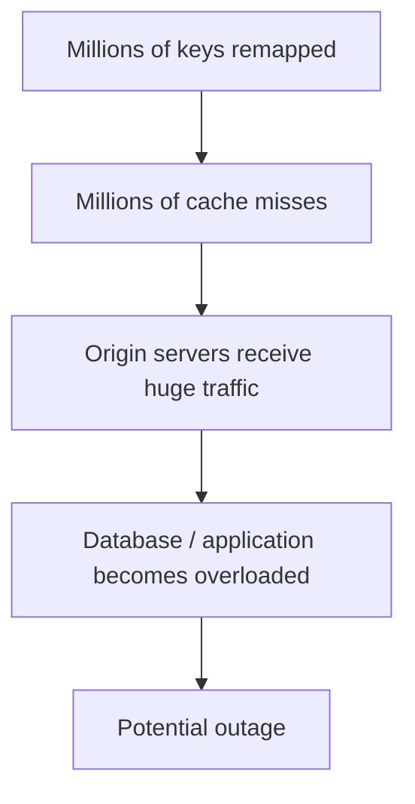
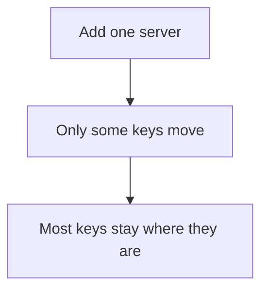
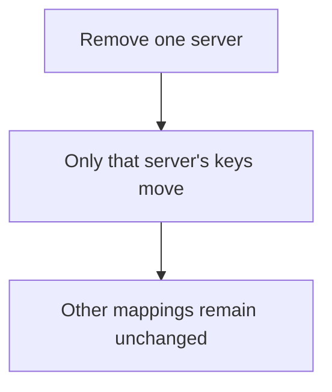
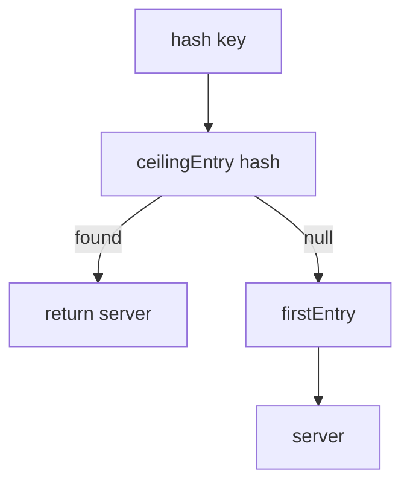

# Consistent Hashing — Detailed Notes + Java Implementation

## 1. What is Consistent Hashing?

Consistent hashing is a technique used in distributed systems to distribute keys across a changing set of servers while minimizing the number of keys that need to move when servers are added or removed.

It is especially useful for:

- Distributed caches
- Distributed key-value stores
- Sharding
- Load distribution
- Partitioning data across nodes
- Systems where nodes can dynamically join or leave

The central problem is simple:

> How do we distribute keys across multiple servers without remapping almost every key whenever the number of servers changes?

---

# 2. The Problem with Normal Hashing

A common approach is:

```text
serverIndex = hash(key) % numberOfServers
```

Suppose we have 3 servers:

```text
Server 0
Server 1
Server 2
```

Then:

```text
hash("user-1") % 3 -> 0
hash("user-2") % 3 -> 1
hash("user-3") % 3 -> 2
```

This looks fine.

But now suppose we add another server:

```text
Server 0
Server 1
Server 2
Server 3
```

The calculation becomes:

```text
hash(key) % 4
```

The result for almost every key can change.

For example:

```text
              Before             After

user-1        hash % 3 = 0       hash % 4 = 3
user-2        hash % 3 = 1       hash % 4 = 2
user-3        hash % 3 = 2       hash % 4 = 1
user-4        hash % 3 = 0       hash % 4 = 2
...
```

So almost all keys may move.

## Why is this bad?

Imagine a distributed cache:

```text
                Application
                     |
        +------------+------------+
        |            |            |
      Cache A      Cache B      Cache C
```

Suppose the application stores millions of objects.

If one cache server is added:

```text
                Application
                     |
       +-------------+-------------+
       |             |             |
     Cache A       Cache B       Cache C
                                      |
                                    Cache D
```

With:

```text
hash(key) % N
```

the value of `N` changes.

Therefore, a huge percentage of keys are mapped to different servers.

The application starts requesting those objects from the origin database/application because the new cache locations do not contain them.

This can create a cache-miss storm:



This is one of the major motivations for consistent hashing.

---

# 3. Goal of Consistent Hashing

We want the following behavior:



Similarly:



This is the key property of consistent hashing.

---

# 4. The Core Idea

The basic idea is:

> Hash both the servers and the keys into the same hash space.

Instead of:

```text
hash(key) % numberOfServers
```

we create a circular hash space.

Conceptually:

```text
0 ------------------------------------ MAX
 \                                      /
  \                                    /
   ------------------------------------
```

Because the space is circular:

```text
MAX -> 0
```

The servers are placed on this ring using a hash function.

Keys are also hashed onto the same ring.

Then:

> A key belongs to the first server encountered while moving clockwise from the key's position.

---

# 5. Hash Ring Visualization

Suppose our hash ring looks like this:

```text
                         Server B
                            ●
                           /
                          /
                         /
              Key X ●
                       \
                        \
                         \
                          ● Server C


                ● Server A
```

To determine the server for `Key X`:

1. Hash `Key X`.
2. Find its position on the ring.
3. Move clockwise.
4. Find the first server.
5. That server owns the key.

So:

```text
Key X
  |
  v
Hash(key)
  |
  v
Position on ring
  |
  v
Move clockwise
  |
  v
First server
  |
  v
Owner
```

---

# 6. Why Is the Ring Circular?

Consider:

```text
0 --------------------------- 100
```

Suppose servers are:

```text
20 -> A
50 -> B
80 -> C
```

What happens to a key at:

```text
90
```

There is no server after 90.

Because the ring is circular, we wrap around:

```text
90 -> 0 -> 20
```

Therefore the key belongs to:

```text
Server A
```

This is called the **wrap-around case**.

---

# 7. Example

Suppose:

```text
Hash ring:

100 -> A
300 -> B
500 -> C
700 -> A
```

Now consider:

```text
hash(key) = 350
```

Move clockwise:

```text
350
 |
 v
500 -> C
```

Therefore:

```text
key -> C
```

Another key:

```text
hash(key) = 650
```

Move clockwise:

```text
650
 |
 v
700 -> A
```

Therefore:

```text
key -> A
```

Now:

```text
hash(key) = 900
```

There is no server after 900.

Wrap around:

```text
900 -> 0 -> 100
```

Therefore:

```text
key -> A
```

---

# 8. What Happens When a Server Is Removed?

Suppose:

```text
100 -> A
300 -> B
500 -> C
700 -> A
```

Suppose:

```text
Key X -> C
```

because:

```text
hash(Key X) = 450
```

and the next server clockwise is:

```text
500 -> C
```

Now remove C.

The ring becomes:

```text
100 -> A
300 -> B
700 -> A
```

The next server clockwise from 450 is now:

```text
700 -> A
```

Therefore:

```text
Key X -> A
```

What about keys belonging to A or B?

They remain unchanged unless their ownership interval was affected.

This is the important difference from:

```text
hash(key) % N
```

where removing one server can change almost every mapping.

---

# 9. What Happens When a Server Is Added?

Suppose:

```text
100 -> A
300 -> B
700 -> A
```

A new server C is inserted at:

```text
500
```

Before:

```text
300 -> B
700 -> A
```

Keys between:

```text
300 and 500
```

belonged to B.

After adding C:

```text
300 -> B
500 -> C
700 -> A
```

Those keys now belong to C.

The rest remain unchanged.

Therefore, adding a server only affects keys in the interval immediately preceding the new server position.

---

# 10. The Major Problem: Uneven Distribution

There is a problem with the basic implementation.

Suppose:

```text
A -> position 100
B -> position 200
C -> position 900
```

The intervals might look like:

```text
A:
900 -> 100

B:
100 -> 200

C:
200 -> 900
```

C owns a huge portion of the ring.

Therefore:

```text
A -> small amount of data
B -> small amount of data
C -> huge amount of data
```

This can cause:

- Uneven storage
- Uneven traffic
- Hotspots
- Uneven CPU utilization
- Uneven memory usage

The solution is **virtual nodes**.

---

# 11. Virtual Nodes

Instead of placing one point for each physical server:

```text
A
B
C
```

we place many points for each server:

```text
A#0
A#1
A#2
...
A#99

B#0
B#1
...
B#99

C#0
C#1
...
C#99
```

These are called:

- Virtual nodes
- Replicas
- Virtual points

The physical server owns all of its virtual nodes.

For example:

```text
A#0  \
A#1   \
A#2    ---> Physical Server A
A#3   /
A#4  /
```

---

# 12. Why Virtual Nodes Improve Distribution

Imagine we have:

```text
Server A -> 1 point
Server B -> 1 point
Server C -> 1 point
```

There can be large gaps between points.

With:

```text
100 virtual nodes per server
```

we get:

```text
A#0
A#1
...
A#99

B#0
...
B#99

C#0
...
C#99
```

The points become much more evenly spread across the ring.

Instead of:

```text
        A

                 B

                                  C
```

we get something more like:

```text
A B C A C B A B C B A C A B C ...
```

This improves load distribution.

---

# 13. How Virtual Nodes Are Generated

For server:

```text
Server-A
```

we generate:

```text
Server-A#0
Server-A#1
Server-A#2
...
Server-A#99
```

Each virtual node is hashed:

```text
hash("Server-A#0")
hash("Server-A#1")
hash("Server-A#2")
...
```

Each result creates a position on the ring.

Conceptually:

```text
Server-A
    |
    +---- A#0 ---- hash ----> 781
    |
    +---- A#1 ---- hash ----> 1298
    |
    +---- A#2 ---- hash ----> 9002
```

---

# 14. Data Structure Used in Java

A very convenient structure is:

```java
TreeMap<Long, String>
```

Why?

Because we need:

```text
hash position -> server
```

and we need the entries sorted.

Example:

```text
TreeMap

1000 -> Server-A
2500 -> Server-C
4300 -> Server-B
7000 -> Server-A
```

The `TreeMap` gives us operations such as:

```java
ceilingEntry(hash)
firstEntry()
remove(hash)
```

These are exactly what we need.

---

# 15. The Most Important Lookup Operation

Suppose:

```text
1000 -> A
2500 -> C
4300 -> B
7000 -> A
```

and:

```text
hash(key) = 3200
```

We need the first server clockwise.

That means:

```text
first server >= 3200
```

In Java:

```java
ring.ceilingEntry(3200)
```

returns:

```text
4300 -> B
```

Therefore:

```text
key -> B
```

---

# 16. Wrap-Around in Java

Suppose:

```text
hash(key) = 9000
```

and the largest ring position is:

```text
7000
```

Then:

```java
ring.ceilingEntry(9000)
```

returns:

```java
null
```

We therefore use:

```java
ring.firstEntry()
```

So:

```text
9000 -> wrap around -> first position -> A
```

This is the complete lookup logic:



---

# 17. Complete Pseudocode

## 17.1 Create Hash Ring

```text
CREATE empty sorted map called ring

FOR every server:
    ADD server to ring
```

---

## 17.2 Add Server

```text
FUNCTION addServer(server):

    FOR i = 0 to numberOfVirtualNodes - 1:

        virtualNode = server + "#" + i

        position = hash(virtualNode)

        ring[position] = server
```

Example:

```text
addServer("Server-A")

A#0 -> hash -> 1000
A#1 -> hash -> 5000
A#2 -> hash -> 8000
...
```

---

## 17.3 Remove Server

```text
FUNCTION removeServer(server):

    FOR i = 0 to numberOfVirtualNodes - 1:

        virtualNode = server + "#" + i

        position = hash(virtualNode)

        remove ring[position]
```

---

## 17.4 Find Server

```text
FUNCTION getServer(key):

    IF ring is empty:
        return null

    keyHash = hash(key)

    node = first ring position >= keyHash

    IF node exists:
        return node.server

    ELSE:
        return server at first ring position
```

---

# 18. Complete Flow

Suppose:

```text
Servers:

A
B
C
```

with:

```text
3 virtual nodes per server
```

We create:

```text
A#0
A#1
A#2

B#0
B#1
B#2

C#0
C#1
C#2
```

After hashing:

```text
1000 -> A
1700 -> C
2500 -> B
3400 -> A
4800 -> C
6200 -> B
7000 -> A
8200 -> C
9500 -> B
```

Now:

```text
key = user-123
hash(user-123) = 5600
```

Find first position >= 5600:

```text
6200 -> B
```

Therefore:

```text
user-123 -> Server-B
```

---

# 19. Complete Java Implementation

```java
import java.nio.charset.StandardCharsets;
import java.security.MessageDigest;
import java.security.NoSuchAlgorithmException;
import java.util.Map;
import java.util.TreeMap;

public class ConsistentHashing {

    /*
     * ============================================================
     * Hash Function
     * ============================================================
     *
     * We use MD5 only for demonstration purposes.
     *
     * In a real production system you may use:
     *
     * - MurmurHash
     * - xxHash
     * - xxHash3
     * - SHA-256
     *
     * We convert the hash into an unsigned long value.
     */
    static class HashFunction {

        private final MessageDigest md;

        public HashFunction() {
            try {
                md = MessageDigest.getInstance("MD5");
            } catch (NoSuchAlgorithmException e) {
                throw new RuntimeException(e);
            }
        }

        public long hash(String key) {

            byte[] bytes =
                    md.digest(key.getBytes(StandardCharsets.UTF_8));

            /*
             * Take first 8 bytes.
             *
             * We mask with Long.MAX_VALUE so that
             * the result is non-negative.
             */
            long hash = 0;

            for (int i = 0; i < 8; i++) {
                hash = (hash << 8) | (bytes[i] & 0xff);
            }

            return hash & Long.MAX_VALUE;
        }
    }


    /*
     * ============================================================
     * Consistent Hash Ring
     * ============================================================
     */
    static class ConsistentHashRing {

        /*
         * Number of virtual nodes per physical server.
         */
        private final int virtualNodes;

        /*
         * Hash function.
         */
        private final HashFunction hashFunction;

        /*
         * The actual hash ring.
         *
         * Key:
         *     hash position
         *
         * Value:
         *     physical server
         *
         * TreeMap keeps all nodes sorted by hash.
         */
        private final TreeMap<Long, String> ring;


        public ConsistentHashRing(int virtualNodes) {

            if (virtualNodes <= 0) {
                throw new IllegalArgumentException(
                        "Virtual nodes must be greater than 0"
                );
            }

            this.virtualNodes = virtualNodes;
            this.hashFunction = new HashFunction();
            this.ring = new TreeMap<>();
        }


        /*
         * ========================================================
         * Add Physical Server
         * ========================================================
         */
        public void addServer(String server) {

            for (int i = 0; i < virtualNodes; i++) {

                String virtualNode =
                        server + "#" + i;

                long hash =
                        hashFunction.hash(virtualNode);

                ring.put(hash, server);
            }

            System.out.println(
                    "Added server: " + server
            );
        }


        /*
         * ========================================================
         * Remove Physical Server
         * ========================================================
         */
        public void removeServer(String server) {

            for (int i = 0; i < virtualNodes; i++) {

                String virtualNode =
                        server + "#" + i;

                long hash =
                        hashFunction.hash(virtualNode);

                ring.remove(hash);
            }

            System.out.println(
                    "Removed server: " + server
            );
        }


        /*
         * ========================================================
         * Get Server For Key
         * ========================================================
         */
        public String getServer(String key) {

            if (ring.isEmpty()) {
                return null;
            }

            long hash =
                    hashFunction.hash(key);

            /*
             * Find first node whose hash >= key hash.
             */
            Map.Entry<Long, String> entry =
                    ring.ceilingEntry(hash);


            /*
             * Wrap around if necessary.
             */
            if (entry == null) {
                entry = ring.firstEntry();
            }

            return entry.getValue();
        }


        /*
         * ========================================================
         * Print Ring
         * ========================================================
         */
        public void printRing() {

            System.out.println("\n========== HASH RING ==========");

            for (Map.Entry<Long, String> entry :
                    ring.entrySet()) {

                System.out.println(
                        entry.getKey()
                                + " -> "
                                + entry.getValue()
                );
            }

            System.out.println(
                    "===============================\n"
            );
        }


        /*
         * ========================================================
         * Number of Virtual Nodes
         * ========================================================
         */
        public int size() {
            return ring.size();
        }
    }


    /*
     * ============================================================
     * Main
     * ============================================================
     */
    public static void main(String[] args) {

        /*
         * Create hash ring with
         * 100 virtual nodes per server.
         */
        ConsistentHashRing ring =
                new ConsistentHashRing(100);


        /*
         * Add servers.
         */
        ring.addServer("Server-A");
        ring.addServer("Server-B");
        ring.addServer("Server-C");


        /*
         * Print number of virtual nodes.
         */
        System.out.println(
                "Total virtual nodes: "
                        + ring.size()
        );


        /*
         * Test keys.
         */
        String[] keys = {
                "user-1",
                "user-2",
                "user-3",
                "user-4",
                "user-5",
                "user-6",
                "user-7",
                "user-8",
                "user-9",
                "user-10"
        };


        /*
         * Find server for every key.
         */
        System.out.println(
                "\nInitial key distribution:"
        );

        for (String key : keys) {

            String server =
                    ring.getServer(key);

            System.out.println(
                    key + " -> " + server
            );
        }


        /*
         * Add another server.
         */
        System.out.println(
                "\nAdding Server-D..."
        );

        ring.addServer("Server-D");


        /*
         * Check distribution again.
         */
        System.out.println(
                "\nDistribution after adding Server-D:"
        );

        for (String key : keys) {

            String server =
                    ring.getServer(key);

            System.out.println(
                    key + " -> " + server
            );
        }


        /*
         * Remove Server-B.
         */
        System.out.println(
                "\nRemoving Server-B..."
        );

        ring.removeServer("Server-B");


        /*
         * Check distribution again.
         */
        System.out.println(
                "\nDistribution after removing Server-B:"
        );

        for (String key : keys) {

            String server =
                    ring.getServer(key);

            System.out.println(
                    key + " -> " + server
            );
        }
    }
}
```

---

# 20. Understanding the Java Code Class-by-Class

## HashFunction

```java
static class HashFunction
```

Its responsibility is simply:

```text
String
  |
  v
Hash
  |
  v
long
```

For example:

```java
hashFunction.hash("user-123");
```

returns a deterministic number.

The same input must always produce the same output.

That is critical.

If one client calculates:

```text
user-123 -> 1000
```

and another calculates:

```text
user-123 -> 5000
```

the distributed system would not agree on which server owns the key.

---

# 21. Why Not Use Java String.hashCode()?

Java's:

```java
String.hashCode()
```

is deterministic and perfectly valid for many basic hash-table scenarios.

However, consistent hashing is sensitive to the quality of the distribution.

A poor hash function can produce clustering:

```text
      A B C
      |||
      |||
      |||
```

instead of:

```text
A   C   B   A   C   B   A
```

A better-distributed hash gives more evenly spread points.

The original article recommends a well-mixing hash such as MD5 for the demonstration.

For production systems, a fast non-cryptographic hash is often preferred.

---

# 22. ConsistentHashRing

The ring is:

```java
private final TreeMap<Long, String> ring;
```

Conceptually:

```text
                 Ring
                  |
       +----------+----------+
       |                     |
 Hash Position            Server
       |                     |
      1000              Server-A
      3000              Server-B
      5000              Server-C
```

Because `TreeMap` is sorted:

```text
1000
3000
5000
...
```

we can efficiently find the next server.

---

# 23. Adding a Server

```java
public void addServer(String server) {

    for (int i = 0; i < virtualNodes; i++) {

        String virtualNode =
                server + "#" + i;

        long hash =
                hashFunction.hash(virtualNode);

        ring.put(hash, server);
    }
}
```

Suppose:

```text
virtualNodes = 3
```

and:

```text
server = Server-A
```

We create:

```text
Server-A#0
Server-A#1
Server-A#2
```

Then:

```text
hash(Server-A#0)
hash(Server-A#1)
hash(Server-A#2)
```

might produce:

```text
1000
7000
9000
```

The ring becomes:

```text
1000 -> Server-A
7000 -> Server-A
9000 -> Server-A
```

---

# 24. Removing a Server

We generate the exact same virtual-node names:

```text
Server-A#0
Server-A#1
Server-A#2
```

and calculate the same hashes.

Then:

```java
ring.remove(hash);
```

removes those positions.

This is why the hash function must be deterministic.

---

# 25. Key Lookup

The central method is:

```java
public String getServer(String key)
```

First:

```java
if (ring.isEmpty()) {
    return null;
}
```

If there are no servers, there is nowhere to send the key.

Then:

```java
long hash = hashFunction.hash(key);
```

We map the key onto the ring.

Then:

```java
Map.Entry<Long, String> entry =
        ring.ceilingEntry(hash);
```

This finds the first ring position greater than or equal to the key's hash.

If no such position exists:

```java
if (entry == null) {
    entry = ring.firstEntry();
}
```

This performs the circular wrap-around.

Finally:

```java
return entry.getValue();
```

returns the physical server.

---

# 26. Complete Lookup Pseudocode

```text
GET_SERVER(key):

    IF ring is empty:
        RETURN null

    keyHash = HASH(key)

    serverNode = CEILING_ENTRY(keyHash)

    IF serverNode exists:
        RETURN serverNode.server

    serverNode = FIRST_ENTRY()

    RETURN serverNode.server
```

---

# 27. Full System Flow

```text
                         CLIENT
                           |
                           |
                         key
                           |
                           v
                    hash(key)
                           |
                           v
                 +------------------+
                 |   Hash Ring      |
                 |                  |
                 |  A#0             |
                 |       B#4        |
                 |  C#2             |
                 |          A#8      |
                 |      B#1         |
                 +------------------+
                           |
                           |
                    Find next node
                       clockwise
                           |
                           v
                      Server B
```

---

# 28. Adding a Node — Full Flow

```text
Before:

       A
      / \
     /   \
    B     C


ADD D

      A
    /   \
   B     D
          \
           C
```

Conceptually, D takes ownership of the interval immediately preceding its ring positions.

Therefore:

```text
Old mappings:
A -> unchanged
B -> partially changed
C -> unchanged

New D:
takes only its new intervals
```

With virtual nodes, those intervals are distributed throughout the ring.

---

# 29. Removing a Node — Full Flow

Suppose:

```text
A
B
C
D
```

Remove C.

Its virtual nodes disappear:

```text
C#0
C#1
C#2
...
```

Keys that previously mapped to those virtual nodes move to the next clockwise virtual node.

Other keys stay where they are.

---

# 30. Why Consistent Hashing Is Called "Consistent"

The word "consistent" does not mean:

```text
Every server gets exactly the same amount of data.
```

It means that when the membership changes:

```text
Most existing key -> server mappings remain stable.
```

The algorithm minimizes disruption.

---

# 31. Consistent Hashing vs Modulo Hashing

| Property | `hash(key) % N` | Consistent Hashing |
|---|---|---|
| Simple | Yes | More complex |
| Dynamic nodes | Poor | Excellent |
| Add server | Many keys move | Limited keys move |
| Remove server | Many keys move | Limited keys move |
| Ring required | No | Yes |
| Virtual nodes | No | Usually |
| Lookup | O(1) | O(log N) with TreeMap |
| Load balancing | Depends on hash | Improved with virtual nodes |

---

# 32. Important Interview Question

### What happens when a server is added?

Answer:

> The new server is hashed onto the ring. It takes ownership of the key ranges immediately preceding its virtual-node positions. Only keys in those ranges need to move; the remaining keys continue mapping to their existing servers.

---

# 33. Another Interview Question

### What happens when a server is removed?

Answer:

> Its virtual nodes are removed from the ring. Keys that previously mapped to those positions now map to the next available server clockwise. Other key mappings remain unchanged.

---

# 34. Why Do We Need Virtual Nodes?

Answer:

> With only one position per physical server, random placement can produce highly unequal intervals. Virtual nodes place many positions for each physical server around the ring, reducing variance and improving load distribution.

---

# 35. Why Does TreeMap Work Well?

`TreeMap` internally maintains sorted keys.

We need:

```text
first position >= hash(key)
```

which is exactly:

```java
ceilingEntry(hash)
```

We also need:

```text
smallest position
```

which is:

```java
firstEntry()
```

Therefore:

```text
TreeMap
   |
   +-- sorted positions
   |
   +-- ceilingEntry()
   |
   +-- firstEntry()
   |
   +-- remove()
```

is a natural fit.

---

# 36. Complexity

Let:

```text
N = number of physical servers
V = virtual nodes per server
```

Total ring positions:

```text
N * V
```

## Add

For each virtual node:

```text
TreeMap.put()
```

costs:

```text
O(log(NV))
```

There are V virtual nodes.

Therefore:

```text
O(V log(NV))
```

---

## Remove

Similarly:

```text
O(V log(NV))
```

---

## Lookup

We perform:

```java
ceilingEntry()
```

Therefore:

```text
O(log(NV))
```

---

## Memory

The ring stores:

```text
N * V
```

positions.

Therefore:

```text
O(NV)
```

---

# 37. Important Production Considerations

The demonstration implementation is intentionally simple.

A production implementation should consider:

## 37.1 Hash collisions

Two virtual nodes could theoretically produce the same hash position.

For example:

```text
hash(A#10) = 5000
hash(B#72) = 5000
```

A simple:

```java
TreeMap<Long, String>
```

cannot store both independently because the key `5000` is identical.

A production implementation can:

- Use a larger hash space.
- Use a stronger/appropriate hash.
- Handle collisions explicitly.
- Use a structure supporting multiple nodes per position.

---

## 37.2 Thread safety

The current implementation is not thread-safe.

A production system with concurrent readers/writers needs synchronization or an immutable/snapshot-based ring.

A common pattern is:

```text
Build new ring
      |
      v
Publish immutable ring
      |
      v
Readers use current snapshot
```

This avoids readers observing partially modified ring state.

---

## 37.3 Node weights

Suppose:

```text
Server A = 16 GB RAM
Server B = 64 GB RAM
```

They should not necessarily receive equal traffic.

Weighted consistent hashing can assign:

```text
A -> 100 virtual nodes
B -> 400 virtual nodes
```

approximately giving B four times the ring ownership.

---

## 37.4 Replication

Distributed databases often need multiple copies.

Instead of:

```text
key -> Server A
```

we may need:

```text
key
 |
 +--> Primary: Server A
 |
 +--> Replica: Server B
 |
 +--> Replica: Server C
```

This can be implemented by continuing clockwise around the ring and selecting additional distinct physical servers.

---

# 38. Consistent Hashing and Replication

Suppose the ring is:

```text
1000 -> A
2000 -> B
3000 -> C
4000 -> A
5000 -> D
```

Suppose:

```text
hash(key) = 1500
```

Primary:

```text
2000 -> B
```

For replication factor 3, continue clockwise:

```text
B
C
A
```

Therefore:

```text
Primary = B
Replica 1 = C
Replica 2 = A
```

Notice that we select **physical servers**, not virtual-node names, so we don't accidentally select:

```text
B#10
B#42
B#81
```

as three different replicas.

---

# 39. Consistent Hashing in Distributed Caching

Consider:

```text
              Application
                   |
             hash(userId)
                   |
                   v
            Consistent Ring
          /        |        \
         /         |         \
       Cache A   Cache B   Cache C
```

For:

```text
userId = 123
```

the client calculates:

```text
hash("123")
```

and determines:

```text
Cache B
```

The request goes directly to:

```text
Cache B
```

The cache server itself does not necessarily need to understand consistent hashing.

This is an important architectural point.

---

# 40. Client-Side Consistent Hashing

A distributed cache can work like:

```text
Application
    |
    | calculates hash
    v
Consistent Hash Ring
    |
    +----> Cache A
    |
    +----> Cache B
    |
    +----> Cache C
```

The cache servers can remain relatively simple.

The client decides where the key belongs.

This is historically important in systems such as memcached clients.

---

# 41. Real Distributed System Architecture

A more realistic architecture looks like:

```text
                    Client
                      |
                      v
               Hash Ring View
                      |
        +-------------+-------------+
        |             |             |
        v             v             v
     Node A         Node B        Node C
        |             |             |
        v             v             v
      Data          Data          Data
```

The challenge then becomes:

> How does every client know which nodes currently exist?

This is a separate problem involving:

- Service discovery
- Membership
- Cluster metadata
- Coordination
- Failure detection
- Ring versioning

Consistent hashing solves **partition assignment**, not the entire distributed-system membership problem.

---

# 42. Consistent Hashing vs Load Balancing

They are related but not identical.

A normal load balancer may do:

```text
Round Robin

Request 1 -> A
Request 2 -> B
Request 3 -> C
Request 4 -> A
```

Consistent hashing does:

```text
hash(key) -> deterministic owner
```

For example:

```text
user-1 -> A
user-2 -> C
user-3 -> B
```

Repeated requests for the same key continue going to the same node while the ring membership remains unchanged.

This is particularly useful when data is stored on specific nodes.

---

# 43. Consistent Hashing vs Rendezvous Hashing

Another distributed hashing technique is **Rendezvous Hashing**, also called **Highest Random Weight Hashing (HRW)**.

Consistent hashing:

```text
Hash ring
   |
clockwise successor
```

Rendezvous hashing:

```text
score(key, node)
       |
       v
choose highest score
```

Both aim to minimize movement when nodes change.

Consistent hashing is especially intuitive when discussing:

- Distributed caches
- Ring partitioning
- Virtual nodes
- Dynamo-style architectures

Rendezvous hashing can be attractive because it does not require maintaining a ring and can have useful balancing properties.

---

# 44. Common Interview Mistakes

## Mistake 1: Saying every key moves

Wrong:

```text
Adding a node means all keys are redistributed.
```

That is closer to modulo hashing.

Correct:

```text
Only keys in affected intervals move.
```

---

## Mistake 2: Forgetting the ring is circular

If:

```text
ceilingEntry(hash) == null
```

we must wrap around:

```java
firstEntry()
```

---

## Mistake 3: Forgetting virtual nodes

A basic ring with one point per server can have poor distribution.

Mention:

```text
Virtual nodes reduce unevenness.
```

---

## Mistake 4: Confusing physical and virtual nodes

Example:

```text
Server A
  |
  +-- A#0
  +-- A#1
  +-- A#2
```

These are not three servers.

They are three positions owned by the same physical server.

---

## Mistake 5: Thinking consistent hashing provides replication

It does not automatically provide replication.

It answers:

```text
Which node owns this key?
```

Replication is an additional mechanism:

```text
Which additional nodes should also store this key?
```

---

# 45. A Better Mental Model

Remember these five steps:

```text
1. Hash servers
       |
       v
2. Put servers on ring
       |
       v
3. Hash key
       |
       v
4. Find next server clockwise
       |
       v
5. Store/read key there
```

With virtual nodes:

```text
Physical Server
      |
      +-- virtual node 1
      +-- virtual node 2
      +-- virtual node 3
      +-- ...
```

---

# 46. One-Line Interview Explanation

If an interviewer asks:

> Explain consistent hashing.

A strong concise answer is:

> Consistent hashing maps both keys and servers onto a circular hash space. A key is assigned to the first server encountered clockwise from its hash position. When a server joins or leaves, only keys in the affected ranges need to move, rather than remapping almost all keys as happens with `hash(key) % N`. Virtual nodes are typically used to improve load distribution.

---

# 47. Complete Architecture Visualization

```text
                         DISTRIBUTED CACHE

                              Client
                                |
                                |
                             key=user1
                                |
                                v
                         hash("user1")
                                |
                                v
                    +-----------------------+
                    |     HASH RING         |
                    |                       |
                    |       A#10            |
                    |         ●             |
                    |                       |
                    |  C#22 ●               |
                    |                       |
                    |             B#4 ●     |
                    |                       |
                    |     A#72 ●            |
                    |                       |
                    +-----------------------+
                                |
                                |
                       next node clockwise
                                |
                                v
                            Server B
                                |
                                v
                            Cache data
```

---

# 48. End-to-End Example

Suppose:

```text
Servers:

A
B
C
```

Each has:

```text
100 virtual nodes
```

We receive:

```text
GET user:123
```

### Step 1

Hash:

```text
hash("user:123")
```

### Step 2

Find its position:

```text
position = 5,438,291
```

### Step 3

Find the next virtual node:

```text
5,450,000 -> B#43
```

### Step 4

Map virtual node to physical server:

```text
B#43 -> Server B
```

### Step 5

Send request:

```text
Client -> Server B
```

Now Server B is responsible for that key.

---

# 49. What Happens When Server D Joins?

Suppose D gets 100 virtual nodes:

```text
D#0
D#1
...
D#99
```

These positions are distributed around the ring.

Some existing ranges now have D as their next clockwise node.

Therefore:

```text
Some keys:
A -> D

Some keys:
B -> D

Some keys:
C -> D
```

but:

```text
Most keys remain:
A -> A
B -> B
C -> C
```

This is the main benefit.

---

# 50. What Happens When Server B Dies?

Suppose:

```text
B#0
B#1
...
B#99
```

are removed.

Every key that previously resolved to B now continues clockwise until it reaches another physical server.

Therefore:

```text
B's keys
    |
    +----> A
    |
    +----> C
    |
    +----> D
```

depending on their positions.

Other keys are unaffected.

---

# 51. Production-Level Improvements to This Code

A production implementation can extend the above class with:

```text
1. Generic node type
2. Better hash function
3. Collision handling
4. Weighted nodes
5. Replication
6. Thread-safe immutable ring
7. Node health
8. Dynamic membership
9. Metrics
10. Rebalancing
```

A production design might therefore look like:

```text
ConsistentHashRing<Node>

Node
 |
 +-- id
 +-- weight
 +-- status
 +-- metadata

Ring
 |
 +-- virtual positions
 +-- physical node mapping
 +-- replication factor
```

---

# 52. Final Cheat Sheet

```text
CONSISTENT HASHING
        |
        v
Hash keys + servers
        |
        v
Circular hash space
        |
        v
Key -> next server clockwise
        |
        v
Minimal remapping
        |
        v
Virtual nodes improve balance
```

### Core Java structure

```java
TreeMap<Long, String> ring;
```

### Add

```java
ring.put(hash(server + "#" + i), server);
```

### Remove

```java
ring.remove(hash(server + "#" + i));
```

### Lookup

```java
ring.ceilingEntry(hash(key));
```

### Wrap around

```java
ring.firstEntry();
```

### Complexity

```text
Lookup: O(log(NV))
Add:    O(V log(NV))
Remove: O(V log(NV))
Space:  O(NV)
```

### Main advantage

```text
Server changes
      |
      v
Only a fraction of keys move
```

### Main drawback

```text
More complex than modulo hashing
+
Ring metadata must be kept consistent
+
Virtual nodes consume memory
```

---

# 53. Final Mental Picture

```text
                    ┌───────────────────────┐
                    │      HASH RING        │
                    │                       │
                    │     A#1       B#7     │
                    │       ●       ●       │
                    │                       │
                    │  C#4 ●       A#8 ●    │
                    │                       │
                    │       ●       ●       │
                    │     B#2       C#9      │
                    │                       │
                    └───────────────────────┘
                              ^
                              |
                           hash(key)
                              |
                              v
                     find next clockwise
                              |
                              v
                     physical server
```

The single most important sentence to remember is:

> **Consistent hashing maps keys and nodes into the same circular hash space and assigns each key to the first node clockwise from the key's position, minimizing key movement when nodes are added or removed.**
