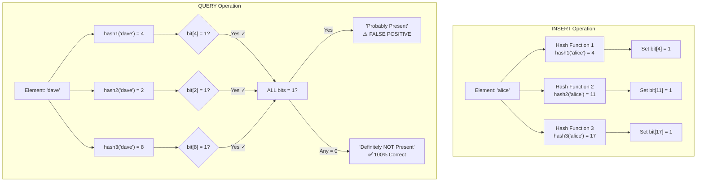
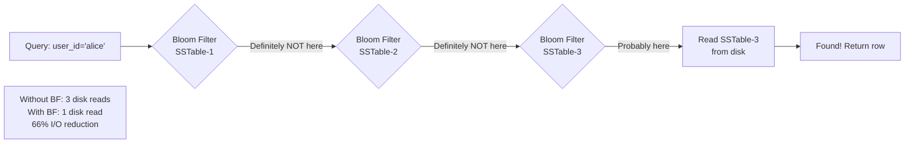

# Bloom Filter — Probabilistic Set Membership

A Bloom Filter answers one question blazingly fast: **"Has this item definitely NOT been seen before?"** It can say "definitely no" with 100% certainty, or "probably yes" — never guarantees existence, but guarantees absence.

> **The core trade-off: use a tiny amount of memory (a bit array) to avoid expensive lookups, at the cost of a small, tunable probability of false positives.**

---

# 1. The Problem Bloom Filters Solve

## Without a Bloom Filter — Expensive Disk Lookups

```text
Scenario: Cassandra has 1 billion rows spread across 50 SSTables on disk.
Query: SELECT * WHERE user_id = 'user_abc_999'

Naive approach:
  Check SSTable 1  → open file, load index, binary search → NOT FOUND (disk I/O!)
  Check SSTable 2  → open file, load index, binary search → NOT FOUND (disk I/O!)
  ...
  Check SSTable 48 → open file, load index, binary search → NOT FOUND (disk I/O!)
  Check SSTable 49 → FOUND! Return data.

Cost: 49 disk I/Os just to find data in SSTable 49
      Even worse if data doesn't exist → reads ALL 50 SSTables!
```

## With a Bloom Filter — Skip Useless Reads

```text
Each SSTable has its own Bloom Filter (fits in memory, ~10 bits per element)

Query: SELECT * WHERE user_id = 'user_abc_999'

  Bloom Filter 1:  "Definitely NOT in SSTable 1" → SKIP (no disk I/O!) ✓
  Bloom Filter 2:  "Definitely NOT in SSTable 2" → SKIP ✓
  ...
  Bloom Filter 48: "Definitely NOT in SSTable 48" → SKIP ✓
  Bloom Filter 49: "Probably in SSTable 49" → READ (1 disk I/O)
  → FOUND!

Cost: 1 disk I/O (instead of 49!)
      Bloom filter check is in-memory, nanoseconds.
```

**Real-world impact: Cassandra, HBase, and RocksDB report 90-99% reduction in unnecessary disk reads.**

---

# 2. What is a Bloom Filter — The Data Structure

A Bloom Filter is **not** a list. It is:
- A **bit array** of `m` bits, all initialized to 0
- `k` different **hash functions**, each mapping any input to a position in the bit array

```text
Bloom Filter (m=20 bits, k=3 hash functions):

Initial state (all zeros):
Index: 0  1  2  3  4  5  6  7  8  9  10 11 12 13 14 15 16 17 18 19
Bits:  0  0  0  0  0  0  0  0  0  0  0  0  0  0  0  0  0  0  0  0
```

---

# 3. How It Works — Step by Step

## Step 1: INSERT "alice"

Run "alice" through all 3 hash functions:
```text
hash1("alice") % 20 = 4     → set bit[4] = 1
hash2("alice") % 20 = 11    → set bit[11] = 1
hash3("alice") % 20 = 17    → set bit[17] = 1

Bit array after inserting "alice":
Index: 0  1  2  3  4  5  6  7  8  9  10 11 12 13 14 15 16 17 18 19
Bits:  0  0  0  0  1  0  0  0  0  0  0  1  0  0  0  0  0  1  0  0
                   ↑                    ↑                   ↑
                  pos4                pos11               pos17
```

## Step 2: INSERT "bob"

```text
hash1("bob") % 20 = 2      → set bit[2] = 1
hash2("bob") % 20 = 8      → set bit[8] = 1
hash3("bob") % 20 = 11     → set bit[11] = 1 (already 1, no change)

Bit array after inserting "alice" and "bob":
Index: 0  1  2  3  4  5  6  7  8  9  10 11 12 13 14 15 16 17 18 19
Bits:  0  0  1  0  1  0  0  0  1  0  0  1  0  0  0  0  0  1  0  0
              ↑     ↑           ↑        ↑                   ↑
            bob  alice         bob   alice+bob             alice
```

## Step 3: CHECK "alice" (should return TRUE)

```text
hash1("alice") % 20 = 4   → bit[4] = 1 ✓
hash2("alice") % 20 = 11  → bit[11] = 1 ✓
hash3("alice") % 20 = 17  → bit[17] = 1 ✓

ALL bits are 1 → "Probably present" ✓ (correct — alice WAS inserted)
```

## Step 4: CHECK "charlie" (was NEVER inserted)

```text
hash1("charlie") % 20 = 2   → bit[2] = 1 ✓ (was set by "bob"!)
hash2("charlie") % 20 = 9   → bit[9] = 0 ✗

bit[9] is 0 → "Definitely NOT present" ✓ (correct — charlie was never inserted)
```

## Step 5: CHECK "dave" — FALSE POSITIVE Example

```text
Suppose:
hash1("dave") % 20 = 4   → bit[4] = 1 (set by "alice")
hash2("dave") % 20 = 2   → bit[2] = 1 (set by "bob")
hash3("dave") % 20 = 8   → bit[8] = 1 (set by "bob")

ALL bits are 1 → "Probably present" ← WRONG! "dave" was never inserted!
This is a FALSE POSITIVE.
```

---

# 4. Mermaid Diagram — Full Flow



---

# 5. The Mathematics — Sizing Your Bloom Filter

## Why False Positives Happen

When many elements are inserted, many bits get set to 1. A new element's hash positions might all accidentally land on bits already set by other elements → false positive.

## Optimal Parameters

```text
Given:
  n = expected number of elements to insert
  p = desired false positive rate (e.g., 0.01 = 1%)

Optimal bit array size (m):
  m = -n * ln(p) / (ln(2))²
  
  Example: n=1,000,000 elements, p=1% false positives
  m = -1,000,000 * ln(0.01) / (0.693)²
  m = -1,000,000 * (-4.605) / 0.480
  m ≈ 9,585,058 bits ≈ 1.14 MB
  
  Compare: HashSet with 1M strings ≈ 50–200 MB!
  Bloom Filter is 100x–200x smaller.

Optimal number of hash functions (k):
  k = (m/n) * ln(2) ≈ 0.693 * (m/n)
  
  Example: m ≈ 9.6M, n=1M
  k = 0.693 * 9.6 ≈ 6.6 → use k=7 hash functions
```

## False Positive Rate Formula

```text
p ≈ (1 - e^(-k*n/m))^k

Intuition:
  More elements (n↑) → more bits set → more collisions → p↑ (worse)
  More bits (m↑) → fewer collisions → p↓ (better)
  Too many hash functions (k too high) → fills bits faster → p↑
  Too few hash functions → weak signal → p↑
  There's an optimal k that minimizes p for given m and n.
```

## Quick Reference Table

```text
False Positive Rate | Bits per Element (m/n) | Hash Functions (k)
0.001 (0.1%)        |        14.4            |        10
0.01  (1%)          |         9.6            |         7
0.05  (5%)          |         6.2            |         4
0.1   (10%)         |         4.8            |         3
0.2   (20%)         |         3.3            |         2

At 1% false positive rate: 9.6 bits per element
A HashSet of 1M strings with avg 50-byte strings: ~400 MB
A Bloom Filter for 1M strings at 1% FPR: 1.14 MB ← 350x smaller
```

---

# 6. Key Properties

```text
✅ CAN DO:
  - Add an element (never fails)
  - Check if element is DEFINITELY NOT in set (100% accurate)
  - Check if element is PROBABLY in set (with tunable error rate)
  - Use tiny memory (bits, not full objects)
  - O(k) constant time for both insert and query
  - No collisions — different elements can share the same bit positions

❌ CANNOT DO:
  - Remove elements (setting bits to 0 might remove other elements!)
  - List all elements
  - Count elements exactly
  - Guarantee existence (only absence)
  - Resize easily (changing m requires rebuilding)
```

---

# 7. Deletion Problem and the Counting Bloom Filter

## Why Standard Bloom Filters Can't Delete

```text
Scenario:
  Insert "alice": sets bits [4, 11, 17] → all to 1
  Insert "bob":   sets bits [2, 8, 11]  → all to 1

  Now try to DELETE "alice" by setting bits [4, 11, 17] → back to 0:
  
  bit[11] was set by BOTH alice AND bob!
  Setting bit[11] = 0 also breaks the "bob" entry!
  
  Now checking "bob" → bit[11] = 0 → "Definitely NOT present" → WRONG!
```

## Counting Bloom Filter (Solution)

```text
Replace each bit with a counter (e.g., 4-bit counter):

Index:    0   1   2   3   4   5   6   7   8   9   10  11  12...
Count:    0   0   0   0   1   0   0   0   1   0   0   2   0...
                           ↑                       ↑    ↑
                         alice                   bob  alice+bob

DELETE "alice": decrement bits [4, 11, 17]
  bit[4]  = 1-1 = 0  (now 0, only alice used this)
  bit[11] = 2-1 = 1  (still 1, bob still uses this!)
  bit[17] = 1-1 = 0

Result: bob is still correctly represented.
Cost: 4x memory per counter vs 1 bit.
```

---

# 8. Java Implementation

```java
import java.util.BitSet;
import java.nio.charset.StandardCharsets;

public class BloomFilter {
    
    private final BitSet bitArray;
    private final int bitArraySize;    // m
    private final int numHashFunctions; // k
    
    /**
     * @param expectedInsertions   n — how many elements you plan to insert
     * @param falsePositiveRate    p — desired false positive probability (0.0 to 1.0)
     */
    public BloomFilter(int expectedInsertions, double falsePositiveRate) {
        this.bitArraySize = optimalBitArraySize(expectedInsertions, falsePositiveRate);
        this.numHashFunctions = optimalHashFunctions(bitArraySize, expectedInsertions);
        this.bitArray = new BitSet(bitArraySize);
        
        System.out.printf("Bloom Filter created: %d bits (%.2f KB), %d hash functions%n",
                bitArraySize, bitArraySize / 8192.0, numHashFunctions);
    }
    
    // m = -n * ln(p) / (ln(2))^2
    private int optimalBitArraySize(int n, double p) {
        return (int) (-n * Math.log(p) / (Math.log(2) * Math.log(2)));
    }
    
    // k = (m/n) * ln(2)
    private int optimalHashFunctions(int m, int n) {
        return Math.max(1, (int) Math.round((double) m / n * Math.log(2)));
    }
    
    public void add(String element) {
        byte[] bytes = element.getBytes(StandardCharsets.UTF_8);
        for (int i = 0; i < numHashFunctions; i++) {
            int position = hash(bytes, i);
            bitArray.set(position);
        }
    }
    
    /**
     * @return false → element is DEFINITELY NOT in the set (100% accurate)
     *         true  → element is PROBABLY in the set (may be false positive)
     */
    public boolean mightContain(String element) {
        byte[] bytes = element.getBytes(StandardCharsets.UTF_8);
        for (int i = 0; i < numHashFunctions; i++) {
            int position = hash(bytes, i);
            if (!bitArray.get(position)) {
                return false; // DEFINITELY not present
            }
        }
        return true; // Probably present (might be false positive)
    }
    
    // Murmur-inspired hash using seed variation
    private int hash(byte[] data, int seed) {
        int h = seed * 0x9747b28c;
        for (byte b : data) {
            h ^= b;
            h *= 0x5bd1e995;
            h ^= h >>> 15;
        }
        return Math.abs(h) % bitArraySize;
    }
    
    public double estimatedFalsePositiveRate(int elementsInserted) {
        // p = (1 - e^(-k*n/m))^k
        double exponent = (double) -numHashFunctions * elementsInserted / bitArraySize;
        return Math.pow(1 - Math.exp(exponent), numHashFunctions);
    }
}
```

## Usage Example

```java
public class BloomFilterDemo {
    public static void main(String[] args) {
        // Create filter for 1M elements at 1% false positive rate
        BloomFilter filter = new BloomFilter(1_000_000, 0.01);
        // Output: Bloom Filter created: 9585058 bits (1173.22 KB), 7 hash functions
        
        // Insert known user IDs
        filter.add("user-alice-123");
        filter.add("user-bob-456");
        filter.add("user-charlie-789");
        
        // Definitive NOT present — skip expensive DB lookup
        System.out.println(filter.mightContain("user-dave-000"));
        // → false — DEFINITELY not in set, skip DB lookup!
        
        // Probably present — do the DB lookup to confirm
        System.out.println(filter.mightContain("user-alice-123"));
        // → true — PROBABLY present, proceed to DB lookup
        
        // Check false positive rate after inserting 3 elements
        System.out.printf("Current FP rate: %.6f%%%n",
                filter.estimatedFalsePositiveRate(3) * 100);
        // → extremely low — very few bits set yet
    }
}
```

## Guava's Built-in Bloom Filter (Production Use)

```java
import com.google.common.hash.BloomFilter;
import com.google.common.hash.Funnels;
import java.nio.charset.StandardCharsets;

// Guava's production-ready implementation:
BloomFilter<String> bloomFilter = BloomFilter.create(
    Funnels.stringFunnel(StandardCharsets.UTF_8),
    1_000_000,    // expected insertions
    0.01          // 1% false positive probability
);

bloomFilter.put("user-alice-123");
bloomFilter.put("user-bob-456");

boolean mightExist = bloomFilter.mightContain("user-dave-000");
// false → skip DB lookup

// Serialize to disk (persist across restarts)
try (OutputStream os = new FileOutputStream("bloom.bin")) {
    bloomFilter.writeTo(os);
}

// Deserialize
try (InputStream is = new FileInputStream("bloom.bin")) {
    BloomFilter<String> restored = BloomFilter.readFrom(is,
        Funnels.stringFunnel(StandardCharsets.UTF_8));
}
```

---

# 9. Real-World Use Cases

## Use Case 1: Database Read Optimization (Cassandra, HBase, RocksDB)



## Use Case 2: Cache "Negative Caching" — Preventing Cache Penetration

```text
Problem: "Cache Penetration Attack"
  Attacker sends thousands of requests for non-existent user IDs
  → Each misses Redis cache
  → Each hits the database
  → Database gets overwhelmed

Solution with Bloom Filter:
  Load all valid user IDs into Bloom Filter at startup (or incrementally)
  
  Request: GET /users/fake-id-12345
  → Bloom Filter: "Definitely NOT in our user DB"
  → Return 404 immediately — no cache, no DB hit!
  
  Request: GET /users/real-id-alice
  → Bloom Filter: "Probably valid"
  → Check Redis cache first, then DB if needed
  
Used by: Alibaba, ByteDance, JD.com (huge e-commerce scale cache protection)
```

## Use Case 3: URL Deduplication (Web Crawlers)

```text
Google, Bing crawlers visit billions of URLs:
  Problem: "Have I already crawled this URL before?"
  Storing all visited URLs → terabytes of data

Bloom Filter approach:
  Use a Bloom Filter to track visited URLs
  Before crawling a new URL:
    mightContain(url) = false → DEFINITELY new → crawl it, add to filter
    mightContain(url) = true  → probably already crawled → skip
  
  1 billion URLs × 10 bits = 10 billion bits = ~1.2 GB (vs hundreds of GB for full set)
  False positive rate: occasionally re-crawl an already-seen page → acceptable
```

## Use Case 4: Network Packet Deduplication

```text
CDN Edge Nodes (Akamai, Cloudflare):
  Problem: Client resends same HTTP request if no response (network jitter)
           Processing duplicate POST/payment requests is dangerous!
  
  Bloom Filter on request IDs:
    mightContain(request_id) = false → definitely new → process it
    mightContain(request_id) = true  → possibly duplicate → check idempotency key in DB
  
  Most duplicate detection is done in-memory (Bloom Filter) without DB lookup.
```

## Use Case 5: Malicious URL / Phishing Detection

```text
Google Safe Browsing API:
  Server maintains Bloom Filter of known malicious URLs (billions)
  Browser downloads a compact Bloom Filter (few MB)
  Every URL you visit is checked locally:
    mightContain(url) = false → safe, proceed (no server call!)
    mightContain(url) = true  → check with Google server for confirmation
  
  Result: 99%+ of URL checks happen locally, no privacy leak to Google.
  1% false positive → extra server call (acceptable cost)
```

## Use Case 6: Distributed System — Preventing Unnecessary RPCs

```text
Scenario: Order Service needs to check if a product exists in Inventory Service

Without Bloom Filter:
  Every product check → network call to Inventory Service → 5-20ms latency

With Bloom Filter (pre-loaded from Inventory DB at startup):
  "product-xyz-999" → mightContain = false → product doesn't exist, 404 immediately
  "product-iphone-15" → mightContain = true → call Inventory Service to confirm
  
  Eliminates ~80% of unnecessary RPCs for non-existent product queries.
```

---

# 10. Where Bloom Filters Are Used in Production Systems

```text
System              | What It Filters                          | Notes
--------------------|------------------------------------------|------------------------------------------
Apache Cassandra    | Which SSTable contains a partition key   | Per-SSTable filter, checked before disk
HBase               | Which HFile contains a row key           | Reduces HDFS reads
RocksDB / LevelDB   | Which SST file contains a key           | Critical for read performance
Google BigTable     | Per-tablet Bloom filter                  | Described in original 2006 paper
Apache Kafka        | Partition reassignment tracking          | Prevents redundant partition checks
Redis (4.0+)        | Optional module: RedisBloom              | Explicit bloom filter data type
Ethereum / Bitcoin  | SPV wallets: which tx belong to you      | Wallet doesn't expose all addresses
PostgreSQL          | pg_bloom index extension                 | Alternative index for high-cardinality
Chromium Browser    | Safe Browsing URL check                  | Local lookup before server query
Akamai CDN          | Duplicate request detection              | Edge node deduplication
```

---

# 11. Bloom Filter vs Other Data Structures

```text
Structure        | Memory      | Insert | Lookup  | Delete | Exact?
-----------------|-------------|--------|---------|--------|--------
HashSet          | High (MB+)  | O(1)   | O(1)    | Yes    | Yes ✓
Sorted Array     | Medium      | O(n)   | O(log n)| Yes    | Yes ✓
Bloom Filter     | Very Low    | O(k)   | O(k)    | No*    | No (FP)
Cuckoo Filter    | Low         | O(1)   | O(1)    | Yes    | No (FP)
Counting BF      | Low-Medium  | O(k)   | O(k)    | Yes    | No (FP)

*Counting Bloom Filter supports deletion
k = number of hash functions (constant, typically 7)

Choose Bloom Filter when:
  ✓ Memory is scarce
  ✓ You need to answer "definitely not present" quickly
  ✓ You can tolerate rare false positives
  ✓ Deletions are rare or unnecessary (or use Counting BF)
  ✓ Data set is huge (millions to billions)
```

---

# 12. Bloom Filter Limitations and When NOT to Use It

```text
❌ Don't use Bloom Filter when:
  - You need exact answers (financial systems, security-critical validation)
  - You need to enumerate or list elements
  - You need to count exact occurrences (use CountMinSketch instead)
  - The set is small enough to fit in a HashSet
  - False positives cause expensive or incorrect downstream operations

⚠️ Design pitfalls:
  - Bloom Filter fills up over time → false positive rate rises
    Fix: pre-compute expected n, set m accordingly
         If n grows beyond estimate → rebuild (offline)
         Or use a Scalable Bloom Filter (automatically grows)
  
  - You can't resize: changing m invalidates all inserted elements
    Fix: use a partitioned/scalable variant
  
  - Not thread-safe by default
    Fix: Java's CopyOnWriteArrayList approach or AtomicBitSet
         Or use Guava's BloomFilter which is thread-safe for reads
```

---

# 13. Interview Preparation — Bloom Filters

## Q1: What is a Bloom Filter and what guarantees does it provide?

**Answer:**

A Bloom Filter is a space-efficient probabilistic data structure that tests set membership. It uses a bit array + k hash functions.

Guarantees:
- **If it returns false** → the element is **definitely NOT** in the set. 100% accurate.
- **If it returns true** → the element is **probably** in the set. There is a tunable probability of a false positive.
- **No false negatives ever** — it never says "not present" when something was actually inserted.

This asymmetry is extremely useful: you can use the "definitely not present" answer to skip expensive operations entirely.

## Q2: How does Cassandra use Bloom Filters?

**Answer:**

Cassandra stores data in SSTables (immutable sorted files on disk). Over time, there can be dozens of SSTables per table. For a read query, Cassandra needs to find which SSTable contains the requested partition key.

Without Bloom Filters, it would have to do a binary search in every SSTable's index file — that's many disk I/Os. With Bloom Filters (one per SSTable, loaded in memory), Cassandra first asks each filter: "Is this partition key probably in you?" If the filter says "definitely not" (returns false), that SSTable is skipped entirely. Only SSTables that say "probably yes" are actually read from disk.

This reduces disk I/Os by 80-99% for typical workloads.

## Q3: Why can't you delete from a Bloom Filter?

**Answer:**

Because multiple elements share bits. When you insert "alice," you set 3 bits at positions [4, 11, 17]. If "bob" also set bit 11, you can't clear bit 11 when deleting "alice" — that would break "bob's" entry.

The Counting Bloom Filter solves this: replace each bit with a counter. Incrementing on insert, decrementing on delete. This uses ~4x more memory but supports deletion.

## Q4: What's the difference between a Bloom Filter and a HashSet?

**Answer:**

| Aspect | HashSet | Bloom Filter |
|---|---|---|
| Memory | Stores the actual elements | Only bits — no actual data stored |
| Exact membership | Yes, 100% accurate | Probabilistic — false positives possible |
| Deletion | Yes | No (standard) |
| Typical memory for 1M strings | 50-200 MB | ~1.2 MB (at 1% FPR) |
| Use case | Exact lookups, enumeration | Filtering, avoiding expensive operations |

Choose Bloom Filter when memory matters more than exactness, and when false positives are tolerable (just lead to extra verification, not incorrect results).

## Q5: How do you tune a Bloom Filter for production?

**Answer:**

Two inputs determine everything:
1. **n** — expected number of elements to insert (estimate from data volume)
2. **p** — desired false positive rate (business requirement: 0.1%? 1%? 5%?)

From these: `m = -n * ln(p) / (ln2)²` gives bit array size, and `k = (m/n) * ln(2)` gives optimal hash functions.

In practice: use a library (Guava's `BloomFilter.create(funnel, n, p)`) which handles the math. Monitor the actual false positive rate in production using metrics and adjust p upward (larger filter) if needed. Rebuild the filter periodically if the element count grows beyond the original estimate.
