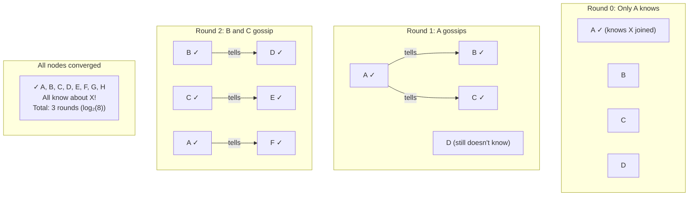
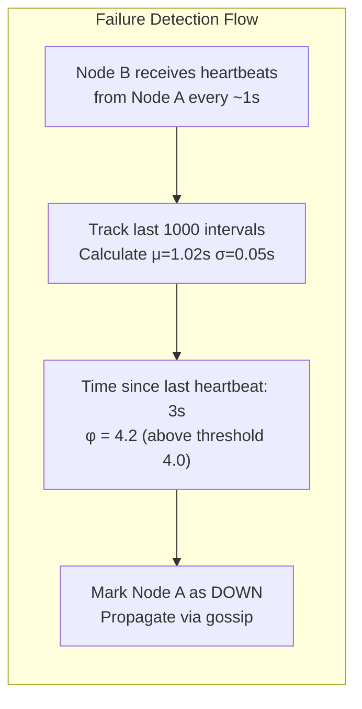
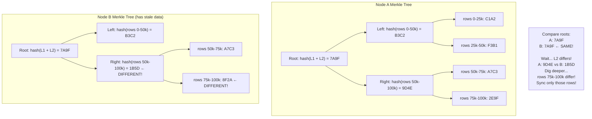
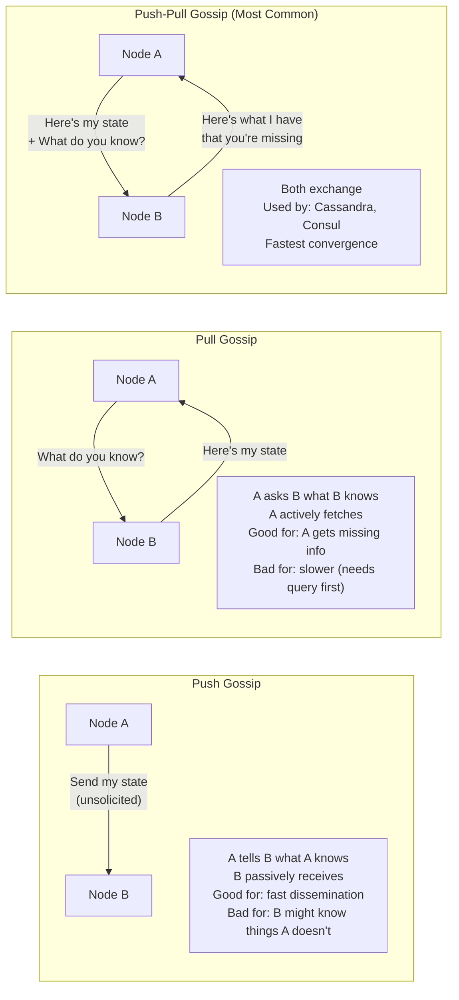
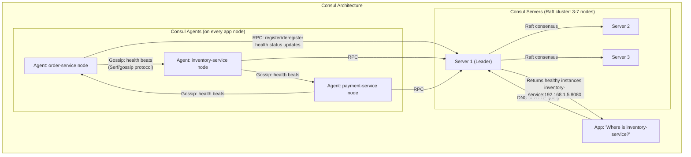
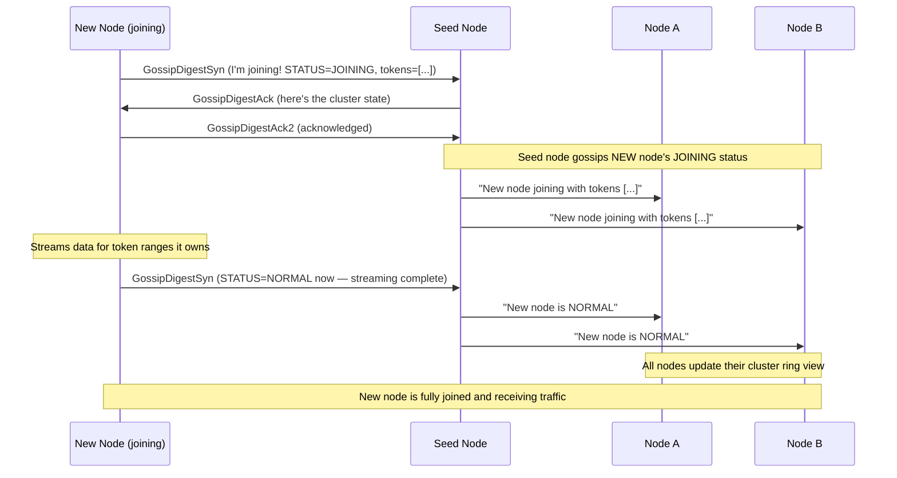

# Gossip Protocol, Anti-Entropy, and Service Discovery

Gossip Protocol is how distributed systems spread information — like a rumor spreading through an office. Every node periodically tells a few random neighbors what it knows. Eventually, everyone knows everything. This doc covers gossip, anti-entropy (gossip's cousin for data sync), and how gossip compares to dedicated service discovery.

> **The key insight: in a cluster of N nodes, gossip reaches all nodes in O(log N) rounds with NO central coordinator — just nodes talking to each other randomly.**

---

# 1. The Problem: Propagating Information in a Distributed System

```text
You have a 100-node Cassandra cluster. Node-7 detects that Node-42 is down.
Node-7 needs to tell the other 99 nodes: "Hey, Node-42 is dead."

Option A: Node-7 broadcasts to all 99 nodes simultaneously
  → 99 network messages all at once
  → If cluster grows to 10,000 nodes: 9,999 messages at once
  → Each new event → thundering herd problem
  → Doesn't scale

Option B: Central coordinator (Master knows all node status)
  → Single point of failure
  → Coordinator becomes bottleneck at scale
  → If coordinator is down, no state propagation

Option C: Gossip Protocol
  → Node-7 tells 3 random nodes
  → Each of those tells 3 random nodes
  → Within log₃(100) ≈ 4 rounds, all 100 nodes know
  → Fully decentralized, resilient, scalable
```

---

# 2. Gossip Protocol — How It Works

## The Core Algorithm

```text
Every node runs this loop (typically every 1 second):

1. Pick k random peers from the cluster membership list (k = fanout, typically 3)
2. Send your local state (what you know) to each peer:
   - Your own health status
   - Your knowledge of other nodes' status
   - Any metadata you're propagating
3. Receive their state
4. Merge received state with your own (take the "newest" version)
5. Sleep (interval). Repeat.

This is it. No leader. No voting. Just periodic random talking.
```

## Visual: Round-by-Round Propagation

```text
Cluster: 8 nodes (A, B, C, D, E, F, G, H)
Event: Node A learns "Node X has joined the cluster"
Fanout = 2 (each node tells 2 random peers)

Round 0 (T=0s): Only A knows about X
  Knows about X: [A]

Round 1 (T=1s): A gossips to B, C
  A → B: "X joined"   B now knows
  A → C: "X joined"   C now knows
  Knows about X: [A, B, C]

Round 2 (T=2s): A,B,C each gossip to 2 random peers
  B → D, E: "X joined"    D, E now know
  C → F, G: "X joined"    F, G now know
  A → B, H: "X joined"    H now knows (B already knew)
  Knows about X: [A, B, C, D, E, F, G, H] — ALL 8 NODES! ✓

Convergence time: O(log₂(N)) rounds = very fast even for huge clusters
For N=1,000,000 nodes: ~20 rounds to reach everyone
```

## Mermaid: Gossip Round-by-Round



---

# 3. Gossip Message Format

## What Gets Gossiped

```text
Gossip message (simplified):
{
  "from": "node-7",
  "timestamp": "2024-01-15T10:30:00.000Z",
  "states": {
    "node-1": { "status": "UP",   "generation": 1704000000, "heartbeat": 10230 },
    "node-2": { "status": "UP",   "generation": 1704000000, "heartbeat": 10229 },
    "node-7": { "status": "UP",   "generation": 1704000000, "heartbeat": 10231 },
    "node-42": { "status": "DOWN", "generation": 1703999000, "heartbeat": 8012 },
    ...
  }
}
```

```text
Key fields:
  generation:  Timestamp when this node last started (restarted nodes get new generation)
               Used to distinguish "same node, different restart" from "new node"
  heartbeat:   Counter incremented each gossip round
               If heartbeat stops incrementing → node suspected dead
  status:      UP, DOWN, LEAVING, JOINING, etc.

Merge rule: take the state with the HIGHEST (generation, heartbeat) pair
            → newer info wins
```

## Three Types of Gossip Messages (Cassandra)

```text
GossipDigestSyn  → "Here's a summary of what I know" (small: just generation+heartbeat per node)
GossipDigestAck  → "Here's the full data for nodes where your info is stale"
GossipDigestAck2 → "Here's data you asked for that I have and you don't"

This 3-way exchange minimizes network: don't send full state unless needed.
```

---

# 4. Failure Detection via Gossip (Phi Accrual)

## The Heartbeat Problem

```text
Node A gossips heartbeat to Node B every 1 second.
How long should B wait before declaring A as "dead"?

Naive threshold:  "If no heartbeat in 5 seconds → DEAD"
Problem:          Network jitter can delay packets for 3-4 seconds
                  → False positives: healthy nodes declared dead
                  → Triggers unnecessary rebalancing/repair

Better: Phi Accrual Failure Detector (used by Cassandra, Akka)
```

## Phi Accrual Failure Detector

```text
Instead of binary UP/DOWN, compute a suspicion level φ (phi):

φ = 0.0   → almost certain the node is UP
φ = 1.0   → ~10% probability of failure
φ = 5.0   → ~99.3% probability of failure  ← Cassandra default threshold
φ = 10.0  → ~99.999% probability of failure ← Akka default

Algorithm:
  1. Track the last 1000 inter-arrival times of heartbeats from each node
  2. Compute mean (μ) and standard deviation (σ) of these intervals
  3. φ = -log₁₀(1 - CDF((now - lastHeartbeat), μ, σ))
  
  If network is jittery (high σ): φ rises slowly → fewer false positives
  If network is stable (low σ): φ rises quickly → faster failure detection
  
  Adapts to network conditions automatically!
```



---

# 5. Anti-Entropy Protocol

## What is Anti-Entropy?

Anti-entropy is a specific gossip-based mechanism where nodes **compare and synchronize their actual data**, not just metadata/status. While regular gossip spreads "who is alive," anti-entropy spreads "do we have the same data?"

> **Entropy = disorder. Anti-entropy = actively reducing disorder (inconsistency) in replicated data.**

```text
Regular Gossip:    "Node 7 is UP with heartbeat 10,231"
Anti-Entropy:      "I have user-alice with value V3 at timestamp T5. Do you have the same?"
                   → If you have V2 at T3 → I'll send you V3 to update you
```

## Why Anti-Entropy is Needed

```text
Scenario: Cassandra with replication factor 3
  Nodes: A, B, C (all replicas for partition key "user-alice")

Normal write (W=2, quorum):
  Client writes user-alice → "active" to A and B (quorum = 2 of 3)
  C is SLOW or temporarily unreachable → missed the write
  
  Now: A has "active", B has "active", C has OLD value "pending"
  
  C comes back online → C still has stale "pending"
  Without anti-entropy: C's stale data stays FOREVER
  With anti-entropy: repair process detects and fixes the inconsistency
```

## Anti-Entropy Using Merkle Trees (How Cassandra Does It)

```text
A Merkle Tree is a tree of hashes:
  - Leaf nodes: hash of actual data (a row range or token range)
  - Parent nodes: hash of children's hashes
  - Root: single hash representing the ENTIRE dataset state

Two nodes are in sync IF AND ONLY IF their Merkle tree roots are equal.
```



```text
Anti-Entropy Repair Process:
1. Node A and Node B exchange their Merkle tree ROOTS
2. If roots match: DONE. Data is in sync. (most common case — fast!)
3. If roots differ: compare one level down
4. Recurse until you find the specific leaf nodes (row ranges) that differ
5. Sync only the differing ranges

Efficiency:
  Without Merkle: must compare every single row → O(n) data transfer
  With Merkle:    compare hashes top-down → O(log n) messages to find diff
                  Then transfer ONLY the differing ranges
  
  For 1M rows where 100 are stale: transfer ~100 rows, not 1M rows.
```

## Anti-Entropy in Cassandra: nodetool repair

```bash
# Trigger manual anti-entropy repair on a node
nodetool repair keyspace_name table_name

# Full repair (all token ranges)
nodetool repair -full

# Incremental repair (only unreaired data since last repair)
nodetool repair --incremental

# What happens:
# 1. Coordinator contacts all replicas for each token range
# 2. Each replica builds a Merkle tree of its data
# 3. Trees are compared, differences identified
# 4. Streaming: nodes exchange missing/stale rows
# 5. After repair: all replicas have consistent data
```

## Read Repair (Inline Anti-Entropy)

```text
Cassandra also does anti-entropy DURING reads:

Client reads user-alice with consistency level ALL (read from all replicas):
  Node A returns: user-alice → "active", timestamp=T5
  Node B returns: user-alice → "active", timestamp=T5
  Node C returns: user-alice → "pending", timestamp=T3  ← STALE!

Coordinator detects mismatch:
  Returns T5 "active" to client (newest wins)
  In background: sends write of T5 "active" to Node C → C is now up to date

This is called Read Repair.
  → Small overhead per read (background write to stale replicas)
  → Cassandra does this probabilistically (read_repair_chance = 10% by default)
  → Ensures data stays consistent without explicit repair scheduling
```

---

# 6. Gossip Variants: Push, Pull, Push-Pull



---

# 7. Gossip Protocol vs Service Discovery

This is a critical distinction many engineers confuse.

## What Each Does

```text
Gossip Protocol:
  WHAT:  A low-level mechanism for information dissemination
  HOW:   Periodic random peer-to-peer message exchange
  SCOPE: Any information: node health, cluster membership, configuration updates
  OUTPUT: Eventually consistent cluster-wide view of some state
  
Service Discovery:
  WHAT:  A high-level capability: "Where is service X right now?"
         "What instances of order-service are UP and available?"
  HOW:   Can use gossip internally, but provides a structured API/query interface
  OUTPUT: Queryable registry of services with their addresses/health

Gossip is a MECHANISM. Service Discovery is a CAPABILITY.
Service Discovery systems often USE gossip as their propagation mechanism.
```

## Side-by-Side Comparison

```text
Dimension           | Gossip Protocol             | Service Discovery
--------------------|-----------------------------|-----------------------------------------
Nature              | Communication mechanism     | Capability / feature / system
What it answers     | "What does everyone know?"  | "Where is service X? Is it healthy?"
Data type           | Any state, health vectors   | Service name → IP:port + health
Client interface    | Peer-to-peer, no standard API| REST API, DNS, gRPC
Storage             | Distributed (each node stores)| Central registry or distributed store
Implementations     | Used inside Consul, Cassandra | Consul, Eureka, Kubernetes DNS, etcd
Central coordinator | No — decentralized          | Usually yes (or Raft-replicated cluster)
Consistency         | Eventually consistent        | Usually strongly consistent (Raft/Paxos)
Scale               | Excellent (logarithmic)      | Good (Raft limited to ~7 nodes in cluster)
Primary use         | Membership, failure detection| Load balancing, routing, circuit breaking
```

## How They Work Together (Consul Example)



```text
Gossip layer (Serf):       Spreads node health between agents → fast failure detection
Raft layer (Consul Servers): Strong consistency for the service registry
Query interface:           REST API (GET /v1/catalog/service/inventory-service) or DNS

Gossip handles: "Is this agent alive?" (fast, eventually consistent)
Raft handles:   "What services are registered?" (slow but strongly consistent)
```

## Real Systems and Which They Are

```text
System          | Type                        | Gossip Used?      | Notes
----------------|-----------------------------|--------------------|-------------------------------
Consul          | Service Discovery System    | Yes (Serf/gossip)  | Gossip for agents, Raft for registry
Eureka          | Service Discovery System    | No                 | Client-side heartbeats to central server
Kubernetes DNS  | Service Discovery System    | No                 | CoreDNS + etcd (Raft)
Cassandra       | Database (uses gossip)      | Yes (core gossip)  | Cassandra's gossip IS its membership
DynamoDB        | Database (uses gossip)      | Yes internally     | AWS managed, gossip internal
Redis Cluster   | Database (uses gossip)      | Yes (gossip bus)   | Node-to-node gossip for cluster state
Akka Cluster    | Actor framework             | Yes (Phi accrual)  | Gossip-based membership
Etcd            | Distributed KV / Config     | No (Raft only)     | Pure Raft, no gossip — strongly consistent
```

---

# 8. Gossip in Cassandra — Full Detail

## Cassandra's Gossip Implementation

```text
Every Cassandra node runs gossip every 1 second:

GossipTask runs:
  1. Pick 1 random LIVE node → send GossipDigestSyn
  2. Pick 1 random node from UNREACHABLE list (if any) → probe if it's back
  3. With 1/(cluster size) probability, pick a SEED node → ensure connectivity
  
Cassandra gossip payload (EndpointState):
  HeartBeatState:
    generation: 1704000000  (node start time — monotonically increasing)
    version:    10231       (incremented each gossip round)
  
  ApplicationState (per node):
    STATUS:    NORMAL / LEAVING / REMOVING / ...
    DC:        "us-east-1"
    RACK:      "rack1"
    SCHEMA:    "abc123def"   (schema version for schema propagation)
    LOAD:      "15000000"   (bytes of data this node has)
    TOKENS:    "-9223372036854775808,-7378697629483820646,..."  (token ring positions)
    HOST_ID:   "uuid-..."
```

## How Node Join Works via Gossip



---

# 9. Gossip Performance Characteristics

```text
Messages per round:
  Each node sends gossip to k peers (k = fanout, typically 3)
  Total messages per second = N × k × (1/interval)
  
  Example: N=1000 nodes, k=3, interval=1s
  Total messages/second = 1000 × 3 = 3000 gossip messages/second
  Each message ≈ 2-4 KB
  Total gossip bandwidth = 3000 × 3 KB = 9 MB/second cluster-wide
  Per node: 9 KB/second (negligible!)

Convergence time:
  Rounds to reach all N nodes: log_k(N)
  For N=10,000 nodes, k=3: log₃(10,000) ≈ 8.4 rounds ≈ 9 seconds
  
  This is called "epidemic spreading" — same math as disease propagation
  
Fault tolerance:
  Gossip continues as long as some nodes remain connected
  Even if 40% of nodes are down: remaining 60% still converge correctly
  No single point of failure (unlike centralized registry)
```

---

# 10. Java Code — Simulating Gossip Protocol

```java
import java.util.*;
import java.util.concurrent.*;
import java.util.concurrent.atomic.AtomicInteger;

public class GossipNode {
    
    private final String nodeId;
    private final Map<String, NodeState> clusterView = new ConcurrentHashMap<>();
    private final List<GossipNode> allNodes;
    private final Random random = new Random();
    private final ScheduledExecutorService scheduler = Executors.newSingleThreadScheduledExecutor();
    
    private static final int FANOUT = 3;           // talk to 3 random peers
    private static final int INTERVAL_MS = 1000;  // every 1 second
    
    public GossipNode(String nodeId, List<GossipNode> allNodes) {
        this.nodeId = nodeId;
        this.allNodes = allNodes;
        this.clusterView.put(nodeId, new NodeState(nodeId, "UP", 0));
    }
    
    public void start() {
        scheduler.scheduleAtFixedRate(this::gossip, 0, INTERVAL_MS, TimeUnit.MILLISECONDS);
    }
    
    private void gossip() {
        // Increment our own heartbeat
        clusterView.get(nodeId).incrementHeartbeat();
        
        // Pick FANOUT random peers (not ourselves)
        List<GossipNode> peers = getRandomPeers(FANOUT);
        
        // Push-Pull: send our state, receive theirs
        for (GossipNode peer : peers) {
            Map<String, NodeState> peerState = peer.receiveGossip(clusterView);
            mergeState(peerState);
        }
    }
    
    // Called by gossiping peers — returns our current state
    public Map<String, NodeState> receiveGossip(Map<String, NodeState> incomingState) {
        mergeState(incomingState);
        return new HashMap<>(clusterView); // return our state for push-pull
    }
    
    private void mergeState(Map<String, NodeState> incoming) {
        for (Map.Entry<String, NodeState> entry : incoming.entrySet()) {
            String nodeId = entry.getKey();
            NodeState incomingNodeState = entry.getValue();
            
            clusterView.merge(nodeId, incomingNodeState, (existing, incoming2) ->
                // Keep the state with higher heartbeat (newer information wins)
                incoming2.heartbeat > existing.heartbeat ? incoming2 : existing
            );
        }
    }
    
    private List<GossipNode> getRandomPeers(int count) {
        List<GossipNode> peers = new ArrayList<>(allNodes);
        peers.removeIf(n -> n.nodeId.equals(this.nodeId));
        Collections.shuffle(peers, random);
        return peers.subList(0, Math.min(count, peers.size()));
    }
    
    public void learnAbout(String targetNodeId, String status) {
        // Inject new information into this node's view
        // Will propagate to all others via gossip
        clusterView.put(targetNodeId, new NodeState(targetNodeId, status, 999));
        System.out.printf("[%s] Learned: %s is now %s%n", nodeId, targetNodeId, status);
    }
    
    public boolean knowsAbout(String targetNodeId) {
        return clusterView.containsKey(targetNodeId);
    }
    
    public void printState() {
        System.out.printf("[%s] Cluster view: %s%n", nodeId, clusterView);
    }
    
    static class NodeState {
        String nodeId;
        String status;
        AtomicInteger heartbeat;
        
        NodeState(String nodeId, String status, int heartbeat) {
            this.nodeId = nodeId;
            this.status = status;
            this.heartbeat = new AtomicInteger(heartbeat);
        }
        
        void incrementHeartbeat() { heartbeat.incrementAndGet(); }
        
        @Override
        public String toString() {
            return String.format("{%s: %s, hb=%d}", nodeId, status, heartbeat.get());
        }
    }
}
```

```java
// Simulation
public class GossipSimulation {
    public static void main(String[] args) throws InterruptedException {
        List<GossipNode> nodes = new ArrayList<>();
        
        // Create 10 nodes
        for (int i = 1; i <= 10; i++) {
            nodes.add(new GossipNode("node-" + i, nodes));
        }
        
        // Start all nodes
        nodes.forEach(GossipNode::start);
        
        // Inject an event into node-1: "node-11 has joined!"
        Thread.sleep(100); // let nodes initialize
        nodes.get(0).learnAbout("node-11", "UP");
        System.out.println("Event injected into node-1");
        
        // Check propagation over time
        for (int round = 1; round <= 5; round++) {
            Thread.sleep(1000);
            long nodesKnowing = nodes.stream()
                    .filter(n -> n.knowsAbout("node-11"))
                    .count();
            System.out.printf("After %d second(s): %d/%d nodes know about node-11%n",
                    round, nodesKnowing, nodes.size());
        }
        
        // After ~4 seconds: all 10 nodes know about node-11
        // O(log₃(10)) ≈ 2.1 rounds to converge
    }
}
```

---

# 11. Where Gossip Is Used in Production Systems

```text
System          | What Gossip Propagates                       | Details
----------------|----------------------------------------------|----------------------------------
Cassandra       | Node status, token ring, schema versions     | Custom gossip, 1 round/second
DynamoDB        | Node membership, partition assignments        | AWS internal, not disclosed
Redis Cluster   | Cluster topology, hash slot assignments      | Ping/Pong messages, fanout=1
Consul          | Agent health, node status                    | Serf (open source gossip library)
Riak            | Ring membership, bucket properties           | Custom gossip over HTTP
Akka Cluster    | Member status, leader election hints         | Phi accrual failure detector
Bitcoin         | Transaction, block propagation               | Gossip between full nodes
Ethereum        | Block and transaction propagation            | devp2p protocol
```

---

# 12. Interview Preparation — Gossip Protocol

## Q1: What is the Gossip Protocol and what problem does it solve?

**Answer:**

Gossip Protocol is a communication mechanism where each node periodically selects a few random peers and exchanges state information. It solves the problem of propagating information across large distributed systems without any central coordinator.

The alternative — broadcasting to all nodes or using a central coordinator — doesn't scale: broadcasting causes O(N) messages per event and a coordinator is a single point of failure. Gossip achieves O(log N) convergence time with O(N) total messages but spread over time, is fully decentralized, and handles node failures gracefully.

## Q2: What is anti-entropy and how does it differ from regular gossip?

**Answer:**

Regular gossip propagates **metadata** — which nodes are alive, cluster membership, configuration changes. It tells nodes ABOUT the cluster state.

Anti-entropy propagates **actual data** — it synchronizes the data stored on replicas that may have diverged. Anti-entropy uses Merkle trees: nodes compare tree hashes top-down to efficiently find which data ranges differ, then stream only the differing data.

Cassandra's `nodetool repair` triggers anti-entropy repair, using Merkle tree comparison to find stale data on replicas and sync them. It's also done inline during reads (Read Repair) when the coordinator detects different replicas returning different values.

## Q3: How does Gossip Protocol differ from Service Discovery?

**Answer:**

Gossip is a **mechanism** (how to spread information). Service Discovery is a **capability** (find where service X is running).

Service Discovery systems like Consul USE gossip internally (the Serf library) for fast failure detection between agents. But the actual service registry (which services are registered, their addresses, health check results) is maintained using strong consistency (Raft in Consul's case).

So: gossip answers "are these nodes alive?" with eventual consistency. Service discovery answers "which instances of order-service are healthy right now?" with strong consistency (for correctness in routing).

## Q4: How does Cassandra use gossip?

**Answer:**

Cassandra runs a GossipTask every second on every node. Each round:
1. Pick 1 random live node, send GossipDigestSyn (summary of what we know)
2. Receive GossipDigestAck (missing info the peer has) and send Ack2 (complete exchange)
3. Pick 1 unreachable node and probe it (to detect recovery)
4. With small probability, pick a seed node (bootstraps connectivity in new nodes)

What's gossiped: generation number, heartbeat counter, token ring positions, node status (NORMAL/JOINING/LEAVING), datacenter/rack placement, schema version.

This lets Cassandra operate with NO master: any node can answer queries about the ring, coordinate requests to the correct replicas, and detect node failures — all from the gossiped cluster view.

## Q5: What is the Phi Accrual failure detector?

**Answer:**

The Phi Accrual Failure Detector replaces binary UP/DOWN with a continuous suspicion value φ (phi). Instead of "if no heartbeat in 5 seconds → declare dead," it:

1. Tracks the last N inter-arrival times of heartbeats from each peer
2. Models arrival times as a probability distribution (normal distribution)
3. Computes φ = how many standard deviations the current pause is from normal

When φ exceeds a threshold (Cassandra default: 8, Akka default: 10), the node is declared dead. The key advantage: φ adapts to network conditions. Jittery networks have high variance → φ rises slowly → fewer false positives. Stable networks → φ rises quickly → faster failure detection.
