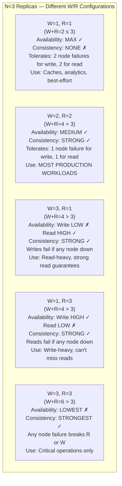
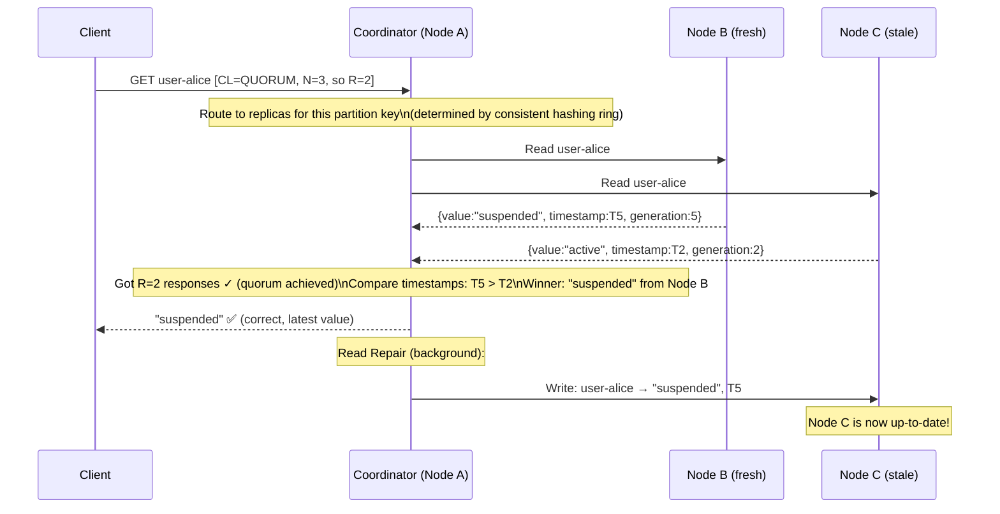
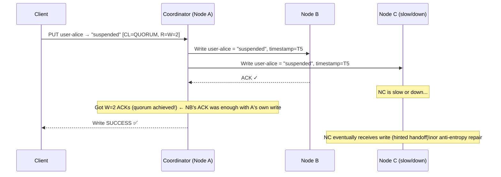
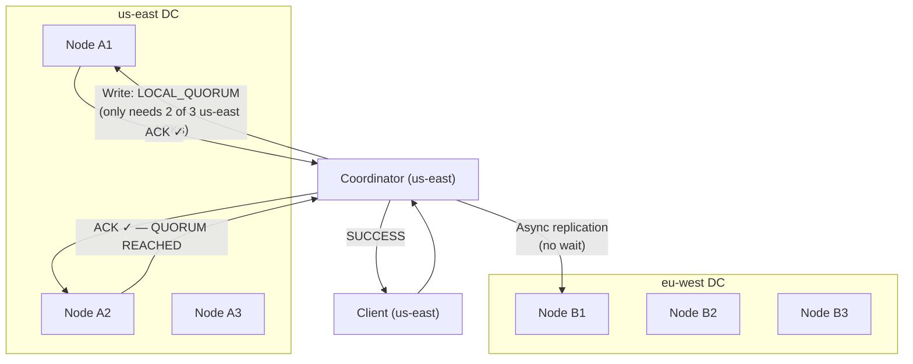

# Quorum Consensus — How Distributed Systems Agree on Truth

Quorum is the answer to: *"If I have 3 replicas and one has stale data, how do I guarantee the client always gets the correct answer?"* It is the core mechanism behind Cassandra's consistency levels, DynamoDB's read/write modes, and Raft's leader election.

> **The key formula: W + R > N. If the number of nodes you write to (W) plus the number you read from (R) exceeds the total replicas (N), at least one node in your read set must have seen the latest write. Overlap = consistency.**

---

# 1. The Problem Quorum Solves

```text
Setup: 3 replicas for key "user-alice" (N=3)
       Nodes: A, B, C

Event: Node C goes down. Write comes in:
  Client: PUT user-alice → "suspended"
  Written to: A ✓, B ✓, C ✗ (down)
  
Now Node C comes back up (with stale data "active"):
  A: user-alice = "suspended"  (latest)
  B: user-alice = "suspended"  (latest)
  C: user-alice = "active"     (STALE)
  
Next read. Where does it land?
  Read from C only → "active" ← WRONG stale answer!
  Read from A+B    → "suspended" ← correct
  Read from A+C    → see mismatch → return "suspended" (newest wins)
  Read from B+C    → see mismatch → return "suspended" (newest wins)

Key insight: if you read from at least 2 nodes (R=2), and you wrote to at least 2 (W=2),
             there is guaranteed overlap — at least one node has the latest write.
             W(2) + R(2) > N(3) → 2+2=4 > 3 → GUARANTEED overlap of at least 1 node.
```

---

# 2. The Quorum Formula: W + R > N

```text
N = total number of replicas
W = number of replicas that must confirm a WRITE before it's considered successful
R = number of replicas that must respond to a READ before returning data

The golden rule:  W + R > N  →  strong consistency (always see latest write)
                  W + R ≤ N  →  eventual consistency  (may see stale data)

Intuition: 
  You write to W nodes.
  You read from R nodes.
  If W+R > N, the write set and read set MUST overlap by at least 1 node.
  That 1 overlapping node has the latest value.
  Compare timestamps across R responses → newest wins.
```

## Visual Overlap Proof

```text
N=3 nodes: [A] [B] [C]

Case 1: W=2, R=2 (W+R=4 > N=3) → STRONG CONSISTENCY
  Write to: {A, B}         ← 2 nodes have new value
  Read from: {B, C}        ← B is in both sets! B has latest.
  
  OR:
  Write to: {A, B}
  Read from: {A, C}        ← A is in both sets! A has latest.
  
  ANY combination of 2 write + 2 read nodes MUST overlap at least once.
  Coordinator compares timestamps → returns latest.

Case 2: W=1, R=1 (W+R=2 ≤ N=3) → EVENTUAL CONSISTENCY (stale possible)
  Write to: {A}            ← only A has new value
  Read from: {C}           ← no overlap! C has stale value.
  → Client gets stale data ❌

Case 3: W=3, R=1 (W+R=4 > N=3) → STRONG CONSISTENCY
  Write to: {A, B, C}      ← all nodes have new value
  Read from: {C}           ← C definitely has latest (written to all!)
  But: write fails if any node is down → low availability
```

---

# 3. The Consistency vs Availability Trade-off



## The Common Shorthand (Cassandra Terminology)

```text
Consistency Level | W or R | Meaning (for N=3)
------------------|--------|---------------------------------------------
ONE               |   1    | 1 replica must respond
TWO               |   2    | 2 replicas must respond
THREE             |   3    | All 3 replicas must respond
QUORUM            | N/2+1  | Majority: for N=3 → 2, for N=5 → 3
LOCAL_QUORUM      | N/2+1  | Majority within the local datacenter only
EACH_QUORUM       | N/2+1  | Quorum in EACH datacenter
ALL               |   N    | All replicas must respond

For N=3: QUORUM = ⌊3/2⌋ + 1 = 2
For N=5: QUORUM = ⌊5/2⌋ + 1 = 3
For N=7: QUORUM = ⌊7/2⌋ + 1 = 4
```

---

# 4. How Quorum Reads Work — The Coordinator Role

Every read/write in Cassandra (and DynamoDB) goes through a **coordinator node** — the node that receives the client request. It fans out to the appropriate replicas and reconciles responses.

## Quorum Read — Step by Step



## What Happens During Reconciliation

```text
Coordinator receives R responses with possibly different values:

Step 1: Wait for R responses (timeout if a replica doesn't respond in time)
Step 2: Compare all responses:
  a) If all agree → return value immediately
  b) If they differ → pick the one with highest timestamp (LWW: Last Write Wins)
     OR highest vector clock (if using vector clocks)
Step 3: Return winning value to client
Step 4: Background Read Repair:
  For any replica that returned a stale value → send it the latest value
  (async, doesn't block client response)
```

## Quorum Write — Step by Step



---

# 5. Quorum in Different Failure Scenarios

## Scenario 1: One Node Down (N=3, W=2, R=2)

```text
A: UP   B: UP   C: DOWN

Write (W=2): Write to A and B → A and B ACK → SUCCESS ✓
             C missed the write, stored as hint on A or B

Read (R=2):  Read from A and B → both have latest → SUCCESS ✓
             (C is not consulted at all — coordinator skips it)

System remains fully operational even with 1 node down.
This is the "fault tolerance" benefit of quorum: tolerate ⌊(N-W)⌋ write failures
and ⌊(N-R)⌋ read failures.

For N=3, W=2, R=2:
  Write fault tolerance: 3-2 = 1 node can be down
  Read fault tolerance:  3-2 = 1 node can be down
```

## Scenario 2: Two Nodes Down (N=3, W=2, R=2)

```text
A: UP   B: DOWN   C: DOWN

Write (W=2): Try A (ACK), try B (timeout), try C (timeout)
             Only 1 ACK received < W=2 required
             → Write FAILS with WriteTimeoutException ✗
             
             System chooses consistency over availability here.
             (If you want availability here: use W=1, accept stale reads)

Read (R=2):  Similar — only A responds, not enough → ReadTimeoutException ✗
```

## Scenario 3: Network Partition

```text
3 nodes split into two partitions:
  Partition 1: [A, B]    (majority — 2 nodes)
  Partition 2: [C]       (minority — 1 node)

With W=2, R=2 (QUORUM):
  Partition 1 [A,B]: CAN serve reads and writes (has quorum of 2)
  Partition 2 [C]:   CANNOT serve reads or writes (doesn't have quorum of 2)
  
  → Only one side of the partition can operate
  → No split-brain: both sides won't accept conflicting writes
  → Partition [C] is effectively read-only with stale data (depending on config)

This is the CAP theorem in action:
  Choosing QUORUM = choosing Consistency over Availability during partition
  Choosing CL=ONE = choosing Availability over Consistency during partition
```

---

# 6. Sloppy Quorum and Hinted Handoff

Standard quorum requires the actual home replicas for a partition to respond. **Sloppy Quorum** relaxes this: if a home replica is down, a different available node temporarily takes writes on its behalf.

```text
Standard Quorum (strict):
  Key "alice" belongs to replicas: [A, B, C]
  C is DOWN. Write with W=2:
    → Write to A (ACK ✓) and B (ACK ✓) → SUCCESS
    → C missed the write → hint stored on A or B

Sloppy Quorum:
  Key "alice" belongs to replicas: [A, B, C]
  C is DOWN. With sloppy quorum, W=2:
    → Write to A (home replica, ACK ✓)
    → C is down, so write to D (not a home replica, temporarily stores hint)
    → A ACK + D ACK = W=2 achieved → SUCCESS ✓
    
    D stores: { hint_for: C, key: alice, value: "suspended" }
    When C comes back: D sends the hint to C
    → C is now up to date even faster than waiting for scheduled anti-entropy

DynamoDB uses sloppy quorum by default.
Cassandra uses it via Hinted Handoff (but doesn't count hints toward quorum).
```

---

# 7. Quorum in Raft / Leader Election

Quorum is also used for **leader election** in Raft/Paxos-based systems (etcd, ZooKeeper, CockroachDB). Here W+R>N becomes: **a leader needs votes from a majority of nodes**.

```text
Raft Cluster: 5 nodes (N=5)
Quorum for election: ⌊5/2⌋ + 1 = 3 votes needed to become leader

Why majority (N/2+1)?
  Ensures only ONE leader can be elected at a time:
  If Node A gets 3 votes and Node B tries to get elected simultaneously,
  there are only 5 nodes — B cannot also get 3 votes (only 2 remain).
  So at most ONE node can achieve majority at any given term.

Node states:
  2 nodes down, 3 up → 3 ≥ 3 → CAN elect a leader ✓
  3 nodes down, 2 up → 2 < 3 → CANNOT elect a leader ✗ (cluster halts)
  
  This is why Raft clusters are always odd numbers (3, 5, 7):
    N=3: tolerate 1 failure (need 2 of 3)
    N=5: tolerate 2 failures (need 3 of 5)
    N=7: tolerate 3 failures (need 4 of 7)
```

---

# 8. Implementing Quorum — Cassandra Configuration

Cassandra exposes quorum directly via consistency levels — you set it per query, not globally.

## application.yml (Spring Boot + Cassandra)

```yaml
spring:
  cassandra:
    contact-points: cassandra-node1, cassandra-node2
    port: 9042
    keyspace-name: myapp
    local-datacenter: datacenter1
    # Default consistency levels:
    request:
      consistency: LOCAL_QUORUM   # quorum within local DC (for multi-DC)
      serial-consistency: LOCAL_SERIAL
```

## Java — Cassandra Driver (per-query consistency)

```java
import com.datastax.oss.driver.api.core.CqlSession;
import com.datastax.oss.driver.api.core.ConsistencyLevel;
import com.datastax.oss.driver.api.core.cql.*;

@Repository
public class UserRepository {

    private final CqlSession session;

    // STRONG CONSISTENCY read (quorum)
    public User findUserStrong(String userId) {
        SimpleStatement statement = SimpleStatement
            .builder("SELECT * FROM users WHERE user_id = ?")
            .addPositionalValue(userId)
            .setConsistencyLevel(ConsistencyLevel.QUORUM)  // R=2 for N=3
            .build();
        
        Row row = session.execute(statement).one();
        return row != null ? mapToUser(row) : null;
    }

    // EVENTUAL CONSISTENCY read (fast, may be stale)
    public User findUserEventual(String userId) {
        SimpleStatement statement = SimpleStatement
            .builder("SELECT * FROM users WHERE user_id = ?")
            .addPositionalValue(userId)
            .setConsistencyLevel(ConsistencyLevel.ONE)     // R=1, no overlap guarantee
            .build();
        
        Row row = session.execute(statement).one();
        return row != null ? mapToUser(row) : null;
    }

    // STRONG CONSISTENCY write + read pair (classic QUORUM usage)
    public void updateUser(String userId, String status) {
        SimpleStatement writeStmt = SimpleStatement
            .builder("UPDATE users SET status = ? WHERE user_id = ?")
            .addPositionalValues(status, userId)
            .setConsistencyLevel(ConsistencyLevel.QUORUM)  // W=2: write to majority
            .build();
        
        session.execute(writeStmt);
        // Any subsequent QUORUM read will see this write (W+R=4 > N=3)
    }

    // LIGHTWEIGHT TRANSACTION — uses Paxos (true serializable, prevents race conditions)
    public boolean updateUserIfStatus(String userId, String expected, String newStatus) {
        SimpleStatement casStmt = SimpleStatement
            .builder("UPDATE users SET status = ? WHERE user_id = ? IF status = ?")
            .addPositionalValues(newStatus, userId, expected)
            .setSerialConsistencyLevel(ConsistencyLevel.SERIAL)  // Paxos quorum
            .build();
        
        ResultSet rs = session.execute(casStmt);
        return rs.wasApplied();  // true if condition matched and update applied
    }

    private User mapToUser(Row row) {
        return new User(
            row.getString("user_id"),
            row.getString("status")
        );
    }
}
```

## Consistency Level Decision Helper

```java
public enum ReadStrategy {
    
    STRONG {
        @Override
        public ConsistencyLevel readLevel()  { return ConsistencyLevel.QUORUM; }
        @Override
        public ConsistencyLevel writeLevel() { return ConsistencyLevel.QUORUM; }
        // W(2) + R(2) > N(3) → guaranteed latest value
        // Use: financial data, inventory counts, user auth state
    },
    
    EVENTUAL {
        @Override
        public ConsistencyLevel readLevel()  { return ConsistencyLevel.ONE; }
        @Override
        public ConsistencyLevel writeLevel() { return ConsistencyLevel.ONE; }
        // W(1) + R(1) = 2 ≤ N(3) → may read stale
        // Use: analytics, caches, non-critical counters
    },
    
    WRITE_HEAVY {
        @Override
        public ConsistencyLevel readLevel()  { return ConsistencyLevel.ALL; }
        @Override
        public ConsistencyLevel writeLevel() { return ConsistencyLevel.ONE; }
        // W(1) + R(3) > N(3) → reads guaranteed fresh, writes fast
        // Use: write-heavy workloads, reads must be accurate
    },
    
    READ_HEAVY {
        @Override
        public ConsistencyLevel readLevel()  { return ConsistencyLevel.ONE; }
        @Override
        public ConsistencyLevel writeLevel() { return ConsistencyLevel.ALL; }
        // W(3) + R(1) > N(3) → reads are always from a fully-written node
        // Use: read-heavy, acceptable slow writes, high read availability
    };
    
    public abstract ConsistencyLevel readLevel();
    public abstract ConsistencyLevel writeLevel();
}
```

---

# 9. Implementing Quorum From Scratch — Code Simulation

This shows exactly what a coordinator does internally when handling a quorum read/write.

```java
import java.util.*;
import java.util.concurrent.*;

public class QuorumCoordinator<K, V> {

    private final List<ReplicaNode<K, V>> replicas;
    private final int n;        // total replicas
    private final int writeW;   // write quorum
    private final int readR;    // read quorum

    public QuorumCoordinator(List<ReplicaNode<K, V>> replicas, int writeW, int readR) {
        this.replicas = replicas;
        this.n = replicas.size();
        this.writeW = writeW;
        this.readR = readR;
        
        if (writeW + readR <= n) {
            System.out.println("⚠️  WARNING: W(" + writeW + ") + R(" + readR + 
                               ") ≤ N(" + n + ") — eventual consistency only!");
        } else {
            System.out.println("✅ W(" + writeW + ") + R(" + readR + 
                               ") > N(" + n + ") — strong consistency guaranteed");
        }
    }

    // ─── QUORUM WRITE ──────────────────────────────────────────────────────────
    public WriteResult write(K key, V value) {
        long timestamp = System.currentTimeMillis();
        List<CompletableFuture<Boolean>> futures = new ArrayList<>();

        // Fan out write to all replicas concurrently
        for (ReplicaNode<K, V> replica : replicas) {
            futures.add(CompletableFuture.supplyAsync(() ->
                replica.write(key, value, timestamp)
            ));
        }

        // Collect results, count ACKs
        int acks = 0;
        List<String> failedNodes = new ArrayList<>();
        
        for (int i = 0; i < futures.size(); i++) {
            try {
                boolean success = futures.get(i).get(500, TimeUnit.MILLISECONDS);
                if (success) {
                    acks++;
                    System.out.printf("  [WRITE] Node-%d ACK ✓ (total acks: %d/%d needed)%n",
                            i, acks, writeW);
                    if (acks >= writeW) {
                        System.out.println("  [WRITE] Quorum achieved! Returning SUCCESS.");
                        // NOTE: remaining futures continue writing in background
                        return new WriteResult(true, acks, timestamp);
                    }
                }
            } catch (TimeoutException | ExecutionException e) {
                failedNodes.add("Node-" + i);
                System.out.printf("  [WRITE] Node-%d TIMEOUT/FAIL ✗%n", i);
            } catch (InterruptedException e) {
                Thread.currentThread().interrupt();
            }
        }

        System.out.printf("  [WRITE] FAILED — only %d/%d acks received%n", acks, writeW);
        return new WriteResult(false, acks, timestamp);
    }

    // ─── QUORUM READ ───────────────────────────────────────────────────────────
    public ReadResult<V> read(K key) {
        List<CompletableFuture<VersionedValue<V>>> futures = new ArrayList<>();

        // Fan out read to all replicas concurrently
        for (ReplicaNode<K, V> replica : replicas) {
            futures.add(CompletableFuture.supplyAsync(() -> replica.read(key)));
        }

        List<VersionedValue<V>> responses = new ArrayList<>();
        
        for (int i = 0; i < futures.size(); i++) {
            try {
                VersionedValue<V> response = futures.get(i).get(500, TimeUnit.MILLISECONDS);
                if (response != null) {
                    responses.add(response);
                    System.out.printf("  [READ]  Node-%d responded: value=%s, ts=%d%n",
                            i, response.value, response.timestamp);
                    if (responses.size() >= readR) {
                        System.out.println("  [READ]  Quorum achieved! Reconciling...");
                        break;
                    }
                }
            } catch (TimeoutException | ExecutionException e) {
                System.out.printf("  [READ]  Node-%d TIMEOUT ✗%n", i);
            } catch (InterruptedException e) {
                Thread.currentThread().interrupt();
            }
        }

        if (responses.size() < readR) {
            System.out.printf("  [READ]  FAILED — only %d/%d responses%n", responses.size(), readR);
            return new ReadResult<>(null, false);
        }

        // Reconcile: pick the response with the highest timestamp
        VersionedValue<V> winner = responses.stream()
                .max(Comparator.comparingLong(r -> r.timestamp))
                .orElseThrow();
        
        System.out.printf("  [READ]  Winner: value=%s, ts=%d%n", winner.value, winner.timestamp);

        // Read Repair: update stale replicas in background
        doReadRepair(key, winner, responses);

        return new ReadResult<>(winner.value, true);
    }

    private void doReadRepair(K key, VersionedValue<V> latest, List<VersionedValue<V>> responses) {
        for (int i = 0; i < responses.size(); i++) {
            if (responses.get(i).timestamp < latest.timestamp) {
                final int idx = i;
                CompletableFuture.runAsync(() -> {
                    System.out.printf("  [REPAIR] Updating stale Node-%d: %s → %s%n",
                            idx, responses.get(idx).value, latest.value);
                    replicas.get(idx).write(key, latest.value, latest.timestamp);
                });
            }
        }
    }

    // ─── DATA TYPES ────────────────────────────────────────────────────────────
    record WriteResult(boolean success, int acksReceived, long timestamp) {}
    record ReadResult<V>(V value, boolean success) {}
    record VersionedValue<V>(V value, long timestamp) {}
}
```

```java
// Simulated Replica Node
public class ReplicaNode<K, V> {
    private final String nodeId;
    private final Map<K, QuorumCoordinator.VersionedValue<V>> store = new ConcurrentHashMap<>();
    private volatile boolean isDown = false;
    private final long writeDelayMs; // simulate network latency

    public ReplicaNode(String nodeId, long writeDelayMs) {
        this.nodeId = nodeId;
        this.writeDelayMs = writeDelayMs;
    }

    public boolean write(K key, V value, long timestamp) {
        if (isDown) return false;
        try { Thread.sleep(writeDelayMs); } catch (InterruptedException e) { Thread.currentThread().interrupt(); }
        store.put(key, new QuorumCoordinator.VersionedValue<>(value, timestamp));
        return true;
    }

    public QuorumCoordinator.VersionedValue<V> read(K key) {
        if (isDown) return null;
        try { Thread.sleep(writeDelayMs); } catch (InterruptedException e) { Thread.currentThread().interrupt(); }
        return store.get(key);
    }

    public void setDown(boolean isDown) {
        this.isDown = isDown;
        System.out.println("  [CLUSTER] " + nodeId + " is now " + (isDown ? "DOWN ✗" : "UP ✓"));
    }
}
```

```java
// Demo: Run quorum scenarios
public class QuorumDemo {
    public static void main(String[] args) throws InterruptedException {
        // Setup: 3 replicas, QUORUM (W=2, R=2)
        List<ReplicaNode<String, String>> nodes = List.of(
            new ReplicaNode<>("Node-A", 10),
            new ReplicaNode<>("Node-B", 15),
            new ReplicaNode<>("Node-C", 12)
        );
        QuorumCoordinator<String, String> coordinator =
            new QuorumCoordinator<>(nodes, 2, 2);  // W=2, R=2

        System.out.println("\n=== Scenario 1: Normal quorum write + read ===");
        coordinator.write("user-alice", "active");
        Thread.sleep(50);
        var result1 = coordinator.read("user-alice");
        System.out.println("Read result: " + result1.value());

        System.out.println("\n=== Scenario 2: One node down — quorum still works ===");
        nodes.get(2).setDown(true);           // Node-C goes DOWN
        coordinator.write("user-alice", "suspended");
        Thread.sleep(50);
        var result2 = coordinator.read("user-alice");
        System.out.println("Read result: " + result2.value());  // → "suspended" ✓

        System.out.println("\n=== Scenario 3: Node-C comes back — stale data! ===");
        nodes.get(2).setDown(false);          // Node-C comes back UP (still has "active")
        // Read repair will fix it during the next QUORUM read:
        var result3 = coordinator.read("user-alice");
        // Coordinator reads from Node-A ("suspended") and Node-C ("active")
        // → returns "suspended", repair-writes to Node-C in background
        System.out.println("Read result: " + result3.value());  // → "suspended" ✓ (not stale!)

        System.out.println("\n=== Scenario 4: Two nodes down — quorum fails ===");
        nodes.get(1).setDown(true);           // Node-B also DOWN
        nodes.get(2).setDown(true);           // Node-C also DOWN
        var result4 = coordinator.write("user-alice", "deleted");
        System.out.println("Write success: " + result4.success()); // → false ✗
    }
}
```

---

# 10. Quorum in DynamoDB

DynamoDB exposes quorum as a simpler binary choice:

```java
// AWS SDK v2 — DynamoDB
DynamoDbClient dynamoDb = DynamoDbClient.create();

// EVENTUALLY CONSISTENT read (default) — cheaper, may be stale
GetItemRequest eventualRead = GetItemRequest.builder()
    .tableName("Users")
    .key(Map.of("userId", AttributeValue.fromS("alice")))
    .consistentRead(false)    // eventual: reads from 1 replica (faster, cheaper)
    .build();

// STRONGLY CONSISTENT read — uses quorum internally
GetItemRequest strongRead = GetItemRequest.builder()
    .tableName("Users")
    .key(Map.of("userId", AttributeValue.fromS("alice")))
    .consistentRead(true)     // strong: reads from quorum (guaranteed latest)
    .build();

GetItemResponse response = dynamoDb.getItem(strongRead);
String status = response.item().get("status").s();
```

```text
DynamoDB Internally:
  Replication factor: 3 across multiple Availability Zones
  
  consistentRead=false: read from 1 replica → fast, cheap, may be stale
  consistentRead=true:  read from quorum (2 of 3) → always fresh, costs 2x read units
  
  Writes: always written to quorum (2 of 3) before ACK to client
```

---

# 11. Quorum in etcd / Raft (Different Use Case)

In Raft-based systems (etcd, ZooKeeper, CockroachDB), quorum is used for **commit decisions**, not just reads:

```text
Raft Write Commit Process (N=5, quorum=3):

Client → Leader:  "SET foo = bar"
Leader → Follower-1: AppendEntries log entry
Leader → Follower-2: AppendEntries log entry
Leader → Follower-3: AppendEntries log entry
Leader → Follower-4: AppendEntries log entry

Wait for quorum ACKs:
  Follower-1: ACK ✓ (1 of 3 needed)
  Follower-3: ACK ✓ (2 of 3 needed)
  Follower-2: ACK ✓ (3 of 3 needed — QUORUM!)
  
Leader: COMMIT the entry (mark as durable)
Leader → Client: SUCCESS ✓
Leader → Followers: "Commit" message (followers apply to state machine)

Follower-4: slow, gets entry + commit later → eventually consistent with leader
```

```go
// etcd client — all ops are inherently strongly consistent (Raft-backed)
cli, _ := clientv3.New(clientv3.Config{Endpoints: []string{"localhost:2379"}})

// This is always strongly consistent — quorum is internal to Raft
cli.Put(context.TODO(), "/config/feature-flag", "enabled")
cli.Get(context.TODO(), "/config/feature-flag")

// Distributed lock using etcd (quorum ensures only one holder)
session, _ := concurrency.NewSession(cli)
mutex := concurrency.NewMutex(session, "/locks/my-lock")
mutex.Lock(context.TODO())   // blocks until quorum agrees you hold the lock
defer mutex.Unlock(context.TODO())
```

---

# 12. Multi-Datacenter Quorum

In a multi-datacenter setup, LOCAL_QUORUM is the standard choice:

```text
Setup: 2 DCs (us-east, eu-west), N=6 total (3 per DC), replication factor=6

ALL:            Must get ACKs from all 6 nodes across both DCs — too slow (cross-DC latency ~100ms)
QUORUM:         Must get ACKs from 4 of 6 globally — cross-DC round trips required
LOCAL_QUORUM:   Must get ACKs from 2 of 3 within local DC only — fast! (~1ms intra-DC)
EACH_QUORUM:    Must get quorum in EACH DC — slowest but strongest
```



---

# 13. Summary: When to Use What

```text
Use Case                        | W  | R  | CL Setting          | Why
--------------------------------|----|-----|---------------------|----------------------------------------
User profile, non-critical      | 1  | 1   | ONE / ONE           | Speed, can tolerate stale by seconds
User authentication state       | 2  | 2   | QUORUM / QUORUM     | Must not let logged-out user back in
Financial balance               | 3  | 1   | ALL / ONE           | Write to all, reads always fresh
Shopping cart (add item)        | 1  | 1   | ONE / ONE + CRDT    | CRDT merges, no conflict possible
Inventory stock count           | 2  | 2   | QUORUM / QUORUM     | Prevent overselling
Feature flags (config)          | 2  | 2   | QUORUM              | All services must see same config
Analytics event logging         | 1  | 1   | ONE / ONE           | Losing occasional events is OK
Distributed lock                | N/A| N/A | LWT / SERIAL        | Paxos, not quorum (true serializability)
Leader election                 | N/A| N/A | Raft majority       | N/2+1 votes needed
```

---

# 14. Interview Preparation — Quorum

## Q1: What is a quorum and why is W + R > N the key formula?

**Answer:**

A quorum is the minimum number of nodes that must agree for an operation to be considered successful. The formula W + R > N guarantees that the set of nodes written to (W) and the set of nodes read from (R) must overlap by at least one node when N is the total replicas. That overlapping node has the latest write, so comparing timestamps across all R responses always yields the correct answer.

Example: N=3, W=2, R=2. W+R=4 > 3. Any 2 nodes you write to and any 2 nodes you read from will share at least one node (pigeonhole principle). That shared node has the latest value.

## Q2: What is the trade-off between W=1 and W=QUORUM?

**Answer:**

W=1 (CL=ONE): write is acknowledged after just 1 replica confirms. Fast, low latency, high availability. But if you read from a different replica with R=1, you may get stale data. W(1) + R(1) = 2 ≤ N(3) → no overlap guarantee.

W=QUORUM (W=2 for N=3): write is acknowledged after majority confirms. Slightly higher latency (wait for 2 replicas). If you also read with R=QUORUM (R=2), W+R=4 > 3 → guaranteed overlap → always read latest value. Cost: if 2 nodes are down, write fails (lower availability).

The choice is CAP theorem in practice: W=ALL for maximum consistency (but lowest availability), W=1 for maximum availability (but eventual consistency).

## Q3: What does a coordinator do during a quorum read?

**Answer:**

1. Client sends read request to any node (the coordinator)
2. Coordinator determines which nodes are replicas for this partition key (via consistent hashing)
3. Coordinator fans out the read to all replicas concurrently
4. Waits until R responses arrive (or timeout for stragglers)
5. Compares all R responses — picks the one with the highest timestamp (newest)
6. Returns the winning value to the client immediately
7. In the background (Read Repair): sends the latest value to any replica that returned stale data

The client gets the correct answer even if some replicas are stale, and the stale replicas are automatically repaired as a side effect.

## Q4: How does Cassandra's LOCAL_QUORUM differ from QUORUM?

**Answer:**

QUORUM requires responses from a majority of ALL replicas across all datacenters. In a multi-DC setup this means cross-datacenter round trips (~50-150ms latency).

LOCAL_QUORUM requires responses from a majority of replicas within the LOCAL datacenter only (~1-5ms intra-DC latency). Replication to other DCs happens asynchronously.

LOCAL_QUORUM is the standard production setting for multi-DC Cassandra: you get strong consistency within your DC (no stale reads from local replicas) while maintaining low latency and not depending on cross-DC connectivity for every request.

## Q5: Why does Raft use quorum for log commit and how does it prevent split-brain?

**Answer:**

In Raft, the leader writes a log entry to followers, but only marks it "committed" once a majority (N/2+1) of nodes have stored it. This guarantees durability: even if the leader crashes immediately after, at least one surviving follower has the entry and will be elected as the new leader (election also requires majority vote, so the new leader must have seen the latest committed entries).

Split-brain prevention: for two nodes to both believe they are the leader, each would need majority votes. In a 5-node cluster, majority=3. One leader has ≥3 votes, leaving ≤2 for any challenger — not enough for majority. Therefore only ONE leader can hold office at any given Raft term. This is mathematically guaranteed by the majority requirement.
