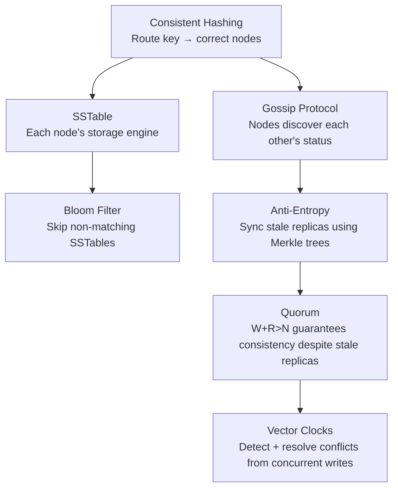

# Distributed Systems — Navigation Guide

Core data structures and algorithms that power every large-scale distributed system. These topics appear in system design interviews and underlie databases like Cassandra, DynamoDB, Kafka, and RocksDB.

---

## Reading Order

| # | Folder | What You Learn | Real Systems |
|---|---|---|---|
| 1 | `BloomFilter/` | **Start here.** Probabilistic set membership, bit arrays, hash functions, false positives, when to use, Java implementation | Cassandra, HBase, RocksDB, Chrome Safe Browsing |
| 2 | `SSTable/` | Log-Structured Merge Tree (LSM), MemTable, write/read paths, compaction, tombstones, B-Tree comparison | Cassandra, RocksDB, HBase, LevelDB |
| 3 | `GossipProtocol/` | Gossip dissemination, anti-entropy (Merkle trees, Read Repair), failure detection (Phi Accrual), gossip vs service discovery | Cassandra, Consul, Redis Cluster, Akka |
| 4 | `VectorClocks/` | Replication inconsistency, LWW, vector clocks, causality detection, conflict resolution, CRDTs, MVCC | Amazon Dynamo, Riak, CockroachDB |
| 5 | `Quorum/` | W+R>N formula, coordinator role, read/write quorum, sloppy quorum, hinted handoff, LOCAL_QUORUM, Raft quorum, multi-DC | Cassandra, DynamoDB, etcd, Raft |
| 6 | `../ConsistentHashing/` | Hash ring, virtual nodes, partition assignment, rebalancing | Cassandra, DynamoDB, Kafka |

> **Read order matters**: BloomFilter and SSTable are components inside larger systems (Cassandra uses both). Gossip explains how these systems coordinate. VectorClocks explains how they handle the conflicts that coordination can't prevent. Quorum explains how reads stay consistent despite stale replicas. ConsistentHashing explains how they partition data.

---

## The Connections Between Topics

```text
You have a distributed key-value store (like Cassandra):

1. CONSISTENT HASHING tells you WHICH NODE owns which key
   → Route GET/PUT to the right node(s) (replicas)

2. SSTABLE is HOW EACH NODE stores data on disk
   → MemTable (RAM) → flush → SSTable (disk) → compaction
   
3. BLOOM FILTER lives inside each SSTable
   → When you GET a key, skip SSTables that definitely don't have it
   → Without this, reads would do O(SSTables) disk reads

4. GOSSIP PROTOCOL is how nodes KNOW ABOUT EACH OTHER
   → Token ring positions, which nodes are UP/DOWN, schema versions
   → Anti-entropy (Merkle trees) syncs data between replicas

5. QUORUM is how reads stay CONSISTENT even when replicas are stale
   → W+R>N guarantees overlap between write set and read set
   → Coordinator reads from R replicas, returns newest, repairs stale ones

6. VECTOR CLOCKS (or LWW) resolves WHAT HAPPENS WHEN REPLICAS DIVERGE
   → Two nodes accepted concurrent writes to the same key
   → Which version wins? Or: detect conflict → let app merge
```



---

## Quick Reference — Distributed Systems Interview Topics

### Storage Internals
```
SSTables → LSM Tree → MemTable → Compaction → Tombstones
BloomFilter → false positives → Guava BloomFilter → production sizing
```

### Data Propagation
```
Gossip: fanout k, convergence in O(log_k N) rounds
Anti-entropy: Merkle trees, nodetool repair, read repair
Failure detection: Phi Accrual vs naive timeout
```

### Consistency and Conflict
```
Quorum: W+R>N → read/write overlap → consistency guarantee
LWW → clock skew → data loss risk
Vector clocks → concurrent write detection → application merge
Lamport timestamps vs vector clocks
CRDTs → conflict-free by design
MVCC → snapshot isolation → readers don't block writers
```

### What Each System Uses

```text
Cassandra:
  Storage:     LSM Tree + SSTables + Bloom Filters
  Membership:  Custom gossip (every 1s)
  Conflict:    LWW per column (default), vector-clock-inspired in lightweight transactions
  Partitioning: Consistent hashing with virtual nodes

DynamoDB:
  Storage:     B-Trees (probably, AWS closed source)
  Membership:  Gossip internally
  Conflict:    Vector clocks → sibling versions → application merge (original Dynamo paper)
  Partitioning: Consistent hashing

RocksDB:
  Storage:     LSM Tree + SSTables + Bloom Filters (standalone library)
  Used by:     TiKV, Meta MyRocks, Kafka Streams, CockroachDB

Kafka:
  Partitioning: Consistent hashing of partition keys
  Replication:  Leader-follower (not gossip)
  Ordering:     Offsets (Lamport-like sequence numbers)
```
