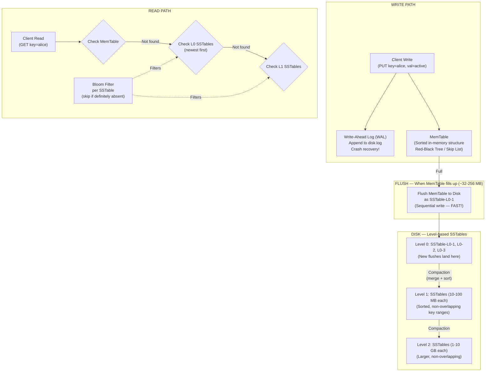
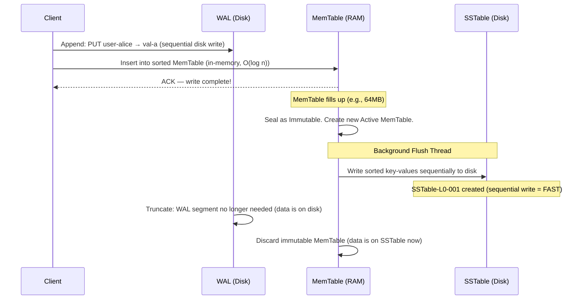
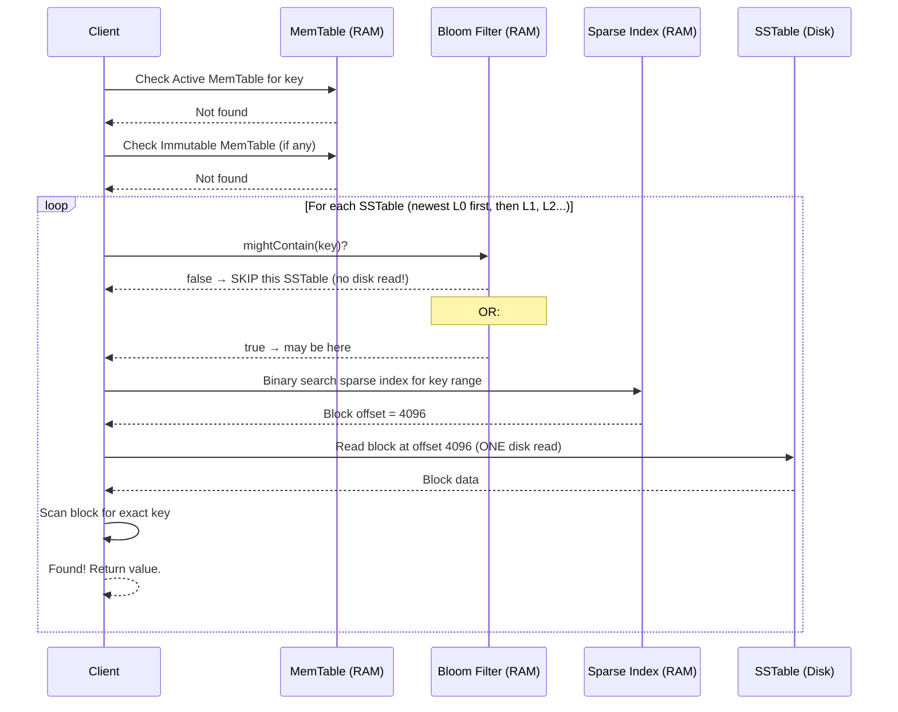
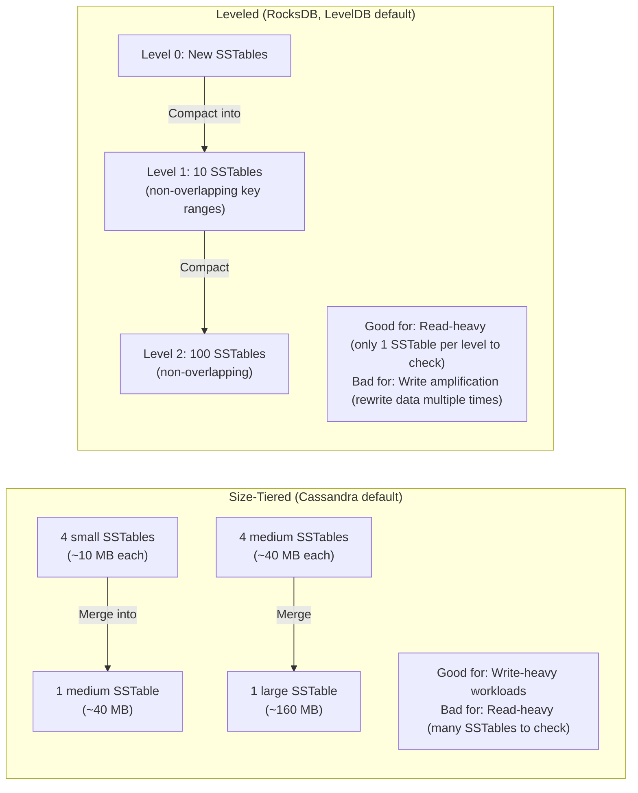

# SSTable — Sorted String Table and the LSM Tree

SSTable is the core on-disk storage format behind Cassandra, HBase, RocksDB, and LevelDB. Understanding SSTables means understanding why these databases can accept millions of writes per second while still being able to read efficiently.

> **The insight: sequential disk writes are 100x faster than random writes. SSTable is designed to ONLY do sequential writes, turning the hard problem of fast random writes into a problem of occasional merging.**

---

# 1. The Problem: Disk I/O Bottleneck

## Why Random Writes Kill Performance

```text
HDD Random Write:   ~100 IOPS (10ms per write)
HDD Sequential Write: ~100 MB/s (writing gigabytes per second!)

SSD Random Write:   ~10,000 IOPS
SSD Sequential Write: ~500 MB/s

An application writing 10,000 records per second:
  Random writes: 10,000 seeks on disk → 10,000 × 10ms = 100 seconds of disk time per second
  → IMPOSSIBLE at this rate
  
  Sequential writes: 10,000 records × 100 bytes = 1 MB → completed in 0.002 seconds
  → Trivially handled
```

Traditional B-Tree databases (MySQL InnoDB) update data in-place on disk → random writes → bottleneck at scale.

**SSTables solve this by never doing random writes.** All writes go to memory first (MemTable), then to disk as one large sequential write (SSTable).

---

# 2. The LSM Tree — The Architecture Behind SSTables

LSM = **Log-Structured Merge-Tree**. The SSTable is the on-disk component of an LSM Tree.



---

# 3. MemTable — The In-Memory Write Buffer

The MemTable is a **sorted in-memory data structure** (typically a Red-Black Tree or Skip List).

## Why Sorted?

```text
Writes arrive in any order:
  PUT user-charlie → val-c
  PUT user-alice   → val-a
  PUT user-bob     → val-b
  PUT user-dave    → val-d

MemTable keeps them sorted by key:
  user-alice   → val-a
  user-bob     → val-b
  user-charlie → val-c
  user-dave    → val-d

When flushed to SSTable: the file is already sorted → no extra sort step!
Sequential scan to write the file → maximum disk throughput.
```

## MemTable States

```text
Active MemTable:
  - Current write target
  - All new writes go here
  - Size: 32-256 MB (configurable)
  - Backed by WAL for crash recovery

Immutable MemTable (being flushed):
  - MemTable is full → sealed, made read-only
  - A new Active MemTable is created for new writes
  - Background thread writes the immutable one to disk as SSTable
  - No write pause! Writes continue to the new Active MemTable.

Flushed:
  - SSTable file written successfully
  - Corresponding WAL segment can be deleted
  - Immutable MemTable removed from memory
```

---

# 4. SSTable Structure — What's On Disk

An SSTable file is divided into multiple logical sections:

```text
SSTable File Layout:
┌─────────────────────────────────────────────────────────────────┐
│  DATA BLOCKS                                                    │
│  ┌──────────────────────────────────────────────────────────┐  │
│  │ Block 1 (4-64 KB):                                       │  │
│  │   user-alice   → {"name":"Alice","age":30}               │  │
│  │   user-bob     → {"name":"Bob","age":25}                 │  │
│  │   user-charlie → {"name":"Charlie","age":35}             │  │
│  ├──────────────────────────────────────────────────────────┤  │
│  │ Block 2:                                                  │  │
│  │   user-dave    → {"name":"Dave","age":28}                │  │
│  │   user-eve     → {"name":"Eve","age":32}                 │  │
│  │   user-frank   → {"name":"Frank","age":27}               │  │
│  └──────────────────────────────────────────────────────────┘  │
│                                                                  │
│  INDEX BLOCK (Sparse Index)                                      │
│  ┌──────────────────────────────────────────────────────────┐  │
│  │  user-alice  → byte offset 0      (start of block 1)     │  │
│  │  user-dave   → byte offset 4096   (start of block 2)     │  │
│  │  user-henry  → byte offset 8192   (start of block 3)     │  │
│  └──────────────────────────────────────────────────────────┘  │
│                                                                  │
│  FILTER BLOCK (Bloom Filter)                                     │
│  ┌──────────────────────────────────────────────────────────┐  │
│  │  Bit array: 1001010110010... (all keys hashed into this) │  │
│  │  mightContain("user-xyz") → false → SKIP this SSTable    │  │
│  └──────────────────────────────────────────────────────────┘  │
│                                                                  │
│  METADATA / FOOTER                                               │
│  ┌──────────────────────────────────────────────────────────┐  │
│  │  min_key: user-alice                                      │  │
│  │  max_key: user-zorba                                      │  │
│  │  entry_count: 100,000                                     │  │
│  │  created_at: 2024-01-15T10:30:00Z                        │  │
│  │  compression: Snappy                                      │  │
│  │  checksum: CRC32 of all blocks                           │  │
│  └──────────────────────────────────────────────────────────┘  │
└─────────────────────────────────────────────────────────────────┘
```

## Sparse Index — Why Not Index Every Key?

```text
Storing every key in the index → index becomes too large (defeats the purpose)

Sparse Index: index one key per data block (every 4-64 KB)

Example: SSTable has 1,000,000 entries:
  Full index:   1,000,000 entries × 50 bytes = 50 MB (too big for fast in-memory lookup)
  Sparse index: 1 per 100 entries = 10,000 entries × 50 bytes = 500 KB (fits in memory!)

Read for "user-charlie":
  1. Load sparse index (in memory: 500 KB) → binary search → "in block 1, offset 0"
  2. Read block at offset 0 from disk → scan block for exact key
  
  vs. B-Tree: follow pointer chain from root down many levels → multiple random disk reads
```

---

# 5. Write Path — Step by Step



Key points:
- The client gets ACK after WAL write (crash safe) + MemTable insert (both fast)
- Disk write is sequential — the most efficient possible disk operation
- No random writes at all during the write path

---

# 6. Read Path — Step by Step



```text
Read cost breakdown:
  MemTable:       O(log n) in memory
  Each SSTable:   O(1) Bloom filter check + O(log n) index binary search + O(1) disk read
  
  Worst case: key not in system → check all SSTables' Bloom Filters
              Each filter: a few nanoseconds
              Total for 50 SSTables: microseconds (vs. 50 disk reads without BF!)
```

---

# 7. Compaction — The Key Background Process

## The Problem Without Compaction

```text
Time 1: PUT user-alice → "active"     → SSTable-1
Time 2: PUT user-alice → "suspended"  → SSTable-2  (newer)
Time 3: DELETE user-alice             → SSTable-3  (tombstone record)

Without compaction:
  SSTable-1: user-alice → "active"
  SSTable-2: user-alice → "suspended"
  SSTable-3: user-alice → [TOMBSTONE] ← logical delete

  Read: check all 3 SSTables → merge → "alice is deleted" (correct, but wasteful)
  Disk: wasting space on stale "active" and "suspended" values
  Read speed: degrades as more SSTables accumulate
```

## Compaction Process

```text
Compaction takes multiple SSTables and merges them into one or fewer larger SSTables:

Input:  SSTable-1: alice→"active",    bob→"v1",  dave→"x"
        SSTable-2: alice→"suspended", charlie→"y"
        SSTable-3: alice→[TOMBSTONE]

Merge (like merge sort — all are sorted):
  Process alice: v1="active" (T1), v2="suspended" (T2), v3=TOMBSTONE (T3)
                 Keep only latest = TOMBSTONE (means: delete alice)
  Process bob:   v1="v1" → keep
  Process charlie: v1="y" → keep
  Process dave:  v1="x" → keep

Output SSTable (compacted):
  bob     → "v1"
  charlie → "y"
  dave    → "x"
  (alice is gone — tombstone past GC grace period = remove completely)

Result: 3 SSTables → 1 SSTable, alice's stale data removed, disk space reclaimed
```

## Compaction Strategies



---

# 8. Tombstones — The Delete Mechanism

```text
SSTables are IMMUTABLE — you can't remove a key from an existing SSTable.

DELETE user-alice
  → Write a "tombstone" record to MemTable:
    user-alice → [TOMBSTONE, timestamp=T3]
  → This flushes to a new SSTable like any write

During reads:
  If tombstone found → report "not found" (even if older SSTables have data)

During compaction:
  If tombstone is old enough (past gc_grace_seconds, default 10 days in Cassandra)
  → Remove tombstone AND all older values for that key
  → Data is truly gone from disk

⚠️ Warning: If a node was DOWN during the delete, it missed the tombstone.
            When it comes back, it might resurrect deleted data.
            gc_grace_seconds gives time for all replicas to receive the tombstone
            before it's permanently removed.
            gc_grace_seconds must be > max expected node downtime.
```

---

# 9. Write Amplification vs Read Amplification

```text
Write Amplification = (data written to disk) / (data written by client)
  
  Client writes: 1 MB of data
  With LSM compaction L0→L1→L2: same data rewritten 3+ times
  Write amplification factor = 3-30x (RocksDB typical: 10-30x with leveled)
  
  B-Trees: write amplification ≈ 2-5x (lower!)

Read Amplification = number of disk reads per query
  
  LSM without Bloom Filters: must check all SSTables = 10-50+ reads
  LSM with Bloom Filters: typically 1-2 disk reads for existing keys
  
  B-Trees: log(n) reads following the tree structure, typically 3-5 reads
  
Trade-off:
  LSM Trees: optimized for WRITES (sequential), pays cost in read amplification + compaction
  B-Trees:   balanced reads and writes, random writes slower under heavy load

This is why Cassandra, HBase, RocksDB use LSM/SSTable for write-heavy workloads.
MySQL InnoDB uses B-Trees (balanced read/write workloads).
```

---

# 10. SSTable in Different Systems

## Cassandra

```text
Cassandra SSTable file components:
  Data.db          → actual row data (data blocks)
  Index.db         → sparse partition key index
  Filter.db        → Bloom Filter for partition keys
  Statistics.db    → metadata, min/max timestamps, column statistics
  CompressionInfo.db → compression chunk map
  Summary.db       → sample of Index.db (fits entirely in RAM)
  TOC.txt          → table of contents (which files exist)

Compaction Strategies:
  SizeTieredCompactionStrategy (STCS) → default, write-heavy
  LeveledCompactionStrategy (LCS)     → read-heavy, predictable reads
  TimeWindowCompactionStrategy (TWCS) → time-series data
```

## RocksDB (used by TiKV, MyRocks, Kafka Streams)

```text
RocksDB LSM Tree:
  Level 0: 4 SSTables max (not necessarily non-overlapping)
  Level 1: ~256 MB total
  Level 2: ~2.56 GB total (10x per level)
  Level 3: ~25.6 GB
  ...
  
  Each level: SSTables have non-overlapping key ranges (except L0)
  Read: check L0 (up to 4 files), then 1 file per level → log(n) files
  
Used by:
  - Meta (Facebook): MyRocks = MySQL using RocksDB storage engine
  - TiKV: key-value store for TiDB (distributed SQL)
  - CockroachDB: storage layer
  - Kafka Streams: state store
```

## HBase

```text
HBase SSTable equivalent = HFile (stored in HDFS)

Architecture:
  RegionServer → MemStore (MemTable equivalent) → HFile (SSTable equivalent)
  
HFile stored in HDFS: fault-tolerant, replicated across DataNodes
Compaction: Minor (merge few small HFiles), Major (merge all HFiles in a region)

Used by:
  - Hadoop ecosystem
  - Apache Phoenix (SQL over HBase)
  - OpenTSDB (time series on HBase)
```

---

# 11. Full Read/Write Path Visualization

```mermaid
sequenceDiagram
    participant App as Application
    participant MT as MemTable
    participant WAL as WAL
    participant L0 as Level 0 SSTables
    participant L1 as Level 1 SSTables
    participant BG as Background Compactor

    Note over App,L1: WRITE PATH

    App->>WAL: 1. Append to WAL (crash recovery)
    App->>MT: 2. Insert into sorted MemTable
    App<<--MT: ACK — client notified!

    MT->>MT: MemTable reaches 64MB threshold
    MT->>L0: 3. Flush: write sorted SSTable-L0 (sequential write)
    WAL->>WAL: 4. Truncate WAL (SSTable is durable now)

    Note over L0,BG: COMPACTION (background, continuous)
    L0->>BG: L0 has 4+ SSTables — trigger compaction
    BG->>L1: Merge L0 SSTables + overlapping L1 SSTables → new L1 SSTables
    L0->>L0: Delete old L0 SSTables

    Note over App,L1: READ PATH

    App->>MT: GET user-alice
    MT-->>App: Not in MemTable
    App->>L0: Check Bloom Filter (L0 SSTables, newest first)
    L0-->>App: Bloom Filter: definitely not in SSTable-L0-3
    L0-->>App: Bloom Filter: maybe in SSTable-L0-1
    App->>L0: Binary search index → read block
    L0-->>App: Found: user-alice → "active" ✓
```

---

# 12. Interview Preparation — SSTables

## Q1: What is an SSTable and why does it exist?

**Answer:**

SSTable (Sorted String Table) is an immutable, sorted on-disk file format used in LSM-Tree-based databases (Cassandra, HBase, RocksDB). It exists to solve the write throughput bottleneck of traditional databases.

Random disk writes are extremely slow (~100 IOPS on HDD). SSTables avoid random writes entirely: all writes go to an in-memory sorted structure (MemTable) and are periodically flushed to disk as one large sequential write (SSTable). Sequential writes are 100x faster than random writes.

The cost is that reads become slightly more complex (must check multiple SSTables), but Bloom Filters and sparse indexes mitigate this.

## Q2: Explain the full write path in Cassandra

**Answer:**

1. Write is first appended to the **Write-Ahead Log (WAL)** on disk — sequential write, for crash recovery
2. The same write is inserted into the **MemTable** — an in-memory sorted data structure (Red-Black Tree or Skip List). The client gets ACK after these two steps.
3. When MemTable fills up (~64-256 MB), it is **sealed** (made immutable). A new MemTable handles new writes immediately.
4. A background thread **flushes** the immutable MemTable to disk as a new SSTable file — one sequential write containing all sorted key-values.
5. The corresponding WAL segment is **deleted** (data is now durable in SSTable).
6. Background **compaction** periodically merges multiple SSTables to reclaim space, remove stale data, and maintain read performance.

## Q3: What is compaction and why is it necessary?

**Answer:**

Compaction is a background process that merges multiple smaller SSTables into one or fewer larger SSTables. It is necessary because:

1. **Multiple versions of same key** accumulate (each update writes a new SSTable entry). Without compaction, reads must merge across many SSTables.
2. **Tombstones** (delete markers) need to be eventually purged — a deleted key stays as a tombstone until compaction removes it after the grace period.
3. **Read performance** degrades as the number of SSTables grows — compaction keeps this bounded.
4. **Disk space** is reclaimed by removing obsolete values.

During compaction, SSTables are merged like a merge sort (they're already sorted), keeping only the latest version of each key, and eliminating tombstones past the GC grace period.

## Q4: How do SSTables handle deletes?

**Answer:**

SSTables are immutable — you cannot modify them after creation. Deletes work via **tombstones**: a DELETE is written as a special "deleted" marker (tombstone) to the MemTable, which eventually flushes to a new SSTable as any write would.

During reads: if a tombstone is found for a key (even if older SSTables have live data), the result is "not found."

During compaction: once the tombstone is older than `gc_grace_seconds` (default 10 days), both the tombstone and all older values for that key are removed from the compacted output SSTable. The data is truly gone from disk at this point.

## Q5: Compare LSM Tree / SSTable vs B-Tree

**Answer:**

| Aspect | LSM Tree + SSTable | B-Tree |
|---|---|---|
| Write pattern | Sequential (append-only) | Random in-place |
| Write throughput | Very high (100k+ writes/sec) | Moderate |
| Write amplification | High (10-30x with compaction) | Low (2-5x) |
| Read performance | Good with BF + sparse index | Good (log n disk seeks) |
| Read amplification | Can check multiple SSTables | Predictable (log n) |
| Delete | Tombstone → later GC | In-place removal |
| Space reclaim | Delayed (at compaction time) | Immediate |
| Best for | Write-heavy (Cassandra, RocksDB) | Balanced (MySQL InnoDB) |

Choose LSM for high write throughput (event streaming, time-series, IoT data ingestion). Choose B-Tree for transactional systems needing balanced read/write performance with predictable latency.
