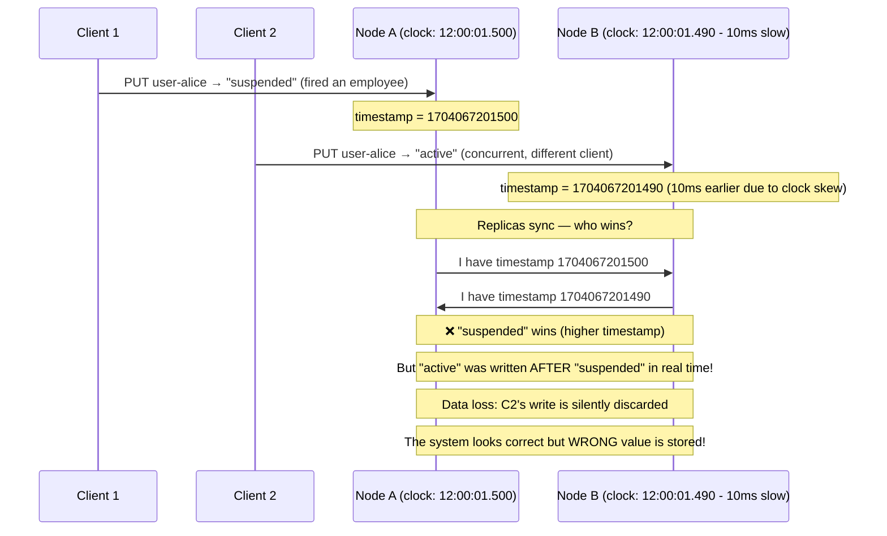
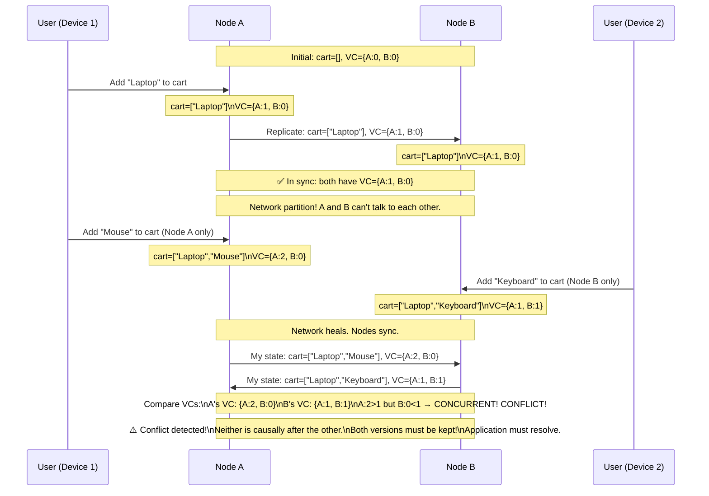
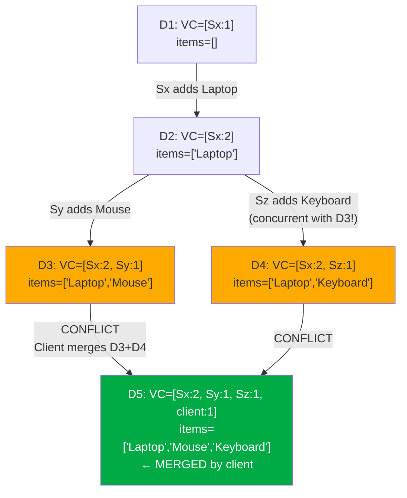
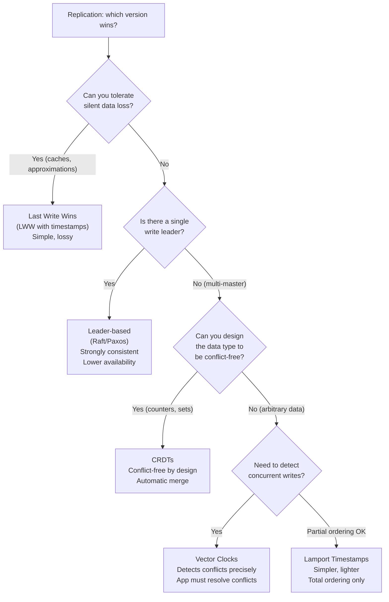

# Inconsistency Resolution: Versioning, Vector Clocks, and Conflict Resolution

Replication gives high availability — if one node dies, others serve traffic. But the moment you have multiple writable replicas, they can diverge. This doc covers the full spectrum of how distributed systems detect, track, and resolve those inconsistencies.

> **The core problem: if Node A and Node B both accept writes to the same key simultaneously, and then sync — which write wins? How do you even know they conflict?**

---

# 1. The Inconsistency Problem

## Why Replication Causes Inconsistency

```text
Single-node system (no inconsistency possible):
  Client → Server: PUT user-alice → "active"     (T=1)
  Client → Server: PUT user-alice → "suspended"  (T=2)
  Read: "suspended" ← always correct, single source of truth

Replicated system (inconsistency possible):
  3 replicas: Node A, Node B, Node C
  
  Client 1 → Node A: PUT user-alice → "active"     (T=1)
  Client 2 → Node B: PUT user-alice → "suspended"  (T=2 — but network delay!)
  
  Node A: user-alice = "active"
  Node B: user-alice = "suspended"
  Node C: user-alice = ??? (hasn't received either write yet!)
  
  Question: What is the "correct" value?
  Problem:  Which write happened "first" in a distributed system?
            Clock skew: Node A's clock shows T=1, Node B's shows T=2,
            but their clocks may be off by milliseconds or seconds!
```

## The Fundamental Challenge: No Global Clock

```text
In distributed systems, there is NO single global clock.
Each node has its own clock, and they drift apart:
  Node A: 10:00:01.500
  Node B: 10:00:01.502   ← 2ms ahead
  Node C: 10:00:01.498   ← 2ms behind

Even with NTP (Network Time Protocol):
  NTP sync accuracy: ~1-10ms typically, up to 100ms in poor conditions
  
  Two events happening 5ms apart → you cannot reliably determine order from timestamps alone.
  
  Example:
    Node A timestamps write at: 10:00:01.500
    Node B timestamps write at: 10:00:01.503
    
    Did A happen before B? Probably yes. But if A's clock is 10ms fast:
    Reality: B happened BEFORE A! But timestamps say A happened first!
    
  This is why distributed systems cannot use wall-clock time to determine causality.
```

---

# 2. Solution Space: A Spectrum of Approaches

```text
Simple ←——————————————————————————————————————→ Precise

Last Write Wins   →  Version Numbers  →  Vector Clocks  →  CRDTs
(timestamps,          (single counter)     (per-node         (conflict-free
 clock skew risk)                           counters)          data types)

Loses data         May lose data       Tracks causality   No conflicts
but easy           on conflict         precisely          by design
```

---

# 3. Last Write Wins (LWW) — Simplest Approach

## How It Works

```text
Rule: "The write with the largest timestamp wins."

Every write is tagged with a timestamp (usually milliseconds since epoch):
  Node A: PUT user-alice → "active",    timestamp=1704067200000  (T1)
  Node B: PUT user-alice → "suspended", timestamp=1704067200005  (T2, 5ms later)

When replicas sync:
  T2 > T1 → "suspended" wins
  "active" is discarded
```

## The Problem: Clock Skew Causes Data Loss



## When LWW is Acceptable

```text
Acceptable use cases:
  - Cassandra: default per-column LWW (with tunable consistency levels)
    → If your app ensures only one writer per key, no conflict possible
  - Caching layers: losing occasional updates is OK (data regenerated from DB)
  - Time-series data: latest sensor reading "wins" (older readings are stale by definition)
  - User preferences: if user updates preferences on two devices simultaneously,
                      last update wins is acceptable (trivial conflict)

NOT acceptable for:
  - Financial transactions (silent data loss = money lost)
  - Shopping cart (concurrent items added from two devices → one device's items lost!)
  - Inventory counts (concurrent decrements → overselling)
```

---

# 4. Version Numbers — Simple Ordering

## How It Works

```text
Each node maintains a monotonically increasing version number per key.
When syncing, the higher version wins.

Write:
  Node A: user-alice → "active", version=5
  Read-modify-write: GET user-alice (version=5), UPDATE to "suspended", PUT with version=6

  Client must include version in update request:
    PUT user-alice { "value": "suspended", "expected_version": 5, "new_version": 6 }
  
  If another writer changed it to version 6 first → our write fails (conflict detected!)
  → Client must retry: read current (version=6), decide what to do, write with version=7

This is Optimistic Locking.
```

## The Problem: Doesn't Detect Concurrent Writes on Different Replicas

```text
Scenario: key-value store with 2 replicas, writes accepted by both (no quorum)

Node A: alice → "active", version=5
Node B: alice → "suspended", version=5  ← same version, different value!

When syncing:
  Both have version=5 → which wins?
  Version numbers can't distinguish concurrent vs sequential writes!
  
  This is where Vector Clocks become necessary.
```

---

# 5. Vector Clocks — Tracking Causality Precisely

## The Intuition

```text
Instead of a single version number, use a VECTOR of counters — one per node.

Vector clock: { nodeA: 3, nodeB: 2, nodeC: 1 }
             Means: 
               nodeA contributed 3 writes
               nodeB contributed 2 writes
               nodeC contributed 1 write
               
Reading a vector clock: "this version reflects 3 writes from A, 2 from B, 1 from C"
```

## Vector Clock Rules

```text
Rule 1: When a node writes locally:
  Increment ITS OWN counter in the vector clock
  
  Example: Node A writes, current VC = {A:3, B:2}
  New VC = {A:4, B:2}  ← A incremented

Rule 2: When a node sends a message:
  Attach its current vector clock to the message

Rule 3: When a node receives a message:
  Merge: take element-wise MAX of local VC and received VC
  Then increment own counter
  
  Local: {A:3, B:1, C:2}  +  Received: {A:2, B:4, C:1}
  Merge = MAX each: {A:3, B:4, C:2}
  Increment own (say this is node B): {A:3, B:5, C:2}
```

## Comparing Vector Clocks — Causality Rules

```text
Given two versions V1 = {A:2, B:3, C:1} and V2 = {A:3, B:2, C:2}:

V1 HAPPENED BEFORE V2 (V1 → V2) if:
  For every node n: V1[n] ≤ V2[n]   AND at least one V1[n] < V2[n]
  Example: V1={A:2, B:3} vs V2={A:3, B:4}
           2≤3 ✓, 3≤4 ✓ → V1 → V2 (V1 causally precedes V2)

V2 HAPPENED BEFORE V1 (V2 → V1) if:
  For every node n: V2[n] ≤ V1[n]   AND at least one V2[n] < V1[n]

CONCURRENT (conflict!) if:
  Neither V1 → V2 nor V2 → V1
  Example: V1={A:2, B:3} vs V2={A:3, B:2}
           A: 2 < 3 (V1 ahead for A)... wait:
           B: 3 > 2 (V1 ahead for B, V2 behind)
           A: 2 < 3 (V2 ahead for A)
           → V1 has more B writes, V2 has more A writes → CONCURRENT = CONFLICT!
```

## Step-by-Step Visual: Vector Clocks in Action

```text
Scenario: Shopping cart with 2 nodes (A and B), both accepting writes
          Replication factor = 2 (both nodes store the cart)

Initial state: cart = [], VC = {A:0, B:0}
```



## Conflict Resolution Strategies

```text
Option 1: Last Write Wins (LWW) — fall back to timestamps when conflict detected
  Risk: Clock skew causes wrong winner (as shown earlier)
  Used by: Cassandra (default per-column)

Option 2: Application-level merge — present both to application, let it merge
  Shopping cart: MERGE the two versions → ["Laptop", "Mouse", "Keyboard"]
  Both adds are valid → take the union
  Used by: Amazon Dynamo (shopping cart case study!)

Option 3: User resolution — show conflict to user, let them pick
  Google Docs: usually avoided by CRDTs, but last resort is user merge
  
Option 4: CRDTs (Conflict-free Replicated Data Types)
  Design the data structure so ALL concurrent writes are automatically mergeable
  Set CRDT: any addition to the set from any node is kept (no conflict possible)
  Counter CRDT: sum all node-local counts (no conflict possible)
  Used by: Redis, Riak, CockroachDB

Option 5: Paxos/Raft — avoid conflicts by serializing all writes through a leader
  Only one node accepts writes → no concurrent writes → no conflicts
  Trade-off: lower availability (leader must be up), higher latency
  Used by: etcd, ZooKeeper, CockroachDB (for metadata)
```

---

# 6. Amazon Dynamo's Versioning — The Canonical Example

Amazon published the Dynamo paper (2007) which describes the vector clock + conflict resolution approach that influenced DynamoDB, Riak, Cassandra, and more.

## Dynamo's Approach

```text
Each object in Dynamo has a vector clock attached.
Vector clock = [(node, counter)] list

Example evolution of a shopping cart:

1. User creates cart (via node Sx):
   D1 = ([Sx, 1], { "items": [] })

2. User adds "Laptop" (via node Sx):
   D2 = ([Sx, 2], { "items": ["Laptop"] })
   (D1 → D2 causally, because D2's VC dominates D1's)

3. Sx fails, request goes to Sy:
   User adds "Mouse" via Sy:
   D3 = ([Sx, 2], [Sy, 1], { "items": ["Laptop", "Mouse"] })
   (Sy read D2 first, so D3 includes D2's info: D2 → D3)

4. Meanwhile, another request via Sz adds "Keyboard":
   D4 = ([Sx, 2], [Sz, 1], { "items": ["Laptop", "Keyboard"] })
   (Sz also read D2, so D4 also causally follows D2)

5. Now D3 and D4 are CONCURRENT (conflict!):
   D3: [Sx:2, Sy:1]  D4: [Sx:2, Sz:1]
   → Sx:2=2 equal, Sy:1>0, Sz:0<1 → neither dominates → CONFLICT

6. On next read: Dynamo returns BOTH D3 and D4 to the client
   Client/application is responsible for merging:
   result = D3.items ∪ D4.items = ["Laptop", "Mouse", "Keyboard"]
   Client writes back the merged result with a new VC.
```

## Mermaid: Dynamo Vector Clock Timeline



---

# 7. Lamport Timestamps — Simpler Causality Without Vectors

## What is a Lamport Timestamp?

```text
Leslie Lamport (1978): a single integer counter that establishes
a partial ordering of events in a distributed system.

Rule:
  1. Each node maintains a counter, starts at 0
  2. Before a local event: increment counter
  3. When sending a message: attach current counter value
  4. When receiving a message: counter = max(local, received) + 1

Example:
  Node A: event1 at L=1, event2 at L=2
  Node B: event1 at L=1
  A sends message to B with L=2:
    B receives: max(1, 2) + 1 = 3
    B's next event is at L=3

Meaning of Lamport timestamps:
  If A→B (A causally before B): L(A) < L(B)  ← ALWAYS TRUE
  If L(A) < L(B): this does NOT mean A happened before B (only PROBABLE)
  
  So: Lamport timestamps detect DEFINITE causality but miss CONCURRENT events.
```

## Lamport vs Vector Clocks

```text
Lamport Timestamps:
  + Simple: one integer per node
  + Good for: total ordering (logs, debugging)
  - Cannot detect concurrent events: if L(A) < L(B), we don't know if A→B or A||B

Vector Clocks:
  + Can detect both causality AND concurrency
  + Precise: V(A) ≤ V(B) → A happened before B (or A=B), otherwise concurrent
  - More complex: O(N) space (one counter per node)
  - Grows with cluster size

In practice:
  Use Lamport: when you need total order of events (Kafka offset, Zookeeper zxid)
  Use Vector Clocks: when you need to detect conflicts (Dynamo, Riak, CRDTs)
```

---

# 8. Hybrid Logical Clocks (HLC) — Best of Both Worlds

Modern systems use **Hybrid Logical Clocks** which combine physical time (for human readability) with logical ordering (for causality).

```text
HLC timestamp = (physical_time, logical_counter)

Rules:
  Send/local event:
    l.new = max(l.j, pt) where pt = current physical time
    if l.new == l.j: c.j++ else c.j = 0
    Message timestamp = (l.j, c.j)
    
  Receive message with (m.l, m.c):
    l.new = max(l.j, m.l, pt)
    if l.new == l.j == m.l: c.j = max(c.j, m.c) + 1
    else if l.new == l.j:   c.j++
    else if l.new == m.l:   c.j = m.c + 1
    else:                   c.j = 0

Benefits:
  - Stays close to physical time (human readable, NTP compatible)
  - Correctly handles causality even across clock-skew
  - One value (tuple) instead of vector per-node

Used by:
  CockroachDB: uses HLC for MVCC (Multi-Version Concurrency Control)
  TiDB: HLC for distributed transactions
  Google Spanner: uses TrueTime (GPS+atomic clocks, but same concept)
```

---

# 9. MVCC — Multi-Version Concurrency Control

MVCC solves the read-write conflict problem differently: **keep multiple versions of each row, never delete old versions immediately**.

```text
Without MVCC (locking):
  Writer W holds a lock on row "alice"
  Reader R wants to read "alice"
  R must WAIT for W to release lock → readers block writers, writers block readers

With MVCC (PostgreSQL, CockroachDB, MySQL InnoDB, Cassandra):
  Writer W creates a NEW version of row "alice" at timestamp T3
    (old version at T2 still exists in the DB!)
  Reader R reading at timestamp T2:
    Sees the T2 version → reads without blocking!
  
  Old versions are eventually cleaned up by a background process (VACUUM in PostgreSQL,
  Compaction in Cassandra, GC in CockroachDB)
```

```text
MVCC version chain for user-alice:

T5: alice → {status: "active"}      ← current version
T3: alice → {status: "suspended"}   ← older version (visible to T3 readers)
T1: alice → {status: "pending"}     ← oldest version

A query at snapshot time T=T4:
  Sees T3 version (T3 ≤ T4 < T5, so T5 is not yet visible)
  Returns: "suspended"
  
A query at snapshot time T=T6:
  Sees T5 version
  Returns: "active"

This is how READ COMMITTED and SNAPSHOT ISOLATION work!
```

---

# 10. CRDTs — Conflict-Free Replicated Data Types

CRDTs avoid the conflict problem entirely by designing data structures where **all concurrent writes can always be automatically merged**.

```text
Two types:
  CvRDT (State-based): merge entire state, function must be:
    - Commutative: merge(A, B) = merge(B, A)
    - Associative: merge(merge(A,B), C) = merge(A, merge(B,C))
    - Idempotent:  merge(A, A) = A
    
  CmRDT (Operation-based): broadcast operations (not state),
    operations must be commutative

Common CRDT Types:
  G-Counter: grow-only counter
    Node A: {A:5, B:3, C:2} → value = 5+3+2 = 10
    Merge: take element-wise MAX
    
  PN-Counter: increment and decrement counter (= G-Counter for increments + G-Counter for decrements)
    value = sum(increments) - sum(decrements)
    
  G-Set: grow-only set (can only add, never remove)
    Merge: union of both sets
    
  2P-Set: add and remove (grows + tombstone set)
    Once removed, can never be re-added
    
  LWW-Register: last-write-wins register (uses timestamps)
    Merge: take higher timestamp
    
  OR-Set (Observed-Remove Set): add and remove with unique tags
    Merge: union of non-removed elements (most practical set CRDT)
    
Used by:
  Redis (RedisJSON, Redis Cluster counters)
  Riak (native CRDT support)
  Cassandra (LWW-Register, Counters as PN-Counter)
  Apache Flink (stateful stream processing)
  Collaborative apps (Google Docs uses OT/CRDT for text)
```

---

# 11. Java Code — Vector Clock Implementation

```java
import java.util.HashMap;
import java.util.Map;

public class VectorClock {
    
    private final Map<String, Integer> clock;
    
    public VectorClock() {
        this.clock = new HashMap<>();
    }
    
    private VectorClock(Map<String, Integer> clock) {
        this.clock = new HashMap<>(clock);
    }
    
    /** Increment this node's counter (on local event or before send) */
    public VectorClock increment(String nodeId) {
        VectorClock newClock = new VectorClock(this.clock);
        newClock.clock.merge(nodeId, 1, Integer::sum);
        return newClock;
    }
    
    /** Merge with received clock (on receive: element-wise max, then increment own) */
    public VectorClock merge(VectorClock other, String localNodeId) {
        VectorClock merged = new VectorClock();
        // Take element-wise max of both clocks
        for (String nodeId : this.clock.keySet()) {
            merged.clock.put(nodeId, this.clock.get(nodeId));
        }
        for (Map.Entry<String, Integer> entry : other.clock.entrySet()) {
            merged.clock.merge(entry.getKey(), entry.getValue(), Math::max);
        }
        // Increment local counter after merge
        return merged.increment(localNodeId);
    }
    
    /** 
     * Compare two vector clocks for causality.
     * @return BEFORE  if this happened before other
     *         AFTER   if this happened after other
     *         CONCURRENT if neither precedes the other (conflict!)
     *         EQUAL   if identical
     */
    public CausalOrder compareTo(VectorClock other) {
        boolean thisBeforeOther = true;
        boolean otherBeforeThis = true;
        
        // Check all keys from both clocks
        for (String nodeId : allNodeIds(this.clock, other.clock)) {
            int thisVal = this.clock.getOrDefault(nodeId, 0);
            int otherVal = other.clock.getOrDefault(nodeId, 0);
            
            if (thisVal > otherVal) otherBeforeThis = false;
            if (thisVal < otherVal) thisBeforeOther = false;
        }
        
        if (thisBeforeOther && otherBeforeThis) return CausalOrder.EQUAL;
        if (thisBeforeOther)                    return CausalOrder.BEFORE;
        if (otherBeforeThis)                    return CausalOrder.AFTER;
        return CausalOrder.CONCURRENT;              // conflict!
    }
    
    private java.util.Set<String> allNodeIds(Map<String, Integer>... maps) {
        java.util.Set<String> all = new java.util.HashSet<>();
        for (Map<String, Integer> m : maps) all.addAll(m.keySet());
        return all;
    }
    
    public enum CausalOrder { BEFORE, AFTER, EQUAL, CONCURRENT }
    
    @Override
    public String toString() {
        return clock.toString();
    }
}
```

```java
// Versioned value with vector clock
public class VersionedValue<T> {
    public final T value;
    public final VectorClock clock;
    
    public VersionedValue(T value, VectorClock clock) {
        this.value = value;
        this.clock = clock;
    }
    
    @Override
    public String toString() {
        return String.format("Value=%s, VC=%s", value, clock);
    }
}
```

```java
// Simulation: Shopping cart conflict scenario
public class VectorClockDemo {
    public static void main(String[] args) {
        // Initial state: both nodes start with same cart
        VectorClock v0 = new VectorClock();
        VersionedValue<String> cart0 = new VersionedValue<>("[]", v0);
        System.out.println("Initial: " + cart0);
        
        // Node A adds "Laptop"
        VectorClock vcA = cart0.clock.increment("nodeA");
        VersionedValue<String> cartA = new VersionedValue<>("[Laptop]", vcA);
        System.out.println("Node A writes: " + cartA);
        // VectorClock: {nodeA: 1}
        
        // Both nodes get "Laptop" (replicated)
        // Node B's state is also {nodeA:1, items:[Laptop]}
        
        // Network partition! Now concurrent writes:
        
        // Node A adds "Mouse" (only knows about its own writes)
        VectorClock vcA2 = cartA.clock.increment("nodeA");
        VersionedValue<String> cartA2 = new VersionedValue<>("[Laptop, Mouse]", vcA2);
        System.out.println("Node A adds Mouse: " + cartA2);
        // VectorClock: {nodeA: 2}
        
        // Node B adds "Keyboard" (only knows about its own writes)
        VectorClock vcB = cartA.clock.increment("nodeB");  // starts from same base
        VersionedValue<String> cartB = new VersionedValue<>("[Laptop, Keyboard]", vcB);
        System.out.println("Node B adds Keyboard: " + cartB);
        // VectorClock: {nodeA: 1, nodeB: 1}
        
        // Sync: compare versions
        VectorClock.CausalOrder order = cartA2.clock.compareTo(cartB.clock);
        System.out.println("\nComparing: " + cartA2.clock + " vs " + cartB.clock);
        System.out.println("Result: " + order);
        // → CONCURRENT (conflict!)
        
        // Application resolves: merge the carts (union)
        System.out.println("CONFLICT DETECTED! Both versions must be preserved.");
        System.out.println("Application merges: [Laptop, Mouse, Keyboard]");
        
        // Write merged result with merged clock
        VectorClock mergedVC = cartA2.clock
                .merge(cartB.clock, "coordinator")
                .increment("coordinator");
        VersionedValue<String> merged = new VersionedValue<>(
                "[Laptop, Mouse, Keyboard]", mergedVC);
        System.out.println("Merged result: " + merged);
        // VectorClock: {nodeA: 2, nodeB: 1, coordinator: 1}
        // This clock DOMINATES both cartA2 and cartB → no more conflict
    }
}
```

---

# 12. Summary: Which Technique to Use When



## Quick Reference Table

```text
Technique       | Conflict   | Detects     | Space    | Used By
                | Detection  | Concurrent? | Per Key  |
----------------|-----------|-------------|----------|-----------------------------
Timestamps (LWW)| No         | No          | O(1)     | Cassandra (default)
Version Numbers | Partial    | No          | O(1)     | HTTP ETags, Optimistic Lock
Lamport Clocks  | Partial    | No          | O(1)     | Kafka offset, ZooKeeper
Vector Clocks   | Yes        | Yes         | O(N)     | Amazon Dynamo, Riak
Hybrid Logical  | Yes        | Yes         | O(1)     | CockroachDB, TiDB
CRDTs           | None!      | N/A         | Varies   | Redis, Riak, Cassandra
Raft/Paxos      | None!      | N/A         | O(1)     | etcd, ZooKeeper, CockroachDB
```

---

# 13. Interview Preparation — Versioning and Vector Clocks

## Q1: What is the problem with using timestamps to resolve conflicts in distributed systems?

**Answer:**

Wall-clock timestamps are unreliable for conflict resolution because distributed systems have **clock skew** — each node's clock drifts slightly. NTP can only synchronize clocks to ~1-10ms accuracy under good conditions. Events happening within that window have undetermined relative order.

If Node A writes at 12:00:01.000 and Node B writes at 12:00:01.003, and A's clock is 5ms fast, then A's write actually happened AFTER B's in real time, but the timestamp says A happened before B. Last Write Wins would pick B's value, losing A's write — wrong answer.

For non-critical data (caches, sensor readings), this is acceptable. For financial or inventory data, silent data loss is catastrophic.

## Q2: What is a vector clock and how does it detect conflicts?

**Answer:**

A vector clock is an array of counters, one per node. When a node writes, it increments its own counter. When it communicates, it attaches its vector clock and the receiver takes the element-wise max, then increments its own counter.

Comparison: V1 happened before V2 iff every element of V1 ≤ corresponding element of V2 (with at least one strictly less). If neither dominates the other (e.g., V1={A:2, B:1} and V2={A:1, B:2} — A ahead in V1, B ahead in V2), they are **concurrent** — meaning the writes happened without knowledge of each other, creating a conflict.

This precise causality detection is what lets systems like Amazon Dynamo identify conflicts and present all conflicting versions to the application for resolution.

## Q3: How did Amazon Dynamo use vector clocks?

**Answer:**

Every object in Dynamo had a list of (node, counter) pairs as its version. On each write, the handling node incremented its counter. When replicas synced:
- If one VC dominated the other (element-wise) → the dominated one is stale, discard it
- If neither dominated (concurrent) → **both versions are kept** as siblings

On the next read, Dynamo returned all sibling versions to the client. The application was responsible for merging them. For shopping carts, the merge was simple: union of both item sets. The merged result was written back with a new VC that dominated all siblings.

This design prioritizes availability: writes always succeed, conflicts are resolved lazily at read time. This is the "optimistic replication" philosophy.

## Q4: What is the difference between Lamport timestamps and vector clocks?

**Answer:**

Lamport timestamps use a single counter with the rule: increment before local events; on receive, take max(local, received) + 1. They guarantee: if A→B then L(A) < L(B). But the converse is NOT guaranteed — L(A) < L(B) doesn't mean A→B. So you can establish total ordering but cannot distinguish causally-before from concurrent.

Vector clocks use one counter per node. They guarantee both directions: A→B iff V(A) < V(B) (element-wise), AND they detect concurrent events (when neither vector dominates). The cost is O(N) space per clock, which grows with cluster size.

In practice: use Lamport timestamps for logging, Kafka offsets, Zookeeper transaction IDs (need total order). Use vector clocks when you need to precisely detect concurrent writes and handle conflicts.

## Q5: What is MVCC and how does it relate to versioning?

**Answer:**

MVCC (Multi-Version Concurrency Control) keeps multiple versions of each row simultaneously, tagged by timestamp. Instead of locking, readers read the version that was current at their transaction's start time — even if a writer is currently updating that row.

This eliminates reader-writer conflicts: reads never block writes, writes never block reads. Each transaction works on a consistent snapshot of the database (Snapshot Isolation). The version history is eventually cleaned up by a background process (VACUUM in PostgreSQL, compaction in Cassandra).

MVCC is a form of versioning at the storage layer. Vector clocks are a form of versioning at the replication layer. Both track "which version of the truth does this query see?" but at different granularities.
