Yes — this is an important JVM concept, especially when you start learning **JVM internals, JNI, profiling, and Java performance**.

## 1. First: What is "native code"?

**Native code = machine-level code compiled for a specific CPU/OS architecture.**

For example, if you write:

```java
int sum(int a, int b) {
    return a + b;
}
```

Java source code is **not directly machine code**.

It goes roughly like:

```mermaid
graph TD
    JS[Java source] --> J[javac]
    J --> BC[Bytecode (.class)]
    BC --> JVM[JVM]
    JVM --> MI[Machine instructions]
    MI --> CPU[CPU]
```

Java bytecode looks conceptually like:

```text
iload_1
iload_2
iadd
ireturn
```

This bytecode is platform-independent.

Native code, on the other hand, is something like CPU instructions:

```text
MOV
ADD
RET
```

The exact instructions depend on the CPU architecture.

For example:

```text
x86-64 native code
ARM64 native code
RISC-V native code
```

So:

> **Native code is code that is directly executable by the target machine's CPU rather than JVM bytecode.**

---

# 2. Then what does "JVM can run native code" mean?

This statement can be confusing.

The JVM primarily executes **Java bytecode**, but it can also **invoke native machine code**.

For example:

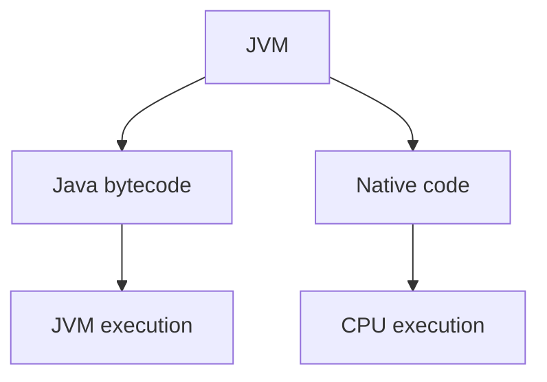

The JVM provides mechanisms for Java code to interact with native code.

The most famous one is:

**JNI — Java Native Interface**

---

# 3. Example: Java calling C

Suppose you have Java:

```java
public class NativeDemo {

    public native void sayHello();

    static {
        System.loadLibrary("nativeDemo");
    }
}
```

Notice:

```java
public native void sayHello();
```

There is **no Java implementation**.

You're basically telling the JVM:

> "There is an implementation of this method somewhere outside Java. When this method is called, invoke the native implementation."

Then you could have C code:

```c
#include <stdio.h>

void sayHello() {
    printf("Hello from native code!");
}
```

The C code is compiled into a native library such as:

```text
nativeDemo.dll      Windows
libnativeDemo.so   Linux
libnativeDemo.dylib macOS
```

Then:

```java
NativeDemo demo = new NativeDemo();

demo.sayHello();
```

The flow becomes:

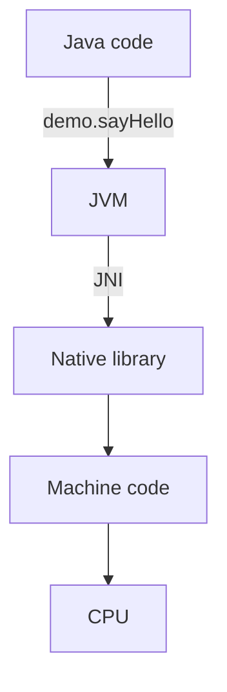

---

# 4. Why would Java need native code?

Because some things are easier or only possible through the operating system or existing native libraries.

For example:

### Operating system APIs

The OS itself exposes native APIs.

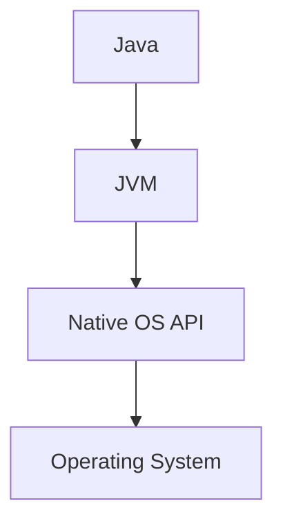

### Hardware access

Things such as:

```text
GPU
CPU-specific instructions
special hardware
device drivers
```

may require native libraries.

### Existing C/C++ libraries

Suppose an extremely optimized library already exists in C++:

```text
libSomething.so
```

Instead of rewriting millions of lines in Java, Java can interact with it through native interfaces.

---

# 5. But there's another meaning of "native" in the JVM

This is **very important for understanding JVM internals**.

When people say:

> "The JVM runs native code"

they may mean something different from JNI.

The JVM itself is a **native application**.

For example, HotSpot JVM is largely implemented in:

```text
C++
C
Assembly
```

So when you run:

```bash
java MyApplication
```

you're actually starting a native executable.

Conceptually:

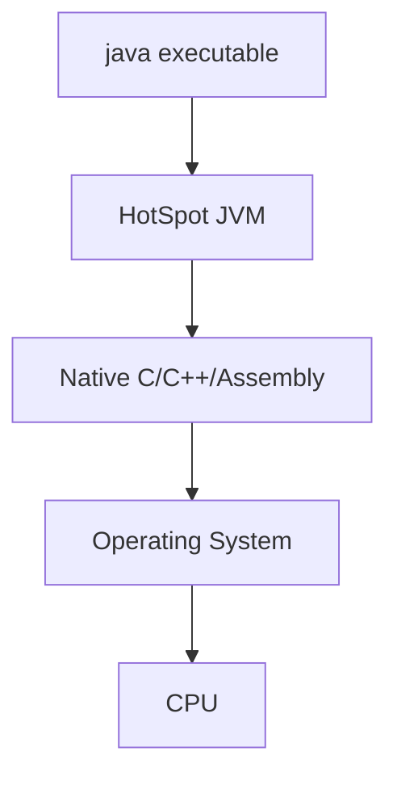

Inside that JVM, your Java bytecode runs.

---

# 6. And then there's JIT compilation

This is probably the most important connection.

Initially:

```java
int add(int a, int b) {
    return a + b;
}
```

gets compiled to Java bytecode:

```text
.class
   ↓
bytecode
```

The JVM can interpret that bytecode.

But if a method becomes **hot** — executed many times — the JIT compiler can compile it into **native machine code**.

For example:

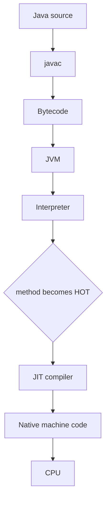

So eventually your Java method may execute as CPU instructions.

---

# 7. This is different from JNI

There are two very different situations.

### Case 1 — JIT-generated native code

Your Java code:

```java
int add(int a, int b) {
    return a + b;
}
```

gets compiled by the JVM's JIT.

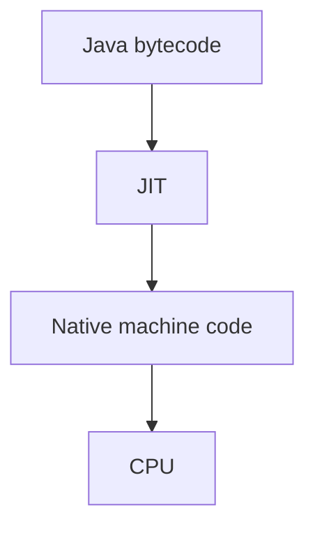

You didn't write the native code.

**The JVM generated it.**

---

### Case 2 — JNI native code

You explicitly have:

```java
native void sayHello();
```

and a C/C++ implementation.

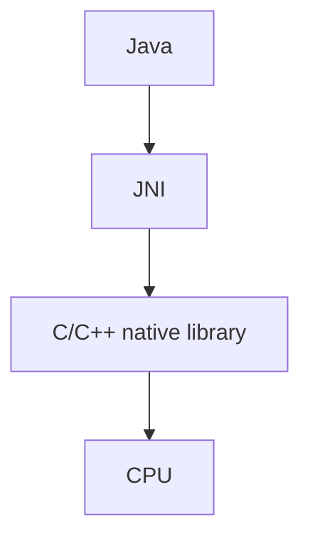

Here the native code was compiled separately.

---

# 8. There's a third important concept: JVM itself

Think of the JVM as a native program that contains:

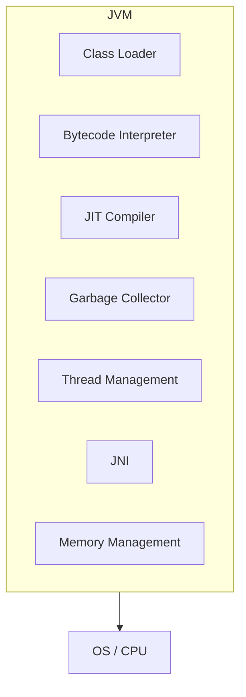

The JVM itself needs native machine code to operate.

For example, garbage collection algorithms are implemented inside the JVM in native languages.

---

# 9. Why your recent Datadog/JVM crash is related

This connects directly to the JVM crash issue you were investigating.

You had something like:

```mermaid
graph TD
    SB[Spring Boot] --> JVM[JVM]
    JVM --> DDA[Datadog Java Agent]
    DDA --> NP[native profiler (ddprof)]
    NP --> NC[Native code]
```

The Java application itself may be perfectly valid.

But a native component can crash the **entire JVM process**.

That's because native code operates outside the normal Java safety model.

For example:

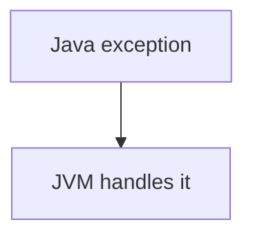

But:

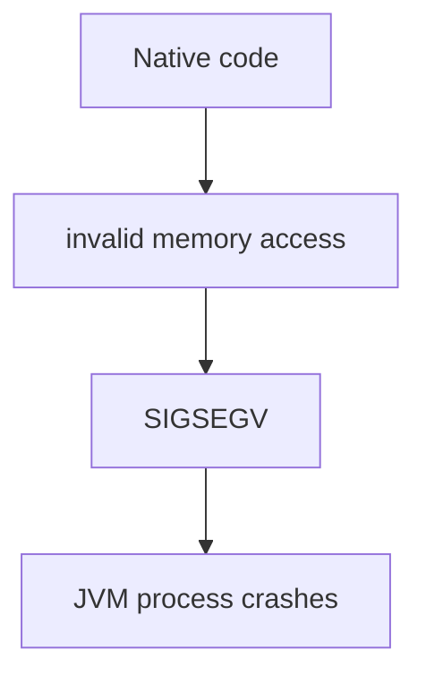

This is why you can see:

```text
SIGSEGV
```

instead of a normal Java exception such as:

```text
NullPointerException
OutOfMemoryError
IllegalStateException
```

---

# 10. Java normally protects you from memory problems

Consider:

```java
String s = null;

s.length();
```

You get:

```text
NullPointerException
```

The JVM controls the memory access.

But native C/C++ code can potentially do something like:

```c
int *ptr = NULL;

*ptr = 10;
```

That can cause:

```text
Segmentation Fault
SIGSEGV
```

and potentially kill the whole JVM process.

That's one reason native code is powerful but dangerous.

---

# 11. Native code vs Java bytecode

|                      | Java Bytecode       | Native Code                         |
| -------------------- | ------------------- | ----------------------------------- |
| Generated by         | `javac`             | C/C++ compiler, JIT, etc.           |
| Platform independent | Mostly yes          | No                                  |
| Runs directly on CPU | No                  | Yes                                 |
| JVM required         | Yes                 | Not necessarily                     |
| Memory safety        | JVM-managed         | Depends on language                 |
| Example              | `.class`            | `.dll`, `.so`, machine instructions |
| Can crash JVM?       | Normally controlled | Yes, native crashes can             |
| Example technology   | Java                | C/C++/Assembly                      |

---

# 12. One subtle but important point

Don't think:

> "Java is interpreted and native code is compiled."

That's an outdated oversimplification.

Modern JVM execution is more like:

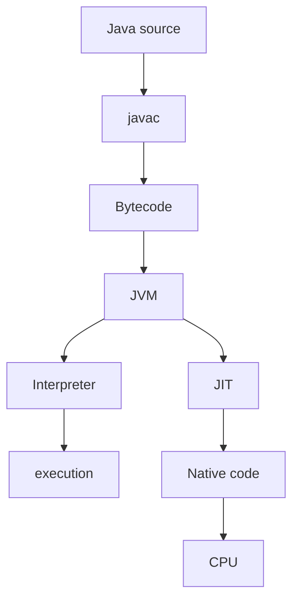

And simultaneously:

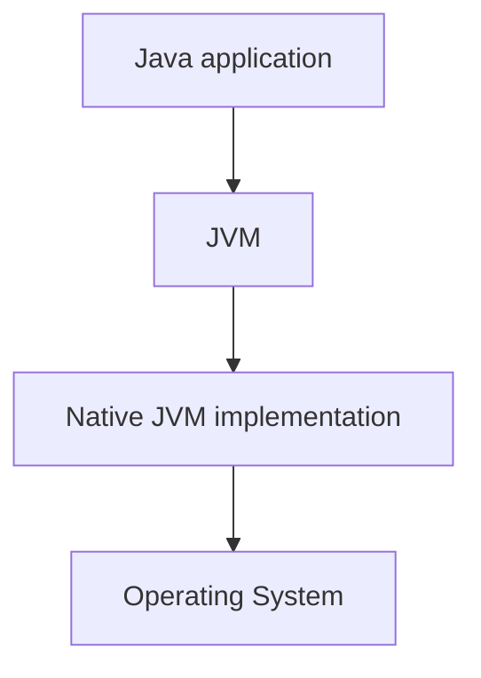

And potentially:

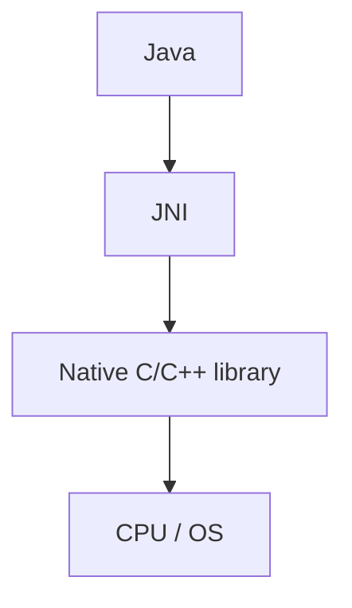

So when you hear **"native code" in JVM discussions**, always ask:

> **Are we talking about JIT-generated machine code, JNI/native libraries, or the native code that implements the JVM itself?**

Those are three related but different concepts.

### The mental model to remember

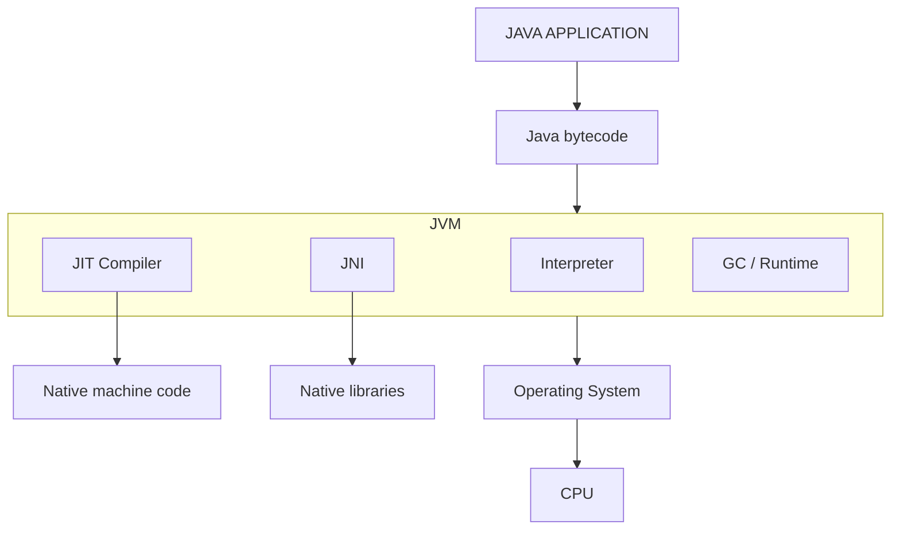

This is also why **JIT, JNI, native memory, JVM crashes/SIGSEGV, and profiling agents** are all closely connected topics.
