Absolutely. We’ll go **one topic at a time**, but we’ll build the mental model so that by the end you can connect JVM internals → memory → GC → performance → production debugging → interview/system-design questions.

Your sequence is good. I’d structure it like this:

### JVM & Performance Mastery Roadmap

1. **JVM Architecture** ← start here
2. **Heap**
3. **Stack**
4. **Metaspace**
5. **Class Loading**
6. **JIT Compilation**
7. **Garbage Collection**
8. **Young Generation**
9. **Old Generation**
10. **GC Pauses**
11. **Memory Leaks**
12. **OutOfMemoryError**
13. **CPU Profiling**
14. **Thread Dumps**
15. **Heap Dumps**
16. **Production debugging — connect everything together**

And importantly, we won't learn these as isolated definitions.

For every topic we'll cover:

* What it is
* Why it exists
* Internal architecture
* What happens at runtime
* Java code examples
* What happens inside the JVM
* Visual mental model
* Important JVM flags
* How to observe it
* Common production problems
* Debugging techniques
* Interview questions
* How it connects to Spring Boot/microservices
* Practical experiments you can run

---

# 1. JVM Architecture

Before understanding heap, stack, GC, JIT, etc., you need to understand **what the JVM actually is**.

The biggest misconception is:

> "JVM = Java Virtual Machine that executes Java code."

That's technically true but not useful enough.

A better mental model is:

> **JVM is a runtime environment that loads Java bytecode, manages memory, executes code, optimizes code, manages threads, and automatically manages object lifetime.**

At a high level:

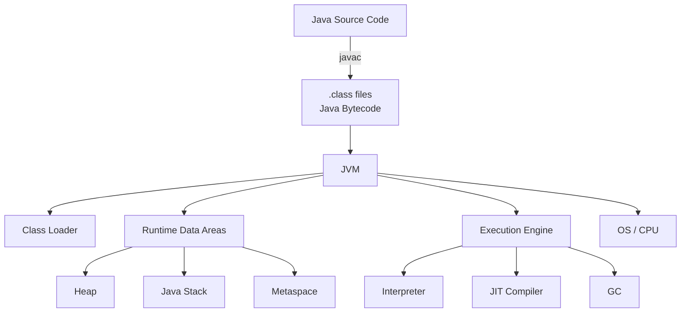

There are **four major pieces** you should initially remember:

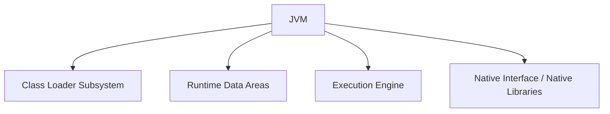

Let's understand each.

---

# 2. Java compilation is NOT native compilation

Suppose you write:

```java
public class Hello {

    public static void main(String[] args) {
        System.out.println("Hello");
    }
}
```

You compile:

```bash
javac Hello.java
```

You don't immediately get machine code.

You get:

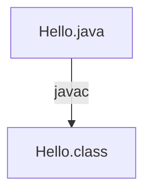

Inside `Hello.class` is **bytecode**.

Something conceptually like:

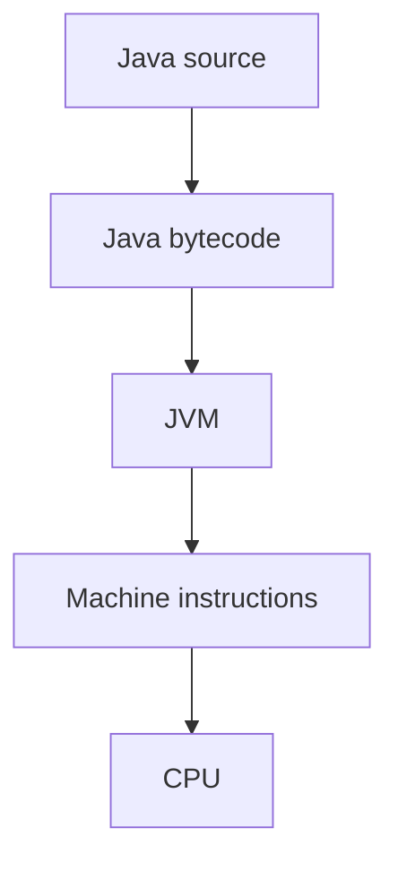

This is fundamentally different from languages where compilation directly targets a particular machine architecture.

For example:

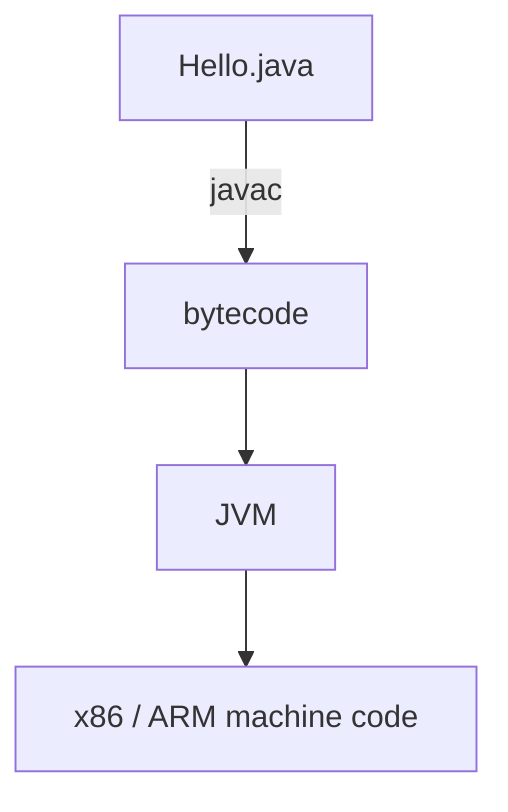

Therefore the famous idea:

> **Write once, run anywhere**

comes primarily from the fact that Java bytecode can run on different JVM implementations.

For example:

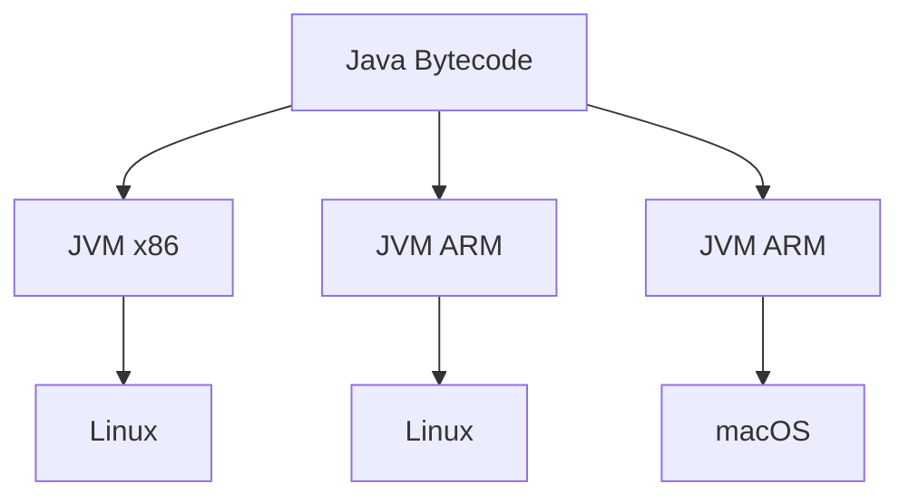

The JVM abstracts the underlying hardware/OS.

---

# 3. What happens when you run Java?

Suppose:

```bash
java Hello
```

A simplified sequence is:

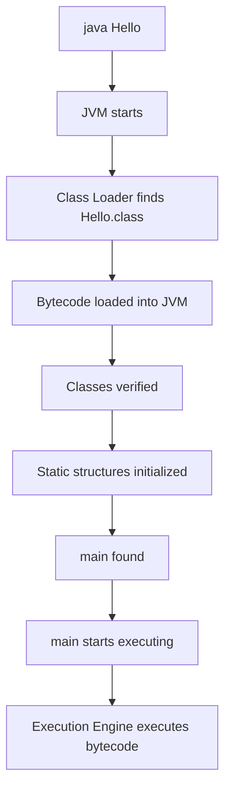

Now the important question:

### Does the JVM execute every bytecode instruction directly?

Not necessarily.

There are primarily two execution approaches:

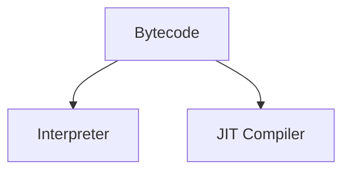

We'll study JIT deeply later.

---

# 4. JVM Architecture — detailed view

Let's expand the architecture.

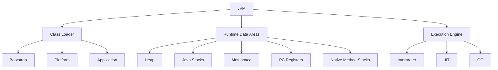

Let's take them individually.

---

# 5. Class Loader

The JVM doesn't magically know about your classes.

If you have:

```java
UserService
```

the JVM needs to:

1. Find the class
2. Load it
3. Verify it
4. Prepare it
5. Resolve references
6. Initialize it

This is the job of the **Class Loader subsystem**.

Conceptually:

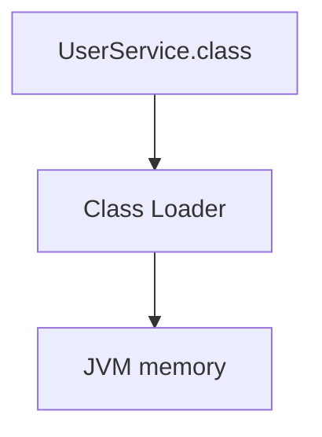

We'll later go very deep into:

```text
Bootstrap ClassLoader
Platform ClassLoader
Application ClassLoader
Parent delegation
Class loading
Linking
Verification
Preparation
Resolution
Initialization
ClassLoader leaks
```

This becomes particularly important in:

* Spring Boot
* application servers
* plugins
* hot deployment
* reflection
* dependency conflicts
* memory leaks

---

# 6. Runtime Data Areas

This is one of the most important parts of JVM architecture.

The JVM needs memory to execute your application.

The runtime memory can be thought of as:

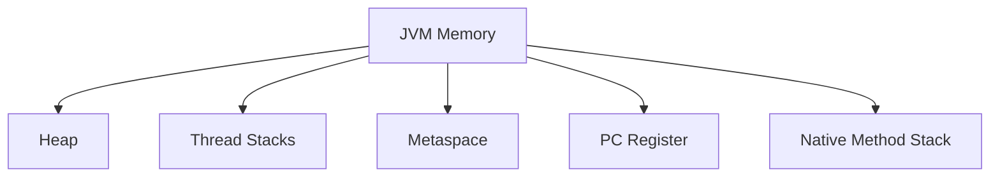

But there is an important distinction.

Some areas are:

### Shared across threads

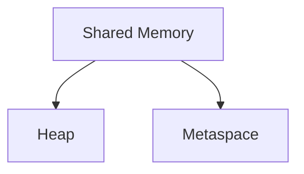

while others are:

### Per-thread

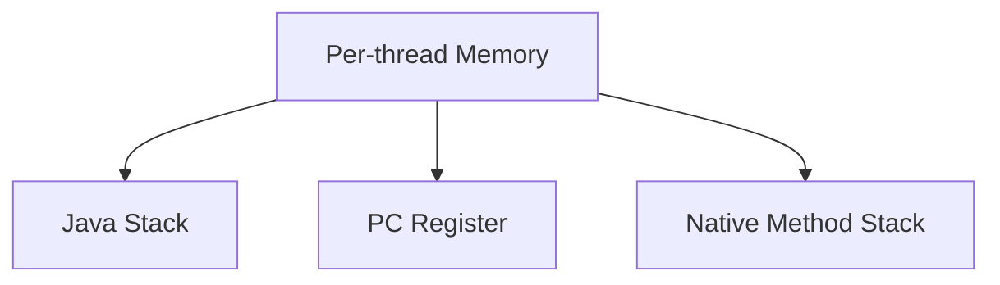

Visualize:

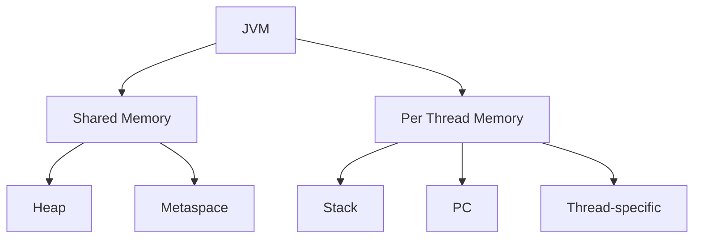

This distinction is **extremely important**.

---

# 7. Heap

The heap is where Java objects generally live.

For example:

```java
User user = new User();
```

The object:


is allocated on the heap.

Conceptually:

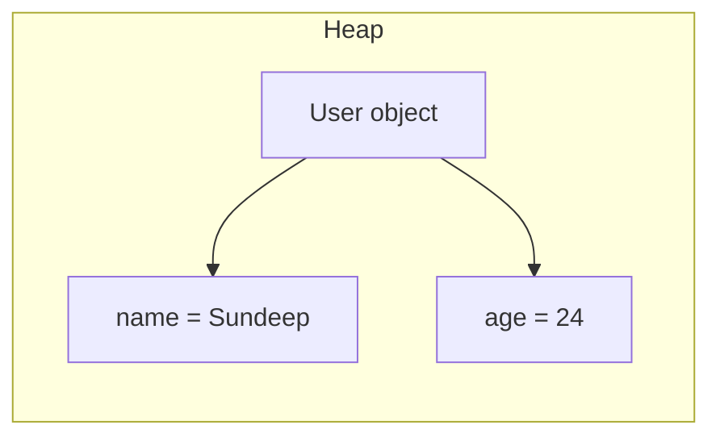

The variable:

```java
user
```

is a reference.

The actual object is in the heap.

We'll later go extremely deep into:

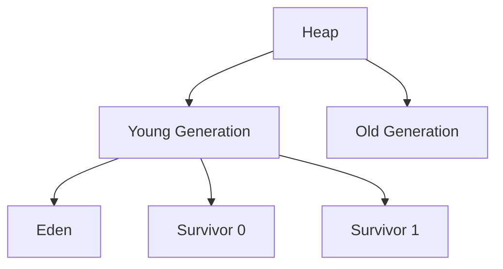

And then:

```text
Minor GC
Major GC
Full GC
Promotion
Survivor spaces
Object aging
Allocation
TLAB
G1
ZGC
Shenandoah
```

---

# 8. Stack

Every Java thread has its own stack.

Suppose:

```java
public static void main(String[] args) {
    calculate();
}

static void calculate() {
    int x = 10;
    int y = 20;
}
```

When `main()` executes:

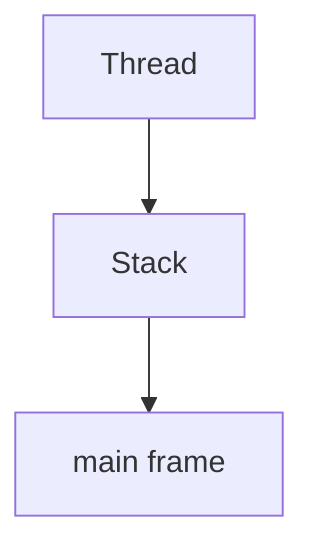

When `calculate()` is called:

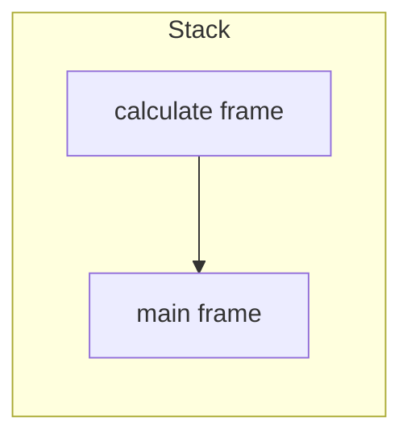

When `calculate()` finishes:

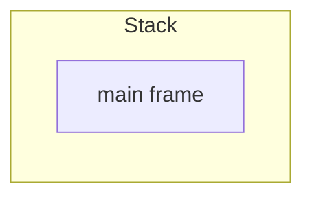

This is why the stack behaves approximately like:

```text
LIFO
```

Each method invocation gets a **stack frame**.

A frame contains information such as:

```mermaid
graph TD
    SF[Stack Frame] --> LV[Local variables]
    SF --> OS[Operand stack]
    SF --> RCP[Reference to runtime constant pool]
    SF --> RI[Return information]
```

This is very important for understanding:

```text
StackOverflowError
Thread dumps
method calls
recursion
local variables
```

---

# 9. One critical misconception: objects are not simply "on stack"

You'll frequently hear:

> "Primitive variables are stored on stack and objects are stored on heap."

That's a useful beginner simplification, but it is **not a precise JVM rule**.

For example:

```java
User user = new User();
```

You can conceptually think:

```mermaid
graph LR
    S[Stack] -->|user reference| H[Heap]
    H --> UO[User object]
```

But modern JVMs can optimize allocations.

Through mechanisms such as:

* escape analysis
* scalar replacement
* stack allocation in some optimized cases

an object may not necessarily result in a traditional heap allocation.

Therefore, for interviews:

> Objects are generally allocated on the heap, while each thread has its own stack containing method frames and local execution state.

That's much safer than saying "all objects are always on heap."

---

# 10. Metaspace

Before Java 8, class metadata was primarily stored in:

```text
PermGen
```

Java 8 replaced PermGen with:

```text
Metaspace
```

Metaspace stores JVM metadata associated with loaded classes.

Think:

```mermaid
graph TD
    CM[Class metadata] --> MS[Metaspace]
```

For example, if your application loads:

```java
User
Order
Payment
Product
```

the JVM needs metadata describing those classes.

Metaspace is involved in storing such class-related metadata.

This becomes very important in applications that dynamically generate/load huge numbers of classes.

For example:

```text
Spring
Hibernate
ByteBuddy
CGLIB
Proxies
Reflection
Dynamic class generation
Application servers
```

can make Metaspace behavior important.

Later we'll examine:

```text
-XX:MaxMetaspaceSize
```

and:

```text
java.lang.OutOfMemoryError: Metaspace
```

---

# 11. PC Register

PC means:

> **Program Counter**

Every Java thread has its own PC register.

It conceptually tracks:

> "Which instruction is this thread currently executing?"

Imagine:

```mermaid
graph TD
    T[Thread] --> PC[PC]
    T --> S[Stack]
```

If bytecode execution is currently around:

```text
instruction 42
```

the PC conceptually points to that execution position.

Each thread therefore needs its own PC.

---

# 12. Native Method Stack

Java can call native code.

For example:

```java
nativeMethod();
```

Native code can be implemented using technologies such as:

```text
JNI
C
C++
```

The JVM therefore has support for native method execution and native stacks.

This becomes particularly relevant when debugging:

```text
JNI
native libraries
JVM crashes
SIGSEGV
native memory
```

which is actually very relevant to production JVM debugging.

---

# 13. Native Code in the JVM

Yes — this is an important JVM concept, especially when you start learning **JVM internals, JNI, profiling, and Java performance**.

## 13.1 What is "native code"?

**Native code = machine-level code compiled for a specific CPU/OS architecture.**

For example, if you write:

```java
int sum(int a, int b) {
    return a + b;
}
```

Java source code is **not directly machine code**.

It goes roughly like:

```mermaid
graph TD
    JS[Java source] --> J[javac]
    J --> BC[Bytecode (.class)]
    BC --> JVM[JVM]
    JVM --> MI[Machine instructions]
    MI --> CPU[CPU]
```

Java bytecode looks conceptually like:

```mermaid
graph TD
    I1[iload_1] --> I2[iload_2]
    I2 --> IA[iadd]
    IA --> IR[ireturn]
```

This bytecode is platform-independent.

Native code, on the other hand, is something like CPU instructions:

```mermaid
graph TD
    MOV[MOV] --> ADD[ADD]
    ADD --> RET[RET]
```

The exact instructions depend on the CPU architecture.

For example:

```mermaid
graph TD
    NC[Native code examples] --> X86[x86-64]
    NC --> ARM[ARM64]
    NC --> RV[RISC-V]
```

So:

> **Native code is code that is directly executable by the target machine's CPU rather than JVM bytecode.**

---

## 13.2 What does "JVM can run native code" mean?

This statement can be confusing.

The JVM primarily executes **Java bytecode**, but it can also **invoke native machine code**.

For example:

```mermaid
graph TD
    JVM[JVM] --> JB[Java bytecode]
    JVM --> NC[Native code]
    JB --> JE[JVM execution]
    NC --> CE[CPU execution]
```

The JVM provides mechanisms for Java code to interact with native code.

The most famous one is:

**JNI — Java Native Interface**

---

## 13.3 Example: Java calling C

Suppose you have Java:

```java
public class NativeDemo {

    public native void sayHello();

    static {
        System.loadLibrary("nativeDemo");
    }
}
```

Notice:

```java
public native void sayHello();
```

There is **no Java implementation**.

You're basically telling the JVM:

> "There is an implementation of this method somewhere outside Java. When this method is called, invoke the native implementation."

Then you could have C code:

```c
#include <stdio.h>

void sayHello() {
    printf("Hello from native code!");
}
```

The C code is compiled into a native library such as:

```text
nativeDemo.dll      Windows
libnativeDemo.so   Linux
libnativeDemo.dylib macOS
```

Then:

```java
NativeDemo demo = new NativeDemo();

demo.sayHello();
```

The flow becomes:

```mermaid
graph TD
    Java[Java] -->|demo.sayHello| JVM2[JVM]
    JVM2 -->|JNI| NL[Native library]
    NL --> MC[Machine code]
    MC --> CPU2[CPU]
```

---

## 13.4 Why would Java need native code?

Because some things are easier or only possible through the operating system or existing native libraries.

For example:

### Operating system APIs

The OS itself exposes native APIs.

```text
Java
 ↓
JVM
 ↓
Native OS API
 ↓
Operating System
```

### Hardware access

Things such as:

```text
GPU
CPU-specific instructions
special hardware
device drivers
```

may require native libraries.

### Existing C/C++ libraries

Suppose an extremely optimized library already exists in C++:

```text
libSomething.so
```

Instead of rewriting millions of lines in Java, Java can interact with it through native interfaces.

---

## 13.5 Another meaning of "native" in the JVM

This is **very important for understanding JVM internals**.

When people say:

> "The JVM runs native code"

they may mean something different from JNI.

The JVM itself is a **native application**.

For example, HotSpot JVM is largely implemented in:

```text
C++
C
Assembly
```

So when you run:

```bash
java MyApplication
```

you're actually starting a native executable.

Conceptually:

```text
java executable
      ↓
HotSpot JVM
      ↓
C/C++/Assembly
      ↓
Operating System
      ↓
CPU
```

Inside that JVM, your Java bytecode runs.

---

## 13.6 JIT compilation

This is probably the most important connection.

Initially:

```java
int add(int a, int b) {
    return a + b;
}
```

gets compiled to Java bytecode:

```text
.class
   ↓
bytecode
```

The JVM can interpret that bytecode.

But if a method becomes **hot** — executed many times — the JIT compiler can compile it into **native machine code**.

For example:

```text
Java source
     ↓
javac
     ↓
Bytecode
     ↓
JVM
     ↓
Interpreter
     ↓
method becomes HOT
     ↓
JIT compiler
     ↓
Native machine code
     ↓
CPU
```

So eventually your Java method may execute as CPU instructions.

---

## 13.7 This is different from JNI

There are two very different situations.

### Case 1 — JIT-generated native code

Your Java code:

```java
int add(int a, int b) {
    return a + b;
}
```

gets compiled by the JVM's JIT.

```text
Java bytecode
      ↓
JIT
      ↓
Native machine code
      ↓
CPU
```

You didn't write the native code.

**The JVM generated it.**

---

### Case 2 — JNI native code

You explicitly have:

```java
native void sayHello();
```

and a C/C++ implementation.

```mermaid
graph TD
    Java[Java] --> JNI[JNI]
    JNI --> CCNL[C/C++ native library]
    CCNL --> CPU[CPU]
```

Here the native code was compiled separately.

---

## 13.8 The JVM itself is native

Think of the JVM as a native program that contains:

```text
+----------------------------------+
|             JVM                  |
|                                  |
|  Class Loader                    |
|  Bytecode Interpreter            |
|  JIT Compiler                    |
|  Garbage Collector               |
|  Thread Management               |
|  JNI                             |
|  Memory Management               |
|                                  |
+----------------------------------+
              |
              ↓
          OS / CPU
```

The JVM itself needs native machine code to operate.

For example, garbage collection algorithms are implemented inside the JVM in native languages.

---

## 13.9 Connection to JVM crashes

This connects directly to JVM crash issues in production.

You might have something like:

```text
Spring Boot
    ↓
JVM
    ↓
Datadog Java Agent
    ↓
native profiler (ddprof)
    ↓
native code
```

The Java application itself may be perfectly valid.

But a native component can crash the **entire JVM process**.

That's because native code operates outside the normal Java safety model.

For example:

```mermaid
graph TD
    JE[Java exception] --> JH[JVM handles it]
```

But:

```mermaid
graph TD
    NC2[Native code] --> IMA[invalid memory access]
    IMA --> SIG[SIGSEGV]
    SIG --> JPC[JVM process crashes]
```

This is why you can see:

```text
SIGSEGV
```

instead of a normal Java exception such as:

```text
NullPointerException
OutOfMemoryError
IllegalStateException
```

---

## 13.10 Java normally protects you from memory problems

Consider:

```java
String s = null;

s.length();
```

You get:

```text
NullPointerException
```

The JVM controls the memory access.

But native C/C++ code can potentially do something like:

```c
int *ptr = NULL;

*ptr = 10;
```

That can cause:

```text
Segmentation Fault
SIGSEGV
```

and potentially kill the whole JVM process.

That's one reason native code is powerful but dangerous.

---

## 13.11 Native code vs Java bytecode

|                      | Java Bytecode       | Native Code                         |
| -------------------- | ------------------- | ----------------------------------- |
| Generated by         | `javac`             | C/C++ compiler, JIT, etc.           |
| Platform independent | Mostly yes          | No                                  |
| Runs directly on CPU | No                  | Yes                                 |
| JVM required         | Yes                 | Not necessarily                     |
| Memory safety        | JVM-managed         | Depends on language                 |
| Example              | `.class`            | `.dll`, `.so`, machine instructions |
| Can crash JVM?       | Normally controlled | Yes, native crashes can             |
| Example technology   | Java                | C/C++/Assembly                      |

---

## 13.12 One subtle but important point

Don't think:

> "Java is interpreted and native code is compiled."

That's an outdated oversimplification.

Modern JVM execution is more like:

```text
                 Java source
                     ↓
                  javac
                     ↓
                  Bytecode
                     ↓
              split->
              ↓             ↓
         Interpreter       JIT
              ↓             ↓
        execution       Native code
                            ↓
                           CPU
```

And simultaneously:

```mermaid
graph TD
    JA[Java application] --> JVM2[JVM]
    JVM2 --> NJI[Native JVM implementation]
    NJI --> OS[Operating System]
```

And potentially:

```mermaid
graph TD
    Java2[Java] --> JNI2[JNI]
    JNI2 --> NCL[Native C/C++ library]
    NCL --> COS[CPU / OS]
```

So when you hear **"native code" in JVM discussions**, always ask:

> **Are we talking about JIT-generated machine code, JNI/native libraries, or the native code that implements the JVM itself?**

Those are three related but different concepts.

### The mental model to remember

```text
                  JAVA APPLICATION
                         |
                    Java bytecode
                         |
                         ↓
              ┌─────────────────────┐
              │         JVM         │
              │                     │
              │ Interpreter         │
              │ JIT Compiler ───────┼──→ Native machine code
              │                     │
              │ JNI ────────────────┼──→ Native libraries
              │                     │
              │ GC / Runtime        │
              └──────────┬──────────┘
                         ↓
                  Operating System
                         ↓
                       CPU
```

This is also why **JIT, JNI, native memory, JVM crashes/SIGSEGV, and profiling agents** are all closely connected topics.

---

# 14. Execution Engine

Now we have bytecode loaded into the JVM.

Something needs to execute it.

That's the **Execution Engine**.

Conceptually:

```mermaid
graph TD
    BC3[Bytecode] --> EE[Execution Engine]
    EE --> I3[Interpreter]
    EE --> JIT3[JIT Compiler]
    EE --> GC2[Garbage Collector]
```

Let's understand the first two.

---

# 15. Interpreter

The interpreter executes bytecode instruction by instruction.

Conceptually:

```text
Bytecode:

instruction 1
instruction 2
instruction 3
instruction 4
instruction 5
```

The interpreter goes:

```text
execute 1
execute 2
execute 3
execute 4
execute 5
```

This allows Java applications to start executing relatively quickly.

But repeatedly interpreting frequently executed code is inefficient.

That's where JIT comes in.

---

# 16. JIT Compiler

JIT =

> **Just-In-Time Compiler**

Instead of repeatedly interpreting hot code, JVM can compile it into native machine code.

Conceptually:

```mermaid
graph TD
    BC4[Java Bytecode] --> I4[Interpreter]
    I4 --> IF[identify frequently executed code]
    IF --> HC[Hot code]
    HC --> JIT4[JIT Compiler]
    JIT4 --> MC[Machine Code]
    MC --> CPU3[CPU]
```

For example:

```java
for (int i = 0; i < 1_000_000_000; i++) {
    calculate(i);
}
```

The JVM can identify:

> "calculate() is executed a huge number of times."

That's a **hot method**.

The JVM can compile optimized machine code for it.

We'll later dive deeply into:

```text
JIT
├── Hot methods
├── Profiling
├── C1 compiler
├── C2 compiler
├── Tiered compilation
├── Inlining
├── Escape analysis
├── Dead code elimination
├── Deoptimization
└── JVM flags
```

This is one of the most important reasons modern Java can be extremely fast.

---

# 17. Garbage Collector

Java automatically manages object lifetime.

Suppose:

```java
User user = new User();
```

Later:

```java
user = null;
```

If nothing else references that object:

```text
       Heap

    +---------+
    | User    |
    +---------+
        ^
        |
      no refs
```

the object becomes eligible for garbage collection.

The GC eventually reclaims its memory.

Conceptually:

```mermaid
graph TD
    App[Application] --> CO[creates objects]
    CO --> HF[Heap fills]
    HF --> GCI[GC identifies unreachable objects]
    GCI --> MR[memory reclaimed]
```

But GC is **much more complicated** than:

> "GC deletes unused objects."

We'll later study:

```text
Reachability
GC roots
Mark
Sweep
Compact
Copy
Generational GC
Concurrent GC
Stop-the-world
G1
ZGC
Shenandoah
```

---

# 18. Putting everything together

Now let's execute this:

```java
public class Demo {

    public static void main(String[] args) {

        User user = new User();

        process(user);
    }

    static void process(User user) {
        System.out.println(user);
    }
}
```

Conceptually:

```text
                 JVM
                  |
        +---------+---------+
        |                   |
        v                   v
     Heap                Thread
        |                   |
        |                   v
        |                 Stack
        |                   |
        |             +-----------+
        |             | main()    |
        |             +-----------+
        |                   |
        |             process() frame
        |                   |
        v                   |
   +------------+           |
   | User       | <---------+
   | object     |
   +------------+
```

Meanwhile:

```mermaid
graph TD
    UC2[User.class] --> CL5[Class Loader]
    CL5 --> CM5[Class metadata]
    CM5 --> MS5[Metaspace]
```

And execution:

```mermaid
graph TD
    BC5[Bytecode] --> I5[Interpreter]
    I5 --> HCD[Hot code detection]
    HCD --> JIT5[JIT]
    JIT5 --> NMC5[Native machine code]
    NMC5 --> CPU5[CPU]
```

And eventually:

```mermaid
graph TD
    H6[Heap] --> OU[Objects become unreachable]
    OU --> GC5[GC]
    GC5 --> MR5[Memory reclaimed]
```

---

# 19. The complete mental model

This is the diagram I want you to remember:

```text
                           JVM
                            |
          +-----------------+-----------------+
          |                 |                 |
          v                 v                 v
   Class Loader       Runtime Areas     Execution Engine
          |                 |                 |
          |        +--------+--------+        |
          |        |        |        |        |
          |        v        v        v        |
          |       Heap   Metaspace  Stacks     |
          |                          |         |
          |                     per thread     |
          |                                    |
          |                    +---------------+
          |                    |
          |                    +--> Interpreter
          |                    |
          |                    +--> JIT Compiler
          |                    |
          |                    +--> Garbage Collector
          |
          v
      .class files
          |
          v
       Bytecode
          |
          v
    Loaded into JVM
          |
          v
     Executed/optimized
          |
          v
       CPU / OS
```

---

# 20. The most important distinction: shared vs per-thread

Memorize this.

### Shared

```mermaid
graph TD
    SM5[Shared] --> H7[Heap]
    SM5 --> M5[Metaspace]
```

Multiple threads can access objects in the heap.

### Per-thread

```mermaid
graph TD
    PT5[Per-thread] --> JS5[Java Stack]
    PT5 --> PC5[PC Register]
    PT5 --> NMS5[Native Method Stack]
```

For example:

```text
                    JVM
                     |
       +-------------+-------------+
       |                           |
    Shared                      Threads
       |                           |
   +---+---+                +------+------+
   |       |                |             |
  Heap  Metaspace         Thread 1      Thread 2
                           |             |
                         Stack         Stack
                           |             |
                           PC            PC
```

This distinction will become extremely useful when we get to:

* concurrency
* thread dumps
* deadlocks
* memory problems
* GC
* CPU profiling

---

# 21. How this maps to your Spring Boot applications

This isn't just theory.

When you run:

```bash
java -jar my-service.jar
```

you have something approximately like:

```text
Spring Boot Application
        |
        v
       JVM
        |
   +----+-------------------+
   |                        |
 Heap                    Threads
   |                        |
   |                    Tomcat threads
   |                    Kafka threads
   |                    Scheduler threads
   |                    Async threads
   |                    Spring threads
   |
   +-- Spring beans
   +-- Hibernate objects
   +-- request objects
   +-- caches
   +-- collections
   +-- DTOs
   +-- entities
```

Then:

```text
Traffic increases
       |
       v
More objects created
       |
       v
Heap allocation increases
       |
       v
GC activity increases
       |
       +------> CPU increases
       |
       +------> GC pauses
       |
       +------> latency increases
```

Or:

```text
Memory leak
    |
    v
Objects remain reachable
    |
    v
GC cannot reclaim them
    |
    v
Heap keeps growing
    |
    v
GC becomes more frequent
    |
    v
Eventually
    |
    v
OutOfMemoryError
```

And if your service becomes slow:

```text
Slow application
      |
      +--> CPU problem?
      |       |
      |       +--> CPU profiling
      |
      +--> Thread problem?
      |       |
      |       +--> Thread dump
      |
      +--> Memory problem?
              |
              +--> Heap dump
              |
              +--> GC analysis
```

**This is where all the topics you're about to learn connect.**

---

# 22. One production debugging example

Imagine your Spring Boot API suddenly goes from:

```text
100 ms
```

to:

```text
5 seconds
```

You don't immediately say:

> "Increase heap."

Instead you investigate.

Possible causes:

```text
                     API latency
                         |
        +----------------+----------------+
        |                |                |
       CPU             Threads          Memory
        |                |                |
    CPU spike        blocked threads    GC pressure
        |                |                |
    Profiling       Thread dump       Heap/GC analysis
```

Maybe you discover:

```text
Heap usage: 90%
GC frequency: extremely high
```

Then:

```text
GC pressure
    |
    v
Objects allocated rapidly
    |
    v
Young generation fills quickly
    |
    v
Young GC
    |
    v
Objects survive
    |
    v
Promoted to old generation
    |
    v
Old generation fills
    |
    v
Longer GC
    |
    v
Latency spike
```

Or perhaps:

```text
Heap usage: 95%
GC unable to reclaim objects
    |
    v
Memory leak
    |
    v
OutOfMemoryError
```

Or:

```text
CPU = 100%
Heap = normal
GC = normal
    |
    v
CPU profiling
    |
    v
Find expensive method
```

Or:

```text
CPU = normal
Heap = normal
Requests = hanging
    |
    v
Thread dump
    |
    v
Many threads BLOCKED
    |
    v
Lock contention
```

**This is the level of understanding we're aiming for.**

---

# 23. What you should be able to answer after JVM Architecture

For interviews, you should eventually be comfortable answering:

### Basic

**What is JVM?**

**What is the difference between JVM, JRE and JDK?**

**Why is Java platform independent?**

**What is bytecode?**

---

### Memory

**What are JVM runtime data areas?**

**Which memory areas are shared between threads?**

**Which are thread-local?**

**Where are objects stored?**

**Where are class metadata stored?**

**What is Metaspace?**

---

### Execution

**How does JVM execute bytecode?**

**Interpreter vs JIT?**

**Why does JVM use JIT?**

**What is hot code?**

**What is JIT optimization?**

---

### Production

**Why can a Java application have high CPU?**

**Why can GC cause latency?**

**How do you investigate a memory problem?**

**How do you investigate high CPU?**

**How do you investigate stuck threads?**

Those questions lead directly into the rest of your roadmap.

---

## Next: Heap

The **next topic should be Heap**, and we'll go much deeper than simply saying "objects live in heap."

We'll build the actual picture:

```text
Heap
│
├── Young Generation
│   ├── Eden
│   ├── Survivor 0
│   └── Survivor 1
│
└── Old Generation
```

Then we'll trace an actual object:

```java
Order order = new Order();
```

from:

```text
allocation
   ↓
Eden
   ↓
Minor GC
   ↓
Survivor
   ↓
aging
   ↓
promotion
   ↓
Old Generation
   ↓
GC
```

and connect it to **Spring Boot, JVM flags, GC logs, memory sizing, and production incidents**.
