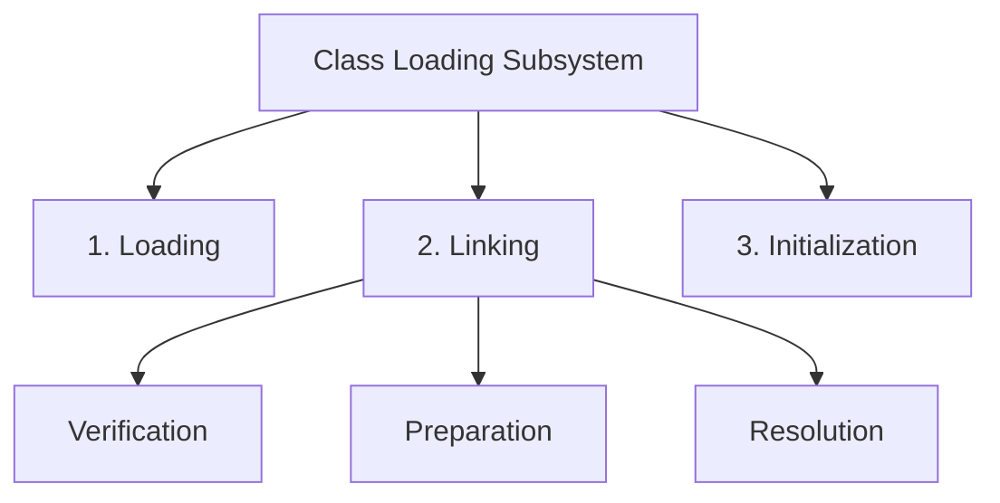
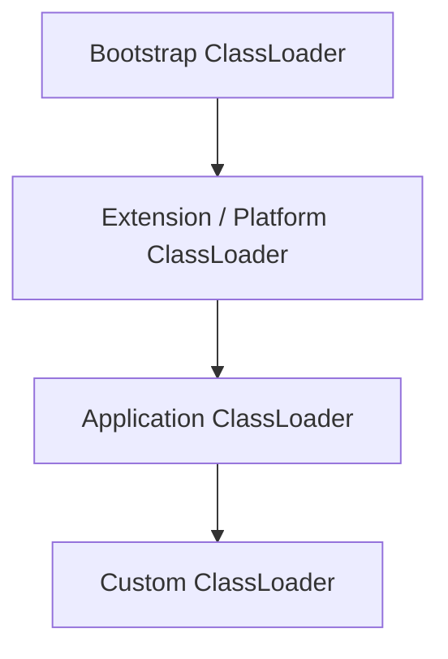

# Class Loading — Deep Dive

Class loading is the mechanism by which the JVM brings `.class` files into memory and makes them available for execution. It is the **very first step** before any Java code can run.

The core mental model is:

> **You write `.java` files → compiler produces `.class` files → JVM class loader loads them into memory → JVM executes them.**

---

# 1. Where does Class Loading fit in the JVM lifecycle?

```text
                  Java Source
                  (.java file)
                       |
                       v
                   Compiler
                  (javac)
                       |
                       v
                  Bytecode
                  (.class file)
                       |
                       v
              +--------+--------+
              |   JVM Process   |
              |                 |
              | Class Loading   |
              |       |         |
              | Linking         |
              |       |         |
              | Initialization  |
              |       |         |
              | Execution       |
              +-----------------+
```

So when you run:

```bash
java com.example.Main
```

The JVM starts loading `Main.class`, then all the classes `Main` depends on, and so on — lazily, as needed.

---

# 2. The Three Phases of Class Loading

Class loading is actually three separate activities:



---

# 3. Phase 1 — Loading

In this phase, the JVM:

1. Finds the `.class` file (from classpath, jar, network, etc.)
2. Reads the raw bytes
3. Creates a `Class` object in the method area (Metaspace)

Conceptually:

```text
Disk / Classpath
      |
      | reads bytes
      v
ClassLoader
      |
      | parses
      v
  Class object
  (in Metaspace)
```

For example:

```java
public class Order {
    int id;
    String name;
}
```

When loaded, the JVM creates a representation of this class:

```text
Metaspace

+---------------------------+
| Order.class               |
| - field: id (int)         |
| - field: name (String)    |
| - methods                 |
| - constant pool           |
+---------------------------+
```

---

# 4. Phase 2 — Linking

Linking has three sub-phases:

## 4.1 Verification

The JVM validates the bytecode is well-formed and safe.

```text
Bytecode
   |
   v
Verify structure
Verify types
Verify stack usage
Verify access rules
   |
   v
Safe to run? YES → proceed
             NO  → VerifyError
```

This is why:

> **Java is a safe language — the JVM verifies bytecode before execution.**

Without this, malicious or corrupted bytecode could crash the JVM or violate security.

## 4.2 Preparation

The JVM allocates memory for static fields and sets them to default values.

```java
public class Config {
    static int timeout = 30;
    static String host = "localhost";
}
```

During preparation:

```text
Config.timeout = 0        (default int)
Config.host    = null     (default reference)
```

The actual values `30` and `"localhost"` are assigned during **Initialization**, not here.

## 4.3 Resolution

Symbolic references in the constant pool are resolved to direct references.

For example:

```java
Order order = new Order();
```

The bytecode contains a symbolic reference like:

```text
#5 = class Order
```

During resolution, this symbolic name is replaced with an actual pointer to the `Order` class structure in memory.

```text
Before:
  symbolic ref: "com/example/Order"

After:
  direct ref:   → [Order class object at 0x7f3c...]
```

---

# 5. Phase 3 — Initialization

This is where static initializers and static field assignments actually run.

```java
public class Config {
    static int timeout = 30;
    static String host = "localhost";

    static {
        System.out.println("Config initialized!");
    }
}
```

Execution order during initialization:

```text
1. static int timeout = 30    → Config.timeout = 30
2. static String host = ...   → Config.host = "localhost"
3. static block executes      → prints "Config initialized!"
```

> **Important:** A class is initialized only once, the first time it is actively used.

---

# 6. When is a class initialized?

A class is initialized when any of the following happens for the first time:

```text
1. An instance of the class is created:
   new Order()

2. A static method of the class is called:
   Order.createDefault()

3. A static field is read or written (non-constant):
   Order.MAX_SIZE

4. The class is the top-level class when JVM starts:
   Main.main()

5. Reflection is used:
   Class.forName("com.example.Order")
```

Conceptually:

```text
First active use
       |
       v
  Initialize class
  (run static blocks)
       |
       v
  Class is ready
```

---

# 7. The ClassLoader Hierarchy

This is one of the most important concepts in Java class loading.



### Bootstrap ClassLoader

Loads core Java classes.

```text
java.lang.*
java.util.*
java.io.*
rt.jar / java.base module
```

Written in native code (C/C++). In Java, it appears as `null` when you call `getClassLoader()` on core classes.

```java
String.class.getClassLoader(); // returns null → Bootstrap
```

### Extension / Platform ClassLoader

Loads JDK extension classes.

```text
javax.*
JSSE, JAXP, etc.
$JAVA_HOME/lib/ext
```

### Application ClassLoader

Loads your application classes from the classpath.

```text
com.example.*
spring.*
hibernate.*
Classes from your -classpath or -cp
```

### Custom ClassLoader

You can write your own ClassLoader for:

```text
Loading classes from a database
Loading encrypted .class files
Hot-reload / plugin systems
OSGi / modular applications
```

---

# 8. The Parent Delegation Model

This is the most critical design principle of Java class loading.

> **When a ClassLoader is asked to load a class, it first delegates to its parent. Only if the parent cannot find the class does it try to load it itself.**

Conceptually:

```text
Application ClassLoader asked to load: java.lang.String
         |
         | delegate to parent
         v
Extension ClassLoader
         |
         | delegate to parent
         v
Bootstrap ClassLoader
         |
         | found! loads java.lang.String
         v
    Returns Class object
```

This ensures:

```text
java.lang.String is always loaded by Bootstrap
                  ↓
Security: nobody can override core classes
Consistency: one copy of String everywhere
```

What if a class is NOT found by parents?

```text
Bootstrap ClassLoader → not found
Extension ClassLoader → not found
Application ClassLoader → searches classpath → found!
```

---

# 9. Why does Parent Delegation matter?

### Security

Without it, a malicious class like:

```java
package java.lang;
public class String {
    // evil implementation
}
```

could be loaded from the classpath and override the real `java.lang.String`.

Parent delegation prevents this — Bootstrap always loads `java.lang.String` first.

### Consistency

Consider:

```text
Thread 1 uses Order class
Thread 2 uses Order class
```

Both threads use the **same** `Class` object because the class was loaded once.

```text
Application ClassLoader
         |
         v
    Order.class (loaded once)
         |
         +---- Thread 1 → instanceof checks work
         +---- Thread 2 → instanceof checks work
```

If two different ClassLoaders each load `Order`, they would be **different types**:

```java
orderFromLoader1 instanceof Order // false!
```

This is a subtle but real problem in frameworks like OSGi.

---

# 10. Real-life Visualization: Spring Boot Application Startup

When you start a Spring Boot app:

```text
java -jar myapp.jar
```

Class loading happens in waves:

```text
Step 1: Bootstrap loads JVM internals

Step 2: Application ClassLoader loads:
  - Spring framework classes
  - Your @SpringBootApplication class
  - Your @Configuration classes
  - Your @Service, @Repository, @Controller classes

Step 3: Spring creates application context
  - Scans for beans
  - More classes loaded dynamically

Step 4: Embedded Tomcat loaded
  - Servlet classes
  - HTTP handler classes

Step 5: App ready to serve requests
```

This is why Spring Boot has a "startup time" — it's loading, verifying, and initializing hundreds of classes.

```text
Application ClassLoader
   |
   +-- Spring Core (loaded from spring-core-*.jar)
   +-- Spring Context
   +-- Spring Web
   +-- Hibernate
   +-- Your com.example.* classes
   +-- ...
```

---

# 11. ClassNotFoundException vs NoClassDefFoundError

This is a very common interview question.

### ClassNotFoundException

Thrown at **runtime** when you try to load a class explicitly and it's not found.

```java
try {
    Class.forName("com.example.MissingClass");
} catch (ClassNotFoundException e) {
    // class not on classpath
}
```

Use case:

```text
Dynamic class loading
JDBC driver loading: Class.forName("com.mysql.Driver")
Reflection
Plugin systems
```

### NoClassDefFoundError

Thrown when a class **was available at compile time** but is **missing at runtime**.

```java
// Compiles fine because OrderService exists at compile time
OrderService service = new OrderService();

// At runtime: OrderService.class is missing from classpath
// → NoClassDefFoundError
```

Conceptually:

```text
ClassNotFoundException
    │
    ├── Explicit class loading
    ├── Class.forName()
    └── Checked exception

NoClassDefFoundError
    │
    ├── Class was known at compile time
    ├── Missing at runtime
    └── Error (not exception)
```

Real example:

```text
You compile with spring-web on classpath.
At runtime, spring-web.jar is missing.
→ NoClassDefFoundError: org/springframework/web/bind/annotation/RestController
```

---

# 12. Lazy Class Loading

Classes are loaded **lazily** — only when first needed.

```java
public class Main {
    public static void main(String[] args) {
        System.out.println("Hello");
        // OrderService is NOT loaded yet
        
        OrderService service = new OrderService();
        // Now OrderService is loaded
    }
}
```

This is important for:

```text
Faster startup (don't load everything upfront)
Reduced memory (only loaded classes consume Metaspace)
Plugin systems (load plugins on demand)
```

---

# 13. Dynamic Class Loading

You can load classes at runtime:

```java
ClassLoader loader = getClass().getClassLoader();
Class<?> clazz = loader.loadClass("com.example.DynamicService");
Object instance = clazz.getDeclaredConstructor().newInstance();
```

Use cases:

```text
Plugin architectures
Hot reload (during development)
Dependency injection frameworks
OSGi containers
Application servers (Tomcat, JBoss)
```

Spring does this heavily:

```text
@Service
public class OrderService { ... }

Spring scans classpath
  → finds OrderService.class
  → loads it
  → creates a proxy (dynamic class)
  → registers as bean
```

---

# 14. Custom ClassLoader Example

```java
public class FileClassLoader extends ClassLoader {

    private String classPath;

    public FileClassLoader(String classPath) {
        this.classPath = classPath;
    }

    @Override
    protected Class<?> findClass(String name) throws ClassNotFoundException {
        try {
            byte[] bytes = loadClassBytes(name);
            return defineClass(name, bytes, 0, bytes.length);
        } catch (IOException e) {
            throw new ClassNotFoundException(name, e);
        }
    }

    private byte[] loadClassBytes(String name) throws IOException {
        String path = classPath + "/" + name.replace('.', '/') + ".class";
        return Files.readAllBytes(Path.of(path));
    }
}
```

Usage:

```java
ClassLoader loader = new FileClassLoader("/custom/path");
Class<?> clazz = loader.loadClass("com.example.MyPlugin");
Object plugin = clazz.getDeclaredConstructor().newInstance();
```

---

# 15. Metaspace and Class Loading

When a class is loaded, its metadata goes to **Metaspace** (native memory).

```text
ClassLoader loads Order.class
      |
      v
Metaspace
+-------------------------------+
| Order class metadata          |
| - fields                      |
| - methods                     |
| - constant pool               |
| - annotations                 |
+-------------------------------+
```

Metaspace grows as more classes are loaded.

If too many classes are loaded (e.g., too many dynamic proxies, CGLib, ASM):

```text
java.lang.OutOfMemoryError: Metaspace
```

Limit Metaspace with:

```bash
-XX:MaxMetaspaceSize=256m
```

---

# 16. Class Unloading

A class can be unloaded when:

```text
The ClassLoader that loaded it becomes unreachable
   AND
No instances of the class exist
   AND
No references to the Class object exist
```

This is rare in practice for application classes (loaded by Application ClassLoader which lives forever).

But custom ClassLoaders in plugin/hot-reload scenarios can enable class unloading:

```text
Plugin loaded → ClassLoader created → classes loaded
Plugin unloaded → ClassLoader becomes unreachable → GC unloads classes
```

This is why Tomcat can hot-deploy web applications.

---

# 17. PermGen vs Metaspace

Before Java 8:

```text
PermGen (Permanent Generation)
  - Part of heap
  - Fixed size
  - Class metadata stored here
  - java.lang.OutOfMemoryError: PermGen space
```

Java 8+:

```text
Metaspace
  - Native memory (outside heap)
  - Grows dynamically
  - java.lang.OutOfMemoryError: Metaspace
```

Why the change?

```text
PermGen had a fixed maximum size
→ frameworks generating many classes (Spring, Hibernate) would hit it
→ OutOfMemoryError: PermGen space was very common

Metaspace uses native memory
→ grows dynamically
→ much less likely to hit limits
→ can still be capped with -XX:MaxMetaspaceSize
```

---

# 18. Class Loading in Microservices / Spring Boot

In a typical Spring Boot app:

```text
Number of loaded classes: 5000 - 15000+

Sources:
  JDK core classes:        ~2000
  Spring Framework:        ~3000
  Hibernate:               ~1500
  Jackson, Slf4j, etc:     ~500
  Your application:        ~500
  Dynamic proxies:         ~200+
```

This is why Metaspace is important to monitor in production.

---

# 19. Debugging Class Loading Issues

Enable class loading logs:

```bash
-verbose:class
```

Output:

```text
[Loaded java.lang.Object from /path/to/rt.jar]
[Loaded com.example.OrderService from file:/app/myapp.jar]
[Loaded com.example.OrderService$$EnhancerBySpring... from ...]
```

This is extremely useful when debugging:

```text
ClassNotFoundException
NoClassDefFoundError
Multiple class definitions
Classpath conflicts
Wrong jar version loaded
```

---

# 20. Common Class Loading Problems

### 1. Classpath Conflicts (JAR Hell)

```text
App depends on library-1.0.jar AND library-2.0.jar
Both have: com.example.Utility
Only one gets loaded → unexpected behavior
```

### 2. Class Cast Exception with Custom ClassLoaders

```java
Object loaded = customLoader.loadClass("com.example.Service")
                             .getDeclaredConstructor()
                             .newInstance();

Service service = (Service) loaded; // ClassCastException!
// Because Service was loaded by different ClassLoaders
```

### 3. Static Initializer Failures

```java
static {
    throw new RuntimeException("Init failed");
}
```

Result:

```text
ExceptionInInitializerError
```

Any subsequent use of the class:

```text
NoClassDefFoundError: Could not initialize class com.example.Config
```

---

# Interview Preparation — Class Loading

---

## Q1: What are the phases of class loading in the JVM?

**Answer:**

Class loading involves three main phases:

1. **Loading** — The JVM finds and reads the `.class` file, creating a `Class` object in Metaspace.

2. **Linking** — Three sub-phases:
   - **Verification** — validates bytecode is well-formed and safe
   - **Preparation** — allocates memory for static fields, sets default values (0, null, false)
   - **Resolution** — replaces symbolic references with direct memory references

3. **Initialization** — Runs static initializers and static field assignments in top-down order.

---

## Q2: What is the Parent Delegation Model?

**Answer:**

When a ClassLoader is asked to load a class, it first asks its parent ClassLoader. Only if the parent cannot find the class does the child try to load it.

Hierarchy:
```text
Bootstrap ClassLoader (core Java classes)
    ↑
Extension ClassLoader (JDK extensions)
    ↑
Application ClassLoader (your app classpath)
    ↑
Custom ClassLoader
```

Benefits:
- **Security**: Core Java classes (like `java.lang.String`) cannot be overridden by classpath classes
- **Consistency**: Each class is loaded only once by one ClassLoader, ensuring `instanceof` works correctly

---

## Q3: ClassNotFoundException vs NoClassDefFoundError — what's the difference?

**Answer:**

| | ClassNotFoundException | NoClassDefFoundError |
|---|---|---|
| Type | Checked Exception | Error |
| When | Explicit dynamic loading (`Class.forName()`) | Class was present at compile time, missing at runtime |
| Catch | Yes, can catch | Generally not caught |
| Cause | Class not on classpath during explicit load | Classpath issue at runtime, or static initializer failure |

---

## Q4: When exactly is a class initialized?

**Answer:**

A class is initialized only on first **active use**:
- Creating an instance (`new MyClass()`)
- Calling a static method
- Reading/writing a non-constant static field
- Reflection via `Class.forName()`
- Being the main class at JVM startup

Merely declaring a reference does NOT trigger initialization:
```java
MyClass obj; // NOT initialized
obj = new MyClass(); // NOW initialized
```

---

## Q5: What causes OutOfMemoryError: Metaspace?

**Answer:**

Metaspace stores class metadata. It grows as more classes are loaded. OOM occurs when:

- Too many classes are loaded and Metaspace hits its limit (`-XX:MaxMetaspaceSize`)
- Frameworks like Spring/Hibernate generate too many dynamic proxies
- Memory leak in a custom ClassLoader that keeps loading new classes without unloading

Fix:
- Increase `-XX:MaxMetaspaceSize`
- Investigate why so many classes are being generated
- Ensure ClassLoaders are garbage collected when no longer needed

---

## Q6: How is class unloading possible?

**Answer:**

A class can be unloaded when all three conditions are met:
1. The ClassLoader that loaded it becomes unreachable
2. No instances of the class exist
3. No direct `Class` object references exist

In practice, application classes loaded by the Application ClassLoader are almost never unloaded because the ClassLoader itself stays alive.

Custom ClassLoaders (used in hot-deploy, plugins, OSGi) can be discarded, allowing their classes to be garbage collected — this is how Tomcat implements hot redeploy.

---

## Q7: What is the difference between PermGen and Metaspace?

**Answer:**

| | PermGen (pre-Java 8) | Metaspace (Java 8+) |
|---|---|---|
| Location | Part of Java heap | Native memory (off-heap) |
| Size | Fixed maximum | Grows dynamically |
| OOM type | `OutOfMemoryError: PermGen space` | `OutOfMemoryError: Metaspace` |
| Default limit | Small (64-256MB) | Virtually unlimited (bounded by native memory) |
| Tuning | `-XX:MaxPermSize` | `-XX:MaxMetaspaceSize` |

Metaspace was introduced to eliminate the common PermGen OOM issues in frameworks that dynamically generate many classes.

---

## Q8: How does Class.forName() work? When would you use it?

**Answer:**

`Class.forName(name)` explicitly asks the ClassLoader to load and initialize a class by name at runtime.

```java
// Loads AND initializes the class
Class<?> clazz = Class.forName("com.mysql.cj.jdbc.Driver");
```

Use cases:
- JDBC driver registration (classic pattern)
- Plugin systems where plugin class names come from config
- Dependency injection frameworks scanning classpath
- Serialization/deserialization with dynamic types

The two-arg version controls initialization:
```java
Class.forName("com.example.Service", false, loader); // don't initialize
```

---

## Q9: What happens if a static initializer throws an exception?

**Answer:**

```java
class Config {
    static {
        throw new RuntimeException("Failed to load config");
    }
}
```

1. The first access throws `ExceptionInInitializerError`
2. The class is marked as failed
3. Every subsequent access to that class throws `NoClassDefFoundError: Could not initialize class Config`

This is a common source of confusing errors — you see `NoClassDefFoundError` but the root cause was a static initializer failure.

---

## Q10: What is a ClassLoader leak and how does it happen?

**Answer:**

A ClassLoader leak happens when a ClassLoader cannot be garbage collected, keeping all its loaded classes in Metaspace indefinitely.

Common cause in web containers:

```text
Web app deployed in Tomcat
  → App ClassLoader created
  → Classes loaded
  → App undeployed
  → App ClassLoader SHOULD be GC'd

BUT:
  → A static field in a library holds a reference to an app class
  → App class was loaded by App ClassLoader
  → App ClassLoader cannot be GC'd
  → All classes remain in Metaspace
  → Repeated redeployments → Metaspace grows → OOM
```

This is exactly why `java.lang.OutOfMemoryError: Metaspace` was common in Tomcat before Java 8 (PermGen space), and still happens with bad library code.
