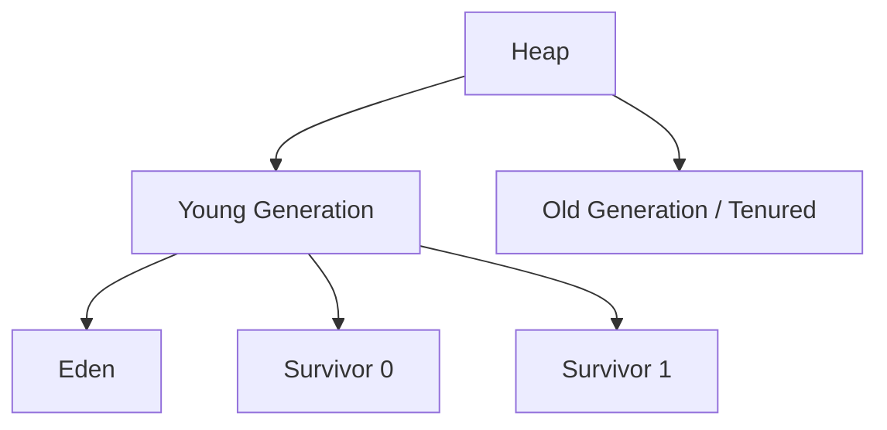

# Garbage Collection — Deep Dive

Garbage Collection (GC) is the automatic memory management system in the JVM. It reclaims memory occupied by objects that are no longer reachable, so developers do not have to manually free memory like in C/C++.

The core mental model is:

> **GC finds objects that are no longer reachable from any live reference, and reclaims the memory they occupy — without the developer doing anything.**

---

# 1. Why do we need Garbage Collection?

In languages like C:

```c
User* user = malloc(sizeof(User));
// ... use user ...
free(user);  // developer must free manually
```

If you forget `free()`:

```text
Memory leak → program consumes more and more memory → crash
```

If you `free()` too early:

```text
Dangling pointer → crash / undefined behavior / security vulnerability
```

Java eliminates both problems with GC:

```java
User user = new User();
// ... use user ...
// no free() needed — GC handles it
```

---

# 2. The Fundamental Concept: Reachability

GC does NOT ask:

> "Has this object been used recently?"

It asks:

> **"Is this object reachable from any live reference?"**

```text
Reachable = object can be reached by traversing references from GC roots
Unreachable = no path from any GC root to this object
```

If unreachable → eligible for collection.

---

# 3. GC Roots

GC roots are the starting points for the reachability graph. They are always considered "live."

GC roots include:

```text
1. Active thread stacks
   (local variables in running methods)

2. Static fields of loaded classes
   (static User user = ...)

3. JNI references
   (objects referenced by native code)

4. Synchronized monitor objects
   (objects used in synchronized blocks)

5. JVM internal references
   (class objects, exception objects, etc.)
```

Visualization:

```text
GC Roots
   |
   +----> Stack (Thread 1)
   |          |
   |          +----> OrderService object
   |                     |
   |                     +----> Order object
   |                     +----> User object
   |
   +----> Static Fields
   |          |
   |          +----> ConfigCache object
   |                     |
   |                     +----> Map entries
   |
   +----> JNI References
              |
              +----> native library object
```

Everything reachable from GC roots is LIVE. Everything else is GARBAGE.

---

# 4. How GC Works — Mark and Sweep

The classic GC algorithm is **Mark and Sweep**.

### Phase 1: Mark

Starting from GC roots, the GC traverses all reachable objects and marks them.

```text
Start: GC Roots
   |
   v
Object A (marked ✓)
   |
   v
Object B (marked ✓)
   |
   +---> Object C (marked ✓)
   |
   +---> Object D (marked ✓)

Object E (not reachable — NOT marked)
Object F (not reachable — NOT marked)
```

### Phase 2: Sweep

The GC reclaims all unmarked (unreachable) objects.

```text
Before sweep:
+--+--+--+--+--+--+
| A| E| B| F| C| D|
+--+--+--+--+--+--+
  ✓  ✗  ✓  ✗  ✓  ✓

After sweep:
+--+  +--+  +--+--+
| A|  | B|  | C| D|
+--+  +--+  +--+--+
 (E and F reclaimed)
```

Problem: fragmentation. The freed gaps are scattered.

---

# 5. Mark-Sweep-Compact

To solve fragmentation, add a **Compact** phase:

```text
After compaction:
+--+--+--+--+
| A| B| C| D| free space
+--+--+--+--+
```

All live objects moved to one end. All free space at the other end.

Benefits:
- Eliminates fragmentation
- Allocation becomes a simple pointer bump

Cost:
- Moving objects is expensive (update all references)
- Requires Stop-The-World pauses

---

# 6. Copying Collectors

Instead of marking in place, copy live objects to a new region:

```text
From Space:
+--+--+--+--+--+--+
| A| E| B| F| C| D|
+--+--+--+--+--+--+
  ✓  ✗  ✓  ✗  ✓  ✓

To Space (empty):
+------------------+

After copy:
To Space:
+--+--+--+--+-----+
| A| B| C| D| free|
+--+--+--+--+-----+

From Space: entirely free (all dead objects)
```

Benefits:
- No fragmentation
- Fast allocation (pointer bump in To Space)
- Implicitly compacted

Cost:
- Needs 2x memory (From + To)
- All live objects must be copied

This is the basis for how Young Generation GC works (Eden → Survivor).

---

# 7. The Generational Hypothesis

The most important insight driving modern GC design:

> **Most objects die young.**

In a typical application:

```text
Objects created:
  Request-scoped DTOs           → die after each request
  Temporary strings             → die immediately
  Iterator objects              → die after the loop
  Short-lived collections       → die quickly

Long-lived objects:
  Application config            → lives forever
  Connection pools              → lives forever
  Large caches                  → lives for hours/days
```

Statistics across many programs:

```text
Objects that die within the first GC cycle: ~80-95%
Objects that survive many GC cycles: ~5-20%
```

Implication:

> **If we focus collection effort on where most garbage is (young objects), GC becomes much more efficient.**

---

# 8. Generational Heap

Based on the generational hypothesis, the heap is divided:



### Young Generation

```text
New objects allocated here.
Collected frequently (Minor GC).
Short-lived → most objects die in Minor GC.
Uses copying collector (fast).
```

### Old Generation

```text
Long-lived objects promoted here.
Collected less frequently (Major GC / Full GC).
Large.
Uses mark-sweep-compact (slower).
```

---

# 9. Types of GC Events

### Minor GC (Young GC)

```text
When: Eden is full
What: Collect Young Generation only
Duration: Typically milliseconds
Frequency: Very frequent (seconds/minutes)
Stop-the-world: Yes, but brief
```

### Major GC (Old GC)

```text
When: Old Generation is filling up
What: Collect Old Generation (sometimes Young too)
Duration: Tens of milliseconds to seconds
Frequency: Less frequent
Stop-the-world: Depends on collector
```

### Full GC

```text
When: Both young and old are full, or explicit System.gc()
What: Entire heap collected
Duration: Longest — can be seconds
Frequency: Should be rare
Stop-the-world: Yes — application pauses completely
```

---

# 10. Stop-The-World (STW)

Many GC phases require **Stop-The-World**:

```text
All application threads paused
         ↓
GC runs
         ↓
Application threads resume
```

Why is STW needed?

```text
While GC marks objects, if application threads are also running:
  → Application creates new references
  → Application nulls out references
  → The "reachability" graph is changing
  → GC might miss live objects or collect live ones
```

STW ensures a consistent snapshot.

The goal of modern GCs (G1, ZGC, Shenandoah) is to minimize or eliminate STW pauses.

---

# 11. GC Collectors — Overview

HotSpot JVM offers several GC algorithms:

```text
Serial GC
Parallel GC
CMS GC (deprecated)
G1GC (default since Java 9)
ZGC (low-latency, Java 15+)
Shenandoah (low-latency, OpenJDK)
```

---

# 12. Serial GC

```bash
-XX:+UseSerialGC
```

```text
Single-threaded GC
Stop-the-world for all collections
Simple and low overhead
Good for: small heaps, single-CPU machines, embedded systems
Bad for: large heaps, multi-core servers, latency-sensitive apps
```

Visualization:

```text
App:     [running][running][running][running][running]
GC:                        [====GC====]
App threads:               [paused   ]
```

---

# 13. Parallel GC

```bash
-XX:+UseParallelGC
```

```text
Multi-threaded GC (uses multiple CPU cores)
Still stop-the-world
Higher throughput than Serial
Good for: batch processing, throughput-oriented workloads
Bad for: latency-sensitive applications (long pauses)
```

Visualization:

```text
App threads: [running][running]          [running][running]
GC threads:                   [==GC1==]
                               [==GC2==]
                               [==GC3==]
                               [==GC4==]
         (4 GC threads working in parallel)
```

Good for:

```text
Nightly batch jobs
Data processing pipelines
ETL jobs
Number crunching
```

---

# 14. CMS (Concurrent Mark Sweep) — Deprecated

```bash
-XX:+UseConcMarkSweepGC  # deprecated in Java 9, removed Java 14
```

Goal: minimize pause time by doing most GC work concurrently with the application.

```text
Phase 1: Initial Mark    (STW — short)  → mark GC roots
Phase 2: Concurrent Mark (concurrent)   → traverse object graph while app runs
Phase 3: Remark          (STW — short)  → fix concurrent changes
Phase 4: Concurrent Sweep(concurrent)   → reclaim dead objects while app runs
```

Problem: does not compact — leads to fragmentation in old generation.

Replaced by G1GC.

---

# 15. G1GC (Garbage First) — Default since Java 9

```bash
-XX:+UseG1GC
```

G1GC redesigns the heap entirely.

Instead of one large Eden, one Old space — G1 uses **regions**:

```text
Heap divided into many equal-sized regions (~2048 regions)

[E][E][E][S][S][O][O][O][H][E][O][E][S][O]

E = Eden region
S = Survivor region
O = Old region
H = Humongous region (large objects)
```

Benefits:

```text
1. Predictable pause times
   -XX:MaxGCPauseMillis=200  (target pause time)

2. Concurrent marking
   G1 marks old objects concurrently while app runs

3. Incremental collection
   Collects the regions with most garbage first (hence "Garbage First")

4. Compaction
   Copies live objects to new regions → no fragmentation
```

G1 GC phases:

```text
Young-only phase:
   Minor GC runs → Eden + Survivor regions collected

Space-reclamation phase:
   Old regions collected (those with most garbage first)
   Mixed GC = Young + some Old regions collected together
```

---

# 16. ZGC (Z Garbage Collector) — Ultra-low latency

```bash
-XX:+UseZGC
```

Available since Java 11 (experimental), production-ready Java 15+.

Goal: pause times < 1ms, regardless of heap size.

Key innovations:

```text
Load barriers (colored pointers)
   → References have metadata bits
   → GC can relocate objects while app runs
   → No STW for most work

Concurrent relocation
   → Objects moved concurrently (not STW)

Scales to terabyte heaps
   → Pause times stay < 1ms even with multi-TB heaps
```

Visualization:

```text
Traditional GC:
App: [running][running][PAUSED 200ms][running][running]

ZGC:
App: [running][running][pause 0.5ms][running][running]
GC:            [==concurrent work==========]
```

When to use ZGC:

```text
Latency-sensitive applications (trading, gaming, real-time)
Very large heaps (>16GB)
Applications that cannot tolerate GC pauses
```

Trade-off:

```text
More CPU usage (concurrent GC work)
Higher memory overhead (colored pointers, forwarding tables)
```

---

# 17. Shenandoah GC

```bash
-XX:+UseShenandoahGC
```

Similar goals to ZGC — ultra-low pauses via concurrent collection.

Available in OpenJDK (Red Hat contributed).

Key difference from ZGC:

```text
Shenandoah: concurrent compaction via "Brooks pointers" (indirection)
ZGC: concurrent relocation via "colored pointers" + load barriers
```

Both achieve similar pause times. Choice is often deployment/availability.

---

# 18. Choosing the Right GC

| Scenario | Recommended GC |
|---|---|
| Single-core, small heap | Serial GC |
| Batch processing, max throughput | Parallel GC |
| Interactive apps, moderate latency | G1GC |
| Ultra-low latency (<1ms pauses) | ZGC or Shenandoah |
| Very large heaps (>100GB) | ZGC |

---

# 19. GC Tuning Basics

```bash
# Heap size
-Xms512m -Xmx4g

# GC selection
-XX:+UseG1GC
-XX:+UseZGC
-XX:+UseParallelGC

# G1GC pause target
-XX:MaxGCPauseMillis=200

# Young generation ratio
-XX:NewRatio=2   # Old:Young = 2:1

# Survivor ratio
-XX:SurvivorRatio=8  # Eden:Survivor = 8:1

# Tenuring threshold
-XX:MaxTenuringThreshold=15  # Max GC cycles before promotion to Old

# GC logging
-Xlog:gc*:file=gc.log:time,uptime,level,tags:filecount=5,filesize=20m
```

---

# 20. GC Metrics to Monitor

```text
1. GC Frequency
   How often is Minor/Major GC happening?
   Too frequent → allocation pressure too high

2. GC Pause Duration
   How long do GC pauses last?
   Long pauses → latency spikes for users

3. GC Throughput
   % of time application is running (vs. time in GC)
   Target: >95% application time

4. Heap Usage After GC
   If heap usage after GC keeps growing → memory leak
   If it's stable → healthy

5. Promotion Rate
   How fast are objects promoted to Old generation?
   High rate → Young space too small or objects living too long
```

---

# 21. Real-life: E-commerce Application

Imagine an e-commerce Spring Boot app:

```java
@PostMapping("/checkout")
public OrderResponse checkout(@RequestBody CartRequest cart) {
    Order order = orderService.createOrder(cart);
    paymentService.process(order.getPaymentInfo());
    emailService.sendConfirmation(order);
    return mapper.toResponse(order);
}
```

Per request, allocations might include:

```text
CartRequest (deserialized JSON)
Order object
PaymentInfo object
Email template strings
ConfirmationResponse
Hibernate entity objects
Jackson ObjectNode intermediate objects
Validator results
```

With 500 req/sec:

```text
Allocation rate: ~100 MB/sec
Most objects die after request completes
→ Young GC runs every few seconds
→ Each Minor GC takes ~5-20ms
→ Application threads pause briefly
→ Users experience occasional 20ms latency spikes
```

To reduce pauses:

```text
Option 1: Increase Young Gen size
   → Less frequent Minor GC
   → But each pause might be slightly longer

Option 2: Use ZGC
   → Concurrent GC
   → Pauses < 1ms
   → Higher CPU usage

Option 3: Reduce allocation rate
   → Reuse objects
   → Object pooling
   → Reduce intermediate objects
```

---

# Interview Preparation — Garbage Collection

---

## Q1: How does garbage collection work in Java?

**Answer:**

GC works by identifying unreachable objects and reclaiming their memory. The process:

1. **Mark**: Starting from GC roots (thread stacks, static fields, JNI refs), traverse all reachable objects and mark them as live.
2. **Sweep**: Reclaim memory from all unmarked (unreachable) objects.
3. **Compact** (in some collectors): Move live objects together to eliminate fragmentation.

Modern JVMs use **generational GC** based on the observation that most objects die young. This splits the heap into Young and Old generations, enabling efficient collection of short-lived objects separately from long-lived ones.

---

## Q2: What is the Generational Hypothesis?

**Answer:**

The generational hypothesis states that **most objects die young** — they become unreachable very shortly after creation.

Evidence: Temporary DTOs, request-scoped objects, iterator objects, intermediate strings — all created and discarded within milliseconds.

This means:
- Collecting the young generation frequently (where most garbage is) is very efficient
- The old generation has mostly live objects, so collecting it less frequently is fine

This insight is the basis for the Young/Old generation heap split in all major JVMs.

---

## Q3: What is the difference between Minor GC, Major GC, and Full GC?

**Answer:**

| | Minor GC | Major GC | Full GC |
|---|---|---|---|
| Scope | Young generation | Old generation | Entire heap |
| Trigger | Eden full | Old gen filling | OOM imminent, System.gc() |
| Duration | Milliseconds | 10s ms to seconds | Longest — seconds |
| Frequency | Frequent | Infrequent | Should be rare |
| Impact | Brief pause | Significant pause | Long pause, app freeze |

---

## Q4: What are GC roots?

**Answer:**

GC roots are objects the GC considers always live — the starting points for reachability analysis:

1. **Thread stacks**: local variables in active methods
2. **Static fields**: `static User user = ...` in loaded classes
3. **JNI references**: objects referenced by native (C/C++) code
4. **Synchronized monitors**: objects used in `synchronized` blocks
5. **JVM internals**: class objects, system class references

If an object is reachable (directly or transitively) from any GC root → it's live and cannot be collected.

---

## Q5: What is Stop-The-World and why is it needed?

**Answer:**

Stop-The-World (STW) is a pause where all application threads are suspended while the GC runs.

Why needed:
- The object reference graph changes as the application runs
- If GC marks objects while app threads also modify references, GC might see an inconsistent graph
- Some threads might create new references while GC is marking → those new objects might be missed
- STW ensures a consistent snapshot of the heap

Modern GCs (G1, ZGC, Shenandoah) minimize STW by doing most GC work concurrently. ZGC targets < 1ms pauses regardless of heap size.

---

## Q6: How does G1GC differ from Parallel GC?

**Answer:**

| | Parallel GC | G1GC |
|---|---|---|
| Heap layout | Contiguous Eden/Old spaces | Region-based (many small regions) |
| Pause predictability | Unpredictable | Configurable target: `-XX:MaxGCPauseMillis` |
| Old gen collection | Full STW pause | Concurrent marking + incremental mixed GC |
| Compaction | Full compaction (long STW) | Incremental compaction per region |
| Fragmentation | Less (full compaction) | Managed via region evacuation |
| Best for | Throughput, batch jobs | Interactive apps, mixed workloads |

G1GC is the default since Java 9 because it provides good balance between throughput and latency.

---

## Q7: When would you use ZGC over G1GC?

**Answer:**

Use ZGC when:
- Application cannot tolerate GC pauses > 1-10ms (trading systems, gaming, real-time)
- Heap is very large (> 16-32 GB) — G1 pauses scale with live set size; ZGC stays < 1ms
- Latency is the primary concern over raw throughput

Trade-offs of ZGC:
- More CPU usage (concurrent GC requires extra CPU cycles)
- Higher memory overhead (load barriers, forwarding tables)
- May have slightly lower throughput compared to Parallel GC

---

## Q8: What is GC throughput and how do you measure it?

**Answer:**

GC throughput = percentage of time the application spends executing (not in GC pauses).

```text
Throughput = (Total time - GC pause time) / Total time × 100%
```

Example:
```text
Total time: 100 seconds
GC pause time: 5 seconds
Throughput: 95%
```

A healthy production application should have > 95% GC throughput.

Low throughput (< 90%) means GC is consuming too much time. This triggers `GC overhead limit exceeded` OOM if GC takes > 98% of time for 5 consecutive GC cycles.

---

## Q9: How does GC handle very large objects?

**Answer:**

Large objects (larger than a threshold — typically 50% of a G1 region size) are treated specially:

**G1GC**: Large objects go to **Humongous regions** — multiple contiguous regions allocated for one object.

```text
Normal object: goes to Eden → Survivor → Old
Humongous object: goes directly to Humongous regions (skips Young)
```

Humongous regions are collected during marking/cleanup phases, not during regular Minor GC.

Too many humongous objects can cause:
- Region fragmentation
- More frequent Full GC
- Increased GC overhead

Tune region size:
```bash
-XX:G1HeapRegionSize=16m  # larger regions = higher humongous threshold
```

---

## Q10: What is the "GC overhead limit exceeded" error?

**Answer:**

```text
java.lang.OutOfMemoryError: GC overhead limit exceeded
```

The JVM throws this when:
- GC is spending > 98% of total execution time
- Each GC recovers less than 2% of heap
- This happens for 5 consecutive GC cycles

It means the application is spending almost all its time doing GC but not making progress — effectively hung.

Root causes:
- Memory leak (heap filling with unreachable-but-referenced objects)
- Heap too small for the live set
- Extremely high allocation rate with insufficient heap

Fix:
- Find and fix the memory leak (heap dump analysis)
- Increase heap size (`-Xmx`)
- Reduce allocation rate
- Disable the limit (not recommended): `-XX:-UseGCOverheadLimit`
