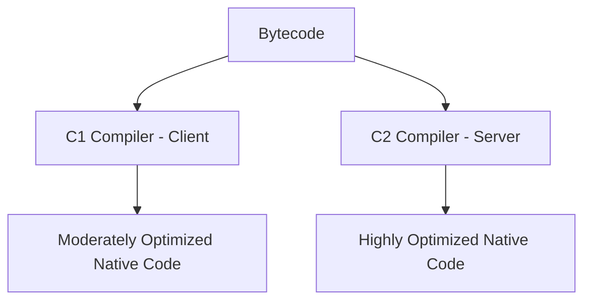

# JIT — Just-In-Time Compilation — Deep Dive

JIT compilation is one of the most powerful features of the JVM. It is the reason Java can be competitive with C/C++ in performance despite being a managed language.

The core mental model is:

> **Java bytecode is interpreted by the JVM. When the JVM detects that certain code is executed frequently ("hot code"), it compiles that code to native machine instructions — making subsequent executions dramatically faster.**

---

# 1. The Execution Pipeline

Without JIT, Java execution looks like this:

```text
Java Source
    |
    v
javac (compile)
    |
    v
Bytecode (.class)
    |
    v
JVM Interpreter
    |
    v  (slow — interprets one instruction at a time)
CPU executes
```

With JIT:

```text
Java Source
    |
    v
javac (compile)
    |
    v
Bytecode (.class)
    |
    v
JVM Interpreter (initial)
    |
    | (hotspot detected!)
    v
JIT Compiler → Native Machine Code
    |
    v  (fast — native code runs directly on CPU)
CPU executes
```

---

# 2. Why not compile everything upfront?

You might ask: why doesn't Java just compile everything to native code like C++?

Several reasons:

```text
1. Startup Time
   Compiling all bytecode to native code at startup is expensive.
   The app would take a very long time to start.

2. Profile-guided optimization
   JIT can observe actual runtime behavior and optimize accordingly.
   Ahead-of-time (AOT) compilers don't have this advantage.

3. Platform independence
   Bytecode is platform-independent.
   Native code is platform-specific.
   JIT bridges this at runtime.

4. Adaptive optimization
   JIT can de-optimize and re-optimize as behavior changes.
```

The JVM's strategy is:

```text
Interpret first (fast startup, slow execution)
Profile code (detect hot spots)
JIT compile hot code (fast execution for what matters)
```

---

# 3. What is a "Hot Spot"?

HotSpot is the name of the most popular JVM (used in OpenJDK, Oracle JDK). The name refers to exactly this concept.

A hot spot is code that executes very frequently:

```java
for (int i = 0; i < 10_000_000; i++) {
    result += calculate(i);  // this becomes HOT
}
```

The JVM tracks execution counts:

```text
calculate() invocations:
  10 → interpret
  100 → interpret
  1000 → interpret
  10000 → interpret
  ...
  10000 (threshold) → JIT compile!
```

After JIT compilation:

```text
calculate() → native machine code
```

Now it runs at near-C speed.

---

# 4. Compilation Thresholds

The JVM uses counters to decide when to JIT:

```text
Method invocation counter
    +
Back-edge counter (loop iterations)
    =
Compilation trigger
```

Default thresholds (HotSpot server mode):

```bash
-XX:CompileThreshold=10000
```

So after ~10,000 invocations, a method is considered hot enough to JIT compile.

You can tune this:

```bash
-XX:CompileThreshold=1000    # compile sooner, more JIT overhead
-XX:CompileThreshold=100000  # compile later, more interpretation
```

---

# 5. The Two JIT Compilers: C1 and C2

HotSpot has two JIT compilers:



### C1 Compiler (Client Compiler)

```text
Fast compilation
Moderate optimization
Low compilation overhead
Good for short-lived applications (GUI apps, tools)
```

### C2 Compiler (Server Compiler)

```text
Slow compilation
Aggressive optimization
Higher compilation overhead
Great for long-running server applications
```

In modern JVMs, both are used together via **Tiered Compilation**.

---

# 6. Tiered Compilation

Tiered compilation is the default in Java 8+ and gives you the best of both worlds.

```text
Level 0: Interpreter
Level 1: C1 — no profiling
Level 2: C1 — light profiling
Level 3: C1 — full profiling
Level 4: C2 — full optimization
```

Execution flow:

```text
Method first called
    |
    v
Level 0: Interpreter (collect basic stats)
    |
    | method gets hot
    v
Level 3: C1 with profiling (collect type info, branch data)
    |
    | method gets very hot
    v
Level 4: C2 (aggressive optimization using profile data)
```

This means:

```text
Startup: fast (C1 compiles quickly)
Steady state: optimal (C2 aggressively optimizes hot code)
```

Visualization:

```text
Time →

|--- Interpretation ---|--- C1 compiled ---|--- C2 compiled ---|
                       ↑                   ↑
                  light opt          heavy opt
                  (fast compile)     (slow compile, fast execute)
```

---

# 7. Key JIT Optimizations

The JIT applies many powerful optimizations. Here are the most important ones.

---

## 7.1 Method Inlining

This is the **most impactful** JIT optimization.

```java
int add(int a, int b) {
    return a + b;
}

int result = add(10, 20);
```

Without inlining:

```text
call add()  → push frame → compute → pop frame → return
```

With inlining, JIT replaces the call site with the body:

```text
result = 10 + 20;  // no method call overhead!
```

JIT can inline thousands of tiny methods. This is why in Java you can write:

```java
user.getName().toUpperCase()
```

without worrying about method call overhead — JIT inlines them all.

Inlining is controlled by:

```bash
-XX:MaxInlineSize=35        # max bytecodes for inlining
-XX:FreqInlineSize=325      # max bytecodes for frequently called methods
```

---

## 7.2 Escape Analysis

JIT analyzes whether an object "escapes" the current method or thread.

```java
int calculate() {
    Point p = new Point(10, 20);
    return p.x + p.y;
}
```

The object `p` never escapes `calculate()`.

JIT can:

```text
1. Scalar replacement: replace object fields with local variables
   p.x → local int x = 10
   p.y → local int y = 20

2. Stack allocation: allocate p on stack instead of heap
   (avoids GC pressure)

3. Eliminate entirely: just compute 10 + 20 = 30
```

This is why:

```text
new Point()
```

does NOT always result in a heap allocation in optimized code.

Escape analysis is enabled by default:

```bash
-XX:+DoEscapeAnalysis  # default: on
```

---

## 7.3 Loop Unrolling

```java
for (int i = 0; i < 4; i++) {
    process(i);
}
```

JIT can unroll this to:

```java
process(0);
process(1);
process(2);
process(3);
```

This eliminates:

```text
loop counter increment
bounds check
branch instruction
```

Reducing loop overhead significantly.

---

## 7.4 Dead Code Elimination

```java
if (false) {
    expensiveOperation();  // dead code
}
```

JIT eliminates this entirely. Never executes.

More subtle:

```java
int result = add(10, 20);
// result is never used
```

JIT may eliminate the entire call if the result is unused and `add()` has no side effects.

---

## 7.5 Constant Folding

```java
int x = 10 * 20 * 30;
```

JIT computes:

```text
10 * 20 = 200
200 * 30 = 6000
```

At compile time. The code becomes:

```java
int x = 6000;
```

---

## 7.6 Branch Prediction and Bias

If JIT observes (from profiling) that a branch is almost always taken one way:

```java
if (user.isActive()) {
    // 99% of the time we're here
    processActiveUser(user);
} else {
    // rare case
    handleInactive(user);
}
```

JIT can arrange code so the common path is the "fall-through" path (no branch needed), and the rare path is the jump:

```text
check user.isActive()
(falls through to processActiveUser)  ← common, fast
(jumps to handleInactive)             ← rare
```

This aligns with CPU branch prediction hardware.

---

## 7.7 Devirtualization

In Java, polymorphic calls are virtual:

```java
Animal animal = getAnimal();
animal.makeSound();  // which makeSound()? Dog? Cat?
```

JIT observes (via profiling) which type is actually used at runtime:

```text
getAnimal() always returns Dog
```

JIT can devirtualize:

```java
// replaces virtual dispatch with direct call
((Dog) animal).makeSound();
```

Or even inline the body of `Dog.makeSound()` directly.

---

# 8. JIT and Warmup

JIT compilation takes time. This leads to the "warmup" phenomenon:

```text
Time →

Performance (req/sec)
|
|                              ___________
|                         ____/
|                    ____/
|               ____/
|______________/
|
+-----|---------|---------|---------|------> Time
    0s         5s        10s       15s
    
    ↑
    Startup: interpreting
             ↑
             Warming up: JIT compiling C1
                         ↑
                         Warm: C2 compiled, full performance
```

This is a significant concern for:

```text
Microservices that restart frequently
Serverless / FaaS (cold starts)
Kubernetes pods that are killed and restarted
Load testing (don't measure cold performance)
```

---

# 9. Real-life Example: Spring Boot API

Consider a Spring Boot REST endpoint:

```java
@GetMapping("/orders/{id}")
public OrderResponse getOrder(@PathVariable String id) {
    Order order = orderRepository.findById(id);
    return mapper.toResponse(order);
}
```

Initially (cold):

```text
JVM interprets all method calls
- getOrder()
- findById()
- toResponse()
- Hibernate SQL mapping
- Jackson serialization
→ ~50ms per request
```

After warmup (hot):

```text
JIT compiles all hot paths
- Method calls inlined
- Hibernate mapping optimized
- Jackson serialization paths compiled
- Reflection calls devirtualized
→ ~5ms per request
```

10x improvement from JIT alone.

---

# 10. Code Cache

JIT-compiled native code is stored in the **Code Cache** (native memory).

```text
JVM Memory
│
├── Java Heap
├── Metaspace
├── Thread Stacks
└── Code Cache ← JIT output lives here
```

Default Code Cache sizes:

```bash
-XX:InitialCodeCacheSize=160k
-XX:ReservedCodeCacheSize=240m  # JDK 11+ default is larger
```

If Code Cache fills up:

```text
JIT stops compiling new methods
→ Fall back to interpretation
→ Performance degrades suddenly
```

Warning in logs:

```text
Java HotSpot(TM) 64-Bit Server VM warning:
CodeCache is full. Compiler has been disabled.
```

Fix:

```bash
-XX:ReservedCodeCacheSize=512m
```

---

# 11. Deoptimization

JIT can also **undo** its optimizations — this is called deoptimization.

Suppose JIT assumes:

```java
animal.makeSound();
// Always Dog at runtime → JIT inlines Dog.makeSound()
```

Then a `Cat` shows up:

```text
Assumption violated!
JIT deoptimizes this code
Falls back to interpreter
Then re-profiles
Then possibly re-compiles with correct assumptions
```

This is transparent to the developer. The JVM handles it automatically.

Deoptimization can cause brief performance hiccups in production — sometimes visible as latency spikes.

---

# 12. Viewing JIT Compilation

Enable JIT logging:

```bash
-XX:+PrintCompilation
```

Output:

```text
    1       3       b  n   0    java.lang.Object::hashCode (0 bytes)
   72      14         n   0    java.lang.System::arraycopy (0 bytes)
  150      42  %       4    com.example.OrderService::processAll @ 12 (45 bytes)
  151      43           4    com.example.OrderService::process (23 bytes)
```

Columns mean:

```text
Time | CompileID | Attributes | Level | Method
```

Attributes:
```text
%  = on-stack replacement (OSR) — loop compiled while running
*  = synchronized
!  = has exception handler
b  = blocking
n  = native method
```

Level:
```text
1-3 = C1
4   = C2
```

---

# 13. GraalVM and AOT Compilation

GraalVM introduces a new JIT compiler written in Java, and also supports:

### Native Image (AOT)

Compiles Java to native binary ahead of time:

```bash
native-image -jar myapp.jar
```

Output:

```text
myapp (native binary)
```

Trade-offs:

```text
Native Image
  + Instant startup (milliseconds)
  + Low memory footprint
  - No JIT warmup = peak throughput may be lower
  - Limited dynamic features (reflection, dynamic proxies)

JIT (traditional JVM)
  + Adaptive optimization
  + Full dynamic Java features
  - Warmup time
  - Higher memory footprint
```

Spring Boot 3+ supports GraalVM native images for serverless/cloud use cases.

---

# 14. JIT Flags Summary

```bash
# View JIT compilation events
-XX:+PrintCompilation

# View inlining decisions
-XX:+PrintInlining

# Tiered compilation (default in Java 8+)
-XX:+TieredCompilation

# Disable JIT (interpreter only — very slow, for debugging)
-Xint

# Force all compilation via C1 only
-XX:TieredStopAtLevel=1

# Escape analysis
-XX:+DoEscapeAnalysis

# Code cache size
-XX:ReservedCodeCacheSize=256m

# Compilation threshold
-XX:CompileThreshold=10000
```

---

# Interview Preparation — JIT Compilation

---

## Q1: What is JIT compilation and why does the JVM use it?

**Answer:**

JIT (Just-In-Time) compilation is the process where the JVM compiles frequently executed ("hot") bytecode into native machine code at runtime, rather than interpreting it repeatedly.

The JVM starts by interpreting bytecode (fast startup, slow execution). It profiles execution to find hot methods/loops. Hot code is compiled to native instructions, making subsequent executions dramatically faster.

Why not compile everything upfront?
- Startup would be very slow
- JIT uses runtime profile data to make better optimization decisions than AOT compilers
- Bytecode remains platform-independent; native code is generated per-platform at runtime

---

## Q2: What is tiered compilation?

**Answer:**

Tiered compilation uses both C1 and C2 compilers in stages:

```text
Level 0: Interpreter
Level 1-3: C1 (fast compilation, moderate optimization, profiling)
Level 4: C2 (slow compilation, aggressive optimization)
```

Benefits:
- Fast startup (C1 compiles quickly)
- Optimal steady-state performance (C2 aggressively optimizes using C1's profile data)
- No trade-off between startup time and peak throughput

Default in Java 8+.

---

## Q3: What is method inlining and why is it important?

**Answer:**

Method inlining replaces a method call with the body of the called method, eliminating the call overhead (frame creation, stack push/pop, branch).

```java
// Before inlining
int result = add(10, 20);

// After inlining by JIT
int result = 10 + 20;
```

It is the most impactful JIT optimization because:
- Eliminates call overhead for small methods
- Enables further optimizations (constant folding, dead code elimination) on the inlined code
- Transforms many small-method Java idioms into efficient machine code

---

## Q4: What is escape analysis?

**Answer:**

Escape analysis determines whether an object "escapes" the scope of the method or thread where it's created.

If an object does not escape:
- **Stack allocation**: allocate on stack instead of heap (no GC pressure)
- **Scalar replacement**: decompose object fields into local variables
- **Elimination**: remove the object entirely if its values can be computed directly

Example:
```java
int area() {
    Rectangle r = new Rectangle(10, 20);
    return r.width * r.height; // r never escapes
}
// JIT may eliminate the Rectangle allocation entirely
```

---

## Q5: What is the JVM Code Cache and what happens if it fills up?

**Answer:**

The Code Cache is a native memory region where JIT-compiled native code is stored. It is separate from the Java heap.

If the Code Cache fills up:
- JIT compiler stops compiling new methods
- The JVM falls back to interpreting uncompiled code
- Application performance degrades significantly
- A warning is logged: `"CodeCache is full. Compiler has been disabled."`

Fix:
```bash
-XX:ReservedCodeCacheSize=512m
```

Monitor with:
```bash
jcmd <pid> Compiler.codecache
```

---

## Q6: What is deoptimization?

**Answer:**

Deoptimization is the process where the JVM undoes a JIT optimization when its assumptions are violated.

Example:
```java
// JIT sees only Dog objects → inlines Dog.makeSound()
animal.makeSound();

// Now a Cat appears → assumption violated
// JIT deoptimizes → falls back to interpreter → re-profiles → may re-compile
```

Deoptimization is transparent to the developer. The JVM handles it automatically.

In production, deoptimization events can cause brief latency spikes, visible in `-XX:+PrintCompilation` output as `made not entrant` or `made zombie`.

---

## Q7: How does JIT warmup affect microservices?

**Answer:**

During warmup, the JVM is still interpreting or using C1-compiled code. Peak performance (C2-compiled) is only reached after sufficient execution.

Impact on microservices:
- **Cold start**: first requests are slow (interpreting)
- **Warmup period**: performance gradually improves (JIT compilation happening)
- **Steady state**: full performance after warmup (minutes of traffic)

Solutions:
- **GraalVM Native Image**: AOT compilation — instant startup, no warmup needed (but lower peak throughput)
- **Class Data Sharing (CDS)**: share pre-parsed class data across JVM instances
- **Profile-Guided AOT** (experimental in recent JDKs): use profiling data for AOT

In Kubernetes: don't kill pods before warmup completes. Consider using readiness probes that wait for the app to warm up before receiving traffic.

---

## Q8: What is the difference between `-Xint`, `-Xcomp`, and `-server`?

**Answer:**

| Flag | Behavior |
|---|---|
| `-Xint` | Interpreter only — no JIT. Very slow, useful for debugging |
| `-Xcomp` | Force compile all methods immediately (no profiling, less optimal) |
| `-server` | Use server JVM settings (C2 compiler, more aggressive optimization) |
| `-client` | Use client JVM settings (C1 compiler, faster startup) |

In modern JVMs, `-server` is the default for 64-bit JVMs, and tiered compilation combines C1 and C2 automatically, making `-client`/`-server` distinction less relevant.

---

## Q9: What is On-Stack Replacement (OSR)?

**Answer:**

OSR allows the JVM to switch a method from interpreted to JIT-compiled execution **while the method is still running** — specifically, while inside a loop.

```java
for (int i = 0; i < 10_000_000; i++) {
    process(i);  // this loop gets hot
}
// Without OSR: wait until next invocation to use compiled code
// With OSR: switch to compiled code mid-loop!
```

In `-XX:+PrintCompilation` output, OSR compilations are marked with `%`.

OSR is important for programs with long-running loops that never return from the method.

---

## Q10: Can JIT compilation cause production issues?

**Answer:**

Yes, in rare cases:

1. **JIT compilation pauses**: C2 compilation is CPU-intensive. On very busy systems, JIT threads can compete with application threads.

2. **Deoptimization storms**: After a class hierarchy change (e.g., a new type loaded at runtime), many compiled methods can be invalidated simultaneously, causing many deoptimizations and re-compilations.

3. **Code Cache exhaustion**: If Code Cache fills up, JIT stops and performance degrades.

4. **JIT bugs**: Rare, but JIT compilers have bugs. Sometimes disabling specific optimizations (`-XX:-OptimizeStringConcat`) or using `-Xint` for debugging reveals JIT-related issues.

Monitoring:
```bash
-XX:+PrintCompilation
-XX:+PrintGCDetails
jcmd <pid> Compiler.codecache
```
