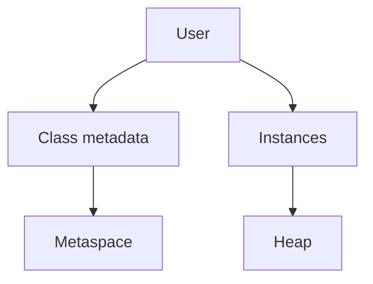
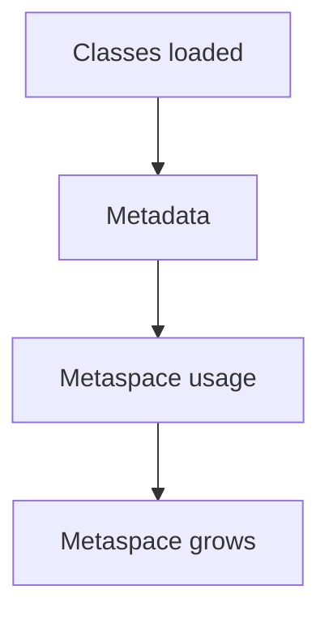
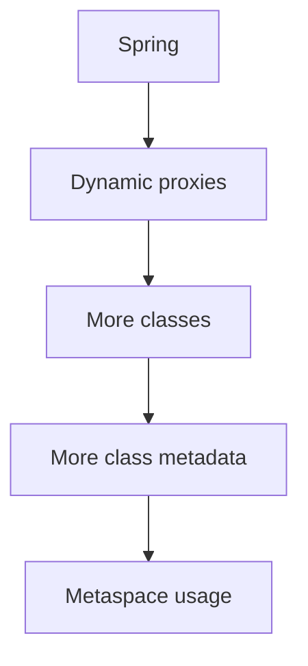
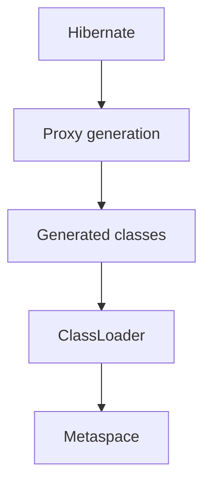
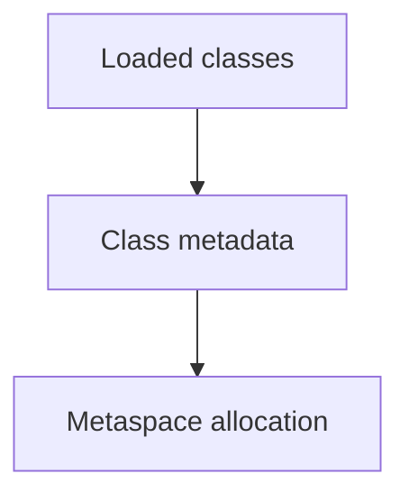
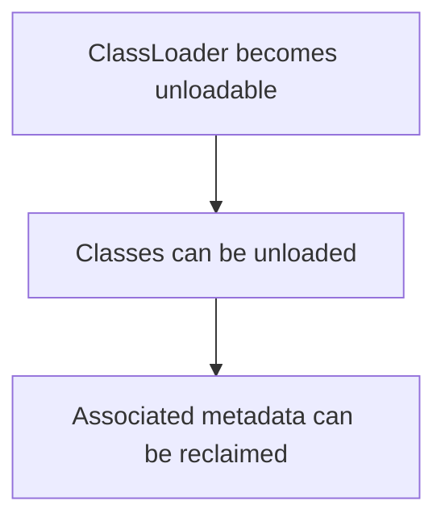
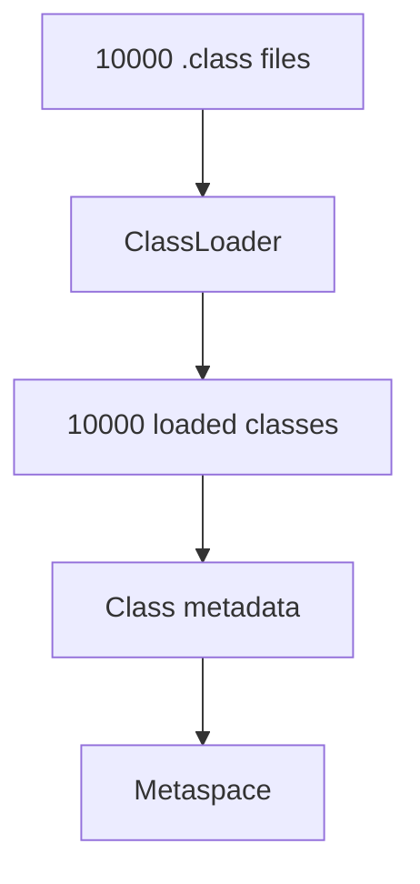
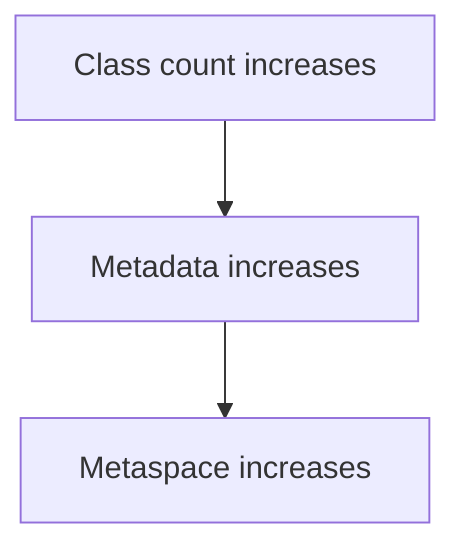
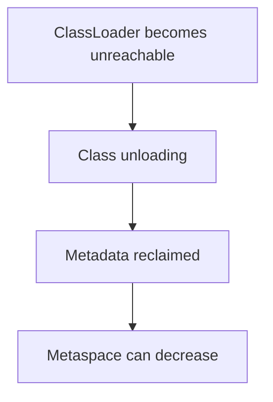

# 4. Metaspace — Deep Dive

We've covered:

```text
JVM Architecture
      ↓
Heap
      ↓
Stack
```

Now we move to **Metaspace**.

This is particularly important because it connects directly to:

* Class loading
* Reflection
* Spring
* Hibernate
* CGLIB / ByteBuddy proxies
* Dynamic class generation
* Class unloading
* `OutOfMemoryError: Metaspace`
* ClassLoader memory leaks

The core mental model is:

> **Metaspace is native memory used by the JVM for metadata associated with loaded classes.**

---

# 1. First: What exactly is a "class"?

Before understanding Metaspace, distinguish these two things:

```java
User user = new User();
```

There are two fundamentally different things involved.

### Object


This is an **instance**.

### Class


This represents information about the `User` type.

Conceptually:



So:

```text
User.class
```

and:

```text
new User()
```

are very different things.

---

# 2. Heap vs Metaspace

Suppose:

```java
class User {

    private String name;
    private int age;

    void print() {
        System.out.println(name);
    }
}
```

And:

```java
User user = new User();
```

Conceptually:

```text
                JVM
                 |
        +--------+--------+
        |                 |
       Heap           Metaspace
        |                 |
        v                 v
   User object       User class metadata
        |                 |
        |                 +-- class structure
        |                 +-- method metadata
        |                 +-- field metadata
        |
        +-- name
        +-- age
```

The exact internal representation is JVM implementation-dependent, but this distinction is essential.

---

# 3. Why does the JVM need class metadata?

Imagine this:

```java
User user = new User();

user.print();
```

The JVM needs information about:

```text
User
```

such as:

```text
What class is this?
What methods does it have?
What fields does it have?
What is its superclass?
What interfaces does it implement?
What method/field descriptors exist?
What runtime metadata is associated with it?
```

The JVM needs this information while executing the program.

That's what the class metadata structures are for.

---

# 4. What happened before Java 8?

This is an extremely common interview question.

Before Java 8, HotSpot used:

```text
PermGen
```

or:

> **Permanent Generation**

for class metadata.

Conceptually:

```text
Java 7 and earlier

Heap
│
├── Young Generation
├── Old Generation
└── PermGen
```

Then Java 8 removed PermGen and introduced:

```text
Metaspace
```

Conceptually:

```text
Java 8+

Heap
│
├── Young Generation
└── Old Generation

Native Memory
└── Metaspace
```

That's one of the major differences.

---

# 5. Why was PermGen replaced?

PermGen had several limitations.

One major issue was that class metadata was managed inside a fixed-ish region of the Java heap.

If an application loaded many classes:

```text
classes
classes
classes
classes
...
```

PermGen could fill up.

You could see:

```text
java.lang.OutOfMemoryError:
PermGen space
```

Metaspace moved class metadata outside the Java heap into **native memory**.

That allowed the JVM to manage class metadata differently and dynamically expand it, subject to limits.

---

# 6. Metaspace is NOT part of the Java Heap

This is extremely important.

Suppose:

```bash
-Xmx2g
```

This controls the maximum Java heap.

It does **not** mean:

```text
All JVM memory = 2 GB
```

You can conceptually have:

```text
JVM Process Memory
│
├── Java Heap
│   ├── Young
│   └── Old
│
├── Metaspace
│
├── Thread Stacks
│
├── Code Cache
│
├── Direct Buffers
│
└── Other Native Memory
```

So:

```text
-Xmx
```

controls heap.

Metaspace has its own configuration.

---

# 7. `-XX:MaxMetaspaceSize`

You can configure a maximum metaspace size:

```bash
-XX:MaxMetaspaceSize=256m
```

Conceptually:

```text
Metaspace
+----------------------------+
|                            |
| Class metadata             |
| Class metadata             |
| Class metadata             |
|                            |
+----------------------------+
             |
             v
       max ≈ 256 MB
```

Without an explicit maximum, Metaspace can grow as needed subject to available native memory and JVM behavior.

---

# 8. `-XX:MetaspaceSize`

There is also:

```bash
-XX:MetaspaceSize
```

This is frequently misunderstood.

It is **not simply "the maximum Metaspace."**

It is related to the threshold that influences when the JVM performs certain class-metadata-related GC/full-GC behavior and dynamically adjusts the metaspace size.

For interviews, remember:

```text
MetaspaceSize
    ≠
MaxMetaspaceSize
```

### `MaxMetaspaceSize`

Upper limit.

### `MetaspaceSize`

Initial/threshold-related sizing parameter that the JVM can adjust.

---

# 9. What exactly goes into Metaspace?

Be careful here.

You will often hear:

> "Metaspace stores classes."

That's too vague.

A better statement is:

> **Metaspace stores JVM metadata associated with loaded classes.**

This can include class-related structures such as:

```text
Class metadata
Method metadata
Field metadata
Runtime constant-pool-related structures
Type information
Method-related structures
```

The exact internal layout is implementation-dependent.

Some things you may commonly associate with classes are **not simply all stored in Metaspace**.

For example, actual object instances are in the heap.

---

# 10. Example

Consider:

```java
class Employee {

    private String name;
    private int age;

    public void work() {
        System.out.println("Working");
    }
}
```

When `Employee` is loaded, JVM needs metadata representing the type.

Conceptually:

```text
Metaspace

Employee
│
├── class information
├── superclass information
├── field information
│   ├── name
│   └── age
├── method information
│   └── work()
└── runtime class metadata
```

Then:

```java
Employee e = new Employee();
```

creates an instance:

```text
Heap

+----------------------+
| Employee object      |
|----------------------|
| name                 |
| age                  |
+----------------------+
```

So:

```text
             Employee
                |
       +--------+--------+
       |                 |
       v                 v
   Metaspace            Heap
   class info         instances
```

---

# 11. What happens when a class is loaded?

This is where Metaspace connects to our next topic: **Class Loading**.

Suppose you have:

```java
UserService.class
```

The JVM roughly goes through:

```text
.class file
    |
    v
Class Loader
    |
    v
Load class
    |
    v
Link class
    |
    v
Initialize class
    |
    v
Class metadata available
```

The metadata associated with that loaded class requires JVM memory.

That's where Metaspace becomes relevant.

We'll cover the complete lifecycle in the next topic.

---

# 12. Metaspace and ClassLoader

This is perhaps the most important connection.

Suppose:

```text
ApplicationClassLoader
        |
        +---- User.class
        +---- Order.class
        +---- Payment.class
```

The ClassLoader loads classes.

The JVM maintains metadata for those loaded classes.

Conceptually:

```text
ClassLoader
    |
    +---- User.class --------> Metaspace metadata
    |
    +---- Order.class -------> Metaspace metadata
    |
    +---- Payment.class ------> Metaspace metadata
```

This means:

> **Class loading and Metaspace are tightly connected.**

And this leads directly to one of the nastier memory problems in Java:

> **ClassLoader memory leaks.**

---

# 13. Why can Metaspace grow?

Suppose your application continuously loads classes:

```text
Class 1
Class 2
Class 3
...
Class 100000
```

Every loaded class requires associated metadata.

Therefore:



But here's the important part:

> **Loaded classes can only be unloaded when their defining ClassLoader becomes eligible for garbage collection, subject to JVM conditions.**

This is extremely important.

---

# 14. Class unloading

Suppose:

```text
ClassLoader A
    |
    +---- User.class
    +---- Order.class
    +---- Payment.class
```

If the ClassLoader itself becomes unreachable:

```text
GC Roots
    |
    X
ClassLoader A
```

and the JVM determines its classes can be unloaded, their associated class metadata can eventually be reclaimed.

Conceptually:

```text
ClassLoader A
      |
      +---- Class A
      +---- Class B
      +---- Class C
```

becomes unreachable:

```text
GC
 |
 v
ClassLoader A unloaded
 |
 +---- Class A metadata reclaimed
 +---- Class B metadata reclaimed
 +---- Class C metadata reclaimed
```

This is why **ClassLoader lifetime matters enormously**.

---

# 15. Why class unloading is different from object GC

For a normal object:

```java
User user = new User();
```

if:

```text
no references → object unreachable
```

the object can become eligible for GC.

For a class:

```text
User.class
```

the JVM can't simply unload it because there are no currently active instances.

Class unloading has additional conditions involving the class's defining ClassLoader and references to the class/loader.

So:

```text
Object lifecycle
    ↓
Object becomes unreachable
    ↓
GC may reclaim it
```

versus:

```text
Class lifecycle
    ↓
Defining ClassLoader becomes unreachable
    ↓
Class may become unloadable
    ↓
JVM can reclaim class metadata
```

---

# 16. Spring makes this interesting

In Spring applications, classes and proxies can be generated dynamically.

For example:

```text
Spring
 |
 +-- CGLIB
 |
 +-- ByteBuddy
 |
 +-- proxies
```

You might see classes conceptually like:

```text
OrderService$$SpringCGLIB$$0
```

or dynamically generated proxy classes.

These are additional classes that the JVM needs to load/manage.

Therefore:



Normally this is completely fine.

The problem appears when applications repeatedly create new ClassLoaders or dynamically generate classes without allowing them to be unloaded.

---

# 17. Hibernate and proxies

Hibernate can also generate runtime classes/proxies.

Conceptually:



This doesn't mean:

> "Hibernate causes Metaspace leaks."

It doesn't.

Normal proxy generation is expected.

The important lesson is:

> Frameworks that dynamically generate classes make understanding Metaspace and ClassLoaders more valuable.

---

# 18. ByteBuddy / CGLIB

Modern Java frameworks use bytecode generation libraries such as:

```text
ByteBuddy
CGLIB
ASM
```

They can dynamically generate classes.

For example, conceptually:

```text
Original class
     |
     v
Bytecode generation
     |
     v
Generated class
     |
     v
ClassLoader.defineClass(...)
     |
     v
Loaded class
     |
     v
Metaspace metadata
```

If an application generates huge numbers of unique classes:

```text
Class 1
Class 2
Class 3
...
Class 1,000,000
```

Metaspace can grow dramatically.

---

# 19. Metaspace OOM

Eventually you can get:

```text
java.lang.OutOfMemoryError: Metaspace
```

This is different from:

```text
java.lang.OutOfMemoryError: Java heap space
```

The distinction is critical.

### Heap OOM

```text
Heap
████████████████████
      |
      v
Java heap space
```

### Metaspace OOM

```text
Metaspace
████████████████████
      |
      v
OutOfMemoryError: Metaspace
```

They're different memory areas and often have different root causes.

---

# 20. Example of excessive class generation

Imagine something like:

```java
while (true) {

    Class<?> generated = generateNewUniqueClass();

    loadClass(generated);
}
```

Every iteration creates another class.

Conceptually:

```text
Iteration 1 → Class A
Iteration 2 → Class B
Iteration 3 → Class C
...
Iteration N → Class N
```

Then:

```text
Metaspace

A metadata
B metadata
C metadata
D metadata
...
```

If those classes cannot be unloaded:

```text
Metaspace
████████████████████████
```

Eventually:

```text
OutOfMemoryError: Metaspace
```

---

# 21. ClassLoader leak — the really important example

Imagine an application server repeatedly deploys/redeploys an application.

You might have:

```text
Deployment 1
    |
    v
ClassLoader 1
    |
    +---- Class A
    +---- Class B
    +---- Class C
```

Then you redeploy:

```text
Deployment 2
    |
    v
ClassLoader 2
    |
    +---- Class A
    +---- Class B
    +---- Class C
```

Then:

```text
Deployment 3
    |
    v
ClassLoader 3
```

Normally, after old deployments are no longer needed:

```text
ClassLoader 1 → unreachable
ClassLoader 2 → unreachable
```

and their classes can eventually be unloaded.

But suppose something accidentally keeps a reference:

```text
GC Root
   |
   v
Static field
   |
   v
ClassLoader 1
   |
   +---- old classes
```

Now:

```text
ClassLoader 1
```

is still reachable.

Therefore:

```text
Classes loaded by ClassLoader 1
```

can't be unloaded.

Repeat deployments:

```text
ClassLoader 1 → retained
ClassLoader 2 → retained
ClassLoader 3 → retained
...
```

Metaspace keeps growing.

This is a **ClassLoader leak**.

---

# 22. Why static fields are dangerous

Suppose:

```java
static Object cache;
```

references something associated with an old application ClassLoader.

Conceptually:

```text
GC Root
  |
  v
Static field
  |
  v
Old ClassLoader
  |
  +---- old classes
  +---- old metadata
  +---- old objects
```

Now the old ClassLoader remains reachable.

This can prevent class unloading.

This is why class-loader leaks often involve:

* static fields
* ThreadLocals
* thread context class loaders
* executor threads
* JDBC drivers
* logging frameworks
* caches
* listeners
* shutdown hooks

We'll revisit these when we study Class Loading.

---

# 23. ThreadLocal connection

You recently learned `ThreadLocal`, so this connection is particularly useful.

Imagine an application is redeployed.

An old application creates:

```java
ThreadLocal<MyObject> threadLocal;
```

and a long-lived server thread retains that ThreadLocal-related state.

Conceptually:

```text
Long-lived thread
      |
      v
ThreadLocalMap
      |
      v
value
      |
      v
Old application object
      |
      v
Old ClassLoader
      |
      v
Old classes
```

Now the old ClassLoader may remain reachable.

That can prevent unloading of all its classes and their metadata.

This is one reason ThreadLocal misuse can contribute to class-loader leaks in long-running/redeploying environments.

---

# 24. Why this matters less in a simple standalone Spring Boot process

Suppose:

```bash
java -jar app.jar
```

starts once and runs until the process stops.

You normally don't have:

```text
Deployment 1
Deployment 2
Deployment 3
Deployment 4
```

inside the same JVM.

So classic application-server ClassLoader leaks are less common.

But you can still have:

* excessive dynamic class generation
* framework-generated classes
* proxies
* instrumentation agents
* repeated class loading

and therefore Metaspace issues.

---

# 25. Heap OOM vs Metaspace OOM

Let's make this crystal clear.

| Problem                  | Typical error                                      |
| ------------------------ | -------------------------------------------------- |
| Heap exhausted           | `OutOfMemoryError: Java heap space`                |
| Metaspace exhausted      | `OutOfMemoryError: Metaspace`                      |
| Native memory exhausted  | potentially different OOM/native failures          |
| Thread creation failure  | `OutOfMemoryError: unable to create native thread` |
| Direct buffer exhaustion | `OutOfMemoryError: Direct buffer memory`           |

So when you see:

```text
OutOfMemoryError
```

don't immediately conclude:

> "Heap is full."

You must inspect **which memory area failed**.

---

# 26. How do you investigate Metaspace problems?

Suppose production gives:

```text
java.lang.OutOfMemoryError: Metaspace
```

Your investigation might be:

```text
Metaspace OOM
     |
     v
Check loaded class count
     |
     v
Is class count continuously increasing?
     |
     +---- NO
     |      |
     |      v
     |   Maybe sizing issue
     |
     +---- YES
            |
            v
      Class unloading problem?
            |
            v
      ClassLoader leak?
            |
            v
      Dynamic class generation?
```

Useful JVM tooling can include:

```bash
jcmd <pid> VM.classloader_stats
```

and:

```bash
jcmd <pid> GC.class_histogram
```

along with JVM native-memory diagnostics such as:

```bash
jcmd <pid> VM.native_memory summary
```

when Native Memory Tracking is enabled.

Exact command availability/behavior depends on JVM version and configuration, but these are useful tools to know.

---

# 27. Class count is an important signal

Suppose your application starts with:

```text
Loaded classes = 25,000
```

After a few hours:

```text
Loaded classes = 26,000
```

Maybe that's normal.

But if you see:

```text
25,000
50,000
100,000
200,000
500,000
```

and it never stabilizes:

```text
Class count ↑ continuously
```

that's suspicious.

Possible causes:

```text
Dynamic class generation
ClassLoader leak
Instrumentation
Proxy generation
Framework/plugin behavior
```

---

# 28. Metaspace isn't simply "one big memory block"

Another subtle point.

The JVM's Metaspace implementation has its own allocation mechanisms and structures.

Modern HotSpot uses concepts such as **Metachunks** and metadata allocation structures.

You don't need to memorize the implementation details yet.

For interviews, understand:



And:



---

# 29. Why GC is relevant to Metaspace

This is interesting.

You might think:

> "Metaspace is outside the heap, so GC has nothing to do with it."

Not quite.

Class unloading is related to garbage collection.

Conceptually:

```text
GC
 |
 +---- identify unreachable objects
 |
 +---- determine unloadable ClassLoaders/classes
 |
 +---- unload classes
 |
 +---- reclaim associated metadata
```

Whether and when class unloading happens depends on the garbage collector and JVM conditions/configuration.

For example, G1 supports class unloading during appropriate GC cycles.

So:

```text
Metaspace
   ↕
ClassLoader
   ↕
GC / Class unloading
```

is an important connection.

---

# 30. Heap vs Stack vs Metaspace

Now let's combine the first three topics.

Suppose:

```java
class User {

    String name;

    void print() {
        System.out.println(name);
    }
}
```

and:

```java
User user = new User();
user.print();
```

Conceptually:

```text
                    JVM
                     |
          +----------+----------+
          |          |          |
          v          v          v
        Heap       Stack     Metaspace
          |          |          |
          |          |          |
          |      user ref       |
          |          |          |
          v          |          v
     User object <--+      User class metadata
          |
          +-- name
```

### Heap

```text
User instance
```

### Stack

```text
user reference
method frame
local variables
operand stack
```

### Metaspace

```text
User class metadata
```

This three-way distinction is fundamental.

---

# 31. One important correction to common interview explanations

You'll often hear:

> "Metaspace stores class objects."

Be careful.

When you write:

```java
User.class
```

you are dealing with a `java.lang.Class` object.

That `Class` object itself is an object and is associated with the heap.

The class's metadata is managed by the JVM and associated with Metaspace.

So conceptually:

```text
Heap
 |
 +---- java.lang.Class object
 |
 +---- User instance


Metaspace
 |
 +---- JVM metadata for User
```

This distinction is excellent for advanced interviews.

---

# 32. Another important distinction: String literals

You may remember older explanations saying:

> "String pool is in PermGen."

That's outdated for modern Java.

Since Java 7, interned strings are stored in the Java heap rather than PermGen.

So:

```java
String s = "hello";
```

involves heap-related String pool behavior.

It is **not correct** to say:

```text
String pool = Metaspace
```

or:

```text
String pool = PermGen
```

for modern Java.

---

# 33. What happens when you load 10,000 classes?

Conceptually:



Therefore:



But if classes can later be unloaded:



This is the lifecycle you should remember.

---

# 34. Interview scenario

### Interviewer:

> Your Spring Boot application has a stable heap, but Metaspace keeps increasing. What could be happening?

A strong answer:

> "I would first distinguish heap usage from class metadata usage. If Metaspace continuously grows, I'd check whether the number of loaded classes is also continuously increasing. If so, I'd investigate dynamic class generation, proxy generation, instrumentation, or ClassLoader retention. In a redeploying environment, I'd particularly investigate ClassLoader leaks caused by static references, ThreadLocals, long-lived threads, caches, or thread context class loaders. If class count is stable, it could instead be a sizing or metadata-footprint issue."

That's a much stronger answer than:

> "Increase `MaxMetaspaceSize`."

Increasing the limit can merely postpone the failure if there is a leak.

---

# 35. Another interview scenario

### Interviewer:

> What replaced PermGen?

Answer:

> **Metaspace replaced PermGen in Java 8.**

But don't stop there.

Add:

> **PermGen was part of the Java heap, while Metaspace uses native memory for class metadata. Metaspace can grow dynamically, subject to available native memory and optional limits such as `MaxMetaspaceSize`.**

That's interview-quality.

---

# 36. The complete mental model

At this point:

```text
                         JVM
                          |
              +-----------+-----------+
              |           |           |
              v           v           v
            Heap        Stack      Metaspace
              |           |           |
              |           |           |
        Objects      Per-thread    Class metadata
              |           |           |
              |       Stack frames   |
              |           |           |
              |       Local state     |
              |                       |
              +-----------+-----------+
                          |
                     ClassLoader
                          |
                          v
                     Loaded classes
```

And the class lifecycle:

```text
.class file
    |
    v
ClassLoader
    |
    v
Class loaded
    |
    v
Class metadata
    |
    v
Metaspace
    |
    |
    | ClassLoader becomes unreachable
    v
Class becomes unloadable
    |
    v
Class unloading
    |
    v
Metadata reclaimed
```

---

# 37. Your roadmap now

We've completed:

```text
✅ JVM architecture
✅ Heap
✅ Stack
✅ Metaspace

⬜ Class loading
⬜ JIT
⬜ Garbage collection
⬜ Young generation
⬜ Old generation
⬜ GC pauses
⬜ Memory leaks
⬜ OutOfMemoryError
⬜ CPU profiling
⬜ Thread dumps
⬜ Heap dumps
```

## Next: Class Loading

This is the **perfect next topic**, because Metaspace naturally leads into it.

We'll go deep into the actual lifecycle:

```text
                 .class file
                     |
                     v
               ClassLoader
                     |
        +------------+------------+
        |                         |
        v                         v
     Loading                  Delegation
        |                         |
        v                         v
     Linking              Parent ClassLoader
        |
   +----+----+----+
   |    |    |    |
Verify Prepare Resolve
   |
   v
Initialization
   |
   v
Class ready to use
```

We'll also cover the **Bootstrap → Platform → Application ClassLoader hierarchy**, parent delegation, why `ClassNotFoundException` and `NoClassDefFoundError` differ, how Spring's class loading works, and—very importantly—**how ClassLoader leaks lead to Metaspace leaks**.
