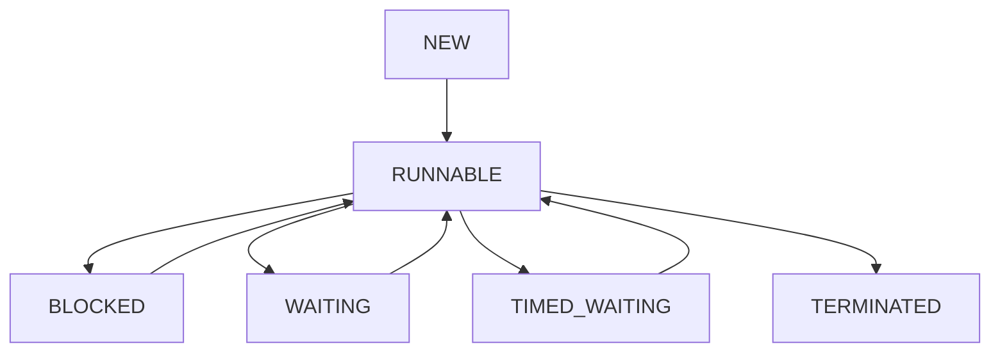

# Thread Dumps — Deep Dive

A thread dump is a snapshot of all threads running in a JVM at a specific moment in time. It shows what every thread is doing — what method it's executing, what state it's in, and what locks it holds or is waiting for.

The core mental model is:

> **A thread dump is the JVM's "what are you doing right now?" — a complete picture of all thread activity at one instant. It is the primary tool for diagnosing thread-related problems: hangs, deadlocks, high CPU, slow responses.**

---

# 1. What is a Thread Dump?

```text
JVM (running):
  Thread 1 (main)
  Thread 2 (http-nio-exec-1)
  Thread 3 (http-nio-exec-2)
  Thread 4 (GC thread)
  Thread 5 (Finalizer)
  ...

Thread dump = snapshot of ALL threads at one point in time
```

A thread dump file looks like:

```text
2024-01-15 10:30:45
Full thread dump Java HotSpot(TM) 64-Bit Server VM (21+35 mixed mode):

"http-nio-8080-exec-1" #42 daemon prio=5 os_prio=0 cpu=123ms elapsed=1234s tid=0x00007f... nid=0x1a23 waiting on condition [0x00007f...]
   java.lang.Thread.State: WAITING (parking)
        at sun.misc.Unsafe.park(Native Method)
        at java.util.concurrent.locks.LockSupport.park(LockSupport.java:175)
        at java.util.concurrent.locks.AbstractQueuedSynchronizer$ConditionObject.await(AbstractQueuedSynchronizer.java:2039)
        at java.util.concurrent.LinkedBlockingQueue.take(LinkedBlockingQueue.java:442)
        at org.apache.tomcat.util.threads.TaskQueue.take(TaskQueue.java:107)
        at java.util.concurrent.ThreadPoolExecutor.getTask(ThreadPoolExecutor.java:1074)
        at java.util.concurrent.ThreadPoolExecutor.runWorker(ThreadPoolExecutor.java:1134)
        at java.util.concurrent.ThreadPoolExecutor$Worker.run(ThreadPoolExecutor.java:624)
        at org.apache.tomcat.util.threads.TaskThread$WrappingRunnable.run(TaskThread.java:61)
        at java.lang.Thread.run(Thread.java:748)
```

---

# 2. Thread States

Understanding thread states is crucial for interpreting dumps.



| State | Meaning | In Thread Dump |
|---|---|---|
| RUNNABLE | Executing or ready to execute | `RUNNABLE` |
| BLOCKED | Waiting for monitor lock (synchronized) | `BLOCKED (on object monitor)` |
| WAITING | Waiting indefinitely (Object.wait, LockSupport.park) | `WAITING (parking)` or `WAITING (on object monitor)` |
| TIMED_WAITING | Waiting with timeout (Thread.sleep, wait(timeout)) | `TIMED_WAITING (sleeping)` |
| TERMINATED | Thread finished | Not in dump (already gone) |

---

# 3. What Each State Looks Like in a Thread Dump

### RUNNABLE — Thread Actively Working

```text
"http-nio-8080-exec-2" #43 daemon
   java.lang.Thread.State: RUNNABLE
        at com.example.ProductService.fetchProducts(ProductService.java:42)
        at com.example.ProductController.getProducts(ProductController.java:28)
        at ...
```

Note: RUNNABLE in JVM doesn't mean 100% on CPU. It means the thread is executing or ready.

### WAITING — Waiting for Work

```text
"http-nio-8080-exec-1" #42 daemon
   java.lang.Thread.State: WAITING (parking)
        at sun.misc.Unsafe.park(Native Method)
        at java.util.concurrent.locks.LockSupport.park(...)
        at java.util.concurrent.LinkedBlockingQueue.take(...)
```

This thread is idle — waiting for a task from its work queue. Normal for thread pool threads.

### BLOCKED — Waiting for a Lock

```text
"thread-2" #55
   java.lang.Thread.State: BLOCKED (on object monitor)
        at com.example.OrderService.process(OrderService.java:75)
        - waiting to lock <0x000000070f5c9b08> (a com.example.OrderService)
        at ...
```

This thread wants a monitor lock held by another thread. Indicates lock contention.

### TIMED_WAITING — Sleeping or Waiting with Timeout

```text
"Scheduled-1" #60
   java.lang.Thread.State: TIMED_WAITING (sleeping)
        at java.lang.Thread.sleep(Native Method)
        at com.example.PollService.waitForNextPoll(PollService.java:89)
```

---

# 4. Taking a Thread Dump

### Method 1: kill -3 (Unix/Linux)

```bash
kill -3 <pid>
# Output appears in the JVM's stdout/stderr
```

### Method 2: jstack (JDK Tool)

```bash
jstack <pid> > thread_dump.txt
# or with more detail:
jstack -l <pid> > thread_dump.txt
```

### Method 3: jcmd

```bash
jcmd <pid> Thread.print > thread_dump.txt
```

### Method 4: Via Java Code

```java
Map<Thread, StackTraceElement[]> traces = Thread.getAllStackTraces();
traces.forEach((thread, stack) -> {
    System.out.println(thread.getName() + ": " + thread.getState());
    for (StackTraceElement elem : stack) {
        System.out.println("  at " + elem);
    }
});
```

### Method 5: JDK Mission Control / VisualVM

GUI tools can take thread dumps with a button click.

---

# 5. Diagnosing a Deadlock

A deadlock occurs when two or more threads are each waiting for a lock held by the other.

```java
// DEADLOCK EXAMPLE:
Object lockA = new Object();
Object lockB = new Object();

Thread t1 = new Thread(() -> {
    synchronized (lockA) {          // T1 holds lockA
        synchronized (lockB) { }    // T1 waits for lockB (held by T2)
    }
});

Thread t2 = new Thread(() -> {
    synchronized (lockB) {          // T2 holds lockB
        synchronized (lockA) { }    // T2 waits for lockA (held by T1)
    }
});
```

Thread dump shows:

```text
"Thread-1":
   java.lang.Thread.State: BLOCKED (on object monitor)
   - waiting to lock <0xABC> (a java.lang.Object)
   - locked <0xDEF> (a java.lang.Object)

"Thread-2":
   java.lang.Thread.State: BLOCKED (on object monitor)
   - waiting to lock <0xDEF> (a java.lang.Object)
   - locked <0xABC> (a java.lang.Object)

Found 1 deadlock!
```

`jstack` automatically detects and reports deadlocks.

Visualization:

```text
Thread-1 holds lockA → wants lockB
                              ↑
Thread-2 holds lockB → wants lockA
                  ↑
               CYCLE = deadlock
```

---

# 6. Diagnosing Thread Starvation

Thread starvation: all threads are busy, no threads available for new requests.

```text
Thread dump shows ALL http-nio-exec threads in state:
  RUNNABLE → at com.example.SlowService.process()

All 200 Tomcat threads are stuck in SlowService.
New HTTP requests queue up → timeouts.

Root cause: SlowService.process() takes 30 seconds
→ all threads blocked in it
→ no capacity for new requests
```

---

# 7. Diagnosing High CPU with Thread Dumps

When CPU is high, combine thread dump with CPU profiling:

```bash
# 1. Find which threads are using CPU
top -H -p <pid>   # show per-thread CPU on Linux

# 2. Convert TID to hex
printf '%x\n' <tid>    # e.g., 3842 → 0xF02

# 3. Find thread in thread dump
# The dump shows "nid=0xF02" → match to the CPU-heavy thread

# 4. Check what that thread is doing
```

Example:

```text
$ top -H -p 12345
  PID   %CPU   COMMAND
  3842   95%   java         ← TID 3842 = 0xF02

Thread dump:
"Worker-42" nid=0xF02 runnable
   java.lang.Thread.State: RUNNABLE
   at com.example.PriceCalculator.compute(PriceCalculator.java:156)
   at ...
```

Thread 0xF02 = Worker-42 = consuming 95% CPU in `PriceCalculator.compute()`.

---

# 8. Analyzing Thread Dumps — Step by Step

### Step 1: Count Thread States

```bash
grep "java.lang.Thread.State" thread_dump.txt | sort | uniq -c | sort -rn
```

```text
120 WAITING
 45 TIMED_WAITING
 30 RUNNABLE
  5 BLOCKED
```

Interpretation:
- 120 WAITING → idle threads (thread pool waiting for work) → normal
- 5 BLOCKED → lock contention → investigate
- 30 RUNNABLE → active threads → check if they're all in the same method

### Step 2: Look for BLOCKED Threads

```bash
grep -A 5 "BLOCKED" thread_dump.txt
```

Find what lock they're waiting for and who holds it.

### Step 3: Check RUNNABLE Threads

If many RUNNABLE threads are in the same method → CPU bottleneck there.

### Step 4: Look for Stack Patterns

```bash
# Find common method names in the dump
grep "at com.example" thread_dump.txt | sort | uniq -c | sort -rn
```

---

# 9. Thread Dump Analysis Tools

### fastThread.io (Online)

```text
Upload thread dump → automatic analysis
Shows: deadlocks, blocking threads, stack trace grouping
URL: https://fastthread.io/
```

### jstack + grep (Manual)

```bash
jstack <pid> | grep -E "BLOCKED|WAITING|RUNNABLE" | sort | uniq -c
```

### JDK Mission Control

Open `.jfr` recording → Thread dump view.

### VisualVM

Connect to JVM → Threads tab → Take dump → Visual analysis.

---

# 10. Real-life: Diagnosing a Production Hang

```text
Problem: Spring Boot service stopped responding
         All requests timing out
         CPU: 0%  (not a CPU issue)
         Memory: stable
```

```bash
Step 1: Take thread dump
  jstack <pid> > dump.txt

Step 2: Analyze
  grep "BLOCKED" dump.txt
```

```text
"http-nio-8080-exec-1" BLOCKED:
  - waiting to lock <0x789> (a OrderService)
  - locked <0x456>

"http-nio-8080-exec-2" BLOCKED:
  - waiting to lock <0x456> (a UserService)
  - locked <0x789>

Found 1 deadlock!
```

```text
Step 3: Find the code

OrderService.createOrder():
  synchronized(orderLock) {
    UserService.getUser()  ← acquires userLock inside
  }

UserService.getUser():
  synchronized(userLock) {
    OrderService.getUserOrders()  ← acquires orderLock inside
  }

DEADLOCK! Lock acquisition order is reversed.

Step 4: Fix — always acquire locks in the same order:
  synchronized(userLock) {
    synchronized(orderLock) {
      ...
    }
  }
  (both methods acquire userLock first, then orderLock)
```

---

# 11. Multiple Thread Dumps — Best Practice

One thread dump gives a snapshot. For dynamic analysis, take **3-5 thread dumps** 5-10 seconds apart:

```bash
for i in 1 2 3; do
    jstack <pid> > dump_$i.txt
    sleep 10
done
```

Compare: threads stuck in the same place across multiple dumps → definitely blocked.

---

# Interview Preparation — Thread Dumps

---

## Q1: What is a thread dump and what information does it contain?

**Answer:**

A thread dump is a snapshot of all threads in the JVM at a specific moment. For each thread it shows:

- **Thread name and ID**: e.g., `"http-nio-8080-exec-1" #42`
- **Thread state**: RUNNABLE, WAITING, BLOCKED, TIMED_WAITING
- **Stack trace**: the full call stack showing what the thread is executing
- **Lock information**: what locks the thread holds (`locked <addr>`) and what it's waiting for (`waiting to lock <addr>`)
- **OS-level thread ID (nid)**: for correlating with OS-level CPU metrics

Used to diagnose: deadlocks, thread starvation, high CPU (combined with top -H), hung threads, lock contention.

---

## Q2: How do you take a thread dump?

**Answer:**

Multiple methods:

```bash
# jstack (most common)
jstack <pid> > thread_dump.txt

# jcmd (modern)
jcmd <pid> Thread.print > thread_dump.txt

# Kill signal (Linux — output to stdout)
kill -3 <pid>

# From Java code
Thread.getAllStackTraces()
```

Always take **multiple dumps** (3-5 times, 5-10 seconds apart) to identify threads stuck in the same state repeatedly.

---

## Q3: How do you diagnose a deadlock from a thread dump?

**Answer:**

Look for threads in BLOCKED state where:
- Thread A holds lock X, waiting for lock Y
- Thread B holds lock Y, waiting for lock X

`jstack` automatically detects and reports deadlocks:
```text
Found 1 deadlock.
  Thread A: locked <X>, waiting for <Y>
  Thread B: locked <Y>, waiting for <X>
```

Root cause: locks acquired in different orders.
Fix: always acquire locks in a consistent, agreed-upon order across all threads.

---

## Q4: How do you correlate a thread dump with high CPU usage?

**Answer:**

```bash
# Step 1: Find CPU-heavy threads
top -H -p <pid>       # Linux: shows per-thread CPU
jstack <pid> | grep "nid="   # get thread hex IDs from dump

# Step 2: Convert top TID (decimal) to hex
printf '%x\n' <tid>

# Step 3: Find the thread in jstack output
# Thread dump format: "Thread-Name" nid=0x<hex_tid>

# Step 4: Look at that thread's stack trace
```

The stack trace shows exactly what code is consuming CPU.

---

## Q5: What does it mean when all thread pool threads are in WAITING state?

**Answer:**

WAITING thread pool threads (like Tomcat's `http-nio-exec` threads) are waiting at `LinkedBlockingQueue.take()` — they're idle, waiting for a new request to process.

This is **normal and healthy** when there's no traffic or light traffic.

It means:
- Thread pool is correctly configured
- Threads are ready to handle requests
- No requests are currently being served

It becomes a concern only if you have NO RUNNABLE threads but requests are piling up — meaning threads that should be handling requests are stuck somewhere.

---

## Q6: What is thread starvation and how do you identify it in a thread dump?

**Answer:**

Thread starvation occurs when all available threads are busy (or stuck) and no threads are available to process new work.

Identification in thread dump:
- All thread pool threads show RUNNABLE or BLOCKED in the same method
- No threads available at `LinkedBlockingQueue.take()` (no idle threads)
- CPU may be 0% (if threads are BLOCKED waiting for I/O or locks, not actually computing)

Example:
```text
All 200 http-nio-exec threads show:
  RUNNABLE at com.example.ExternalApiService.callSlowApi()

All threads making external API calls that take 10+ seconds.
New requests cannot be served — no threads available.
```

Fix: use async/non-blocking I/O, add timeouts to external calls, increase thread pool size (short-term), use reactive programming (WebFlux) for I/O-heavy workloads.

---

## Q7: What is the difference between BLOCKED and WAITING thread states?

**Answer:**

| | BLOCKED | WAITING |
|---|---|---|
| Cause | Waiting for a `synchronized` monitor lock | Waiting for `Object.wait()`, `LockSupport.park()`, `join()` |
| Lock type | Intrinsic lock (`synchronized`) | Explicit signal or condition |
| Wake-up | When lock is released | When `notify()`, `unpark()`, or `join()` completes |
| Impact | Active contention — threads competing for same lock | Passive wait — waiting for external signal |

BLOCKED is more concerning because it directly indicates lock contention. Multiple BLOCKED threads on the same lock → investigate that lock's critical section.

WAITING is often normal (idle thread pool threads). Check the stack to see WHAT they're waiting for.
