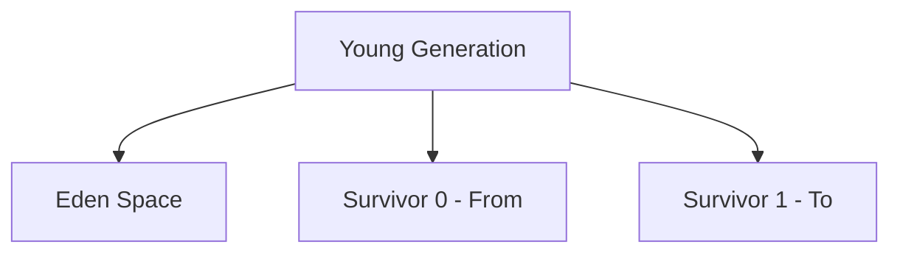

# Young Generation — Deep Dive

The Young Generation is where **all new objects are born**. It is the most active part of the heap — objects are allocated here constantly and collected frequently.

The core mental model is:

> **Most objects die young. The Young Generation is designed to efficiently identify and reclaim those short-lived objects with minimal overhead.**

---

# 1. Young Generation in Context

```text
JVM Heap
│
├── Young Generation  ← where all new objects start
│   ├── Eden Space    ← where objects are born
│   ├── Survivor 0    ← survivors of first GC
│   └── Survivor 1    ← alternate survivor space
│
└── Old Generation    ← where long-lived objects live
```

---

# 2. Structure of the Young Generation



### Eden Space

```text
The largest region of Young Generation.
All new objects are allocated here (via TLAB).
Typical ratio: Eden : Survivor = 8:1
Controlled by: -XX:SurvivorRatio=8
```

### Survivor 0 and Survivor 1

```text
Two equal-sized survivor regions.
One is active (From), one is empty (To).
Objects that survive Eden GC are copied into survivor space.
```

Default size distribution:

```text
Young Generation = 100%
  Eden    = 80%  (SurvivorRatio=8 means Eden = 8 parts)
  S0      = 10%  (1 part)
  S1      = 10%  (1 part)
```

---

# 3. Object Allocation — TLAB

When you write:

```java
Order order = new Order();
```

The JVM doesn't immediately go to a shared allocator (which would require synchronization between threads).

Instead, each thread has a **Thread Local Allocation Buffer (TLAB)**:

```text
Thread 1 → TLAB 1 (private slice of Eden)
Thread 2 → TLAB 2 (private slice of Eden)
Thread 3 → TLAB 3 (private slice of Eden)
```

Allocation in TLAB:

```text
TLAB is a small region of Eden reserved for one thread.

Thread 1 allocates → bumps pointer in its own TLAB
Thread 2 allocates → bumps pointer in its own TLAB
No synchronization needed!
```

This is called **bump-the-pointer allocation** — extremely fast.

```text
TLAB (Thread 1's slice of Eden):
|<-- allocated -->|<-- free -->|
                  ↑
              next-free pointer
After new allocation:
|<-- allocated ---->|<-- free -->|
                    ↑
                new pointer position
```

When TLAB fills up:
1. Thread requests a new TLAB from Eden
2. If Eden is full → Minor GC triggered

---

# 4. The Minor GC (Young GC) Process

When Eden fills up, a **Minor GC** is triggered.

### Step-by-step walkthrough:

**Before Minor GC:**

```text
Eden:
+-------+------+-------+------+-------+-------+
| Order | User | Event | DTO  | Order | Cache |
+-------+------+-------+------+-------+-------+
  dead    live   dead    dead   live    live

Survivor 0 (From):
+-------+
| Obj-A |  (survived 1 GC, age=1)
+-------+

Survivor 1 (To):
(empty)
```

**GC identifies live objects:**

Using GC roots + remembered sets (pointers from Old Gen to Young Gen):

```text
Live in Eden: User, Order, Cache
Dead in Eden: Order(first), Event, DTO

Live in Survivor 0: Obj-A (age=1)
```

**Copy live objects:**

```text
→ User, Order, Cache copied to Survivor 1 (To) with age=1
→ Obj-A copied to Survivor 1 with age=2

(If age >= threshold → promote to Old Generation instead)
```

**After Minor GC:**

```text
Eden:
+-----------------------------------+
|             (empty — fully free)  |
+-----------------------------------+

Survivor 0 (From):
(empty — was From, now recycled)

Survivor 1 (To) — now becomes the new From:
+------+-------+------+--------+
| User | Order | Cache| Obj-A  |
| age=1| age=1 | age=1| age=2  |
+------+-------+------+--------+
```

Roles swap: S1 becomes "From", S0 becomes the new "To" (empty).

---

# 5. Object Aging

Every time an object survives a Minor GC, its **age** increments:

```text
Age 0: object just created in Eden
Age 1: survived 1 Minor GC → in Survivor
Age 2: survived 2 Minor GCs
...
Age 15: survived 15 Minor GCs → promoted to Old Generation
```

The threshold is controlled by:

```bash
-XX:MaxTenuringThreshold=15  # default
```

But the JVM can also dynamically adjust the threshold based on available space:

```text
If Survivor space is full → lower tenuring threshold
→ Promote objects earlier to Old Generation
```

Age is stored in the object header (4 bits in mark word → max age = 15).

---

# 6. Promotion to Old Generation

An object is promoted to Old Generation when:

```text
1. Its age >= MaxTenuringThreshold (default 15)
   OR
2. Survivor space is full (objects promoted early)
   OR
3. Object is large (exceeds TLAB, goes directly to Old/Humongous)
```

Visualization:

```text
           Eden
            |
       [Minor GC]
            |
        age = 1
            ↓
        Survivor
            |
       [Minor GC]
            |
        age = 2
            |
           ...
            |
       [Minor GC]
            |
        age = 15
            ↓
      Old Generation
      (stays here until Major/Full GC)
```

---

# 7. Remembered Sets (Card Tables)

A subtle but important concept: **what if an Old Generation object references a Young Generation object?**

```text
Old Gen:
  ServiceCache.orders → Order (in Eden)
```

When Minor GC runs:
- Starts from GC roots
- GC roots include thread stacks and static fields
- But also: Old Gen → Young Gen references!

Without tracking these:

```text
GC might think Order is unreachable → collect it → crash!
```

Solution: **Card Table / Remembered Set**

```text
Old Generation is divided into "cards" (512 bytes each)
If an Old Gen object's card contains a reference to Young Gen:
  → that card is marked "dirty"

During Minor GC:
  → scan dirty cards
  → treat Old Gen → Young Gen references as GC roots
```

Visualization:

```text
Old Generation
+------+------+------+------+
|Card 0|Card 1|Card 2|Card 3|
|dirty |clean |dirty |clean |
+------+------+------+------+
         |             |
         |             v
         v        Eden: Order (still live!)
  Eden: (object — GC root from Old Gen)
```

---

# 8. Minor GC Characteristics

```text
Frequency: Every few seconds to minutes (depends on allocation rate)
Duration: Typically 5-50ms
Stop-the-world: Yes
GC threads: Multiple (parallel minor GC)
Impact: Brief pause, rarely noticed by users
```

Minor GC is designed to be:

```text
Fast: only scans Young Gen (small)
Efficient: copying collector (no fragmentation)
Concurrent-friendly: pauses are predictable and brief
```

---

# 9. What About G1GC's Young Generation?

G1GC doesn't have a contiguous Eden/Survivor layout. Instead:

```text
G1 Heap = many small regions (e.g., 2048 regions of 1MB-32MB each)

Some regions are designated as Eden
Some regions are designated as Survivor
Some regions are designated as Old
```

Young GC in G1:

```text
When Eden regions fill up
→ GC selects Young Gen regions (Eden + Survivor)
→ Copies live objects to new Survivor/Old regions
→ Eden regions become free
→ All done in parallel STW pause
```

The advantage:

```text
G1 can resize Eden dynamically
→ More Eden regions if allocation is high
→ Fewer Eden regions if allocation is low
→ Targets -XX:MaxGCPauseMillis
```

---

# 10. Tuning Young Generation

```bash
# Set Young Generation size explicitly
-Xmn512m          # 512MB Young Gen

# Or as a ratio of total heap
-XX:NewRatio=2    # Old:Young = 2:1
                  # With -Xmx6g → Young = 2GB, Old = 4GB

# Eden:Survivor ratio (within Young)
-XX:SurvivorRatio=8   # Eden:Survivor = 8:1
                       # With 512MB Young → Eden=410MB, S0=S1=51MB

# Maximum tenuring threshold
-XX:MaxTenuringThreshold=15

# Initial tenuring threshold
-XX:InitialTenuringThreshold=7
```

---

# 11. Symptoms of Young Generation Sizing Problems

### Young Gen Too Small

```text
Symptoms:
  - Minor GC running every second (very frequent)
  - High allocation rate overwhelming Eden
  - Many objects promoted early (premature promotion)
  - Old Gen filling faster than expected

Fix:
  - Increase -Xmn or decrease -XX:NewRatio
```

### Young Gen Too Large

```text
Symptoms:
  - Minor GC pauses are longer (more objects to scan/copy)
  - Less space for Old Gen
  - More frequent Full GC due to small Old Gen

Fix:
  - Decrease -Xmn or increase -XX:NewRatio
```

### Survivor Space Too Small

```text
Symptoms:
  - Objects promoted to Old Gen prematurely (age < threshold)
  - In GC logs: "To-space overflow" or "Desired survivor size"
  - Old Gen fills faster

Fix:
  - Reduce -XX:SurvivorRatio (gives more space to survivors)
  - Or increase total Young Gen size
```

---

# 12. Real-life: REST API Request Lifecycle

```java
@GetMapping("/products")
public List<ProductResponse> getProducts() {
    List<Product> products = productRepository.findAll();
    return products.stream()
        .map(mapper::toResponse)
        .collect(Collectors.toList());
}
```

Per request allocations in Eden:

```text
SQL ResultSet objects
Hibernate Proxy objects
Product entity objects
ProductResponse DTO objects
Stream objects
Collector intermediate state
JSON serialization buffers
HTTP response objects
```

These all die after the request is complete:

```text
Request arrives → objects created in Eden
Request completes → objects become unreachable
Next Minor GC → Eden reclaimed
```

This is the ideal Young Generation use case.

---

# 13. Allocation Failure

When Eden is full and a Minor GC cannot free enough space:

```text
Eden full
  ↓
Minor GC triggered
  ↓
Survivors copied
  ↓
Still not enough space?
  ↓
Promotion to Old Gen (if old gen has space)
  ↓
Still not enough?
  ↓
Full GC
  ↓
Still not enough?
  ↓
OutOfMemoryError
```

This chain is important to understand when diagnosing OOM errors.

---

# Interview Preparation — Young Generation

---

## Q1: What is the Young Generation and why does it exist?

**Answer:**

The Young Generation is the portion of the heap where all new objects are initially allocated. It exists because of the **generational hypothesis** — most objects die young (immediately or within milliseconds of creation).

By separating short-lived objects into their own memory area:
- GC can collect only the Young Generation (Minor GC) — which is small and fast
- Most dead objects are reclaimed cheaply without touching long-lived objects in Old Gen
- Copying collection is efficient in Young Gen because few live objects need copying

Without generational GC, every collection would scan the entire heap — much slower.

---

## Q2: Explain the structure of the Young Generation.

**Answer:**

Young Generation consists of three regions:

1. **Eden** (largest, ~80%): where all new objects are allocated. Each thread has a private TLAB (Thread Local Allocation Buffer) in Eden for fast, lock-free allocation.

2. **Survivor 0** (~10%): holds objects that survived at least one Minor GC.

3. **Survivor 1** (~10%): alternate survivor space; always one is "From" (active) and one is "To" (empty, ready to receive).

Sizes controlled by:
```bash
-XX:SurvivorRatio=8  # Eden:Survivor = 8:1
```

---

## Q3: What happens during a Minor GC?

**Answer:**

1. GC roots and Old Gen → Young Gen references (via card table) are scanned
2. All reachable objects in Eden and the active Survivor space are identified as live
3. Live objects are **copied** to the empty Survivor space (or Old Gen if age threshold met)
4. Dead objects in Eden are implicitly reclaimed — Eden is reset to empty
5. Survivor roles flip: the newly filled space becomes "From", the old "From" becomes "To" (empty)
6. Age counter increments for all surviving objects

Minor GC is Stop-The-World but typically very fast (milliseconds) because only Young Gen is scanned.

---

## Q4: What is object aging and how does promotion work?

**Answer:**

Each surviving object carries an age counter (stored in the object header, 4 bits, max 15).

- Object born in Eden: age = 0
- Survives Minor GC → copied to Survivor with age = 1
- Survives another Minor GC → age = 2
- ...
- Age reaches `MaxTenuringThreshold` (default 15) → promoted to Old Generation

Early promotion also happens when Survivor space is full — the JVM lowers the effective tenuring threshold and promotes objects prematurely.

```bash
-XX:MaxTenuringThreshold=15  # tune this
```

---

## Q5: What is a TLAB and why is it important?

**Answer:**

TLAB (Thread Local Allocation Buffer) is a private slice of Eden allocated to each thread.

Purpose: eliminate synchronization overhead during object allocation.

Without TLAB:
- All threads compete for a shared pointer in Eden
- Requires atomic CAS operation for every `new` — expensive under contention

With TLAB:
- Each thread has its own private buffer
- Allocation = just a pointer bump — no synchronization
- Extremely fast (nearly free)

When a thread's TLAB fills up, it gets a new one from Eden. If Eden is full → Minor GC.

---

## Q6: What is the card table and why is it needed for Minor GC?

**Answer:**

The card table tracks Old Generation → Young Generation references.

Why needed: During Minor GC, GC starts from GC roots. But an Old Gen object might reference a Young Gen object — the GC must treat that as a root, otherwise a live Young Gen object would be incorrectly collected.

How it works:
- Old Gen divided into "cards" (~512 bytes each)
- When a store instruction writes an Old Gen object's reference to point to a Young Gen object → that card is marked "dirty"
- During Minor GC: dirty cards are scanned and their references added to GC root set

Without the card table, Minor GC would have to scan the entire Old Generation to find Young Gen references — defeating the purpose of generational collection.

---

## Q7: What causes "premature promotion" and why is it bad?

**Answer:**

Premature promotion happens when objects are moved to Old Generation before their age threshold because Survivor space is full.

Causes:
- Survivor space too small for the number of surviving objects
- Too many "medium-lived" objects that survive one GC but shouldn't reach Old Gen
- Sudden traffic spike causing higher-than-normal survival rate

Why it's bad:
- Old Generation fills up faster → more frequent Major/Full GC
- Full GC pauses are much longer
- Objects that would have died soon are now in Old Gen, taking space
- Increased GC overhead overall

Diagnosis: look for "To-space overflow" in GC logs or high promotion rate in GC metrics.

Fix: increase Survivor space size (`-XX:SurvivorRatio=4` gives larger survivors) or increase total Young Gen.

---

## Q8: How does G1GC handle the Young Generation differently?

**Answer:**

Traditional GC (Parallel, CMS) uses fixed contiguous Eden/Survivor regions.

G1GC uses a **region-based** heap:
- Eden = a dynamic set of regions
- Survivor = a dynamic set of regions
- G1 can grow/shrink the number of Eden regions based on target pause time

G1 Young GC:
- Triggered when Eden regions fill up
- Collects ALL Young regions (Eden + Survivor) in parallel STW
- Live objects evacuated to new Survivor regions or promoted to Old regions
- Old Eden regions reclaimed and returned to free region pool

Advantage: G1 can adjust Young Gen size dynamically to meet `-XX:MaxGCPauseMillis` targets, unlike fixed-size generational GC.
