# 1. Classes in Java — Deep Dive

We’ll treat this as **mastery**, not just a definition.

The goal is that after this section you should be able to:

* Design classes properly
* Understand what happens when `new` is used
* Understand objects, references, and memory
* Write constructors correctly
* Understand `this`
* Distinguish instance vs static members
* Use access modifiers correctly
* Understand method/constructor overloading
* Understand `equals()`, `hashCode()`, and `toString()`
* Recognize bad class design
* Answer common Java interview questions
* Build classes that we'll later use for inheritance, composition, interfaces, generics, Spring Boot, etc.

---

# 1. What is a Class?

The simplest definition:

> A **class is a blueprint/template used to create objects**.

For example:

```java
class Car {

    String model;
    int speed;

    void accelerate() {
        speed += 10;
    }
}
```

This defines a type called `Car`.

But notice something important:

**We haven't created a car yet.**

We've only defined what a `Car` **has** and what a `Car` **can do**.

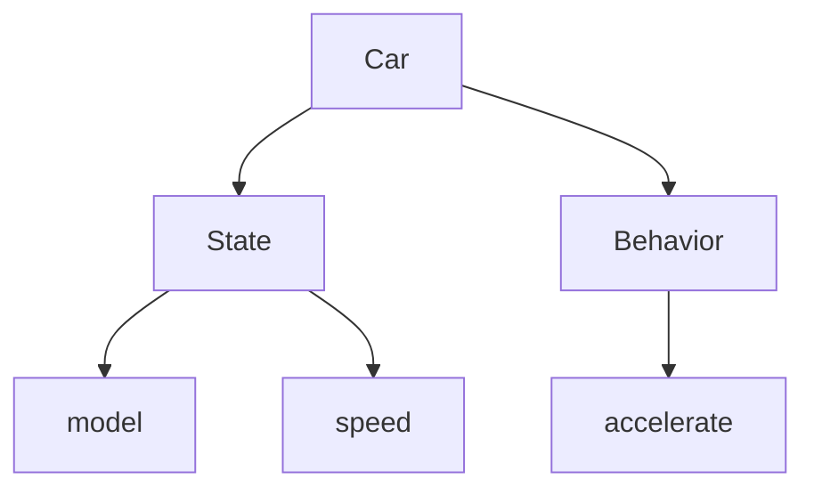

Now:

```java
Car car1 = new Car();
Car car2 = new Car();
```

We created **two different objects** from the same class.

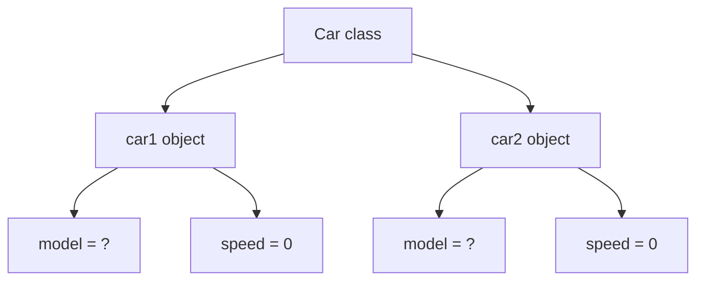

> Each object is an independent instance that follows the same blueprint.

The class describes the structure.

The objects contain the actual state.

---

# 2. Class vs Object

This distinction is extremely important.

### Class

```java
class Employee {
    String name;
    int salary;
}
```

This is a **type definition**.

### Object

```java
Employee employee = new Employee();
```

This creates an **instance** of the class.

So:

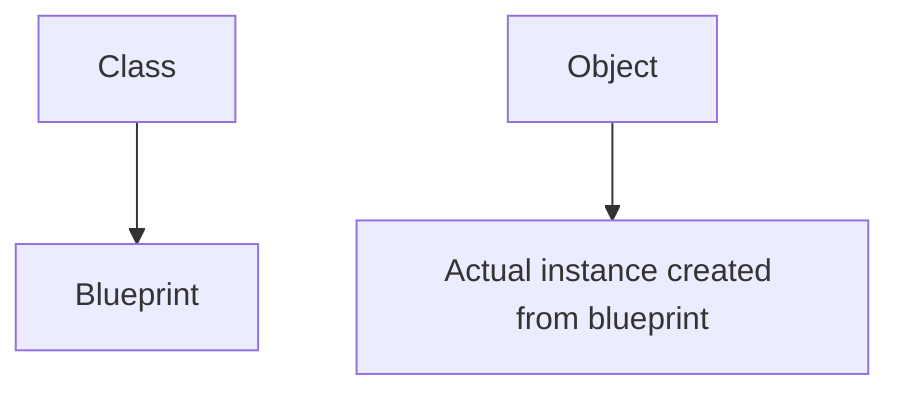

You can create many objects from one class:

```java
Employee e1 = new Employee();
Employee e2 = new Employee();
Employee e3 = new Employee();
```

They all have the same structure but can have different state.

```java
e1.name = "Alice";
e1.salary = 50000;

e2.name = "Bob";
e2.salary = 70000;
```

Conceptually:

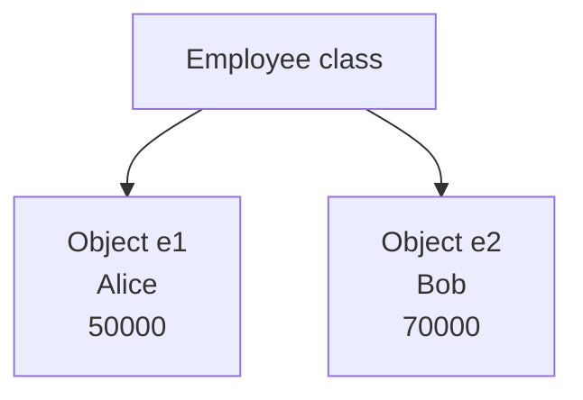

> Same class, different state: the structure is shared, the values are per-object.

---

# 3. What Does a Class Contain?

A Java class can contain many things:

```java
class Employee {

    // Field
    private String name;

    // Field
    private int salary;

    // Constructor
    Employee(String name, int salary) {
        this.name = name;
        this.salary = salary;
    }

    // Method
    void work() {
        System.out.println(name + " is working");
    }

    // Method
    int getSalary() {
        return salary;
    }
}
```

A class can contain:

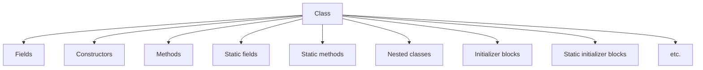

We'll study these progressively.

---

# 4. Fields

A field represents **state/data belonging to an object or class**.

```java
class Employee {

    String name;
    int age;
    double salary;
}
```

Here:

```text
name
age
salary
```

are fields.

If they're instance fields, every object gets its own copy.

```java
Employee e1 = new Employee();
Employee e2 = new Employee();

e1.name = "Alice";
e2.name = "Bob";
```

Conceptually:

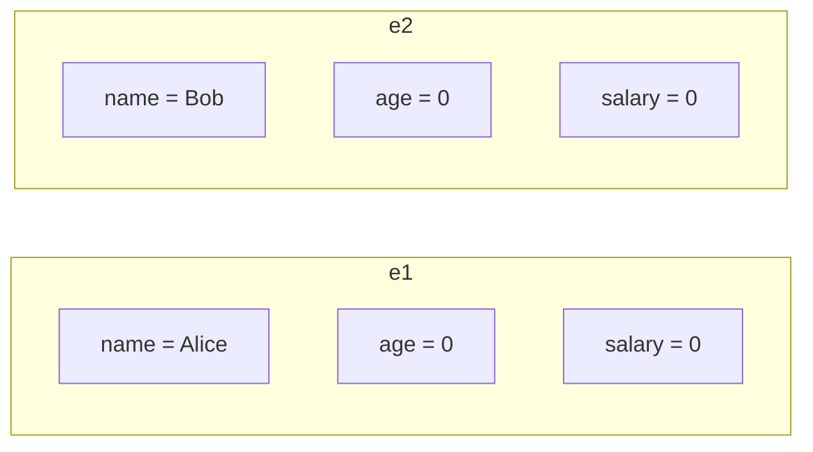

> Each object owns its own copy of the instance fields.

Changing `e1.name` does not change `e2.name`.

---

# 5. Methods

Methods represent **behavior**.

```java
class BankAccount {

    double balance;

    void deposit(double amount) {
        balance += amount;
    }

    void withdraw(double amount) {
        balance -= amount;
    }
}
```

Here:

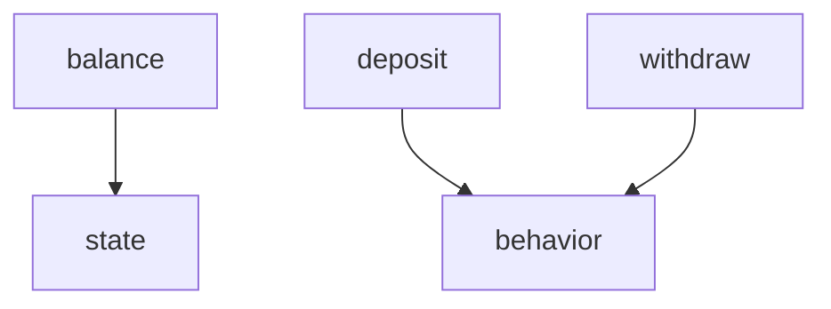

This is one of the fundamental ideas behind OOP:

> **Objects combine state and behavior.**

Instead of keeping data and functions completely separate:

```text
balance
deposit()
withdraw()
```

we package them together:

```java
class BankAccount {
    double balance;

    void deposit(double amount) {
        balance += amount;
    }

    void withdraw(double amount) {
        balance -= amount;
    }
}
```

This becomes especially important when we study **encapsulation**.

---

# 6. Creating an Object with `new`

Consider:

```java
Employee employee = new Employee();
```

There are two important parts:

```java
Employee employee
```

and

```java
new Employee()
```

### `Employee employee`

This declares a variable capable of referring to an `Employee`.

### `new Employee()`

This creates an actual `Employee` object.

So conceptually:

```text
Employee employee
       │
       │ reference
       ↓
    Employee object
```

The variable `employee` is not the object itself.

It is a **reference to the object**.

---

# 7. References

This is extremely important in Java.

```java
Employee e1 = new Employee();
Employee e2 = e1;
```

What happened?

We did **not** create two objects.

We created one object and two references.

```text
             ┌──────────────────┐
e1 ─────────►│                  │
             │ Employee object  │
e2 ─────────►│                  │
             └──────────────────┘
```

Therefore:

```java
e1.name = "Alice";

System.out.println(e2.name);
```

prints:

```text
Alice
```

because both references point to the same object.

This concept becomes crucial later when discussing:

* mutable objects
* immutability
* collections
* shallow vs deep copies
* concurrency
* composition
* Spring beans

---

# 8. `null`

A reference can point to nothing:

```java
Employee employee = null;
```

Conceptually:

```text
employee ─────► null
```

If you do:

```java
employee.work();
```

you'll get:

```text
NullPointerException
```

because there is no object to invoke the method on.

---

# 9. Constructors

A constructor is used when creating an object.

```java
class Employee {

    String name;
    int salary;

    Employee(String name, int salary) {
        this.name = name;
        this.salary = salary;
    }
}
```

Then:

```java
Employee employee = new Employee("Alice", 50000);
```

The constructor initializes the object.

Conceptually:

```mermaid
graph TD
    NE[new Employee(...)] --> OC[Object created]
    OC --> CE[Constructor executed]
    CE --> OI[Object initialized]
```

---

# 10. Constructor Rules

A constructor:

### Has the same name as the class

```java
class Employee {

    Employee() {
    }
}
```

### Has no return type

This is correct:

```java
Employee() {
}
```

This is a method, NOT a constructor:

```java
void Employee() {
}
```

### Runs when an object is created

```java
new Employee();
```

causes the constructor to execute.

---

# 11. Default Constructor

Suppose you write:

```java
class Employee {

}
```

Java provides a default no-argument constructor conceptually equivalent to:

```java
Employee() {
}
```

Therefore:

```java
Employee e = new Employee();
```

works.

But here's an important interview point.

If **you define any constructor yourself**:

```java
class Employee {

    Employee(String name) {
        ...
    }
}
```

Java no longer automatically provides the no-argument constructor.

Therefore:

```java
new Employee();
```

will fail.

If you want both:

```java
class Employee {

    Employee() {
    }

    Employee(String name) {
        this.name = name;
    }
}
```

---

# 12. Constructor Overloading

You can have multiple constructors with different parameter lists.

```java
class Employee {

    String name;
    int salary;

    Employee() {
    }

    Employee(String name) {
        this.name = name;
    }

    Employee(String name, int salary) {
        this.name = name;
        this.salary = salary;
    }
}
```

Now:

```java
new Employee();
new Employee("Alice");
new Employee("Alice", 50000);
```

This is **constructor overloading**.

We'll later connect this to method overloading and compile-time polymorphism.

---

# 13. The `this` Keyword

One of the most important keywords in Java.

Consider:

```java
class Employee {

    String name;

    Employee(String name) {
        this.name = name;
    }
}
```

There are two `name`s:

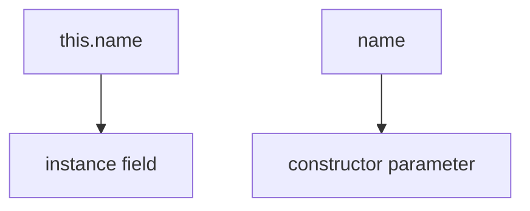

So:

```java
this.name = name;
```

means:

> Assign the constructor parameter `name` to the current object's `name` field.

---

# 14. What Does `this` Mean?

`this` refers to the **current object**.

Example:

```java
class Employee {

    String name;

    void printName() {
        System.out.println(this.name);
    }
}
```

If:

```java
Employee e1 = new Employee();
e1.name = "Alice";

e1.printName();
```

then inside `printName()`:

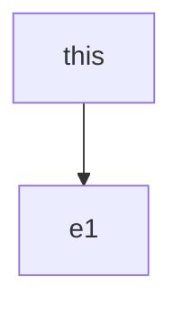

If:

```java
Employee e2 = new Employee();
e2.name = "Bob";

e2.printName();
```

then:


So `this` depends on which object invoked the method.

---

# 15. `this()` — Calling Another Constructor

`this` also has another use.

You can call another constructor using:

```java
this(...)
```

Example:

```java
class Employee {

    String name;
    int salary;

    Employee() {
        this("Unknown", 0);
    }

    Employee(String name, int salary) {
        this.name = name;
        this.salary = salary;
    }
}
```

Now:

```java
new Employee();
```

internally delegates to:

```java
Employee("Unknown", 0)
```

This avoids duplicate initialization logic.

Important rule:

> `this(...)` must be the **first statement** in a constructor.

---

# 16. Static vs Instance Members

This is one of the most important Java distinctions.

Consider:

```java
class Employee {

    String name;

    static String company = "Mercedes";

}
```

`name` is an **instance field**.

`company` is a **static field**.

Conceptually:

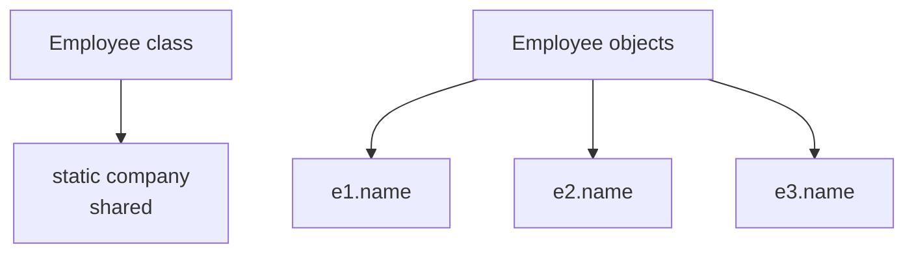

> `static` fields live with the class; instance fields live with each object.

So:

```java
Employee e1 = new Employee();
Employee e2 = new Employee();

e1.name = "Alice";
e2.name = "Bob";

Employee.company = "Mercedes-Benz";
```

There is one `company` associated with the class, rather than a separate copy per object.

---

# 17. Static Methods

You can also have static methods:

```java
class MathUtil {

    static int add(int a, int b) {
        return a + b;
    }
}
```

Call:

```java
int result = MathUtil.add(10, 20);
```

You don't need:

```java
new MathUtil()
```

because the method belongs to the class rather than an instance.

---

# 18. Why Can't Static Methods Directly Access Instance Fields?

Consider:

```java
class Employee {

    String name;

    static void printName() {
        System.out.println(name);
    }
}
```

This doesn't compile.

Why?

Because which object's `name`?

Suppose:

```text
e1.name = Alice
e2.name = Bob
e3.name = Charlie
```

Then:

```java
Employee.printName();
```

Which name should it print?

There is no `this` object.

That's why static methods cannot directly access instance members.

You need an object:

```java
static void printName(Employee employee) {
    System.out.println(employee.name);
}
```

---

# 19. Access Modifiers

Java provides four access levels:

```text
public
protected
default
private
```

### `public`

Accessible from anywhere.

```java
public class Employee {
}
```

### `private`

Accessible only inside the same class.

```java
class Employee {

    private String salary;
}
```

### default/package-private

If you don't specify a modifier:

```java
class Employee {
    String name;
}
```

the member is accessible within the same package.

### `protected`

Accessible:

* within the same package
* through inheritance from other packages

We'll revisit `protected` deeply when we study inheritance.

---

# 20. Why `private` Matters

Consider:

```java
class BankAccount {

    public double balance;
}
```

Anyone can do:

```java
account.balance = -1000000;
```

That's dangerous.

Instead:

```java
class BankAccount {

    private double balance;

    void deposit(double amount) {

        if (amount <= 0) {
            throw new IllegalArgumentException();
        }

        balance += amount;
    }
}
```

Now the object controls how its state changes.

This leads directly into our next major topic:

> **Encapsulation**

We'll study that separately and deeply.

---

# 21. Method Overloading

A class can have multiple methods with the same name as long as their parameter lists differ.

```java
class Calculator {

    int add(int a, int b) {
        return a + b;
    }

    double add(double a, double b) {
        return a + b;
    }

    int add(int a, int b, int c) {
        return a + b + c;
    }
}
```

This is:

> **Method overloading**

The compiler determines which method to call based on the arguments.

```java
add(10, 20);
```

→ `int, int`

```java
add(10.5, 20.5);
```

→ `double, double`

```java
add(10, 20, 30);
```

→ three integers

We'll later call this **compile-time polymorphism**.

---

# 22. What Cannot Be Used for Overloading?

Return type alone is not enough.

This is invalid:

```java
int calculate() {
    return 10;
}

double calculate() {
    return 10.0;
}
```

The compiler cannot distinguish them based only on return type.

Why?

Because:

```java
calculate();
```

doesn't tell Java which return type you intended.

---

# 23. `final` Fields

You can make a field assignable only once:

```java
class Employee {

    final int employeeId;

    Employee(int employeeId) {
        this.employeeId = employeeId;
    }
}
```

Once initialized:

```java
employee.employeeId = 20;
```

is illegal.

But be careful:

> `final` does **not automatically make an object immutable**.

For example:

```java
final List<String> skills = new ArrayList<>();
```

You cannot do:

```java
skills = anotherList;
```

but you can still do:

```java
skills.add("Java");
```

We'll explore this deeply under **Immutability**.

---

# 24. Object Identity

Consider:

```java
Employee e1 = new Employee();
Employee e2 = new Employee();
```

Even if they contain identical data:

```text
e1 ≠ e2
```

because they are different objects.

```java
System.out.println(e1 == e2);
```

returns:

```text
false
```

`==` compares references for objects.

---

# 25. `equals()`

Java provides `equals()` for logical equality.

For example, suppose:

```java
Employee e1 = new Employee("Alice", 100);
Employee e2 = new Employee("Alice", 100);
```

You may want:

```text
e1.equals(e2)
```

to mean:

> Do these employees represent the same logical employee?

That's different from:

```java
e1 == e2
```

which asks:

> Are these references pointing to the exact same object?

We'll study `equals()` and `hashCode()` in much greater depth because they become critical when using:

```text
HashMap
HashSet
ConcurrentHashMap
database entities
caching
collections
```

---

# 26. `toString()`

Every Java object ultimately inherits from `Object`.

One method is:

```java
toString()
```

If you don't override it:

```java
System.out.println(employee);
```

you'll typically get something resembling:

```text
Employee@5e2de80c
```

Instead:

```java
@Override
public String toString() {
    return "Employee{name='" + name + "', salary=" + salary + "}";
}
```

Now:

```text
Employee{name='Alice', salary=50000}
```

This is extremely useful for:

* debugging
* logging
* testing

---

# 27. A Proper Domain Class

Let's combine what we've learned.

```java
public class BankAccount {

    private final String accountNumber;
    private String owner;
    private double balance;

    public BankAccount(String accountNumber, String owner) {
        this.accountNumber = accountNumber;
        this.owner = owner;
        this.balance = 0;
    }

    public void deposit(double amount) {

        if (amount <= 0) {
            throw new IllegalArgumentException(
                "Deposit amount must be positive"
            );
        }

        balance += amount;
    }

    public void withdraw(double amount) {

        if (amount <= 0) {
            throw new IllegalArgumentException(
                "Withdrawal amount must be positive"
            );
        }

        if (amount > balance) {
            throw new IllegalArgumentException(
                "Insufficient balance"
            );
        }

        balance -= amount;
    }

    public double getBalance() {
        return balance;
    }

    @Override
    public String toString() {
        return "BankAccount{" +
                "accountNumber='" + accountNumber + '\'' +
                ", owner='" + owner + '\'' +
                ", balance=" + balance +
                '}';
    }
}
```

Notice how much is already happening:

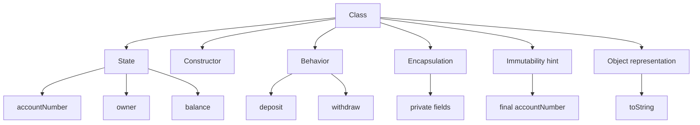

We're deliberately building concepts that will later connect together.

---

# 28. A Backend Example

Imagine our future project has:

```java
class ChargingStation {

    private String stationId;
    private String location;
    private int availableConnectors;

    void startCharging() {
        // ...
    }

    void stopCharging() {
        // ...
    }
}
```

Then:

```java
ChargingStation station =
        new ChargingStation();
```

You could have:

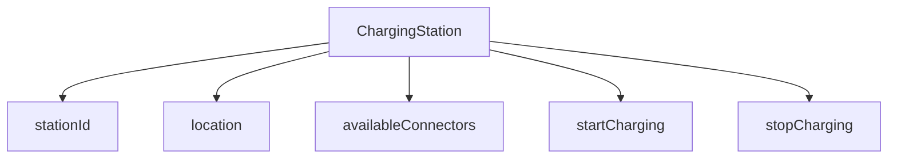

Later we'll evolve this into:

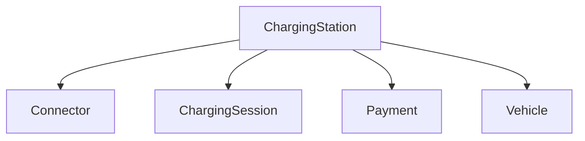

> Composition lets a class own references to other objects rather than duplicating their data.

And this is where **composition** becomes important.

---

# 29. Class Design Principle

A good class should generally have:

> **High cohesion**

Meaning its fields and methods belong together conceptually.

Bad:

```java
class Everything {

    String userName;
    double payment;
    String vehicleModel;

    void sendEmail() {}
    void calculateTax() {}
    void startCharging() {}
    void generateInvoice() {}
}
```

This class has unrelated responsibilities.

Better:

```text
User
Payment
Vehicle
ChargingSession
Invoice
EmailService
```

Each class has a more focused responsibility.

This will eventually connect to:

* SOLID
* Single Responsibility Principle
* composition
* dependency injection
* microservice design

---

# 30. Class vs Struct

You may wonder why Java doesn't have C-style structs.

Java classes combine:

```text
data
+
behavior
+
access control
+
inheritance
+
polymorphism
```

This is one reason classes are central to Java's OOP model.

---

# 31. Important Interview Questions

You should be able to answer these without memorizing.

### Q1. What is a class?

A class is a user-defined reference type that defines the structure and behavior of its instances.

### Q2. What is an object?

An object is an instance of a class created at runtime.

### Q3. Is a reference the same thing as an object?

No.

```java
Employee e = new Employee();
```

`e` is a reference; `new Employee()` creates the object.

### Q4. What does `this` mean?

It refers to the current object.

### Q5. Can a static method access instance variables directly?

No, because a static method doesn't have an implicit current object (`this`).

### Q6. Can constructors be inherited?

No.

### Q7. Can constructors be overridden?

No.

### Q8. Can constructors be overloaded?

Yes.

### Q9. Can methods be overloaded?

Yes.

### Q10. Can methods be overloaded only by changing return type?

No.

### Q11. What happens if you don't define a constructor?

Java provides a default no-argument constructor, provided you haven't declared another constructor.

### Q12. What happens when you define a constructor yourself?

The compiler no longer supplies the implicit default constructor.

---