# 4. Polymorphism in Java — Deep Dive

Polymorphism is one of the **most important concepts in Java OOP**, especially for backend development and Spring Boot.

If you truly understand polymorphism, a lot of things that otherwise look like "Spring magic" start making sense:

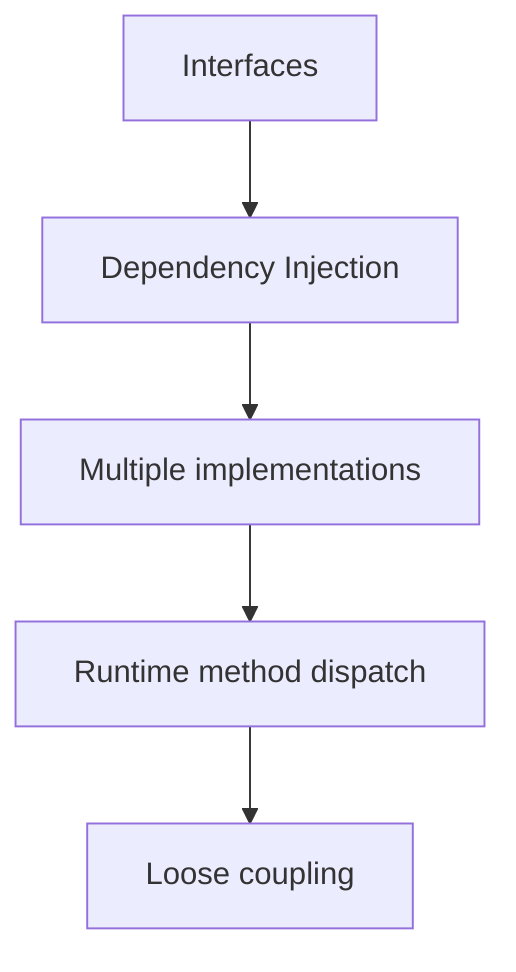

The word comes from:

```text
Poly = many
Morph = forms
```

So:

> **Polymorphism means one interface/reference/type can represent or work with multiple forms of objects.**

But there are two major forms we need to distinguish.

---

# 1. The Two Types of Polymorphism

In Java, you'll commonly hear:

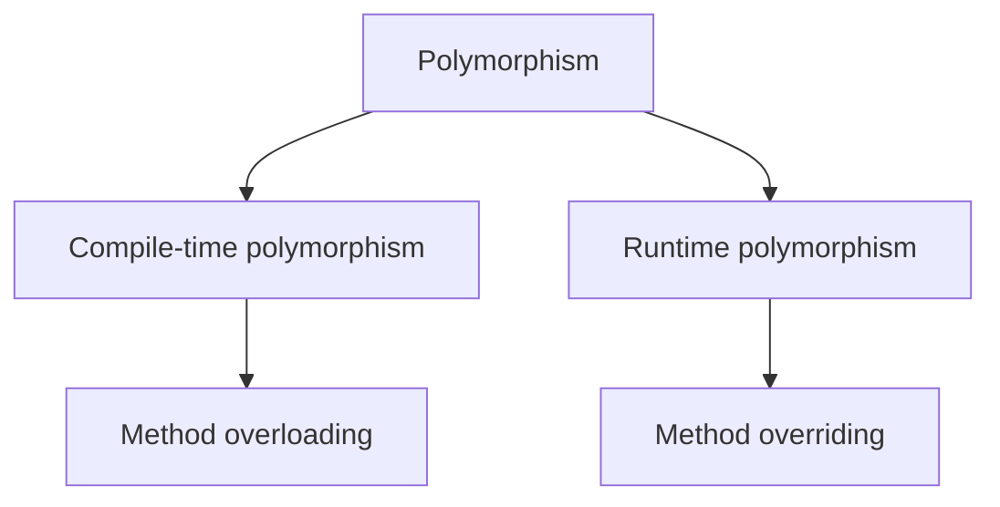

The difference is fundamental.

---

# 2. Compile-Time Polymorphism

Consider:

```java
class Calculator {

    int add(int a, int b) {
        return a + b;
    }

    double add(double a, double b) {
        return a + b;
    }

    int add(int a, int b, int c) {
        return a + b + c;
    }
}
```

Now:

```java
Calculator calculator = new Calculator();

calculator.add(10, 20);
calculator.add(10.5, 20.5);
calculator.add(10, 20, 30);
```

Java determines which method to call **during compilation**.

That's why it's called:

> **Compile-time polymorphism**

More specifically:

> **Method overloading**

---

# 3. How Does the Compiler Choose?

Suppose:

```java
calculator.add(10, 20);
```

The compiler sees:

```mermaid
graph TD
    A1[add(int, int)]
    A2[add(double, double)]
    A3[add(int, int, int)]
```

Arguments are:

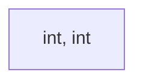

So it selects:

```mermaid
graph TD
    SEL[add(int, int)]
```

The method selection happens before the program executes.

---

# 4. Runtime Polymorphism

Now consider our vehicle example.

```java
class Vehicle {

    void start() {
        System.out.println("Vehicle starting");
    }
}
```

```java
class ElectricVehicle extends Vehicle {

    @Override
    void start() {
        System.out.println("Electric motor starting");
    }
}
```

Then:

```java
Vehicle vehicle = new ElectricVehicle();

vehicle.start();
```

What happens?

The reference type is:

```text
Vehicle
```

But the actual object is:

```text
ElectricVehicle
```

At runtime Java executes:

```text
ElectricVehicle.start()
```

This is:

> **Runtime polymorphism**

Also called:

> **Dynamic method dispatch**

---

# 5. The Most Important Mental Model

Always separate:

```text
REFERENCE TYPE
```

from:

```text
OBJECT TYPE
```

Example:

```java
Vehicle vehicle = new ElectricVehicle();
```

Think:


> The variable is declared as `Vehicle`, but the actual object created is `ElectricVehicle`.

The variable is declared as `Vehicle`.

But the actual object created is `ElectricVehicle`.

This distinction explains a huge amount of Java behavior.

---

# 6. What Does the Reference Type Control?

Consider:

```java
class Vehicle {

    void start() {
    }
}
```

```java
class ElectricVehicle extends Vehicle {

    void charge() {
    }
}
```

Now:

```java
Vehicle vehicle = new ElectricVehicle();
```

This works:

```java
vehicle.start();
```

But this doesn't:

```java
vehicle.charge(); // ❌
```

Why?

Because the compiler looks at the **reference type**:


and asks:

> "Does Vehicle have a `charge()` method?"

No.

So compilation fails.

---

# 7. But Runtime Uses the Object Type

Now:

```java
vehicle.start();
```

The compiler knows:

```text
Vehicle has start()
```

So it allows the call.

At runtime Java sees:

```text
Actual object = ElectricVehicle
```

and finds the overridden implementation:

```java
ElectricVehicle.start()
```

So:

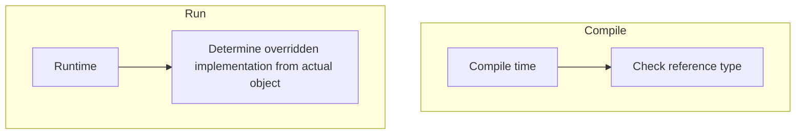

This is the heart of runtime polymorphism.

---

# 8. The Classic Interview Example

```java
class Animal {

    void sound() {
        System.out.println("Animal sound");
    }
}
```

```java
class Dog extends Animal {

    @Override
    void sound() {
        System.out.println("Bark");
    }
}
```

```java
class Cat extends Animal {

    @Override
    void sound() {
        System.out.println("Meow");
    }
}
```

Now:

```java
Animal a1 = new Dog();
Animal a2 = new Cat();

a1.sound();
a2.sound();
```

Output:

```text
Bark
Meow
```

Same method call:

```java
sound()
```

Same reference type:

```java
Animal
```

Different behavior:

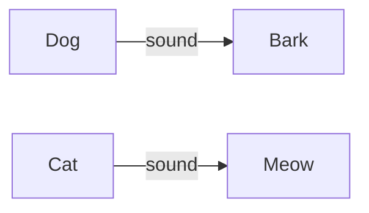

That's polymorphism.

---

# 9. Why Is This Useful?

Without polymorphism, you'd potentially write:

```java
if (animal instanceof Dog) {
    ...
}
else if (animal instanceof Cat) {
    ...
}
else if (animal instanceof Horse) {
    ...
}
```

This becomes ugly very quickly.

With polymorphism:

```java
animal.sound();
```

Each object knows how to behave.

That's a major object-oriented design principle:

> **Tell the object what to do; let the actual implementation decide how.**

---

# 10. Polymorphism Through Our EV Example

We have:

```java
class Vehicle {

    void start() {
        System.out.println("Vehicle starting");
    }
}
```

```java
class ElectricVehicle extends Vehicle {

    @Override
    void start() {
        System.out.println(
            "Electric motor starting"
        );
    }
}
```

```java
class PetrolVehicle extends Vehicle {

    @Override
    void start() {
        System.out.println(
            "Petrol engine starting"
        );
    }
}
```

Now:

```java
Vehicle v1 = new ElectricVehicle();
Vehicle v2 = new PetrolVehicle();

v1.start();
v2.start();
```

Output:

```text
Electric motor starting
Petrol engine starting
```

This is powerful because the caller only knows:

```text
Vehicle
```

It doesn't need to know the exact implementation.

---

# 11. Polymorphic Collection

This is where polymorphism becomes extremely useful.

You can have:

```java
List<Vehicle> vehicles = new ArrayList<>();

vehicles.add(new ElectricVehicle());
vehicles.add(new PetrolVehicle());
vehicles.add(new ElectricVehicle());
vehicles.add(new PetrolVehicle());
```

Then:

```java
for (Vehicle vehicle : vehicles) {
    vehicle.start();
}
```

Each object executes its own implementation.

Conceptually:

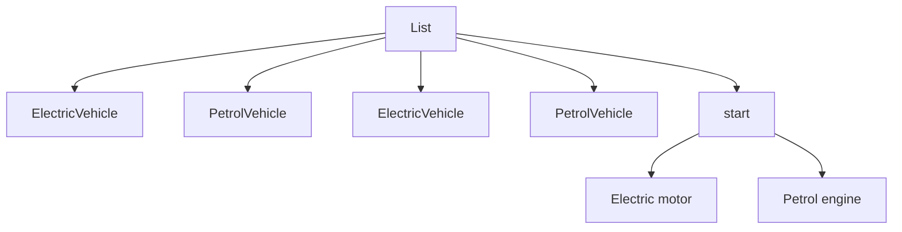

This pattern is everywhere in Java.

---

# 12. Real Backend Example: Payment Processing

This is where you should start thinking like a backend developer.

Suppose:

```java
class Payment {
    private double amount;
}
```

We want multiple payment providers.

Define:

```java
interface PaymentProcessor {

    void process(double amount);
}
```

Then:

```java
class StripeProcessor implements PaymentProcessor {

    @Override
    public void process(double amount) {
        System.out.println(
            "Processing through Stripe"
        );
    }
}
```

And:

```java
class RazorpayProcessor implements PaymentProcessor {

    @Override
    public void process(double amount) {
        System.out.println(
            "Processing through Razorpay"
        );
    }
}
```

Now:

```java
PaymentProcessor processor =
        new StripeProcessor();

processor.process(1000);
```

or:

```java
PaymentProcessor processor =
        new RazorpayProcessor();

processor.process(1000);
```

The caller only depends on:


not:


This is **polymorphism through interfaces**.

---

# 13. This Is the Foundation of Spring Dependency Injection

Imagine:

```java
@Service
class StripeProcessor
        implements PaymentProcessor {
}
```

and:

```java
@Service
class RazorpayProcessor
        implements PaymentProcessor {
}
```

Then another service might depend on:

```java
private final PaymentProcessor processor;
```

Spring can inject an implementation.

The important OOP concept underneath is:

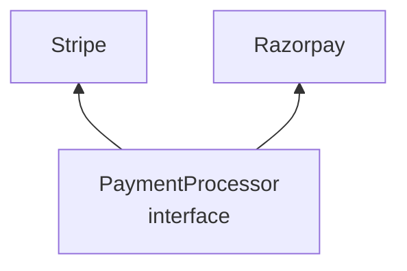

The consumer doesn't need to be tightly coupled to a concrete implementation.

This is why understanding polymorphism is so important before learning Spring deeply.

---

# 14. Dynamic Method Dispatch

Let's understand what happens more precisely.

Given:

```java
Vehicle vehicle = new ElectricVehicle();

vehicle.start();
```

At compile time:

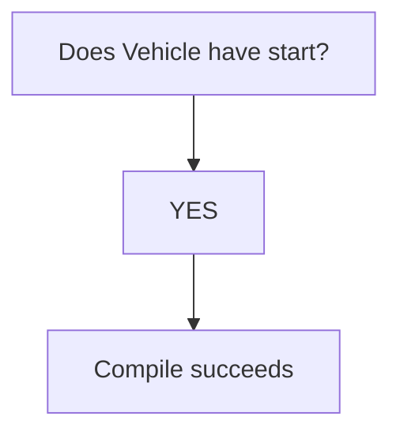

At runtime:

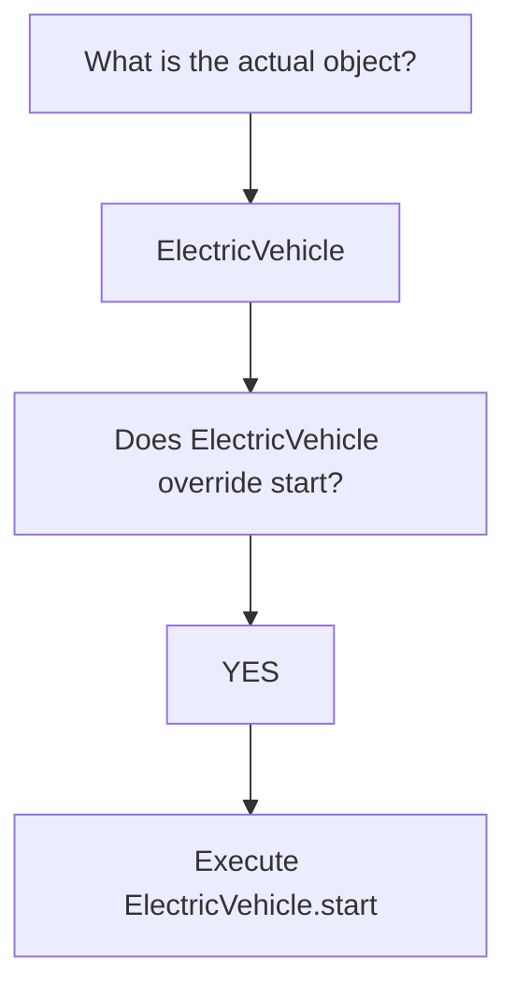

So:

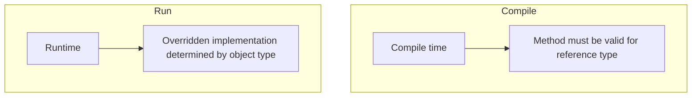

---

# 15. Very Important: Fields Don't Behave Like Methods

This is an interview trap.

Methods use runtime dispatch.

Fields do not.

Consider:

```java
class Parent {

    String name = "Parent";
}
```

```java
class Child extends Parent {

    String name = "Child";
}
```

Then:

```java
Parent obj = new Child();

System.out.println(obj.name);
```

What do you get?

```text
Parent
```

Not:

```text
Child
```

Why?

Fields are resolved based on the **reference type**, whereas overridden instance methods use runtime dispatch.

---

# 16. Example

```java
class Parent {

    String value = "Parent";

    void print() {
        System.out.println("Parent method");
    }
}
```

```java
class Child extends Parent {

    String value = "Child";

    @Override
    void print() {
        System.out.println("Child method");
    }
}
```

Then:

```java
Parent obj = new Child();

System.out.println(obj.value);
obj.print();
```

Output:

```text
Parent
Child method
```

This difference is extremely important.

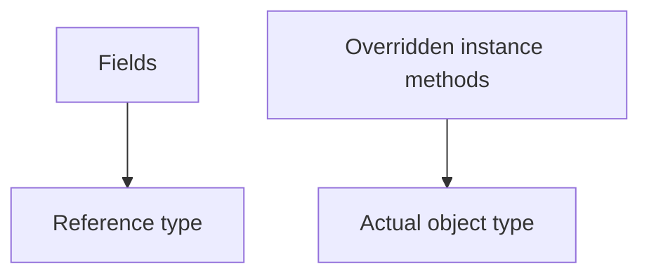

---

# 17. Static Methods and Polymorphism

Static methods are also not dynamically dispatched.

Example:

```java
class Parent {

    static void print() {
        System.out.println("Parent");
    }
}
```

```java
class Child extends Parent {

    static void print() {
        System.out.println("Child");
    }
}
```

Now:

```java
Parent obj = new Child();

obj.print();
```

prints:

```text
Parent
```

because static method selection is based on the reference/class context, not runtime object dispatch.

---

# 18. Private Methods

Private methods also don't participate in runtime overriding.

```java
class Parent {

    private void test() {
        System.out.println("Parent");
    }
}
```

```java
class Child extends Parent {

    private void test() {
        System.out.println("Child");
    }
}
```

These are two separate methods.

The child isn't overriding the parent's private method.

---

# 19. `final` Methods

A final method cannot be overridden:

```java
class Parent {

    final void execute() {
    }
}
```

Therefore:

```java
class Child extends Parent {

    void execute() { // ❌
    }
}
```

No runtime polymorphic override exists.

---

# 20. Upcasting + Polymorphism

This is the most important combination.

```java
ElectricVehicle ev =
        new ElectricVehicle();
```

You could simply call:

```java
ev.start();
```

But polymorphism becomes useful when:

```java
Vehicle vehicle = ev;
```

Now we can treat many different implementations uniformly.

For example:

```java
List<Vehicle> vehicles = List.of(
    new ElectricVehicle(),
    new PetrolVehicle(),
    new ElectricVehicle()
);
```

Then:

```java
for (Vehicle vehicle : vehicles) {
    vehicle.start();
}
```

No `if/else`.

No casting.

No knowledge of concrete classes.

That's the power.

---

# 21. Downcasting Is Often a Smell

Suppose you find yourself writing:

```java
if (vehicle instanceof ElectricVehicle ev) {
    ev.charge();
}
```

everywhere.

Ask yourself:

> Why does the caller need to know the concrete implementation?

Maybe the abstraction is wrong.

Instead of:

```java
if (vehicle instanceof ElectricVehicle) {
    ...
}
```

perhaps the base abstraction should expose an appropriate operation.

For example:

```java
abstract class Vehicle {

    abstract void refuel();
}
```

Then each vehicle implements it differently.

Although whether this exact abstraction makes sense depends on the domain.

The broader principle is:

> **Prefer polymorphism over repeated type checking when the behavior genuinely varies by type.**

---

# 22. Polymorphism and Loose Coupling

Compare these two designs.

### Tight coupling

```java
class OrderService {

    private StripeProcessor processor;

    public void pay() {
        processor.process();
    }
}
```

The service directly depends on Stripe.

### Polymorphic design

```java
class OrderService {

    private PaymentProcessor processor;

    public OrderService(PaymentProcessor processor) {
        this.processor = processor;
    }

    public void pay() {
        processor.process();
    }
}
```

Now:

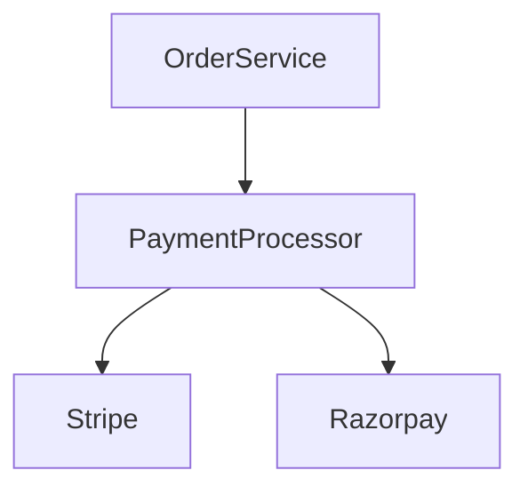

This is much more flexible.

---

# 23. Polymorphism + Dependency Injection

This is the connection you should remember for Spring Boot.

Without DI:

```java
class OrderService {

    private PaymentProcessor processor =
            new StripeProcessor();
}
```

The implementation is hardcoded.

With dependency injection:

```java
class OrderService {

    private final PaymentProcessor processor;

    OrderService(PaymentProcessor processor) {
        this.processor = processor;
    }
}
```

Now the caller/framework chooses the implementation.

This gives:


We'll come back to this when we study **Composition** and eventually Spring.

---

# 24. Polymorphism Through Interfaces

This is even more important than class inheritance in modern Java design.

```java
interface NotificationSender {

    void send(String message);
}
```

Implementations:

```java
class EmailSender
        implements NotificationSender {

    @Override
    public void send(String message) {
        System.out.println("Email");
    }
}
```

```java
class SmsSender
        implements NotificationSender {

    @Override
    public void send(String message) {
        System.out.println("SMS");
    }
}
```

Now:

```java
NotificationSender sender =
        new EmailSender();

sender.send("Hello");
```

or:

```java
NotificationSender sender =
        new SmsSender();

sender.send("Hello");
```

Same abstraction.

Different behavior.

This is polymorphism.

---

# 25. The Four Levels You Should Connect

You should now see this chain:

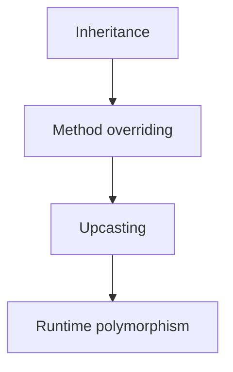

And another:

```mermaid
graph TD
    IF[Interface] --> MI[Multiple implementations]
    MI --> IR[Interface reference]
    IR --> RP2[Runtime polymorphism]
```

And in Spring:

```mermaid
graph TD
    IF2[Interface] --> MSI[Multiple @Service implementations]
    MSI --> DI[Dependency Injection]
    DI --> P[Polymorphism]
    P --> LC[Loose coupling]
```

---

# 26. A More Realistic Example

Suppose we're building an EV charging platform.

We have:

```java
interface ChargingProtocol {

    void startCharging();
    void stopCharging();
}
```

Implementations:

```java
class OcppChargingProtocol
        implements ChargingProtocol {

    @Override
    public void startCharging() {
        System.out.println("Starting via OCPP");
    }

    @Override
    public void stopCharging() {
        System.out.println("Stopping via OCPP");
    }
}
```

Another:

```java
class CustomChargingProtocol
        implements ChargingProtocol {

    @Override
    public void startCharging() {
        System.out.println("Starting via custom protocol");
    }

    @Override
    public void stopCharging() {
        System.out.println("Stopping via custom protocol");
    }
}
```

Consumer:

```java
class ChargingService {

    private final ChargingProtocol protocol;

    ChargingService(ChargingProtocol protocol) {
        this.protocol = protocol;
    }

    void start() {
        protocol.startCharging();
    }
}
```

`ChargingService` doesn't care whether the implementation is:

```text
OCPP
Custom
FutureProtocol
MockProtocol
```

That's excellent decoupling.

---

# 27. Compile-Time vs Runtime Polymorphism

Memorize this table conceptually:

|                                | Compile-time | Runtime     |
| ------------------------------ | ------------ | ----------- |
| Main mechanism                 | Overloading  | Overriding  |
| Decision                       | Compiler     | Runtime     |
| Inheritance required?          | No           | Usually yes |
| Same method name?              | Yes          | Yes         |
| Parameters differ?             | Yes          | No          |
| Actual implementation selected | Compile time | Runtime     |

Example:

### Compile-time

```java
calculate(int)
calculate(double)
```

### Runtime

```java
Vehicle v = new ElectricVehicle();

v.start();
```

---

# 28. Important Trick Question

Consider:

```java
class Parent {

    void print(Object obj) {
        System.out.println("Parent Object");
    }
}
```

```java
class Child extends Parent {

    void print(String obj) {
        System.out.println("Child String");
    }
}
```

Now:

```java
Parent p = new Child();

p.print("hello");
```

Which executes?

```text
Parent Object
```

Why?

Because `print(String)` in `Child` is **not an override** of:

```java
print(Object)
```

It is an overloaded/new method.

The compiler uses the reference type:

```text
Parent
```

and finds:

```java
print(Object)
```

This demonstrates why you must distinguish **overloading** from **overriding**.

---

# 29. Another Important Example

```java
class Parent {

    void process(Object obj) {
        System.out.println("Parent Object");
    }

    void process(String str) {
        System.out.println("Parent String");
    }
}
```

```java
class Child extends Parent {

    @Override
    void process(Object obj) {
        System.out.println("Child Object");
    }
}
```

Then:

```java
Parent p = new Child();

p.process("hello");
```

Which method?

First the compiler chooses the overload:

```text
process(String)
```

Then runtime dispatch checks whether that method is overridden.

`Child` did not override `process(String)`.

Therefore:

```text
Parent String
```

This gives you a very important two-step mental model:

```mermaid
graph TD
    S1[Step 1: Which method signature?] --> CT[Compile time]
    S2[Step 2: Which implementation?] --> R[Runtime]
```

This is a fantastic interview concept.

---

# 30. JVM-Level Mental Model

You don't need to memorize JVM internals, but understand the conceptual model.

When:

```java
Vehicle vehicle = new ElectricVehicle();
vehicle.start();
```

executes, the runtime effectively needs to determine:

```mermaid
graph TD
    AO[Actual object] --> EV[ElectricVehicle]
    EV --> Q[Does it provide an override for start?]
    Q --> A[Yes]
    A --> EX[Execute ElectricVehicle.start]
```

Java uses dynamic dispatch mechanisms internally to achieve this.

You may hear terms such as:

* virtual method invocation
* method dispatch
* method tables / vtables
* invokevirtual

For interviews, understanding **dynamic dispatch** is generally more important than memorizing JVM implementation details.

---

# 31. Polymorphism Is About Behavior

This is a subtle but important point.

People often say:

> "Polymorphism means parent reference pointing to child object."

That's an **example of polymorphism**, but not the full idea.

The real value is:

```mermaid
graph TD
    SA[Same abstraction] --> DI[Different implementations]
    DI --> DB[Different behavior]
```

For example:

```java
sender.send(message);
```

could result in:

```text
EmailSender → email
SmsSender   → SMS
PushSender  → push notification
```

The caller doesn't need to know the concrete type.

That's the actual power.

---

# 32. Coding Exercise — Polymorphism

Let's extend our EV project.

Create:

```java
abstract class Vehicle
```

Don't worry about abstract classes yet—you can temporarily use a normal class if you haven't studied them.

Define:

```java
void start()
void stop()
```

Then:

```java
class ElectricVehicle extends Vehicle
```

and:

```java
class PetrolVehicle extends Vehicle
```

Override:

```java
start()
```

with different implementations.

Then:

```java
List<Vehicle> vehicles = List.of(
    new ElectricVehicle(...),
    new PetrolVehicle(...),
    new ElectricVehicle(...)
);
```

Run:

```java
for (Vehicle vehicle : vehicles) {
    vehicle.start();
}
```

You should see different implementations execute.

---

# 33. Challenge — Remove `if/else`

Now imagine someone gives you:

```java
for (Vehicle vehicle : vehicles) {

    if (vehicle instanceof ElectricVehicle) {
        System.out.println("Start electric motor");
    }
    else if (vehicle instanceof PetrolVehicle) {
        System.out.println("Start petrol engine");
    }
}
```

Your task:

**Remove all the `instanceof` checks.**

The final code should simply be:

```java
for (Vehicle vehicle : vehicles) {
    vehicle.start();
}
```

That exercise captures the essence of runtime polymorphism.

---

# 34. Interview Questions You Should Be Able to Answer

### Q1. What is polymorphism?

One abstraction/reference can represent different concrete implementations, allowing the same operation to produce type-specific behavior.

### Q2. What is runtime polymorphism?

Runtime selection of an overridden instance method based on the actual object's type.

### Q3. What is compile-time polymorphism?

Method overloading where the compiler selects the applicable method.

### Q4. What is dynamic method dispatch?

The runtime mechanism through which Java selects the overridden instance method corresponding to the actual object.

### Q5. What determines what methods you can call?

The **reference type** determines what the compiler allows you to call.

### Q6. What determines which overridden implementation executes?

The **actual object type**.

### Q7. Do fields participate in runtime polymorphism?

No.

### Q8. Do static methods participate in runtime polymorphism?

No. Static methods are hidden rather than overridden.

### Q9. Can private methods be overridden?

No.

### Q10. Why is polymorphism useful?

It allows code to depend on abstractions rather than concrete implementations, reducing coupling and making systems easier to extend and test.

---

# 35. The Most Important Diagram So Far

Understand this completely:

```mermaid
graph TD
    V[Vehicle] --> EV[ElectricVehicle]
    V --> PV[PetrolVehicle]
    EV --> ES[start]
    PV --> PS[start]
    VR[Vehicle reference] --> EO[Electric object]
    VR --> PO[Petrol object]
    EO --> EVS[Electric start]
    PO --> PVS[Petrol start]
```

And:

```java
Vehicle v = new ElectricVehicle();
```

means:

```mermaid
graph LR
    RT2[REFERENCE TYPE: Vehicle] -->|reference| OT2[OBJECT TYPE: ElectricVehicle]
    RT2 --> CCS[What compiler sees]
    OT2 --> WRS[What runtime sees]
```

This distinction is one of the **most important Java concepts to master**.

---

# Where We Are

We've now covered:

```text
1. Classes          ✅
2. Encapsulation    ✅
3. Inheritance      ✅
4. Polymorphism     ✅
```

And we've already connected them:

```mermaid
graph TD
    C[Class] --> E[Encapsulation]
    E --> I[Inheritance]
    I --> O[Overriding]
    O --> P[Polymorphism]
```

## Next: Abstract Classes

This is the natural next step because we now have a problem:

> **What if `Vehicle` should be a common abstraction, but creating a generic `Vehicle` object doesn't make semantic sense?**

That's exactly where **abstract classes** come in.

We'll cover:

* `abstract` classes
* abstract methods
* concrete methods inside abstract classes
* constructors in abstract classes
* fields in abstract classes
* abstract class references
* abstract class vs normal class
* abstract class vs interface
* partial abstraction
* template method pattern
* real Spring/backend examples
* when abstract classes are a good design
* when they become a bad design
* coding a proper vehicle/charging hierarchy.
