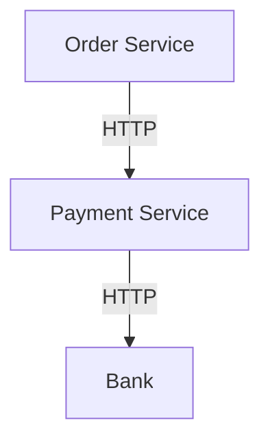
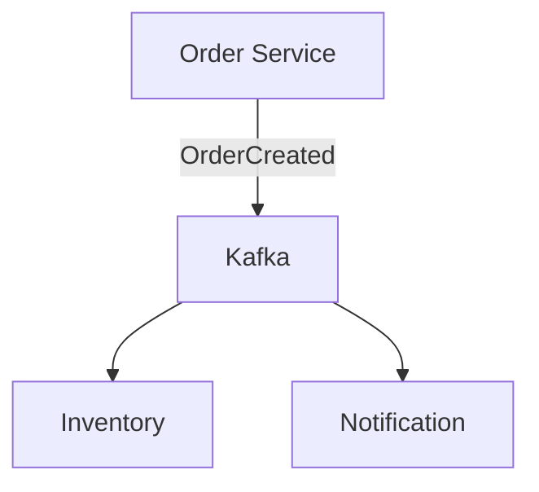
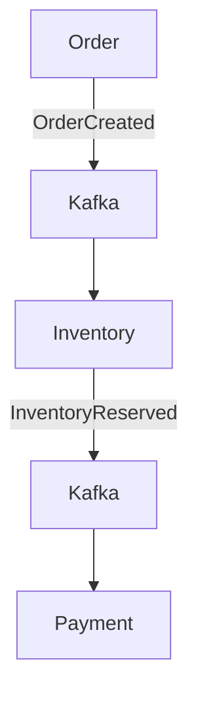
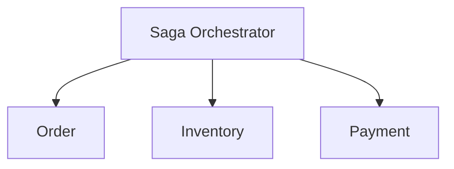
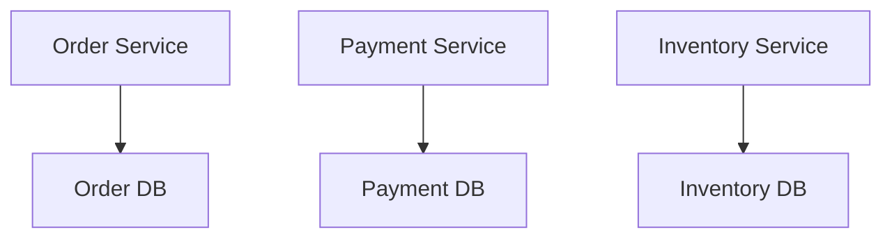
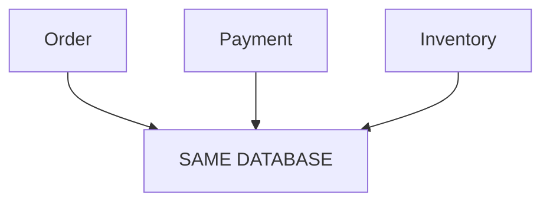

Absolutely. Since you already know the basics, I would **not** approach this as “learn microservices.” I would approach it as **become capable of designing, implementing, debugging, scaling, and defending a production microservices system in an interview**.

The goal should be that when an interviewer asks:

> “Design an order system using microservices.”

you can naturally move from **requirements → service boundaries → APIs → databases → communication → transactions → consistency → failure handling → scaling → deployment → observability → security → trade-offs**, and then actually implement important pieces in Java/Spring Boot.

# Microservices Mastery Roadmap

I would divide the preparation into **14 major areas**, followed by a dedicated **coding track** and a **scenario/interview track**.

---

## 0. Prerequisites — Make Sure the Foundation Is Strong

Before going deep into microservices, you should be comfortable with:

### Java

* [ ] OOP deeply
* [ ] Interfaces vs abstract classes
* [ ] Composition vs inheritance
* [ ] Generics
* [ ] Collections
* [ ] HashMap internals
* [ ] ConcurrentHashMap
* [ ] equals/hashCode
* [ ] Immutability
* [ ] Exceptions
* [ ] Java Streams
* [ ] Lambdas
* [ ] Functional interfaces
* [ ] Multithreading
* [ ] ExecutorService
* [ ] CompletableFuture
* [ ] Synchronization
* [ ] Locks
* [ ] Atomic classes
* [ ] Thread pools
* [ ] JVM basics
* [ ] Garbage collection
* [ ] JVM memory model

### Spring Boot

* [ ] Dependency Injection
* [ ] IoC
* [ ] Bean lifecycle
* [ ] Auto configuration
* [ ] Configuration properties
* [ ] Profiles
* [ ] REST controllers
* [ ] Filters
* [ ] Interceptors
* [ ] Exception handling
* [ ] Validation
* [ ] Spring Data JPA
* [ ] Transactions
* [ ] Spring Security
* [ ] Actuator
* [ ] Testing

You don't need to stop and relearn all of these if you're already comfortable. They become **supporting knowledge** for the microservices material.

---

# 1. Microservices Fundamentals

First understand **why microservices exist**.

### Monolith

Understand:

```text
                ┌──────────────────────────┐
                │        MONOLITH          │
                │                          │
Client ────────►│ User                     │
                │ Order                    │
                │ Payment                  │
                │ Inventory                │
                │ Notification             │
                │                          │
                └──────────┬───────────────┘
                           │
                        Database
```

Then:

```text
                         ┌─────────────┐
                         │ User Service│
                         └──────┬──────┘
                                │
                         ┌──────▼──────┐
                         │ Order       │
                         │ Service     │
                         └───┬─────┬───┘
                             │     │
                   ┌─────────▼─┐ ┌─▼──────────┐
                   │ Inventory │ │ Payment   │
                   │ Service   │ │ Service   │
                   └───────────┘ └────────────┘
```

### Learn deeply

* What is a microservice?
* Why microservices?
* Why NOT microservices?
* Monolith vs modular monolith vs microservices
* SOA vs microservices
* Distributed systems vs microservices
* Service independence
* Independent deployment
* Independent scaling
* Fault isolation
* Team ownership
* Technology independence

### Critical interview question

> Why would you choose microservices instead of a monolith?

You should be able to answer this **without saying “scalability.”**

---

# 2. Service Decomposition — One of the Most Important Topics

This is where system design begins.

Learn:

### Domain-driven decomposition

Understand:

* Domain
* Subdomain
* Bounded Context
* Entity
* Aggregate
* Aggregate root
* Value object
* Domain event

Example:

```text
E-Commerce

                    E-Commerce
                        │
        ┌───────────────┼────────────────┐
        │               │                │
     Catalog          Orders           Payments
        │               │                │
    Products         Cart             Payment
    Categories       Checkout         Refund
```

Possible services:

```text
Product Service
Inventory Service
Cart Service
Order Service
Payment Service
Shipping Service
Notification Service
User Service
```

### Learn decomposition strategies

* By business capability
* By bounded context
* By data ownership
* By team ownership
* By workflow
* By scalability requirement
* By change frequency

### Anti-patterns

* Distributed monolith
* Too many services
* Nano-services
* Shared database
* Shared business logic
* Excessive synchronous communication

---

# 3. Communication Between Services

This is a HUGE topic.

You need to understand both:

## Synchronous communication



Learn:

* REST
* HTTP
* gRPC
* OpenFeign
* WebClient
* RestClient
* Timeouts
* Connection pools
* Retries
* Circuit breakers

### REST

Understand:

* GET
* POST
* PUT
* PATCH
* DELETE
* Status codes
* Headers
* Idempotency
* Content negotiation
* Versioning

### gRPC

Learn:

* Protocol Buffers
* Unary calls
* Streaming
* HTTP/2
* Binary serialization
* When gRPC is better than REST

---

# 4. Asynchronous Communication

Then move into messaging.



Learn:

### Messaging concepts

* Queue
* Topic
* Producer
* Consumer
* Broker
* Partition
* Offset
* Consumer group
* Acknowledgement
* Retention
* Replay
* Ordering
* Delivery semantics

### Kafka

You should know:

* Topic
* Partition
* Offset
* Consumer group
* Producer
* Consumer
* Replication
* Leader/follower
* Rebalancing
* Partition assignment
* Consumer lag
* Retention
* Compaction

### Critical question

> Why Kafka instead of REST?

And:

> Why Kafka instead of RabbitMQ?

---

# 5. Distributed Transactions

This is where microservices becomes genuinely interesting.

Suppose:

```text
Order
  │
  ├── Inventory
  │
  ├── Payment
  │
  └── Shipping
```

What happens if:

```text
Order       ✓
Inventory   ✓
Payment     ✗
```

You can't simply do:

```java
@Transactional
```

across independent databases.

Understand:

* ACID
* Local transactions
* Distributed transactions
* 2PC
* XA
* CAP theorem
* BASE
* Eventual consistency

---

# 6. Saga Pattern

**Must-master topic.**

Learn both:

### Choreography



Services react to events.

### Orchestration



Learn:

* Saga
* Compensating transactions
* Choreography
* Orchestration
* Failure scenarios
* Partial failure
* Rollback semantics

### Interview scenario

> Payment succeeded but inventory reservation failed. What do you do?

You should immediately think:

**Saga + compensation + idempotency + event-driven recovery.**

---

# 7. Data Management in Microservices

One of the most important architectural rules:

> **Each service should own its data.**

Understand:



Not:



Learn:

* Database per service
* Shared database
* Database ownership
* Polyglot persistence
* SQL vs NoSQL
* Read replicas
* Sharding
* Partitioning
* Indexing
* Caching
* CQRS

---

# 8. CQRS

Understand:

```text
                Commands
                   │
                   ▼
             Write Model
                   │
                   ▼
                 DB
                   │
                   ▼
             Read Model
                   │
                   ▼
                Queries
```

Learn:

* Command
* Query
* Read model
* Write model
* Event-driven projections
* When CQRS helps
* When CQRS is unnecessary

Then connect:

**CQRS + Kafka + Event sourcing**

---

# 9. Event Sourcing

Understand the difference between:

### Traditional

```text
Account Balance = ₹5000
```

versus:

```text
Deposit ₹5000
Withdraw ₹1000
Deposit ₹1000
Withdraw ₹0
```

Events become the source of truth.

Learn:

* Event store
* Events
* Event replay
* State reconstruction
* Snapshots
* Event versioning
* Event evolution
* Event sourcing vs event-driven architecture

Very important:

> Event-driven architecture ≠ Event sourcing.

---

# 10. Resilience and Fault Tolerance

This is another **must-master** area.

Imagine:

```text
Order
  │
  ▼
Payment
  │
  ▼
Bank
```

Bank becomes slow.

Without protection:

```text
Order threads
     │
     ▼
Payment
     │
     ▼
Bank
     │
   TIMEOUT
     │
     ▼
Thread blocked
```

Then hundreds/thousands of requests do this.

Eventually:

**cascading failure.**

Learn:

### Timeout

Never wait forever.

### Retry

But understand:

> Retry can make an outage worse.

Learn:

* Retry
* Exponential backoff
* Jitter
* Retryable errors
* Non-retryable errors

### Circuit Breaker

States:

```text
CLOSED
   │
 failures
   ▼
OPEN
   │
 timeout
   ▼
HALF_OPEN
   │
 success
   ▼
CLOSED
```

Learn:

* Circuit breaker
* Bulkhead
* Rate limiting
* Load shedding
* Backpressure
* Timeout
* Fail fast
* Graceful degradation

### Critical distinction

You should be able to explain:

**Rate Limiter vs Circuit Breaker vs Bulkhead vs Retry vs Timeout**

---

# 11. Idempotency

This deserves its own topic.

Imagine:

```text
POST /payments
```

Client sends:

```text
₹10,000 payment
```

Network timeout occurs.

Client retries.

Now:

```text
Payment #1 → ₹10,000
Payment #2 → ₹10,000
```

Customer lost ₹20,000.

Solution:

```text
Idempotency-Key: abc123
```

Learn:

* Idempotent APIs
* Idempotency keys
* Duplicate messages
* Duplicate events
* Consumer deduplication
* Database constraints
* Exactly-once myths

---

# 12. Service Discovery and Infrastructure

Learn how services actually find each other.

### Traditional

```text
Order → http://10.20.30.40:8080
```

Bad because IP changes.

Instead:

```text
Order
 │
 ▼
Service Discovery
 │
 ▼
Payment Service
```

Learn:

* Service registry
* Service discovery
* Client-side discovery
* Server-side discovery
* DNS-based discovery
* Kubernetes service discovery
* Consul
* Eureka

Understand how Kubernetes changes the architecture.

---

# 13. API Gateway

Learn:

```text
                    Client
                       │
                       ▼
                 API Gateway
             ┌──────┬──────┐
             ▼      ▼      ▼
           User   Order  Payment
```

Responsibilities:

* Routing
* Authentication
* Authorization
* Rate limiting
* Request transformation
* Aggregation
* TLS termination
* API versioning
* Logging
* Correlation IDs

Understand:

**API Gateway vs Load Balancer**

and

**API Gateway vs Service Mesh**

---

# 14. Load Balancing

Understand deeply:

* L4 vs L7
* Reverse proxy
* Load balancer
* Round robin
* Weighted round robin
* Least connections
* Consistent hashing
* Health checks
* Sticky sessions
* Client-side load balancing
* Server-side load balancing

Connect this to your previous **consistent hashing** learning.

For example:

```text
                    Load Balancer
                  /       |       \
                 /        |        \
             Service A Service B Service C
```

Then understand how Kubernetes implements service traffic.

---

# 15. Caching

Microservices almost always involve caching.

Learn:

### Cache-aside

```text
Application
    │
    ▼
 Redis?
 /    \
yes    no
│       │
return  DB
        │
        ▼
      Redis
```

Learn:

* Cache-aside
* Read-through
* Write-through
* Write-behind
* Cache invalidation
* TTL
* Eviction
* LRU
* Cache stampede
* Cache penetration
* Cache avalanche
* Distributed cache
* Redis

Then connect:

**Redis + distributed systems + microservices.**

---

# 16. Observability

You should become very strong here.

Three pillars:

```text
        Observability
       /      |       \
    Logs    Metrics   Traces
```

### Logging

Learn:

* Structured logging
* Log levels
* Correlation ID
* Request ID
* Centralized logging

### Metrics

Learn:

* Counter
* Gauge
* Histogram
* Percentiles
* p50
* p95
* p99
* Throughput
* Error rate
* Saturation

### Distributed tracing

Example:

```text
Client
 │
 ▼
Gateway
 │
 ▼
Order
 │
 ├──► Inventory
 │
 └──► Payment
```

Trace:

```text
Trace ID = abc123

Gateway span
 └── Order span
      ├── Inventory span
      └── Payment span
```

Learn:

* OpenTelemetry
* Trace ID
* Span ID
* Context propagation
* Sampling
* Jaeger
* Zipkin
* Tempo

---

# 17. Security

Microservices security is a major interview topic.

Learn:

### Authentication

* Sessions
* JWT
* OAuth 2.0
* OpenID Connect
* SSO
* Access tokens
* Refresh tokens

### Authorization

* RBAC
* ABAC
* Scopes
* Roles

### Service-to-service security

* mTLS
* Service identity
* Secrets
* API keys

### Infrastructure security

* TLS
* Encryption at rest
* Encryption in transit
* Secret management
* Vault
* Azure Key Vault
* Kubernetes Secrets

You should be able to design:

```text
Client
  │
  ▼
API Gateway
  │
 JWT
  ▼
Service
  │
 mTLS
  ▼
Another Service
```

---

# 18. Configuration Management

Learn:

* Environment variables
* Spring profiles
* External configuration
* Config server
* Kubernetes ConfigMap
* Kubernetes Secret
* Dynamic configuration
* Feature flags

Understand why configuration shouldn't be hardcoded.

---

# 19. Deployment and DevOps

This connects microservices to your existing Azure/Terraform knowledge.

Learn:

```text
Git
 │
 ▼
CI
 │
 ├── Build
 ├── Unit Test
 ├── Integration Test
 ├── Security Scan
 │
 ▼
Docker Image
 │
 ▼
Container Registry
 │
 ▼
Kubernetes
 │
 ▼
Deployment
```

Learn:

* Docker
* Containerization
* Kubernetes
* Pods
* Deployments
* Services
* ConfigMaps
* Secrets
* Ingress
* HPA
* Probes
* Rolling deployment
* Blue/green
* Canary
* Rollback
* CI/CD

---

# 20. Kubernetes for Microservices

You don't need to become a Kubernetes administrator initially.

But you should understand:

```text
Cluster
 ├── Namespace
 │
 ├── Deployment
 │    ├── Pod
 │    ├── Pod
 │    └── Pod
 │
 ├── Service
 │
 ├── ConfigMap
 │
 ├── Secret
 │
 └── Ingress
```

Learn:

* Pod
* ReplicaSet
* Deployment
* Service
* ClusterIP
* NodePort
* LoadBalancer
* Ingress
* Namespace
* ConfigMap
* Secret
* HPA
* Liveness probe
* Readiness probe
* Startup probe
* Resource requests/limits

And understand:

> How does a request travel from the internet to a Spring Boot pod?

That is a fantastic interview question.

---

# 21. Testing Microservices

You need more than unit testing.

Learn the testing pyramid:

```text
             E2E
            /   \
       Integration
          /       \
       Component
          /       \
          Unit
```

Learn:

### Unit testing

* JUnit
* Mockito

### Integration testing

* Spring Boot Test
* Testcontainers
* PostgreSQL
* Kafka
* Redis

### Contract testing

* Consumer-driven contracts
* Pact

### API testing

* Postman
* REST Assured

### Failure testing

* Dependency unavailable
* Timeout
* Kafka unavailable
* DB unavailable
* Duplicate message
* Partial failure

---

# 22. Messaging Reliability

Go much deeper here.

You should understand:

### At-most-once

```text
Message → maybe processed once
```

### At-least-once

```text
Message → guaranteed retry
           ↓
       possible duplicate
```

### Exactly-once

Understand why people often misuse this term.

Learn:

* Delivery guarantees
* Duplicate processing
* Idempotent consumers
* Offset commits
* Consumer retries
* Dead-letter queues
* Poison messages
* Retry topics
* Backoff
* Ordering
* Partitioning

---

# 23. Outbox Pattern

**Extremely important interview topic.**

Problem:

```text
DB transaction
     │
     ├── Save Order ✓
     │
     └── Publish Kafka event ✗
```

Now DB says order exists but Kafka doesn't know.

Outbox:

```text
Order Service
     │
     ├──────────────► Order DB
     │                    │
     │                    ▼
     │                Outbox Table
     │
     ▼
Outbox Publisher
     │
     ▼
Kafka
```

Learn:

* Transactional outbox
* Polling publisher
* CDC
* Debezium
* Dual-write problem

Then connect:

**Outbox + Saga + Kafka + eventual consistency.**

---

# 24. Distributed Systems Fundamentals

This should run parallel with microservices.

Master:

* CAP theorem
* PACELC
* Consistency
* Availability
* Partition tolerance
* Strong consistency
* Eventual consistency
* Linearizability
* Sequential consistency
* Quorum
* Leader election
* Replication
* Consensus
* Distributed locks
* Clock issues
* Network partitions
* Split brain

You don't need to become a distributed-systems researcher, but you should understand **why systems behave this way**.

---

# 25. Advanced Patterns

Once the previous topics are solid:

* Strangler Fig
* Sidecar
* Ambassador
* Adapter
* Anti-corruption layer
* Bulkhead
* Circuit breaker
* Saga
* CQRS
* Event sourcing
* Outbox
* Retry
* Dead-letter queue
* API Gateway
* Backend-for-Frontend
* Service mesh

---

# 26. Service Mesh

Later-stage topic.

Understand:

```text
          Pod
      ┌──────────┐
      │ App      │
      │          │
      │ Sidecar  │
      └────┬─────┘
           │
           ▼
      Service Mesh
```

Learn:

* Sidecar
* Envoy
* Istio
* mTLS
* Traffic management
* Retries
* Circuit breaking
* Observability
* Service identity

Understand:

> Why would we put retries/circuit breakers in the application versus service mesh?

---

# 27. Microservices Coding Track

This is extremely important for you.

Don't only read architecture.

We should actually build systems.

## Project 1 — Basic Microservices

Build:

```text
User Service
Product Service
Order Service
```

Technology:

```text
Java
Spring Boot
PostgreSQL
Docker
REST
OpenFeign
```

Implement:

* CRUD
* DTOs
* Validation
* Exception handling
* JPA
* Pagination
* API versioning
* OpenAPI

---

# Project 2 — Add API Gateway

```text
Client
  │
  ▼
API Gateway
  │
 ┌┼──────────────┐
 ▼▼              ▼
User          Product
              Order
```

Implement:

* Routing
* Authentication
* Rate limiting
* Request logging
* Correlation ID

---

# Project 3 — Add Kafka

Change:

```text
Order → Payment
```

to:

```text
Order
 │
 ▼
Kafka
 │
 ▼
Payment
```

Implement:

* Producer
* Consumer
* Consumer group
* Partitioning
* Retry
* DLQ
* Idempotent consumer

---

# Project 4 — Saga

Build:

```text
Order
  │
  ▼
Inventory
  │
  ▼
Payment
  │
  ▼
Shipping
```

Then intentionally introduce failures.

Example:

```text
Order ✓
Inventory ✓
Payment ✗
```

Implement compensation.

---

# Project 5 — Outbox

Build:

```text
Order DB
   │
   ▼
Outbox
   │
   ▼
Kafka
```

Implement it with:

* Spring Boot
* PostgreSQL
* Kafka
* Debezium

---

# Project 6 — Production-Grade System

Eventually build something like:

```text
                    ┌───────────────┐
                    │     Client    │
                    └───────┬───────┘
                            │
                            ▼
                    ┌───────────────┐
                    │ API Gateway   │
                    └───────┬───────┘
                            │
        ┌───────────────────┼──────────────────┐
        ▼                   ▼                  ▼
   User Service        Order Service      Product Service
                            │
                    ┌───────┴────────┐
                    ▼                ▼
               Inventory         Payment
                    │                │
                    └───────┬────────┘
                            ▼
                          Kafka
                            │
                 ┌──────────┼─────────┐
                 ▼          ▼         ▼
            Notification  Analytics  Shipping

Redis
PostgreSQL
Kafka
OpenTelemetry
Prometheus
Grafana
Docker
Kubernetes
```

---

# 28. Interview Scenario Practice

This deserves a **separate preparation track**.

We should practice scenarios like:

### Failure scenarios

1. Payment service is down.
2. Payment service is slow.
3. Kafka is down.
4. Database is down.
5. Redis is down.
6. One pod is crashing.
7. Network partition occurs.
8. Consumer is processing duplicate events.
9. Consumer is extremely slow.
10. Kafka consumer lag is increasing.

### Consistency scenarios

11. Payment succeeds but order update fails.
12. Inventory reservation succeeds but payment fails.
13. User receives duplicate payment.
14. Two users buy the last item simultaneously.
15. Order is created but event isn't published.
16. Event is published twice.

### Scaling scenarios

17. Order traffic suddenly increases 100×.
18. One service becomes a bottleneck.
19. Database becomes the bottleneck.
20. Kafka partition becomes hot.
21. Redis becomes overloaded.

### Architecture scenarios

22. Should this be synchronous or asynchronous?
23. Should we introduce Kafka?
24. Do we need microservices?
25. How should services be divided?
26. Should services share a database?
27. REST or gRPC?
28. Kafka or RabbitMQ?
29. Redis or database?
30. API Gateway or service mesh?

---

# 29. Full Microservices System Design Questions

Eventually you should be able to solve:

### Beginner

* Design User Management
* Design Notification Service
* Design URL Shortener using microservices
* Design File Upload Service

### Intermediate

* Design E-commerce
* Design Food Delivery
* Design Ride Booking
* Design Payment System
* Design Inventory Management
* Design Ticket Booking

### Advanced

* Design Netflix-like streaming
* Design Uber-like ride matching
* Design Amazon-like order management
* Design WhatsApp-like messaging
* Design distributed payment processing
* Design large-scale notification platform
* Design distributed job scheduler

---

# 30. The Most Important Connections

This is what will turn your knowledge into **system-design intuition**.

You should be able to connect:

```text
Microservices
     │
     ├── Service decomposition
     │
     ├── Database per service
     │
     ├── REST / gRPC
     │
     ├── Kafka
     │
     ├── Saga
     │
     ├── Outbox
     │
     ├── Idempotency
     │
     ├── Eventual consistency
     │
     ├── Redis
     │
     ├── Circuit breaker
     │
     ├── Rate limiting
     │
     ├── Observability
     │
     ├── API Gateway
     │
     ├── Kubernetes
     │
     └── CI/CD
```

And ultimately:

```text
                 SYSTEM DESIGN
                       │
        ┌──────────────┼───────────────┐
        ▼              ▼               ▼
     Traffic        Business        Data
        │              │               │
    Gateway         Services        Database
    LB              Saga            Cache
    Rate Limit      Events          Replication
    CDN             Transactions    Sharding
        │              │               │
        └──────────────┼───────────────┘
                       ▼
                 DISTRIBUTED SYSTEM
                       │
          ┌────────────┼────────────┐
          ▼            ▼            ▼
       Failure      Consistency   Scalability
          │            │            │
       Retry          Saga          Kafka
       Timeout       Outbox         Cache
       CB            CQRS           Sharding
       Bulkhead      Idempotency    Replicas
```

That is the level we're aiming for.

---

# Recommended Order

I **would not study the above randomly**.

Follow this sequence:

### Phase 1 — Foundations

1. Microservices fundamentals
2. Monolith vs microservices
3. Distributed systems fundamentals
4. Service decomposition
5. DDD / bounded contexts

### Phase 2 — Communication

6. REST
7. gRPC
8. Synchronous communication
9. Asynchronous communication
10. Kafka
11. Messaging guarantees

### Phase 3 — Data

12. Database per service
13. Transactions
14. Distributed transactions
15. Saga
16. Eventual consistency
17. Outbox
18. CQRS
19. Event sourcing

### Phase 4 — Resilience

20. Timeout
21. Retry
22. Circuit breaker
23. Bulkhead
24. Rate limiting
25. Backpressure
26. Load shedding
27. Idempotency

### Phase 5 — Infrastructure

28. API Gateway
29. Service discovery
30. Load balancing
31. Redis
32. Configuration
33. Kubernetes
34. Service mesh

### Phase 6 — Production

35. Logging
36. Metrics
37. Distributed tracing
38. OpenTelemetry
39. Security
40. CI/CD
41. Deployment strategies
42. Disaster recovery

### Phase 7 — Coding

43. Spring Boot microservices
44. REST
45. OpenFeign
46. Kafka
47. Redis
48. PostgreSQL
49. Testcontainers
50. Docker
51. Kubernetes
52. Observability

### Phase 8 — Interview

53. Failure scenarios
54. Consistency scenarios
55. Scaling scenarios
56. Architecture trade-offs
57. Debugging scenarios
58. Full system-design problems
59. Mock interviews

---

# How I Recommend We Actually Study It

For **each topic**, don't just learn the definition.

We'll use this pattern:

### 1. What

What is the technology/pattern?

### 2. Why

What problem does it solve?

### 3. How

How does it actually work internally?

### 4. Code

Implement it in **Java + Spring Boot**.

### 5. Failure

What happens when something breaks?

### 6. Scale

What happens at 10× / 100× traffic?

### 7. Trade-offs

When should we **not** use it?

### 8. Integration

How does it interact with:

* Kafka
* Redis
* PostgreSQL
* Kubernetes
* API Gateway
* Observability
* Security

### 9. Interview

I'll give you scenarios where **you have to make the architectural decision yourself**.

### 10. System Design

Finally, we'll use the topic inside a complete system.

---

## The ultimate target

By the end, you shouldn't merely be able to say:

> “Kafka is an event streaming platform.”

You should be able to reason:

> “I would make this workflow asynchronous because the caller doesn't need the downstream result immediately. I'll publish an event through Kafka, use an outbox to avoid the DB/event dual-write problem, make the consumer idempotent because delivery is at-least-once, use a retry topic and DLQ for failures, and use a Saga if multiple services participate in the business transaction. Since the operation is eventually consistent, I'll expose an intermediate state to the client. I'll propagate a correlation/trace ID across the event headers so we can debug the workflow end-to-end.”

**That is the level of microservices mastery we should target.**

And because you're already working with **Java, Spring Boot, Kafka, Redis, Docker, Kubernetes, Azure and Terraform**, we can make this heavily implementation-oriented rather than spending weeks on beginner theory.
