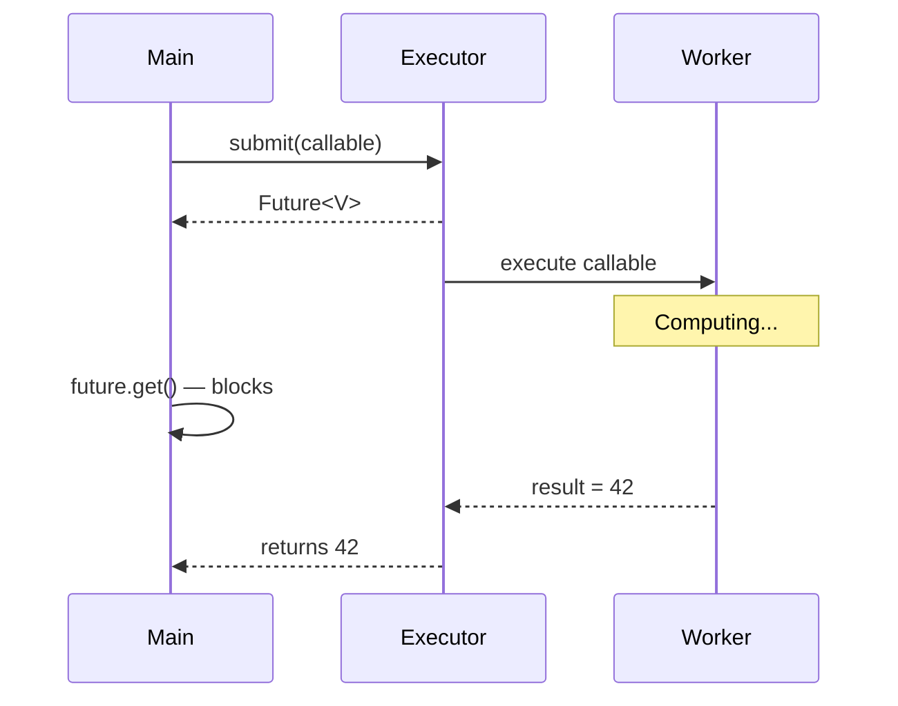
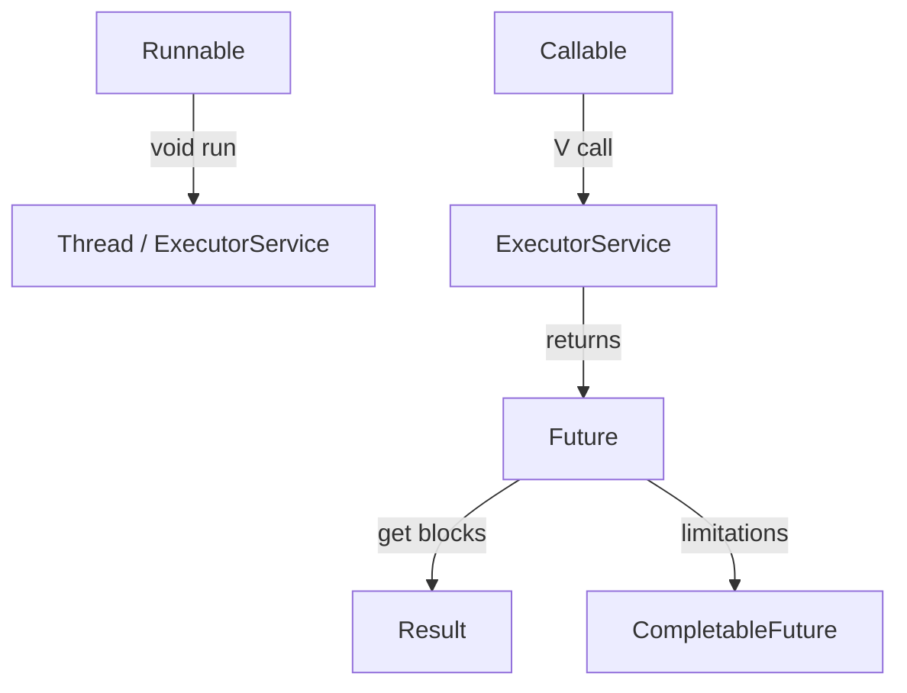

# Callable & Future — Getting Results from Threads

`Runnable` has a fundamental limitation — its `run()` method returns `void`. In real systems, you often need a thread to **return a result** or **throw a checked exception**. That's where `Callable` and `Future` come in.

---

# 1. The Problem with Runnable

```java
Runnable task = () -> {
    int result = 42; // computed something
    // How do I return this?
};
```

`Runnable.run()` signature:

```java
public void run();
```

No return value. No checked exceptions.

To work around this, you'd need ugly hacks:

```java
class MyTask implements Runnable {
    private volatile int result;

    public void run() {
        result = expensiveComputation();
    }

    public int getResult() {
        return result;
    }
}
```

Then manually synchronize and wait. This is fragile and error-prone.

---

# 2. Enter `Callable<V>`

`Callable` is the return-value-capable version of `Runnable`.

```java
@FunctionalInterface
public interface Callable<V> {
    V call() throws Exception;
}
```

Compare:

```text
┌─────────────────────────────────────┐
│          Runnable                    │
│                                     │
│  void run()                         │
│  • No return value                  │
│  • No checked exceptions            │
└─────────────────────────────────────┘

┌─────────────────────────────────────┐
│          Callable<V>                │
│                                     │
│  V call() throws Exception          │
│  • Returns a value of type V        │
│  • Can throw checked exceptions     │
└─────────────────────────────────────┘
```

Example:

```java
Callable<Integer> task = () -> {
    Thread.sleep(2000);
    return 42;
};
```

---

# 3. Submitting a Callable to ExecutorService

You can't pass a `Callable` to a `Thread` constructor. You must use `ExecutorService.submit()`.

```java
ExecutorService executor =
    Executors.newFixedThreadPool(2);

Callable<Integer> task = () -> {
    Thread.sleep(2000);
    return 42;
};

Future<Integer> future = executor.submit(task);
```

`submit()` returns a `Future<V>` — a handle to the eventual result.



---

# 4. The `Future<V>` Interface

`Future` represents the result of an **asynchronous computation**.

```java
public interface Future<V> {

    boolean cancel(boolean mayInterruptIfRunning);

    boolean isCancelled();

    boolean isDone();

    V get() throws InterruptedException, ExecutionException;

    V get(long timeout, TimeUnit unit)
        throws InterruptedException, ExecutionException,
               TimeoutException;
}
```

### Method breakdown

| Method | What it does |
|---|---|
| `get()` | **Blocks** until the result is available, then returns it |
| `get(timeout, unit)` | Blocks up to the specified timeout |
| `isDone()` | Returns `true` if computation completed (success, failure, or cancelled) |
| `cancel(interrupt)` | Attempts to cancel the computation |
| `isCancelled()` | Returns `true` if cancelled before completion |

---

# 5. Basic Future Example

```java
ExecutorService executor =
    Executors.newSingleThreadExecutor();

Future<String> future = executor.submit(() -> {
    Thread.sleep(3000);
    return "Hello from the future!";
});

System.out.println("Doing other work...");

// This blocks until the result is ready
String result = future.get();

System.out.println(result);

executor.shutdown();
```

Output:

```text
Doing other work...
(waits ~3 seconds)
Hello from the future!
```

```text
Main Thread                Worker Thread
    │                           │
    ├── submit(callable) ──────►│
    │                           │ (sleeping 3s)
    ├── "Doing other work"      │
    │                           │
    ├── future.get()            │
    │   (BLOCKED)               │
    │                           │
    │◄──── returns result ──────┤
    │                           │
    ├── prints result           
    │
```

---

# 6. Exception Handling with Future

If the `Callable` throws an exception, `future.get()` wraps it in an `ExecutionException`.

```java
Future<Integer> future = executor.submit(() -> {
    throw new IllegalStateException("Something broke");
});

try {
    future.get();
} catch (ExecutionException e) {
    Throwable cause = e.getCause();
    // cause is IllegalStateException
    System.out.println(cause.getMessage());
}
```

```text
future.get()
    │
    ├── Task succeeded? → return value
    │
    ├── Task threw exception? → throw ExecutionException
    │       │
    │       └── getCause() → original exception
    │
    └── Thread interrupted? → throw InterruptedException
```

---

# 7. `get()` with Timeout

```java
try {
    String result = future.get(5, TimeUnit.SECONDS);
} catch (TimeoutException e) {
    System.out.println("Task took too long!");
    future.cancel(true);
}
```

This is critical for resilience — you don't want to block forever if a task hangs.

```text
future.get(5, SECONDS)
        │
        ├── Result ready within 5s? → return it
        │
        └── Not ready? → throw TimeoutException
```

---

# 8. Cancelling a Future

```java
Future<String> future = executor.submit(() -> {
    Thread.sleep(10000);
    return "done";
});

boolean cancelled = future.cancel(true);
```

The `boolean` parameter `mayInterruptIfRunning`:
- `true` — interrupt the thread if the task is already running
- `false` — only prevent the task from starting if it hasn't started yet

After cancellation:

```java
future.isCancelled(); // true
future.isDone();      // true
future.get();         // throws CancellationException
```

---

# 9. Submitting Multiple Callables

### `invokeAll()` — submit all, wait for all

```java
List<Callable<String>> tasks = List.of(
    () -> { Thread.sleep(2000); return "A"; },
    () -> { Thread.sleep(1000); return "B"; },
    () -> { Thread.sleep(3000); return "C"; }
);

List<Future<String>> futures =
    executor.invokeAll(tasks);

// All futures are done at this point
for (Future<String> f : futures) {
    System.out.println(f.get());
}
```

```text
invokeAll() blocks until ALL tasks complete:

Task A ────────────── done (2s)
Task B ──────── done (1s)
Task C ──────────────────── done (3s)
                                    │
                            invokeAll returns here
```

### `invokeAny()` — submit all, get first result

```java
String fastest = executor.invokeAny(tasks);
// Returns the result of whichever task finishes first
// Other tasks are cancelled
```

```text
invokeAny() returns as soon as ONE task completes:

Task A ──────────────
Task B ──────── done (1s) ◄── returns "B"
Task C ────────────────────
```

---

# 10. The Fundamental Limitations of Future

This is where the interview depth begins. `Future` seems fine for simple cases, but has serious problems for real-world async programming.

### Problem 1: `get()` is blocking

```java
Future<Integer> future = executor.submit(task);
Integer result = future.get(); // BLOCKS the calling thread
```

You can't say: "When this future completes, do X." You have to actively wait.

### Problem 2: No chaining

You can't do:

```text
future
  .thenApply(result -> transform(result))
  .thenAccept(value -> save(value))
```

With `Future`, you'd need:

```java
Integer result = future1.get();       // block
String transformed = transform(result); // block
save(transformed);                      // block
```

Everything is sequential and blocking.

### Problem 3: No combining

You can't easily say:

> "When Future A AND Future B are both done, combine their results."

### Problem 4: No exception chaining

```java
try {
    future.get();
} catch (ExecutionException e) {
    // ugly, nested exception handling
}
```

No way to define fallback logic declaratively.

### Problem 5: No manual completion

You can't create a `Future` and manually set its result later.

```text
Future Limitations Summary:

┌──────────────────────────────┐
│         Future<V>            │
│                              │
│ ✗ Blocking get()             │
│ ✗ No callback/chaining       │
│ ✗ No combining futures       │
│ ✗ No exception pipelines     │
│ ✗ No manual completion       │
│                              │
│ Basically: "submit and poll" │
└──────────────────────────────┘
```

---

# 11. `Runnable` vs `Callable` vs `Future` — Summary

```text
┌───────────┬──────────────────┬──────────────────┐
│           │    Runnable      │    Callable<V>   │
├───────────┼──────────────────┼──────────────────┤
│ Method    │ void run()       │ V call()         │
│ Return    │ Nothing          │ Returns V        │
│ Exception │ Only unchecked   │ throws Exception │
│ Use with  │ Thread, Executor │ Executor only    │
│ Result    │ N/A              │ Via Future<V>    │
└───────────┴──────────────────┴──────────────────┘
```



---

# 12. Interview Quick Reference

| Question | Answer |
|---|---|
| `Runnable` vs `Callable` | `Callable` returns a value and can throw checked exceptions |
| What does `submit()` return? | `Future<V>` |
| Is `Future.get()` blocking? | Yes, it blocks the calling thread |
| What if `Callable` throws? | `get()` throws `ExecutionException` wrapping the original |
| `invokeAll` vs `invokeAny` | `invokeAll` waits for all; `invokeAny` returns first completed |
| Can you pass `Callable` to `Thread`? | No, only to `ExecutorService` |
| Why is `Future` limited? | No chaining, no combining, no callbacks, blocking only |

---

# 13. What's Next?

`Future` gets the job done for simple cases, but modern async programming needs:

- Chaining: "when A is done, do B, then C"
- Combining: "when A and B are both done, combine"
- Error recovery: "if A fails, try B"
- Non-blocking: "don't make the caller wait"

All of this is solved by `CompletableFuture`.

```text
ThreadBasics/
        ↓
Callable-Future/ (you are here)
        ↓
CompletableFuture/ → async chaining, non-blocking composition
        ↓
ForkJoinPool/ → divide-and-conquer parallelism
```
