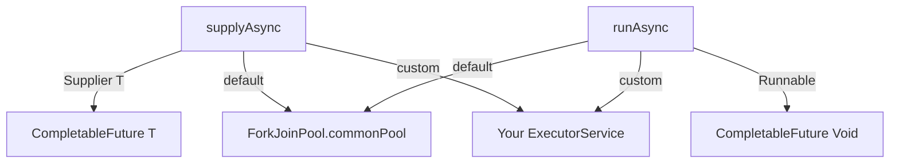
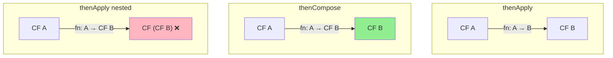
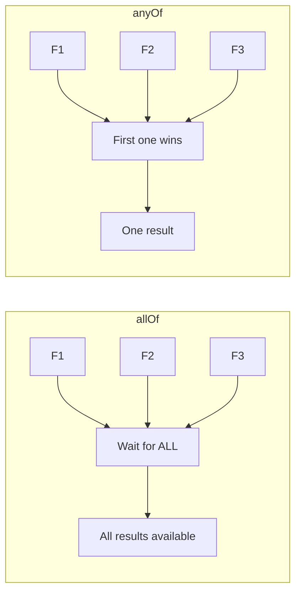
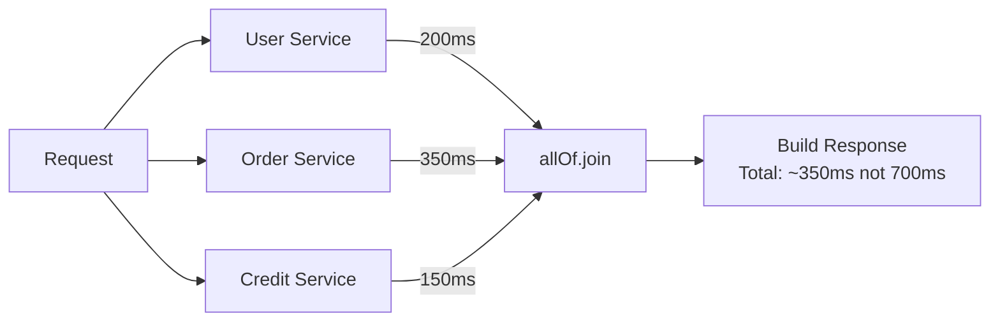
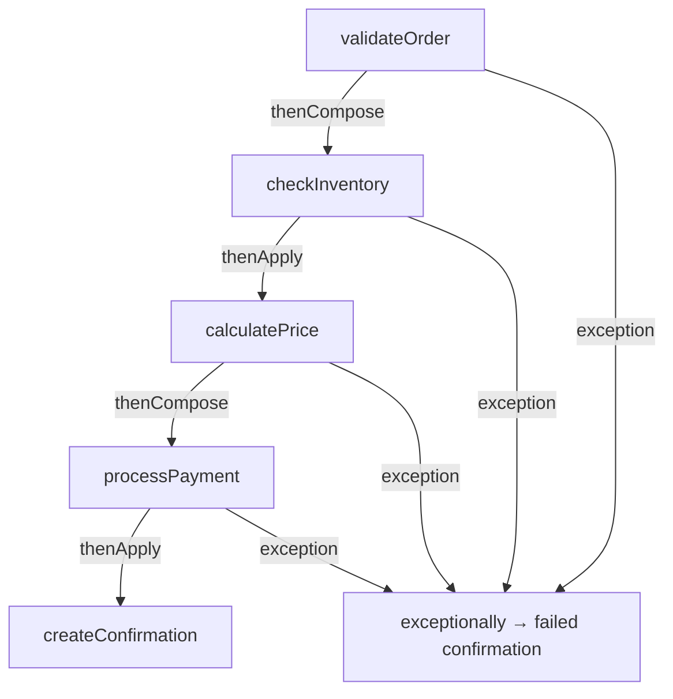

# CompletableFuture — Deep Dive into Async Java

`CompletableFuture` (Java 8+) is Java's answer to modern async programming. It fixes every limitation of `Future` — chaining, combining, error handling, manual completion, and non-blocking callbacks.

This is one of the **most important topics for Java backend interviews**.

---

# 1. What is CompletableFuture?

```java
public class CompletableFuture<T>
    implements Future<T>, CompletionStage<T>
```

It implements two interfaces:
- `Future<T>` — you can still call `get()`
- `CompletionStage<T>` — the chaining/composition API

Think of it as a **Future you can chain operations on** and **complete manually**.

```text
┌─────────────────────────────────────────────┐
│              Future<T>                      │
│  • get()                                    │
│  • isDone()                                 │
│  • cancel()                                 │
├─────────────────────────────────────────────┤
│         CompletionStage<T>                  │
│  • thenApply()                              │
│  • thenAccept()                             │
│  • thenCompose()                            │
│  • thenCombine()                            │
│  • exceptionally()                          │
│  • handle()                                 │
│  • ...40+ methods                           │
├─────────────────────────────────────────────┤
│         CompletableFuture<T>                │
│  • complete()                               │
│  • completeExceptionally()                  │
│  • supplyAsync()                            │
│  • runAsync()                               │
└─────────────────────────────────────────────┘
```

---

# 2. Creating CompletableFutures

## 2.1 `supplyAsync()` — returns a value

```java
CompletableFuture<String> future =
    CompletableFuture.supplyAsync(() -> {
        // runs on ForkJoinPool.commonPool()
        return "Hello";
    });
```

## 2.2 `runAsync()` — no return value

```java
CompletableFuture<Void> future =
    CompletableFuture.runAsync(() -> {
        System.out.println("Fire and forget");
    });
```

## 2.3 With a custom executor

```java
ExecutorService executor =
    Executors.newFixedThreadPool(4);

CompletableFuture<String> future =
    CompletableFuture.supplyAsync(
        () -> "Hello",
        executor
    );
```

> **Important:** By default, `supplyAsync` and `runAsync` use `ForkJoinPool.commonPool()`. In production, always provide a custom executor.



---

# 3. Manual Completion

Unlike `Future`, you can **manually complete** a `CompletableFuture`.

```java
CompletableFuture<String> future =
    new CompletableFuture<>();

// Somewhere else, perhaps in another thread:
future.complete("Result!");

// Or complete with an error:
future.completeExceptionally(
    new RuntimeException("Failed")
);
```

This is extremely useful for adapting callback-based APIs to `CompletableFuture`.

```text
CompletableFuture<String> future = new CompletableFuture<>();

Thread A:                     Thread B:
    │                              │
    ├── future.get()               │
    │   (WAITING)                  │
    │                              ├── future.complete("Done")
    │                              │
    │◄──── "Done" ─────────────────┤
    │
```

---

# 4. The Chaining API — `thenApply`, `thenAccept`, `thenRun`

This is where `CompletableFuture` shines over `Future`.

## 4.1 `thenApply()` — transform the result

Like `map()` in streams.

```java
CompletableFuture<String> future =
    CompletableFuture.supplyAsync(() -> "hello")
        .thenApply(s -> s.toUpperCase())
        .thenApply(s -> s + " WORLD");

System.out.println(future.get()); // HELLO WORLD
```

```text
supplyAsync("hello")
        │
        ▼
thenApply(toUpperCase)  →  "HELLO"
        │
        ▼
thenApply(+ " WORLD")  →  "HELLO WORLD"
```

## 4.2 `thenAccept()` — consume the result (no return)

```java
CompletableFuture.supplyAsync(() -> "hello")
    .thenAccept(s -> System.out.println(s));
```

Returns `CompletableFuture<Void>`.

## 4.3 `thenRun()` — run something after completion (ignores result)

```java
CompletableFuture.supplyAsync(() -> "hello")
    .thenRun(() -> System.out.println("Done!"));
```

### Summary Table

| Method | Input | Output | Use When |
|---|---|---|---|
| `thenApply(fn)` | T → U | `CF<U>` | Transform the value |
| `thenAccept(consumer)` | T → void | `CF<Void>` | Consume the value |
| `thenRun(runnable)` | — | `CF<Void>` | Run side effect, ignore value |

---

# 5. `thenCompose()` — Flatmap for Futures

This is the **most important** chaining method, and the most confused with `thenApply`.

### The problem with `thenApply` for async chains

```java
CompletableFuture<CompletableFuture<String>> nested =
    CompletableFuture.supplyAsync(() -> getUserId())
        .thenApply(id -> fetchUserAsync(id));
        // Returns CF<CF<String>> — nested!
```

### Solution: `thenCompose`

```java
CompletableFuture<String> flat =
    CompletableFuture.supplyAsync(() -> getUserId())
        .thenCompose(id -> fetchUserAsync(id));
        // Returns CF<String> — flattened!
```

```text
thenApply:
    CF<A> → (A → B) → CF<B>

thenCompose:
    CF<A> → (A → CF<B>) → CF<B>

It's the difference between map() and flatMap() in Streams/Optional.
```



### When to use which?

- **`thenApply`**: when the transformation is **synchronous** (returns a plain value)
- **`thenCompose`**: when the transformation is **asynchronous** (returns another `CompletableFuture`)

---

# 6. Combining Multiple Futures

## 6.1 `thenCombine()` — combine two independent futures

```java
CompletableFuture<String> nameFuture =
    CompletableFuture.supplyAsync(() -> "Sundeep");

CompletableFuture<Integer> ageFuture =
    CompletableFuture.supplyAsync(() -> 25);

CompletableFuture<String> combined =
    nameFuture.thenCombine(ageFuture,
        (name, age) -> name + " is " + age
    );

System.out.println(combined.get());
// "Sundeep is 25"
```

```text
nameFuture ──────► "Sundeep" ──┐
                                ├──► "Sundeep is 25"
ageFuture  ──────► 25 ─────────┘
```

Both run concurrently. The combining function runs when **both** are done.

## 6.2 `allOf()` — wait for all

```java
CompletableFuture<String> f1 =
    CompletableFuture.supplyAsync(() -> "A");
CompletableFuture<String> f2 =
    CompletableFuture.supplyAsync(() -> "B");
CompletableFuture<String> f3 =
    CompletableFuture.supplyAsync(() -> "C");

CompletableFuture<Void> all =
    CompletableFuture.allOf(f1, f2, f3);

all.join(); // blocks until all three are done

// Now get individual results
String r1 = f1.get();
String r2 = f2.get();
String r3 = f3.get();
```

> **Note:** `allOf` returns `CompletableFuture<Void>`. You must get individual results from the original futures.

## 6.3 `anyOf()` — first one wins

```java
CompletableFuture<Object> fastest =
    CompletableFuture.anyOf(f1, f2, f3);

System.out.println(fastest.get());
// result of whichever finished first
```



---

# 7. Exception Handling

This is where `CompletableFuture` is vastly superior to `Future`.

## 7.1 `exceptionally()` — recover from errors

```java
CompletableFuture<String> future =
    CompletableFuture.supplyAsync(() -> {
        if (true) throw new RuntimeException("Boom");
        return "ok";
    })
    .exceptionally(ex -> {
        System.out.println("Error: " + ex.getMessage());
        return "default value";
    });

System.out.println(future.get()); // "default value"
```

```text
supplyAsync
    │
    ├── Success? → continue chain normally
    │
    └── Exception? → exceptionally() catches it
                        │
                        └── return fallback value
```

## 7.2 `handle()` — handle both success and error

```java
CompletableFuture<String> future =
    CompletableFuture.supplyAsync(() -> {
        return "ok";
    })
    .handle((result, ex) -> {
        if (ex != null) {
            return "fallback";
        }
        return result.toUpperCase();
    });
```

`handle()` always runs — whether the stage succeeded or failed.

## 7.3 `whenComplete()` — observe without changing result

```java
CompletableFuture<String> future =
    CompletableFuture.supplyAsync(() -> "hello")
    .whenComplete((result, ex) -> {
        if (ex != null) {
            log.error("Failed", ex);
        } else {
            log.info("Got: " + result);
        }
    });
```

Unlike `handle()`, `whenComplete()` does **not** transform the result.

### Comparison

| Method | Has result? | Has exception? | Can change result? |
|---|---|---|---|
| `exceptionally(fn)` | ✗ | ✓ | ✓ (on error only) |
| `handle(fn)` | ✓ | ✓ | ✓ |
| `whenComplete(fn)` | ✓ | ✓ | ✗ |

---

# 8. Async Variants — `thenApplyAsync`, `thenComposeAsync`, etc.

Every chaining method has three variants:

```java
// Runs on the SAME thread as the previous stage
future.thenApply(fn);

// Runs on ForkJoinPool.commonPool()
future.thenApplyAsync(fn);

// Runs on YOUR executor
future.thenApplyAsync(fn, executor);
```

```text
thenApply(fn)
    → same thread that completed the previous stage

thenApplyAsync(fn)
    → submitted to ForkJoinPool.commonPool()

thenApplyAsync(fn, executor)
    → submitted to your custom executor
```

> **Interview tip:** In production, prefer the async variant with a custom executor for CPU-bound work. The default `ForkJoinPool.commonPool()` is shared across the JVM.

---

# 9. `join()` vs `get()`

Both block until the result is available. The difference:

| `get()` | `join()` |
|---|---|
| Throws checked `ExecutionException`, `InterruptedException` | Throws unchecked `CompletionException` |
| Part of `Future` interface | Part of `CompletableFuture` |
| Must handle checked exceptions | Cleaner in lambdas/streams |

```java
// get() — need try/catch
try {
    String result = future.get();
} catch (ExecutionException | InterruptedException e) {
    // handle
}

// join() — cleaner
String result = future.join();
// throws CompletionException (unchecked) on failure
```

---

# 10. Real-World Pattern — Parallel API Calls

Suppose you need to call three microservices and combine results:

```java
CompletableFuture<User> userFuture =
    CompletableFuture.supplyAsync(
        () -> userService.getUser(userId), executor
    );

CompletableFuture<List<Order>> ordersFuture =
    CompletableFuture.supplyAsync(
        () -> orderService.getOrders(userId), executor
    );

CompletableFuture<CreditScore> creditFuture =
    CompletableFuture.supplyAsync(
        () -> creditService.getScore(userId), executor
    );

// Wait for all three
CompletableFuture.allOf(
    userFuture, ordersFuture, creditFuture
).join();

// Build response
UserProfile profile = new UserProfile(
    userFuture.join(),
    ordersFuture.join(),
    creditFuture.join()
);
```



Without `CompletableFuture`, these calls would be sequential: 200 + 350 + 150 = 700ms.
With `CompletableFuture`, they run in parallel: max(200, 350, 150) = 350ms.

---

# 11. Real-World Pattern — Timeout with Fallback

Java 9 added `orTimeout()` and `completeOnTimeout()`:

```java
CompletableFuture<String> future =
    CompletableFuture.supplyAsync(() -> {
        // slow API call
        return slowService.call();
    })
    .orTimeout(3, TimeUnit.SECONDS);
    // throws TimeoutException if not done in 3s
```

Or with a fallback:

```java
CompletableFuture<String> future =
    CompletableFuture.supplyAsync(() -> {
        return slowService.call();
    })
    .completeOnTimeout("default", 3, TimeUnit.SECONDS);
    // returns "default" if not done in 3s
```

---

# 12. Real-World Pattern — Retry Logic

```java
public CompletableFuture<String> callWithRetry(
        Supplier<String> task, int maxRetries) {

    CompletableFuture<String> future =
        CompletableFuture.supplyAsync(task);

    for (int i = 0; i < maxRetries; i++) {
        future = future.exceptionallyAsync(
            ex -> task.get()
        );
    }

    return future;
}
```

---

# 13. The Complete Pipeline — Putting It All Together

```java
CompletableFuture<OrderConfirmation> pipeline =
    CompletableFuture
        .supplyAsync(() -> validateOrder(order), executor)
        .thenCompose(valid -> checkInventoryAsync(valid))
        .thenApply(inv -> calculatePrice(inv))
        .thenCompose(priced -> processPaymentAsync(priced))
        .thenApply(paid -> createConfirmation(paid))
        .exceptionally(ex -> {
            log.error("Order failed", ex);
            return OrderConfirmation.failed(ex.getMessage());
        });
```



---

# 14. Common Pitfalls

### Pitfall 1: Using common pool for blocking I/O

```java
// BAD — blocks ForkJoinPool threads
CompletableFuture.supplyAsync(() -> {
    return httpClient.get("https://api.example.com");
});
```

Use a dedicated I/O executor:

```java
ExecutorService ioExecutor =
    Executors.newFixedThreadPool(20);

CompletableFuture.supplyAsync(() -> {
    return httpClient.get("https://api.example.com");
}, ioExecutor);
```

### Pitfall 2: Swallowing exceptions

```java
// BAD — exception is silently lost
CompletableFuture.supplyAsync(() -> {
    throw new RuntimeException("oops");
});
// No one ever calls get()/join() or adds exceptionally()
```

Always handle errors or propagate them.

### Pitfall 3: Forgetting that `thenApply` != `thenCompose`

If your function returns a `CompletableFuture`, use `thenCompose`. Otherwise you get `CF<CF<T>>`.

---

# 15. CompletableFuture Method Cheat Sheet

```text
CREATION:
  supplyAsync(supplier)        → CF<T>
  runAsync(runnable)           → CF<Void>
  completedFuture(value)       → CF<T> already done

TRANSFORM:
  thenApply(T → U)             → CF<U>
  thenCompose(T → CF<U>)       → CF<U>   (flatMap)

CONSUME:
  thenAccept(T → void)         → CF<Void>
  thenRun(Runnable)            → CF<Void>

COMBINE:
  thenCombine(CF<U>, BiFunction) → CF<V>
  allOf(CF...)                 → CF<Void>
  anyOf(CF...)                 → CF<Object>

ERRORS:
  exceptionally(ex → T)        → CF<T>
  handle((T, ex) → U)          → CF<U>
  whenComplete((T, ex) → void) → CF<T>

TIMEOUT (Java 9+):
  orTimeout(duration)          → CF<T>
  completeOnTimeout(val, dur)  → CF<T>

BLOCKING:
  get()                        → T (checked exceptions)
  join()                       → T (unchecked exceptions)
```

---

# 16. Interview Quick Reference

| Question | Answer |
|---|---|
| `Future` vs `CompletableFuture` | CF adds chaining, combining, manual completion, error recovery |
| `thenApply` vs `thenCompose` | `thenApply` = map, `thenCompose` = flatMap |
| Default thread pool | `ForkJoinPool.commonPool()` — avoid for I/O |
| `get()` vs `join()` | `get()` throws checked; `join()` throws unchecked |
| How to combine two futures? | `thenCombine()` |
| How to wait for all? | `allOf()` then `join()` each |
| How to handle errors? | `exceptionally()`, `handle()`, `whenComplete()` |
| Can you complete manually? | Yes — `complete()` / `completeExceptionally()` |

---

# 17. What's Next?

`CompletableFuture` by default runs on `ForkJoinPool.commonPool()`. But what IS the ForkJoin framework, and why does it exist?

```text
ThreadBasics/
        ↓
Callable-Future/
        ↓
CompletableFuture/ (you are here)
        ↓
ForkJoinPool/ → divide-and-conquer, work stealing, RecursiveTask
```
