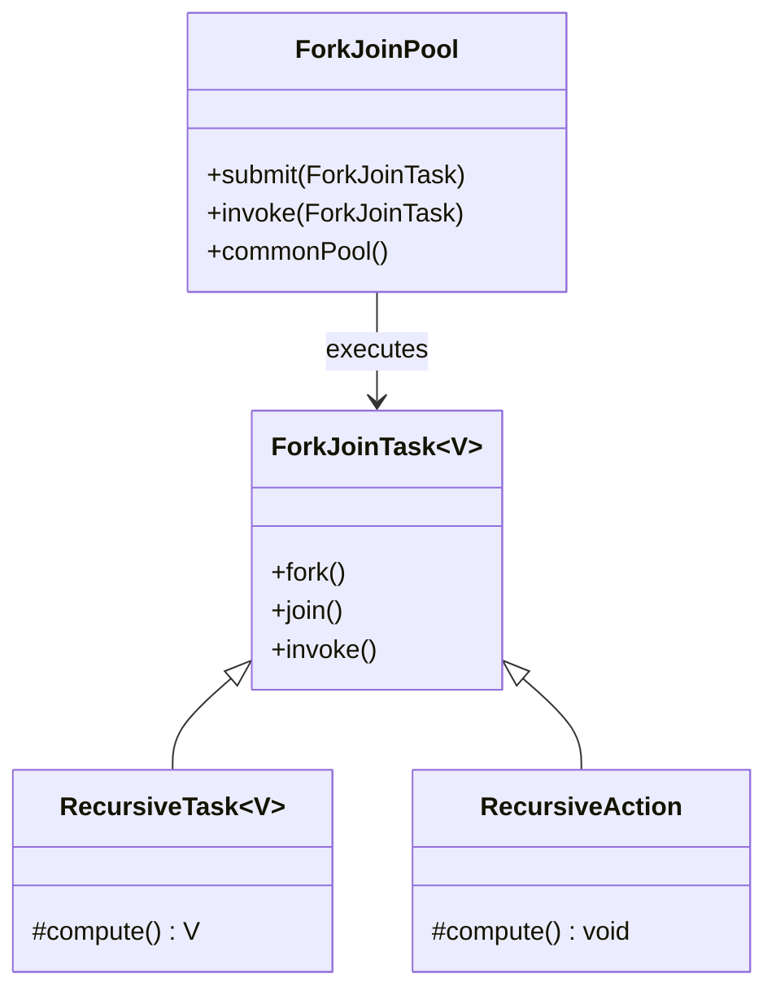
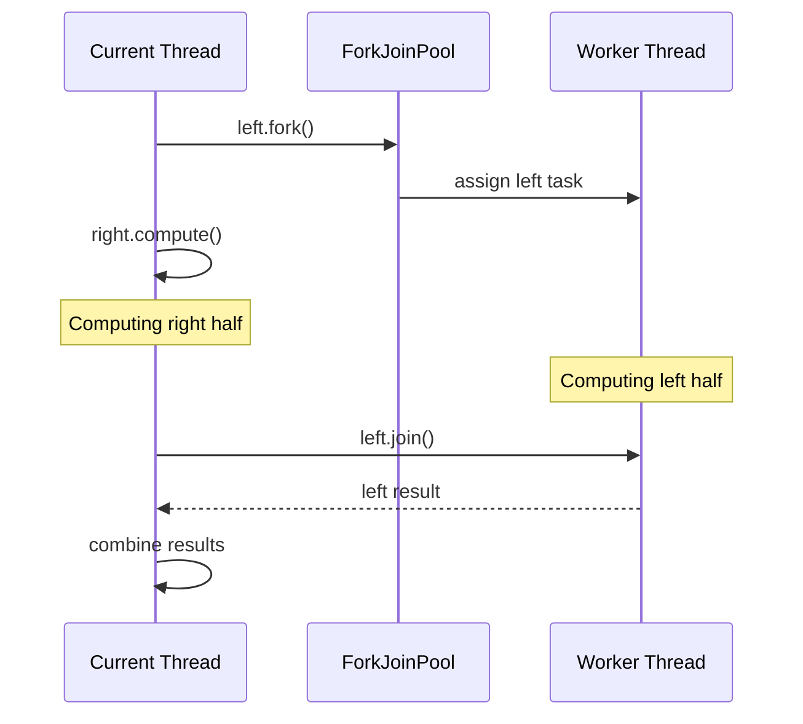
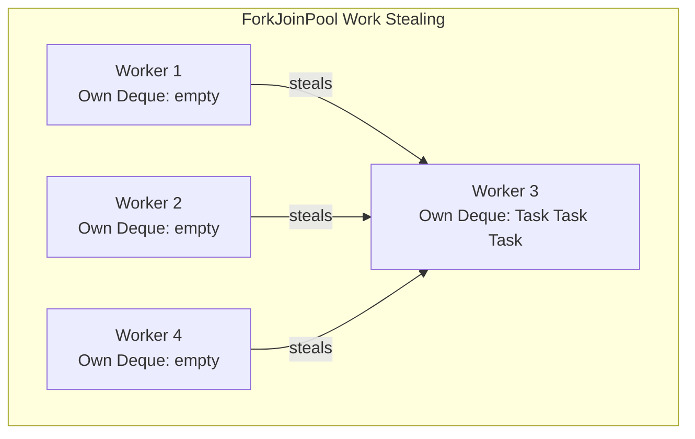
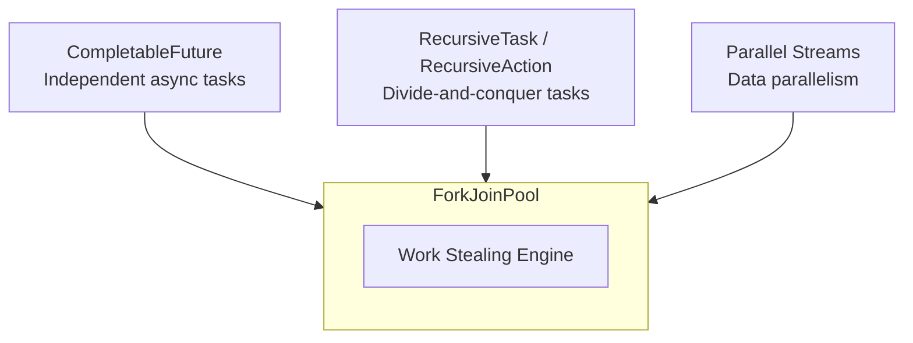

# Fork/Join Framework — Divide and Conquer Parallelism

The Fork/Join framework (Java 7+) is designed for **recursive, divide-and-conquer parallelism**. It splits a large task into smaller subtasks, processes them in parallel, and combines the results.

This is the same pool that `CompletableFuture.supplyAsync()` uses by default.

---

# 1. The Core Idea

Take a big problem → split it → solve pieces in parallel → combine results.

```text
                    Big Task
                   /        \
              SubTask A    SubTask B
              /     \       /     \
           SA1     SA2    SB1    SB2
            │       │      │      │
            ▼       ▼      ▼      ▼
          result  result  result  result
            │       │      │      │
            └───┬───┘      └──┬───┘
                │              │
            combine        combine
                │              │
                └──────┬───────┘
                       │
                   Final Result
```

Classic examples:
- Merge sort
- Parallel sum of a large array
- Image processing
- Recursive file search

---

# 2. Key Components



| Class | Purpose |
|---|---|
| `ForkJoinPool` | The thread pool optimized for fork/join tasks |
| `ForkJoinTask<V>` | Base class for tasks that run in a `ForkJoinPool` |
| `RecursiveTask<V>` | A `ForkJoinTask` that **returns a result** |
| `RecursiveAction` | A `ForkJoinTask` that **returns nothing** (`void`) |

---

# 3. `RecursiveTask` — When You Need a Result

### Example: Parallel Sum of an Array

```java
public class ParallelSum extends RecursiveTask<Long> {

    private final int[] array;
    private final int start;
    private final int end;
    private static final int THRESHOLD = 1000;

    public ParallelSum(int[] array, int start, int end) {
        this.array = array;
        this.start = start;
        this.end = end;
    }

    @Override
    protected Long compute() {

        // Base case: small enough to compute directly
        if (end - start <= THRESHOLD) {
            long sum = 0;
            for (int i = start; i < end; i++) {
                sum += array[i];
            }
            return sum;
        }

        // Recursive case: split in half
        int mid = (start + end) / 2;

        ParallelSum left =
            new ParallelSum(array, start, mid);
        ParallelSum right =
            new ParallelSum(array, mid, end);

        // Fork the left task (runs async)
        left.fork();

        // Compute the right task in current thread
        long rightResult = right.compute();

        // Join the left task (wait for result)
        long leftResult = left.join();

        return leftResult + rightResult;
    }
}
```

Usage:

```java
int[] array = new int[1_000_000];
Arrays.fill(array, 1);

ForkJoinPool pool = new ForkJoinPool();

Long result = pool.invoke(
    new ParallelSum(array, 0, array.length)
);

System.out.println(result); // 1000000
```

### Execution Flow

```text
ParallelSum(0, 1000000)
        │
        ├── fork: ParallelSum(0, 500000)
        │           ├── fork: ParallelSum(0, 250000)
        │           │           ├── ...
        │           │           └── ...
        │           └── compute: ParallelSum(250000, 500000)
        │                       ├── ...
        │                       └── ...
        │
        └── compute: ParallelSum(500000, 1000000)
                    ├── fork: ParallelSum(500000, 750000)
                    └── compute: ParallelSum(750000, 1000000)
```

---

# 4. `RecursiveAction` — When You Don't Need a Result

### Example: Parallel Array Increment

```java
public class ParallelIncrement extends RecursiveAction {

    private final int[] array;
    private final int start;
    private final int end;
    private static final int THRESHOLD = 1000;

    public ParallelIncrement(
            int[] array, int start, int end) {
        this.array = array;
        this.start = start;
        this.end = end;
    }

    @Override
    protected void compute() {

        if (end - start <= THRESHOLD) {
            for (int i = start; i < end; i++) {
                array[i]++;
            }
            return;
        }

        int mid = (start + end) / 2;

        ParallelIncrement left =
            new ParallelIncrement(array, start, mid);
        ParallelIncrement right =
            new ParallelIncrement(array, mid, end);

        invokeAll(left, right);
    }
}
```

`invokeAll()` forks all tasks and waits for all of them to complete.

---

# 5. `fork()` and `join()` — The Core Operations

```java
left.fork();           // submit left task to the pool (async)
long rightResult = right.compute();  // compute right in current thread
long leftResult = left.join();       // wait for left to finish
```



### Why compute one side and fork the other?

This is a crucial optimization:

```java
// GOOD — one fork, one compute
left.fork();
long rightResult = right.compute();  // reuse current thread
long leftResult = left.join();

// BAD — two forks (wastes current thread)
left.fork();
right.fork();
long leftResult = left.join();
long rightResult = right.join();
// Current thread sits idle while waiting!
```

---

# 6. Work Stealing — Why ForkJoinPool is Special

`ForkJoinPool` is fundamentally different from a normal `ExecutorService` because of **work stealing**.

### Normal ThreadPool

```text
Thread-1: [Task] [Task] [Task] [idle]
Thread-2: [Task] [Task] [idle]  [idle]
Thread-3: [Task] [Task] [Task] [Task] [Task] [Task]
Thread-4: [idle]  [idle]  [idle]  [idle]

Thread-3 is overloaded, Thread-4 is idle.
No rebalancing.
```

### ForkJoinPool with Work Stealing

```text
Thread-1: [Task] [Task] ←── steals from Thread-3
Thread-2: [Task] [Task] ←── steals from Thread-3
Thread-3: [Task] [Task] [Task]
Thread-4: [Task] ←── steals from Thread-3

All threads stay busy!
```



### How it works internally

Each worker thread has a **double-ended queue (deque)**:

```text
Worker Thread's Deque:

    push/pop (LIFO)
         │
         ▼
┌───┬───┬───┬───┬───┐
│ T5│ T4│ T3│ T2│ T1│
└───┴───┴───┴───┴───┘
                  ▲
                  │
            steal (FIFO)
         (other workers steal from this end)
```

- The **owning thread** pushes and pops from the **top** (LIFO — most recent task)
- **Stealing threads** take from the **bottom** (FIFO — oldest/largest task)

This is efficient because:
1. The owner works on the smallest, most local subtasks (cache-friendly)
2. Stealers take the largest tasks (more work per steal)

---

# 7. `ForkJoinPool.commonPool()`

Java 8 introduced a JVM-wide shared `ForkJoinPool`:

```java
ForkJoinPool common = ForkJoinPool.commonPool();
```

- Parallelism = number of available processors - 1
- Used by `CompletableFuture.supplyAsync()` and parallel streams
- **Shared across the entire JVM**

```text
CompletableFuture.supplyAsync(() -> ...)
        │
        ▼
ForkJoinPool.commonPool()  ← shared!
        │
        ▼
┌─────────────────────────────────┐
│ Also used by:                   │
│   • Parallel Streams            │
│   • CompletableFuture defaults  │
│   • Your code if you use it     │
└─────────────────────────────────┘
```

> **Warning:** If you block threads in the common pool (e.g., with I/O), you starve the entire JVM's parallelism. Always use a custom pool for blocking work.

### Custom ForkJoinPool

```java
ForkJoinPool customPool =
    new ForkJoinPool(8); // 8 threads

customPool.submit(() -> {
    // your parallel work
});
```

---

# 8. ForkJoinPool vs ExecutorService

| Feature | ExecutorService | ForkJoinPool |
|---|---|---|
| Task model | Independent tasks | Recursive, splitting tasks |
| Queue | Single shared queue | Per-thread deques |
| Load balancing | None | Work stealing |
| Best for | I/O-bound, independent tasks | CPU-bound, divide-and-conquer |
| Thread count | You decide | Typically = CPU cores |

```text
ExecutorService:
    [Shared Queue] → Thread-1, Thread-2, Thread-3

ForkJoinPool:
    Thread-1: [own deque] ←─ steal ──→ [Thread-2's deque]
    Thread-2: [own deque] ←─ steal ──→ [Thread-3's deque]
    Thread-3: [own deque] ←─ steal ──→ [Thread-1's deque]
```

---

# 9. Parallel Streams — Fork/Join Under the Hood

When you use `.parallelStream()`, you're using `ForkJoinPool.commonPool()`:

```java
long sum = IntStream.rangeClosed(1, 1_000_000)
    .parallel()
    .sum();
```

Internally this is a fork/join operation:

```text
parallelStream().sum()
        │
        ▼
ForkJoinPool.commonPool()
        │
        ├── Worker-1: sum(1..250000)
        ├── Worker-2: sum(250001..500000)
        ├── Worker-3: sum(500001..750000)
        └── Worker-4: sum(750001..1000000)
                │
                ▼
            combine all
```

### Running parallel stream on a custom pool

```java
ForkJoinPool customPool = new ForkJoinPool(4);

long sum = customPool.submit(() ->
    IntStream.rangeClosed(1, 1_000_000)
        .parallel()
        .sum()
).get();
```

---

# 10. The THRESHOLD — When to Stop Splitting

The `THRESHOLD` is critical for performance:

```java
private static final int THRESHOLD = 1000;

if (end - start <= THRESHOLD) {
    // compute directly (base case)
} else {
    // split further
}
```

- **Too small** → too many tiny tasks → overhead of forking/joining dominates
- **Too large** → not enough parallelism → some threads sit idle
- **Right size** → enough tasks to keep all threads busy, but not so many that overhead matters

```text
THRESHOLD too small:
    [1] [1] [1] [1] [1] [1] [1] [1] ...
    Thousands of tasks, each trivial.
    Fork/join overhead > actual work.

THRESHOLD too large:
    [500000] [500000]
    Only 2 tasks for 8 cores.
    6 cores idle.

THRESHOLD just right:
    [1000] [1000] [1000] ... [1000]
    1000 tasks, each meaningful.
    All cores busy, low overhead.
```

Rule of thumb: **THRESHOLD ≈ N / (parallelism × 4)** where N is the total problem size.

---

# 11. Complete Example — Parallel Merge Sort

```java
public class ParallelMergeSort
        extends RecursiveAction {

    private final int[] array;
    private final int start;
    private final int end;
    private static final int THRESHOLD = 1024;

    public ParallelMergeSort(
            int[] array, int start, int end) {
        this.array = array;
        this.start = start;
        this.end = end;
    }

    @Override
    protected void compute() {

        if (end - start <= THRESHOLD) {
            Arrays.sort(array, start, end);
            return;
        }

        int mid = (start + end) / 2;

        ParallelMergeSort left =
            new ParallelMergeSort(array, start, mid);
        ParallelMergeSort right =
            new ParallelMergeSort(array, mid, end);

        // Fork left, compute right in current thread
        left.fork();
        right.compute();
        left.join();

        // Merge the two sorted halves
        merge(array, start, mid, end);
    }

    private void merge(
            int[] arr, int start, int mid, int end) {

        int[] temp = Arrays.copyOfRange(arr, start, mid);
        int i = 0, j = mid, k = start;

        while (i < temp.length && j < end) {
            if (temp[i] <= arr[j]) {
                arr[k++] = temp[i++];
            } else {
                arr[k++] = arr[j++];
            }
        }

        while (i < temp.length) {
            arr[k++] = temp[i++];
        }
    }
}
```

Usage:

```java
int[] data = new int[10_000_000];
// fill with random data

ForkJoinPool pool = new ForkJoinPool();
pool.invoke(
    new ParallelMergeSort(data, 0, data.length)
);
// data is now sorted
```

---

# 12. `ManagedBlocker` — Handling Blocking Inside ForkJoinPool

If you must do blocking I/O inside a `ForkJoinPool`, use `ManagedBlocker` to tell the pool it should compensate:

```java
ForkJoinPool.managedBlock(new ManagedBlocker() {

    @Override
    public boolean block() throws InterruptedException {
        // perform blocking operation
        result = blockingCall();
        return true;
    }

    @Override
    public boolean isReleasable() {
        return result != null;
    }
});
```

The pool may create a **compensation thread** to maintain parallelism while the current thread is blocked.

---

# 13. How Fork/Join Connects to CompletableFuture

```text
CompletableFuture.supplyAsync(() -> work())
        │
        ▼
ForkJoinPool.commonPool()
        │
        ▼
Uses work stealing under the hood

But it does NOT use RecursiveTask/RecursiveAction.
It submits simple tasks to the pool.
```

Key difference:
- **CompletableFuture** → independent async tasks, chaining, composition
- **Fork/Join tasks** → recursive, divide-and-conquer, where tasks spawn subtasks

Both can run on a `ForkJoinPool`, but they serve different purposes.



---

# 14. Common Pitfalls

### Pitfall 1: Forking both sides

```java
// BAD
left.fork();
right.fork();    // wastes current thread!
left.join();
right.join();

// GOOD
left.fork();
right.compute(); // reuse current thread
left.join();
```

### Pitfall 2: Joining before computing

```java
// BAD — sequential execution!
left.fork();
left.join();     // blocks before doing right
right.compute();
```

### Pitfall 3: Blocking I/O in ForkJoinPool

```java
// BAD — starves the pool
protected Long compute() {
    String data = httpClient.get(url); // BLOCKS
    return parse(data);
}
```

Use a normal `ExecutorService` for I/O-bound work.

### Pitfall 4: Threshold too small

```java
// BAD
if (end - start <= 1) { // threshold of 1!
    return array[start];
}
```

The overhead of creating tasks and forking will destroy performance.

---

# 15. Interview Quick Reference

| Question | Answer |
|---|---|
| What is Fork/Join? | Divide-and-conquer parallelism framework (Java 7+) |
| `RecursiveTask` vs `RecursiveAction` | `RecursiveTask` returns a value; `RecursiveAction` doesn't |
| What is work stealing? | Idle threads steal tasks from busy threads' deques |
| `fork()` vs `compute()` | `fork()` submits async; `compute()` runs in current thread |
| Why fork one, compute other? | Avoids wasting the current thread |
| What is `commonPool()`? | JVM-wide shared `ForkJoinPool`, used by CF and parallel streams |
| Blocking in ForkJoinPool? | Bad — use `ManagedBlocker` or a separate executor |
| Threshold too small? | Task creation overhead dominates actual work |

---

# 16. Complete Concurrency Learning Path

```text
ThreadBasics/        → creating threads, lifecycle, executors
        ↓
Callable-Future/     → returning results, Future limitations
        ↓
CompletableFuture/   → async chaining, composition, error handling
        ↓
ForkJoinPool/        → divide-and-conquer, work stealing (you are here)
        ↓
ThreadLocal/         → per-thread storage (already covered)
        ↓
ConcurrentCollections/ → thread-safe data structures (separate folder)
```
