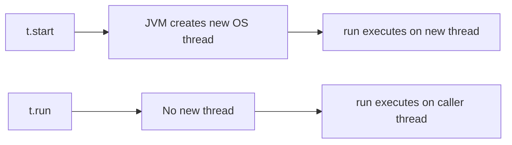
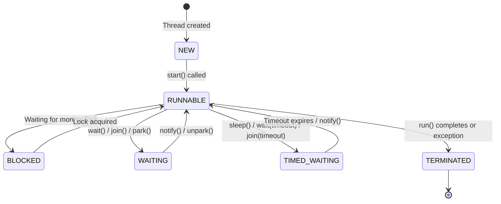
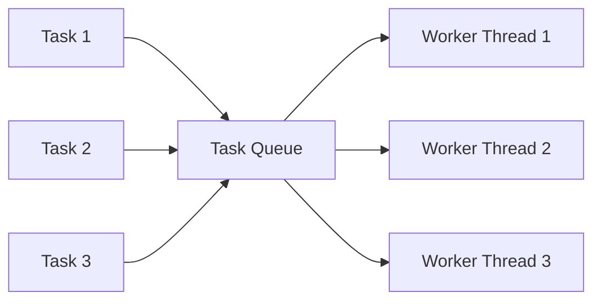

# Thread Basics — Threads, Runnable, and the Thread Lifecycle

This is the starting point for Java concurrency. Before touching `Future`, `CompletableFuture`, or `ForkJoinPool`, you need to understand how threads are created, managed, and how they transition between states.

---

# 1. What is a Thread?

A thread is the **smallest unit of execution** within a process.

Every Java application starts with one thread — the **main thread**.

```java
public class Main {
    public static void main(String[] args) {
        System.out.println(
            Thread.currentThread().getName()
        );
    }
}
```

Output:

```text
main
```

A process can have multiple threads running concurrently, sharing the same heap memory but each having its own **stack**.

```text
┌──────────────────────────────────────────┐
│                 JVM Process              │
│                                          │
│  ┌────────────── HEAP ──────────────┐    │
│  │   Objects shared across threads  │    │
│  └──────────────────────────────────┘    │
│                                          │
│  ┌─────────┐  ┌─────────┐  ┌─────────┐  │
│  │ Thread-1│  │ Thread-2│  │ Thread-3│  │
│  │  Stack  │  │  Stack  │  │  Stack  │  │
│  │  PC     │  │  PC     │  │  PC     │  │
│  └─────────┘  └─────────┘  └─────────┘  │
└──────────────────────────────────────────┘
```

---

# 2. Creating Threads — Two Classic Ways

## Way 1: Extending `Thread`

```java
class MyThread extends Thread {

    @Override
    public void run() {
        System.out.println(
            "Running in: " + getName()
        );
    }
}
```

Usage:

```java
MyThread t = new MyThread();
t.start();
```

## Way 2: Implementing `Runnable`

```java
class MyTask implements Runnable {

    @Override
    public void run() {
        System.out.println(
            "Running in: "
            + Thread.currentThread().getName()
        );
    }
}
```

Usage:

```java
Thread t = new Thread(new MyTask());
t.start();
```

Or with a lambda (Java 8+):

```java
Thread t = new Thread(() -> {
    System.out.println("Hello from thread");
});
t.start();
```

---

# 3. `start()` vs `run()` — Critical Interview Point

This is one of the most asked questions.

```java
Thread t = new Thread(() -> {
    System.out.println(
        Thread.currentThread().getName()
    );
});
```

### Calling `start()`

```java
t.start();
```

```text
Thread-0
```

A **new OS thread** is created. The `run()` method executes on that new thread.

### Calling `run()` directly

```java
t.run();
```

```text
main
```

**No new thread is created.** The `run()` method executes on the calling thread (main).



---

# 4. Thread Lifecycle — The 6 States

Every Java thread exists in one of these states (defined in `Thread.State` enum):



### State breakdown

| State | Meaning |
|---|---|
| `NEW` | Thread object created, `start()` not yet called |
| `RUNNABLE` | Eligible to run (may be actually running or waiting for CPU) |
| `BLOCKED` | Waiting to acquire a monitor lock (synchronized block) |
| `WAITING` | Waiting indefinitely for another thread's action |
| `TIMED_WAITING` | Waiting with a timeout |
| `TERMINATED` | `run()` has completed (normally or via exception) |

### Checking state

```java
Thread t = new Thread(() -> {});
System.out.println(t.getState()); // NEW

t.start();
// Could be RUNNABLE or TERMINATED depending on timing
```

---

# 5. `Thread.sleep()` — Pausing a Thread

```java
Thread.sleep(2000); // sleeps for 2 seconds
```

The thread moves to `TIMED_WAITING` state.

Important points:
- `sleep()` does **not release** any locks the thread holds
- It can be interrupted via `thread.interrupt()`
- Always handle `InterruptedException`

```java
try {
    Thread.sleep(1000);
} catch (InterruptedException e) {
    Thread.currentThread().interrupt();
}
```

---

# 6. `join()` — Waiting for Another Thread to Finish

```java
Thread t = new Thread(() -> {
    // long computation
});

t.start();
t.join(); // main thread waits here until t finishes

System.out.println("t is done");
```

```text
Main Thread            Thread t
    │                      │
    ├── t.start() ────────►│
    │                      │ (doing work)
    │                      │
    ├── t.join()           │
    │   (WAITING)          │
    │                      │
    │◄──── t finishes ─────┤
    │                      │
    ├── continues          
    │
```

You can also join with a timeout:

```java
t.join(5000); // wait at most 5 seconds
```

---

# 7. Daemon Threads

There are two types of threads:

- **User threads** — JVM waits for all user threads to finish before shutting down
- **Daemon threads** — JVM does NOT wait for daemon threads; they are killed when all user threads finish

```java
Thread t = new Thread(() -> {
    while (true) {
        // background task
    }
});

t.setDaemon(true); // must be set BEFORE start()
t.start();
```

```text
┌─────────────────────────┐
│  main thread finishes   │
│           ↓             │
│  All user threads done  │
│           ↓             │
│  JVM shuts down         │
│           ↓             │
│  Daemon threads killed  │
└─────────────────────────┘
```

Use cases:
- Garbage collector is a daemon thread
- Background logging
- Heartbeat/monitoring

---

# 8. Thread vs Runnable — Which to Use?

### Extending Thread

```java
class MyThread extends Thread {
    public void run() { }
}
```

Problems:
- Java has **single inheritance** — you can't extend another class
- Tightly couples task with thread mechanics

### Implementing Runnable

```java
class MyTask implements Runnable {
    public void run() { }
}
```

Benefits:
- Can extend another class
- Separates the **task** from the **execution mechanism**
- Can be submitted to an `ExecutorService` (thread pool)

> **Rule of thumb:** Always prefer `Runnable` (or `Callable`) over extending `Thread`.

---

# 9. The Problem with Raw Threads

Creating threads directly has serious issues in production:

```java
// DON'T do this in production
for (int i = 0; i < 10000; i++) {
    new Thread(() -> {
        // handle request
    }).start();
}
```

Problems:

| Problem | Why |
|---|---|
| Thread creation is expensive | Each thread needs ~1MB stack, OS-level resources |
| No limit on concurrency | Can exhaust system resources |
| No task queueing | If all threads are busy, new tasks are lost |
| No reuse | Thread dies after `run()` completes |

This is why **thread pools** (`ExecutorService`) exist.

```text
Raw Threads:
    Task → new Thread → dies after run()
    Task → new Thread → dies after run()
    Task → new Thread → dies after run()

Thread Pool:
    Task ─┐
    Task ─┼──► [Queue] ──► [Worker-1] [Worker-2] [Worker-3]
    Task ─┘                  (reused)   (reused)   (reused)
```

---

# 10. `ExecutorService` — Thread Pool Basics

```java
ExecutorService executor =
    Executors.newFixedThreadPool(3);

executor.submit(() -> {
    System.out.println("Task 1");
});

executor.submit(() -> {
    System.out.println("Task 2");
});

executor.shutdown();
```



Common pool types:

| Factory Method | Behavior |
|---|---|
| `newFixedThreadPool(n)` | Exactly n threads, unbounded queue |
| `newCachedThreadPool()` | Creates threads on demand, reuses idle ones |
| `newSingleThreadExecutor()` | One thread, tasks execute sequentially |
| `newScheduledThreadPool(n)` | For scheduled/periodic tasks |

---

# 11. `shutdown()` vs `shutdownNow()`

```java
executor.shutdown();
// No new tasks accepted
// Existing tasks finish normally

executor.shutdownNow();
// Attempts to stop running tasks
// Returns list of tasks that never started
```

Always call `shutdown()`:

```java
ExecutorService executor =
    Executors.newFixedThreadPool(4);

try {
    // submit tasks
} finally {
    executor.shutdown();
}
```

---

# 12. Interview Quick Reference

| Question | Answer |
|---|---|
| `start()` vs `run()` | `start()` creates new thread; `run()` runs on caller thread |
| Thread states | NEW → RUNNABLE → BLOCKED/WAITING/TIMED_WAITING → TERMINATED |
| `sleep()` releases lock? | No |
| `join()` purpose | Wait for another thread to finish |
| Daemon thread | Killed when all user threads finish |
| `Thread` vs `Runnable` | Prefer `Runnable` — separates task from thread |
| Raw threads in production? | No — use `ExecutorService` for pooling |

---

# 13. What's Next?

Now that you understand threads and thread pools, the next question is:

> "How do I get a **result** back from a thread?"

`Runnable.run()` returns `void`. You can't get a return value.

This leads directly to:

```text
ThreadBasics (you are here)
        ↓
Callable-Future/  → returning results from threads
        ↓
CompletableFuture/ → async chaining, non-blocking composition
        ↓
ForkJoinPool/ → divide-and-conquer parallelism
```
