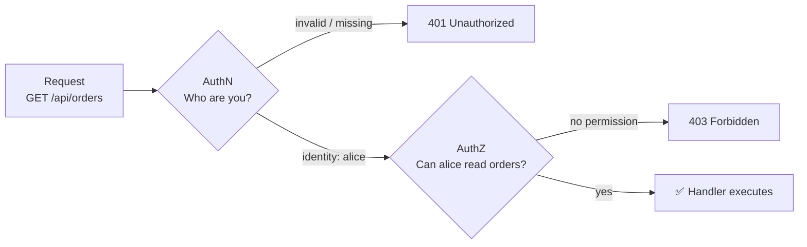
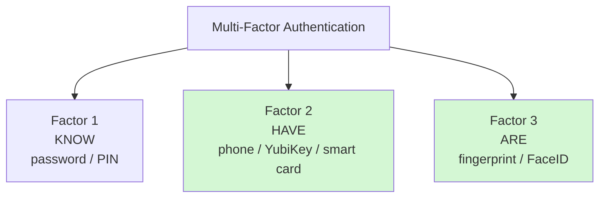
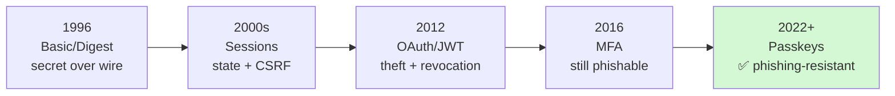
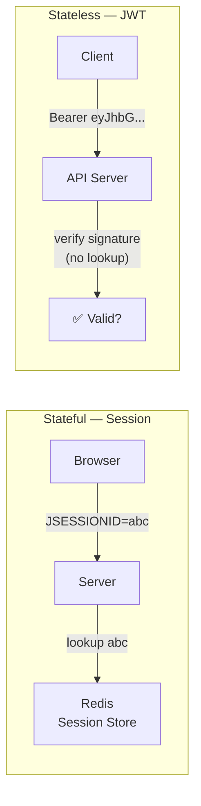

# Authentication — History & Fundamentals

What "authentication" actually means, the three factors, and the full story
of how we got from `Authorization: Basic dXNlcjpwYXNz` to passkeys.

---

## 1. Authentication vs Authorization — Never Confuse These

```text
AUTHENTICATION (AuthN) — "Who are you?"
  Proving your identity to the system.
  → username + password, fingerprint, passkey, certificate

AUTHORIZATION (AuthZ) — "What are you allowed to do?"
  Deciding what an ALREADY-AUTHENTICATED identity may access.
  → roles, permissions, scopes, policies (RBAC, ABAC)

REAL-WORLD ANALOGY:
  Airport security:
    Passport check  = AUTHENTICATION (you are who you claim)
    Boarding pass   = AUTHORIZATION (you may board flight UA123, seat 14A)

IN HTTP TERMS:
  401 Unauthorized → authentication failed / missing ("who are you?")
  403 Forbidden    → authenticated but not authorized ("I know you, but no")
```



---

## 2. The Three Authentication Factors

```text
SOMETHING YOU KNOW        SOMETHING YOU HAVE         SOMETHING YOU ARE
(knowledge factor)        (possession factor)        (inherence factor)
────────────────────      ──────────────────────     ─────────────────────
password                  phone (SMS/TOTP app)       fingerprint
PIN                       hardware key (YubiKey)     face / iris
security question         smart card                 voice
                          registered device          behavioral (typing)

RULES:
  • 1 factor  = single point of failure
  • 2 factors from DIFFERENT categories = real MFA
  • Password + security question = 1 factor (both are "know") — NOT MFA
  • Password + TOTP on phone     = 2 factors — real MFA
  • Passkey on phone w/ biometrics = 2 factors in ONE gesture
      (possession of device + biometric unlock)
```



---

## 3. The Full History — Why Each Generation Replaced the Last

### Generation 0 — Shared Secrets Over the Wire (1996)

```text
HTTP BASIC AUTH (RFC 2617, 1996):
  Browser sends: Authorization: Basic base64("user:password")
  On EVERY request. In cleartext (Base64 is encoding, NOT encryption).

  Problems it created:
    ❌ Password travels on every request → must store it reversibly
    ❌ Any TLS break or proxy log = full credential leak
    ❌ No logout, no session, no revocation
    ❌ Cannot do MFA on top

HTTP DIGEST AUTH (RFC 2617 → 7616, 1997):
  Server sends nonce. Client sends MD5(username:realm:password:nonce:uri).
  Password never sent in cleartext.

  Problems that remained:
    ❌ MD5 broken (collisions, fast brute force)
    ❌ Server must still store cleartext password (or its hash of a weak MD5)
    ❌ No mutual understanding of sessions
    ❌ UX: ugly browser popup, no branding, no password managers
```

### Generation 1 — Sessions & Cookies (late 1990s–2000s)

```text
FORM LOGIN + SERVER-SIDE SESSION:
  POST /login {username, password} → server checks → creates session
  → Set-Cookie: JSESSIONID=abc123 → browser sends cookie on each request

  What it fixed:
    ✅ Password sent ONCE, not per request
    ✅ Server can invalidate session (logout!)
    ✅ Rich UX (real login pages, MFA, remember-me)

  New problems:
    ❌ Server-side state (session store → Redis at scale)
    ❌ CSRF attacks (browser auto-sends cookie → forged requests)
    ❌ Session hijacking (steal cookie = become user)
    ❌ Doesn't fit mobile apps / SPAs well
```

### Generation 2 — Tokens & Delegation (2010–2015)

```text
OAUTH 1.0 (2010) → OAUTH 2.0 (2012) → OIDC (2014) → JWT mainstream (2015):

  The problem OAuth solved:
    "Let this app access my Google Drive WITHOUT giving it my password."
    Delegation — third parties get scoped, revocable access.

  OIDC added:
    "Login with Google" — identity (ID token / claims) on top of delegation.

  JWT added:
    Stateless verification — no DB lookup per request for APIs.
    Signature proves integrity; claims carry identity + scopes.

  New problems:
    ❌ Token theft (XSS reads localStorage)
    ❌ Revocation hard (JWT valid until expiry)
    ❌ Still password underneath for the initial login
```

### Generation 3 — Strong Factors & Passwordless (2016–now)

```text
MFA EVERYWHERE (2016+):
  TOTP apps (RFC 6238), push approvals, hardware keys.
  Fixes: stolen password alone no longer enough.
  Remains: phishable (except hardware keys) — real-time phishing proxies
           can capture codes within their 30s window.

WEBAUTHN / FIDO2 (2019) → PASSKEYS (2022+):
  Public-key crypto, challenge-response, origin-bound.
  Private key NEVER leaves device. Nothing phishable to type.
  Passkeys = synced WebAuthn credentials (iCloud Keychain, Google Password
  Manager) — same security, no single-device lock-in.

  Why it's the endgame:
    ✅ Phishing-resistant by DESIGN (domain bound at crypto level)
    ✅ Nothing secret in your DB (only public keys)
    ✅ No password → nothing to steal, reuse, or brute force
    ✅ Faster UX than passwords (biometric → done)
```



---

## 4. Fundamental Concepts Used Everywhere

### Hashing vs Encoding vs Encryption

```text
THE MOST COMMON INTERVIEW TRAP:

  Base64    = ENCODING. Reversible by anyone. NO security.
              "dXNlcjpwYXNz" → "user:pass" instantly decodable.

  MD5/SHA-1 = BROKEN hashing for passwords (too fast → brute force).
  bcrypt / scrypt / Argon2 = SLOW hashing designed for passwords.
              Work factor makes each guess expensive.

  AES       = ENCRYPTION. Reversible with key.
              Never encrypt passwords — you only need to VERIFY them.

PASSWORD STORAGE RULE:
  Store: Argon2id(password + random salt)
  Never: plaintext, Base64, MD5, SHA-256 alone (all trivially brute-forced)
```

```java
// Spring Security — correct password storage (2024 default)
@Bean
PasswordEncoder passwordEncoder() {
    // Argon2id: memory-hard, GPU-resistant, current best practice
    return Argon2PasswordEncoder.defaultsForSpringSecurity_v5_8();
    // Or: new BCryptPasswordEncoder(12); — still acceptable
}
```

### Salt, Pepper, Nonce, Challenge

| Term | What it is | Used in |
|------|-----------|---------|
| **Salt** | Random per-user value stored with hash. Defeats rainbow tables. | Password hashing |
| **Pepper** | SECRET value applied to all hashes, kept out of DB (e.g., HSM/KMS). | Password hashing (defense in depth) |
| **Nonce** | Number used once. Prevents replay. | Digest auth, OAuth state, WebAuthn challenge |
| **Challenge** | Random value server asks client to sign/answer. | Digest, Kerberos, WebAuthn, mTLS |

### Stateful vs Stateless Auth

```text
STATEFUL (sessions):                    STATELESS (JWT):
  Server remembers you                  Token IS the proof
  Lookup per request                    Verify signature only
  Easy revocation (delete session)      Hard revocation (wait for expiry)
  Scales with session store (Redis)     Scales trivially
  Cookie → CSRF risk                    Header → XSS theft risk
```



---

## 5. Where Each Mechanism Lives Today

```text
BROWSER APPS (server-rendered):    Session cookie + CSRF token + MFA option
SPAs / MOBILE:                     OIDC login → access token + refresh token
                                   (BFF pattern: cookie on backend for frontend)
3RD-PARTY API ACCESS:              OAuth 2.0 Authorization Code + PKCE
SERVICE → SERVICE:                 mTLS or OAuth Client Credentials
ENTERPRISE SSO:                    SAML (legacy) or OIDC (modern)
CONSUMER LOGIN 2024+:              Passkeys primary, OIDC social as fallback
```

> Continue to `02-HTTP-Basic-And-Digest.md` for the deep dive on the
> original HTTP authentication schemes.
