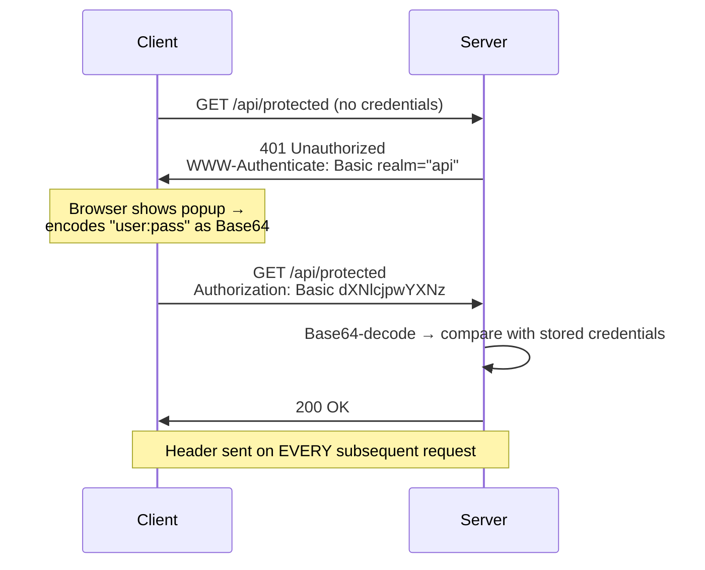
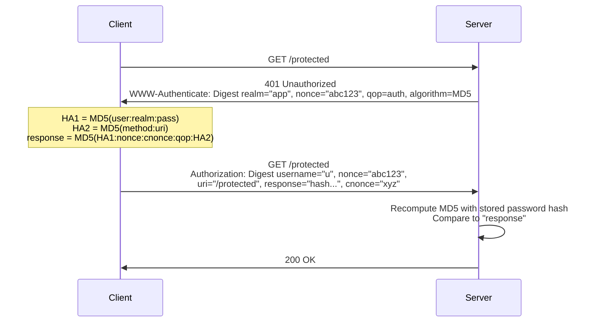

# HTTP Basic & Digest Authentication — The Original Schemes

The first standardized HTTP authentication (RFC 2617, 1997). Base64-encoded
credentials and MD5 challenge-response. Mostly legacy today — but you WILL
still see Basic Auth on internal APIs, health checks, and dev tools.

---

## 1. HTTP Basic Authentication

### The Flow

```text
CLIENT                                  SERVER
  │                                        │
  │  GET /api/protected                    │
  │ ─────────────────────────────────────▶ │
  │                                        │
  │         401 Unauthorized               │
  │         WWW-Authenticate: Basic        │
  │           realm="api"                  │
  │ ◀───────────────────────────────────── │
  │                                        │
  │  GET /api/protected                    │
  │  Authorization: Basic dXNlcjpwYXNz     │   ← base64("user:pass")
  │ ─────────────────────────────────────▶ │
  │                                        │
  │         200 OK                         │
  │ ◀───────────────────────────────────── │
```



### What's Actually In the Header

```text
  "user:password"
        │
        ▼ base64 encode (NOT encryption!)
  "dXNlcjpwYXNzd29yZA=="

  Anyone who sees this header can decode it in 1 second:
    $ echo "dXNlcjpwYXNzd29yZA==" | base64 -d
    user:password

  → Basic Auth over HTTP = sending your password in cleartext.
    Basic Auth over HTTPS = acceptable for simple cases.
```

### Weaknesses

```text
❌ Credentials sent on EVERY request (attack surface multiplies)
❌ Base64 ≠ encryption — useless over plain HTTP
❌ No logout — browser caches credentials, only restart clears them
❌ No session concept — can't revoke a single "login"
❌ Ugly native browser popup — no branding, no 2FA, no "forgot password"
❌ Password must be stored reversibly or compared in cleartext form
❌ Vulnerable to timing attacks if comparison not constant-time
```

### When It's STILL Acceptable

```text
✅ Internal service-to-service calls over mTLS or a private network
✅ Local dev tools (curl, Postman) hitting a dev environment
✅ Simple automation scripts where OAuth overhead isn't justified
✅ Behind an API Gateway that enforces HTTPS + rate limiting

NEVER for:
❌ Public-facing user logins
❌ Anything over HTTP
❌ Mobile / SPA primary auth
❌ Anything needing MFA
```

### Spring Security — Basic Auth

```java
@Bean
SecurityFilterChain basicAuthChain(HttpSecurity http) throws Exception {
    http
        .securityMatcher("/internal/**")          // scope it — don't apply globally
        .authorizeHttpRequests(auth -> auth
            .requestMatchers("/internal/health").permitAll()
            .anyRequest().authenticated())
        .httpBasic(Customizer.withDefaults())      // Basic Auth
        .csrf(AbstractHttpConfigurer::disable)     // no browser → no CSRF need
        .sessionManagement(s ->
            s.sessionCreationPolicy(STATELESS));   // no session for APIs
    return http.build();
}

@Bean
UserDetailsService users(PasswordEncoder encoder) {
    return new InMemoryUserDetailsManager(
        User.builder()
            .username("internal-svc")
            .password(encoder.encode("generated-long-secret"))
            .roles("SERVICE")
            .build());
}
```

---

## 2. HTTP Digest Authentication

### The Idea — Challenge-Response Without Sending the Password

```text
PROBLEM WITH BASIC: password travels on every request.
DIGEST'S FIX: send a HASH the server can verify without knowing the
password over the wire.

  Server generates: nonce (random, per-challenge)
  Client computes:  MD5(username : realm : password : nonce : HTTP-method : URI)
  Server computes:  same MD5 → compares

  → Password never crosses the wire.
  → Replay prevented by nonce + request-bound hash.
```

### The Flow



### Why Digest Also Died

```text
❌ MD5 is cryptographically broken (collisions since 2004, fast brute force)
❌ Server must store either the plaintext password or HA1 = MD5(u:r:p)
   → storing HA1 means an attacker who dumps the DB can replay as any user
     within that realm — effectively equivalent to storing cleartext
❌ Doesn't protect the RESPONSE body (integrity covers the request only)
❌ Same ugly browser popup UX as Basic
❌ TLS made it obsolete — encrypting the whole channel is stronger and
   simpler than hashing pieces of it
❌ Still no sessions, no logout, no MFA
```

### Basic vs Digest — Comparison

| | Basic | Digest |
|---|-------|--------|
| Password over wire | ✅ Base64 (cleartext) | ❌ hash only |
| Server-side storage | Any hash works | Needs plaintext or weak MD5-based HA1 |
| Replay protection | ❌ | ✅ nonce + cnonce |
| Crypto strength | None | MD5 (broken) |
| Over HTTP | ❌ never | ⚠️ still unsafe |
| Modern use | Internal APIs w/ TLS | Practically none |

---

## 3. The Verdict — Current Best Practice

```text
FOR SERVICE-TO-SERVICE (where you'd reach for Basic):
  BEST:    mTLS or OAuth 2.0 Client Credentials
  OK:      API key via header (gateway-validated, rotated)
  MINIMUM: Basic over TLS ONLY for internal/dev — with a long random
           "password" (effectively a shared secret), never a user password

FOR ANYTHING USER-FACING:
  → Sessions (server-rendered), OIDC, or Passkeys — covered in 03/05/07.

RULE OF THUMB:
  If you see Basic Auth in 2024+, ask: "why isn't this Client Credentials
  or mTLS?" — the answer is usually "legacy" or "simplicity," which is
  fine for internal tooling but never for user auth.
```

> Next: `03-Session-Cookie-Form-Auth.md` — the mechanism that dominated
> web authentication for two decades.
