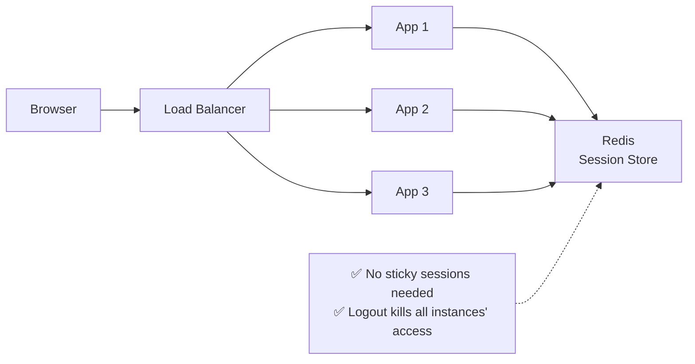
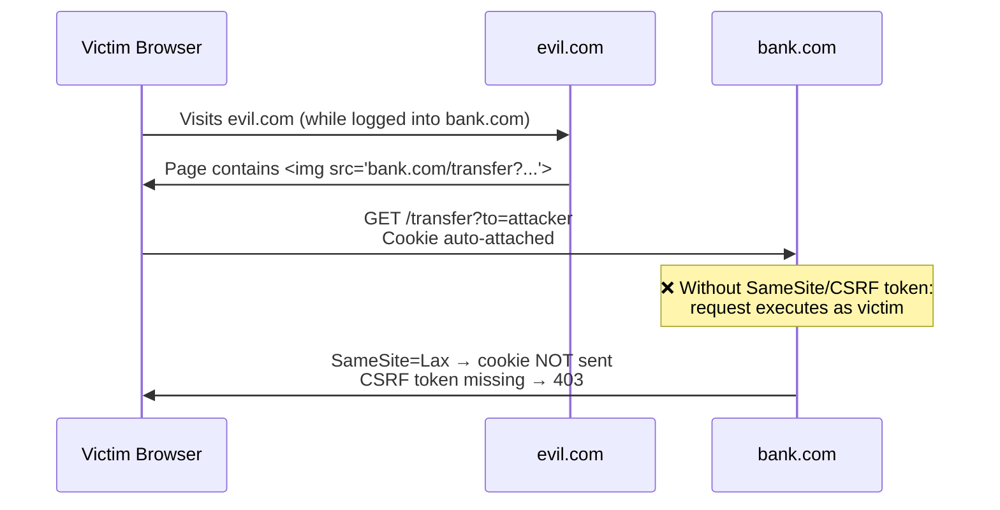

# Form-Based Login, Sessions & Cookies

The workhorse of web authentication since the late 1990s. Server-side session
state, `JSESSIONID` cookies, and the attack categories it created: CSRF,
session fixation, and session hijacking.

---

## 1. The Full Flow

```text
FIRST LOGIN:
  1. User submits form: POST /login {username, password}
  2. Server verifies password against stored hash
  3. Server creates SESSION (server-side state):
       sessionId = random (e.g., 128-bit)
       store[sessionId] = {userId, roles, expiry, ...}
  4. Server responds: Set-Cookie: JSESSIONID=<sessionId>; HttpOnly; Secure
  5. Browser stores cookie, sends it automatically on every request

EVERY SUBSEQUENT REQUEST:
  6. Browser → Cookie: JSESSIONID=<sessionId>
  7. Server looks up sessionId → gets user context → authorizes

LOGOUT:
  8. Server deletes session record → cookie becomes worthless
```

```mermaid
sequenceDiagram
    participant B as Browser
    participant S as Server
    participant DB as Session Store<br/>(memory / Redis)

    B->>S: POST /login {user, pass}
    S->>S: Verify password (Argon2/bcrypt)
    S->>DB: create session: id=abc123 → {userId: 42, roles: [USER]}
    S->>B: Set-Cookie: JSESSIONID=abc123; HttpOnly; Secure; SameSite=Lax

    Note over B,S: Every subsequent request
    B->>S: GET /dashboard<br/>Cookie: JSESSIONID=abc123
    S->>DB: lookup abc123
    DB->>S: {userId: 42, roles: [USER]}
    S->>B: 200 OK (dashboard HTML)

    B->>S: POST /logout
    S->>DB: delete abc123
    S->>B: Set-Cookie: JSESSIONID=; Max-Age=0
```

---

## 2. The Session Store — Where State Lives

```text
IN-MEMORY (default in dev):
  Map<sessionId, Session> in the app process
  ❌ Lost on restart
  ❌ Doesn't scale to multiple instances (sticky sessions needed)

REDIS / EXTERNAL STORE (production):
  sessionId → serialized session object in Redis
  ✅ Survives restarts, shared across instances
  ✅ TTL built-in (session expiry)
  ✅ Can force-logout users (delete key)

STATEFUL TRADEOFF:
  Every request = 1 extra lookup (Redis GET ~0.5ms)
  At 10K req/s = 10K Redis reads/s — fine, but it's still state.
```



---

## 3. Cookie Security Attributes — Non-Negotiables

```text
Set-Cookie: JSESSIONID=abc123;
    HttpOnly      ← JS cannot read it → XSS can't steal the session
    Secure        ← HTTPS only → never sent over plain HTTP
    SameSite=Lax  ← not sent on cross-site POSTs → kills most CSRF
    Path=/        ← scope
    Max-Age=1800  ← expiry (30 min idle timeout is typical)
```

| Attribute | Without it | With it |
|-----------|-----------|---------|
| `HttpOnly` | `document.cookie` exposes it → XSS steals sessions | JS can't touch it |
| `Secure` | Sent over HTTP → sniffable on open Wi-Fi | HTTPS only |
| `SameSite` | Sent on cross-site requests → CSRF | `Lax`/`Strict` blocks cross-site sends |
| `Max-Age` | Lives until browser closes | Bounded lifetime |

```java
// Spring Boot — secure session cookie (application.yml)
server:
  servlet:
    session:
      cookie:
        http-only: true
        secure: true          # requires HTTPS — set false ONLY for local dev
        same-site: lax
        max-age: 1800s
      timeout: 30m
```

---

## 4. Attacks Specific to Sessions

### Session Fixation

```text
ATTACK:
  1. Attacker gets a sessionId: GET /login → JSESSIONID=evil123
  2. Tricks victim into using it:
     https://app.com/login?JSESSIONID=evil123   (URL rewriting era)
     or plants it via XSS / subdomain cookie injection
  3. Victim logs in → session evil123 now belongs to victim
  4. Attacker reuses evil123 → logged in as victim

FIX:
  Server MUST generate a NEW sessionId after successful login.
  (Spring Security does this by default: sessionFixation().migrateSession())
```

### Session Hijacking

```text
ATTACK: steal the sessionId itself → impersonate the user.
  Vectors:
    • XSS (if HttpOnly missing) → document.cookie
    • Network sniffing (if Secure missing) → open Wi-Fi
    • Malware / browser extension reading cookies
    • Server log leaks (never log cookies!)

DEFENSES:
  ✅ HttpOnly + Secure + SameSite attributes
  ✅ Short session timeout + idle timeout
  ✅ Rotate sessionId on privilege change (login, sudo-mode)
  ✅ Bind session to signals: User-Agent hash, IP subnet (careful: mobile IPs change)
  ✅ Revoke on anomaly (new device → re-auth / step-up MFA)
```

### CSRF — Cross-Site Request Forgery

```text
THE ROOT PROBLEM:
  Browser auto-sends cookies. Malicious site can trigger requests:
    
  → Browser happily attaches JSESSIONID → request looks legit.

CLASSIC DEFENSE — CSRF TOKEN (synchronizer pattern):
  Server embeds a random token in forms / sends to SPA.
  Server validates token on every state-changing request.
  Attacker's site can't read the token (same-origin policy).

MODERN DEFENSE — SameSite cookie + token:
  SameSite=Lax stops cross-site sends entirely for top-level POSTs.
  Still keep CSRF token for defense in depth + older browsers.
```



### Spring Security CSRF + Session Config

```java
@Bean
SecurityFilterChain webChain(HttpSecurity http) throws Exception {
    http
        .authorizeHttpRequests(auth -> auth
            .requestMatchers("/login", "/css/**", "/js/**").permitAll()
            .anyRequest().authenticated())
        .formLogin(form -> form
            .loginPage("/login")
            .defaultSuccessUrl("/dashboard")
            .permitAll())
        .logout(logout -> logout
            .logoutUrl("/logout")
            .invalidateHttpSession(true)
            .deleteCookies("JSESSIONID"))
        .csrf(Customizer.withDefaults())          // ON for browser apps
        .sessionManagement(s -> s
            .sessionFixation().migrateSession()    // new ID after login
            .maximumSessions(1)                    // optional: 1 concurrent session
            .expiredUrl("/login?expired"));
    return http.build();
}
```

---

## 5. Scaling & Architecture Notes

```text
STICKY SESSIONS vs SHARED STORE:
  Sticky (LB pins user to one instance):
    ✅ No external store
    ❌ Uneven load, instance failure = lost sessions
  Shared store (Redis):
    ✅ Any instance serves any user
    ❌ Extra infra + lookup latency

WHEN SESSIONS ARE THE RIGHT CHOICE:
  ✅ Server-rendered apps (Thymeleaf, JSP, Rails, Django)
  ✅ BFF pattern (backend-for-frontend keeps tokens server-side,
     exposes only a session cookie to the browser — BEST for SPAs too)
  ✅ Apps needing instant revocation (ban user → delete session)

WHEN TO AVOID:
  ❌ Pure stateless microservice APIs (use JWT/OAuth tokens)
  ❌ Public mobile APIs (cookies are awkward in native apps)
```

---

## 6. Best Practices Checklist

```text
✅ Password: Argon2id/bcrypt hashed, never logged, never in URLs
✅ SessionId: ≥128 bits of entropy, rotated on login & privilege change
✅ Cookie: HttpOnly + Secure + SameSite=Lax (or Strict)
✅ CSRF: token for all state-changing requests (or rely on SameSite + strict origin checks)
✅ Timeout: idle timeout (30m) + absolute timeout (8–12h)
✅ Logout: server-side invalidation, not just clearing the cookie
✅ "Remember me": separate long-lived token, rotated, stored hashed server-side
✅ Session store: Redis for multi-instance; encrypt at rest
✅ MFA: step-up for sensitive ops (change email, payments, sudo mode)
❌ Never put sessionId in URLs (leaks via Referer, logs, history)
❌ Never log cookies or Authorization headers
```

> Next: `04-Token-Based-JWT-Refresh.md` — how tokens removed server state
> and what new problems they introduced.
