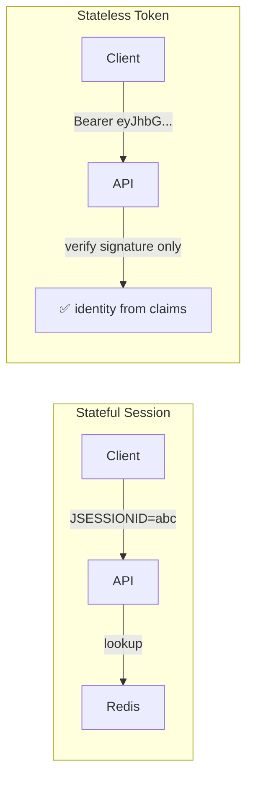
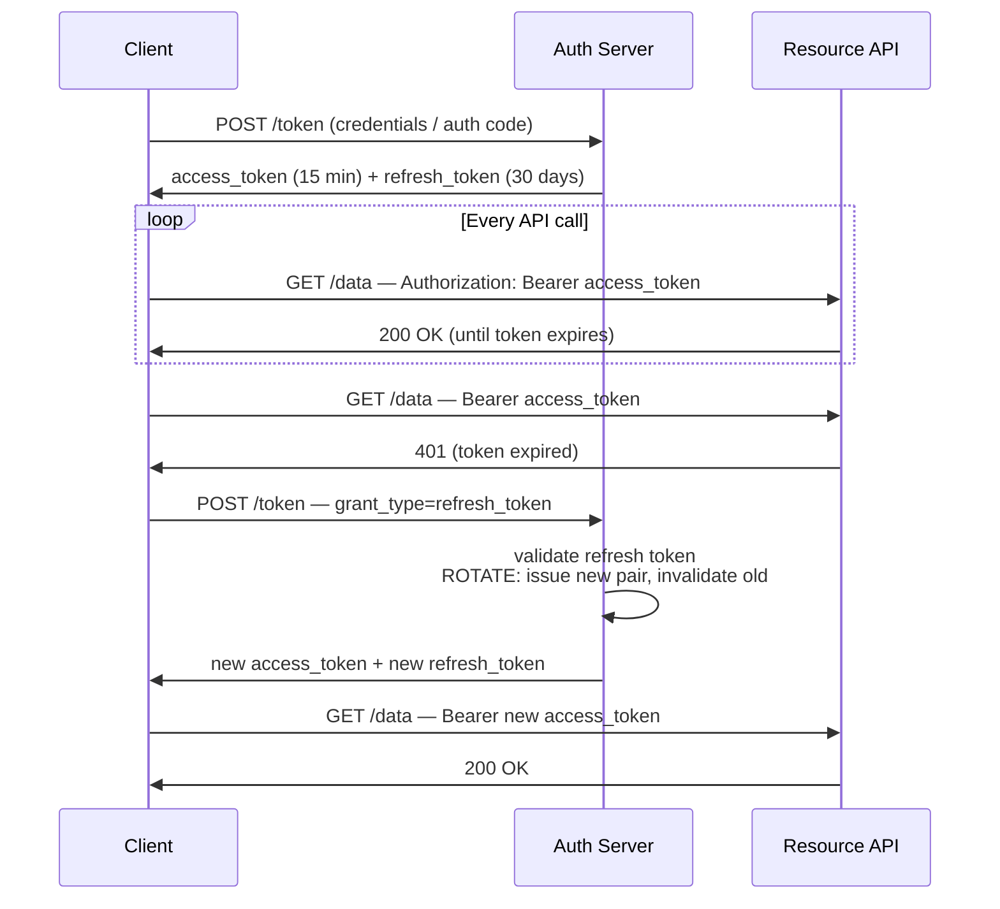
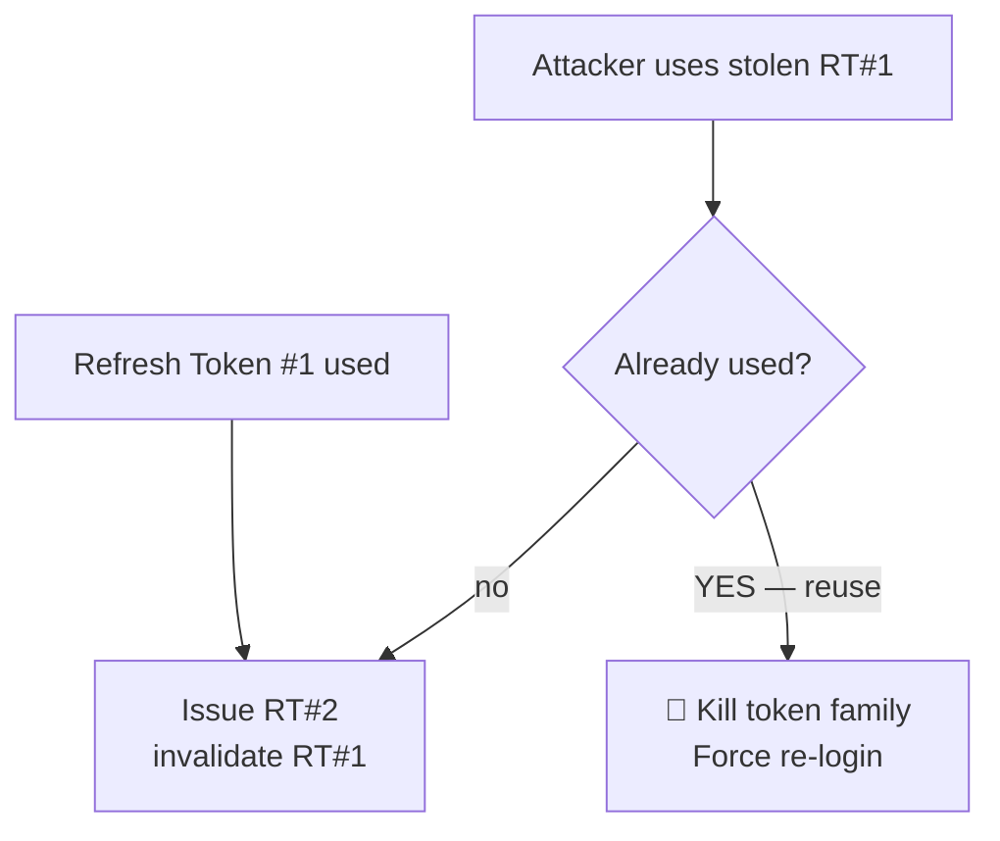
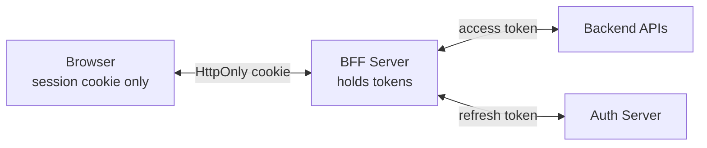

# Token-Based Authentication — JWT, Access & Refresh Tokens

Stateless authentication: the token itself carries the proof. How JWTs are
built, why you need BOTH access and refresh tokens, where to store them,
and the revocation problem nobody warns you about.

---

## 1. Why Tokens? The Stateless Shift

```text
SESSION PROBLEM AT SCALE:
  • Every request needs a session lookup (DB/Redis)
  • Session store = shared state = scaling bottleneck + SPOF
  • Microservices: 10 services = each needs session access

TOKEN SOLUTION:
  Server signs a token containing user identity + permissions.
  Client presents it. Server verifies the SIGNATURE — no lookup needed.

  Trade-off: you lose instant revocation (token valid until expiry).
```



---

## 2. JWT Anatomy

```text
eyJhbGciOiJIUzI1NiIsInR5cCI6IkpXVCJ9     .   eyJzdWIiOiIxMjM0NTY3ODkwIiwibmFtZSI6IkpvaG4gRG9lIiwiaWF0IjoxNTE2MjM5MDIyfQ     .   SflKxwRJSMeKKF2QT4fwpMeJf36POk6yJV_adQssw5c

─────────────────────────────────────       ────────────────────────────────────────────────────────────────       ──────────────────────────────────────
HEADER (base64url)                             PAYLOAD / CLAIMS (base64url)                                           SIGNATURE
{"alg":"HS256","typ":"JWT"}                    {"sub":"1234","name":"John","iat":1516239022}                            HMAC-SHA256(header + "." + payload, secret)

⚠️ BASE64 IS NOT ENCRYPTION.
   Anyone can decode header + payload → NEVER put secrets in a JWT.
   Signature only guarantees INTEGRITY (not tampered), not confidentiality.
```

### Standard Claims (RFC 7519)

| Claim | Meaning | Example |
|-------|---------|---------|
| `iss` | Issuer | `https://auth.myapp.com` |
| `sub` | Subject (user id) | `user-42` |
| `aud` | Audience (intended recipient) | `my-api` |
| `exp` | Expiration | `1717171717` |
| `iat` | Issued at | `1717170000` |
| `nbf` | Not before | `1717170000` |
| `jti` | Token ID (unique) | `abc-123` (for revocation tracking) |

```java
// Spring Security — JWT validation (resource server)
@Bean
SecurityFilterChain api(HttpSecurity http) throws Exception {
    http
        .authorizeHttpRequests(a -> a.anyRequest().authenticated())
        .oauth2ResourceServer(o -> o.jwt(Customizer.withDefaults()));
    return http.build();
}
// application.yml:
// spring.security.oauth2.resourceserver.jwt.issuer-uri=https://auth.myapp.com
// → fetches public keys (JWKS) automatically, validates iss/exp/aud/signature
```

### Signing Algorithms

```text
SYMMETRIC (shared secret):           ASYMMETRIC (key pair):
  HS256 = HMAC + secret                RS256 = RSA private signs, public verifies
  Same key signs & verifies            ✅ Issuer keeps private key
  ❌ Every verifier can ALSO sign!        APIs verify with public key only
  Only for single-service setups       Standard for OAuth/OIDC (JWKS endpoint)

NEVER: alg=none, never trust client-supplied alg for verification decision
       (classic JWT alg confusion attack → validate against allowlist)
```

---

## 3. The Access + Refresh Token Pattern

```text
WHY TWO TOKENS?
  Access token alone → if stolen, attacker has access until expiry.
    Short expiry (5–15 min) = better security, but constant re-login = bad UX.
  → Refresh token: long-lived (days/weeks), used ONCE to get a new
    access token. Kept more protected than the access token.
```



### Refresh Token Rotation — The Critical Defense

```text
PROBLEM: if a refresh token is stolen, attacker refreshes forever.
DEFENSE: ROTATION.
  • Every refresh → issue NEW refresh token, invalidate old one
  • If old refresh token is ever used → REUSE DETECTED
    → kill the whole token family (user + attacker both logged out)
    → attacker loses, real user just logs in again
```



---

## 4. Where to Store Tokens — The Eternal Debate

| Storage | XSS safe? | CSRF risk? | Verdict |
|---------|-----------|-----------|---------|
| `localStorage` | ❌ readable by any JS | ✅ none (not auto-sent) | ❌ avoid for sensitive apps |
| Cookie `HttpOnly` | ✅ not readable by JS | ⚠️ needs CSRF protection | ✅ **best for browsers** |
| Memory (JS variable) | ✅ gone on refresh | ✅ none | ✅ SPAs w/ BFF |
| Secure mobile storage | ✅ | n/a | ✅ native apps |

```text
MODERN BEST PRACTICE — BFF (Backend For Frontend):
  Browser ↔ BFF:  session cookie (HttpOnly, SameSite)
  BFF ↔ APIs:     access token (server-side only, never reaches browser)

  → Browser never sees tokens. XSS can't steal what it can't reach.
  → Token refresh handled server-side.
  → Best of both worlds: cookie UX + token security.
```



---

## 5. The Revocation Problem

```text
JWT superpower = no lookup needed. Also its weakness.
  User banned / password changed / device lost →
  all issued JWTs remain valid until exp.

MITIGATIONS (pick by risk):
  1. Short expiry (5–15 min) — limits blast radius. Minimum baseline.
  2. Refresh rotation + reuse detection — kills the long-lived side.
  3. Token denylist (jti in Redis, check per request) — reintroduces lookup.
  4. "Version" claim — bump user's token_version on password change;
     validate version in token vs DB (1 lookup per request, or cached).
  5. Reference tokens (opaque) + introspection endpoint — full control,
     full lookup cost. (OAuth 2.0 RFC 7662)
```

```text
SIGNATURE ≠ AUTHENTICATED SESSION.
A valid-signature JWT still needs: exp, nbf, iss, aud validation.
And remember: JWT tells you WHO, not whether they're STILL allowed.
```

---

## 6. Best Practices

```text
✅ Access token: short-lived (5–15 min), audience-restricted, minimal claims
✅ Refresh token: rotation + reuse detection + HttpOnly cookie (or BFF)
✅ Algorithms: RS256/ES256 (asymmetric) for any multi-service setup
✅ Validate: signature + exp + iss + aud + alg allowlist (never trust header alg)
✅ jti claim + denylist for high-value revocation needs
✅ BFF pattern for browser apps — tokens never touch client JS
❌ Never put sensitive data in JWT payload (base64 ≠ encrypted)
❌ Never accept alg=none or allow client to choose algorithm
❌ Never use a single long-lived access token (days) without refresh rotation
❌ Never store refresh tokens in localStorage
```

> Next: `05-OAuth2-OIDC-PKCE.md` — the standardized delegation framework
> built on top of these token concepts.
