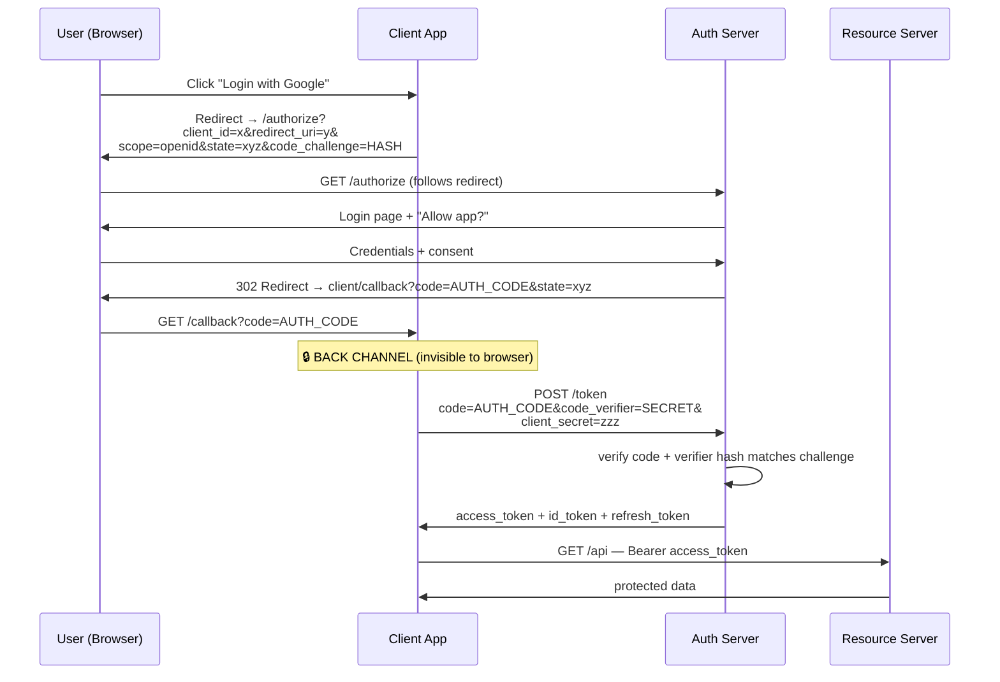
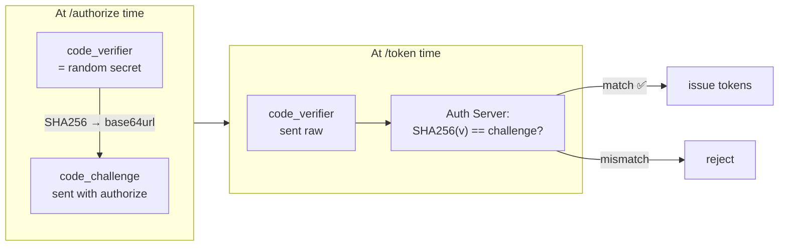
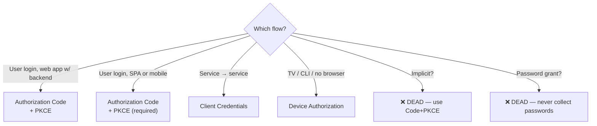
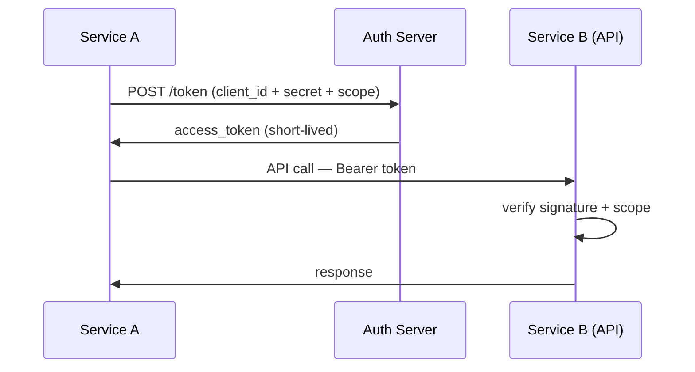

# OAuth 2.0 & OpenID Connect — Delegation and Federated Login

The standard for letting third parties access resources WITHOUT sharing
passwords ("Sign in with Google"). All grant types, why PKCE is now
mandatory, and why Implicit/Password grants are officially deprecated.

---

## 1. The Problem OAuth Solves

```text
2008 SCENARIO:
  Photo-printing app wants your Google Photos.
  OLD WAY: "Give me your Google password" → app stores it →
           full account access, can't revoke without changing password.

OAUTH WAY:
  App redirects you to Google → you log in at Google → Google asks
  "Allow PhotoApp to read your photos?" → you approve → Google gives
  the app a token scoped to "read photos only" → revoke anytime.

  Your password never leaves Google.
```

### The Four Roles

```text
RESOURCE OWNER   = the user (you)
CLIENT           = the app wanting access (PhotoApp)
AUTH SERVER      = issues tokens (Google accounts server / Keycloak / Okta)
RESOURCE SERVER  = the API holding data (Google Photos API)
```

---

## 2. Grant Types — The Overview

```text
┌──────────────────────────┬─────────────┬─────────────────────────────┐
│ Grant                    │ Status 2024 │ Use for                     │
├──────────────────────────┼─────────────┼─────────────────────────────┤
│ Authorization Code       │ ✅ ONLY way  │ Web apps w/ backend         │
│ Authorization Code+PKCE  │ ✅ REQUIRED  │ SPAs, mobile, ALL public    │
│ Client Credentials       │ ✅           │ Service → service           │
│ Refresh Token            │ ✅           │ Renewing access             │
│ Device Authorization     │ ✅           │ TVs, consoles, CLI tools    │
│ Token Exchange (RFC 8693)│ ✅           │ Impersonation in meshes     │
│ Implicit                 │ ❌ DEAD      │ Was for old SPAs — PKCE won │
│ Resource Owner Password  │ ❌ DEAD      │ Leaked passwords by design  │
│ SAML Bearer / JWT Bearer │ ⚠️ niche     │ Enterprise SSO bridges      │
└──────────────────────────┴─────────────┴─────────────────────────────┘
```

---

## 3. Authorization Code Flow — The Core Flow

```text
The most important flow in modern auth. Two phases:
  FRONT CHANNEL (browser redirects — visible, untrusted)
  BACK CHANNEL (server-to-server — authenticated, trusted)
```



### Why the Two-Phase Design Matters

```text
The AUTH CODE travels through the browser (front channel) — could leak
via logs, referrer, browser history.

The TOKEN exchange happens server-to-server (back channel) — code is
useless without:
  • client_secret (confidential clients), AND
  • code_verifier (PKCE — see next section), AND
  • matching redirect_uri, AND
  • one-time use + short expiry (~1–10 min)

→ Stolen code alone = worthless. That's the genius of the design.
```

---

## 4. PKCE — Proof Key for Code Exchange (RFC 7636)

```text
PROBLEM (public clients: SPAs, mobile):
  No client_secret possible (anyone can decompile the app).
  Auth code stolen via redirect interception → attacker exchanges it.

PKCE FIX:
  Client generates: verifier  = random 43–128 chars (SECRET, kept client-side)
                    challenge = base64url(SHA256(verifier))
  Step 1: send challenge with /authorize request
  Step 2: send verifier with /token exchange
  Server: SHA256(verifier) must equal challenge → proof of same party
```



```text
TODAY: PKCE is REQUIRED for ALL clients — including confidential ones.
  OAuth 2.0 Security BCP (RFC 9700) and OAuth 2.1 draft mandate it.
  It also prevents auth-code injection attacks on confidential clients.
```

---

## 5. Dead Flows — Implicit & Resource Owner Password

### Implicit Flow (dead since ~2019, formally deprecated)

```text
OLD SPA FLOW:
  /authorize → response_type=token → token returned in URL #fragment
  → access token in the browser URL. No code exchange step.

WHY IT DIED:
  ❌ Token in URL → leaks via history, referrer, browser extensions
  ❌ No refresh token possible (silent renew hacks via iframes)
  ❌ PKCE + auth code flow became viable for SPAs → no reason to keep it

MODERN REPLACEMENT: Authorization Code + PKCE (works everywhere)
```

### Resource Owner Password Credentials (dead)

```text
"Give my app your username+password, I'll call the token endpoint myself."
  → The app SEES your password. Destroys the entire point of OAuth.
  → Cannot do MFA, SSO, or consent properly.
  ❌ NEVER USE. Removed in OAuth 2.1 draft.
```



---

## 6. Client Credentials — Machine Auth

```text
No user involved. Service A authenticates AS ITSELF to get tokens for API B.
  POST /token grant_type=client_credentials
        &client_id=svc-a&client_secret=xxx&scope=reports.read
```



```text
BEST PRACTICE:
  ✅ Prefer private_key_jwt (client signs a JWT) over client_secret
     → secret never travels the wire
  ✅ Even better: workload identity (SPIFFE/mTLS) — no secrets at all
  ✅ Scope tokens narrowly; short TTL (minutes)
  ❌ Never put client secrets in browser/mobile code
```

---

## 7. OpenID Connect — Identity on Top of OAuth

```text
OAuth 2.0 alone = DELEGATION (access to resources). It deliberately
  does NOT define "who is the user" — access tokens are often opaque.

OIDC adds the IDENTITY layer:
  ID TOKEN (JWT) = proof of WHO authenticated, when, how
  USERINFO endpoint = fetch profile claims with access token
  Standard claims: sub, name, email, email_verified, picture, amr, acr
```

```text
ID TOKEN vs ACCESS TOKEN:
  ID token  → for the CLIENT (proves login happened, carries claims)
              aud = client_id. NEVER send to APIs.
  Access token → for the RESOURCE SERVER (proves authorized scope)
              aud = API identifier. Client treats as opaque.
```

```java
// Spring Boot — OIDC login ("Sign in with Google") in 5 lines
// application.yml:
//   spring.security.oauth2.client.registration.google.client-id: ...
//   spring.security.oauth2.client.registration.google.client-secret: ...
@Bean
SecurityFilterChain oidc(HttpSecurity http) throws Exception {
    http
        .authorizeHttpRequests(a -> a.anyRequest().authenticated())
        .oauth2Login(Customizer.withDefaults());   // OIDC login flow
    return http.build();
}
// Spring auto-adds PKCE, state validation, nonce check, JWKS validation.
```

---

## 8. Best Practices Checklist

```text
✅ ALWAYS: Authorization Code + PKCE — for every client type
✅ State parameter → CSRF protection on redirect
✅ Nonce in ID token → replay protection for login
✅ redirect_uri → exact match allowlist, never wildcards
✅ Back-channel token exchange → secrets never in browser URL
✅ Short access token TTL + refresh rotation
✅ Confidential clients → private_key_jwt over client_secret
✅ Validate iss/aud/exp/nonce on ID tokens
❌ Implicit flow → dead, don't implement
❌ Password grant → dead, defeats OAuth entirely
❌ Bearer tokens in query strings → logs leak them
❌ Wildcard/loose redirect_uri → open redirector → token theft
```

> Next: `06-MFA-OTP-TOTP-Push.md` — why a second factor changes everything
> and which factors resist phishing.
