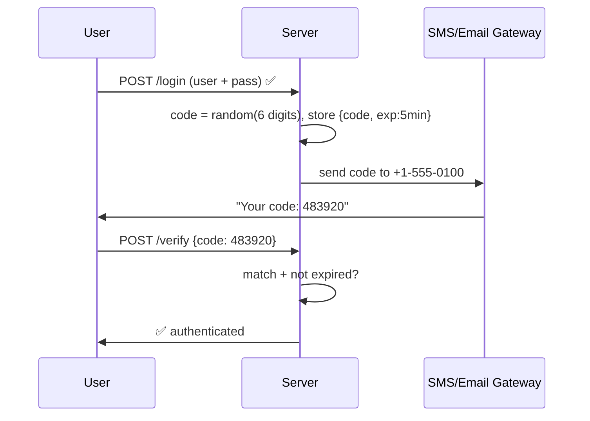
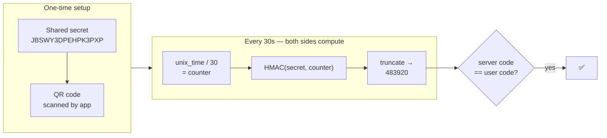
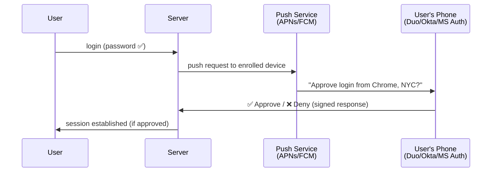
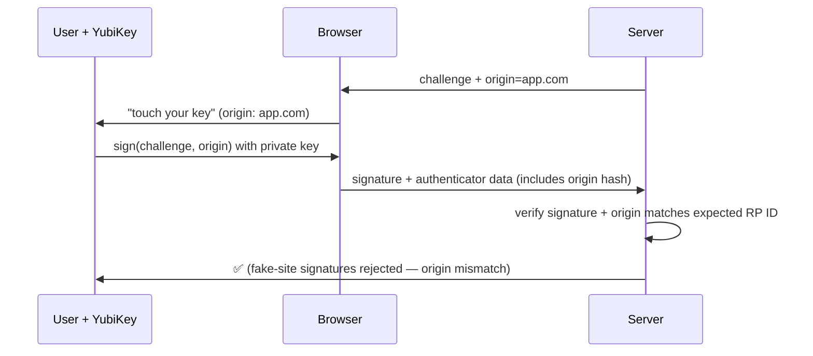

# Multi-Factor Authentication — OTP, TOTP, Push & Hardware Keys

Why a second factor matters, how each type works internally, and the
critical distinction between phishable and phishing-resistant MFA.

---

## 1. Why MFA?

```text
SINGLE FACTOR (password) = single point of failure:
  Breach → credential stuffing → account takeover
  Phishing → real-time relay → account takeover
  Brute force / spraying → weak passwords fall

MFA = attacker needs TWO independent compromises:
  Steal password ✅ → still can't get in without the phone/key
  Clone SIM ✅ → still needs the password
  → Each factor covers the other's failure mode.

REAL-WORLD IMPACT (Microsoft/Google data):
  MFA blocks >99% of automated credential-stuffing attacks.
  But: phishing-resistant MFA (hardware keys) blocks targeted phishing
  that defeats SMS/TOTP.
```

---

## 2. The Factor Types

```text
┌─────────────────────┬──────────────┬─────────────────────────────────┐
│ Factor type         │ Examples     │ Phishing resistance             │
├─────────────────────┼──────────────┼─────────────────────────────────┤
│ SMS OTP             │ 6-digit text │ ❌ phishable + SIM-swap risk    │
│ Email OTP           │ link / code  │ ❌ phishable + mailbox takeover │
│ TOTP (app)          │ Google Auth  │ ❌ phishable (30s window relay) │
│ Push approval       │ Duo, Okta    │ ⚠️ phishing fatigue attacks    │
│ Push + number match │ Duo, MS Auth │ ✅ better — user must see code  │
│ Hardware key (FIDO2)│ YubiKey      │ ✅ origin-bound crypto         │
│ Passkey             │ platform key │ ✅ phishing-proof by design    │
│ Smart card (PKI)    │ CAC/PIV      │ ✅ cert-based, origin-checked  │
└─────────────────────┴──────────────┴─────────────────────────────────┘
```

---

## 3. SMS / Email OTP — The Legacy Factor

```text
FLOW:
  Login w/ password → server generates 6-digit code →
  sends via SMS/email → user types it → server compares
```



```text
WHY IT'S WEAK:
  ❌ SIM-swap attacks — attacker ports your number, gets your codes
  ❌ SS7 protocol vulnerabilities — SMS interceptable at network level
  ❌ Phishable — user types the code on a fake site, attacker relays it
  ❌ Email: if mailbox is compromised, factor is compromised

VERDICT: Better than nothing. NIST deprecated SMS as a "restricted"
  factor. Only use as last-resort fallback, never as primary MFA.
```

---

## 4. TOTP — Time-Based One-Time Password (RFC 6238)

The algorithm inside Google Authenticator, Authy, 1Password, etc.

### How It Actually Works

```text
SETUP:
  Server generates random secret → shows QR code:
    otpauth://totp/MyApp:alice@x.com?secret=JBSWY3DPEHPK3PXP&issuer=MyApp
  App scans → stores the SAME secret on the phone.
  Secret is NEVER transmitted again — both sides compute locally.

EVERY 30 SECONDS (both sides independently):
  counter = floor(unix_time / 30)
  code    = HMAC-SHA1(secret, counter) → take 6 digits

  Server accepts current ± 1 time step (clock drift tolerance).
  → No network needed. The phone is a synchronized hash calculator.
```



```text
STRENGTHS:
  ✅ Works offline, no telecom dependency
  ✅ Secret never transmitted after setup
  ✅ Free — no SMS gateway costs

WEAKNESSES — REAL-TIME PHISHING:
  Attacker's fake site relays credentials + TOTP code to real site
  within the 30s window → account takeover DESPITE "MFA enabled".
  Tools like Evilginx automate this (adversary-in-the-middle).

  ⚠️ TOTP proves "possession of secret" — but a proxy doesn't need
     to possess it, just relay the code while it's valid.
```

```java
// TOTP verification — core logic (concept)
long counter = Instant.now().getEpochSecond() / 30;
byte[] key = Base32.decode(storedSecret);
byte[] hmac = HmacSHA1(key, counter);
int offset = hmac[hmac.length - 1] & 0x0F;
int code = ((hmac[offset] & 0x7F) << 24
          | (hmac[offset+1] & 0xFF) << 16
          | (hmac[offset+2] & 0xFF) << 8
          | (hmac[offset+3] & 0xFF)) % 1_000_000;
// Accept counter-1, counter, counter+1 → clock drift window
// Libraries: dev.samstevens.totp (Java), Google Authenticator PAM, etc.
```

---

## 5. Push-Based MFA — Approve on Your Phone



```text
BASIC PUSH PROBLEM — MFA FATIGUE / PUSH BOMBING:
  Attacker spams approve requests at 3am → user taps Approve to
  make it stop → account takeover. (Uber 2022 breach — this exact attack)

FIX — NUMBER MATCHING:
  Login screen shows "Enter 42 on your phone"
  Phone shows buttons 41/42/43 → user must pick the RIGHT number
  → attacker can't trick approval for a login they can't see
  ✅ Now required by Microsoft Authenticator, Duo, Okta Verify
```

---

## 6. Hardware Keys — FIDO2/WebAuthn (Phishing-Resistant)

```text
WHY IT'S DIFFERENT — CRYPTOGRAPHIC ORIGIN BINDING:
  The browser tells the key WHICH SITE is asking (origin).
  Key signs the challenge ONLY for that origin.
  → Fake site "g00gle.com" gets a signature that's worthless on
    real google.com. Phishing is cryptographically impossible.

FLOW:
  Login w/ password → server sends challenge → browser talks to key
  (USB/NFC/BLE) → key signs challenge w/ origin → server verifies
```



```text
  ✅ Phishing-resistant — origin binding at crypto level
  ✅ No shared secret to steal (private key never leaves hardware)
  ✅ Fast — touch once
  ❌ Cost (~$25–70), needs enrollment + backup key
  → THE gold standard for high-value accounts (admins, finance)
```

---

## 7. Recovery & Edge Cases

```text
LOST DEVICE = LOCKED OUT → plan recovery BEFORE enforcing MFA:

  ✅ Backup codes (10 one-time codes at enrollment — store offline)
  ✅ Multiple enrolled factors (2 keys, key + TOTP)
  ✅ Admin-assisted recovery with STRONG identity proofing
     (not "my email got hacked, reset MFA" — that's the bypass)

OTHER GOTCHAS:
  • TOTP secret export → protect secrets at rest (encrypt in DB)
  • SMS as recovery → don't let weakest factor reset the strongest
  • Enrollment ceremony itself is high-risk → require existing auth
  • Step-up auth → fresh MFA for sensitive ops even mid-session
```

---

## 8. Best Practices

```text
✅ Prefer phishing-resistant: hardware keys, passkeys
✅ TOTP acceptable for general users — pair with phishing awareness
✅ Push MUST have number matching (fatigue attack defense)
✅ Backup codes at enrollment; recovery = harder than enrollment
✅ Step-up MFA for sensitive operations (payment, email change, admin)
✅ Rate-limit OTP verification (5 tries → lock; code is only 10^6 space)
✅ Encrypt TOTP secrets at rest; never log codes
❌ SMS as primary factor — NIST-restricted, SIM-swapable
❌ Security questions — public/socially-discoverable answers
❌ Same category twice — password + PIN = still 1 factor
❌ Letting a weak factor (email) reset a strong one (hardware key)
```

> Next: `07-Passkeys-WebAuthn-FIDO2.md` — the mechanism designed to
> replace passwords entirely.
