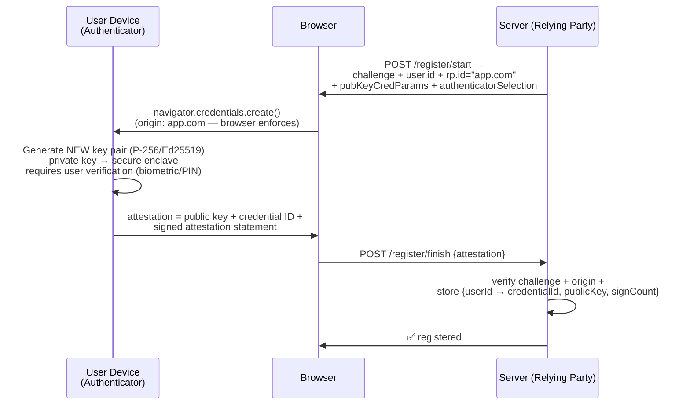
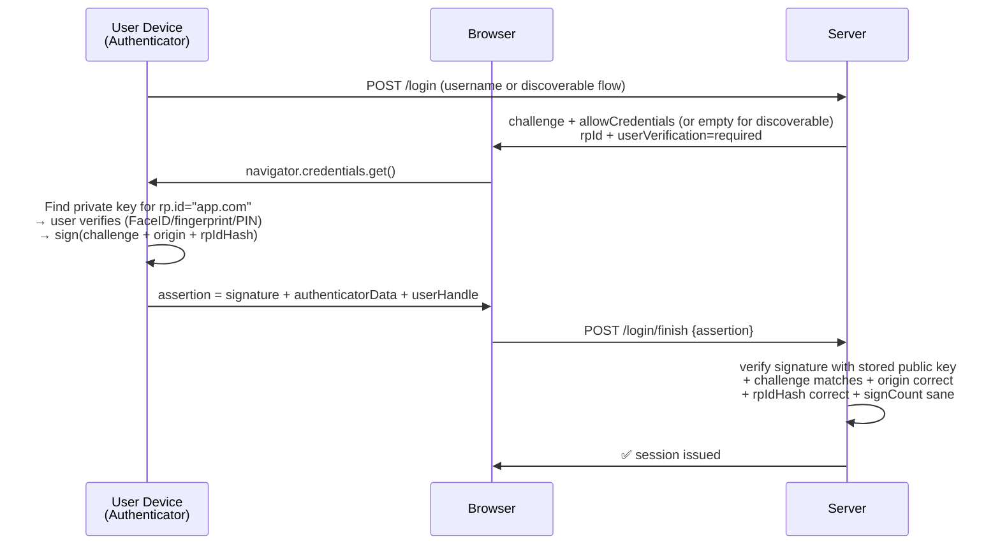
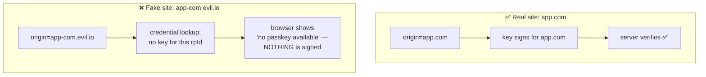

# Passkeys, WebAuthn & FIDO2 — The Passwordless Endgame

Public-key cryptography as your login. Why phishing is *cryptographically
impossible*, how the registration and authentication ceremonies work, and
the difference between device-bound and synced passkeys.

---

## 1. Why Passkeys Exist — Killing the Shared Secret

```text
EVERY PASSWORD-BASED SYSTEM SHARES ONE FLAW:
  The secret (or something derived from it) must be PROVED to the server.
  → Server can be phished (fake site collects it)
  → Server DB can be breached (hashes get cracked)
  → Users reuse it (one breach = many accounts)

PASSKEYS FLIP THE MODEL:
  Private key = stays on YOUR device, NEVER transmitted, NEVER leaves.
  Public key  = stored on server. Worthless to attackers if breached.
  Login = prove you hold the private key by signing a challenge.

  There is NOTHING to phish — the user never types a secret.
  There is NOTHING to steal from the DB — public keys are public.
```

```text
THE NAMES:
  FIDO2      = the overall standard (FIDO Alliance)
  WebAuthn   = the browser JS API part (W3C standard)
  CTAP2      = how the browser talks to the authenticator (USB/NFC/BLE)
  Passkey    = the USER-FACING name for a FIDO2/WebAuthn credential
  Platform authenticator = built-in (Touch ID, Windows Hello, Android)
  Roaming authenticator  = external hardware (YubiKey)
```

---

## 2. Registration Ceremony — Creating the Credential



```text
KEY POINTS:
  • challenge = server-generated random → replay protection
  • rp.id (relying party ID) = domain — credential BOUND to it
  • attestation = authenticator proves its model/genuineness
    (optional — most sites use attestation=none for privacy)
  • Server stores ONLY the public key — breach leaks nothing usable
```

---

## 3. Authentication Ceremony — The Login



```text
WHY PHISHING IS IMPOSSIBLE:
  Attacker's fake site = evil-app.com (different origin)
  Browser passes origin=evil-app.com to authenticator
  Authenticator signs challenge bound to rpIdHash(evil-app.com)
  → Real app.com server verifies signature → rpIdHash mismatch → REJECTED

  The user doesn't have to be smart. The crypto enforces the domain.
  This is the fundamental difference from TOTP — where a proxy just
  relays a code; here the "code" is a signature bound to the real domain.
```



---

## 4. Synced vs Device-Bound Passkeys

```text
DEVICE-BOUND (original WebAuthn model):
  Private key lives in ONE device/hardware key's secure element.
  ✅ Highest assurance — key provably never left hardware
  ❌ Lose the device = lose access (need backup credential)
  → YubiKeys, TPMs — used by enterprises, high-security accounts

SYNCED (passkeys, 2022+):
  Private key synced via cloud keychain (iCloud, Google Password Mgr,
  1Password, Bitwarden) — E2E encrypted between devices.
  ✅ Survives device loss, seamless UX across devices
  ✅ Enabled mass adoption — "just works" like passwords
  ⚠️ Security now depends on cloud account + vendor's sync crypto
     (still far stronger than passwords — phishing-resistant stands)
```

```text
CROSS-DEVICE (hybrid flow — "sign in with phone"):
  Desktop browser shows QR → phone scans → phone signs via Bluetooth/
  proximity proof → desktop logged in. Phone IS the authenticator.
  (caBLE / CTAP2 hybrid transport — proximity proves no remote relay)
```

---

## 5. User Verification & Ceremony Modes

```text
userVerification parameter controls whether the authenticator must
verify the user (biometric/PIN) or just test presence (touch):

  "required"  → biometric/PIN needed → 2 factors in one gesture
                 (possession of device + inherence/knowledge)
  "preferred" → authenticator decides
  "discouraged" → presence-only (touch) — single factor

DISCOVERABLE vs NON-DISCOVERABLE credentials:
  Non-discoverable: server sends allowCredentials list (needs username first)
  Discoverable (resident keys): credential stores user handle ON device
    → username-free login: tap fingerprint → device finds account itself
    → true "passwordless AND usernameless" experience
```

---

## 6. Implementation — What the Server Must Do

```text
REGISTRATION checks:
  ✅ challenge matches what was issued (replay)
  ✅ origin === expected (https://app.com)
  ✅ rpIdHash === SHA256("app.com")
  ✅ attestation format valid (or attestation=none)
  ✅ store: credentialId (unique), publicKey, signCount, userId

AUTHENTICATION checks:
  ✅ signature valid under stored public key
  ✅ challenge, origin, rpIdHash all match
  ✅ signCount monotonically increasing (cloned-key detection)
  ✅ userVerification flag if required
  ✅ userHandle maps to expected user

Java libraries: com.yubico:webauthn-server-core (reference impl),
  Spring Security (webauthn support since 6.4), keycloak, authentik.
```

```java
// Spring Security 6.4+ — passkey/WebAuthn support (webAuthn DSL)
@Bean
SecurityFilterChain passkeys(HttpSecurity http) throws Exception {
    http
        .authorizeHttpRequests(a -> a.anyRequest().authenticated())
        .webAuthn(w -> w
            .rpName("MyApp")
            .rpId("app.com")
            .allowedOrigins("https://app.com"))
        .formLogin(Customizer.withDefaults());   // fallback
    return http.build();
}
```

---

## 7. Threat Model — What Passkeys Kill and What They Don't

```text
KILLED:
  ✅ Phishing / credential phishing — origin binding
  ✅ Credential stuffing / reuse — key pair is per-site
  ✅ Server DB breach of credentials — only public keys stored
  ✅ Keyloggers — nothing typed
  ✅ MFA fatigue / relay attacks — domain-bound signature
  ✅ Brute force / password spraying — no password

NOT KILLED (still need care):
  ⚠️ Session theft AFTER auth (still need secure cookies/tokens)
  ⚠️ Device malware (secure enclave helps, not absolute)
  ⚠️ Account recovery flow = new weakest link
     → recovery must be at least as strong as passkey itself
     → social engineering of support = the new phishing
  ⚠️ Synced passkey = cloud account compromise risk
     → mitigated by vendor E2E encryption + hardware roots
```

---

## 8. Best Practices

```text
✅ Offer passkeys as PRIMARY for consumer apps (2024+ standard)
✅ Keep password/OIDC as fallback during migration — not forever
✅ Register ≥2 credentials (device-bound backup, e.g., YubiKey)
✅ userVerification=required — gets you 2FA-in-one-gesture
✅ Discoverable credentials for username-free login UX
✅ Recovery flow stronger than password reset — re-enroll passkey
   after high-assurance verification (ID check / existing device)
✅ Cross-device QR flow for desktop login from phone
✅ Server stores ONLY public keys — that's the whole point
❌ Don't treat synced passkeys as lower-value — the UX win IS the point
❌ Don't offer weak recovery (email link) that bypasses the passkey
❌ Don't store attestation data you don't need (privacy)
```

> Next: `08-SAML-SSO-Kerberos-LDAP.md` — the enterprise SSO mechanisms
> still running the corporate world.
