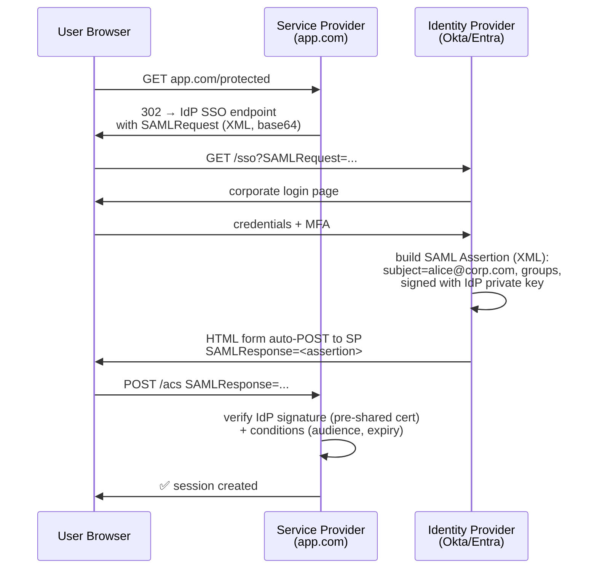
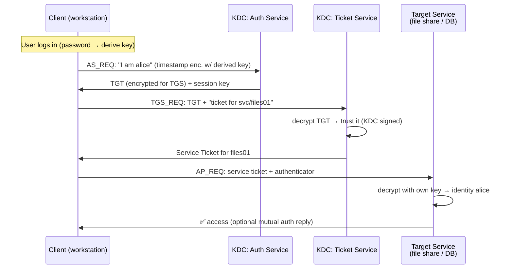
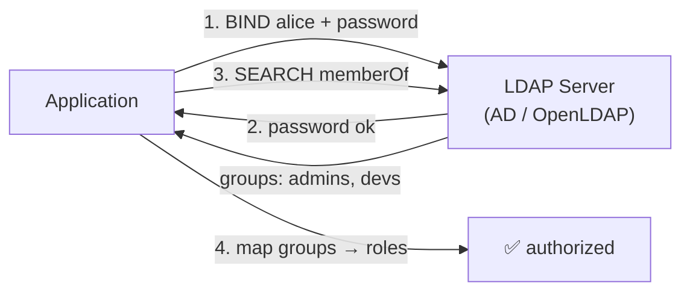
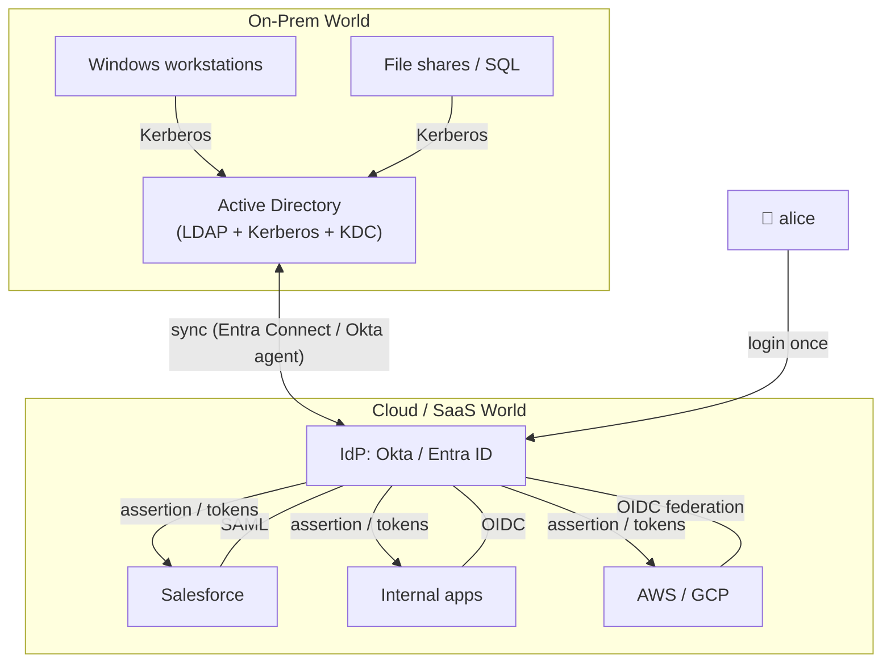

# SAML, SSO, Kerberos & LDAP — Enterprise Authentication

The mechanisms running corporate identity: SAML for browser SSO across
companies, Kerberos for internal Windows-domain networks, LDAP as the
directory underneath it all. Legacy-heavy but unavoidable in enterprises.

---

## 1. The Enterprise Context

```text
WHY ENTERPRISE IS DIFFERENT:
  • Thousands of internal apps — can't have 1000 passwords
  • One central identity = HR system of record (joiner/mover/leaver)
  • Compliance: audit trails, provisioning/deprovisioning
  • Cross-company federation (vendor portals, SaaS apps)

THE GOAL — SSO (Single Sign-On):
  Log in ONCE at the corporate Identity Provider (IdP).
  Every app (Service Provider) trusts the IdP's assertion.
  → Password entered only at ONE trusted place.
```

---

## 2. SAML 2.0 — Browser-Based Enterprise SSO (2005)

### Roles & Flow

```text
SP  = Service Provider — the app you want (Salesforce, Workday)
IdP = Identity Provider — corporate login (Okta, Entra ID, ADFS)
```



```text
KEY MECHANICS:
  • Assertions are XML, digitally signed by the IdP
  • SP never sees the password — trusts only the IdP's signature
  • Trust bootstrapped OUT OF BAND: metadata exchange (certs, endpoints)
  • Bindings: HTTP-Redirect (request), HTTP-POST (response), Artifact (back-channel)

STILL EVERYWHERE: Salesforce, Workday, SAP, legacy SaaS.
  New federation work → OIDC preferred; SAML persists for interop.
```

```text
SAML GOTCHAS:
  ❌ XML signature wrapping attacks (parser confusion) — validate strictly
  ❌ Certificate rollover ops pain — plan rotation
  ❌ NameID/attribute mapping mismatches — test early
  ❌ No native logout semantics (SLO is notoriously flaky)
  ✅ Encrypt assertions containing PII
  ✅ Validate audience, InResponseTo, expiry, signature — all of them
```

---

## 3. Kerberos — Internal Network SSO (1988, still king on-prem)

The ticket-based system behind Windows Active Directory logins.

### The Actors & Ticket Flow

```text
KDC  = Key Distribution Center (the domain controller)
       = AS (Auth Service) + TGS (Ticket-Granting Service)
TGT  = Ticket-Granting Ticket — your "I'm logged in" proof
ST   = Service Ticket — "let me into THIS service" proof
```



```text
GENIUS OF THE DESIGN:
  • Password NEVER crosses the network (derived key encrypts timestamps)
  • No long-term secrets on the wire — everything ticket-mediated
  • Mutual authentication possible — service proves itself too
  • Offline-capable-ish (cached tickets, clock-skew tolerant)

REALITY:
  • Lives inside one trust boundary (domain/forest + trusts)
  • Clock sync critical (default skew: 5 min — NTP matters)
  • Golden Ticket attack = forged TGT signed with stolen krbtgt key
    → guard the KDC like the crown jewels
  • Being replaced at edges by OAuth/OIDC; still dominant on-prem AD
```

---

## 4. LDAP — The Directory, Not Really an Auth Protocol

```text
LDAP = protocol to QUERY a directory (users, groups, attributes).
It is NOT an authentication mechanism per se — but everyone uses
"LDAP auth" to mean: BIND with username+password to prove identity.

DIRECTORY MODEL:
  dc=corp,dc=com
   └─ ou=users
   │    └─ uid=alice → {passwordHash, groups, mail, dept}
   └─ ou=groups
        └─ cn=admins → member: uid=alice
```



```text
MODERN ROLE:
  • Source of truth for users/groups — apps still sync/lookup here
  • LDAP-over-TLS (LDAPS:636) or StartTLS — plain LDAP leaks credentials
  • BIND auth works but is "password sent to directory" — prefer
    federating via IdP (SAML/OIDC) in front of LDAP for new apps
```

---

## 5. How They Fit Together — A Real Enterprise Stack



```text
THE MODERN PATTERN:
  AD remains user source of truth (on-prem legacy)
  → synced to cloud IdP (Okta/Entra)
  → IdP federates everything via SAML (legacy SaaS) and OIDC (modern apps)
  → user experiences ONE login; apps never touch passwords
```

---

## 6. Comparison — Enterprise Mechanisms

| | Kerberos | SAML 2.0 | LDAP | OIDC |
|---|----------|----------|------|------|
| Era | 1988 | 2005 | 1993 | 2014 |
| Scope | One domain/forest | Cross-org web SSO | Directory lookup | Modern web/API |
| Format | Binary tickets (ASN.1) | XML assertions | Directory entries | JSON/JWT |
| Transport | TCP/UDP 88 | Browser redirects | TCP 389/636 | HTTPS |
| Password over wire | Never | Never (IdP only) | On BIND (TLS it) | Never (at IdP only) |
| Still used | ✅ on-prem AD | ✅ legacy SaaS | ✅ as directory | ✅ preferred |
| New projects | ❌ | ⚠️ only if required | ✅ as backend store | ✅ **default** |

---

## 7. Best Practices

```text
KERBEROS:
  ✅ NTP everywhere — clock skew breaks it
  ✅ AES-only encryption types — disable RC4/DES
  ✅ Rotate krbtgt (golden ticket prevention), monitor TGT anomalies
  ✅ Constrained delegation only — never unconstrained

SAML:
  ✅ Strict XML signature validation — canonicalization-aware library
  ✅ Validate audience, InResponseTo, NotBefore/NotOnOrAfter
  ✅ Encrypt sensitive assertions; rotate signing certs on schedule
  ✅ Prefer OIDC for NEW integrations — SAML only where required

LDAP:
  ✅ LDAPS (636) or StartTLS — never plain 389 with credentials
  ✅ Read-only service accounts for app binds — least privilege
  ✅ Treat as directory, put federation (OIDC/SAML) in front for authN

SSO OVERALL:
  ✅ One IdP → federate everything; per-app passwords are the enemy
  ✅ Deprovisioning (SCIM) as important as SSO — leavers lose access fast
  ✅ MFA AT THE IDP — one strong factor protects every downstream app
```

> Next: `09-API-Keys-Service-to-Service.md` — machine-to-machine auth:
> API keys, HMAC signing, mTLS, and workload identity.
