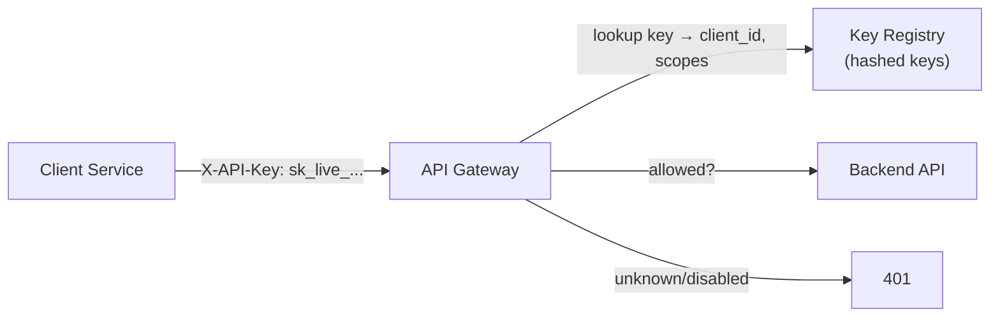
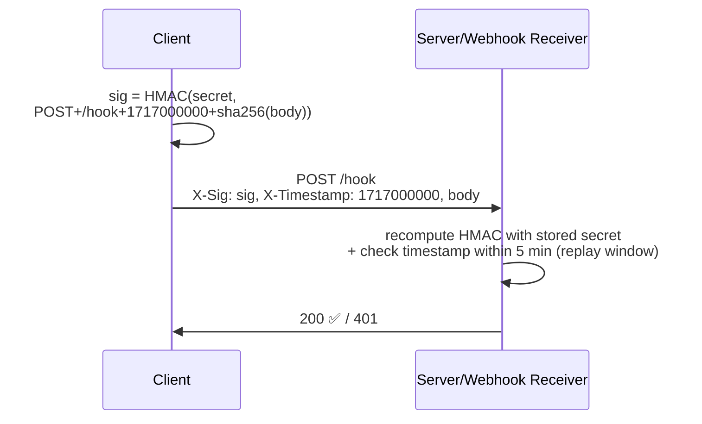
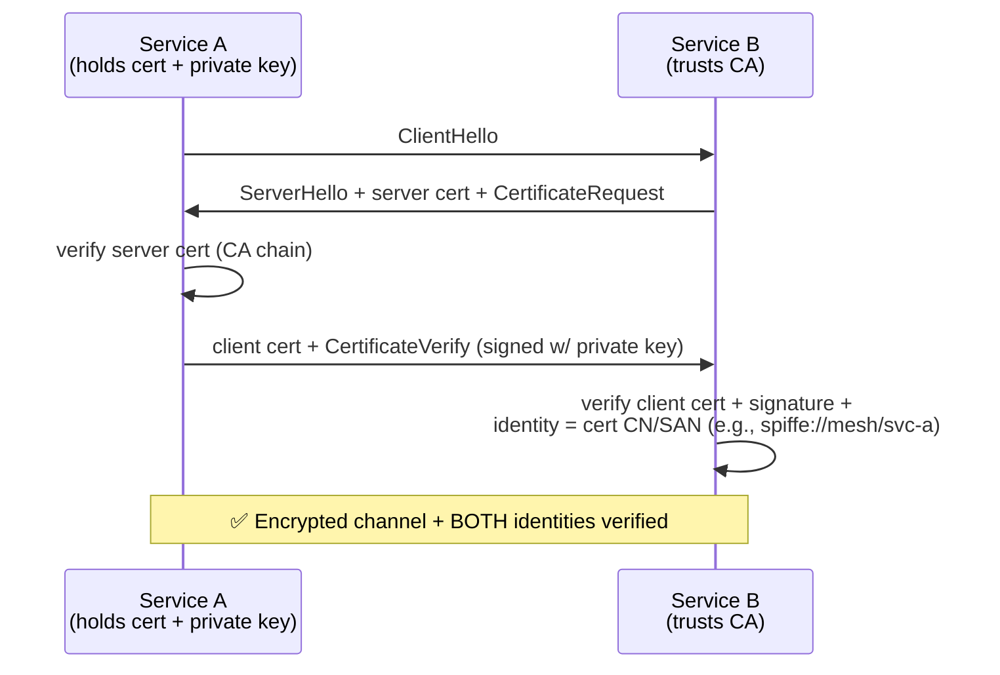
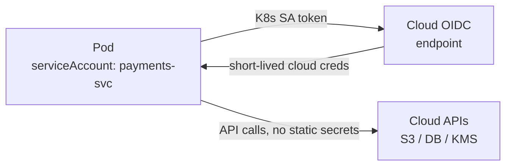

# API Keys & Service-to-Service Authentication

Machine identity: API keys, HMAC-signed requests, OAuth Client Credentials,
mTLS, and secret-less workload identity. Who is calling your API — and how
do they prove it?

---

## 1. API Keys — The Simplest Machine Credential

```text
FLOW:
  Server issues a long random key:  sk_live_7f9a2b... (shows ONCE)
  Client sends on every request:
      X-API-Key: sk_live_7f9a2b...
      (or Authorization: ApiKey <key>)

WHAT IT IS:
  A shared secret = bearer token. Whoever holds it IS the client.
  No crypto ceremony — just "does this key exist and is it enabled?"
```



```text
STRENGTHS:                      WEAKNESSES:
  ✅ Dead simple                 ❌ Bearer token — stolen = used
  ✅ Easy to rotate/revoke       ❌ No request integrity (replayable)
  ✅ Gateway-friendly            ❌ Often scoped too broadly
  ✅ Rate limiting per key       ❌ Leaks via logs, git commits

HARDENING RULES:
  ✅ Store hashed (like passwords) — never plaintext in your DB
  ✅ Prefix by environment: sk_test_ vs sk_live_ (grep-able secrets)
  ✅ Scope per key; one key per consumer, not per endpoint
  ✅ Always over TLS; never in URLs (?api_key= → logged everywhere)
  ✅ Rotation support: overlapping validity, versioned keys
  ✅ Rate-limit per key — a key IS an identity for quota purposes
```

---

## 2. HMAC-Signed Requests — Integrity + Authenticity

Used by AWS SigV4, webhook providers (Stripe, GitHub, Twilio).

```text
IDEA: don't send the secret — send a SIGNATURE made with the secret.
  Client computes: signature = HMAC_SHA256(secret,
                              method + path + timestamp + body-hash)
  Server recomputes with the stored secret → compares.
  → Secret never travels. Each request is unique (timestamp+body in sig).
```



```text
WHY WEBHOOKS USE THIS:
  Stripe → your /webhook endpoint. How do you know it's really Stripe?
  → Stripe signs body with your webhook secret. You verify HMAC.
  → Attacker posting fake "payment succeeded" events can't forge the sig.

  timestamp in signature = replay protection (old sigs expire)
  body-hash in signature = integrity (tampered body → sig mismatch)
```

```java
// Verify a Stripe-style webhook signature (concept)
String signed = timestamp + "." + rawBody;
String expected = hmacSha256(webhookSecret, signed);
if (!MessageDigest.isEqual(expected.getBytes(), sigHeader.getBytes())
        || Math.abs(now() - timestamp) > 300) {
    return 401;  // forged or replayed
}
```

---

## 3. OAuth 2.0 Client Credentials — Standardized Machine Tokens

```text
Covered fully in 05-OAuth2-OIDC-PKCE.md §6. Summary:
  Service authenticates (client_id + secret OR private_key_jwt)
  → gets short-lived access token
  → calls API with Bearer token
  → API validates JWT, checks scope

vs API KEYS:
  ✅ Standardized (every IdP supports it)
  ✅ Short-lived tokens → bounded blast radius
  ✅ Scopes built-in
  ✅ No long-lived secret on the wire (private_key_jwt option)
  ❌ More moving parts than a static key
```

---

## 4. mTLS — Certificate-Based Mutual Authentication

```text
One-way TLS:  server proves identity to client (HTTPS as usual)
mTLS:         client ALSO presents a certificate — server verifies it.

  → Service A can ONLY be Service A if it holds cert's private key.
  → No passwords, no tokens, no secrets on the wire — the handshake
     IS authentication.
```



```text
WHERE IT RUNS:
  • Service mesh (Istio/Linkerd) — automatic mTLS between all pods,
    identity = SPIFFE ID (spiffe://cluster/ns/service-a)
  • Zero-trust networks — "never trust the network, always verify"
  • B2B APIs — partner presents client cert

STRENGTHS:                        OPERATIONAL COST:
  ✅ Phishing-proof, replay-proof  ❌ Certificate issuance/rotation infra
  ✅ No secrets to leak/rotate     ❌ Short-lived certs → automation needed
  ✅ Transport-layer = app-free     (SPIFFE/SPIRE, cert-manager, step-ca)
```

---

## 5. Workload Identity — The Secret-less Endgame

```text
PROBLEM WITH ALL SECRETS: they must be stored, rotated, and can leak.
WORKLOAD IDENTITY: the PLATFORM vouches for the workload. No secrets.

  AWS:   EC2/Lambda gets IAM role → metadata service hands out
         auto-rotated credentials. Code never sees a key.
  GCP:   Service accounts via metadata server.
  K8s:   ServiceAccount tokens → OIDC federation → exchange for
         cloud creds (IRSA on EKS, Workload Identity on GKE/Azure).
  SPIFFE/SPIRE: platform issues SVIDs (x.509/JWT) to workloads.
```



```text
BEST PRACTICE 2024+:
  Prefer workload identity > OAuth Client Credentials > mTLS (when mesh
  exists) > HMAC-signed requests > API keys > Basic auth.
  Every hop down the list adds a secret you must manage and rotate.
```

---

## 6. Secret Management — Where Credentials Live

```text
NEVER:
  ❌ Hardcoded in source (git history = forever leaked)
  ❌ In plain env vars visible via /proc or crash dumps without encryption
  ❌ In config files committed to repos
  ❌ In CI logs (mask them!)

CORRECT:
  ✅ Secrets manager: HashiCorp Vault, AWS Secrets Mgr, Azure Key Vault
  ✅ Injected at runtime (env, volume, or SDK fetch)
  ✅ Auto-rotation configured; audit logging on access
  ✅ Least privilege: one secret per service per purpose
  ✅ Scan repos: gitleaks, trufflehog, GitHub secret scanning
```

---

## 7. Comparison — Service-to-Service Mechanisms

| Mechanism | Secret on wire? | Replay safe | Expiry built-in | Best for |
|-----------|----------------|-------------|-----------------|----------|
| API Key | ✅ bearer | ❌ | Manual | Public APIs, partner access, dev |
| HMAC-signed | ❌ (signature) | ✅ w/ timestamp | Via timestamp | Webhooks, request integrity |
| Client Credentials | ❌ (post-exchange) | ⚠️ bearer token | ✅ short TTL | Service → service, standard |
| mTLS | ❌ | ✅ handshake | Cert expiry | Zero-trust mesh, B2B |
| Workload Identity | ❌ | ✅ | ✅ auto | Cloud-native, K8s |

---

## 8. Best Practices

```text
✅ Cloud/K8s → workload identity first; no stored secrets at all
✅ Service mesh present → let mTLS handle it (don't double-layer)
✅ No mesh → Client Credentials w/ private_key_jwt or mTLS
✅ Webhooks → always verify HMAC signatures + timestamp window
✅ API keys → hashed storage, per-consumer, scoped, rate-limited
✅ Everything → TLS, short TTLs, rotation, audit logs
❌ Long-lived bearer secrets where a handshake or signature works
❌ One shared "god key" across consumers — kills attribution & revocation
❌ Secrets in URLs, logs, source control — anywhere they persist
```

> Next: `10-Best-Practices-Decision-Guide.md` — the decision tree and
> comparison cheat sheet tying all mechanisms together.
