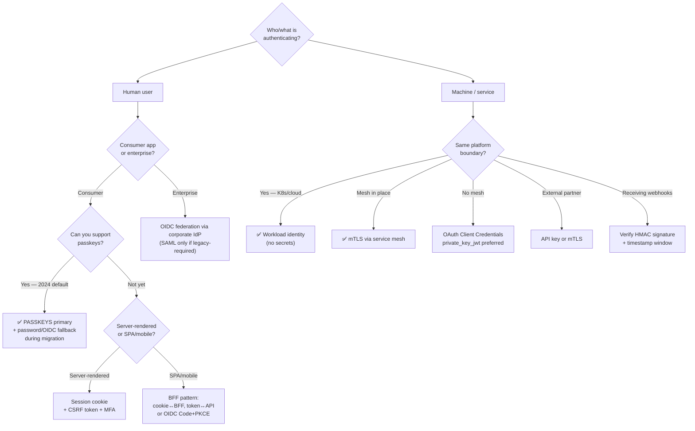
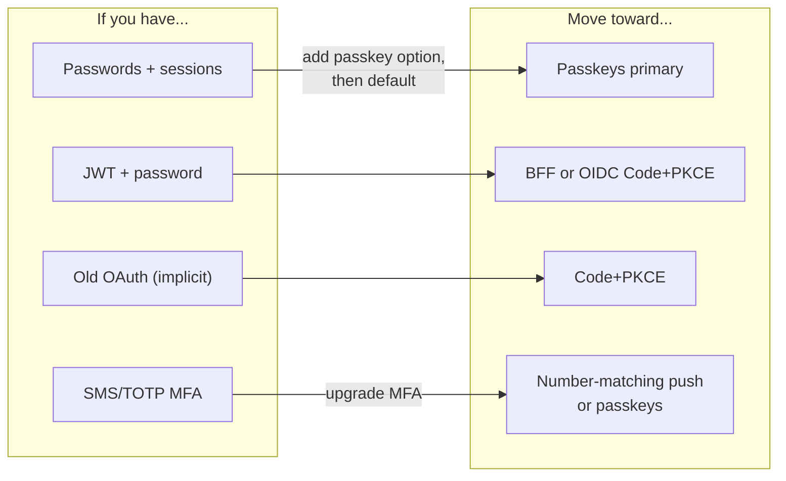

# Authentication — Best Practices & Decision Guide

The cheat sheet: which mechanism for which scenario, the decision tree,
the universal rules, and interview-ready answers.

---

## 1. The Decision Tree



---

## 2. Scenario → Best Mechanism

| Scenario | Recommended | Backup |
|----------|------------|--------|
| Consumer login 2024+ | **Passkeys** | OIDC social (Google/Apple) |
| Enterprise workforce | **OIDC via IdP** (Entra/Okta) | SAML if app is legacy |
| Server-rendered web app | Session cookie + CSRF + MFA | — |
| SPA | **BFF** (cookie↔BFF, token↔API) | OIDC Code+PKCE directly |
| Mobile app | OIDC Code+PKCE | Passkeys native |
| 3rd-party API access | OAuth Code+PKCE | — |
| Service → service (K8s) | **Workload identity / mTLS mesh** | Client Credentials |
| Service → service (no mesh) | mTLS or Client Credentials | HMAC-signed requests |
| Webhook receiver | HMAC signature verification | IP allowlist (weak) |
| Public API keys | Scoped, hashed, rate-limited keys | OAuth Client Creds |
| Internal dev tooling | Basic over TLS *only* | Client Credentials |
| High-value accounts (admin/finance) | Hardware key (FIDO2) + step-up | Passkey |

---

## 3. Universal Rules — Apply to EVERYTHING

```text
TRANSPORT:
  ✅ TLS 1.3 everywhere — no auth mechanism survives plaintext transport
  ✅ HSTS enabled; no downgrade paths
  ✅ Never credentials in URLs (logs, referrer, history all leak)

SECRETS & STORAGE:
  ✅ Passwords → Argon2id/bcrypt, never reversible storage
  ✅ Tokens/keys at rest → hashed or in secrets manager
  ✅ Never log credentials, tokens, session IDs, OTP codes
  ✅ Rotate everything; assume every secret eventually leaks

TOKENS & SESSIONS:
  ✅ Short access TTL (5–15 min) + refresh rotation + reuse detection
  ✅ Cookies: HttpOnly + Secure + SameSite=Lax
  ✅ Rotate session ID on login & privilege change
  ✅ BFF for browsers — tokens never in client JS

FLOWS:
  ✅ OAuth: Authorization Code + PKCE — every client type
  ✅ Validate state + nonce + redirect_uri exact-match
  ✅ MFA: phishing-resistant preferred; number-matching for push
  ✅ Step-up auth for sensitive ops (payment, email change, admin)
  ✅ Recovery stronger than primary auth — never a weak-factor reset

ATTACK SURFACE:
  ✅ Rate-limit auth endpoints (login, OTP verify, token exchange)
  ✅ Constant-time comparisons for secrets (timing attacks)
  ✅ Least privilege: scope tokens/keys narrowly
  ✅ Audit logging on auth events; alert on anomalies
  ✅ Deprovision fast — leavers lose access in minutes, not days
```

---

## 4. The "Why Not X" — Interview Answers

```text
WHY NOT BASIC AUTH?
  Sends credentials every request; Base64 ≠ encryption; no revocation,
  no MFA, no sessions. Only acceptable for internal/dev over TLS.

WHY NOT JUST JWT EVERYWHERE?
  Revocation requires lookups anyway; XSS steals tokens from localStorage;
  "stateless" doesn't mean "secure." Use BFF or short TTL + rotation.

WHY NOT IMPLICIT FLOW?
  Token in the browser URL → leaks via history/extensions. PKCE made it
  obsolete. Dead per OAuth Security BCP.

WHY NOT SMS OTP?
  SIM-swap + SS7 intercept + phishable relay. NIST restricted. Last resort
  fallback only — never primary MFA.

WHY NOT TOTP ALONE?
  Real-time phishing proxies relay the code inside its 30s window.
  Better than SMS, still phishable. Use phishing-resistant (passkey/FIDO2).

WHY PASSWORDS ALONE ARE DONE?
  Reuse + breach + phishing + brute force. Single factor = single point
  of failure. Passkeys fix the crypto, MFA fixes the single-factor.

WHY PASSKEYS WIN:
  Origin-bound at crypto level (phishing impossible), nothing to steal
  from server DB (public keys only), 2-in-1 factors (device+biometric),
  synced across devices. Fixes passwords' EVERY flaw at once.
```

---

## 5. Migration Path — Old to New



```text
PRACTICAL ROLLOUT (passkeys):
  1. Keep password login working — add "Create a passkey" prompt post-login
  2. Once user has a passkey → default to it; password becomes fallback
  3. After adoption threshold → password optional for passkey users
  4. Recovery flow = re-verify strongly, then enroll a NEW passkey
```

---

## 6. Compliance & Standards Cheat Sheet

| Standard / BCP | What it says |
|---------------|--------------|
| OAuth 2.0 Security BCP (RFC 9700) | Code+PKCE always, no implicit, exact redirect matching |
| OAuth 2.1 (draft) | Removes implicit + password grant entirely |
| NIST 800-63B | SMS restricted, phishing-resistant factors for AAL2+, no periodic forced rotation |
| FIDO2 / WebAuthn Level 2+ | Passkeys, cross-device auth, user verification |
| OWASP ASVS / Cheat Sheets | Session, cookie, token, MFA hardening baselines |

---

## 7. The One-Line Summary

```text
  1996 → send the password (Basic)
  2000 → send the password once, keep a session
  2012 → send a token someone issued you (OAuth/JWT)
  2016 → send a token + prove a second factor
  2022 → send nothing secret — sign a challenge (Passkeys)

  THE ARC: fewer secrets on the wire → fewer secrets in the DB →
           secrets that never leave your device. That IS the history
           of authentication in one line.
```

---

## Back to Fundamentals

- `01-History-And-Fundamentals.md` — the full evolution story
- `../TLS/` + `../TLS-mTLS/` — the transport security underneath everything
- `../../SpringBootRoadmap/Distributed-Patterns/04-Backpressure-Pattern.md` —
  protecting the auth endpoints themselves from overload
