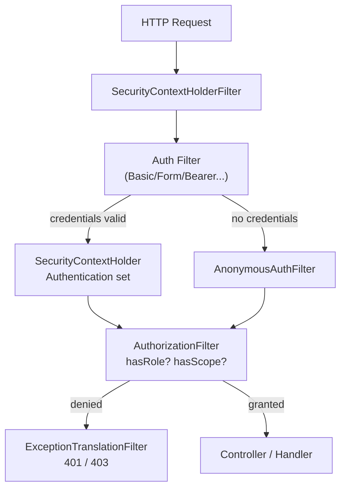
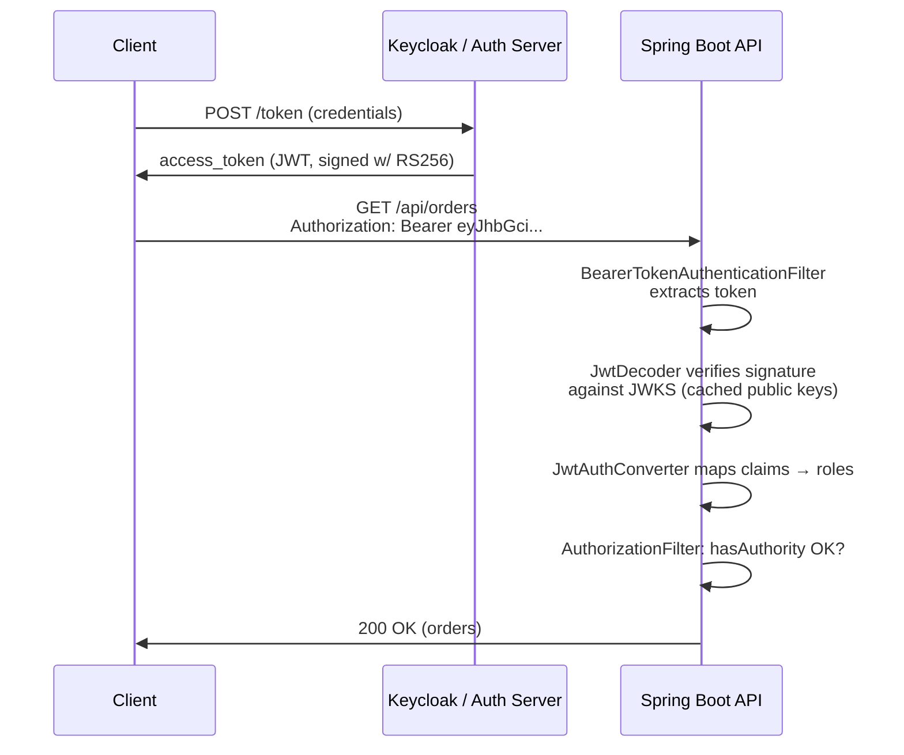
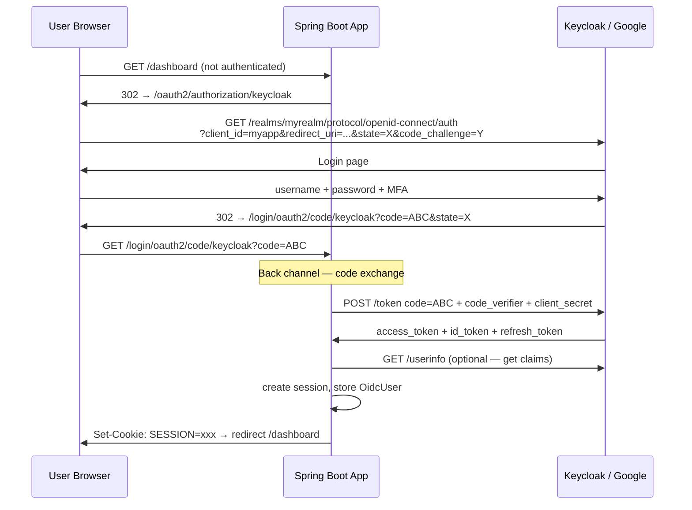
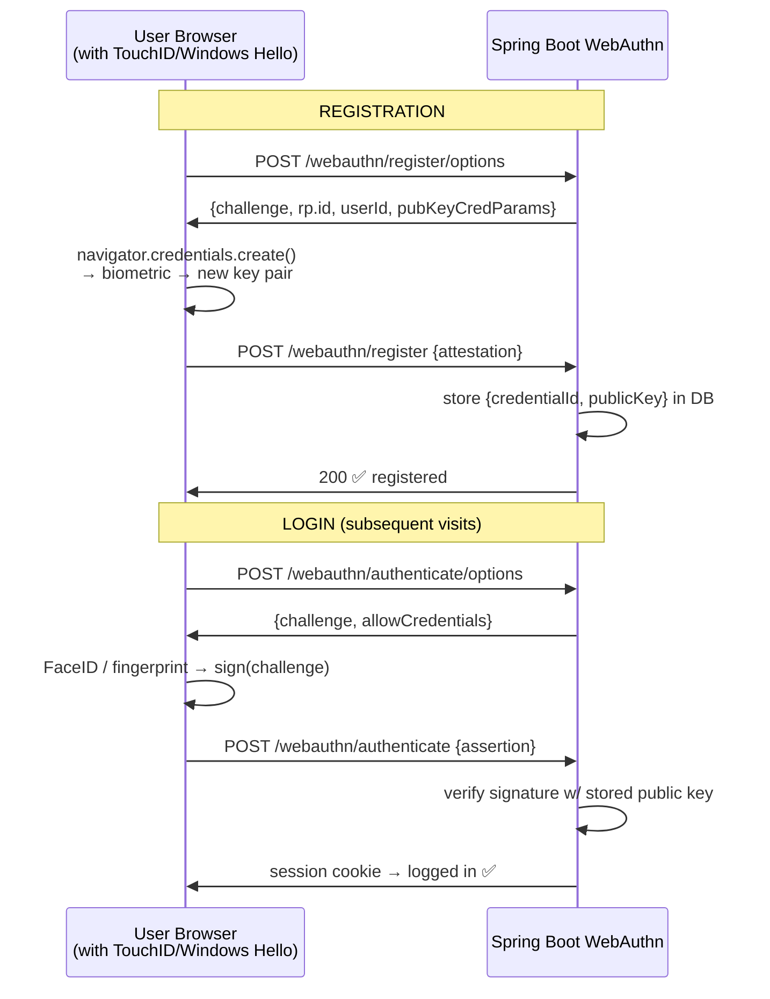
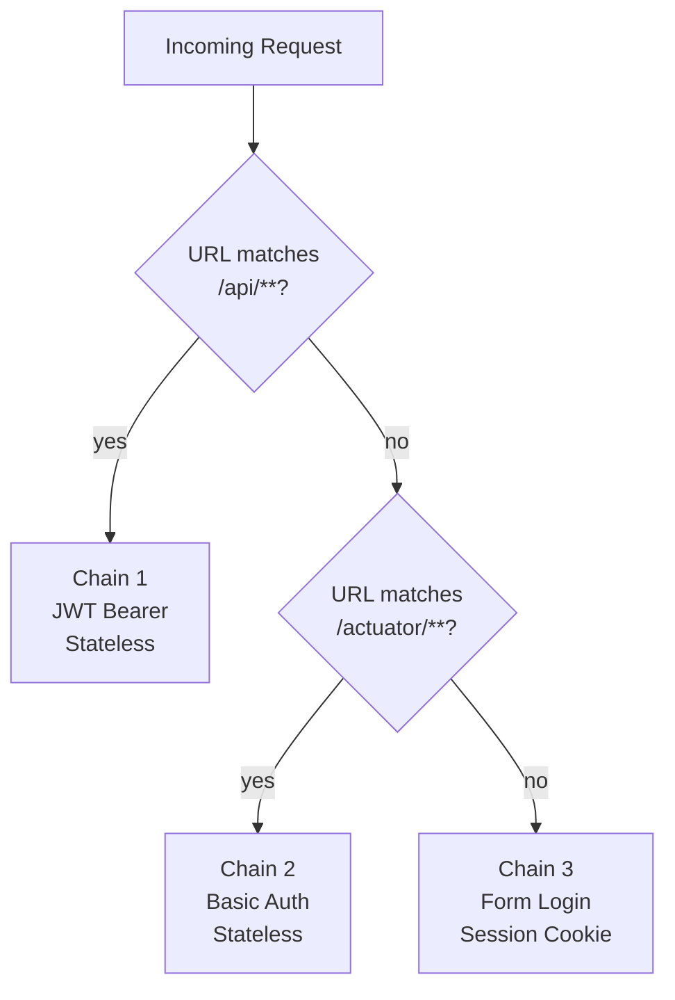

# Spring Security — Implementation Guide for Every Auth Mechanism

How to wire up each authentication mechanism in Spring Boot 3.x / Spring
Security 6.x. Complete filter chain configs, properties, and the mental
model for how Spring Security processes a request.

---

## 1. How Spring Security Processes a Request — The Mental Model

```text
Every HTTP request passes through a FILTER CHAIN before reaching your controller.

  Request
    │
    ▼
┌─────────────────────────────────────────────────────────────────────┐
│  SecurityFilterChain (ordered list of filters)                      │
│                                                                     │
│  1. SecurityContextHolderFilter    ← restore SecurityContext        │
│  2. UsernamePasswordAuthFilter     ← form login                     │
│  3. BasicAuthenticationFilter      ← Basic Auth                     │
│  4. BearerTokenAuthenticationFilter← JWT / OAuth tokens            │
│  5. AnonymousAuthenticationFilter  ← fallback anonymous             │
│  6. ExceptionTranslationFilter     ← 401/403 handling              │
│  7. AuthorizationFilter            ← access decisions               │
└─────────────────────────────────────────────────────────────────────┘
    │
    ▼
  DispatcherServlet → Controller

  On successful auth:
    Filter sets SecurityContextHolder.getContext().setAuthentication(...)
    → available throughout the request via @AuthenticationPrincipal
```



```xml
<!-- pom.xml — Spring Boot 3.x Security starter -->
<dependency>
    <groupId>org.springframework.boot</groupId>
    <artifactId>spring-boot-starter-security</artifactId>
</dependency>
```

---

## 2. Form Login + Session — Server-Rendered Apps

```java
@Configuration
@EnableWebSecurity
public class FormLoginConfig {

    @Bean
    SecurityFilterChain web(HttpSecurity http) throws Exception {
        http
            .authorizeHttpRequests(auth -> auth
                .requestMatchers("/login", "/public/**", "/css/**").permitAll()
                .requestMatchers("/admin/**").hasRole("ADMIN")
                .anyRequest().authenticated())

            .formLogin(form -> form
                .loginPage("/login")                     // custom login page
                .loginProcessingUrl("/login")            // POST target
                .defaultSuccessUrl("/dashboard", true)
                .failureUrl("/login?error")
                .usernameParameter("username")
                .passwordParameter("password")
                .permitAll())

            .logout(logout -> logout
                .logoutUrl("/logout")
                .logoutSuccessUrl("/login?logout")
                .invalidateHttpSession(true)
                .deleteCookies("JSESSIONID")
                .clearAuthentication(true))

            .rememberMe(rm -> rm
                .tokenValiditySeconds(7 * 24 * 3600)    // 7 days
                .key("super-secret-remember-me-key")     // sign the cookie
                .tokenRepository(persistentTokenRepository()))

            .csrf(Customizer.withDefaults())             // MUST be on for browsers
            .sessionManagement(s -> s
                .sessionFixation().migrateSession()      // new ID on login
                .maximumSessions(1)
                .expiredUrl("/login?expired"));

        return http.build();
    }

    @Bean
    PasswordEncoder encoder() {
        return Argon2PasswordEncoder.defaultsForSpringSecurity_v5_8();
    }

    @Bean                                                // "remember me" in DB
    PersistentTokenRepository persistentTokenRepository(DataSource ds) {
        JdbcTokenRepositoryImpl r = new JdbcTokenRepositoryImpl();
        r.setDataSource(ds);
        return r;
    }
}
```

```java
// UserDetailsService — load user from YOUR DB
@Service
@RequiredArgsConstructor
public class AppUserDetailsService implements UserDetailsService {

    private final UserRepository userRepo;

    @Override
    public UserDetails loadUserByUsername(String username) {
        User u = userRepo.findByEmail(username)
            .orElseThrow(() -> new UsernameNotFoundException("Not found: " + username));
        return org.springframework.security.core.userdetails.User.builder()
            .username(u.getEmail())
            .password(u.getPasswordHash())   // already Argon2/bcrypt encoded
            .roles(u.getRoles().toArray(String[]::new))
            .build();
    }
}
```

```yaml
# application.yml — Spring Session Redis (multi-instance)
spring:
  session:
    store-type: redis
    redis:
      namespace: myapp:sessions
  data.redis:
    host: redis
    port: 6379
server:
  servlet.session:
    cookie:
      http-only: true
      secure: true
      same-site: lax
      max-age: 30m
    timeout: 30m
```

---

## 3. HTTP Basic Auth — Internal / Dev APIs

```java
@Bean
SecurityFilterChain internalApi(HttpSecurity http) throws Exception {
    http
        .securityMatcher("/internal/**", "/actuator/**")
        .authorizeHttpRequests(a -> a
            .requestMatchers("/actuator/health").permitAll()
            .anyRequest().hasRole("INTERNAL"))
        .httpBasic(basic -> basic.realmName("internal-api"))
        .csrf(AbstractHttpConfigurer::disable)
        .sessionManagement(s ->
            s.sessionCreationPolicy(SessionCreationPolicy.STATELESS));
    return http.build();
}
```

---

## 4. JWT Resource Server — Stateless API

This is what you use when a separate Auth Server (Keycloak / Auth0 / Okta)
issues the tokens. Your API just **validates** them.

```java
@Configuration
@EnableWebSecurity
@EnableMethodSecurity                                    // @PreAuthorize etc.
public class ResourceServerConfig {

    @Bean
    SecurityFilterChain api(HttpSecurity http) throws Exception {
        http
            .authorizeHttpRequests(auth -> auth
                .requestMatchers("/api/public/**").permitAll()
                .requestMatchers("/api/admin/**").hasAuthority("SCOPE_admin")
                .anyRequest().authenticated())

            .oauth2ResourceServer(rs -> rs
                .jwt(jwt -> jwt
                    .jwtAuthenticationConverter(jwtAuthConverter())))

            .csrf(AbstractHttpConfigurer::disable)       // stateless — no CSRF
            .sessionManagement(s ->
                s.sessionCreationPolicy(SessionCreationPolicy.STATELESS));

        return http.build();
    }

    // Maps JWT claims → Spring Security authorities
    @Bean
    JwtAuthenticationConverter jwtAuthConverter() {
        JwtGrantedAuthoritiesConverter grantedAuthoritiesConverter =
            new JwtGrantedAuthoritiesConverter();
        grantedAuthoritiesConverter.setAuthoritiesClaimName("roles");  // Keycloak realm_access.roles
        grantedAuthoritiesConverter.setAuthorityPrefix("ROLE_");

        JwtAuthenticationConverter converter = new JwtAuthenticationConverter();
        converter.setJwtGrantedAuthoritiesConverter(grantedAuthoritiesConverter);
        return converter;
    }
}
```

```yaml
# Validate against Keycloak issuer (fetches JWKS automatically)
spring:
  security:
    oauth2:
      resourceserver:
        jwt:
          issuer-uri: http://keycloak:8080/realms/myrealm
          # Spring fetches: {issuer-uri}/.well-known/openid-configuration
          # → gets jwks_uri → downloads public keys → validates signatures
```

```java
// Controller — access authenticated user's claims
@RestController
@RequestMapping("/api/orders")
public class OrderController {

    @GetMapping
    @PreAuthorize("hasAuthority('SCOPE_orders:read')")
    public List<Order> list(@AuthenticationPrincipal Jwt jwt) {
        String userId = jwt.getSubject();
        String email  = jwt.getClaimAsString("email");
        List<String> roles = jwt.getClaimAsStringList("roles");
        return orderService.findByUser(userId);
    }
}
```



---

## 5. OAuth2 Login — "Sign In with Google/GitHub/Keycloak"

Your Spring Boot app acts as an **OAuth2 Client** performing OIDC login.

```java
@Bean
SecurityFilterChain oidcLogin(HttpSecurity http) throws Exception {
    http
        .authorizeHttpRequests(a -> a
            .requestMatchers("/", "/login").permitAll()
            .anyRequest().authenticated())
        .oauth2Login(login -> login
            .loginPage("/login")
            .defaultSuccessUrl("/dashboard")
            .userInfoEndpoint(ui -> ui
                .oidcUserService(oidcUserService())));  // customize user loading
    return http.build();
}

@Bean
OidcUserService oidcUserService() {
    OidcUserService delegate = new OidcUserService();
    return oidcUserRequest -> {
        OidcUser oidcUser = delegate.loadUser(oidcUserRequest);
        // sync user to your DB, add custom authorities, etc.
        return oidcUser;
    };
}
```

```yaml
# application.yml — multiple providers
spring:
  security:
    oauth2:
      client:
        registration:
          google:
            client-id: ${GOOGLE_CLIENT_ID}
            client-secret: ${GOOGLE_CLIENT_SECRET}
            scope: openid, email, profile
          github:
            client-id: ${GITHUB_CLIENT_ID}
            client-secret: ${GITHUB_CLIENT_SECRET}
            scope: read:user, user:email
          keycloak:
            client-id: myapp
            client-secret: ${KC_CLIENT_SECRET}
            authorization-grant-type: authorization_code
            redirect-uri: "{baseUrl}/login/oauth2/code/keycloak"
            scope: openid, email, profile, roles
        provider:
          keycloak:
            issuer-uri: http://keycloak:8080/realms/myrealm
```



---

## 6. OAuth2 Client Credentials — Service Calling Another API

Your service calls an external/internal API using a machine token.

```java
@Configuration
public class OAuth2ClientConfig {

    @Bean
    OAuth2AuthorizedClientManager authorizedClientManager(
            ClientRegistrationRepository clients,
            OAuth2AuthorizedClientRepository clientRepo) {

        OAuth2AuthorizedClientProvider provider =
            OAuth2AuthorizedClientProviderBuilder.builder()
                .clientCredentials()   // auto-fetches + caches token
                .refreshToken()
                .build();

        DefaultOAuth2AuthorizedClientManager manager =
            new DefaultOAuth2AuthorizedClientManager(clients, clientRepo);
        manager.setAuthorizedClientProvider(provider);
        return manager;
    }

    @Bean
    WebClient reportingClient(OAuth2AuthorizedClientManager manager) {
        ServletOAuth2AuthorizedClientExchangeFilterFunction filter =
            new ServletOAuth2AuthorizedClientExchangeFilterFunction(manager);
        filter.setDefaultClientRegistrationId("reporting-service");

        return WebClient.builder()
            .baseUrl("http://reporting-service")
            .apply(filter.oauth2Configuration())
            .build();
    }
}
```

```yaml
spring:
  security:
    oauth2:
      client:
        registration:
          reporting-service:
            provider: keycloak
            client-id: order-service
            client-secret: ${ORDER_SVC_SECRET}
            authorization-grant-type: client_credentials
            scope: reports:read
        provider:
          keycloak:
            token-uri: http://keycloak:8080/realms/myrealm/protocol/openid-connect/token
```

```java
// Service — WebClient auto-attaches the Bearer token
@Service
@RequiredArgsConstructor
public class ReportingGateway {

    private final WebClient reportingClient;

    public Mono<ReportDto> getReport(String id) {
        return reportingClient.get()
            .uri("/api/reports/{id}", id)
            .retrieve()
            .bodyToMono(ReportDto.class);
        // Spring auto-fetches & caches a client-credentials token
        // refreshes transparently when it expires
    }
}
```

---

## 7. MFA — TOTP with Spring Security

Spring Security 6.4+ has native MFA support. Manual pattern below for
earlier versions or full control:

```java
@Component
@RequiredArgsConstructor
public class MfaAuthenticationProvider implements AuthenticationProvider {

    private final UserDetailsService userDetailsService;
    private final PasswordEncoder encoder;
    private final TotpService totpService;   // your TOTP verifier

    @Override
    public Authentication authenticate(Authentication authentication) {
        MfaAuthenticationToken token = (MfaAuthenticationToken) authentication;
        UserDetails user = userDetailsService.loadUserByUsername(token.getName());

        if (!encoder.matches(token.getPassword(), user.getPassword())) {
            throw new BadCredentialsException("Invalid password");
        }
        if (!totpService.verify(user.getTotpSecret(), token.getTotpCode())) {
            throw new BadCredentialsException("Invalid TOTP code");
        }
        return new UsernamePasswordAuthenticationToken(
            user, null, user.getAuthorities());
    }

    @Override
    public boolean supports(Class<?> auth) {
        return MfaAuthenticationToken.class.isAssignableFrom(auth);
    }
}
```

```java
// Step-up MFA — require fresh auth for sensitive ops
@Bean
SecurityFilterChain stepUp(HttpSecurity http) throws Exception {
    http.authorizeHttpRequests(a -> a
        .requestMatchers("/payment/**")
            .access(new WebExpressionAuthorizationManager(
                "isAuthenticated() and @mfaChecker.isMfaFresh(authentication)")));
    return http.build();
}
```

---

## 8. Passkeys / WebAuthn — Spring Security 6.4+

```java
@Bean
SecurityFilterChain passkeys(HttpSecurity http) throws Exception {
    http
        .authorizeHttpRequests(a -> a.anyRequest().authenticated())
        .webAuthn(w -> w
            .rpName("My App")
            .rpId("app.com")                             // domain — MUST match origin
            .allowedOrigins("https://app.com"))
        .formLogin(Customizer.withDefaults());            // password fallback
    return http.build();
}
```

```yaml
spring:
  security:
    user:
      name: user                   # dev only — replace with UserDetailsService
```



---

## 9. Multiple Security Filter Chains — Mixing Mechanisms

Real apps often need different auth for different URL spaces:

```java
@Configuration
@EnableWebSecurity
public class MultiChainSecurityConfig {

    // Chain 1: Public REST API — JWT tokens (highest priority)
    @Bean
    @Order(1)
    SecurityFilterChain apiChain(HttpSecurity http) throws Exception {
        http
            .securityMatcher("/api/**")
            .authorizeHttpRequests(a -> a
                .requestMatchers("/api/public/**").permitAll()
                .anyRequest().authenticated())
            .oauth2ResourceServer(rs -> rs.jwt(Customizer.withDefaults()))
            .sessionManagement(s ->
                s.sessionCreationPolicy(SessionCreationPolicy.STATELESS))
            .csrf(AbstractHttpConfigurer::disable);
        return http.build();
    }

    // Chain 2: Internal actuator — Basic Auth
    @Bean
    @Order(2)
    SecurityFilterChain actuatorChain(HttpSecurity http) throws Exception {
        http
            .securityMatcher("/actuator/**")
            .authorizeHttpRequests(a -> a
                .requestMatchers("/actuator/health").permitAll()
                .anyRequest().hasRole("ACTUATOR"))
            .httpBasic(Customizer.withDefaults())
            .sessionManagement(s ->
                s.sessionCreationPolicy(SessionCreationPolicy.STATELESS))
            .csrf(AbstractHttpConfigurer::disable);
        return http.build();
    }

    // Chain 3: Browser UI — Form Login + Sessions (lowest priority / catch-all)
    @Bean
    @Order(3)
    SecurityFilterChain webChain(HttpSecurity http) throws Exception {
        http
            .authorizeHttpRequests(a -> a
                .requestMatchers("/", "/login", "/css/**").permitAll()
                .anyRequest().authenticated())
            .formLogin(Customizer.withDefaults())
            .logout(Customizer.withDefaults())
            .csrf(Customizer.withDefaults());
        return http.build();
    }
}
```



---

## 10. Method Security — Authorizing at the Method Level

```java
@EnableMethodSecurity          // on @Configuration class
public class SecurityConfig { }

@Service
public class OrderService {

    @PreAuthorize("hasRole('ADMIN') or #userId == authentication.name")
    public Order getOrder(String orderId, String userId) { ... }

    @PreAuthorize("hasAuthority('SCOPE_orders:write')")
    public Order createOrder(OrderRequest req) { ... }

    @PostAuthorize("returnObject.ownerId == authentication.name")
    public Order findById(String id) { ... }    // checks AFTER method runs

    @PreFilter("filterObject.ownerId == authentication.name")
    public void deleteAll(List<Order> orders) { ... }  // filters input list
}
```

---

## Quick Reference — Dependency by Mechanism

| Mechanism | Maven artifact | Key autoconfiguration |
|-----------|---------------|----------------------|
| Form Login / Session | `spring-boot-starter-security` | `SecurityAutoConfiguration` |
| JWT Resource Server | `spring-boot-starter-security` + `spring-boot-starter-oauth2-resource-server` | `OAuth2ResourceServerAutoConfiguration` |
| OAuth2 Login (OIDC) | `spring-boot-starter-security` + `spring-boot-starter-oauth2-client` | `OAuth2ClientAutoConfiguration` |
| OAuth2 Client (CC) | `spring-boot-starter-oauth2-client` + `spring-webflux` (for WebClient) | manual `WebClient` bean |
| Passkeys | `spring-boot-starter-security` (≥ 3.4) | manual `webAuthn()` DSL |
| Redis Sessions | `spring-session-data-redis` | `SessionAutoConfiguration` |
| SAML 2.0 | `spring-security-saml2-service-provider` | manual |

> Continue to `12-Identity-Providers-Keycloak-PingID.md` — where the
> Auth Server lives and how Keycloak, Auth0, Okta, PingID fit the picture.
