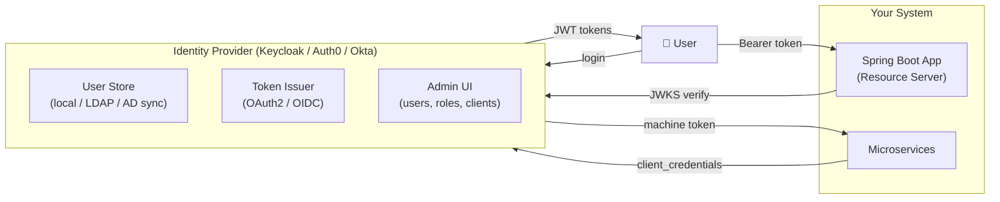
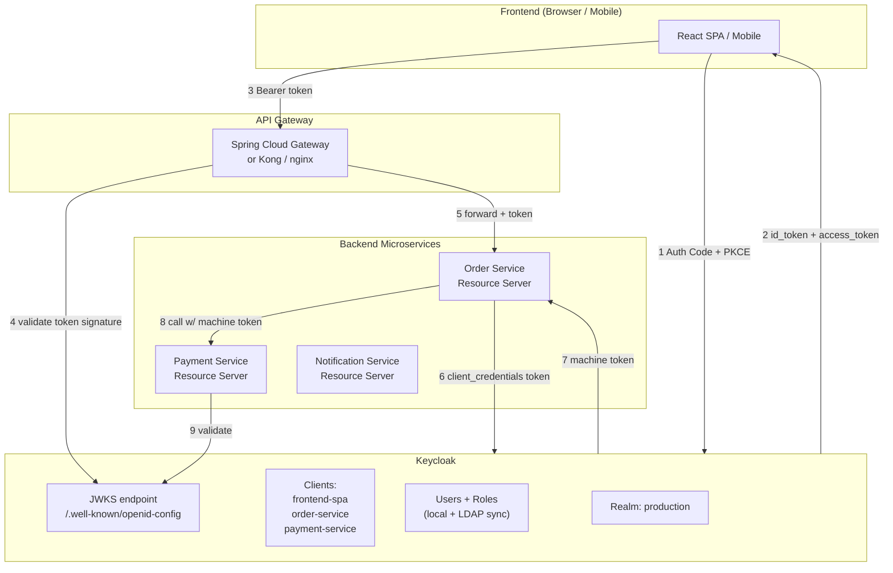
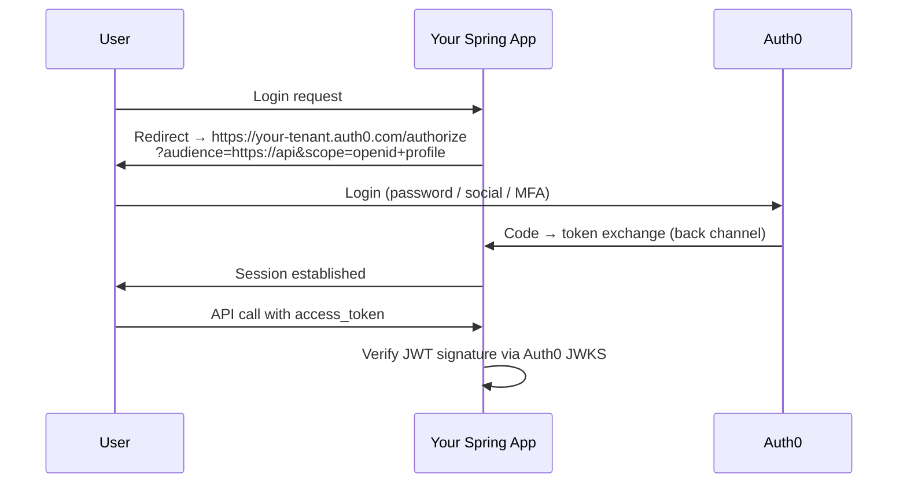
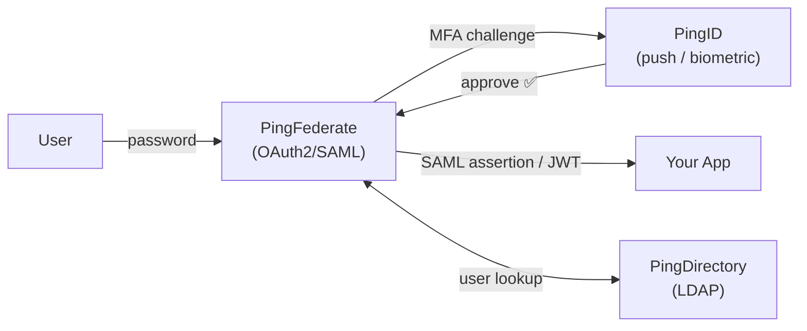
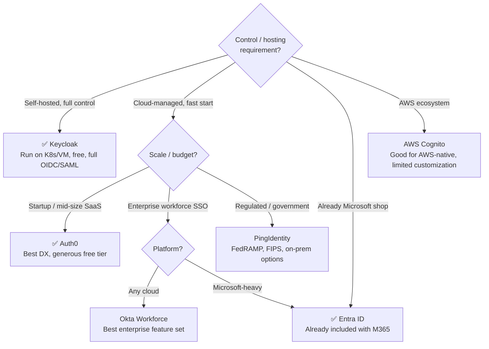
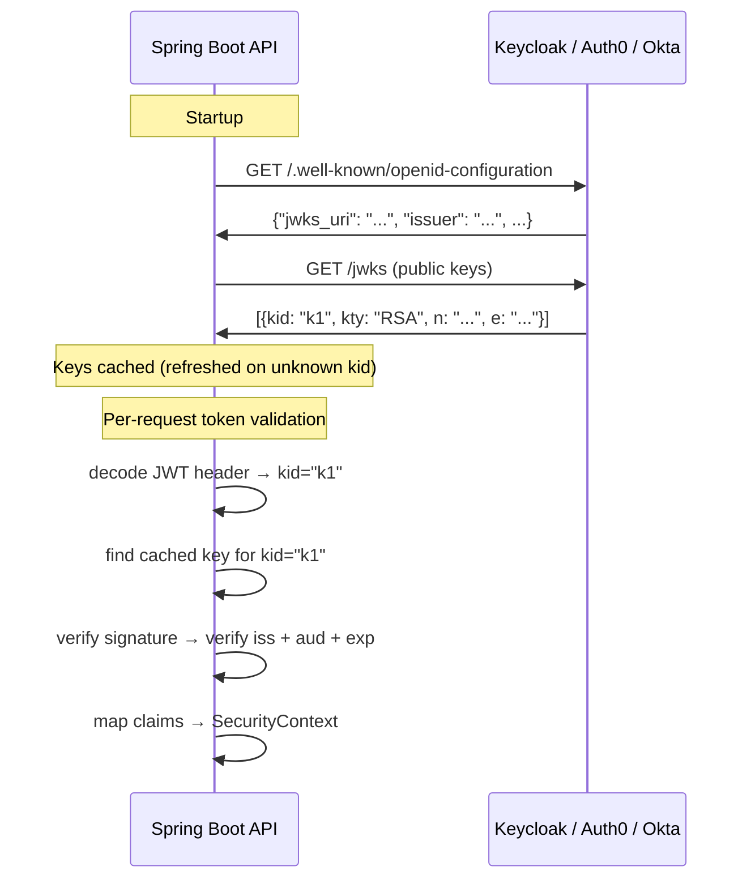

# Identity Providers — Keycloak, Auth0, Okta, PingID, Entra ID

Where the actual "login" happens in modern architectures. What an Auth Server
is, how every provider compares, and exactly how Keycloak fits into a Spring
Boot microservice system with full mermaid diagrams.

---

## 1. What Is an Identity Provider (IdP) / Authorization Server?

```text
IN OAUTH/OIDC TERMS:
  Authorization Server = issues tokens (access token, ID token, refresh token)
  Identity Provider    = knows WHO you are (stores users, validates credentials)

  In practice: products like Keycloak, Auth0, Okta do BOTH —
  they are the IdP/AS combined.

YOUR APP'S JOB BECOMES:
  ① Redirect user to IdP for login
  ② Trust the token the IdP issues (verify signature via JWKS)
  ③ Use claims in that token for authorization
  → Your app NEVER sees or stores passwords
  → Password policy, MFA, lockout, audit — all delegated to the IdP
```



---

## 2. Key Concepts All Providers Share

```text
REALM / TENANT    = isolated namespace for users, clients, roles
                    Keycloak: "realm"  |  Auth0/Okta: "tenant"

CLIENT            = an app registered with the IdP
                    → has client_id, client_secret, allowed redirect_uris, scopes

SCOPE             = what the token permits: openid, email, profile, orders:read

JWKS ENDPOINT     = public URL where the IdP publishes its public keys
                    Spring auto-fetches this and caches it:
                    {issuer}/.well-known/openid-configuration → jwks_uri

USER FEDERATION   = IdP syncing users FROM your existing LDAP/Active Directory
                    → users log in with AD credentials, IdP issues tokens

SOCIAL LOGIN      = IdP brokering login via Google, GitHub, Apple
                    → IdP handles the OIDC dance, issues its OWN tokens to your app

SSO SESSION       = once logged into the IdP, every client app gets tokens
                    without re-entering credentials → true single sign-on
```

---

## 3. The Provider Landscape

| | **Keycloak** | **Auth0** | **Okta** | **PingIdentity** | **Entra ID (Azure AD)** | **AWS Cognito** |
|---|---|---|---|---|---|---|
| **Type** | Open source, self-hosted | Cloud SaaS | Cloud SaaS | Enterprise (cloud+on-prem) | Cloud (Microsoft) | Cloud (AWS) |
| **Cost** | Free (infra cost only) | Free tier → paid/MAU | Paid/MAU | Enterprise pricing | Included in M365 | Free tier → MAU |
| **Hosting** | You run it (K8s, VM) | Managed | Managed | Managed or on-prem | Managed | Managed |
| **Best for** | Self-hosted, full control | Startups, SaaS apps | Enterprises | Large enterprise, PingID MFA | Microsoft/enterprise | AWS workloads |
| **OIDC/OAuth2** | ✅ Full | ✅ Full | ✅ Full | ✅ Full | ✅ Full | ✅ (limited) |
| **SAML** | ✅ | ✅ | ✅ | ✅ | ✅ | ⚠️ limited |
| **LDAP/AD federation** | ✅ built-in | ✅ (AD connector) | ✅ | ✅ | ✅ native | ✅ |
| **MFA options** | TOTP, WebAuthn, OTP | All + push | All + push | PingID (push/biometric) | All + push + FIDO2 | TOTP, SMS |
| **Passkeys** | ✅ (WebAuthn) | ✅ | ✅ | ✅ | ✅ | ⚠️ |
| **Social login** | ✅ broker | ✅ | ✅ | ✅ | ✅ | ✅ |
| **Custom flows** | ✅ (SPI extensions) | ✅ Actions | ✅ Auth Policies | ✅ | ✅ Conditional Access | ⚠️ limited |

---

## 4. Keycloak Deep Dive — Self-Hosted Auth Server

The most widely used open-source option. Powers many microservice platforms.

### Keycloak Concepts

```text
REALM     = isolated auth domain (one per environment or product)
            → dev, staging, prod each get their own realm

CLIENT    = registered app (your Spring Boot services are clients)
  Types:
    confidential → has a client_secret (server-side apps)
    public       → no secret (SPAs, mobile) → use PKCE
    bearer-only  → only validates tokens, never initiates login (microservices)

ROLE TYPES:
  Realm roles  → apply across all clients in the realm
  Client roles → scoped to a specific client
  Composite    → role that includes other roles

USER FEDERATION:
  Keycloak can sync users FROM LDAP/Active Directory
  → users authenticate via LDAP, Keycloak issues JWT tokens
```

### Keycloak + Spring Boot Microservices — Full Architecture



### Keycloak Spring Boot Config

```yaml
# application.yml — Resource Server validated against Keycloak
spring:
  security:
    oauth2:
      resourceserver:
        jwt:
          issuer-uri: http://keycloak:8080/realms/production
          # Keycloak JWKS → http://keycloak:8080/realms/production/protocol/openid-connect/certs

# Keycloak-specific: realm_access.roles claim for role mapping
```

```java
// Extract Keycloak realm roles from JWT
@Bean
JwtAuthenticationConverter keycloakJwtConverter() {
    JwtGrantedAuthoritiesConverter converter = new JwtGrantedAuthoritiesConverter();

    // Keycloak puts roles in: {"realm_access": {"roles": ["user","admin"]}}
    converter.setJwtGrantedAuthoritiesConverter(jwt -> {
        Map<String, Object> realmAccess =
            jwt.getClaimAsMap("realm_access");
        if (realmAccess == null) return List.of();

        List<String> roles = (List<String>) realmAccess.get("roles");
        return roles.stream()
            .map(r -> new SimpleGrantedAuthority("ROLE_" + r.toUpperCase()))
            .collect(Collectors.toList());
    });

    JwtAuthenticationConverter auth = new JwtAuthenticationConverter();
    auth.setJwtGrantedAuthoritiesConverter(converter.getJwtGrantedAuthoritiesConverter());
    return auth;
}
```

### Keycloak Docker — Local Dev

```yaml
# docker-compose.yml
services:
  keycloak:
    image: quay.io/keycloak/keycloak:25.0
    command: start-dev
    environment:
      KEYCLOAK_ADMIN: admin
      KEYCLOAK_ADMIN_PASSWORD: admin
    ports:
      - "8080:8080"
    volumes:
      - keycloak_data:/opt/keycloak/data

  postgres:                         # production: use postgres, not H2
    image: postgres:16
    environment:
      POSTGRES_DB: keycloak
      POSTGRES_USER: keycloak
      POSTGRES_PASSWORD: keycloak
```

```text
KEYCLOAK ENDPOINTS (realm = "myrealm"):
  Auth:     http://localhost:8080/realms/myrealm/protocol/openid-connect/auth
  Token:    http://localhost:8080/realms/myrealm/protocol/openid-connect/token
  JWKS:     http://localhost:8080/realms/myrealm/protocol/openid-connect/certs
  UserInfo: http://localhost:8080/realms/myrealm/protocol/openid-connect/userinfo
  Logout:   http://localhost:8080/realms/myrealm/protocol/openid-connect/logout
  Discovery:http://localhost:8080/realms/myrealm/.well-known/openid-configuration
```

---

## 5. Auth0 — Cloud-Managed, Zero Infrastructure

```text
BEST FOR: startups, SaaS products — no infra to manage.
  Pricing: free up to 7500 MAU (monthly active users), then per-MAU.

CONCEPTS:
  Tenant    = your isolated domain (company.auth0.com)
  Application = OAuth2 client (Regular Web App / SPA / M2M)
  API       = your resource server (registered audience)
  Action    = serverless function on auth events (add custom claims, etc.)
  Connection = identity source (database, Google, GitHub, SAML enterprise)
```

```yaml
# Auth0 Spring Boot Resource Server
spring:
  security:
    oauth2:
      resourceserver:
        jwt:
          issuer-uri: https://your-tenant.auth0.com/
          audiences: https://your-api-identifier   # validate 'aud' claim
```



---

## 6. Okta — Enterprise Cloud

```text
BEST FOR: enterprises, workforce identity (employee SSO), customer identity.
  Okta Workforce = employee-facing SSO, provisioning (SCIM), policy
  Okta Customer Identity (CIAM) = Auth0 (acquired 2021, merging)

CONCEPTS:
  Org        = tenant (company.okta.com)
  Application = OAuth2 client
  Groups     = mapped to roles/scopes in tokens
  Policies   = authentication policies (who needs MFA, which MFA types)
```

```yaml
spring:
  security:
    oauth2:
      resourceserver:
        jwt:
          issuer-uri: https://your-domain.okta.com/oauth2/default
      client:
        registration:
          okta:
            client-id: ${OKTA_CLIENT_ID}
            client-secret: ${OKTA_CLIENT_SECRET}
            scope: openid, email, profile, groups
        provider:
          okta:
            issuer-uri: https://your-domain.okta.com/oauth2/default
```

---

## 7. PingIdentity / PingID

```text
BEST FOR: very large enterprises, regulated industries (finance, healthcare,
  government) needing on-premises control + SaaS flexibility.

PRODUCTS:
  PingFederate = on-prem OAuth2/OIDC/SAML federation server
  PingID       = MFA service (push, biometric, FIDO2)
  PingOne      = cloud identity platform
  PingDirectory = LDAP/identity directory

PingID MFA FLOW:
  User logs in with password → PingFederate triggers PingID push
  → user approves on phone → SAML/OIDC assertion issued to app.

DIFFERENTIATOR: deep integration with mainframes, regulated compliance
  (FedRAMP, FIPS 140-2), complex federation scenarios.
```



---

## 8. Microsoft Entra ID (Azure AD)

```text
BEST FOR: Microsoft-heavy enterprises; Office 365 / Teams / Azure shops.
  Every Microsoft 365 tenant IS an Entra ID tenant.

KEY CONCEPTS:
  Tenant ID    = GUID identifying your org's directory
  App Registration = OAuth2 client (your Spring Boot app)
  Service Principal = the identity of the app in the directory
  Managed Identity  = Azure workload identity (no secrets for Azure services)

ENDPOINTS:
  Authority: https://login.microsoftonline.com/{tenantId}/v2.0
  JWKS:      https://login.microsoftonline.com/{tenantId}/discovery/v2.0/keys
```

```yaml
spring:
  security:
    oauth2:
      resourceserver:
        jwt:
          issuer-uri: https://login.microsoftonline.com/{tenant-id}/v2.0
      client:
        registration:
          azure:
            client-id: ${AZURE_CLIENT_ID}
            client-secret: ${AZURE_CLIENT_SECRET}
            scope: openid, email, profile, https://graph.microsoft.com/User.Read
        provider:
          azure:
            issuer-uri: https://login.microsoftonline.com/{tenant-id}/v2.0
```

---

## 9. Choosing an IdP — Decision Guide



---

## 10. JWKS — How Spring Validates Tokens From Any IdP

```text
THE MAGIC OF STANDARDS:
  Every OIDC-compliant IdP publishes:
    1. Discovery doc: {issuer}/.well-known/openid-configuration
       → JSON listing all endpoints + jwks_uri

    2. JWKS endpoint: list of public keys (kid, kty, n, e)

  Spring's JwtDecoder:
    • Fetches the discovery doc on startup
    • Fetches JWKS → caches public keys
    • On each request: verify JWT header.kid → find matching public key → verify signature
    • Rotates keys automatically when a new kid appears
```



> Continue to `13-OAuth2-Microservices-Client-Credentials.md` — deep
> dive on all OAuth grant types and microservice-specific patterns.
