# OAuth 2.0 in Microservices — All Grant Types & Client Credentials Deep Dive

Your microservices use `client_credentials`. This file explains what that
means, all 7 OAuth grant types with diagrams, how services call each other
securely, token propagation patterns, and the full Spring Boot setup.

---

## 1. The Problem — Microservice Identity

```text
WITHOUT OAUTH IN MICROSERVICES:
  Order Service → calls → Payment Service
  Payment Service: "who are you? should I trust this?"
  Order Service: ... uses a shared secret key? basic auth? nothing?
  → No standard, inconsistent, insecure, hard to rotate

WITH OAUTH CLIENT CREDENTIALS:
  Each microservice has its own identity (client_id) in the Auth Server
  → Gets a short-lived JWT token scoped to what it's allowed to do
  → Payment Service validates the JWT: "this IS order-service, scope=payments:create"
  → Revoke, audit, rotate — all in one place (Keycloak/Auth0)
```

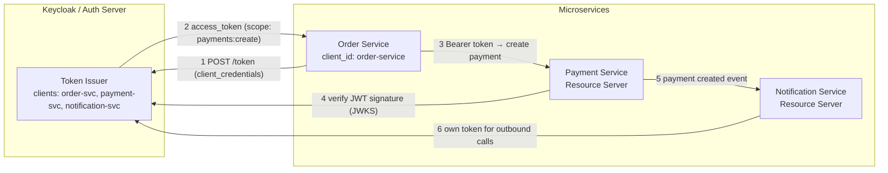

---

## 2. All OAuth 2.0 Grant Types — Complete Reference

```text
GRANT TYPE = the METHOD by which a client obtains tokens.
  Different scenarios need different flows.
  OAuth 2.0 defines them; OAuth 2.1 removes the broken ones.
```

### Grant 1: Authorization Code + PKCE ✅ (user-facing apps)

```text
WHO: Web apps, SPAs, mobile apps — any flow with a real user
WHY: User logs in at IdP, app gets tokens. User's credentials NEVER
     touch the app. PKCE prevents code interception.
```

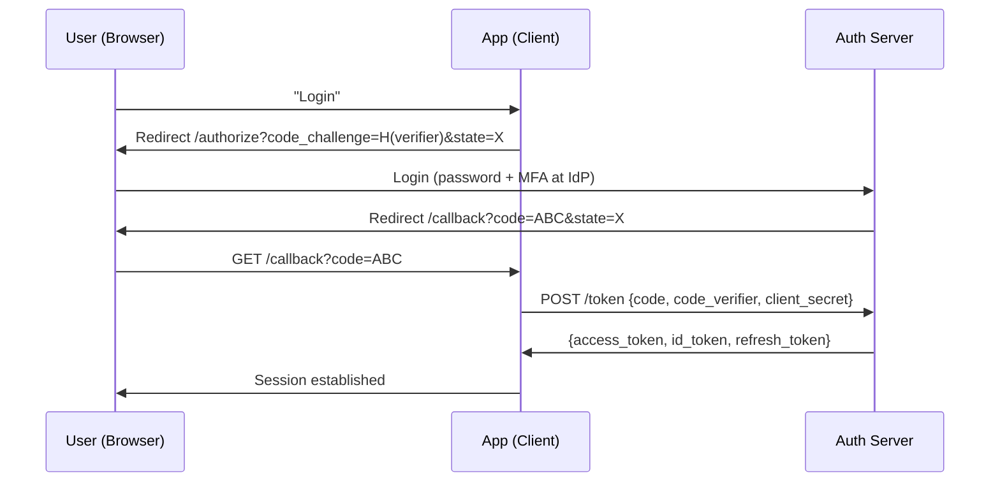

```text
USE WHEN:   any user-interactive login
PKCE:       mandatory (all client types, OAuth 2.1)
state:      random nonce — CSRF protection on redirect
```

### Grant 2: Client Credentials ✅ (service-to-service — YOUR CASE)

```text
WHO: Machine-to-machine. No user. Service authenticates AS ITSELF.
WHY: Order Service needs to call Payment Service. No user to redirect.
```

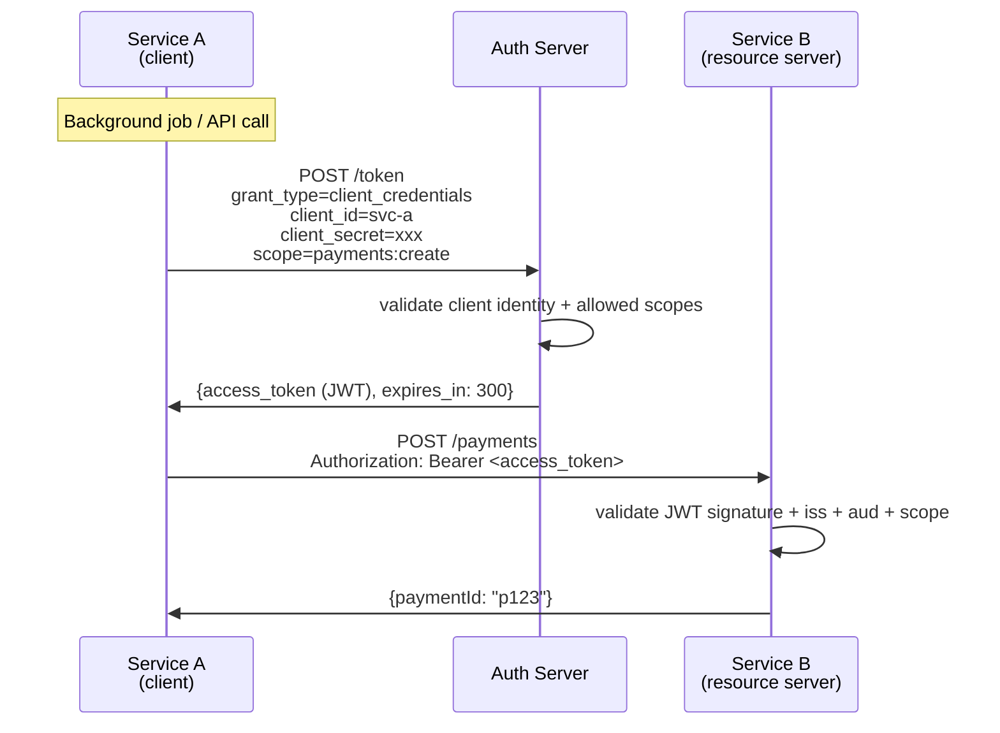

```text
TOKEN CACHING — IMPORTANT:
  Don't fetch a new token on every call — that's wasted network.
  Spring's WebClient OAuth filter caches and auto-refreshes:
    token cached → used until exp - buffer → new token fetched

USE WHEN:   daemon, scheduled job, API gateway → backend, service mesh
NO USER:    ❌ never use for user-facing login
SCOPES:     keep narrow — each service gets only what it needs
```

### Grant 3: Refresh Token ✅ (renewing access)

```text
WHO: Any client that received a refresh_token alongside access_token
WHY: Access tokens are short-lived (5-15 min). Refresh token is the
     "stay logged in" mechanism without re-prompting the user.
```

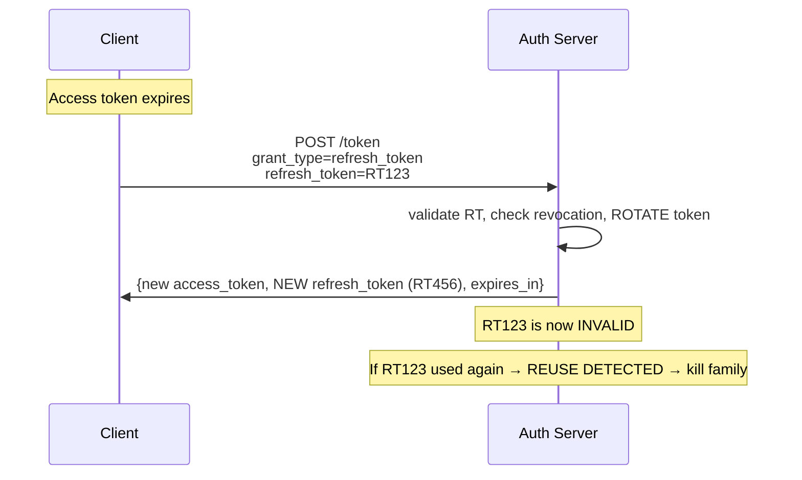

```text
ROTATION: Every use of a refresh token must issue a NEW refresh token
           and invalidate the old one. Reuse = theft signal → kill session.
CLIENT CREDENTIALS don't use refresh tokens — they just re-authenticate
  (credentials are always available to the machine).
```

### Grant 4: Device Authorization ✅ (TVs, CLIs, smart devices)

```text
WHO: Device that can't open a browser or has no good input (TV, CLI tool,
     IoT device, game console)
WHY: Redirects don't work on these. User enters a code on a DIFFERENT device.
```

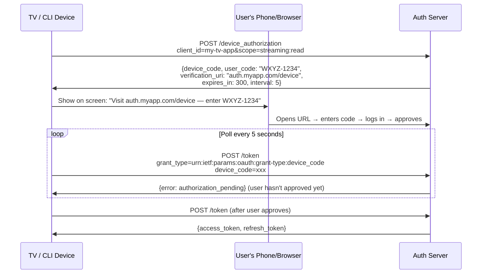

### Grant 5: Token Exchange (RFC 8693) ✅ (impersonation / delegation chains)

```text
WHO: Service A has a user token and needs to call Service B on behalf
     of the user, but Service B should also know the USER identity.
WHY: With plain client_credentials, Service B only knows Service A called.
     Token exchange propagates USER identity through the service chain.
```

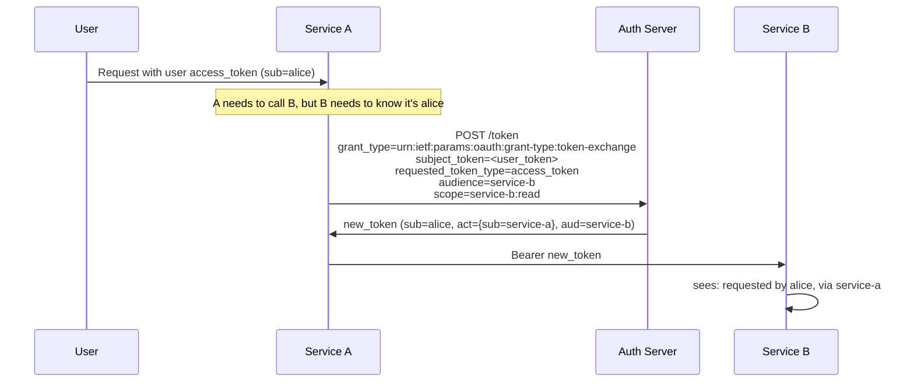

```text
USE IN:  service mesh call chains where user context must propagate
         (audit logging, per-user rate limits downstream, etc.)
SIMPLER alternative: token relay (pass the USER's token through directly)
  → only works if downstream service accepts the same token audience
```

### Grant 6: Implicit ❌ DEAD

```text
REMOVED in OAuth 2.1. Returned tokens in URL fragment.
  → Tokens leaked via browser history, Referer headers, browser extensions.
  → PKCE with Authorization Code replaces it entirely.
NEVER implement this for new apps.
```

### Grant 7: Resource Owner Password Credentials (ROPC) ❌ DEAD

```text
REMOVED in OAuth 2.1. Client collects user's username+password and
  posts them to the token endpoint.
  → App SEES the password — defeats the entire purpose of OAuth.
  → Can't do proper MFA, SSO, or consent.
  → Was used as a "migration shortcut" — always the wrong choice.
NEVER use. If you see it in a codebase, it's tech debt to remove.
```

---

## 3. Microservice OAuth Patterns — In Your Project

Your services use `client_credentials`. Here are all the patterns that
arise in a real microservice platform:

### Pattern 1: Service → Service (Pure Machine Auth)

```text
USE CASE: internal services calling other services. No user context needed.
EXAMPLE:  Scheduler triggers Report Service to generate a PDF.
```

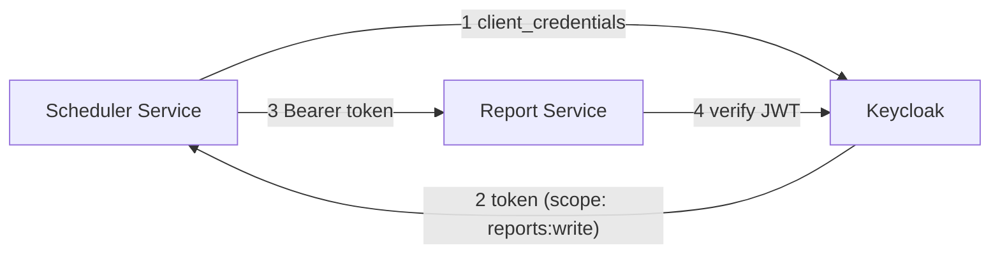

### Pattern 2: Gateway Token Relay — User Token Flows Through

```text
USE CASE: user's access token (from browser login) gets forwarded to
  downstream services. Each service validates the SAME token.
EXAMPLE:  User calls API Gateway → gateway forwards token to Order Service
          → Order Service forwards to Inventory Service.
```

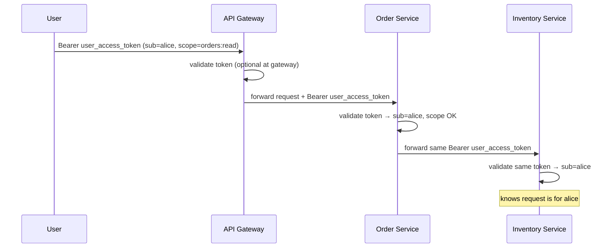

```text
TRADEOFFS:
  ✅ Simple — one token, user identity all the way through
  ⚠️ Token audience must be acceptable to all downstream services
  ⚠️ If any service leaks/logs the token, user session can be stolen
  ❌ Service-to-service with NO gateway — client_credentials is better
```

### Pattern 3: Hybrid — User Context + Service Identity

```text
USE CASE: Service A has user's token, calls Service B, but Service B wants
  to know BOTH who the user is AND which service is calling.
APPROACH: Token Exchange (RFC 8693) — Service A exchanges user token for
  a new token bound to Service B's audience, with user claims preserved.
```

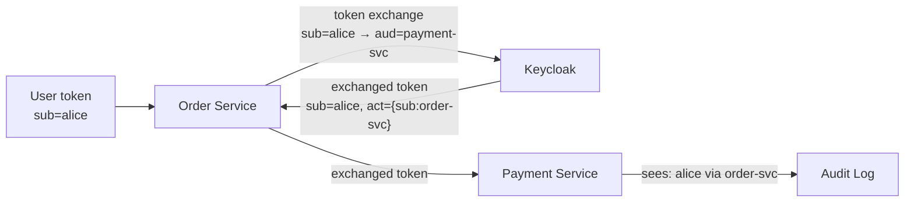

### Pattern 4: API Gateway — Centralized Auth

```text
USE CASE: validate tokens ONCE at the gateway, forward user identity as
  a trusted header. Microservices trust the gateway, skip JWT validation.
```

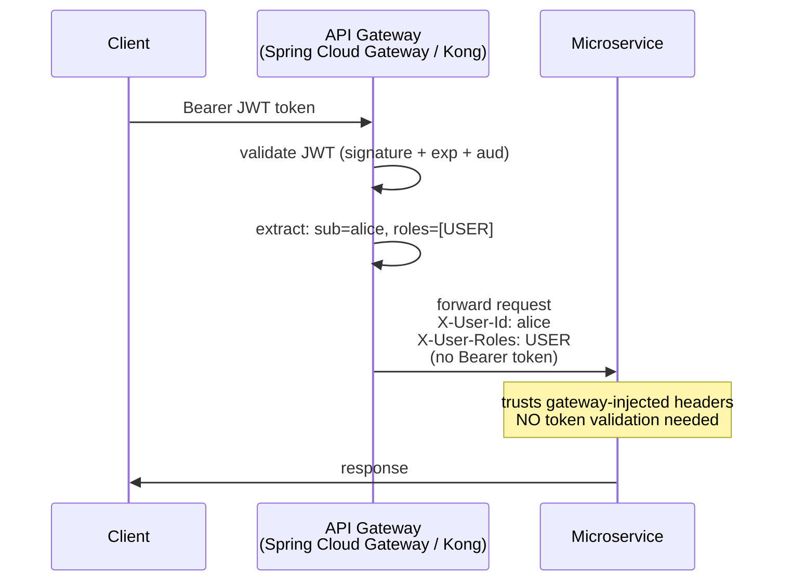

```text
SECURITY: Microservices must ONLY accept requests from the gateway
  → enforce via network policy / mTLS to gateway only
  → headers injected by anyone else should be stripped by gateway
```

### Pattern 5: BFF (Backend for Frontend) — Browser Apps

```text
USE CASE: React SPA / mobile app. Tokens never reach the browser.
  BFF holds tokens server-side, exposes only a session cookie.
```

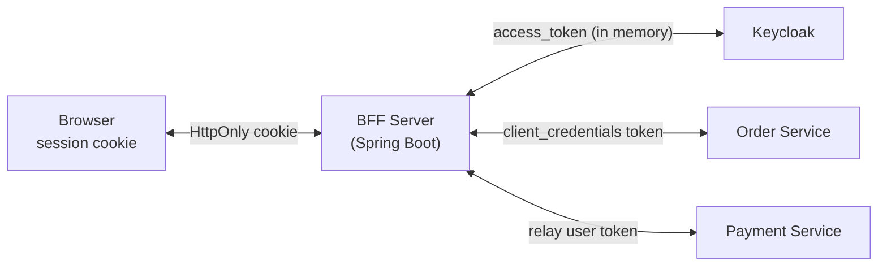

---

## 4. Client Credentials — Spring Boot Complete Setup

### Service that CALLS other services (Client side)

```yaml
# application.yml
spring:
  security:
    oauth2:
      client:
        registration:
          payment-service:
            provider: keycloak
            client-id: order-service
            client-secret: ${ORDER_SVC_CLIENT_SECRET}
            authorization-grant-type: client_credentials
            scope: payments:create, payments:read
          inventory-service:
            provider: keycloak
            client-id: order-service
            client-secret: ${ORDER_SVC_CLIENT_SECRET}
            authorization-grant-type: client_credentials
            scope: inventory:read
        provider:
          keycloak:
            token-uri: http://keycloak:8080/realms/prod/protocol/openid-connect/token
```

```java
@Configuration
public class ServiceClientConfig {

    @Bean
    OAuth2AuthorizedClientManager clientManager(
            ClientRegistrationRepository clients) {
        // In-memory token cache — auto-refresh before expiry
        OAuth2AuthorizedClientService clientService =
            new InMemoryOAuth2AuthorizedClientService(clients);

        AuthorizedClientServiceOAuth2AuthorizedClientManager manager =
            new AuthorizedClientServiceOAuth2AuthorizedClientManager(
                clients, clientService);

        manager.setAuthorizedClientProvider(
            OAuth2AuthorizedClientProviderBuilder.builder()
                .clientCredentials(cc -> cc
                    .accessTokenResponseClient(accessTokenResponseClient()))
                .build());

        return manager;
    }

    @Bean
    WebClient paymentClient(OAuth2AuthorizedClientManager manager) {
        ServletOAuth2AuthorizedClientExchangeFilterFunction filter =
            new ServletOAuth2AuthorizedClientExchangeFilterFunction(manager);
        filter.setDefaultClientRegistrationId("payment-service");
        return WebClient.builder()
            .baseUrl("http://payment-service:8080")
            .apply(filter.oauth2Configuration())
            .build();
    }

    @Bean
    WebClient inventoryClient(OAuth2AuthorizedClientManager manager) {
        var filter =
            new ServletOAuth2AuthorizedClientExchangeFilterFunction(manager);
        filter.setDefaultClientRegistrationId("inventory-service");
        return WebClient.builder()
            .baseUrl("http://inventory-service:8080")
            .apply(filter.oauth2Configuration())
            .build();
    }

    private OAuth2AccessTokenResponseClient<OAuth2ClientCredentialsGrantRequest>
            accessTokenResponseClient() {
        return new DefaultClientCredentialsTokenResponseClient();
    }
}
```

```java
// Service layer — token is auto-attached by WebClient filter
@Service
@RequiredArgsConstructor
public class OrderService {

    private final WebClient paymentClient;
    private final WebClient inventoryClient;

    public OrderResult createOrder(OrderRequest req) {
        // Step 1: reserve inventory (token auto-injected by filter)
        ReserveResult reserve = inventoryClient.post()
            .uri("/api/inventory/reserve")
            .bodyValue(new ReserveRequest(req.items()))
            .retrieve()
            .bodyToMono(ReserveResult.class)
            .block();

        // Step 2: create payment
        PaymentResult payment = paymentClient.post()
            .uri("/api/payments")
            .bodyValue(new PaymentRequest(req.amount(), req.cardToken()))
            .retrieve()
            .bodyToMono(PaymentResult.class)
            .block();

        return new OrderResult(reserve.reservationId(), payment.paymentId());
    }
}
```

### Service that RECEIVES calls (Resource Server side)

```java
@Configuration
@EnableWebSecurity
@EnableMethodSecurity
public class PaymentServiceSecurityConfig {

    @Bean
    SecurityFilterChain api(HttpSecurity http) throws Exception {
        http
            .authorizeHttpRequests(auth -> auth
                .requestMatchers("/actuator/health").permitAll()
                .requestMatchers(HttpMethod.POST, "/api/payments")
                    .hasAuthority("SCOPE_payments:create")
                .requestMatchers(HttpMethod.GET, "/api/payments/**")
                    .hasAuthority("SCOPE_payments:read")
                .anyRequest().authenticated())
            .oauth2ResourceServer(rs -> rs
                .jwt(jwt -> jwt.jwtAuthenticationConverter(jwtConverter())))
            .csrf(AbstractHttpConfigurer::disable)
            .sessionManagement(s ->
                s.sessionCreationPolicy(SessionCreationPolicy.STATELESS));
        return http.build();
    }
}
```

```yaml
# Payment Service — validates tokens issued by Keycloak
spring:
  security:
    oauth2:
      resourceserver:
        jwt:
          issuer-uri: http://keycloak:8080/realms/prod
```

---

## 5. Token Anatomy in Client Credentials Flow

```text
JWT issued for client_credentials (decoded payload):
{
  "iss": "http://keycloak:8080/realms/prod",     ← issuer
  "sub": "a3f2...UUID...",                        ← service account ID (NOT a user)
  "azp": "order-service",                         ← authorized party (client_id)
  "aud": ["payment-service", "realm-management"],  ← allowed recipients
  "scope": "payments:create payments:read",        ← what is allowed
  "exp": 1717171717,                               ← expires (5 min from now)
  "iat": 1717171417,
  "jti": "unique-token-id"                         ← for audit / denylist
}

NO "name", "email", "given_name" — there is NO USER in client_credentials.
sub = the service account's ID in Keycloak, not a person.
```

---

## 6. Scope Design — Naming Convention

```text
RECOMMENDED PATTERN:  resource:action
  payments:create       → can POST /payments
  payments:read         → can GET /payments/**
  inventory:read        → can GET /inventory/**
  reports:generate      → can POST /reports/generate
  admin:users:write     → admin scope for user management

PRINCIPLE OF LEAST PRIVILEGE:
  Each service gets ONLY the scopes for the ONE thing it needs to do.
  → Order Service: payments:create (not read, not admin)
  → Report Service: reports:generate (nothing else)
  → API Gateway: passes user tokens (no service scopes)

IN KEYCLOAK:
  Define as realm-level scopes → assign to specific clients
  Clients can only request scopes they've been granted
```

---

## 7. Common Mistakes

```text
❌ FETCHING A NEW TOKEN PER REQUEST:
   Each token fetch = HTTP call to Keycloak.
   At 1000 req/s, that's 1000 extra calls to Keycloak/second.
   → Use Spring's OAuth2AuthorizedClientManager — it caches and reuses.

❌ SHARING ONE CLIENT_ID ACROSS SERVICES:
   Can't attribute calls, can't revoke one service without affecting all.
   → One client_id per microservice.

❌ OVERLY BROAD SCOPES:
   client_credentials token with "admin" scope.
   If that service is compromised, full admin access is exposed.
   → Narrow scopes per operation.

❌ LONG-LIVED TOKENS:
   access_token valid for 8 hours "to reduce Keycloak load."
   → A leaked token is valid for 8 hours. Use short TTL (5-15 min),
     cache the token in memory, let the library refresh it.

❌ USING ROPC (password grant) FOR SERVICE AUTH:
   "Our service authenticates as a user, not as itself."
   → Create a service account (client) in Keycloak, use client_credentials.

❌ LOGGING TOKENS:
   access_token in request logs → anyone with log access can impersonate.
   → Mask Authorization headers in all logging frameworks.
```

---

## 8. Grant Type Summary — Quick Reference

| Grant | Has User? | Tokens Returned | RFC | 2024 Status |
|-------|-----------|----------------|-----|-------------|
| Authorization Code + PKCE | ✅ user redirects | access + id + refresh | 6749/7636 | ✅ **Use for user login** |
| Client Credentials | ❌ machine only | access token only | 6749 | ✅ **Use for service-to-service** |
| Refresh Token | depends | new access + new refresh | 6749 | ✅ Part of other flows |
| Device Authorization | ✅ (on other device) | access + refresh | 8628 | ✅ TV / CLI |
| Token Exchange | depends | exchanged token | 8693 | ✅ Delegation chains |
| Implicit | ✅ | access in URL | 6749 | ❌ **DEAD** |
| Resource Owner Password | ✅ | access + refresh | 6749 | ❌ **DEAD** |

---

## 9. Keycloak Realm Setup Checklist for Microservices

```text
PER MICROSERVICE (create in Keycloak admin):
  □ Client: order-service
      Access Type: confidential
      Service Accounts Enabled: ON
      Direct Access Grants: OFF
      Standard Flow: OFF (unless this service also has a UI)

  □ Client Scopes: payments:create, payments:read
      Assign to order-service client → service account gets these scopes

  □ Service Account Roles: assign any realm roles needed

TOKEN SETTINGS (realm level):
  □ Access Token Lifespan: 300 seconds (5 min)
  □ Client Session Idle: 30 min
  □ Refresh Token Max Reuse: 0 (rotation ON)
  □ Revoke Refresh Token: ON

SECURITY:
  □ Disable unused grant types per client
  □ Set allowed redirect URIs strictly (exact match, no wildcards)
  □ Enable client credentials token exchange only between trusted clients
```

> Related: `12-Identity-Providers-Keycloak-PingID.md` for IdP setup.
> Related: `11-Spring-Boot-Implementation.md` for all Spring Security configs.
> Related: `09-API-Keys-Service-to-Service.md` for mTLS alternative.
