# Spring Security — Architecture Deep Dive

How Spring Security actually works internally: every component, every flow,
every design decision — with mermaid diagrams for each. Built for interview
preparation and for genuinely understanding what happens when a request arrives.

---

## 1. The Big Picture — Where Spring Security Lives

```text
Spring Security is a Servlet Filter. It runs BEFORE Spring MVC.
Before your controller even exists in the call stack, Spring Security
has already decided: "should this request proceed?"

  JVM Process
  └─ Servlet Container (Tomcat / Netty)
       └─ Servlet Filter Chain         ← Spring Security lives HERE
            └─ DispatcherServlet       ← Spring MVC lives here
                 └─ Controller
```

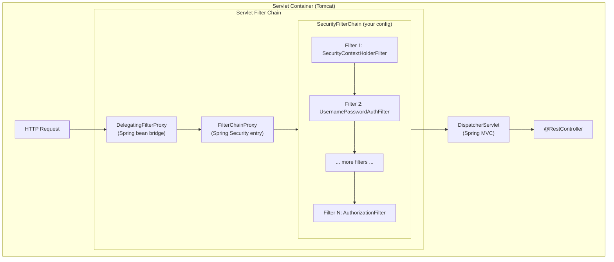

### DelegatingFilterProxy — The Bridge

```text
PROBLEM: Servlet filters are created by Tomcat BEFORE Spring context boots.
  How does Spring Security (a Spring bean) become a Servlet filter?

ANSWER: DelegatingFilterProxy
  • Registered with Tomcat as a plain Servlet filter (no Spring yet)
  • On first request: looks up "springSecurityFilterChain" bean from ApplicationContext
  • Delegates every request to that bean (FilterChainProxy)
  • ApplicationContext is fully ready by then

  Tomcat sees a simple filter. Spring sees a bean. Bridge complete.
```

### FilterChainProxy — The Router

```text
FilterChainProxy holds a LIST of SecurityFilterChains.
Each chain has a RequestMatcher (URL pattern).
First matching chain wins — processes the request.

  Chains (ordered):
  1. securityMatcher("/api/**")   → Chain 1 (JWT stateless)
  2. securityMatcher("/admin/**") → Chain 2 (requires admin role)
  3. (matches everything)         → Chain 3 (form login)

  → This is why @Order matters on @Bean SecurityFilterChain methods.
```

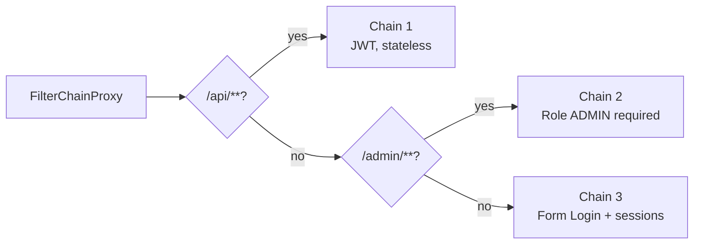

---

## 2. The Authentication Architecture — Who Are You?

```text
THE 5 KEY INTERFACES:
  Authentication         = "I claim to be X with credentials Y"
  AuthenticationManager  = "let me verify that"
  ProviderManager        = the standard AuthenticationManager — tries a list of providers
  AuthenticationProvider = "I handle THIS type of Authentication"
  UserDetailsService     = "load user from DB by username"
```

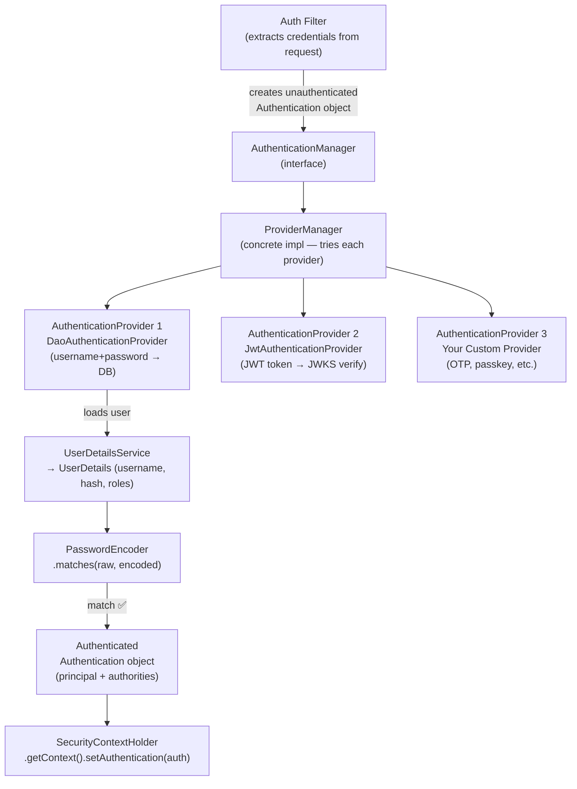

### The Authentication Object — Before and After

```text
BEFORE authentication (what the filter creates):
  UsernamePasswordAuthenticationToken(
    principal   = "alice"        ← username string
    credentials = "secret123"   ← raw password
    authorities = []             ← empty
    authenticated = false        ← NOT yet verified
  )

AFTER authentication (what the provider returns):
  UsernamePasswordAuthenticationToken(
    principal   = UserDetails { username=alice, roles=[USER,ADMIN] }
    credentials = null           ← CLEARED (security: don't hold raw password)
    authorities = [ROLE_USER, ROLE_ADMIN]
    authenticated = true
  )

AFTER JWT authentication:
  JwtAuthenticationToken(
    principal   = Jwt { sub=alice, claims={...} }
    credentials = JWT string
    authorities = [SCOPE_read, ROLE_USER]
    authenticated = true
  )
```

### ProviderManager — The Try-Each-Provider Loop

```java
// Conceptual — what ProviderManager.authenticate() does:
for (AuthenticationProvider provider : providers) {
    if (provider.supports(authentication.getClass())) {
        try {
            Authentication result = provider.authenticate(authentication);
            if (result != null) return result;   // SUCCESS — stop here
        } catch (AccountStatusException | InternalAuthenticationServiceException e) {
            throw e;                              // always propagate these
        } catch (AuthenticationException e) {
            lastException = e;                   // keep trying other providers
        }
    }
}
// All providers tried and failed
throw lastException != null ? lastException : new ProviderNotFoundException(...);
```

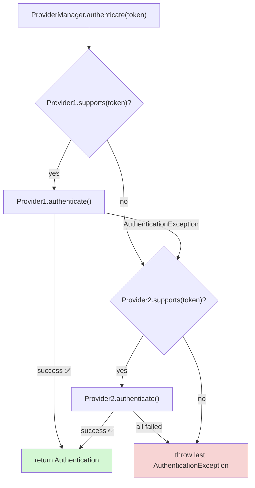

### DaoAuthenticationProvider — The Default Provider

```text
Used for username+password (form login, Basic Auth).
STEPS:
  1. Call UserDetailsService.loadUserByUsername(username)
     → Returns UserDetails or throws UsernameNotFoundException
  2. Check account status:
     isEnabled(), isAccountNonLocked(), isAccountNonExpired(),
     isCredentialsNonExpired()
  3. PasswordEncoder.matches(rawPassword, storedHash)
  4. If all pass → return authenticated token
  5. On failure → throw BadCredentialsException (same msg for user-not-found
     AND wrong-password — prevents user enumeration)
```

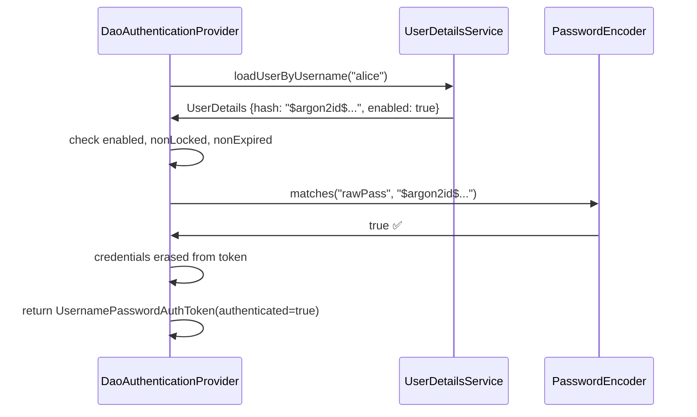

---

## 3. SecurityContextHolder — Thread-Local Identity Store

```text
SecurityContextHolder is the global store for "who is currently authenticated"
DURING this request's thread.

  SecurityContextHolder
    └─ SecurityContext
         └─ Authentication  ← the fully authenticated object

  Default strategy: THREAD_LOCAL
    → Each thread has its own SecurityContext (servlet threads are per-request)
    → After request: cleared automatically by SecurityContextHolderFilter
    → Spring async (@Async, reactive): context NOT automatically propagated!

  Other strategies:
    MODE_INHERITABLETHREADLOCAL  → child threads inherit parent's context
    MODE_GLOBAL                  → single shared context (rare, testing only)
```

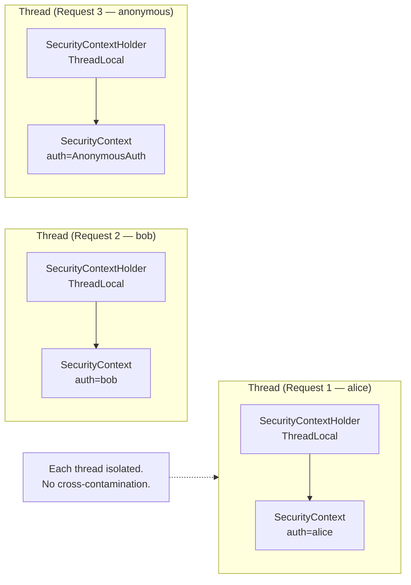

```java
// Accessing the current user — three ways
// Way 1: direct (any layer)
Authentication auth = SecurityContextHolder.getContext().getAuthentication();
String username = auth.getName();

// Way 2: @AuthenticationPrincipal (controllers / @PreAuthorize)
@GetMapping("/me")
public UserDto me(@AuthenticationPrincipal UserDetails user) {
    return UserDto.from(user);
}

// Way 3: for JWT OAuth
@GetMapping("/me")
public Map<String, Object> me(@AuthenticationPrincipal Jwt jwt) {
    return Map.of(
        "sub",   jwt.getSubject(),
        "email", jwt.getClaimAsString("email"),
        "roles", jwt.getClaimAsStringList("roles")
    );
}
```

```text
ASYNC PITFALL:
  @Async methods run on a different thread — SecurityContext is NOT there.
  Fix: configure DelegatingSecurityContextAsyncTaskExecutor
       or use SecurityContextHolder.setStrategyName(MODE_INHERITABLETHREADLOCAL)
  Reactive (WebFlux): use ReactiveSecurityContextHolder — context is in
                      Project Reactor's context, not ThreadLocal at all.
```

---

## 4. The Complete Filter Chain — Every Filter Explained

```text
Spring Security 6.x default filter order (simplified, most relevant):

  1.  DisableEncodeUrlFilter               → stop JSESSIONID in URLs
  2.  WebAsyncManagerIntegrationFilter     → propagate context to async
  3.  SecurityContextHolderFilter          → load/save SecurityContext
  4.  HeaderWriterFilter                   → write security headers
  5.  CorsFilter                           → CORS processing
  6.  CsrfFilter                           → CSRF token validation
  7.  LogoutFilter                         → handle /logout
  8.  UsernamePasswordAuthenticationFilter → form login (POST /login)
  9.  DefaultLoginPageGeneratingFilter     → auto-generated /login page
  10. BasicAuthenticationFilter            → Basic Auth header
  11. RequestCacheAwareFilter              → replay cached request after login
  12. SecurityContextHolderAwareFilter     → HttpServletRequest auth methods
  13. RememberMeAuthenticationFilter       → remember-me cookie
  14. AnonymousAuthenticationFilter        → set anonymous if still unauthenticated
  15. ExceptionTranslationFilter           → catch auth/access exceptions
  16. AuthorizationFilter                  → final access decision
```

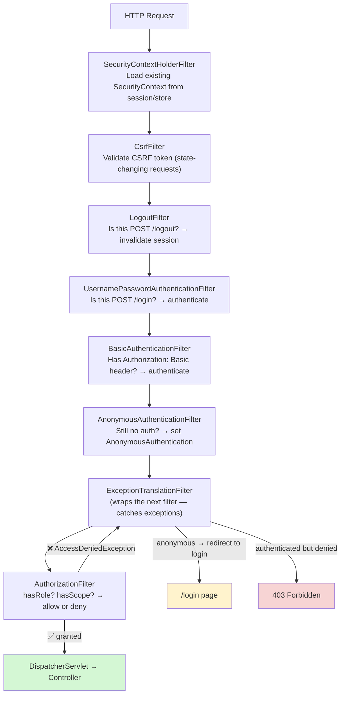

### SecurityContextHolderFilter in Detail

```text
WHAT IT DOES:
  Before controller:  load SecurityContext from SecurityContextRepository
                      (session-based → from HttpSession
                       stateless → NullSecurityContextRepository — nothing)
                      → put in SecurityContextHolder

  After controller:   save SecurityContext back to repository (if changed)
                      clear SecurityContextHolder (thread cleanup)

  WHY: If this thread was reused for a different request later,
       old authentication must be gone.
```

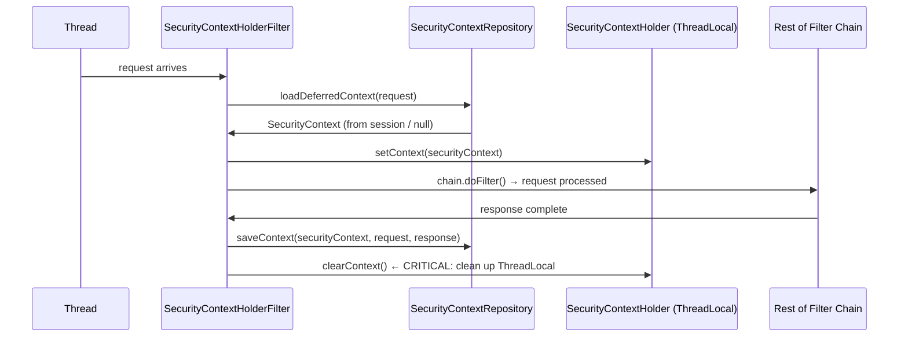

### ExceptionTranslationFilter in Detail

```text
This filter WRAPS the AuthorizationFilter and catches two exception types:

  AuthenticationException → user is NOT authenticated
    → call AuthenticationEntryPoint:
        web app:    redirect to /login
        REST API:   return 401 Unauthorized + WWW-Authenticate header
        OAuth:      return 401 with error details

  AccessDeniedException → user IS authenticated but not allowed
    → check if ANONYMOUS:
        anonymous → treat as AuthenticationException (redirect to login)
        real user → call AccessDeniedHandler → 403 Forbidden

  WHY TWO RESPONSES FOR "no permission"?
    If I'm not logged in and hit /admin → redirect to /login (not 403)
    If I'm logged in as USER and hit /admin → 403 (don't redirect, user IS here)
```

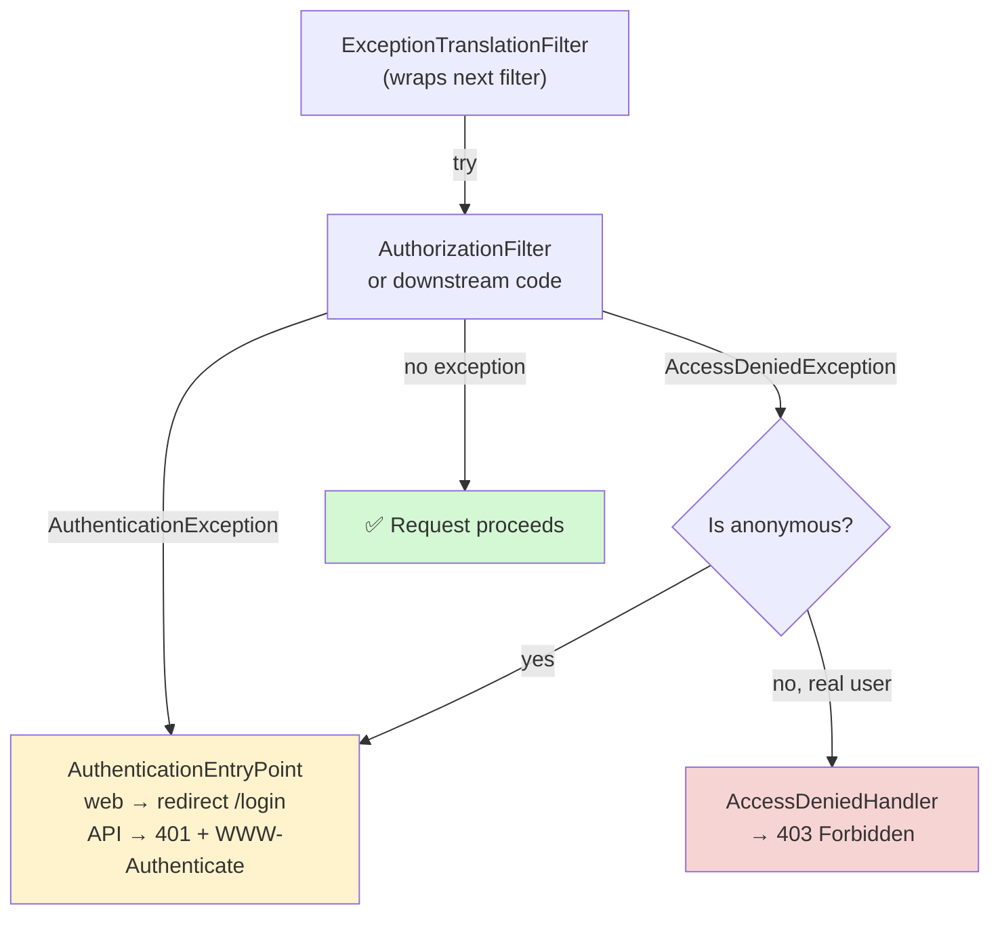

---

## 5. Authorization Architecture — What Can You Do?

```text
Spring Security 6.x uses AuthorizationManager (replaces old AccessDecisionManager).

  AuthorizationFilter calls:
    AuthorizationManager.check(Supplier<Authentication>, request)
    → returns AuthorizationDecision(granted: true/false)

  For method security (@PreAuthorize):
    MethodSecurityInterceptor calls AuthorizationManager with MethodInvocation
```

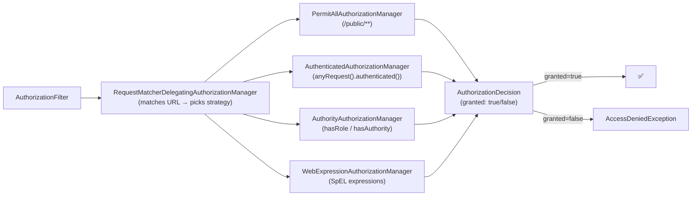

### GrantedAuthority — Role vs Scope vs Permission

```text
GrantedAuthority = a String that represents a permission.
Spring Security checks these strings — there is no magic schema.

CONVENTIONS:
  ROLE_ADMIN     → hasRole("ADMIN")        ← Spring auto-adds ROLE_ prefix
  ROLE_USER      → hasRole("USER")
  SCOPE_read     → hasAuthority("SCOPE_read") ← OAuth scopes
  orders:read    → hasAuthority("orders:read") ← custom permissions

hasRole("ADMIN")       = checks for "ROLE_ADMIN"  (adds prefix)
hasAuthority("ADMIN")  = checks for "ADMIN" literally (no prefix)

HIERARCHICAL ROLES:
  ROLE_ADMIN > ROLE_MANAGER > ROLE_USER
  → admin automatically gets manager and user authorities
```

```java
@Bean
RoleHierarchy roleHierarchy() {
    return RoleHierarchyImpl.fromHierarchy("""
        ROLE_ADMIN > ROLE_MANAGER
        ROLE_MANAGER > ROLE_USER
        """);
}
// ADMIN user can now access .hasRole("USER") endpoints without explicit mapping
```

### @PreAuthorize — SpEL Expressions

```java
// Principal
@PreAuthorize("isAuthenticated()")
@PreAuthorize("isAnonymous()")
@PreAuthorize("isFullyAuthenticated()")          // not remember-me

// Roles / authorities
@PreAuthorize("hasRole('ADMIN')")                // → ROLE_ADMIN
@PreAuthorize("hasAuthority('SCOPE_read')")      // exact string match
@PreAuthorize("hasAnyRole('ADMIN', 'MANAGER')")

// Combining
@PreAuthorize("hasRole('ADMIN') or #userId == authentication.name")
@PreAuthorize("hasRole('ADMIN') and hasAuthority('orders:delete')")

// Method parameters (the # prefix)
@PreAuthorize("#userId == authentication.name")
public Order getOrder(String userId, String orderId) { ... }
// userId in SpEL resolves to the actual argument value

// Custom bean method
@PreAuthorize("@authService.canAccess(authentication, #orderId)")
public Order secure(String orderId) { ... }

// @PostAuthorize — runs AFTER method, can check return value
@PostAuthorize("returnObject.ownerId == authentication.name")
public Order findById(String id) { ... }
```

---

## 6. Session Management Internals

```text
SessionCreationPolicy controls when a SecurityContext is persisted to the session:

  ALWAYS        → create session even if nothing to store
  IF_REQUIRED   → create only when needed (DEFAULT for form login)
  NEVER         → never create, but USE existing if it exists
  STATELESS     → never create, never use → SecurityContext lives only for this request
                  → use this for REST APIs / JWT
```

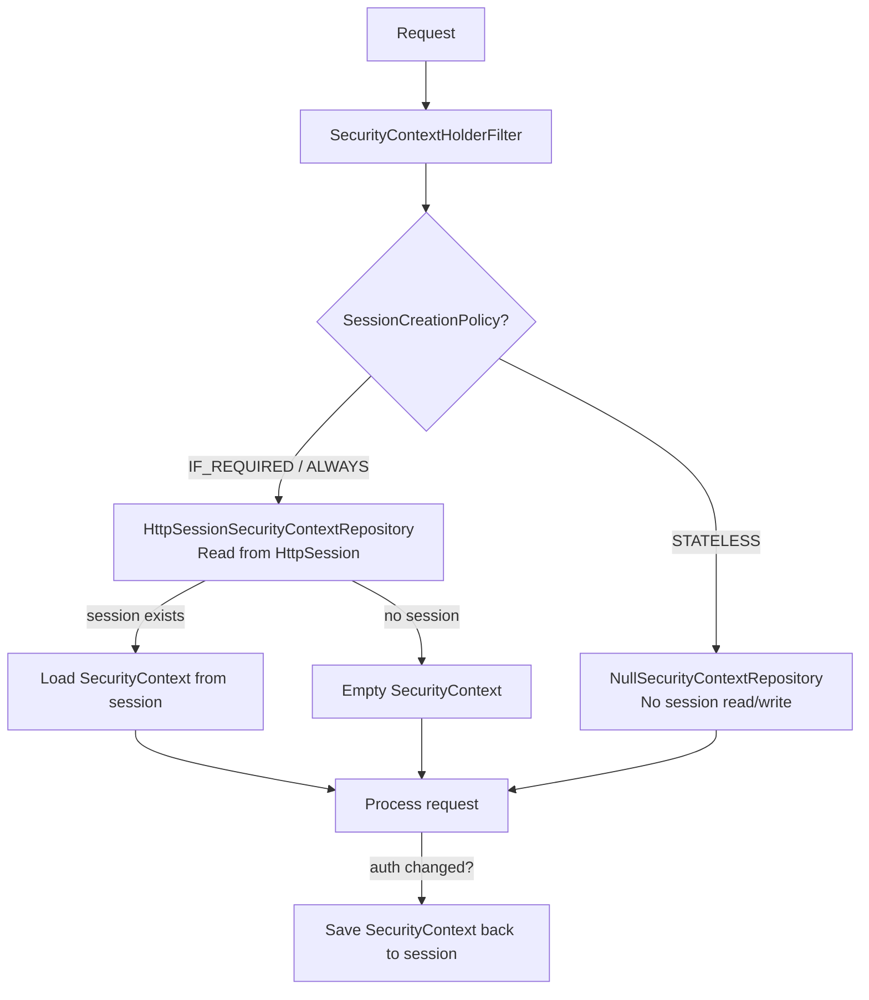

### Session Fixation Protection

```text
ATTACK: attacker gets a session ID, tricks user into using it, user logs in
        → attacker's session is now authenticated.

DEFENSE OPTIONS:
  migrateSession  (DEFAULT) → create new session, copy attributes, invalidate old
  newSession               → create new session, do NOT copy attributes
  none                     → don't change (only for specific legacy cases)
  changeSessionId          → keep data, generate new session ID (Servlet 3.1+)
```

---

## 7. CSRF Internals

```text
WHAT CSRF PROTECTS AGAINST:
  Browser auto-sends cookies. Evil site can make forged requests.
  CSRF token is a random value the SERVER gave this browser's session.
  Only a request coming from OUR page knows the token.
  → Attacker's site can't read it (Same-Origin Policy blocks reads).

SYNCHRONIZER TOKEN PATTERN:
  1. Server generates random token, stores in session (server-side)
  2. Server embeds in every HTML form as hidden input (or sends to SPA)
  3. On every state-changing request (POST/PUT/DELETE/PATCH):
     Server extracts token from request, compares to session value
  4. Mismatch → 403 Forbidden (CSRF attack blocked)

DOUBLE SUBMIT COOKIE (for SPAs):
  Token in a readable cookie + also required as a header.
  Attacker can't read the cookie cross-site → can't set the header.

WHEN TO DISABLE CSRF:
  Stateless APIs (JWT tokens in Authorization header) — browsers don't
  auto-send headers, only cookies. No cookies → no CSRF risk.
  → NEVER disable CSRF for browser apps with session cookies.
```

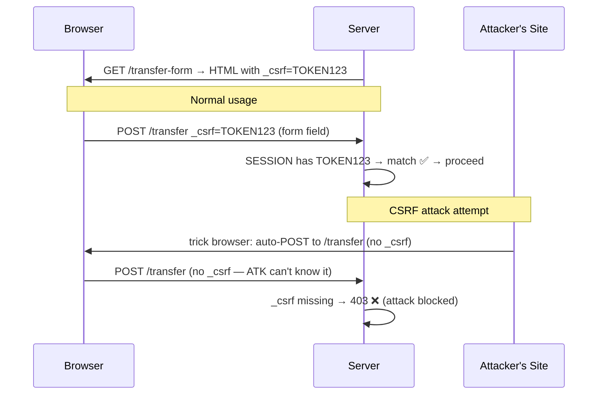

```java
// CSRF config options
http.csrf(csrf -> csrf
    .ignoringRequestMatchers("/api/**")          // no CSRF for stateless APIs
    .csrfTokenRepository(CookieCsrfTokenRepository.withHttpOnlyFalse())
    // SPA: puts token in readable cookie, SPA reads it and adds as header
);

// Thymeleaf: auto-included as hidden input  →  no extra config needed
// React SPA: read cookie X-XSRF-TOKEN → add header X-XSRF-TOKEN to each request
```

---

## 8. Password Encoding — DelegatingPasswordEncoder

```text
THE DESIGN PROBLEM:
  Your app started with MD5 → migrated to BCrypt → now using Argon2.
  How to support old hashes without forcing everyone to reset their password?

DelegatingPasswordEncoder = dispatch on prefix:
  {bcrypt}$2a$10$...         → BCryptPasswordEncoder
  {argon2}$argon2id$...      → Argon2PasswordEncoder
  {noop}password             → NoOpPasswordEncoder (plaintext, ONLY tests)
  {scrypt}$e0801$...         → SCryptPasswordEncoder
  (no prefix)                → legacy fallback (MD5 / SHA etc.)
```

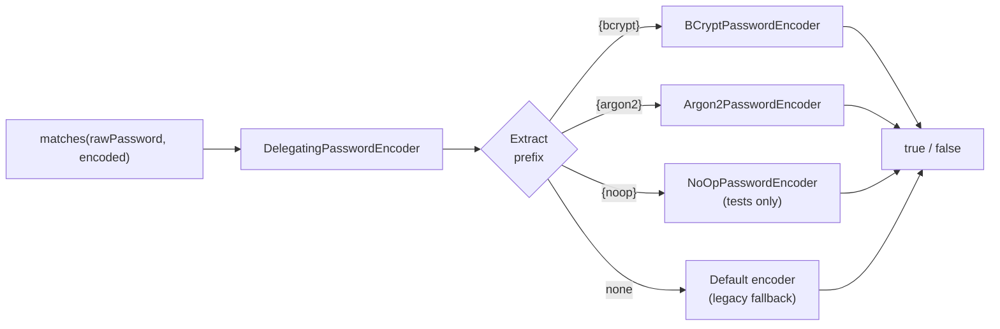

```java
// PasswordEncoderFactories.createDelegatingPasswordEncoder()
// → default encoder is bcrypt, can verify old prefixed hashes

// Choosing encoders (2024):
//   Argon2id  → best for NEW apps (memory-hard, GPU-resistant)
//   BCrypt    → widely supported, cost factor tunable, still solid
//   SCrypt    → memory-hard, less library support than Argon2

PasswordEncoder encoder = Argon2PasswordEncoder.defaultsForSpringSecurity_v5_8();
String hash = encoder.encode("mypassword");   // {argon2}$argon2id$...
encoder.matches("mypassword", hash);          // true

// In-place migration: detect if hash needs upgrade
if (encoder.upgradeEncoding(storedHash)) {
    // re-hash and save
}
```

---

## 9. UserDetailsService vs UserDetailsManager

```java
// UserDetailsService (read-only — what you almost always implement)
public interface UserDetailsService {
    UserDetails loadUserByUsername(String username) throws UsernameNotFoundException;
}

// UserDetails — what loadUserByUsername returns
public interface UserDetails {
    Collection<? extends GrantedAuthority> getAuthorities();
    String getPassword();       // stored encoded hash
    String getUsername();
    boolean isAccountNonExpired();
    boolean isAccountNonLocked();
    boolean isCredentialsNonExpired();
    boolean isEnabled();
}

// UserDetailsManager (read-write — for apps managing users themselves)
public interface UserDetailsManager extends UserDetailsService {
    void createUser(UserDetails user);
    void updateUser(UserDetails user);
    void deleteUser(String username);
    void changePassword(String oldPassword, String newPassword);
    boolean userExists(String username);
}

// Implementations:
//   InMemoryUserDetailsManager → testing / static users
//   JdbcUserDetailsManager     → Spring Security's own schema (rarely fits real apps)
//   Your own impl              → query YOUR User entity/table (99% of real apps)
```

---

## 10. The Full Request Lifecycle — Putting It All Together

Two complete walkthroughs: a form-login browser request and a JWT API request.

### Walkthrough A: Form Login (First Request — Not Authenticated)

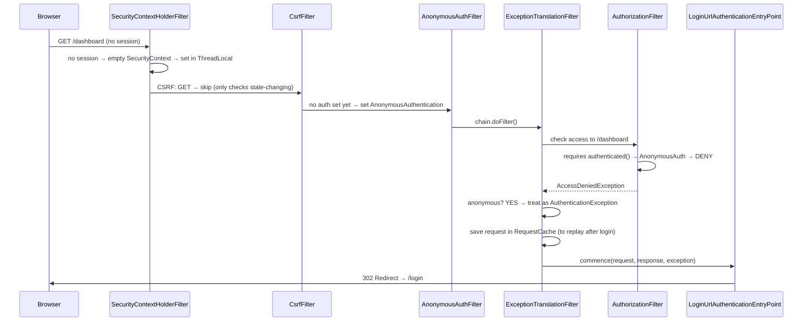

### Walkthrough B: Form Login POST (Authentication)

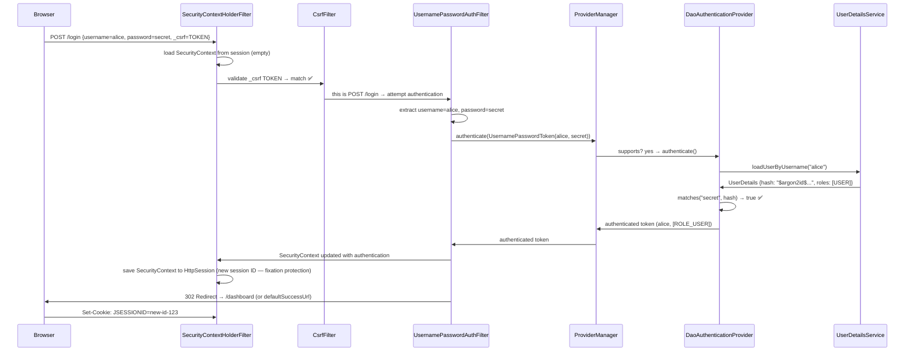

### Walkthrough C: JWT Bearer Token API Request

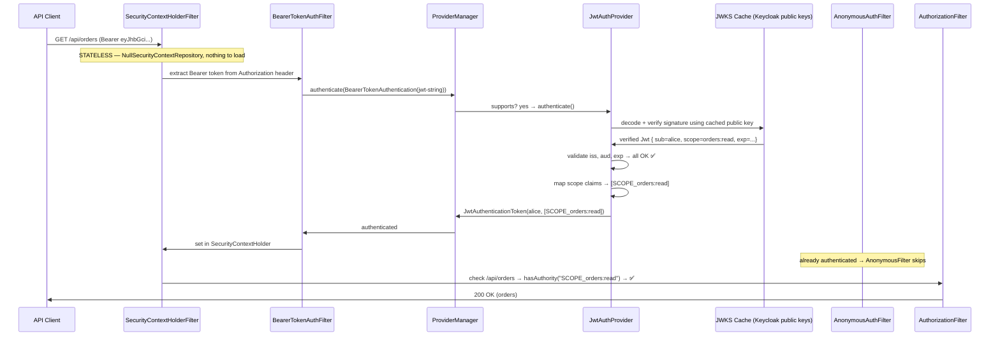

---

## 11. Security Headers — What Spring Security Sends by Default

```text
Spring Security's HeaderWriterFilter adds these on every response:

  X-Content-Type-Options: nosniff
    → Browser doesn't sniff MIME type (prevents MIME confusion attacks)

  X-Frame-Options: DENY
    → Prevents clickjacking (your page can't be embedded in an iframe)

  X-XSS-Protection: 0
    → Modern browsers have this built-in; Spring now disables the legacy header

  Cache-Control: no-cache, no-store, max-age=0, must-revalidate
    → Authenticated pages not cached (prevents back-button exposure)

  Strict-Transport-Security: max-age=31536000; includeSubDomains
    → HSTS: browser always uses HTTPS (only sent over HTTPS connections)
```

```java
http.headers(headers -> headers
    .frameOptions(frame -> frame.sameOrigin())        // allow same-origin iframes (e.g. H2 console)
    .contentSecurityPolicy(csp ->
        csp.policyDirectives("default-src 'self'; script-src 'self'"))
    .httpStrictTransportSecurity(hsts -> hsts
        .includeSubDomains(true)
        .maxAgeInSeconds(31536000)));
```

---

## 12. Spring Security in Reactive Apps (WebFlux)

```text
KEY DIFFERENCES from servlet-based:
  • No ThreadLocal — Reactor context replaces SecurityContextHolder
  • ReactiveSecurityContextHolder.getContext() → Mono<SecurityContext>
  • SecurityWebFilterChain replaces SecurityFilterChain
  • All auth is non-blocking (Mono/Flux throughout)
```

```java
@Bean
SecurityWebFilterChain webFlux(ServerHttpSecurity http) {
    return http
        .authorizeExchange(ex -> ex
            .pathMatchers("/api/public/**").permitAll()
            .anyExchange().authenticated())
        .oauth2ResourceServer(rs -> rs
            .jwt(Customizer.withDefaults()))
        .csrf(ServerHttpSecurity.CsrfSpec::disable)
        .build();
}

// Access user in reactive controller
@GetMapping("/me")
public Mono<UserDto> me(@AuthenticationPrincipal Mono<Jwt> jwt) {
    return jwt.map(j -> UserDto.of(j.getSubject()));
}
```

---

## 13. Interview Q&A — Spring Security

```text
Q: What is DelegatingFilterProxy and why does it exist?
A: Servlet filters are created by Tomcat before Spring starts. DelegatingFilterProxy
   is registered as a plain Servlet filter, but on first request it fetches
   the real filter (FilterChainProxy) from the Spring ApplicationContext.
   It's the bridge between the Servlet world and the Spring bean world.

Q: What is the difference between AuthenticationManager and AuthenticationProvider?
A: AuthenticationManager is the interface (single method: authenticate()).
   ProviderManager is the standard implementation — it holds a list of
   AuthenticationProviders and tries each one until one succeeds.
   AuthenticationProvider is what actually verifies credentials for a specific
   Authentication type (DaoAuthenticationProvider for username+password,
   JwtAuthenticationProvider for JWT tokens, etc.).

Q: Why does ProviderManager throw BadCredentialsException for both wrong password
   AND unknown username?
A: User enumeration attack prevention. If "user not found" gave a different
   message than "wrong password", attackers could discover valid usernames.
   DaoAuthenticationProvider always throws BadCredentialsException for both.

Q: What is SecurityContextHolder and what strategy does it use by default?
A: A static class that stores the SecurityContext (containing Authentication)
   for the current thread via ThreadLocal (MODE_THREADLOCAL). Each thread
   gets its own context. Cleared at end of request by SecurityContextHolderFilter.

Q: How does @PreAuthorize work internally?
A: @EnableMethodSecurity adds a Spring AOP proxy around methods with
   @PreAuthorize. The proxy calls MethodSecurityInterceptor which calls
   AuthorizationManager.check() with the SpEL expression and current
   Authentication. If denied → AccessDeniedException.

Q: When is the session created for form login?
A: SessionCreationPolicy.IF_REQUIRED (default): session is created when
   Spring Security needs to save the SecurityContext — i.e., after successful
   authentication. Not on every request.

Q: Difference between 401 and 403 in Spring Security?
A: ExceptionTranslationFilter handles both:
   AuthenticationException → 401 (not authenticated / credentials wrong)
   AccessDeniedException + anonymous → redirect to login (treats as 401)
   AccessDeniedException + real user → 403 (authenticated but not authorized)

Q: How does CSRF work and when can you disable it?
A: CSRF token is a server-generated random stored in the session. Embedded
   in forms, validated on state-changing requests. Disable ONLY for stateless
   endpoints using Authorization headers (not cookies) — browsers don't
   auto-send headers cross-site, so there's no CSRF vector.

Q: What is the difference between hasRole and hasAuthority?
A: hasRole("ADMIN") → checks for "ROLE_ADMIN" (auto-prefixes "ROLE_")
   hasAuthority("ADMIN") → checks for "ADMIN" literally (no prefix)
   Use hasRole for USER/ADMIN/MANAGER style. Use hasAuthority for
   SCOPE_read or custom permissions.

Q: What is DelegatingPasswordEncoder and why use it?
A: Stores password hashes with a prefix like {bcrypt} or {argon2}.
   On verify, dispatches to the correct encoder based on prefix.
   Solves the migration problem: old BCrypt hashes keep working while
   new logins get upgraded to Argon2. No forced password resets.

Q: How does Spring auto-configure Security if I just add the starter?
A: SpringBootWebSecurityConfiguration fires. If NO custom SecurityFilterChain
   bean exists → default chain: all requests require authentication, form
   login enabled, HTTP Basic enabled, random password logged to console.
   Add your own SecurityFilterChain @Bean → default is fully replaced.

Q: How do multiple SecurityFilterChain beans work?
A: Each bean has @Order and a securityMatcher(). FilterChainProxy iterates
   chains in order. First chain whose securityMatcher matches the request
   handles it exclusively. Other chains are skipped.
   NO securityMatcher = catch-all (put this @Order lowest).

Q: What happens if no authentication is configured for an endpoint?
A: It passes through all auth filters unauthenticated. AnonymousAuthFilter
   sets an AnonymousAuthentication. AuthorizationFilter then evaluates
   the access rules. If .permitAll() → proceeds. If .authenticated() →
   AccessDeniedException → ExceptionTranslationFilter → redirect or 401.
```

---

## 14. Common Pitfalls

```text
❌ NOT calling http.build()
   SecurityFilterChain is only registered when .build() is called.
   Easy to forget in new functional style.

❌ Enabling CSRF then making AJAX calls fail
   If CSRF is ON (correct for browser apps) your AJAX must include the token.
   Either use CookieCsrfTokenRepository + read cookie in JS, or explicitly
   include _csrf in AJAX headers.

❌ @EnableWebSecurity on a non-configuration class
   Must be on a class annotated with @Configuration (explicit or via
   @SpringBootApplication scanning).

❌ Method security not working
   @EnableMethodSecurity must be present. @PreAuthorize only works on Spring
   beans — calling a @PreAuthorize method from within the SAME class bypasses
   the AOP proxy (self-invocation problem).

❌ SecurityContextHolder in @Async methods = null
   ThreadLocal is thread-bound. @Async spawns a new thread. The SecurityContext
   is gone. Fix: DelegatingSecurityContextAsyncTaskExecutor wrapper.

❌ Multiple SecurityFilterChains with wrong @Order / missing securityMatcher
   Without securityMatcher, a chain matches EVERYTHING. If it's @Order(1)
   it will handle every request — your other chains never run.

❌ Custom AuthenticationProvider not registered
   If you create an AuthenticationProvider @Bean, Spring Security doesn't
   automatically pick it up in all cases. Inject it into the HttpSecurity
   configuration explicitly:
     http.authenticationProvider(myProvider)

❌ Relying on default credentials in production
   spring.security.user.name/password defaults are for dev. Production must
   define a proper UserDetailsService or connect to an IdP. The random
   password is regenerated every restart — it's not a production credential.
```

> See `11-Spring-Boot-Implementation.md` for complete working code for every
> mechanism. See `12-Identity-Providers-Keycloak-PingID.md` for connecting
> Spring Security to Keycloak, Auth0, and Okta.
