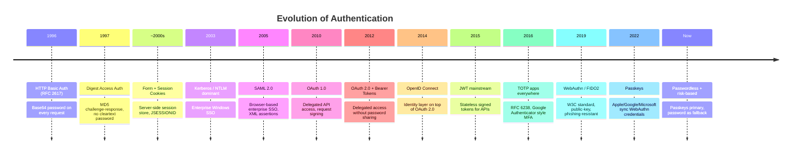

# Authentication Mechanisms — Complete Guide

From HTTP Basic Auth (1996) to Passkeys (2022+) — how authentication evolved,
how each mechanism works internally, full mermaid flow diagrams, and what the
current best practice is for each scenario.

---

## Reading Order

| # | File | What You Learn |
|---|------|----------------|
| 1 | `01-History-And-Fundamentals.md` | **Start here.** Authentication vs authorization, the 3 factors, the full evolution timeline (Basic → Digest → Sessions → Tokens → OAuth → MFA → Passkeys), why each generation replaced the last |
| 2 | `02-HTTP-Basic-And-Digest.md` | The original HTTP auth schemes. Base64 is NOT encryption. Digest challenge-response. Why both are legacy. When Basic is still acceptable (internal APIs + TLS) |
| 3 | `03-Session-Cookie-Form-Auth.md` | Classic form login, server-side sessions, cookie attributes (HttpOnly/Secure/SameSite), session fixation/hijacking, CSRF, Spring Security config |
| 4 | `04-Token-Based-JWT-Refresh.md` | Stateless tokens, JWT anatomy (header.payload.signature), access + refresh token pattern, token theft mitigation, where to store tokens, revocation problem |
| 5 | `05-OAuth2-OIDC-PKCE.md` | OAuth 2.0 roles, all grant types (Authorization Code + PKCE, Client Credentials), why Implicit & Password grants are DEAD, OIDC layer (ID token), Spring Boot client setup |
| 6 | `06-MFA-OTP-TOTP-Push.md` | Something you know/have/are. SMS OTP, TOTP (Google Authenticator internals), push approval, hardware tokens. Phishing-resistant vs phishable MFA |
| 7 | `07-Passkeys-WebAuthn-FIDO2.md` | The passwordless endgame. FIDO2/WebAuthn, public-key ceremony (registration + authentication), resident keys, synced vs device-bound passkeys, why phishing is impossible |
| 8 | `08-SAML-SSO-Kerberos-LDAP.md` | Enterprise SSO. SAML 2.0 flow (SP/IdP), Kerberos tickets (KDC/TGT), LDAP directories, when you'll still see these in the wild |
| 9 | `09-API-Keys-Service-to-Service.md` | Machine auth. API keys, signed requests (HMAC), mTLS, service accounts, workload identity, secret management |
| 10 | `10-Best-Practices-Decision-Guide.md` | Decision tree: which mechanism for which scenario. Comparison table, cheat sheet, interview answers |
| 11 | `11-Spring-Boot-Implementation.md` | **Spring Security 6.x for every mechanism.** SecurityFilterChain mental model, Form Login + session, Basic Auth, JWT Resource Server, OAuth2 Login (OIDC), OAuth2 Client Credentials, TOTP MFA, Passkeys/WebAuthn, multi-chain config, method security, dependency reference |
| 12 | `12-Identity-Providers-Keycloak-PingID.md` | **Where the login lives.** What an IdP/Auth Server is, full comparison of Keycloak vs Auth0 vs Okta vs PingID vs Entra ID vs Cognito, Keycloak deep dive (realm/client/JWKS), Docker setup, Spring Boot integration, JWKS validation flow |
| 13 | `13-OAuth2-Microservices-Client-Credentials.md` | **Microservice OAuth patterns.** ALL 7 grant types with diagrams (Code+PKCE, Client Credentials, Refresh, Device, Token Exchange + dead Implicit/ROPC), service-to-service patterns (token relay, gateway auth, BFF, token exchange), complete Spring Boot client + resource server config, scope naming, Keycloak realm setup checklist |
| 14 | `14-Spring-Security-Architecture.md` | **Spring Security internals (interview-ready).** DelegatingFilterProxy → FilterChainProxy → SecurityFilterChain, full filter list with each filter's job, Authentication architecture (AuthenticationManager → ProviderManager → AuthenticationProvider → UserDetailsService), SecurityContextHolder (ThreadLocal internals + async pitfall), Authorization (AuthorizationManager, hasRole vs hasAuthority, @PreAuthorize SpEL), CSRF internals, DelegatingPasswordEncoder, session management, two complete request walkthroughs (form login + JWT), security headers, 14 interview Q&A, common pitfalls |

---

## The 60-Second History



```text
THE PATTERN — each generation fixed the previous one's fatal flaw:

  Basic      → sends password in cleartext (Base64 ≠ encryption)
  Digest     → fixes cleartext, but MD5 weak + no session concept
  Sessions   → fixes per-request auth, but server state + CSRF
  Tokens     → fixes server state, but revocation + XSS theft
  OAuth/OIDC → fixes password sharing + standardizes delegation
  MFA        → fixes "single factor = single point of failure"
  Passkeys   → fixes phishing + credential reuse + breach value of DB
```

---

## Quick Comparison — Modern Choices

| Mechanism | Phishing-resistant | Stateless | Standard | Best for |
|-----------|-------------------|-----------|----------|----------|
| Session cookie | ❌ (cookie theft) | ❌ | De-facto | Classic server-rendered web apps |
| JWT Bearer | ❌ (token theft) | ✅ | RFC 7519 | APIs, microservices |
| OAuth 2.0 + PKCE | ⚠️ redirect hardening | ✅ | RFC 6749/7636 | 3rd-party delegation, mobile |
| OIDC | ⚠️ | ✅ | OpenID spec | "Login with Google/GitHub" |
| TOTP MFA | ❌ (phishable) | ✅ | RFC 6238 | Adding 2nd factor cheaply |
| **Passkeys** | **✅ (origin-bound)** | ✅ | FIDO2/WebAuthn | **Modern primary auth** |
| mTLS | ✅ | ✅ | RFC 8446+ | Service-to-service |
| SAML | ⚠️ | ❌ | OASIS | Enterprise SSO (legacy enterprise) |

> **2024+ best practice**: Passkeys (WebAuthn) as primary for consumers,
> OIDC federation for workforce/enterprise, OAuth 2.0 Client Credentials or
> mTLS for service-to-service, TOTP/push MFA as fallback factor.
