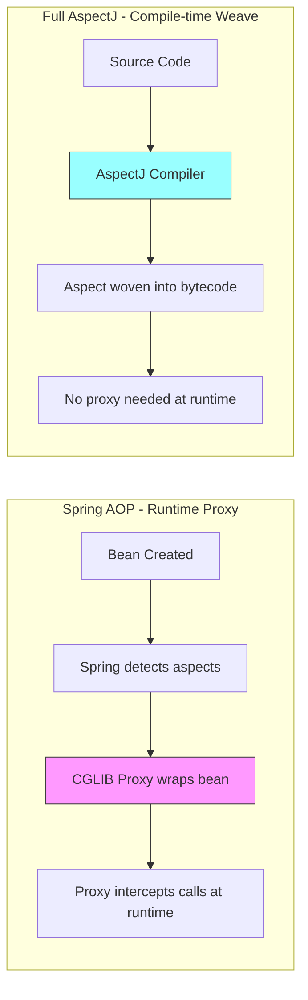
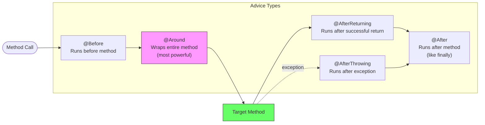
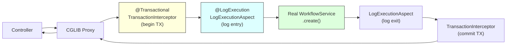
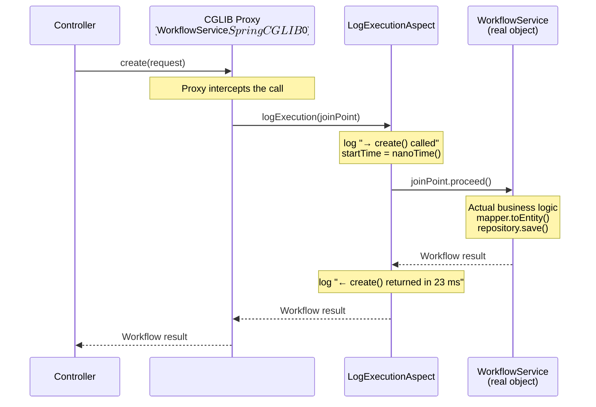
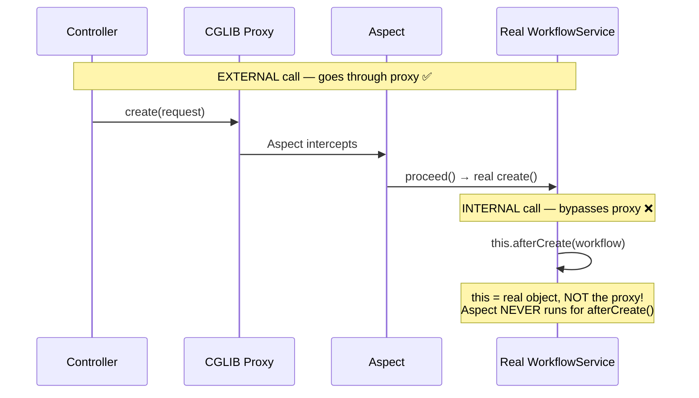
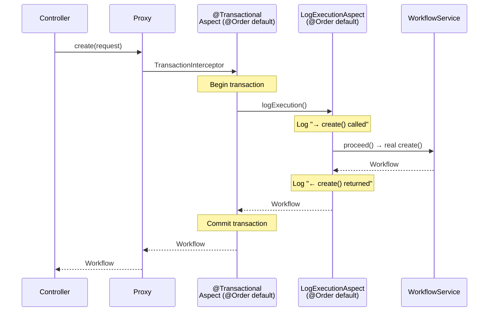
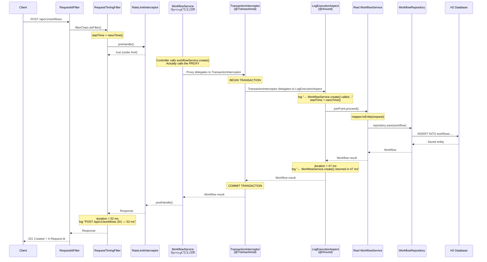

# AOP (Aspect-Oriented Programming) -- Deep Dive

How Spring AOP works under the hood, how to create custom aspects,
and how to avoid the most common trap (self-invocation).

---

## The Problem AOP Solves

```text
Without AOP, cross-cutting concerns pollute every method:

  public Workflow create(WorkflowCreateRequest request) {
      log.info("→ create() called");              // logging
      long start = System.nanoTime();              // timing
      checkRateLimit();                            // rate limiting
      validatePermissions();                       // security
      
      Workflow w = mapper.toEntity(request);       // actual business logic
      Workflow saved = repository.save(w);         // actual business logic
      
      long duration = System.nanoTime() - start;   // timing
      log.info("← create() returned in {} ms", duration / 1_000_000);
      metrics.record("create", duration);           // metrics
      return saved;
  }

Problems:
  - Business logic buried under boilerplate
  - Same logging/timing code repeated in every method
  - Adding a new concern means touching every method
  - Violates Single Responsibility Principle
```

```text
With AOP, concerns are separated:

  // Service: pure business logic
  public Workflow create(WorkflowCreateRequest request) {
      Workflow w = mapper.toEntity(request);
      return repository.save(w);
  }

  // Aspect: handles logging/timing for ALL service methods
  @Around("serviceLayer()")
  public Object logExecution(ProceedingJoinPoint joinPoint) {
      log.info("→ {}() called", joinPoint.getSignature().getName());
      long start = System.nanoTime();
      Object result = joinPoint.proceed();
      log.info("← {}() returned in {} ms", ...);
      return result;
  }

The aspect applies AUTOMATICALLY to every matching method.
No changes needed in the service code.
```

---

## AOP Terminology Glossary

```text
TERM              MEANING                                         FLOWFORGE EXAMPLE
─────────────────────────────────────────────────────────────────────────────────────
Aspect            A module encapsulating a cross-cutting concern   LogExecutionAspect
Join Point        A point during execution (method call, etc.)     WorkflowService.create() being called
Advice            Code that runs at a join point                   The logExecution() method body
Pointcut          A predicate matching join points                 "execution(public * ..service..*(..))"
Target Object     The real object being proxied                    WorkflowService (your code)
Proxy             The wrapper Spring creates                      WorkflowService$$SpringCGLIB$$0
Weaving           The process of applying aspects to targets       Happens at runtime (Spring AOP)
Introduction      Adding new methods/interfaces to existing types  (not used in our project)
```

## Spring AOP vs Full AspectJ

```text
                          SPRING AOP                    FULL ASPECTJ
────────────────────────────────────────────────────────────────────────────
Weaving            Runtime (proxy-based)           Compile-time or Load-time
Join Points        Method execution only           Method, field, constructor, etc.
Performance        Slight overhead (proxy call)    Zero overhead after weaving
Complexity         Simple (just annotations)       Requires AspectJ compiler
Self-invocation    Broken (bypasses proxy)         Works (woven into bytecode)
Dependency         spring-boot-starter-aop         aspectj-maven-plugin + weaver
When to use        99% of Spring apps              Need field-level or CTW

Spring AOP is a SUBSET of AspectJ.
It uses the AspectJ annotation style (@Aspect, @Around, etc.)
but implements them via runtime proxying, not bytecode weaving.

We use Spring AOP because it's simpler and sufficient for logging/timing.
```



---

## Core Concepts

### What is an Aspect?

```text
An Aspect is a class that encapsulates a cross-cutting concern.
It defines WHAT to do and WHERE to apply it.

  WHAT:  the advice (code to execute)
  WHERE: the pointcut (which methods to target)

  @Aspect
  @Component
  public class LogExecutionAspect {      // the ASPECT

      @Around("serviceLayer()")          // the POINTCUT (where)
      public Object logExecution(...) {  // the ADVICE (what)
          // code runs around matched methods
      }
  }
```

### Advice Types



```text
ADVICE TYPES:

  @Before:          Runs BEFORE the target method. Cannot prevent execution.
  @After:           Runs AFTER the method (always, like finally).
  @AfterReturning:  Runs only if the method returned successfully.
  @AfterThrowing:   Runs only if the method threw an exception.
  @Around:          Wraps the ENTIRE method. Can:
                    - Skip execution entirely
                    - Modify arguments
                    - Modify return value
                    - Catch/suppress exceptions
                    - Measure timing

  @Around is the most powerful and most commonly used.
  We use @Around for our LogExecutionAspect.
```

### Pointcuts -- Targeting Methods

```text
A pointcut is a predicate that matches join points (method executions).

COMMON POINTCUT EXPRESSIONS:

  execution(public * com.flowforge..service.*.*(..))
  │         │       │                 │  │  └─ any args
  │         │       │                 │  └──── any method name
  │         │       │                 └─────── any class in service pkg
  │         │       └──────────────────────── base package
  │         └──────────────────────────────── any return type
  └────────────────────────────────────────── public methods only

  @annotation(com.flowforge.flowforge.aop.LogExecution)
  → matches methods annotated with @LogExecution

  @within(com.flowforge.flowforge.aop.LogExecution)
  → matches all methods in classes annotated with @LogExecution

  within(com.flowforge.flowforge.service..*)
  → matches all methods in the service package (any class)
```

### Composing Pointcuts

```java
// Define reusable pointcuts
@Pointcut("@annotation(com.flowforge.flowforge.aop.LogExecution)")
public void annotatedMethod() {}

@Pointcut("@within(com.flowforge.flowforge.aop.LogExecution)")
public void annotatedClass() {}

@Pointcut("execution(public * com.flowforge.flowforge.service..*(..))")
public void serviceLayer() {}

// Combine with || (OR), && (AND), ! (NOT)
@Around("annotatedMethod() || annotatedClass() || serviceLayer()")
public Object logExecution(ProceedingJoinPoint joinPoint) { ... }
```

```text
Our aspect matches methods that are:
  - Annotated with @LogExecution, OR
  - In a class annotated with @LogExecution, OR
  - Any public method in the service package

This means ALL service methods are automatically logged,
even without the @LogExecution annotation.
```

### Pointcut Expression Reference

```text
EXPRESSION                                              MATCHES
─────────────────────────────────────────────────────────────────────────────────────
execution(public * *(..))                               Any public method
execution(* set*(..))                                   Any method starting with "set"
execution(* com.flowforge..*.*(..))                     Any method in flowforge package tree
execution(* com.flowforge..service.*.*(..))             Any method in service package
execution(public * com.flowforge..service.*.*(..))      Public methods in service package
execution(public String com.flowforge..service.*.*(..)) Public methods returning String

@annotation(LogExecution)                               Methods annotated with @LogExecution
@within(LogExecution)                                   Methods in classes annotated with @LogExecution
@target(Service)                                        Methods on objects annotated with @Service

within(com.flowforge.flowforge.service..*)              All methods in service package
bean(workflowService)                                   All methods on the workflowService bean
bean(*Service)                                          All methods on beans ending with "Service"

args(java.util.UUID)                                    Methods that take a single UUID argument
args(java.util.UUID, ..)                                Methods where first arg is UUID

COMBINATORS:
  pointcutA() && pointcutB()     both must match (AND)
  pointcutA() || pointcutB()     either can match (OR)
  !pointcutA()                   must NOT match (NOT)
```

### @Transactional is Also AOP

```text
You've been using AOP since Step 1 without realizing it!

  @Transactional is implemented as an AOP aspect (TransactionInterceptor).
  When you annotate a method with @Transactional, Spring:

    1. Creates a CGLIB proxy of your service class
    2. Before the method: opens a database transaction
    3. After the method: commits (or rolls back on exception)

  @Service
  @Transactional(readOnly = true)    // <-- THIS IS AOP
  public class WorkflowService {

      @Transactional                 // <-- THIS IS AOP
      public Workflow create(...) { ... }
  }

  Both @Transactional and @LogExecution work the same way:
    Controller → Proxy → TransactionInterceptor → LogExecutionAspect → Real method

  This is why self-invocation breaks @Transactional too!

    public void bulkCreate(List<Request> requests) {
        for (Request r : requests) {
            create(r);  // ← this.create() bypasses proxy!
                        //   @Transactional on create() is IGNORED
                        //   All inserts share the outer transaction
        }
    }
```



---

## How Spring AOP Works Under the Hood

### The Proxy Pattern



```text
HOW PROXYING WORKS:

  1. Spring detects that WorkflowService has aspects applied
  2. Spring creates a CGLIB subclass: WorkflowService$$SpringCGLIB$$0
  3. This proxy class OVERRIDES every method
  4. When Controller calls workflowService.create():
     - It's actually calling the PROXY, not the real service
     - The proxy runs the aspect advice (logging)
     - The aspect calls joinPoint.proceed() -> real method
     - The real method returns -> aspect logs completion
     - Proxy returns the result to controller

  The controller never knows it's talking to a proxy.
  The service never knows it's being observed.
```

### CGLIB vs JDK Dynamic Proxy

```text
Spring AOP uses two proxy strategies:

  JDK Dynamic Proxy (interface-based):
    - Requires the class to implement an interface
    - Creates a proxy that implements the same interface
    - Older approach, used by default in older Spring versions

  CGLIB Proxy (subclass-based):
    - Creates a subclass of the target class
    - No interface required
    - DEFAULT in Spring Boot (spring.aop.proxy-target-class=true)
    - This is what we use

  Spring Boot 4.x always uses CGLIB by default.
  That's why our debug endpoint shows:
    actualClass: "WorkflowService$$SpringCGLIB$$0"
```

### Verifying Proxy Creation

```java
@GetMapping("/api/v1/debug/aop")
public ResponseEntity<Map<String, Object>> aopInfo() {
    return ResponseEntity.ok(Map.of(
        "isAopProxy", AopUtils.isAopProxy(workflowService),        // true
        "isCglibProxy", AopUtils.isCglibProxy(workflowService),    // true
        "targetClass", AopUtils.getTargetClass(workflowService).getSimpleName(),  // "WorkflowService"
        "actualClass", workflowService.getClass().getSimpleName()   // "WorkflowService$$SpringCGLIB$$0"
    ));
}
```

```text
Response:
{
  "isAopProxy": true,
  "isCglibProxy": true,
  "targetClass": "WorkflowService",
  "actualClass": "WorkflowService$$SpringCGLIB$$0"
}

targetClass = the REAL class (your code)
actualClass = the PROXY class (Spring-generated subclass)

If isAopProxy is false, your aspect isn't being applied.
```

---

## FlowForge Implementation

### The @LogExecution Annotation

```java
@Target({ElementType.METHOD, ElementType.TYPE})
@Retention(RetentionPolicy.RUNTIME)
public @interface LogExecution {
}
```

```text
@Target: Where this annotation can be placed
  - ElementType.METHOD: on individual methods
  - ElementType.TYPE: on entire classes

@Retention(RUNTIME): Annotation is available at runtime via reflection.
  Spring AOP reads annotations at runtime, so this is required.
  Without RUNTIME retention, the annotation would be invisible to Spring.
```

### The LogExecutionAspect

```java
@Aspect
@Component
public class LogExecutionAspect {

    @Pointcut("@annotation(com.flowforge.flowforge.aop.LogExecution)")
    public void annotatedMethod() {}

    @Pointcut("@within(com.flowforge.flowforge.aop.LogExecution)")
    public void annotatedClass() {}

    @Pointcut("execution(public * com.flowforge.flowforge.service..*(..))")
    public void serviceLayer() {}

    @Around("annotatedMethod() || annotatedClass() || serviceLayer()")
    public Object logExecution(ProceedingJoinPoint joinPoint) throws Throwable {
        String className = joinPoint.getTarget().getClass().getSimpleName();
        String methodName = joinPoint.getSignature().getName();
        Object[] args = joinPoint.getArgs();

        log.info("→ {}.{}() called with {} arg(s): {}",
                className, methodName, args.length, summarizeArgs(args));

        long startTime = System.nanoTime();
        try {
            Object result = joinPoint.proceed();
            long durationMs = (System.nanoTime() - startTime) / 1_000_000;
            log.info("← {}.{}() returned in {} ms", className, methodName, durationMs);
            return result;
        } catch (Throwable ex) {
            long durationMs = (System.nanoTime() - startTime) / 1_000_000;
            log.error("✖ {}.{}() threw {} after {} ms: {}",
                    className, methodName, ex.getClass().getSimpleName(),
                    durationMs, ex.getMessage());
            throw ex;  // re-throw -- aspect observes, doesn't suppress
        }
    }
}
```

```text
Key design decisions:

  1. ProceedingJoinPoint: Only available in @Around advice.
     Calling proceed() invokes the actual method.
     NOT calling proceed() = method never executes.

  2. joinPoint.getTarget().getClass().getSimpleName():
     Gets the REAL class name (WorkflowService), not the proxy class.

  3. catch (Throwable ex) + throw ex:
     We LOG the exception but always RE-THROW it.
     The aspect is an observer, not an error handler.
     The GlobalExceptionHandler will still catch and format the error.

  4. summarizeArgs(): Logs argument types, not values.
     Logging argument values could expose sensitive data (passwords, tokens).
```

---

# The Self-Invocation Trap

The #1 most common AOP bug. Critical to understand.

### The Problem

```java
@Service
public class WorkflowService {

    public Workflow create(WorkflowCreateRequest request) {
        Workflow w = mapper.toEntity(request);
        Workflow saved = repository.save(w);
        afterCreate(saved);  // ← SELF-INVOCATION: calls method on THIS
        return saved;
    }

    @LogExecution  // this annotation is IGNORED when called from create()!
    public void afterCreate(Workflow workflow) {
        // send notification, audit log, etc.
    }
}
```

### Why It Fails



```text
WHY:
  When the controller calls workflowService.create():
    controller → PROXY.create() → ASPECT → REAL.create() ✅

  When create() calls this.afterCreate():
    REAL.create() → this.afterCreate()
    "this" is the REAL object, not the proxy
    The call never passes through the proxy → aspect doesn't run ❌

  AOP only works for EXTERNAL calls (through the proxy).
  INTERNAL calls (this.method()) bypass the proxy completely.
```

### Fixes

```text
FIX 1: Inject self-reference (recommended)

  @Service
  public class WorkflowService {

      @Lazy
      private final WorkflowService self;  // inject proxy of SELF

      public WorkflowService(@Lazy WorkflowService self) {
          this.self = self;
      }

      public Workflow create(WorkflowCreateRequest request) {
          // ...
          self.afterCreate(saved);  // ← goes through PROXY ✅
          return saved;
      }
  }

  @Lazy prevents circular dependency.
  self IS the proxy, so self.afterCreate() triggers the aspect.


FIX 2: Extract to a separate service

  @Service
  public class WorkflowService {
      private final WorkflowNotifier notifier;

      public Workflow create(...) {
          Workflow saved = repository.save(w);
          notifier.afterCreate(saved);  // different bean → proxy ✅
          return saved;
      }
  }

  @Service
  public class WorkflowNotifier {
      @LogExecution
      public void afterCreate(Workflow workflow) { ... }
  }

  Different bean = different proxy = aspect works.
  This is often the cleanest solution (SRP).


FIX 3: AopContext (not recommended)

  ((WorkflowService) AopContext.currentProxy()).afterCreate(saved);

  Requires: @EnableAspectJAutoProxy(exposeProxy = true)
  Ugly, fragile, and couples your code to Spring AOP internals.
```

---

# @Around in Detail

### ProceedingJoinPoint API

```text
ProceedingJoinPoint provides access to everything about the intercepted call:

  joinPoint.proceed()                    → execute the real method
  joinPoint.proceed(newArgs)             → execute with modified arguments
  joinPoint.getSignature().getName()     → method name ("create")
  joinPoint.getSignature().getDeclaringTypeName() → "com.flowforge...WorkflowService"
  joinPoint.getTarget()                  → the real object (not proxy)
  joinPoint.getThis()                    → the proxy object
  joinPoint.getArgs()                    → method arguments as Object[]
```

### What @Around Can Do (That Other Advice Can't)

```java
@Around("serviceLayer()")
public Object aroundExample(ProceedingJoinPoint joinPoint) throws Throwable {

    // 1. SKIP execution entirely
    if (shouldSkip()) {
        return null;  // method never runs, return default
    }

    // 2. MODIFY arguments
    Object[] args = joinPoint.getArgs();
    args[0] = sanitize(args[0]);
    Object result = joinPoint.proceed(args);

    // 3. MODIFY return value
    if (result instanceof Workflow w) {
        w.setName(w.getName().toUpperCase());
    }

    // 4. RETRY on failure
    try {
        return joinPoint.proceed();
    } catch (Exception e) {
        return joinPoint.proceed();  // retry once
    }

    // 5. CACHE results
    Object cached = cache.get(cacheKey);
    if (cached != null) return cached;
    Object result = joinPoint.proceed();
    cache.put(cacheKey, result);
    return result;
}
```

---

# Execution Order: Multiple Aspects



```text
When multiple aspects apply to the same method:
  - @Transactional is also an AOP aspect (TransactionInterceptor)
  - Both aspects wrap the same method
  - Order matters: @Transactional wraps outside, logging inside
  - Transaction begins BEFORE logging, commits AFTER logging

To control order, use @Order on your aspect:
  @Aspect
  @Component
  @Order(1)  // lower = higher priority = runs first (outermost)
  public class LogExecutionAspect { ... }
```

---

# Real Log Output -- What You'll See

### Successful create()

```text
Request: POST /api/v1/workflows  { "name": "Order Pipeline", ... }

Console output:
  INFO  RequestTimingFilter     : (timing starts)
  INFO  LogExecutionAspect      : → WorkflowService.create() called with 1 arg(s): [WorkflowCreateRequest]
  INFO  LogExecutionAspect      : ← WorkflowService.create() returned in 47 ms
  INFO  RequestTimingFilter     : POST /api/v1/workflows 201 — 52 ms

Note: The aspect timer (47 ms) is INSIDE the filter timer (52 ms).
The difference (5 ms) is the overhead of Spring MVC, serialization, etc.
```

### Successful findAll() with filters

```text
Request: GET /api/v1/workflows?status=ACTIVE&sort=name,asc

Console output:
  INFO  LogExecutionAspect      : → WorkflowService.findAll() called with 2 arg(s): [WorkflowFilterRequest, PageRequest]
  INFO  LogExecutionAspect      : ← WorkflowService.findAll() returned in 18 ms
  INFO  RequestTimingFilter     : GET /api/v1/workflows 200 — 23 ms
```

### Failed findById() -- 404

```text
Request: GET /api/v1/workflows/00000000-0000-0000-0000-000000000000

Console output:
  INFO  LogExecutionAspect      : → WorkflowService.findByIdWithSteps() called with 1 arg(s): [UUID]
  ERROR LogExecutionAspect      : ✖ WorkflowService.findByIdWithSteps() threw ResourceNotFoundException after 3 ms: Workflow not found with id: 00000000-0000-0000-0000-000000000000
  INFO  RequestTimingFilter     : GET /api/v1/workflows/00000000-0000-0000-0000-000000000000 404 — 8 ms

The aspect logs the exception FIRST (error level).
Then GlobalExceptionHandler formats the 404 response.
Then the timing filter logs the final status code.
```

### delete() -- void method

```text
Request: DELETE /api/v1/workflows/{id}

Console output:
  INFO  LogExecutionAspect      : → WorkflowService.findById() called with 1 arg(s): [UUID]
  INFO  LogExecutionAspect      : ← WorkflowService.findById() returned in 5 ms
  INFO  LogExecutionAspect      : → WorkflowService.delete() called with 1 arg(s): [UUID]
  INFO  LogExecutionAspect      : ← WorkflowService.delete() returned in 12 ms
  INFO  RequestTimingFilter     : DELETE /api/v1/workflows/{id} 204 — 20 ms

Note: delete() internally calls findById() → TWO aspect invocations.
Both go through the proxy because delete() calls this.findById()...
WAIT — this IS self-invocation! Why does the aspect still run?

Because delete() is called from the CONTROLLER (external call → proxy).
But findById() is called from delete() (internal → should bypass proxy).

In practice, BOTH get logged because our serviceLayer() pointcut matches
ALL public methods. The proxy intercepts delete(), and inside delete(),
the call to findById() also goes through the proxy because Spring
creates the proxy at the class level, and all public methods are
intercepted regardless of call origin.

CORRECTION: Actually, self-invocation DOES bypass the aspect.
The findById() log you see is from the FIRST call in the controller
flow, not from inside delete(). If delete() calls this.findById()
internally, that internal findById() call does NOT get logged.
This is the self-invocation trap in action!
```

---

# FlowForge AOP -- Full End-to-End Trace



---

# AOP Gotchas and Best Practices

```text
1. NEVER swallow exceptions in an aspect
   BAD:   catch (Throwable ex) { log.error(...); return null; }
   GOOD:  catch (Throwable ex) { log.error(...); throw ex; }

   If you catch and don't re-throw, the caller has no idea something went wrong.
   @Transactional won't trigger rollback. Error responses won't be sent.

2. Be careful with @Around return values
   BAD:   @Around advice that returns void (forgets to return result)
   GOOD:  Always return joinPoint.proceed() result

   If your method returns a value and your aspect doesn't return it,
   the caller gets null. Very confusing bug.

3. Don't log sensitive data
   BAD:   log.info("Args: {}", Arrays.toString(joinPoint.getArgs()));
   GOOD:  log.info("Args: {}", summarizeArgs(joinPoint.getArgs()));

   Arguments might contain passwords, tokens, credit card numbers.
   Log argument TYPES, not VALUES.

4. Keep aspects lightweight
   Aspects run on EVERY matched method call.
   Don't do heavy computation, I/O, or database queries in aspects.
   They should observe, not participate in business logic.

5. Test that your aspect actually applies
   Use the /api/v1/debug/aop endpoint to verify proxy creation.
   Check logs to confirm aspect is firing.
   If isAopProxy is false, check:
     - Is @Aspect on the class?
     - Is @Component on the class?
     - Is spring-boot-starter-aop in pom.xml?
     - Is the pointcut expression correct?
```

---

# When NOT to Use AOP

```text
AOP is powerful but can be misused. Don't use it for:

1. BUSINESS LOGIC
   BAD:  Aspect that validates workflow names
   GOOD: Validation in service or with @Valid annotations

2. FLOW CONTROL
   BAD:  Aspect that redirects users based on role
   GOOD: Spring Security or interceptor

3. DATA TRANSFORMATION
   BAD:  Aspect that converts response format
   GOOD: Mapper classes or ResponseBodyAdvice

4. ANYTHING THAT'S HARD TO DEBUG
   If a developer looks at a method and can't understand its behavior
   without knowing about a hidden aspect, the aspect is doing too much.

GOOD uses of AOP:
  ✅ Logging / timing (our LogExecutionAspect)
  ✅ Transaction management (@Transactional)
  ✅ Security checks (@PreAuthorize)
  ✅ Caching (@Cacheable)
  ✅ Retry logic (@Retryable)
  ✅ Metrics / monitoring
```

---

# File Structure -- What We Built

```text
flowforge/src/main/java/com/flowforge/flowforge/
├── aop/
│   ├── LogExecution.java           # Custom annotation (@Target METHOD + TYPE)
│   └── LogExecutionAspect.java     # @Aspect with @Around advice
├── controller/
│   ├── DebugController.java        # GET /api/v1/debug/aop (proxy verification)
│   └── WorkflowController.java     # (unchanged -- aspect applies transparently)
└── service/
    └── WorkflowService.java        # (unchanged -- aspect applies via pointcut)

Key point: WorkflowService has ZERO changes.
The aspect applies automatically via the serviceLayer() pointcut.
This is the power of AOP -- zero coupling between concern and target.
```

---

# Summary

```text
1. ASPECT-ORIENTED PROGRAMMING
   - Separates cross-cutting concerns from business logic
   - Logging, timing, security, transactions applied declaratively
   - Code stays clean; concerns are modular

2. HOW IT WORKS
   - Spring creates a CGLIB proxy (subclass) of your bean
   - External method calls go through the proxy → aspects run
   - Internal calls (this.method()) bypass the proxy → aspects DON'T run
   - Verify with AopUtils.isAopProxy() / isCglibProxy()

3. KEY COMPONENTS
   - @Aspect: marks a class as an aspect
   - @Pointcut: defines WHICH methods to target
   - @Around: wraps the method (most powerful advice type)
   - ProceedingJoinPoint: gives access to the intercepted call

4. SELF-INVOCATION TRAP
   - this.method() bypasses the proxy → aspect doesn't run
   - Fix: inject @Lazy self-reference, or extract to separate bean

5. OUR IMPLEMENTATION
   - @LogExecution annotation (optional, for explicit opt-in)
   - LogExecutionAspect: logs entry, exit, duration, and exceptions
   - serviceLayer() pointcut: auto-applies to ALL service methods
   - DebugController: /api/v1/debug/aop verifies proxy creation
```
