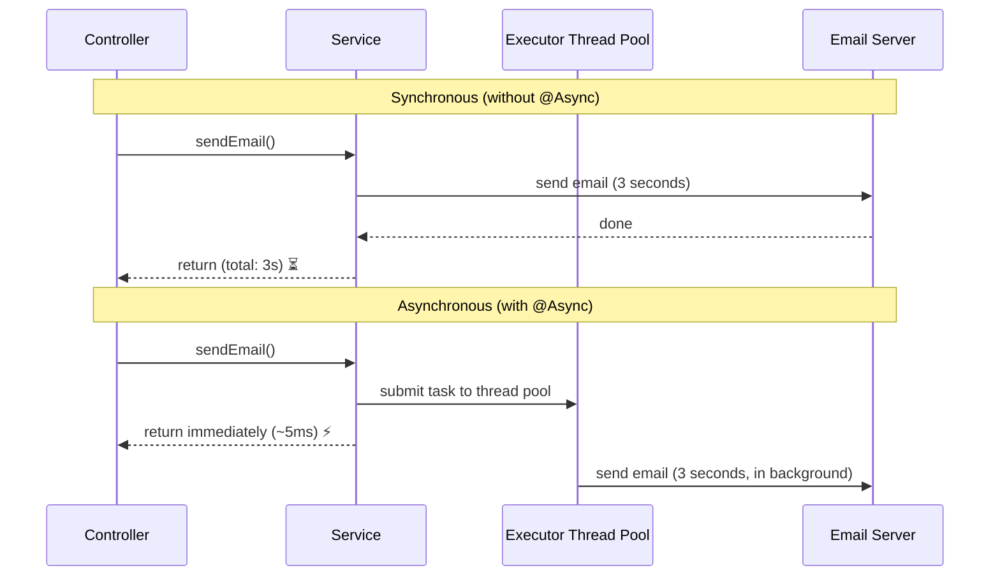
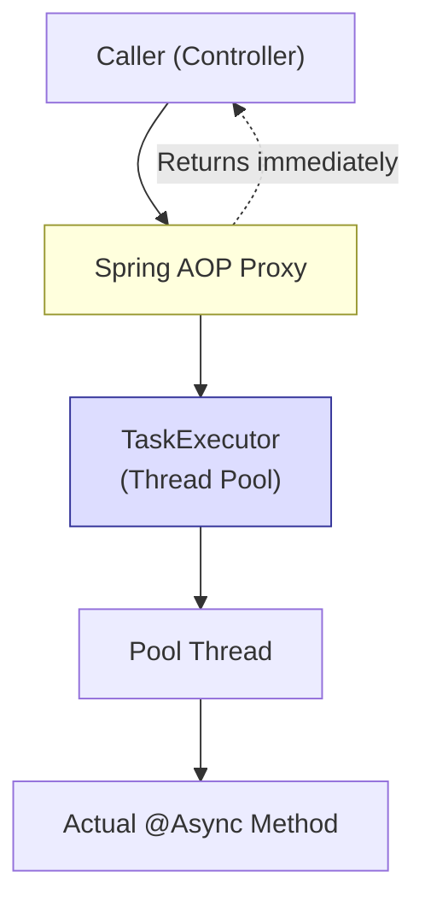
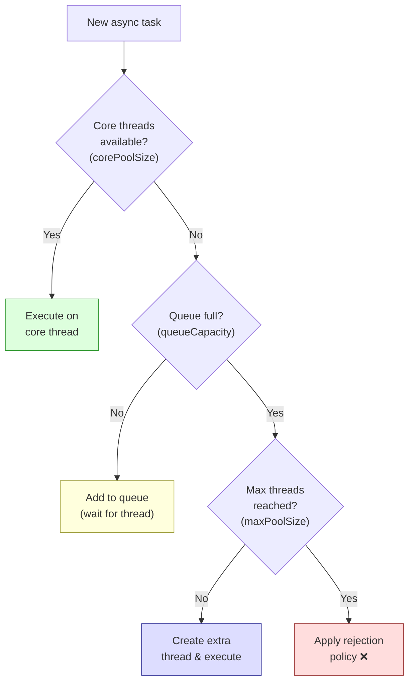
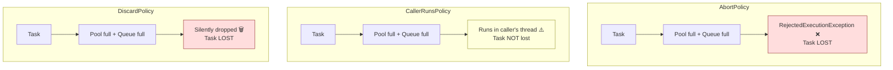
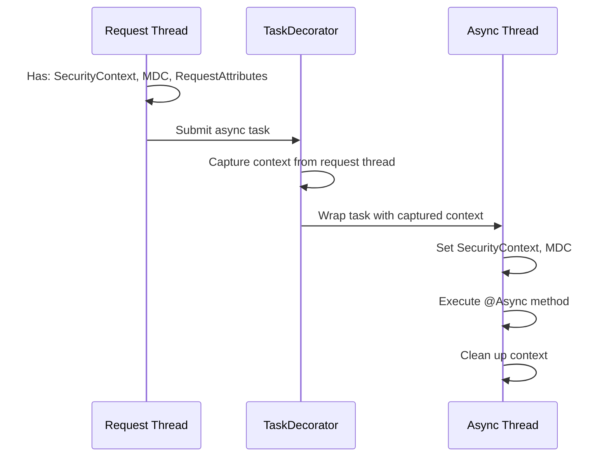
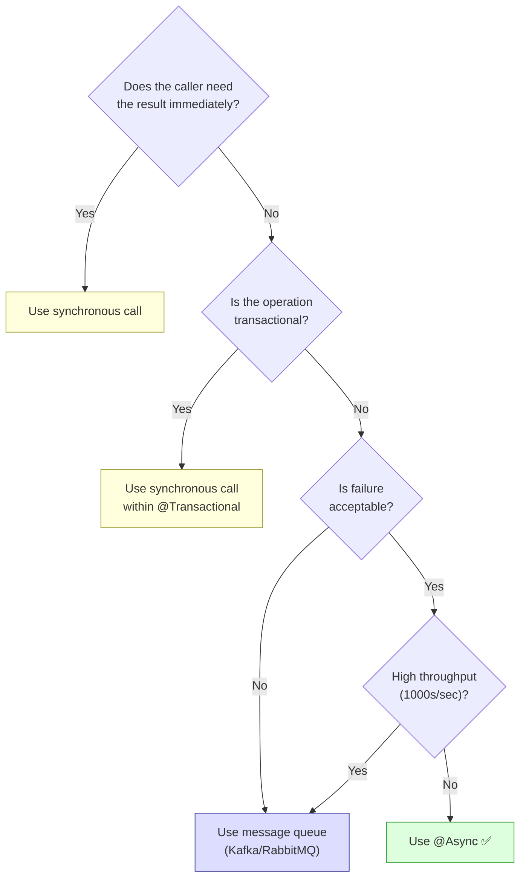

# Async Processing

Spring's @Async, executor configuration, thread pools, queue sizes,
rejection policies, context propagation, exception handling, and
when NOT to use @Async.

---

## 1. What Is @Async

```text
@Async tells Spring to execute a method in a SEPARATE thread,
returning control to the caller immediately.

WITHOUT @Async (synchronous):
  Controller → service.sendEmail() → waits 3 seconds → returns response
  Total response time: 3+ seconds

WITH @Async:
  Controller → service.sendEmail() → returns IMMEDIATELY → response sent
  Email sending happens in background thread
  Total response time: ~50ms (email sends later)

The caller does NOT wait for the async method to complete.
```



---

## 2. How @Async Works Under the Hood

```text
@Async works through Spring AOP proxies — the same mechanism as
@Transactional, @Cacheable, etc.

When you call an @Async method:
  1. You're actually calling the PROXY, not the real object
  2. The proxy wraps the method call in a Runnable/Callable
  3. The proxy submits the task to a TaskExecutor (thread pool)
  4. The proxy returns immediately (or returns a Future/CompletableFuture)
  5. The actual method executes in a thread pool thread

CRITICAL RULE: @Async only works when called from OUTSIDE the class.
Internal method calls bypass the proxy → run synchronously.
```



### The Self-Invocation Trap

```java
@Service
public class NotificationService {

    // ❌ BROKEN: internal call bypasses proxy
    public void processOrder(Order order) {
        // ...
        sendEmail(order.getEmail());  // calls THIS.sendEmail(), not proxy
    }

    @Async
    public void sendEmail(String email) {
        // This runs SYNCHRONOUSLY when called from processOrder()!
        emailSender.send(email);
    }
}

// ✅ CORRECT: call from another bean (goes through proxy)
@Service
public class OrderService {
    private final NotificationService notificationService;

    public void processOrder(Order order) {
        // ...
        notificationService.sendEmail(order.getEmail());  // through proxy ✅
    }
}
```

```text
Why does this happen?
  - Spring creates a PROXY around NotificationService
  - External calls go: caller → proxy → real method
  - Internal calls go: this.method() → real method (no proxy!)
  - The proxy never intercepts internal calls
  - Same problem affects @Transactional, @Cacheable, etc.
```

---

## 3. Enabling @Async and Configuration

```java
@Configuration
@EnableAsync
public class AsyncConfig {
}
```

### Basic Usage

```java
@Service
public class NotificationService {

    // Fire-and-forget — returns void
    @Async
    public void sendEmail(String to, String subject, String body) {
        emailSender.send(to, subject, body);
    }

    // Returns a Future — caller can check result later
    @Async
    public CompletableFuture<EmailResult> sendEmailWithResult(String to) {
        EmailResult result = emailSender.send(to);
        return CompletableFuture.completedFuture(result);
    }
}
```

---

## 4. Executor Configuration — This Is Critical

```text
By default, Spring Boot uses a SimpleAsyncTaskExecutor which creates
a NEW THREAD for every task. This is TERRIBLE for production:

  1000 async calls → 1000 threads → OOM / thread exhaustion

You MUST configure a proper thread pool executor.
```

### ThreadPoolTaskExecutor Parameters

```text
┌──────────────────────┬───────────────────────────────────────────────────┐
│ Parameter            │ Description                                       │
├──────────────────────┼───────────────────────────────────────────────────┤
│ corePoolSize         │ Threads always kept alive (even if idle)          │
│                      │ Default: 8                                        │
│                      │                                                   │
│ maxPoolSize          │ Maximum threads allowed                           │
│                      │ Only used AFTER queue is full                     │
│                      │                                                   │
│ queueCapacity        │ Size of the task queue between core and max       │
│                      │ Tasks queue here when all core threads are busy   │
│                      │                                                   │
│ keepAliveSeconds     │ How long idle threads above corePoolSize live     │
│                      │                                                   │
│ threadNamePrefix     │ Prefix for thread names (for debugging/logging)   │
│                      │                                                   │
│ rejectionPolicy      │ What to do when pool AND queue are both full      │
└──────────────────────┴───────────────────────────────────────────────────┘
```

### How Thread Pool Sizing Works

```text
This is the MOST MISUNDERSTOOD part of thread pools:

  Task arrives → Are core threads available?
    YES → execute on core thread
    NO  → Is queue full?
          NO  → add to queue (waits for a core thread)
          YES → Are max threads available?
                YES → create new thread (up to maxPoolSize)
                NO  → apply rejection policy

IMPORTANT: maxPoolSize kicks in ONLY AFTER the queue is full!

  corePoolSize = 5
  queueCapacity = 100
  maxPoolSize = 20

  Tasks 1–5: run on 5 core threads
  Tasks 6–105: queued (waiting for a core thread to free up)
  Tasks 106–120: create extra threads (up to maxPoolSize = 20)
  Task 121+: REJECTED (pool exhausted)

  maxPoolSize is NOT "max concurrent threads from the start."
  It's "overflow threads when the queue is full."
```



### Configuration Example

```java
@Configuration
@EnableAsync
public class AsyncConfig implements AsyncConfigurer {

    @Override
    @Bean(name = "taskExecutor")
    public Executor getAsyncExecutor() {
        ThreadPoolTaskExecutor executor = new ThreadPoolTaskExecutor();
        executor.setCorePoolSize(10);
        executor.setMaxPoolSize(25);
        executor.setQueueCapacity(100);
        executor.setKeepAliveSeconds(60);
        executor.setThreadNamePrefix("async-");
        executor.setRejectedExecutionHandler(
            new ThreadPoolExecutor.CallerRunsPolicy()
        );
        executor.setWaitForTasksToCompleteOnShutdown(true);
        executor.setAwaitTerminationSeconds(30);
        executor.initialize();
        return executor;
    }

    // Multiple executors for different workloads
    @Bean(name = "emailExecutor")
    public Executor emailExecutor() {
        ThreadPoolTaskExecutor executor = new ThreadPoolTaskExecutor();
        executor.setCorePoolSize(5);
        executor.setMaxPoolSize(10);
        executor.setQueueCapacity(50);
        executor.setThreadNamePrefix("email-");
        executor.initialize();
        return executor;
    }

    @Bean(name = "reportExecutor")
    public Executor reportExecutor() {
        ThreadPoolTaskExecutor executor = new ThreadPoolTaskExecutor();
        executor.setCorePoolSize(2);
        executor.setMaxPoolSize(5);
        executor.setQueueCapacity(10);
        executor.setThreadNamePrefix("report-");
        executor.initialize();
        return executor;
    }
}

// Using a specific executor
@Async("emailExecutor")
public void sendEmail(String to) { ... }

@Async("reportExecutor")
public void generateReport(UUID reportId) { ... }
```

---

## 5. Rejection Policies

```text
When the thread pool AND queue are both full, the rejection policy
determines what happens to new tasks.

┌─────────────────────────┬──────────────────────────────────────────────┐
│ Policy                  │ Behavior                                     │
├─────────────────────────┼──────────────────────────────────────────────┤
│ AbortPolicy (default)   │ Throws RejectedExecutionException            │
│                         │ Task is LOST. Caller gets an exception.      │
│                         │                                              │
│ CallerRunsPolicy        │ Runs the task in the CALLER's thread         │
│                         │ Provides backpressure — slows down caller    │
│                         │ Task is NOT lost. Best for most cases.       │
│                         │                                              │
│ DiscardPolicy           │ Silently drops the task                      │
│                         │ Task is LOST. No exception, no logging.      │
│                         │ DANGEROUS — never use in production.         │
│                         │                                              │
│ DiscardOldestPolicy     │ Drops the OLDEST queued task, adds new one   │
│                         │ Oldest task is LOST.                         │
└─────────────────────────┴──────────────────────────────────────────────┘

Best practice: Use CallerRunsPolicy for most applications.
  - No task is lost
  - Provides natural backpressure
  - Caller thread slows down (processes one task itself)
  - System degrades gracefully instead of throwing errors
```



---

## 6. Context Propagation

```text
When a task runs in a different thread, it loses context from the
original request thread:

  LOST:
    - SecurityContext (who is the authenticated user?)
    - MDC (logging correlation ID, trace ID)
    - RequestAttributes (HTTP request data)
    - Transaction context (not shared across threads)
    - ThreadLocal values

  Original thread:                    Async thread:
    SecurityContext: user=john          SecurityContext: NULL ❌
    MDC: traceId=abc123                 MDC: traceId=NULL ❌
    Request: GET /api/orders            Request: NULL ❌

If your async method needs to know who the caller is or needs
the trace ID for logging, you must propagate context manually.
```

### Solutions

```java
// Solution 1: Use a TaskDecorator to propagate context
public class ContextCopyingDecorator implements TaskDecorator {
    @Override
    public Runnable decorate(Runnable runnable) {
        // Capture context from the CALLING thread
        RequestAttributes requestAttributes =
            RequestContextHolder.getRequestAttributes();
        SecurityContext securityContext =
            SecurityContextHolder.getContext();
        Map<String, String> mdcContext = MDC.getCopyOfContextMap();

        return () -> {
            try {
                // Set context in the ASYNC thread
                RequestContextHolder.setRequestAttributes(requestAttributes);
                SecurityContextHolder.setContext(securityContext);
                if (mdcContext != null) {
                    MDC.setContextMap(mdcContext);
                }
                runnable.run();
            } finally {
                // Clean up to prevent memory leaks
                RequestContextHolder.resetRequestAttributes();
                SecurityContextHolder.clearContext();
                MDC.clear();
            }
        };
    }
}

// Register the decorator
@Bean
public Executor taskExecutor() {
    ThreadPoolTaskExecutor executor = new ThreadPoolTaskExecutor();
    executor.setCorePoolSize(10);
    executor.setMaxPoolSize(25);
    executor.setQueueCapacity(100);
    executor.setTaskDecorator(new ContextCopyingDecorator());  // ← key line
    executor.initialize();
    return executor;
}
```



---

## 7. Exception Handling

```text
Exception handling depends on the return type of the @Async method:

VOID return type:
  Exception is LOST by default. The caller already returned.
  No one catches the exception. It just logs to stderr (maybe).
  You MUST configure an AsyncUncaughtExceptionHandler.

Future / CompletableFuture return type:
  Exception is captured in the Future.
  Caller can handle it via .exceptionally() or .get() (which throws).
```

```java
// Handle exceptions for void @Async methods
@Configuration
@EnableAsync
public class AsyncConfig implements AsyncConfigurer {

    @Override
    public AsyncUncaughtExceptionHandler getAsyncUncaughtExceptionHandler() {
        return (throwable, method, params) -> {
            log.error("Async method {} failed with exception: {}",
                method.getName(), throwable.getMessage(), throwable);
            // Alert, increment metric, send to error tracking, etc.
        };
    }
}

// Handle exceptions for CompletableFuture @Async methods
@Async
public CompletableFuture<Void> sendEmail(String to) {
    try {
        emailSender.send(to);
        return CompletableFuture.completedFuture(null);
    } catch (Exception e) {
        return CompletableFuture.failedFuture(e);
    }
}

// Caller handles the exception
CompletableFuture<Void> future = notificationService.sendEmail(email);
future.exceptionally(ex -> {
    log.error("Email failed: {}", ex.getMessage());
    return null;
});
```

---

## 8. When NOT to Use @Async

```text
@Async is NOT always the right choice. Understand these anti-patterns:

1. DON'T use @Async for database operations that need transactions
   @Async runs in a different thread → different transaction context.
   The caller's @Transactional does NOT extend to the async method.
   If the async method fails, the caller's transaction has already
   committed. No rollback.

2. DON'T use @Async when you need the result immediately
   If the controller needs the result to build the response,
   @Async forces you to block with .get() → defeats the purpose.
   Just call the method synchronously.

3. DON'T use @Async for critical operations without error handling
   Void @Async methods silently swallow exceptions.
   Payment processing, order creation — NEVER fire-and-forget.

4. DON'T use @Async for high-throughput message processing
   Use a message queue (Kafka, RabbitMQ) instead.
   Message queues provide persistence, retry, DLQ, backpressure.
   @Async provides none of these.

5. DON'T use @Async as a substitute for proper scaling
   100 async tasks on one instance ≠ distributed processing.
   For large-scale work, use Spring Batch or message queues.

6. DON'T use @Async without configuring the executor
   Default SimpleAsyncTaskExecutor creates unbounded threads.
   Under load → thousands of threads → OOM.

WHEN TO USE @Async:
  ✅ Sending notifications (email, SMS, push)
  ✅ Audit logging that doesn't need transactional guarantees
  ✅ Cache warming / preloading
  ✅ Non-critical background cleanup
  ✅ Any task where "best-effort" is acceptable
```



---

## 9. @Async with CompletableFuture Patterns

```java
// Pattern 1: Fan-out — call multiple services in parallel
@Service
public class DashboardService {

    private final UserService userService;
    private final OrderService orderService;
    private final AnalyticsService analyticsService;

    public DashboardDTO getDashboard(UUID userId) {
        CompletableFuture<UserProfile> profileFuture =
            userService.getProfileAsync(userId);
        CompletableFuture<List<Order>> ordersFuture =
            orderService.getRecentOrdersAsync(userId);
        CompletableFuture<Analytics> analyticsFuture =
            analyticsService.getUserAnalyticsAsync(userId);

        // Wait for all three to complete
        CompletableFuture.allOf(profileFuture, ordersFuture, analyticsFuture)
            .join();

        return DashboardDTO.builder()
            .profile(profileFuture.join())
            .recentOrders(ordersFuture.join())
            .analytics(analyticsFuture.join())
            .build();
    }
}

// Pattern 2: Chain — one result feeds the next
@Async
public CompletableFuture<Report> generateReport(UUID userId) {
    return userService.getProfileAsync(userId)
        .thenCompose(profile ->
            orderService.getOrdersAsync(profile.getId()))
        .thenApply(orders ->
            reportGenerator.generate(orders))
        .exceptionally(ex -> {
            log.error("Report failed: {}", ex.getMessage());
            return Report.empty();
        });
}
```

---

## 10. Graceful Shutdown

```text
When the application shuts down, async tasks in the queue may be lost.

Without graceful shutdown:
  App receives SIGTERM → immediately kills threads
  → Tasks in queue are LOST
  → Running tasks are INTERRUPTED

With graceful shutdown:
  App receives SIGTERM → stops accepting new tasks
  → Waits for running tasks to complete (up to timeout)
  → Tasks in queue are drained
  → Then shuts down

Configuration:
  executor.setWaitForTasksToCompleteOnShutdown(true);
  executor.setAwaitTerminationSeconds(30);

  application.yml:
    server:
      shutdown: graceful
    spring:
      lifecycle:
        timeout-per-shutdown-phase: 30s
```

---

## 11. Interview Questions

### Q1: How does @Async work in Spring?

```text
@Async uses Spring AOP proxies. When you call an @Async method:
1. The call goes through a proxy (not the real object)
2. The proxy wraps the method in a Runnable
3. The Runnable is submitted to a TaskExecutor (thread pool)
4. The proxy returns immediately
5. The method executes asynchronously in a pool thread

It only works when called from outside the class (through the proxy).
Internal method calls bypass the proxy and run synchronously.
```

### Q2: What is the self-invocation problem with @Async?

```text
If method A in a class calls method B (annotated with @Async) in the
SAME class, the call goes through "this" — bypassing the Spring proxy.
The @Async annotation is ignored, and B runs synchronously.

Fix: Move the @Async method to a different bean, or inject the proxy
of the same class (self-injection), or use ApplicationContext.getBean().
```

### Q3: What happens if you don't configure a TaskExecutor?

```text
Spring Boot auto-configures a ThreadPoolTaskExecutor with sensible
defaults (core=8, maxPool=Integer.MAX_VALUE, queueCapacity=Integer.MAX_VALUE
in older versions).

Without explicit configuration, under high load you risk:
- Unbounded thread creation → OOM
- Unbounded queue → memory exhaustion
- No backpressure → system overwhelmed

Always configure pool size, queue capacity, and rejection policy.
```

### Q4: Explain the thread pool sizing flow (core → queue → max).

```text
1. Tasks 1-N (N = corePoolSize): execute on core threads
2. When all core threads busy: tasks go to the QUEUE
3. Queue holds up to queueCapacity tasks
4. When queue is FULL: new threads created up to maxPoolSize
5. When maxPoolSize reached AND queue full: rejection policy applies

Key insight: maxPoolSize threads are NOT created until the queue is full.
If queueCapacity is large, maxPoolSize may never be reached.
```

### Q5: What is CallerRunsPolicy and why is it recommended?

```text
CallerRunsPolicy runs the rejected task in the CALLER's thread instead
of throwing an exception or dropping the task.

Benefits:
- No task is lost
- Provides natural backpressure (caller slows down)
- System degrades gracefully under load

Downside:
- Caller's thread is blocked until the task completes
- In a web app, the HTTP request thread processes the task
  → increases response time for that request
```

### Q6: How do you handle exceptions in @Async methods?

```text
Void methods: Exceptions are lost by default.
  → Configure AsyncUncaughtExceptionHandler

CompletableFuture methods: Exception stored in the future.
  → Handle with .exceptionally() or .handle()

Best practice:
  - Always catch and log in the async method itself
  - Use CompletableFuture when the caller needs to know about errors
  - Use AsyncUncaughtExceptionHandler as a safety net for void methods
```

### Q7: How does context propagation work with @Async?

```text
Async methods run in a different thread, losing:
  - SecurityContext (authenticated user)
  - MDC (trace/correlation IDs)
  - RequestAttributes (HTTP request data)

Fix: Use a TaskDecorator that captures context from the calling thread
and sets it in the async thread before execution, cleaning it up after.

This is critical for:
  - Security: async method needs to know the caller's identity
  - Observability: logs need the same traceId for correlation
```

### Q8: When should you use @Async vs a message queue?

```text
@Async:
  - Simple fire-and-forget within the same application
  - Best-effort delivery (task lost on crash/restart)
  - Low-to-moderate throughput
  - No persistence needed

Message Queue (Kafka/RabbitMQ):
  - Reliable delivery (persisted, survives restarts)
  - High throughput (millions/sec)
  - Retry with DLQ
  - Backpressure across services
  - Cross-service communication
  - Exactly-once / at-least-once semantics

Rule: If losing the task is not acceptable → use a message queue.
```

### Q9: Can @Async participate in the caller's transaction?

```text
NO. @Async runs in a different thread, which means a different
transaction context. The caller's @Transactional boundary does NOT
extend to the async thread.

If the async method fails:
  - Caller's transaction is already committed (or committed independently)
  - No automatic rollback of the caller's work

If you need transactional async work, consider:
  - Transactional Outbox pattern (save event in DB, process async later)
  - Message queue with transactional producer
```

### Q10: How do you size the thread pool for @Async?

```text
Depends on the work type:

CPU-bound work (data processing, computation):
  corePoolSize ≈ number of CPU cores
  maxPoolSize ≈ cores * 1.5
  queueCapacity = moderate (100-500)

I/O-bound work (API calls, DB queries, email sending):
  corePoolSize ≈ cores * 2-4
  maxPoolSize ≈ cores * 4-8
  queueCapacity = larger (500-5000)

Rule of thumb:
  - I/O tasks spend time WAITING → more threads are useful
  - CPU tasks use the CPU → too many threads = context switching overhead
  - Monitor queue depth and rejection count in production
  - Adjust based on actual throughput and latency metrics
```
