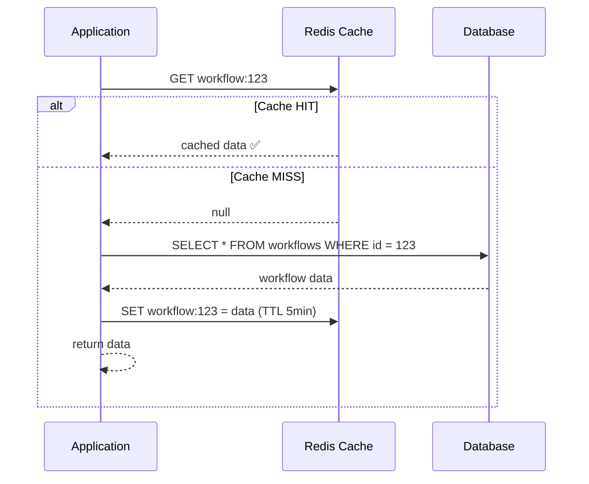

# Caching

Cache strategies, Spring's caching abstraction, Redis data structures,
and advanced problems (stampede, penetration, avalanche).

---

## 1. Why Cache

```text
Without cache:
  User requests product page → query DB → 50ms
  1000 users request same product → 1000 DB queries → 50,000ms total
  DB load: 1000 queries for the SAME data that hasn't changed.

With cache:
  First request → query DB (50ms) → store result in cache
  Next 999 requests → read from cache (0.1ms each) → 99.9ms total
  DB load: 1 query. Cache serves the other 999.

  Speedup: 50,000ms → 150ms = 333x faster
  DB load: 1000 queries → 1 query = 1000x reduction
```

---

## 2. Caching Strategies

### Cache-Aside (Lazy Loading) — Most Common

```text
Application manages the cache explicitly.
Check cache first → miss → load from DB → put in cache.

  READ:
    1. Check cache for key
    2. Cache HIT → return cached data
    3. Cache MISS → query DB → store result in cache → return

  WRITE:
    1. Write to DB
    2. Invalidate (delete) cache entry
    3. Next read will repopulate the cache
```



```text
PROS:
  ✅ Simple to implement
  ✅ Only caches data that is actually requested (hot data)
  ✅ Cache failure is not critical (falls back to DB)

CONS:
  ❌ First request is always slow (cache miss)
  ❌ Stale data possible (cache updated only on next read after write)
  ❌ Cache stampede risk (many concurrent misses for same key)
```

### Read-Through

```text
Cache is responsible for loading data from DB on a miss.
Application always reads from cache. Cache talks to DB.

  READ:
    1. Application asks cache for key
    2. Cache HIT → return
    3. Cache MISS → cache loads from DB itself → stores → returns

  Same as cache-aside, but the CACHE does the loading, not the app.
  Application code is simpler (just reads from cache, never touches DB directly).

  Implemented by cache providers (Ehcache, Caffeine with CacheLoader).
```

### Write-Through

```text
Every write goes to BOTH cache and DB synchronously.

  WRITE:
    1. Application writes to cache
    2. Cache writes to DB (synchronously)
    3. Both cache and DB are updated atomically

  PROS:
    ✅ Cache is always consistent with DB
    ✅ No stale reads after writes

  CONS:
    ❌ Write latency increases (cache + DB write on every operation)
    ❌ Cache may store data that's never read (waste of memory)
```

### Write-Behind (Write-Back)

```text
Writes go to cache immediately. Cache writes to DB asynchronously (later).

  WRITE:
    1. Application writes to cache → returns immediately (fast)
    2. Cache queues the write
    3. Cache writes to DB after a delay (batched)

  PROS:
    ✅ Very fast writes (cache is in-memory)
    ✅ Batch writes reduce DB load

  CONS:
    ❌ Data loss risk if cache crashes before writing to DB
    ❌ Complex to implement correctly
    ❌ Eventual consistency between cache and DB
```

### Strategy Comparison

```text
STRATEGY        WRITE SPEED   READ SPEED   CONSISTENCY   COMPLEXITY
──────────────────────────────────────────────────────────────────────
Cache-Aside     Normal        Fast*        Eventual      Simple
Read-Through    Normal        Fast*        Eventual      Medium
Write-Through   Slower        Fast         Strong        Medium
Write-Behind    Very fast     Fast         Eventual      Complex

* After first read (cache populated)
```

---

## 3. TTL and Eviction

### TTL (Time To Live)

```text
How long a cached value stays before being automatically deleted.

  SET workflow:123 = data  TTL 300 seconds  (5 minutes)

  t=0s:    data stored in cache
  t=299s:  data still in cache
  t=300s:  data auto-deleted by cache (expired)
  t=301s:  next read → cache miss → reload from DB

  CHOOSING TTL:
    Too short (10s):  frequent cache misses → high DB load → cache is barely useful
    Too long (24h):   stale data → users see outdated information
    Right (5-15 min): good balance for most web apps

  GUIDELINES:
    Reference data (countries, currencies):  24 hours+
    User profiles:                           5-15 minutes
    Product listings:                        1-5 minutes
    Real-time data (stock prices):           seconds or no cache
    Session data:                            30 minutes (with refresh)
```

### Eviction Policies

```text
When cache is FULL, which entries to remove?

  POLICY              DESCRIPTION                        USE WHEN
  ─────────────────────────────────────────────────────────────────
  LRU (Least          Remove least recently accessed      General purpose (default)
  Recently Used)      Keeps hot data, evicts cold data

  LFU (Least          Remove least frequently accessed    Data has stable popularity
  Frequently Used)    Keeps popular data, evicts rare     (some items always hot)

  FIFO (First In,     Remove oldest entry                 All entries equally likely
  First Out)          Simple but not popularity-aware     to be accessed

  Random              Remove random entry                 When access is unpredictable
                      Simple, surprisingly effective

  TTL-based           Remove expired entries first        Time-sensitive data

  Redis default: noeviction (returns error when full)
  Redis recommended: allkeys-lru (evict least recently used keys)
    maxmemory-policy allkeys-lru
```

---

## 4. Spring Cache Abstraction

### @Cacheable

```java
@Cacheable(value = "workflows", key = "#id")
public Workflow findById(UUID id) {
    return workflowRepository.findById(id).orElseThrow();
}
```

```text
How it works:
  1. Before the method runs, Spring checks cache "workflows" for key = id
  2. Cache HIT → return cached value (method NEVER executes)
  3. Cache MISS → execute method → store result in cache → return

  Second call with same id → method is SKIPPED, cached value returned.
  The method body doesn't run at all on cache hit.
```

### @CachePut

```java
@CachePut(value = "workflows", key = "#result.id")
public Workflow create(WorkflowCreateRequest request) {
    Workflow wf = workflowMapper.toEntity(request);
    return workflowRepository.save(wf);
}
```

```text
How it works:
  Always executes the method, then stores the result in cache.
  Unlike @Cacheable, the method ALWAYS runs.

  Use for: writes (create, update) — ensure cache has the latest value.
```

### @CacheEvict

```java
@CacheEvict(value = "workflows", key = "#id")
public void delete(UUID id) {
    workflowRepository.deleteById(id);
}

// Evict ALL entries in a cache
@CacheEvict(value = "workflows", allEntries = true)
public void clearWorkflowCache() { }
```

```text
How it works:
  Removes the entry from cache. Next @Cacheable call will reload from DB.
  Use for: deletes and updates (invalidate stale data).
```

### @Caching (Multiple Operations)

```java
@Caching(
    put = @CachePut(value = "workflows", key = "#result.id"),
    evict = @CacheEvict(value = "workflowLists", allEntries = true)
)
public Workflow update(UUID id, WorkflowUpdateRequest request) {
    // Update individual cache entry AND invalidate list caches
}
```

### Enabling Caching

```java
@SpringBootApplication
@EnableCaching
public class FlowforgeApplication { }
```

```yaml
# application.yaml
spring:
  cache:
    type: redis          # or caffeine, ehcache, simple
    redis:
      time-to-live: 300s # default TTL for all caches
```

---

## 5. Redis Data Structures

```text
Redis is not just a key-value store. It has rich data structures.
```

### Strings

```text
The simplest type. Stores a single value (text, number, serialized object).

  SET user:123 '{"name":"Alice","email":"alice@example.com"}'
  GET user:123 → '{"name":"Alice","email":"alice@example.com"}'

  SET counter 0
  INCR counter → 1
  INCR counter → 2
  INCRBY counter 10 → 12

  SET session:abc123 "user-data" EX 1800   (expires in 30 minutes)

  USE FOR: caching objects, counters, sessions, rate limiting tokens
```

### Hashes

```text
A map of field-value pairs under one key. Like a mini-table.

  HSET user:123 name "Alice" email "alice@example.com" age "30"
  HGET user:123 name → "Alice"
  HGETALL user:123 → { name: "Alice", email: "alice@...", age: "30" }
  HINCRBY user:123 age 1 → 31

  Advantage over Strings:
    - Update ONE field without reading/rewriting the whole object
    - Less memory than storing separate keys for each field

  USE FOR: user profiles, product details, config settings
```

### Sets

```text
Unordered collection of unique strings. No duplicates.

  SADD tags:workflow:123 "deploy" "ci" "prod"
  SMEMBERS tags:workflow:123 → {"deploy", "ci", "prod"}
  SISMEMBER tags:workflow:123 "ci" → 1 (true)
  SCARD tags:workflow:123 → 3 (count)

  Set operations:
    SUNION  tags:wf:123 tags:wf:456 → union of both sets
    SINTER  tags:wf:123 tags:wf:456 → common tags
    SDIFF   tags:wf:123 tags:wf:456 → tags in 123 but not 456

  USE FOR: tags, unique visitors, online users, permissions
```

### Sorted Sets

```text
Like Sets but each member has a SCORE. Sorted by score.

  ZADD leaderboard 100 "alice" 200 "bob" 150 "carol"
  ZRANGE leaderboard 0 -1 WITHSCORES → [alice:100, carol:150, bob:200]
  ZREVRANGE leaderboard 0 2 → [bob, carol, alice]  (top 3)
  ZRANK leaderboard "carol" → 1 (0-indexed position)
  ZINCRBY leaderboard 50 "alice" → 150 (alice's new score)

  USE FOR: leaderboards, priority queues, time-series data,
           rate limiting (score = timestamp)
```

### Lists

```text
Ordered sequence. Supports push/pop from both ends.

  LPUSH queue:emails "email1" "email2" "email3"
  RPOP queue:emails → "email1" (FIFO: first in, first out)
  LLEN queue:emails → 2

  BRPOP queue:emails 30 → blocks up to 30 seconds waiting for an item

  USE FOR: message queues, activity feeds, recent items
```

---

## 6. Advanced Cache Problems

### Cache Stampede (Thundering Herd)

```text
PROBLEM:
  A popular cache entry expires.
  1000 concurrent requests all see a cache miss.
  All 1000 query the DB simultaneously for the SAME data.
  DB overwhelmed → slow/crash.

  Normal:  CACHE HIT → serve from cache (fast)
  Expiry:  CACHE MISS × 1000 → 1000 DB queries → DB dies

SOLUTIONS:

  1. Locking (mutex):
     First request acquires a lock → queries DB → populates cache → releases lock.
     Other 999 requests wait for the lock → then read from cache.

     String key = "workflow:123";
     String lockKey = "lock:" + key;

     if (redis.setnx(lockKey, "1", Duration.ofSeconds(5))) {
         // I got the lock → I query DB and populate cache
         data = db.query(...);
         redis.set(key, data, TTL);
         redis.del(lockKey);
     } else {
         // Someone else is loading → wait and retry
         Thread.sleep(50);
         return redis.get(key);  // should be populated by now
     }

  2. Early refresh:
     Refresh cache BEFORE it expires.
     TTL = 5 min, but refresh at 4 min (1 min before expiry).
     Cache never actually expires → no stampede.

  3. Stale-while-revalidate:
     Serve stale data immediately while refreshing in the background.
     User gets fast (slightly stale) response. Cache updated async.
```

### Cache Penetration

```text
PROBLEM:
  Requests for data that DOESN'T EXIST in DB.
  Cache miss every time → every request hits DB → DB load.

  GET /users/999999999 → cache miss → DB query → no result → nothing cached
  GET /users/999999999 → cache miss again → DB query again → no result again
  ... forever hitting DB for non-existent data

SOLUTIONS:

  1. Cache null values:
     If DB returns null, cache the null with a short TTL.
     redis.set("user:999999999", "NULL", Duration.ofSeconds(60));
     Next request → cache hit → return 404 without hitting DB.

  2. Bloom filter:
     A probabilistic data structure that can tell you:
       "Definitely NOT in the set" or "Probably in the set"

     Before checking cache or DB, check bloom filter.
     If bloom filter says "not in set" → return 404 immediately.
     No cache lookup, no DB query.
```

### Cache Avalanche

```text
PROBLEM:
  Many cache entries expire AT THE SAME TIME.
  Massive spike of DB queries → DB overwhelmed.

  Example: all caches set with TTL=300s, all populated at the same time.
  At t=300s: thousands of entries expire simultaneously → stampede × 1000.

SOLUTIONS:

  1. Jitter on TTL:
     Instead of TTL=300s for everything:
     TTL = 300 + random(0, 60) seconds

     Entries expire between 300s and 360s → spread out.
     Same concept as @Retryable jitter.

  2. Staggered warm-up:
     Don't populate all caches at startup.
     Let them populate on demand (cache-aside).

  3. Multi-tier cache:
     L1: in-process cache (Caffeine, 1 min TTL)
     L2: distributed cache (Redis, 5 min TTL)
     If L1 expires, L2 may still have it → no DB query.
```

### Hot Keys

```text
PROBLEM:
  One key is accessed far more than others.
  That key's Redis shard/node gets overloaded.

  Example: celebrity post goes viral → "post:viral123" gets 100K reads/sec.
  That one Redis node handles all 100K requests.

SOLUTIONS:

  1. Local cache for hot keys:
     Cache hot keys in-process (Caffeine) with short TTL (10s).
     100K requests → only 1 request per 10s hits Redis.

  2. Key replication:
     Store the same data under multiple keys: post:viral123:1, post:viral123:2, ...
     Distribute reads across keys (client picks random suffix).

  3. Read replicas:
     Redis Cluster with read replicas. Distribute reads across replicas.
```

---

## 7. Cache Invalidation

```text
"There are only two hard things in Computer Science:
 cache invalidation and naming things." — Phil Karlton

INVALIDATION STRATEGIES:

  1. TTL-based (time expiry):
     Set TTL → cache auto-expires → next read reloads from DB.
     Simple. Stale data for up to TTL duration.

  2. Event-based (write-through invalidation):
     On every write → immediately delete cache entry.
     @CacheEvict on update/delete methods.
     Minimal staleness. More complex.

  3. Change Data Capture (CDC):
     DB publishes change events (Debezium, PostgreSQL LISTEN/NOTIFY).
     Cache consumer listens → invalidates affected entries.
     Decoupled. Works even if writes bypass the application.

  4. Versioned keys:
     Include a version in the cache key: workflow:123:v5
     On write: increment version → old key is never read again.
     Old entries are cleaned up by TTL or eviction.

RULE OF THUMB:
  For most apps: TTL (5 min) + @CacheEvict on writes is sufficient.
  For high-consistency needs: event-based invalidation.
```

---

## 8. Which Caching Strategy for Which System

```text
CACHE-ASIDE (Lazy Loading)
  THE DEFAULT — use this unless you have a specific reason not to.

  SYSTEMS:
    - E-commerce product pages (Amazon, Flipkart)
    - User profile lookups (Twitter, LinkedIn)
    - REST API responses
    - Any read-heavy CRUD application

  WHY: simple, only caches what's actually requested (hot data),
  gracefully falls back to DB if cache is down.

  SPRING BOOT:
    @Cacheable(value = "products", key = "#id")
    public Product findById(Long id) { ... }

    @CacheEvict(value = "products", key = "#id")
    public void update(Long id, ProductRequest req) { ... }

────────────────────────────────────────────────────────────────

READ-THROUGH
  Cache auto-loads from DB on miss. App never directly queries DB.

  SYSTEMS:
    - CDN (Content Delivery Networks) — Cloudflare, Akamai
    - Hibernate L2 cache (Ehcache, Caffeine as L2 provider)
    - DNS resolution (DNS resolver caches, loads from authoritative server)
    - ORMs with cache loaders

  WHY: cleaner application code (no cache miss handling logic).
  The cache itself knows how to load data.

  SPRING BOOT:
    Caffeine with CacheLoader:
    @Bean
    public CacheManager cacheManager() {
        CaffeineCacheManager manager = new CaffeineCacheManager("products");
        manager.setCaffeine(Caffeine.newBuilder()
            .maximumSize(10_000)
            .expireAfterWrite(Duration.ofMinutes(5))
        );
        return manager;
    }

────────────────────────────────────────────────────────────────

WRITE-THROUGH
  Writes go to cache AND DB synchronously. Cache always consistent.

  SYSTEMS:
    - Banking / financial systems (balance must be accurate)
    - Shopping cart (Shopify) — cart must reflect latest state
    - Session stores — session changes must persist immediately
    - Inventory management (write stock level to cache + DB together)

  WHY: strong consistency. Read after write always returns correct data.
  Trade-off: writes are slower (two writes per operation).

  SPRING BOOT:
    @CachePut(value = "accounts", key = "#result.id")
    @Transactional
    public Account updateBalance(Long id, BigDecimal amount) {
        Account acc = repo.findById(id).orElseThrow();
        acc.setBalance(acc.getBalance().add(amount));
        return repo.save(acc);
    }

────────────────────────────────────────────────────────────────

WRITE-BEHIND (Write-Back)
  Writes go to cache immediately. DB write happens async later.

  SYSTEMS:
    - Social media likes/views counters (Instagram, YouTube)
      → "Like" updates cache instantly, DB batch-writes every 5 seconds
    - Analytics event ingestion (100K events/sec → buffer in Redis → flush)
    - Gaming leaderboards (score updates → cache → async persist)
    - Logging / metrics pipelines (write to Redis → batch to TimescaleDB)

  WHY: extremely fast writes. Batching reduces DB write load.
  Trade-off: data loss risk if cache crashes before flushing to DB.

  SPRING BOOT (manual — no annotation support):
    // Write to Redis immediately
    redisTemplate.opsForValue().set("views:post:123",
        String.valueOf(viewCount));

    // Scheduled flush to DB every 10 seconds
    @Scheduled(fixedRate = 10_000)
    public void flushViewsToDB() {
        Set<String> keys = redisTemplate.keys("views:post:*");
        for (String key : keys) {
            Long views = Long.valueOf(redisTemplate.opsForValue().get(key));
            String postId = key.split(":")[2];
            postRepo.updateViews(Long.valueOf(postId), views);
        }
    }

────────────────────────────────────────────────────────────────

WRITE-AROUND
  Writes go ONLY to DB. Cache is NOT updated on write.
  Cache is populated only on subsequent reads (cache-aside for reads).

  SYSTEMS:
    - Batch data imports / ETL (bulk write 1M records, most never read soon)
    - Log storage (write logs to DB, rarely re-read immediately)
    - Data migrations
    - Any write-heavy, read-light workload

  WHY: avoids filling cache with data that may never be read.
  Writes don't waste cache memory. Cache only has hot read data.

  SPRING BOOT:
    // No cache annotation on write method
    @Transactional
    public void bulkImport(List<Product> products) {
        repo.saveAll(products);  // only DB, no cache
    }

    @Cacheable("products")
    public Product findById(Long id) { ... }  // cache on read
```

### Real-World System Cache Architecture

```text
AMAZON (E-Commerce):
  ┌─────────────────────────────────────────────────┐
  │ Browser cache (static assets, 1 hour)            │
  │ CDN — CloudFront (images, CSS, JS)               │
  │ API Gateway cache (response cache, 60s)          │
  │ Application cache — ElastiCache/Redis            │
  │   ├── Product catalog: cache-aside, 5 min TTL    │
  │   ├── Shopping cart: write-through (consistency)  │
  │   ├── Session: Redis strings, 30 min TTL         │
  │   └── Recommendations: write-behind (batch ML)   │
  │ Database — Aurora PostgreSQL                     │
  └─────────────────────────────────────────────────┘

INSTAGRAM (Social Media):
  ┌─────────────────────────────────────────────────┐
  │ CDN — feed images, profile pictures              │
  │ Application cache — Memcached + Redis            │
  │   ├── User profiles: cache-aside, 5 min          │
  │   ├── Feed timeline: cache-aside + fan-out       │
  │   ├── Likes/Views: write-behind (counter buffer) │
  │   ├── Stories: cache-aside, 24h TTL (auto-expire)│
  │   └── Follow graph: Redis Sets                   │
  │ Database — PostgreSQL + Cassandra                │
  └─────────────────────────────────────────────────┘

UBER (Real-Time):
  ┌─────────────────────────────────────────────────┐
  │ Application cache — Redis Cluster                │
  │   ├── Driver locations: Redis Geo, 5s TTL        │
  │   ├── Pricing/surge: write-through (accurate)    │
  │   ├── Ride status: Redis pub/sub + cache         │
  │   ├── City config: read-through, 1h TTL          │
  │   └── ETA calculations: cache-aside, 30s TTL     │
  │ Database — PostgreSQL + Cassandra + Google S2    │
  └─────────────────────────────────────────────────┘
```

---

## 9. Local vs Distributed Cache

```text
LOCAL CACHE (In-Process)
  Cache lives inside the JVM. Same process as your application.

  TECHNOLOGIES:
    - Caffeine (BEST for Java — fastest, most feature-rich)
    - Guava Cache (older Google library, use Caffeine instead)
    - ConcurrentHashMap (DIY, no TTL/eviction — avoid)
    - Ehcache (embedded mode)

  PROS:
    ✅ Blazing fast (no network call, direct memory access, ~nanoseconds)
    ✅ No extra infrastructure
    ✅ No serialization/deserialization

  CONS:
    ❌ Limited by JVM heap size
    ❌ NOT shared across instances (each pod has its own cache)
    ❌ Lost on restart (not persistent)
    ❌ Inconsistent across instances (instance A has stale, B has fresh)

  WHEN TO USE:
    - Single instance deployments
    - Static/reference data (countries, currencies, config)
    - Short TTL where slight staleness is OK
    - Hot-path performance (nanosecond reads)

────────────────────────────────────────────────────────────────

DISTRIBUTED CACHE (Shared)
  Cache lives on a separate server. All app instances share it.

  TECHNOLOGIES:
    - Redis (MOST POPULAR — rich data structures, persistence, pub/sub)
    - Memcached (simpler, multi-threaded, good for plain key-value)
    - Hazelcast (embedded + distributed, Java-native)
    - Apache Ignite (distributed cache + compute grid)

  PROS:
    ✅ Shared across all app instances (consistent)
    ✅ Survives app restarts (persistent with Redis AOF/RDB)
    ✅ Scales independently (add more Redis nodes)
    ✅ Rich features (TTL, eviction, pub/sub, Lua scripts)

  CONS:
    ❌ Network latency (~1ms vs nanoseconds for local)
    ❌ Serialization overhead (Java object → bytes → Java object)
    ❌ Extra infrastructure to manage
    ❌ Single point of failure (needs clustering/sentinel)

  WHEN TO USE:
    - Multi-instance deployments (Kubernetes pods, multiple servers)
    - Large datasets (bigger than JVM heap)
    - Data that must be shared (sessions, rate limits, locks)
    - Persistence needed (survive restarts)

────────────────────────────────────────────────────────────────

MULTI-TIER CACHE (L1 + L2) — Best of Both Worlds

  L1: Local (Caffeine)  → nanosecond access, small, per-instance
  L2: Distributed (Redis) → millisecond access, large, shared

  READ FLOW:
    1. Check L1 (Caffeine) → HIT → return (fastest)
    2. L1 MISS → Check L2 (Redis) → HIT → store in L1 → return
    3. L2 MISS → Query DB → store in L2 → store in L1 → return

  WRITE FLOW:
    1. Write to DB
    2. Evict from L2 (Redis) → publish invalidation event
    3. All instances receive event → evict from their L1

  SYSTEMS THAT USE THIS:
    - Wikipedia (Varnish L1 + Memcached L2)
    - Large Spring Boot deployments
    - Any system with multiple pods needing fast reads
```

### Multi-Tier Cache in Spring Boot

```java
@Configuration
@EnableCaching
public class MultiTierCacheConfig {

    @Bean
    @Primary
    public CacheManager cacheManager(RedisConnectionFactory redisFactory) {
        // L1: Caffeine (local, fast, small)
        CaffeineCacheManager caffeineManager = new CaffeineCacheManager();
        caffeineManager.setCaffeine(Caffeine.newBuilder()
                .maximumSize(1_000)
                .expireAfterWrite(Duration.ofMinutes(1)));

        // L2: Redis (distributed, shared, large)
        RedisCacheManager redisManager = RedisCacheManager.builder(redisFactory)
                .cacheDefaults(RedisCacheConfiguration.defaultCacheConfig()
                        .entryTtl(Duration.ofMinutes(10))
                        .serializeValuesWith(
                            SerializationPair.fromSerializer(
                                new GenericJackson2JsonRedisSerializer())))
                .build();

        // Composite: L1 first, then L2
        return new CompositeCacheManager(caffeineManager, redisManager);
    }
}
```

```text
CompositeCacheManager checks caches IN ORDER:
  1. Caffeine (L1) → if hit, return immediately
  2. Redis (L2) → if hit, return (but does NOT auto-populate L1)

  NOTE: Spring's CompositeCacheManager does NOT auto-populate L1 on L2 hit.
  For true L1-populates-from-L2, you need a custom CacheManager or use
  libraries like JetCache, Redisson, or custom @Cacheable with manual L1 put.
```

---

## 10. Redis vs Memcached vs Caffeine

```text
FEATURE           REDIS              MEMCACHED          CAFFEINE
──────────────────────────────────────────────────────────────────
Type              Distributed        Distributed        Local (in-JVM)
Data structures   Strings, Hashes,   Strings ONLY       Java objects
                  Lists, Sets,
                  Sorted Sets, Geo,
                  Streams, Bitmaps
Persistence       YES (RDB + AOF)    NO (pure RAM)      NO (JVM heap)
Pub/Sub           YES                NO                 NO
Lua scripting     YES                NO                 NO
Multi-threaded    Single-threaded*   Multi-threaded     N/A (in-process)
Clustering        YES (Redis Cluster) YES (consistent   N/A
                                      hashing by client)
Max size          RAM of cluster     RAM of cluster     JVM heap
Latency           ~1ms (network)     ~1ms (network)     ~nanoseconds
Eviction          LRU, LFU, TTL      LRU only           LRU, LFU, size,
                                                        TTL, custom

* Redis 6+ uses I/O threads for network, but command execution is single-threaded.

WHEN TO USE EACH:

  CAFFEINE:
    Single-instance apps, reference data, hot-path caching, L1 cache layer.
    Example: cache country list, currency rates, feature flags.

  REDIS:
    Multi-instance apps, sessions, rate limiting, pub/sub, leaderboards,
    distributed locks, queues, anything needing shared state.
    Example: cache user sessions across 10 Kubernetes pods.

  MEMCACHED:
    Simple key-value caching at massive scale. When you don't need Redis
    features. Slightly better multi-threaded performance for simple gets.
    Example: Facebook uses Memcached for massive-scale page fragment caching.
```

---

## 11. Spring Boot Cache — Advanced Configuration

### Per-Cache TTL Configuration

```java
@Bean
public RedisCacheManager cacheManager(RedisConnectionFactory factory) {
    RedisCacheConfiguration defaultConfig = RedisCacheConfiguration
            .defaultCacheConfig()
            .entryTtl(Duration.ofMinutes(5))
            .serializeValuesWith(
                SerializationPair.fromSerializer(
                    new GenericJackson2JsonRedisSerializer()));

    Map<String, RedisCacheConfiguration> perCacheConfig = Map.of(
        "users",       defaultConfig.entryTtl(Duration.ofMinutes(15)),
        "products",    defaultConfig.entryTtl(Duration.ofMinutes(5)),
        "sessions",    defaultConfig.entryTtl(Duration.ofMinutes(30)),
        "config",      defaultConfig.entryTtl(Duration.ofHours(24)),
        "counters",    defaultConfig.entryTtl(Duration.ofSeconds(30))
    );

    return RedisCacheManager.builder(factory)
            .cacheDefaults(defaultConfig)
            .withInitialCacheConfigurations(perCacheConfig)
            .build();
}
```

### Conditional Caching

```java
// Only cache if result is not null
@Cacheable(value = "users", key = "#id", unless = "#result == null")
public User findById(Long id) { ... }

// Only cache if user is active
@Cacheable(value = "users", key = "#id", unless = "!#result.active")
public User findById(Long id) { ... }

// Only check cache if id > 0 (skip cache for invalid IDs)
@Cacheable(value = "users", key = "#id", condition = "#id > 0")
public User findById(Long id) { ... }
```

```text
condition vs unless:
  condition = "#id > 0"       → if FALSE, skip cache entirely (no read, no write)
  unless = "#result == null"  → if TRUE, don't STORE result (but still reads cache)

  condition: controls whether to USE the cache at all
  unless:    controls whether to STORE the result after method execution
```

### Custom Key Generation

```java
// SpEL expressions for cache keys
@Cacheable(value = "users", key = "#username")
public User findByUsername(String username) { ... }

@Cacheable(value = "search", key = "#filter.status + ':' + #filter.page")
public Page<Product> search(ProductFilter filter) { ... }

@Cacheable(value = "orders", key = "T(java.lang.String).format('%s:%s', #userId, #status)")
public List<Order> findOrders(Long userId, String status) { ... }

// Custom KeyGenerator for complex keys
@Bean
public KeyGenerator customKeyGenerator() {
    return (target, method, params) ->
        method.getName() + ":" + Arrays.stream(params)
            .map(Object::toString)
            .collect(Collectors.joining(":"));
}

@Cacheable(value = "reports", keyGenerator = "customKeyGenerator")
public Report generateReport(String type, Instant from, Instant to) { ... }
```

### Cache Synchronization (Preventing Stampede)

```java
// sync = true → only one thread loads on cache miss, others wait
@Cacheable(value = "products", key = "#id", sync = true)
public Product findById(Long id) {
    return productRepo.findById(id).orElseThrow();
}
```

```text
sync = true:
  When multiple threads have a cache miss for the SAME key at the same time:
  - WITHOUT sync: all threads query DB simultaneously (stampede!)
  - WITH sync: only ONE thread queries DB, others BLOCK and wait

  This is Spring's built-in stampede prevention.
  Only works for @Cacheable (not @CachePut or @CacheEvict).
  Not all cache providers support it (Redis and Caffeine do).
```

---

## 12. Caching Anti-Patterns

```text
1. CACHING EVERYTHING
   ❌ Cache ALL DB queries including rarely-accessed data
   ✅ Only cache HOT data (frequently accessed, expensive to compute)
   Rule: if it's accessed < 10 times before TTL expires, don't cache it.

2. CACHE WITHOUT TTL
   ❌ Set data in cache with no expiration
   ✅ Always set a TTL — even a long one (24h) is safer than none.
   Without TTL: stale data lives forever. Memory grows unbounded.

3. CACHING MUTABLE STATE WITHOUT INVALIDATION
   ❌ Cache user balance, never invalidate on update
   ✅ @CacheEvict on every write, or use write-through.
   Rule: if data changes, the cache MUST know about it.

4. BIG OBJECTS IN CACHE
   ❌ Cache entire entity graphs (Order → Items → Products → Categories)
   ✅ Cache DTOs or projections with only the fields you need.
   Big objects = more serialization time, more memory, slower cache.

5. USING CACHE AS PRIMARY DATA STORE
   ❌ Write ONLY to Redis, rely on it as source of truth
   ✅ Cache is a COPY. DB is the source of truth. Cache can disappear.
   Redis can lose data (eviction, crash before persistence).

6. IGNORING SERIALIZATION
   ❌ Use Java serialization (default) — slow, fragile, version-sensitive
   ✅ Use JSON (Jackson) or Protobuf for Redis serialization.

   @Bean
   public RedisCacheConfiguration cacheConfig() {
       return RedisCacheConfiguration.defaultCacheConfig()
           .serializeValuesWith(
               SerializationPair.fromSerializer(
                   new GenericJackson2JsonRedisSerializer()));
   }

7. NOT MONITORING CACHE HIT RATE
   ❌ Deploy cache and never check if it's effective
   ✅ Monitor hit rate, miss rate, eviction rate.
   If hit rate < 80%, your cache config needs tuning (TTL, size, strategy).

   Redis: INFO stats → keyspace_hits, keyspace_misses
   Spring: Micrometer metrics → cache.gets{result=hit|miss}
```

---

## 13. Interview Questions — Basics

```text
Q: What is cache-aside?
A: Application checks cache first. On miss, queries DB, stores in cache.
   On write, invalidates cache. Most common strategy.

Q: What is the difference between write-through and write-behind?
A: Write-through writes to cache AND DB synchronously (consistent but slower).
   Write-behind writes to cache first, DB asynchronously (fast but risk of loss).

Q: What is a cache stampede?
A: Popular key expires → thousands of concurrent cache misses → all hit DB.
   Fix: mutex lock (one thread loads, others wait), early refresh, or stale-while-revalidate.

Q: What is cache penetration?
A: Requests for non-existent data → always cache miss → always hits DB.
   Fix: cache null values with short TTL, or use a bloom filter.

Q: What is cache avalanche?
A: Many keys expire at the same time → massive DB spike.
   Fix: add jitter to TTL (randomize expiry times).

Q: What is TTL?
A: Time To Live — how long a cached value stays before auto-deletion.
   Balances freshness (short TTL) vs performance (long TTL).

Q: @Cacheable vs @CachePut?
A: @Cacheable skips the method if cache hit (reads).
   @CachePut always runs the method and stores result (writes).

Q: Name 4 Redis data structures and a use case for each.
A: Strings (sessions/counters), Hashes (user profiles),
   Sets (tags/unique visitors), Sorted Sets (leaderboards).

Q: When would you use Caffeine over Redis?
A: Single-instance app, need nanosecond reads, reference data that's
   the same across instances. Caffeine is in-JVM (no network hop).
   Use Redis when multiple instances need to share cache state.

Q: What is write-around and when to use it?
A: Writes go only to DB, not to cache. Cache is populated only on reads.
   Use for batch imports/ETL where written data may never be read soon.
```

---

## 14. Tricky Interview Questions (Gotchas)

### Cache Consistency

```text
Q: You update a record. Should you update the cache or delete it?

A: DELETE (invalidate) the cache entry. Do NOT update it.

   WHY:
   Race condition with update:
     Thread 1: reads DB → gets v2
     Thread 2: reads DB → gets v3
     Thread 2: updates cache → cache has v3
     Thread 1: updates cache → cache has v2 (STALE! v3 was newer)

   With delete:
     Thread 1: deletes cache
     Thread 2: deletes cache
     Next read: cache miss → loads latest from DB → always correct

   This is called "cache invalidation over cache update."

────────────────────────────────────────────────────────────────

Q: Should you update DB first or invalidate cache first?

A: Update DB first, THEN invalidate cache.

   WRONG ORDER (delete cache first):
     1. Thread A: delete cache
     2. Thread B: cache miss → reads DB (old value) → stores in cache
     3. Thread A: update DB
     Result: cache has OLD value, DB has NEW value → inconsistent!

   RIGHT ORDER (update DB first):
     1. Thread A: update DB
     2. Thread A: delete cache
     3. Thread B: cache miss → reads DB (new value) → stores in cache
     Result: cache has NEW value ✅

   There's still a tiny race window, but it's much smaller.
   For perfect consistency: use DB change events (CDC/Debezium)
   to trigger cache invalidation.

────────────────────────────────────────────────────────────────

Q: What is the "double deletion" strategy?

A: Delete cache → update DB → wait a short delay → delete cache again.

   1. Delete cache
   2. Update DB
   3. Sleep(500ms)
   4. Delete cache again

   WHY: covers the race where another thread re-populates cache
   with stale data between steps 1 and 2.
   The second deletion catches any stale entry that snuck in.
   Used in high-consistency systems that can't use CDC.
```

### Spring @Cacheable Gotchas

```text
Q: @Cacheable method returns null. What happens?

A: The null IS cached by default! Next call returns null from cache
   without calling the method. This can be a bug if null was temporary.

   Fix:
   @Cacheable(value = "users", unless = "#result == null")
   public User findById(Long id) { ... }
   // Now null results are NOT cached.

────────────────────────────────────────────────────────────────

Q: Does @Cacheable have the self-invocation trap like @Transactional?

A: YES! @Cacheable uses AOP proxies, same as @Transactional.
   Calling a @Cacheable method from within the same class (this.method())
   bypasses the cache proxy. The method always executes, cache is never checked.

   @Service
   public class ProductService {
       public Product getProduct(Long id) {
           return this.findById(id);  // cache BYPASSED!
       }

       @Cacheable("products")
       public Product findById(Long id) { ... }
   }

   Fix: same as @Transactional — separate bean, inject self, etc.

────────────────────────────────────────────────────────────────

Q: What is the difference between condition and unless in @Cacheable?

A: condition: evaluated BEFORE method execution
     → if false, cache is NOT checked AND result is NOT cached.
     → method always runs.

   unless: evaluated AFTER method execution
     → cache IS checked on read.
     → if true, result is NOT stored in cache.

   @Cacheable(condition = "#id > 0")       // skip cache for id <= 0
   @Cacheable(unless = "#result == null")   // don't cache nulls

   TRICKY: condition = false → method runs every time (no cache at all)
           unless = true → cache is read but never written

────────────────────────────────────────────────────────────────

Q: @Cacheable and @CachePut on the same method — what happens?

A: DON'T DO THIS. They have conflicting behavior:
   @Cacheable: skip method if cached
   @CachePut: always run method

   Together → method ALWAYS runs (@CachePut wins), then result is cached.
   @Cacheable becomes useless. Use them on different methods.

────────────────────────────────────────────────────────────────

Q: Can @CacheEvict run BEFORE the method executes?

A: YES, with beforeInvocation = true:

   @CacheEvict(value = "products", key = "#id", beforeInvocation = true)
   public void delete(Long id) {
       repo.deleteById(id);  // even if this throws, cache is already evicted
   }

   Default (beforeInvocation = false): evicts AFTER successful method execution.
   If method throws → cache is NOT evicted (entry still exists).

   beforeInvocation = true: evicts BEFORE method runs.
   Even if method fails → cache is evicted.
   Use when: you want guaranteed eviction regardless of outcome.
```

### Redis Gotchas

```text
Q: Redis is single-threaded. How does it handle 100K+ requests/sec?

A: Redis is single-threaded for COMMAND EXECUTION, not for everything.
   - I/O multiplexing (epoll/kqueue): handles thousands of connections
     on a single thread without blocking.
   - No locks/context switches: single thread = no synchronization overhead.
   - In-memory: all data in RAM, no disk I/O for reads.
   - Redis 6+: I/O threads for network read/write (but commands still single-threaded)

   Result: single Redis instance handles 100K-300K ops/sec.
   For more: Redis Cluster (shard data across nodes).

────────────────────────────────────────────────────────────────

Q: What happens when Redis runs out of memory?

A: Depends on maxmemory-policy:
   - noeviction (default): returns ERROR on writes. Reads still work.
   - allkeys-lru: evicts least recently used key to make room.
   - volatile-lru: evicts LRU key ONLY among keys with TTL set.
   - allkeys-lfu: evicts least frequently used key.
   - allkeys-random: evicts random key.
   - volatile-ttl: evicts key with shortest remaining TTL.

   RECOMMENDATION: allkeys-lru for cache use cases.
   Set maxmemory in redis.conf: maxmemory 2gb

────────────────────────────────────────────────────────────────

Q: Redis persistence — RDB vs AOF?

A: RDB (Redis Database Backup):
   - Point-in-time snapshots at intervals (e.g., every 5 minutes)
   - Fast restart (load snapshot)
   - Can lose data between snapshots (up to 5 min of data)

   AOF (Append Only File):
   - Logs EVERY write command
   - More durable (can configure fsync every second or every command)
   - Slower restart (replay all commands)
   - File grows large (needs periodic rewrite/compaction)

   BEST: use BOTH. RDB for fast recovery + AOF for minimal data loss.

────────────────────────────────────────────────────────────────

Q: How do you handle cache in a microservices architecture?

A: Each service owns its own cache (no shared cache across services).

   Service A: Redis for user profiles
   Service B: Redis for orders
   Service C: Caffeine for product catalog (read-heavy, rarely changes)

   Cross-service invalidation:
   - Service A updates user → publishes UserUpdatedEvent to Kafka
   - Service B consumes event → evicts cached user data it holds
   - Event-driven invalidation, not shared cache.

   NEVER share a Redis instance across services as primary cache.
   Each service should be independent (bounded context).

────────────────────────────────────────────────────────────────

Q: How would you cache paginated results?

A: TWO approaches:

   1. Cache per page (simple):
      Key: "products:page:1:size:20:sort:name"
      Problem: updating one product invalidates ALL page caches.

   2. Cache individual entities + assemble (better):
      Cache each product by ID: "product:123", "product:456"
      For a page request: get IDs from DB (fast query), then
      multi-get from cache: MGET product:123 product:456 ...
      Only cache-missed products hit DB.

   For list/search results: cache the query result with short TTL (30s-60s)
   and invalidate with @CacheEvict(allEntries = true) on writes.
```

### Design Questions

```text
Q: Design a caching strategy for a social media feed.

A: Architecture:
   1. Fan-out on write: when user posts → push to followers' feed caches
      - Cache: Redis List per user (LPUSH feed:user:123 "post:789")
      - Keep last 500 posts per feed (LTRIM)
      - TTL: none (feed is always warm)
   2. For celebrities (millions of followers): fan-out on read
      - Don't push to all followers (too expensive)
      - Merge celebrity posts at read time
   3. Post content: cache-aside with Redis Hash
      - HSET post:789 text "Hello" author "alice" likes 42
   4. Like/view counts: write-behind
      - INCR likes:post:789 (cache)
      - Batch flush to DB every 10 seconds

────────────────────────────────────────────────────────────────

Q: Your cache hit rate is 40%. How do you improve it?

A: Diagnose:
   1. TTL too short? → Increase TTL (if staleness is acceptable)
   2. Cache too small? → Increase maxmemory or maxSize
   3. Caching wrong data? → Only cache hot/frequently-accessed data
   4. Keys too specific? → Normalize keys (remove unnecessary params)
   5. Cache being evicted? → Check eviction rate, increase memory
   6. Cold start? → Pre-warm cache on deployment
   7. One-time reads? → Don't cache data accessed only once

   Target: > 90% hit rate for most applications.
   Monitor: Redis INFO stats, Spring Micrometer cache.gets{result=hit|miss}
```
