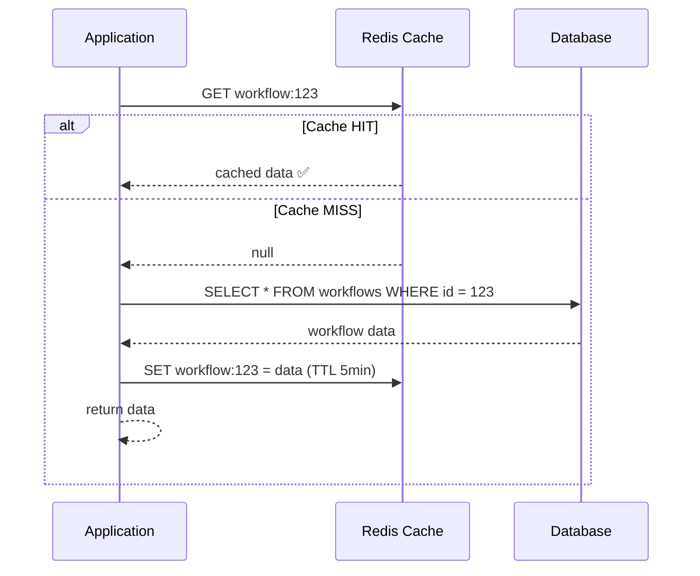

# Caching

Cache strategies, Spring's caching abstraction, Redis data structures,
and advanced problems (stampede, penetration, avalanche).

---

## 1. Why Cache

```text
Without cache:
  User requests product page → query DB → 50ms
  1000 users request same product → 1000 DB queries → 50,000ms total
  DB load: 1000 queries for the SAME data that hasn't changed.

With cache:
  First request → query DB (50ms) → store result in cache
  Next 999 requests → read from cache (0.1ms each) → 99.9ms total
  DB load: 1 query. Cache serves the other 999.

  Speedup: 50,000ms → 150ms = 333x faster
  DB load: 1000 queries → 1 query = 1000x reduction
```

---

## 2. Caching Strategies

### Cache-Aside (Lazy Loading) — Most Common

```text
Application manages the cache explicitly.
Check cache first → miss → load from DB → put in cache.

  READ:
    1. Check cache for key
    2. Cache HIT → return cached data
    3. Cache MISS → query DB → store result in cache → return

  WRITE:
    1. Write to DB
    2. Invalidate (delete) cache entry
    3. Next read will repopulate the cache
```



```text
PROS:
  ✅ Simple to implement
  ✅ Only caches data that is actually requested (hot data)
  ✅ Cache failure is not critical (falls back to DB)

CONS:
  ❌ First request is always slow (cache miss)
  ❌ Stale data possible (cache updated only on next read after write)
  ❌ Cache stampede risk (many concurrent misses for same key)
```

### Read-Through

```text
Cache is responsible for loading data from DB on a miss.
Application always reads from cache. Cache talks to DB.

  READ:
    1. Application asks cache for key
    2. Cache HIT → return
    3. Cache MISS → cache loads from DB itself → stores → returns

  Same as cache-aside, but the CACHE does the loading, not the app.
  Application code is simpler (just reads from cache, never touches DB directly).

  Implemented by cache providers (Ehcache, Caffeine with CacheLoader).
```

### Write-Through

```text
Every write goes to BOTH cache and DB synchronously.

  WRITE:
    1. Application writes to cache
    2. Cache writes to DB (synchronously)
    3. Both cache and DB are updated atomically

  PROS:
    ✅ Cache is always consistent with DB
    ✅ No stale reads after writes

  CONS:
    ❌ Write latency increases (cache + DB write on every operation)
    ❌ Cache may store data that's never read (waste of memory)
```

### Write-Behind (Write-Back)

```text
Writes go to cache immediately. Cache writes to DB asynchronously (later).

  WRITE:
    1. Application writes to cache → returns immediately (fast)
    2. Cache queues the write
    3. Cache writes to DB after a delay (batched)

  PROS:
    ✅ Very fast writes (cache is in-memory)
    ✅ Batch writes reduce DB load

  CONS:
    ❌ Data loss risk if cache crashes before writing to DB
    ❌ Complex to implement correctly
    ❌ Eventual consistency between cache and DB
```

### Strategy Comparison

```text
STRATEGY        WRITE SPEED   READ SPEED   CONSISTENCY   COMPLEXITY
──────────────────────────────────────────────────────────────────────
Cache-Aside     Normal        Fast*        Eventual      Simple
Read-Through    Normal        Fast*        Eventual      Medium
Write-Through   Slower        Fast         Strong        Medium
Write-Behind    Very fast     Fast         Eventual      Complex

* After first read (cache populated)
```

---

## 3. TTL and Eviction

### TTL (Time To Live)

```text
How long a cached value stays before being automatically deleted.

  SET workflow:123 = data  TTL 300 seconds  (5 minutes)

  t=0s:    data stored in cache
  t=299s:  data still in cache
  t=300s:  data auto-deleted by cache (expired)
  t=301s:  next read → cache miss → reload from DB

  CHOOSING TTL:
    Too short (10s):  frequent cache misses → high DB load → cache is barely useful
    Too long (24h):   stale data → users see outdated information
    Right (5-15 min): good balance for most web apps

  GUIDELINES:
    Reference data (countries, currencies):  24 hours+
    User profiles:                           5-15 minutes
    Product listings:                        1-5 minutes
    Real-time data (stock prices):           seconds or no cache
    Session data:                            30 minutes (with refresh)
```

### Eviction Policies

```text
When cache is FULL, which entries to remove?

  POLICY              DESCRIPTION                        USE WHEN
  ─────────────────────────────────────────────────────────────────
  LRU (Least          Remove least recently accessed      General purpose (default)
  Recently Used)      Keeps hot data, evicts cold data

  LFU (Least          Remove least frequently accessed    Data has stable popularity
  Frequently Used)    Keeps popular data, evicts rare     (some items always hot)

  FIFO (First In,     Remove oldest entry                 All entries equally likely
  First Out)          Simple but not popularity-aware     to be accessed

  Random              Remove random entry                 When access is unpredictable
                      Simple, surprisingly effective

  TTL-based           Remove expired entries first        Time-sensitive data

  Redis default: noeviction (returns error when full)
  Redis recommended: allkeys-lru (evict least recently used keys)
    maxmemory-policy allkeys-lru
```

---

## 4. Spring Cache Abstraction

### @Cacheable

```java
@Cacheable(value = "workflows", key = "#id")
public Workflow findById(UUID id) {
    return workflowRepository.findById(id).orElseThrow();
}
```

```text
How it works:
  1. Before the method runs, Spring checks cache "workflows" for key = id
  2. Cache HIT → return cached value (method NEVER executes)
  3. Cache MISS → execute method → store result in cache → return

  Second call with same id → method is SKIPPED, cached value returned.
  The method body doesn't run at all on cache hit.
```

### @CachePut

```java
@CachePut(value = "workflows", key = "#result.id")
public Workflow create(WorkflowCreateRequest request) {
    Workflow wf = workflowMapper.toEntity(request);
    return workflowRepository.save(wf);
}
```

```text
How it works:
  Always executes the method, then stores the result in cache.
  Unlike @Cacheable, the method ALWAYS runs.

  Use for: writes (create, update) — ensure cache has the latest value.
```

### @CacheEvict

```java
@CacheEvict(value = "workflows", key = "#id")
public void delete(UUID id) {
    workflowRepository.deleteById(id);
}

// Evict ALL entries in a cache
@CacheEvict(value = "workflows", allEntries = true)
public void clearWorkflowCache() { }
```

```text
How it works:
  Removes the entry from cache. Next @Cacheable call will reload from DB.
  Use for: deletes and updates (invalidate stale data).
```

### @Caching (Multiple Operations)

```java
@Caching(
    put = @CachePut(value = "workflows", key = "#result.id"),
    evict = @CacheEvict(value = "workflowLists", allEntries = true)
)
public Workflow update(UUID id, WorkflowUpdateRequest request) {
    // Update individual cache entry AND invalidate list caches
}
```

### Enabling Caching

```java
@SpringBootApplication
@EnableCaching
public class FlowforgeApplication { }
```

```yaml
# application.yaml
spring:
  cache:
    type: redis          # or caffeine, ehcache, simple
    redis:
      time-to-live: 300s # default TTL for all caches
```

---

## 5. Redis Data Structures

```text
Redis is not just a key-value store. It has rich data structures.
```

### Strings

```text
The simplest type. Stores a single value (text, number, serialized object).

  SET user:123 '{"name":"Alice","email":"alice@example.com"}'
  GET user:123 → '{"name":"Alice","email":"alice@example.com"}'

  SET counter 0
  INCR counter → 1
  INCR counter → 2
  INCRBY counter 10 → 12

  SET session:abc123 "user-data" EX 1800   (expires in 30 minutes)

  USE FOR: caching objects, counters, sessions, rate limiting tokens
```

### Hashes

```text
A map of field-value pairs under one key. Like a mini-table.

  HSET user:123 name "Alice" email "alice@example.com" age "30"
  HGET user:123 name → "Alice"
  HGETALL user:123 → { name: "Alice", email: "alice@...", age: "30" }
  HINCRBY user:123 age 1 → 31

  Advantage over Strings:
    - Update ONE field without reading/rewriting the whole object
    - Less memory than storing separate keys for each field

  USE FOR: user profiles, product details, config settings
```

### Sets

```text
Unordered collection of unique strings. No duplicates.

  SADD tags:workflow:123 "deploy" "ci" "prod"
  SMEMBERS tags:workflow:123 → {"deploy", "ci", "prod"}
  SISMEMBER tags:workflow:123 "ci" → 1 (true)
  SCARD tags:workflow:123 → 3 (count)

  Set operations:
    SUNION  tags:wf:123 tags:wf:456 → union of both sets
    SINTER  tags:wf:123 tags:wf:456 → common tags
    SDIFF   tags:wf:123 tags:wf:456 → tags in 123 but not 456

  USE FOR: tags, unique visitors, online users, permissions
```

### Sorted Sets

```text
Like Sets but each member has a SCORE. Sorted by score.

  ZADD leaderboard 100 "alice" 200 "bob" 150 "carol"
  ZRANGE leaderboard 0 -1 WITHSCORES → [alice:100, carol:150, bob:200]
  ZREVRANGE leaderboard 0 2 → [bob, carol, alice]  (top 3)
  ZRANK leaderboard "carol" → 1 (0-indexed position)
  ZINCRBY leaderboard 50 "alice" → 150 (alice's new score)

  USE FOR: leaderboards, priority queues, time-series data,
           rate limiting (score = timestamp)
```

### Lists

```text
Ordered sequence. Supports push/pop from both ends.

  LPUSH queue:emails "email1" "email2" "email3"
  RPOP queue:emails → "email1" (FIFO: first in, first out)
  LLEN queue:emails → 2

  BRPOP queue:emails 30 → blocks up to 30 seconds waiting for an item

  USE FOR: message queues, activity feeds, recent items
```

---

## 6. Advanced Cache Problems

### Cache Stampede (Thundering Herd)

```text
PROBLEM:
  A popular cache entry expires.
  1000 concurrent requests all see a cache miss.
  All 1000 query the DB simultaneously for the SAME data.
  DB overwhelmed → slow/crash.

  Normal:  CACHE HIT → serve from cache (fast)
  Expiry:  CACHE MISS × 1000 → 1000 DB queries → DB dies

SOLUTIONS:

  1. Locking (mutex):
     First request acquires a lock → queries DB → populates cache → releases lock.
     Other 999 requests wait for the lock → then read from cache.

     String key = "workflow:123";
     String lockKey = "lock:" + key;

     if (redis.setnx(lockKey, "1", Duration.ofSeconds(5))) {
         // I got the lock → I query DB and populate cache
         data = db.query(...);
         redis.set(key, data, TTL);
         redis.del(lockKey);
     } else {
         // Someone else is loading → wait and retry
         Thread.sleep(50);
         return redis.get(key);  // should be populated by now
     }

  2. Early refresh:
     Refresh cache BEFORE it expires.
     TTL = 5 min, but refresh at 4 min (1 min before expiry).
     Cache never actually expires → no stampede.

  3. Stale-while-revalidate:
     Serve stale data immediately while refreshing in the background.
     User gets fast (slightly stale) response. Cache updated async.
```

### Cache Penetration

```text
PROBLEM:
  Requests for data that DOESN'T EXIST in DB.
  Cache miss every time → every request hits DB → DB load.

  GET /users/999999999 → cache miss → DB query → no result → nothing cached
  GET /users/999999999 → cache miss again → DB query again → no result again
  ... forever hitting DB for non-existent data

SOLUTIONS:

  1. Cache null values:
     If DB returns null, cache the null with a short TTL.
     redis.set("user:999999999", "NULL", Duration.ofSeconds(60));
     Next request → cache hit → return 404 without hitting DB.

  2. Bloom filter:
     A probabilistic data structure that can tell you:
       "Definitely NOT in the set" or "Probably in the set"

     Before checking cache or DB, check bloom filter.
     If bloom filter says "not in set" → return 404 immediately.
     No cache lookup, no DB query.
```

### Cache Avalanche

```text
PROBLEM:
  Many cache entries expire AT THE SAME TIME.
  Massive spike of DB queries → DB overwhelmed.

  Example: all caches set with TTL=300s, all populated at the same time.
  At t=300s: thousands of entries expire simultaneously → stampede × 1000.

SOLUTIONS:

  1. Jitter on TTL:
     Instead of TTL=300s for everything:
     TTL = 300 + random(0, 60) seconds

     Entries expire between 300s and 360s → spread out.
     Same concept as @Retryable jitter.

  2. Staggered warm-up:
     Don't populate all caches at startup.
     Let them populate on demand (cache-aside).

  3. Multi-tier cache:
     L1: in-process cache (Caffeine, 1 min TTL)
     L2: distributed cache (Redis, 5 min TTL)
     If L1 expires, L2 may still have it → no DB query.
```

### Hot Keys

```text
PROBLEM:
  One key is accessed far more than others.
  That key's Redis shard/node gets overloaded.

  Example: celebrity post goes viral → "post:viral123" gets 100K reads/sec.
  That one Redis node handles all 100K requests.

SOLUTIONS:

  1. Local cache for hot keys:
     Cache hot keys in-process (Caffeine) with short TTL (10s).
     100K requests → only 1 request per 10s hits Redis.

  2. Key replication:
     Store the same data under multiple keys: post:viral123:1, post:viral123:2, ...
     Distribute reads across keys (client picks random suffix).

  3. Read replicas:
     Redis Cluster with read replicas. Distribute reads across replicas.
```

---

## 7. Cache Invalidation

```text
"There are only two hard things in Computer Science:
 cache invalidation and naming things." — Phil Karlton

INVALIDATION STRATEGIES:

  1. TTL-based (time expiry):
     Set TTL → cache auto-expires → next read reloads from DB.
     Simple. Stale data for up to TTL duration.

  2. Event-based (write-through invalidation):
     On every write → immediately delete cache entry.
     @CacheEvict on update/delete methods.
     Minimal staleness. More complex.

  3. Change Data Capture (CDC):
     DB publishes change events (Debezium, PostgreSQL LISTEN/NOTIFY).
     Cache consumer listens → invalidates affected entries.
     Decoupled. Works even if writes bypass the application.

  4. Versioned keys:
     Include a version in the cache key: workflow:123:v5
     On write: increment version → old key is never read again.
     Old entries are cleaned up by TTL or eviction.

RULE OF THUMB:
  For most apps: TTL (5 min) + @CacheEvict on writes is sufficient.
  For high-consistency needs: event-based invalidation.
```

---

## 8. Interview Questions

```text
Q: What is cache-aside?
A: Application checks cache first. On miss, queries DB, stores in cache.
   On write, invalidates cache. Most common strategy.

Q: What is the difference between write-through and write-behind?
A: Write-through writes to cache AND DB synchronously (consistent but slower).
   Write-behind writes to cache first, DB asynchronously (fast but risk of loss).

Q: What is a cache stampede?
A: Popular key expires → thousands of concurrent cache misses → all hit DB.
   Fix: mutex lock (one thread loads, others wait), early refresh, or stale-while-revalidate.

Q: What is cache penetration?
A: Requests for non-existent data → always cache miss → always hits DB.
   Fix: cache null values with short TTL, or use a bloom filter.

Q: What is cache avalanche?
A: Many keys expire at the same time → massive DB spike.
   Fix: add jitter to TTL (randomize expiry times).

Q: What is TTL?
A: Time To Live — how long a cached value stays before auto-deletion.
   Balances freshness (short TTL) vs performance (long TTL).

Q: @Cacheable vs @CachePut?
A: @Cacheable skips the method if cache hit (reads).
   @CachePut always runs the method and stores result (writes).

Q: Name 4 Redis data structures and a use case for each.
A: Strings (sessions/counters), Hashes (user profiles),
   Sets (tags/unique visitors), Sorted Sets (leaderboards).
```
