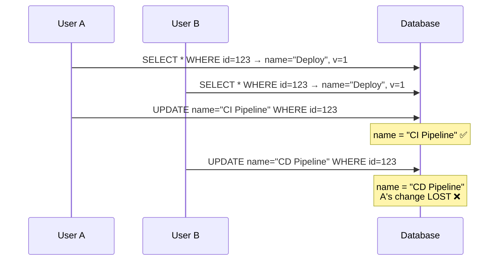
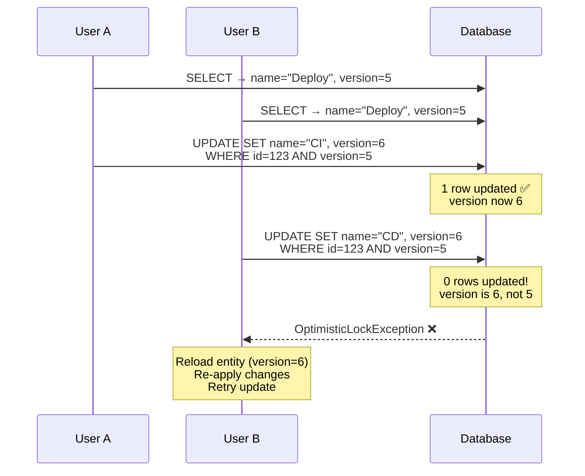
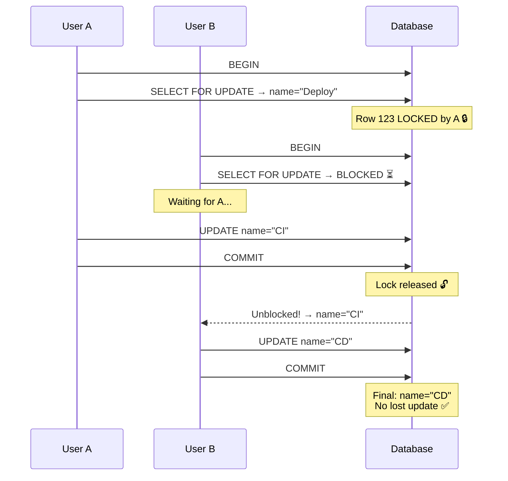
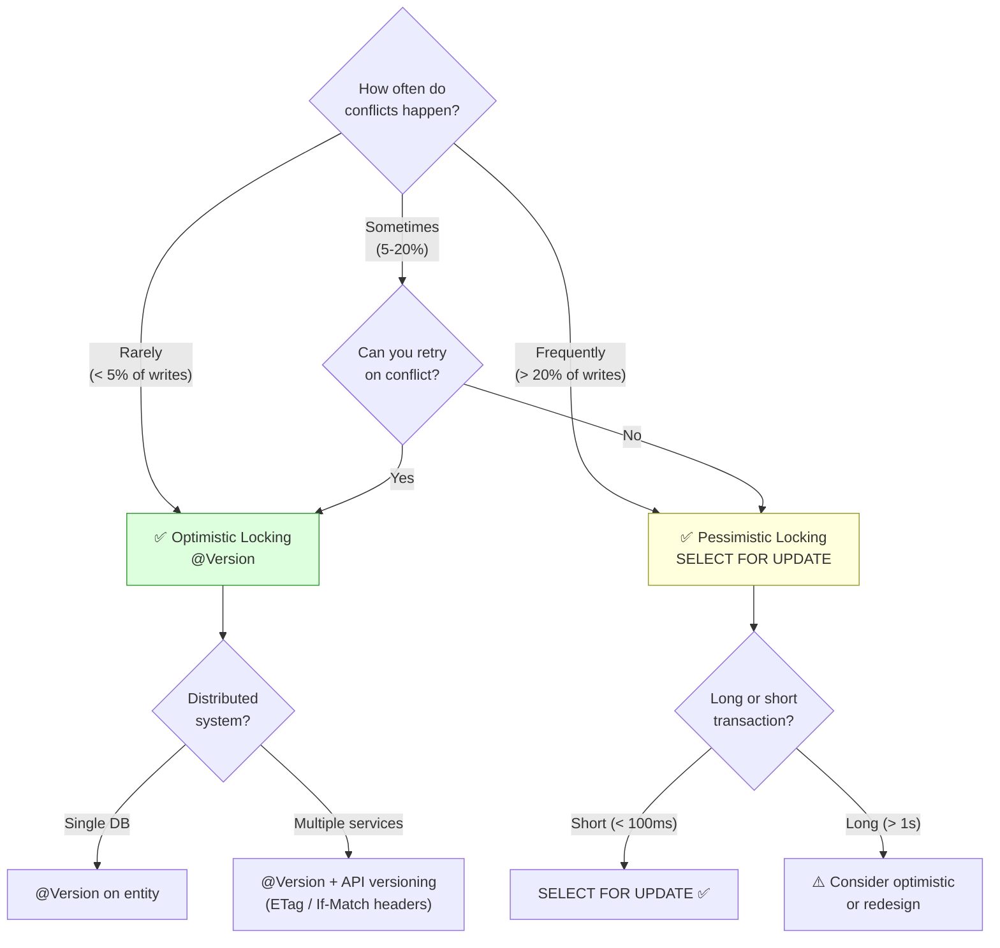

# Concurrency Control

Optimistic locking (@Version) vs Pessimistic locking (SELECT FOR UPDATE),
when to use each, and how to implement them in Spring/JPA.

---

## 1. The Problem — Lost Updates

```text
Two users edit the SAME workflow at the SAME time:

  User A: GET /workflows/123 → { name: "Deploy", version: 1 }
  User B: GET /workflows/123 → { name: "Deploy", version: 1 }

  User A: PUT /workflows/123 → { name: "CI Pipeline" }  → COMMIT
  User B: PUT /workflows/123 → { name: "CD Pipeline" }  → COMMIT

  Final result: name = "CD Pipeline"
  User A's change is SILENTLY LOST.

  This is the "Lost Update" problem.
  Both users read version 1, both update, second one wins.
```



---

## 2. Optimistic Locking

### What It Is

```text
"Assume conflicts are RARE. Don't lock anything. But CHECK at write time."

  Instead of locking the row when reading, we add a VERSION column.
  When updating, we check: "is the version still what I read?"

  If YES → update succeeds, increment version.
  If NO  → someone else changed it → throw exception → caller retries.

  Called "optimistic" because it ASSUMES no conflict will happen.
  If a conflict does happen, it detects and rejects it.
```

### How It Works

```text
  Table: workflows
  ┌─────┬──────────┬─────────┐
  │ id  │ name     │ version │
  ├─────┼──────────┼─────────┤
  │ 123 │ Deploy   │ 5       │
  └─────┴──────────┴─────────┘

  User A reads: { id: 123, name: "Deploy", version: 5 }
  User B reads: { id: 123, name: "Deploy", version: 5 }

  User A updates:
    UPDATE workflows SET name='CI', version=6 WHERE id=123 AND version=5;
    → 1 row updated ✅ (version was 5, now 6)

  User B updates:
    UPDATE workflows SET name='CD', version=6 WHERE id=123 AND version=5;
    → 0 rows updated ❌ (version is now 6, not 5!)
    → Hibernate throws OptimisticLockException

  User B must: reload the entity, apply changes, try again.
```



### JPA Implementation — @Version

```java
@Entity
public class Workflow {

    @Id
    @GeneratedValue(strategy = GenerationType.UUID)
    private UUID id;

    private String name;
    private String status;

    @Version
    private Long version;   // Hibernate manages this automatically

    // getters, setters...
}
```

```text
HOW @Version WORKS:

  1. When entity is LOADED:
     Hibernate reads the version column from DB.

  2. When entity is UPDATED (at flush time):
     Hibernate generates:
       UPDATE workflows SET name=?, status=?, version=version+1
       WHERE id=? AND version=?
                            ↑ must match what was read

  3. If 0 rows updated (version mismatch):
     Hibernate throws: jakarta.persistence.OptimisticLockException

  4. If 1 row updated:
     version incremented. Entity updated. Success.

  You NEVER set the version manually. Hibernate manages it.
  @Version works with: int, Integer, long, Long, short, Short, Timestamp.
  Long is recommended (won't overflow for billions of updates).
```

### Handling OptimisticLockException

```java
// Option 1: Let it propagate → 409 Conflict response
@RestControllerAdvice
public class GlobalExceptionHandler {

    @ExceptionHandler(OptimisticLockException.class)
    public ResponseEntity<ApiError> handleOptimisticLock(OptimisticLockException ex) {
        return ResponseEntity.status(HttpStatus.CONFLICT).body(
            new ApiError("CONFLICT", "Resource was modified by another user. Please reload and retry.")
        );
    }
}

// Option 2: Auto-retry with @Retryable
@Retryable(
    includes = OptimisticLockException.class,
    maxRetries = 3,
    delay = 100
)
@Transactional
public Workflow updateWorkflow(UUID id, WorkflowUpdateRequest request) {
    Workflow wf = repo.findById(id).orElseThrow();
    wf.setName(request.name());
    return repo.save(wf);
    // If OptimisticLockException → retry: reload fresh entity, apply change again
}
```

### When To Use Optimistic Locking

```text
✅ USE WHEN:
  - Conflicts are RARE (most of the time, no two users edit the same entity)
  - Read-heavy workloads (many reads, few writes)
  - Web applications (user reads data, thinks, then submits — long gap between read and write)
  - You want MAXIMUM CONCURRENCY (no locks held during reads)
  - Distributed systems (no shared lock manager needed)

❌ DON'T USE WHEN:
  - Conflicts are FREQUENT (counter increments, inventory decrement)
  - You can't afford the retry (each retry means re-reading, re-validating)
  - The operation is not idempotent (retry causes side effects)
```

---

## 3. Pessimistic Locking

### What It Is

```text
"Assume conflicts are LIKELY. Lock the row WHEN READING."

  Before reading the data, acquire a database lock on the row.
  Other transactions WAIT (block) until you release the lock (commit/rollback).

  Called "pessimistic" because it ASSUMES conflicts will happen.
  It PREVENTS conflicts by locking upfront.
```

### How It Works

```text
  User A:
    BEGIN;
    SELECT * FROM workflows WHERE id=123 FOR UPDATE;
    -- Row 123 is now LOCKED by Transaction A
    -- User A reads: { name: "Deploy" }

  User B:
    BEGIN;
    SELECT * FROM workflows WHERE id=123 FOR UPDATE;
    -- BLOCKED! Waiting for A to release the lock...

  User A:
    UPDATE workflows SET name='CI' WHERE id=123;
    COMMIT;
    -- Lock released

  User B:
    -- Unblocked! Now reads: { name: "CI" } (A's change)
    UPDATE workflows SET name='CD' WHERE id=123;
    COMMIT;
    -- Final: name = "CD" — but B saw A's change, so no lost update.
```



### JPA Implementation

```java
// Option 1: @Lock annotation on repository method
public interface WorkflowRepository extends JpaRepository<Workflow, UUID> {

    @Lock(LockModeType.PESSIMISTIC_WRITE)
    @Query("SELECT w FROM Workflow w WHERE w.id = :id")
    Optional<Workflow> findByIdForUpdate(@Param("id") UUID id);
}
// Generates: SELECT * FROM workflows WHERE id = ? FOR UPDATE

// Option 2: EntityManager
Workflow wf = em.find(Workflow.class, id, LockModeType.PESSIMISTIC_WRITE);
// Same effect: SELECT ... FOR UPDATE

// Option 3: Lock after loading
em.lock(wf, LockModeType.PESSIMISTIC_WRITE);
// Acquires lock on already-loaded entity
```

### Lock Modes

```text
LOCK MODE                  SQL                     BEHAVIOR
──────────────────────────────────────────────────────────────────────
PESSIMISTIC_READ           SELECT ... FOR SHARE    Shared lock: others can
                                                   read but not write.
PESSIMISTIC_WRITE          SELECT ... FOR UPDATE   Exclusive lock: others
                                                   can't read or write.
PESSIMISTIC_FORCE_INCREMENT SELECT ... FOR UPDATE  Exclusive lock + increment
                                                   @Version (combines both)

  PESSIMISTIC_WRITE is the most common.
  PESSIMISTIC_FORCE_INCREMENT = pessimistic + optimistic (belt and suspenders).
```

### Lock Timeout and NOWAIT

```java
// With timeout (wait up to 5 seconds, then fail)
@QueryHints(@QueryHint(name = "jakarta.persistence.lock.timeout", value = "5000"))
@Lock(LockModeType.PESSIMISTIC_WRITE)
Optional<Workflow> findByIdForUpdate(UUID id);

// NOWAIT: fail immediately if row is locked (don't wait at all)
@QueryHints(@QueryHint(name = "jakarta.persistence.lock.timeout", value = "0"))
@Lock(LockModeType.PESSIMISTIC_WRITE)
Optional<Workflow> findByIdForUpdateNowait(UUID id);
```

```text
PostgreSQL SKIP LOCKED (for job queues):

  SELECT * FROM tasks WHERE status = 'PENDING'
  ORDER BY created_at
  LIMIT 1
  FOR UPDATE SKIP LOCKED;

  If the first pending task is already locked by another worker → skip it,
  take the next one. No waiting, no deadlocks. Perfect for job queues.

  JPA doesn't have built-in SKIP LOCKED, use a native query:

  @Query(value = "SELECT * FROM tasks WHERE status = 'PENDING' " +
                 "ORDER BY created_at LIMIT 1 FOR UPDATE SKIP LOCKED",
         nativeQuery = true)
  Optional<Task> findNextPendingTask();
```

### When To Use Pessimistic Locking

```text
✅ USE WHEN:
  - Conflicts are FREQUENT (inventory, seat booking, counter)
  - You can't afford to retry (complex, non-idempotent operation)
  - Short transactions (lock held briefly)
  - Critical section (exactly-once semantics required)

❌ DON'T USE WHEN:
  - Conflicts are rare (optimistic is cheaper)
  - Long transactions (lock held for seconds → blocks others)
  - Distributed systems (DB locks don't work across databases)
  - High concurrency needed (locks serialize access → low throughput)
```

---

## 4. Optimistic vs Pessimistic — Comparison

```text
                        OPTIMISTIC              PESSIMISTIC
─────────────────────────────────────────────────────────────────
Mechanism               @Version check          SELECT ... FOR UPDATE
When conflict detected  At UPDATE time          At READ time (lock)
Blocking                No (no locks held)      Yes (row locked)
Conflict handling       Exception → retry       Block → wait
Concurrency             High (reads don't lock) Low (reads can block)
Throughput              High                    Lower
Conflict rate           Low (best for rare)     High (best for frequent)
Deadlock risk           None                    Yes (if lock order varies)
Distributed support     Yes (no shared lock)    No (needs same DB)
Retry needed            Yes                     No (waits for lock)
Complexity              Simple (@Version)       Moderate (lock management)
```

### Decision Flowchart



---

## 5. Real-World Examples

### Example 1: Wiki Page Editing (Optimistic)

```text
SCENARIO: Multiple users can edit the same wiki page.
CONFLICT RATE: Low (usually different users edit different pages).

  @Entity
  public class WikiPage {
      @Id private UUID id;
      private String title;
      private String content;
      @Version private Long version;
  }

  User A: GET /pages/123 → version=5, content="Hello"
  User B: GET /pages/123 → version=5, content="Hello"
  User A: PUT /pages/123 (version=5, content="Hello World") → SUCCESS, version=6
  User B: PUT /pages/123 (version=5, content="Hello There") → 409 CONFLICT
  User B: shown a diff → "Someone else edited this page. Merge or overwrite?"

  → Best with optimistic locking. Conflicts are rare. UX can show diff.
```

### Example 2: Inventory Decrement (Pessimistic)

```text
SCENARIO: Flash sale. 1000 users buying the last 5 items.
CONFLICT RATE: Very high (everyone hitting the same row).

  @Transactional
  public void purchaseItem(UUID itemId) {
      // Lock the row — other transactions WAIT
      Item item = itemRepo.findByIdForUpdate(itemId);

      if (item.getQuantity() <= 0) {
          throw new OutOfStockException();
      }

      item.setQuantity(item.getQuantity() - 1);  // decrement
      // COMMIT → lock released → next buyer proceeds
  }

  With optimistic locking: 999 out of 1000 would get OptimisticLockException
  and need to retry. Massive retry storm.

  With pessimistic locking: buyers queue up. Each one waits ~5ms for the lock.
  No retries. Sequential but predictable.

  → Best with pessimistic locking. Conflicts are guaranteed.
```

### Example 3: Seat Booking (Pessimistic + SKIP LOCKED)

```text
SCENARIO: Concert seat booking. Multiple users booking different seats.

  @Query(value = "SELECT * FROM seats WHERE event_id = :eventId " +
                 "AND status = 'AVAILABLE' AND seat_number = :seatNum " +
                 "FOR UPDATE NOWAIT",
         nativeQuery = true)
  Optional<Seat> findSeatForBooking(UUID eventId, String seatNum);

  If two users try to book the SAME seat:
    User A: SELECT FOR UPDATE NOWAIT → gets the lock
    User B: SELECT FOR UPDATE NOWAIT → FAILS immediately (no wait)
    User B: shown "Seat already being booked by someone else"

  NOWAIT provides instant feedback — no waiting.
```

---

## 6. API-Level Optimistic Locking (ETag)

```text
For REST APIs, use HTTP headers to implement optimistic locking:

  GET /api/workflows/123
  Response:
    ETag: "5"                    ← version number as ETag
    { "id": "123", "name": "Deploy", "version": 5 }

  PUT /api/workflows/123
  Request:
    If-Match: "5"                ← "only update if version is still 5"
    { "name": "CI Pipeline" }

  If version is still 5 → 200 OK (updated)
  If version changed   → 412 Precondition Failed (conflict)
```

```java
@PutMapping("/{id}")
public ResponseEntity<Workflow> update(
        @PathVariable UUID id,
        @RequestHeader("If-Match") String ifMatch,
        @RequestBody WorkflowUpdateRequest request) {

    long expectedVersion = Long.parseLong(ifMatch.replace("\"", ""));
    Workflow wf = workflowService.findById(id);

    if (wf.getVersion() != expectedVersion) {
        return ResponseEntity.status(HttpStatus.PRECONDITION_FAILED).build();
    }

    Workflow updated = workflowService.update(id, request);
    return ResponseEntity.ok()
        .eTag(String.valueOf(updated.getVersion()))
        .body(updated);
}
```

---

## 7. Interview Questions

```text
Q: What is optimistic locking?
A: No locks on read. A @Version column is checked at update time.
   If version changed since read → OptimisticLockException. Retry needed.
   Best for low-conflict scenarios (web apps, content editing).

Q: What is pessimistic locking?
A: Lock the row when reading (SELECT FOR UPDATE). Other transactions wait.
   Best for high-conflict scenarios (inventory, counters, seat booking).

Q: When would you choose optimistic over pessimistic?
A: Optimistic when conflicts are rare, reads are frequent, and retries
   are acceptable. Pessimistic when conflicts are frequent, transactions
   are short, and you can't afford retries.

Q: What is @Version in JPA?
A: An annotation on an integer/long field. Hibernate auto-increments it
   on every update and adds AND version=? to the WHERE clause. If 0 rows
   updated → OptimisticLockException.

Q: What is SELECT FOR UPDATE?
A: Acquires an exclusive row lock. Other transactions trying to lock
   the same row will block until the lock is released (commit/rollback).

Q: What is SKIP LOCKED?
A: A modifier on FOR UPDATE that skips already-locked rows instead of
   waiting. Used for job queues — each worker picks the next unlocked task.

Q: How do you handle OptimisticLockException in a REST API?
A: Return 409 Conflict. The client can reload the resource and retry.
   Or use ETag/If-Match headers for HTTP-native optimistic concurrency.
```
