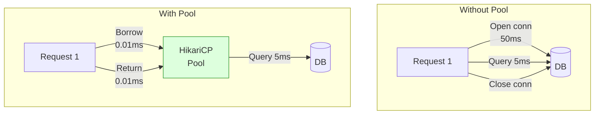
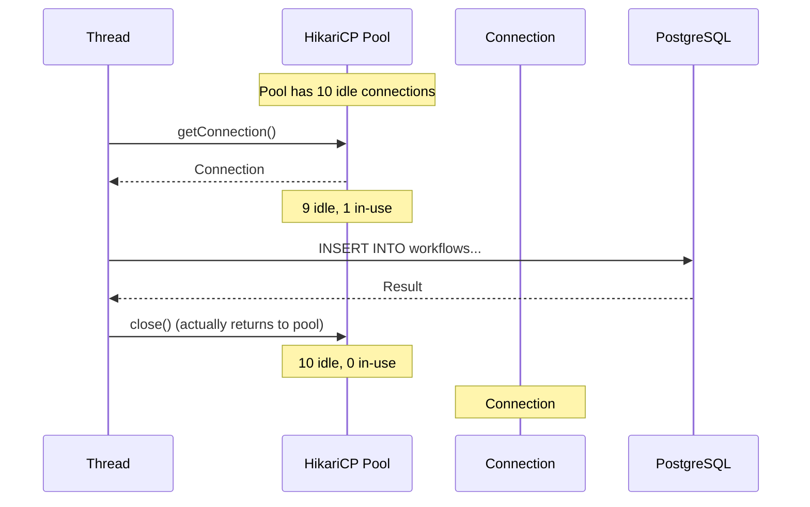

# Database Connection Pooling

Why connection pools exist, how HikariCP works, pool sizing, and how
improper configuration destroys application performance.

> **Deep dive**: For HikariCP configuration values, sizing calculations,
> virtual thread interaction, and retry integration, see:
> [`Resilience/HIKARI-CONNECTION-POOL.md`](../Resilience/HIKARI-CONNECTION-POOL.md)

---

## 1. Why Connection Pools Exist

```text
OPENING a database connection is EXPENSIVE:

  1. TCP handshake (SYN → SYN-ACK → ACK)           ~1ms   (local)
  2. TLS handshake (if SSL enabled)                  ~5ms   (local)
  3. PostgreSQL authentication (SCRAM-SHA-256)       ~5ms
  4. PostgreSQL backend process fork                 ~10ms
  5. Allocate memory for connection context           ~5ms
  ──────────────────────────────────────────────────
  Total: ~25-50ms per connection (local)
         ~100-300ms per connection (cloud/remote)

  Your API query takes 5ms.
  Opening + closing a connection takes 50ms.
  Total: 55ms — connection overhead is 10x the actual work!

WITH A POOL:
  Connections are opened ONCE at startup and REUSED.
  Borrow → query (5ms) → return. No open/close overhead.

  Without pool: 55ms per request (50ms wasted on connection)
  With pool:    5ms per request (connection already open)
  → 11x faster
```



---

## 2. How HikariCP Works

```text
HikariCP is the DEFAULT connection pool in Spring Boot.
It's the fastest Java connection pool (benchmarked consistently).

LIFECYCLE:

  Application starts
    ↓
  HikariCP creates minimumIdle connections (TCP + auth for each)
    ↓
  Connections sit in the FREE LIST (ready to be borrowed)
    ↓
  Request arrives → borrow connection from pool → execute query → return to pool
    ↓
  Connection stays open for reuse (not closed)
    ↓
  After maxLifetime → connection retired → replaced with a fresh one
    ↓
  Application shuts down → all connections closed
```



---

## 3. Pool Sizing

### The Formula

```text
Optimal pool size for a SINGLE application instance:

  pool_size = (core_count × 2) + effective_spindle_count

  For SSDs (no spindles): pool_size = (cores × 2) + 1

  Example (4-core server with SSD):
    pool_size = (4 × 2) + 1 = 9 ≈ 10

  WHY this formula works:
    - Each core can run one query at a time
    - × 2 accounts for I/O wait (while one query waits for disk, core runs another)
    - + 1 for the effective spindle (SSD acts as one fast spindle)

  IMPORTANT: this is per INSTANCE.
    3 instances × 10 connections = 30 connections to the DB.
    PostgreSQL default max_connections = 100.
    30 of 100 used → 70 remaining for other apps/admin → healthy.
```

### Why Bigger Is NOT Better

```text
Common mistake: "More connections = more throughput!"

  WRONG.

  Pool size 10: 10 queries run in parallel. CPU is busy.
  Pool size 50: 50 queries compete for CPU time.
    CPU context-switching between 50 queries.
    Each query runs slower (more contention).
    More lock contention in the database.
    More memory usage per connection (~5-10 MB each in PostgreSQL).

  ACTUAL BENCHMARK (typical 4-core DB):
    Pool size 10:  throughput = 8,000 queries/sec, avg latency = 5ms
    Pool size 50:  throughput = 6,500 queries/sec, avg latency = 12ms
    Pool size 200: throughput = 4,000 queries/sec, avg latency = 35ms

  MORE connections → LESS throughput due to contention.

  The PostgreSQL wiki says:
    "Most applications perform best with 2-5 connections per core."
    A 4-core DB: 8-20 connections total across ALL apps.
```

---

## 4. What Happens Under Load

```text
SCENARIO: 200 concurrent requests, pool size = 10

  t=0ms:    200 requests arrive
  t=0ms:    10 threads get connections immediately
  t=0ms:    190 threads WAIT at getConnection() (queued)
  t=5ms:    First 10 queries complete → 10 connections returned to pool
  t=5ms:    Next 10 threads get connections from pool
  t=10ms:   Next 10 complete → next 10 start
  ...
  t=100ms:  All 200 requests processed (20 batches of 10)

  WITHOUT POOL (200 new connections):
    200 TCP handshakes to DB simultaneously
    DB forks 200 processes → memory exhaustion
    DB rejects connections → 500 errors

  WITH POOL:
    10 connections reused 20 times each
    DB handles 10 concurrent queries (comfortable)
    All 200 requests complete in ~100ms
```

### Connection Timeout

```text
connectionTimeout = how long a thread waits for a free connection.

  pool size = 10, all 10 in-use
  Thread 11 calls getConnection()
  → waits up to connectionTimeout for one to be returned
  → if timeout expires → SQLTransientConnectionException

  DEFAULT: 30000ms (30 seconds) — way too long for APIs!

  RECOMMENDED:
    APIs: 2000-3000ms (fail fast, let @Retryable handle it)
    Batch jobs: 30000ms (can afford to wait)

  See HIKARI-CONNECTION-POOL.md for retry integration math.
```

---

## 5. Connection Leaks

```text
A connection LEAK occurs when code borrows a connection but never returns it.

  CAUSE: forgetting to close a connection or exception before close().

  // LEAK — if query() throws, connection is never closed!
  Connection conn = dataSource.getConnection();
  conn.createStatement().execute("SELECT ...");
  // Exception here → conn never returned to pool
  conn.close();  // never reached

  // FIX — try-with-resources
  try (Connection conn = dataSource.getConnection()) {
      conn.createStatement().execute("SELECT ...");
  }  // auto-closed even if exception

  With JPA/Spring: @Transactional handles this automatically.
  Connections are borrowed at TX start, returned at TX end.
  Leaks are rare in Spring — but can happen with manual JDBC.

DETECTING LEAKS:
  spring.datasource.hikari.leak-detection-threshold: 10000  (10 seconds)

  If a connection is held for more than 10 seconds:
    HikariCP logs a WARNING with the stack trace of where it was borrowed.
    This tells you exactly which code is holding the connection too long.
```

---

## 6. Virtual Threads + Connection Pool

```text
With virtual threads (spring.threads.virtual.enabled=true):

  1000 HTTP requests → 1000 virtual threads
  All 1000 call getConnection() simultaneously
  Pool has 10 connections → 990 threads block at the pool

  Virtual threads make thread creation free,
  but DB connections are still limited.
  The pool becomes the BOTTLENECK instead of the thread pool.

  Without virtual threads: 200 platform threads → 200 max concurrent DB requests
  With virtual threads: 10,000 virtual threads → 10,000 concurrent DB requests
  → But pool still has 10 connections → 9,990 waiting

  THIS IS WHY @ConcurrencyLimit MATTERS:
    @ConcurrencyLimit(5) on expensive queries
    → Only 5 virtual threads enter the method at a time
    → Only 5 try to get connections
    → Pool is not overwhelmed
    → Remaining virtual threads wait at the annotation level (cheap)
       instead of at the pool level (holding resources)

  See: Resilience/HIKARI-CONNECTION-POOL.md — Section 6
```

---

## 7. Configuration Quick Reference

```yaml
spring:
  datasource:
    hikari:
      maximum-pool-size: 10       # (cores × 2) + 1
      minimum-idle: 10            # = maximumPoolSize (avoid runtime creation)
      connection-timeout: 3000    # fail fast for APIs (3 seconds)
      idle-timeout: 600000        # close idle connections after 10 min
      max-lifetime: 1800000       # recycle connections every 30 min
      validation-timeout: 5000    # connection alive check timeout
      leak-detection-threshold: 10000  # warn if conn held > 10s (dev)
      pool-name: FlowForge-Pool   # readable name in logs
```

```text
GOLDEN RULES:

  1. Pool size: smaller is usually better (10-20)
  2. minimum-idle = maximum-pool-size (avoid cold-start latency)
  3. max-lifetime < DB server's wait_timeout (prevent stale connections)
  4. connection-timeout: short for APIs, longer for batch
  5. @ConcurrencyLimit on expensive queries ≤ pool_size / 2
  6. Monitor hikaricp.connections.pending (should be 0)
  7. leak-detection-threshold enabled in dev/staging

  Full details: Resilience/HIKARI-CONNECTION-POOL.md
```

---

## 8. Interview Questions

```text
Q: Why do we need a connection pool?
A: Opening a DB connection is expensive (TCP + auth + process fork = 25-100ms).
   A pool keeps connections open and reuses them. Borrow/return is ~0.01ms.

Q: What is the optimal pool size?
A: (cores × 2) + 1 for SSD. Usually 10-20 connections per instance.
   More connections = more contention = LESS throughput.

Q: What is a connection leak?
A: A connection borrowed from the pool but never returned.
   Eventually all connections are leaked → pool exhausted → app fails.
   Fix: use try-with-resources or @Transactional (auto-managed).

Q: How does HikariCP validate connections?
A: Before lending a connection, HikariCP runs Connection.isValid()
   (JDBC 4+ fast check). Stale connections are evicted and replaced.

Q: What happens when the pool is exhausted?
A: Threads wait at getConnection() up to connectionTimeout.
   If timeout expires → SQLTransientConnectionException.
   Fix: increase pool (carefully), reduce query time, or use @ConcurrencyLimit.

Q: How do virtual threads interact with connection pools?
A: Virtual threads are cheap to create → thousands of concurrent requests.
   But pool size is fixed → thousands waiting for 10 connections.
   Use @ConcurrencyLimit to prevent overwhelming the pool.
```
