# Database Fundamentals

Everything you need to understand about relational databases BEFORE
touching JPA/Hibernate. If you skip this, every ORM problem will be
a mystery.

---

## 1. How a Query Travels Through the System

```text
Your Application Code
       ↓
  Connection Pool (HikariCP)
       ↓  borrows a connection
  JDBC Driver (PostgreSQL driver)
       ↓  sends SQL over TCP
  Database Server (PostgreSQL)
       ↓
  Query Parser
       ↓  parses SQL text into parse tree
  Query Planner / Optimizer
       ↓  chooses the cheapest execution plan
  Executor
       ↓  runs the plan (scans, joins, sorts)
  Storage Engine
       ↓  reads/writes pages from disk or buffer cache
  Result
       ↑  sent back over TCP
  Your Application
```

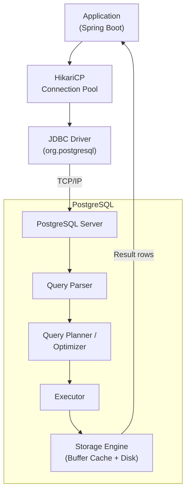

---

## 2. Relational Model

### What It Is

```text
A relational database stores data in TABLES (relations).
Each table has ROWS (tuples) and COLUMNS (attributes).

  Table: workflows
  ┌──────────────────────────────────────────────────────────────┐
  │ id (UUID)       │ name (VARCHAR)    │ status (VARCHAR)       │
  ├──────────────────────────────────────────────────────────────┤
  │ a1b2c3...       │ "Deploy Pipeline" │ "ACTIVE"               │
  │ d4e5f6...       │ "CI Build"        │ "DRAFT"                │
  │ g7h8i9...       │ "Data Sync"       │ "ACTIVE"               │
  └──────────────────────────────────────────────────────────────┘

  Each row = one entity (one workflow)
  Each column = one attribute of that entity
  Each cell = one value (atomic — no lists, no nested objects)

  WHY relational?
    Because tables can RELATE to each other through keys.
    A workflow HAS MANY steps → two tables linked by a foreign key.
```

### Table Design Rules

```text
1. Each table represents ONE type of entity
   ✅ workflows, steps, users
   ❌ workflows_and_steps (mixing entities)

2. Each row is uniquely identifiable (has a primary key)
   ✅ id = UUID or auto-increment
   ❌ no primary key (can't uniquely identify a row)

3. Each column stores ONE value (atomic)
   ✅ status = "ACTIVE"
   ❌ tags = "deploy,ci,prod" (multiple values in one column)

4. Column order doesn't matter
   SELECT name, status  is the same as  SELECT status, name

5. Row order doesn't matter
   Without ORDER BY, the database returns rows in ANY order.
   Never rely on insertion order.
```

---

## 3. Primary Key

```text
A PRIMARY KEY uniquely identifies every row in a table.
No two rows can have the same primary key value.
Primary key columns cannot be NULL.

  CREATE TABLE workflows (
      id UUID PRIMARY KEY,         ← every workflow has a unique id
      name VARCHAR(255) NOT NULL,
      status VARCHAR(50) NOT NULL
  );

  The primary key creates:
    1. A UNIQUE constraint (no duplicates)
    2. A NOT NULL constraint (can't be empty)
    3. A CLUSTERED INDEX (rows stored in PK order — PostgreSQL: implicit B-tree)
```

### Natural Key vs Surrogate Key

```text
NATURAL KEY: a real-world attribute that is naturally unique.
  Examples: email, SSN, ISBN, passport number

  CREATE TABLE users (
      email VARCHAR(255) PRIMARY KEY,   ← natural key
      name VARCHAR(255)
  );

  Problems:
    - Emails change (user updates their email → PK changes → all FKs must update)
    - Might not be truly unique (data quality issues)
    - Can be long (joins on VARCHAR are slower than on UUID/BIGINT)
    - Exposes PII in URLs: /api/users/john@example.com

SURROGATE KEY: a database-generated value with no business meaning.
  Examples: UUID, auto-increment BIGINT

  CREATE TABLE users (
      id UUID PRIMARY KEY DEFAULT gen_random_uuid(),  ← surrogate key
      email VARCHAR(255) UNIQUE NOT NULL,
      name VARCHAR(255)
  );

  Advantages:
    - Never changes (even if email changes)
    - Compact (UUID = 16 bytes, BIGINT = 8 bytes)
    - No business meaning → safe in URLs: /api/users/a1b2c3d4
    - Consistent across all tables

  RECOMMENDATION: Always use surrogate keys (UUID or BIGINT).
  Add a UNIQUE constraint on natural keys (email) for business uniqueness.
```

### UUID vs Auto-Increment

```text
AUTO-INCREMENT (SERIAL / IDENTITY):
  id = 1, 2, 3, 4, 5...
  ✅ Compact (8 bytes), fast joins, human-readable
  ❌ Predictable (security: users can guess /api/users/1, /api/users/2)
  ❌ Doesn't work well in distributed systems (two servers generate same ID)
  ❌ Reveals business info (id=50000 tells competitor you have 50K records)

UUID (v4 or v7):
  id = 550e8400-e29b-41d4-a716-446655440000
  ✅ Globally unique (no collisions across servers)
  ✅ Unpredictable (secure in URLs)
  ✅ Can be generated client-side (no round-trip to DB)
  ❌ 16 bytes (2x BIGINT), slightly slower joins
  ❌ Random UUIDs (v4) cause index fragmentation (inserts scattered)

  UUID v7 (time-ordered):
    Prefix is a timestamp → inserts are sequential → no index fragmentation
    Best of both worlds: globally unique + sequential + no collisions
    Java: UUID.randomUUID() is v4. For v7, use a library or Java 21+.

  FlowForge uses: UUID (generated by JPA @GeneratedValue)
```

---

## 4. Foreign Key

```text
A FOREIGN KEY links a column in one table to the PRIMARY KEY of another table.
It enforces REFERENTIAL INTEGRITY: you can't reference a row that doesn't exist.

  Table: workflows                    Table: steps
  ┌────────────┬──────────┐          ┌────────────┬────────────┬──────────┐
  │ id (PK)    │ name     │          │ id (PK)    │ workflow_id│ name     │
  ├────────────┼──────────┤          │            │ (FK → workflows.id)  │
  │ wf-001     │ Deploy   │ ◄────── │ st-001     │ wf-001     │ Build    │
  │ wf-002     │ CI Build │ ◄────── │ st-002     │ wf-001     │ Test     │
  └────────────┴──────────┘          │ st-003     │ wf-002     │ Lint     │
                                     └────────────┴────────────┴──────────┘

  The FK column (workflow_id) MUST reference an existing workflows.id.

  INSERT INTO steps (id, workflow_id, name) VALUES ('st-004', 'wf-999', 'Deploy');
  → ERROR: foreign key violation — wf-999 doesn't exist in workflows table.

  DELETE FROM workflows WHERE id = 'wf-001';
  → ERROR: foreign key violation — steps still reference wf-001.
  → Unless you set ON DELETE CASCADE (auto-deletes child rows).
```

### ON DELETE Options

```text
OPTION              BEHAVIOR WHEN PARENT ROW IS DELETED
─────────────────────────────────────────────────────────────────────
RESTRICT (default)  Block the delete. Error if child rows exist.
CASCADE             Delete all child rows automatically.
SET NULL            Set FK column to NULL in child rows.
SET DEFAULT         Set FK column to its default value.
NO ACTION           Same as RESTRICT (check deferred to end of TX).

  CREATE TABLE steps (
      id UUID PRIMARY KEY,
      workflow_id UUID REFERENCES workflows(id) ON DELETE CASCADE,
      name VARCHAR(255)
  );

  Now: DELETE FROM workflows WHERE id = 'wf-001';
  → Automatically deletes all steps where workflow_id = 'wf-001'

  USE CASCADE for:   child entities that don't exist without parent (steps of a workflow)
  USE RESTRICT for:  entities that should survive parent deletion (users who created workflows)
  USE SET NULL for:  optional relationships (assigned_to → if user deleted, unassign)
```

---

## 5. Constraints

```text
Constraints are RULES enforced by the database to keep data valid.
They prevent bad data from ever being written.

CONSTRAINT         PURPOSE                             SQL
─────────────────────────────────────────────────────────────────────────
PRIMARY KEY        Unique + NOT NULL identifier         id UUID PRIMARY KEY
FOREIGN KEY        Referential integrity                workflow_id UUID REFERENCES workflows(id)
NOT NULL           Column cannot be empty               name VARCHAR(255) NOT NULL
UNIQUE             No duplicate values in column        email VARCHAR(255) UNIQUE
CHECK              Custom condition must be true        CHECK (status IN ('DRAFT','ACTIVE','ARCHIVED'))
DEFAULT            Value when none provided             created_at TIMESTAMP DEFAULT now()
EXCLUSION          No overlapping ranges (PostgreSQL)   EXCLUDE USING gist (range WITH &&)
```

```sql
CREATE TABLE workflows (
    id UUID PRIMARY KEY DEFAULT gen_random_uuid(),
    name VARCHAR(255) NOT NULL,
    status VARCHAR(50) NOT NULL DEFAULT 'DRAFT'
        CHECK (status IN ('DRAFT', 'ACTIVE', 'PAUSED', 'ARCHIVED')),
    description TEXT,
    created_at TIMESTAMP NOT NULL DEFAULT now(),
    updated_at TIMESTAMP NOT NULL DEFAULT now(),

    CONSTRAINT uq_workflow_name UNIQUE (name)
);
```

```text
WHY constraints matter:

  Without CHECK constraint:
    INSERT INTO workflows (name, status) VALUES ('Deploy', 'BANANA');
    → Row saved. "BANANA" is not a valid status, but DB doesn't know that.
    → Bug discovered weeks later when the UI breaks.

  With CHECK constraint:
    INSERT INTO workflows (name, status) VALUES ('Deploy', 'BANANA');
    → ERROR: check constraint "workflows_status_check" violated.
    → Bug caught immediately at insert time.

  Constraints are your LAST LINE OF DEFENSE.
  Even if application validation fails, the database rejects bad data.
```

---

## 6. Normalization

### What It Is

```text
Normalization = organizing tables to ELIMINATE redundancy and anomalies.
Each piece of data is stored in exactly ONE place.

ANOMALIES (problems with unnormalized data):

  UPDATE anomaly: change data in one place but forget another
  INSERT anomaly: can't insert data without unrelated data
  DELETE anomaly: deleting one thing accidentally deletes another

  Example of UNNORMALIZED table:

  ┌──────────┬──────────┬─────────────┬───────────────┐
  │ order_id │ product  │ customer    │ customer_addr │
  ├──────────┼──────────┼─────────────┼───────────────┤
  │ 1        │ Laptop   │ Alice       │ 123 Main St   │
  │ 2        │ Mouse    │ Alice       │ 123 Main St   │  ← duplicated!
  │ 3        │ Keyboard │ Bob         │ 456 Oak Ave   │
  │ 4        │ Monitor  │ Alice       │ 789 Elm Rd    │  ← Alice moved? Or typo?
  └──────────┴──────────┴─────────────┴───────────────┘

  Problems:
    - Alice's address stored 3 times (redundancy)
    - Row 4 has different address — is that intentional or a bug? (inconsistency)
    - If we delete all of Bob's orders, we lose Bob's address (delete anomaly)
```

### Normal Forms

```text
1NF (First Normal Form):
  - Every cell contains ONE atomic value (no lists, no nested structures)
  - Every row is unique (has a primary key)

  ❌ tags = "deploy,ci,prod"       (multiple values in one cell)
  ✅ Separate tags table: one row per tag

2NF (Second Normal Form):
  - Must be in 1NF
  - Every non-key column depends on the ENTIRE primary key
  - Only relevant for composite primary keys

  Composite PK: (order_id, product_id)
  ❌ customer_name depends only on order_id, not on product_id (partial dependency)
  ✅ Move customer_name to the orders table

3NF (Third Normal Form):
  - Must be in 2NF
  - No non-key column depends on ANOTHER non-key column (transitive dependency)

  ❌ Table has: city, state, zip_code
     zip_code → city, state (zip determines city and state)
     city and state depend on zip_code, not on the primary key
  ✅ Move city+state to a zip_codes table

  RULE OF THUMB (Codd's rule):
    "Every non-key column must depend on the key,
     the whole key, and nothing but the key — so help me Codd."
```

### Full Example — Normalizing an E-Commerce Table Step by Step

```text
SCENARIO:
  You're building an online bookstore. A junior developer put everything
  into ONE table. Let's fix it, one normal form at a time.
```

#### Starting Point — Unnormalized (UNF)

```text
  Table: book_orders
  ┌──────────┬────────────┬───────────────────┬───────┬──────────────┬──────────────────┬────────┬──────────┐
  │ order_id │ customer   │ customer_email    │ phone │ books        │ authors          │ prices │ order_dt │
  ├──────────┼────────────┼───────────────────┼───────┼──────────────┼──────────────────┼────────┼──────────┤
  │ 1        │ Alice      │ alice@mail.com    │ 111   │ Java,SQL     │ Bloch,Date       │ 45,35  │ 2025-01  │
  │ 2        │ Bob        │ bob@mail.com      │ 222   │ SQL          │ Date             │ 35     │ 2025-02  │
  │ 3        │ Alice      │ alice_new@mail.com│ 111   │ Java,Patterns│ Bloch,GoF        │ 45,55  │ 2025-03  │
  └──────────┴────────────┴───────────────────┴───────┴──────────────┴──────────────────┴────────┴──────────┘

  PROBLEMS:
    ❌ Multiple values in one cell: books="Java,SQL", authors="Bloch,Date", prices="45,35"
    ❌ Alice's email is different in row 1 and row 3 — which is correct?
    ❌ Customer data duplicated across rows
    ❌ Can't query: "find all orders for the book 'SQL'" (need string parsing)
    ❌ Can't add a book that hasn't been ordered yet (INSERT anomaly)
    ❌ Delete Bob's only order → lose Bob's info entirely (DELETE anomaly)
```

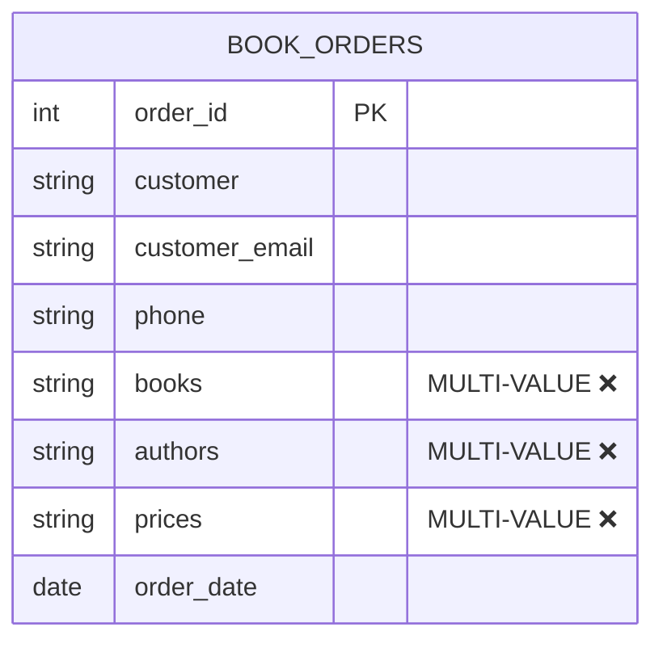

#### Applying 1NF — Atomic Values

```text
RULE: Every cell must contain ONE atomic value. No lists, no comma-separated strings.

FIX: Split multi-valued columns into separate ROWS.
     Each row represents ONE book in ONE order.

  Table: book_orders (1NF)
  ┌──────────┬────────────┬───────────────────┬───────┬──────────┬────────┬───────┬──────────┐
  │ order_id │ customer   │ customer_email    │ phone │ book     │ author │ price │ order_dt │
  ├──────────┼────────────┼───────────────────┼───────┼──────────┼────────┼───────┼──────────┤
  │ 1        │ Alice      │ alice@mail.com    │ 111   │ Java     │ Bloch  │ 45    │ 2025-01  │
  │ 1        │ Alice      │ alice@mail.com    │ 111   │ SQL      │ Date   │ 35    │ 2025-01  │
  │ 2        │ Bob        │ bob@mail.com      │ 222   │ SQL      │ Date   │ 35    │ 2025-02  │
  │ 3        │ Alice      │ alice_new@mail.com│ 111   │ Java     │ Bloch  │ 45    │ 2025-03  │
  │ 3        │ Alice      │ alice_new@mail.com│ 111   │ Patterns │ GoF    │ 55    │ 2025-03  │
  └──────────┴────────────┴───────────────────┴───────┴──────────┴────────┴───────┴──────────┘

  Composite PK: (order_id, book)   ← uniquely identifies each row

  ✅ FIXED: Every cell has ONE value
  ✅ FIXED: Can now query "WHERE book = 'SQL'"
  ❌ STILL: Customer data duplicated (Alice appears 4 times)
  ❌ STILL: Book data duplicated ("SQL" + "Date" + 35 appears twice)
  ❌ STILL: customer_email inconsistency (alice@ vs alice_new@)
```

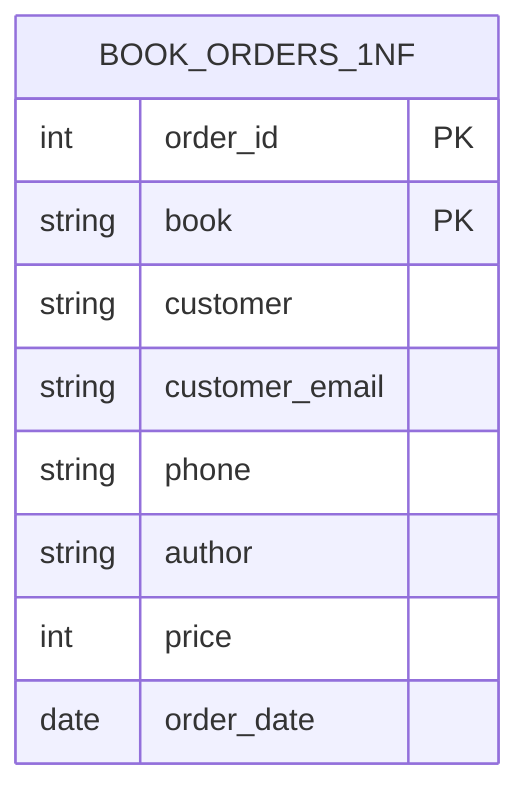

#### Applying 2NF — Remove Partial Dependencies

```text
RULE: Every non-key column must depend on the ENTIRE composite primary key,
      not just PART of it.

  Our PK is (order_id, book). Let's check each column:

  COLUMN           DEPENDS ON             PARTIAL?
  ────────────────────────────────────────────────────────
  customer         order_id only           ✅ YES — partial dependency
  customer_email   order_id only           ✅ YES — partial dependency
  phone            order_id only           ✅ YES — partial dependency
  order_date       order_id only           ✅ YES — partial dependency
  author           book only               ✅ YES — partial dependency
  price            book only               ✅ YES — partial dependency

  ALL non-key columns are partial dependencies!
  "customer" depends on order_id, not on which book is in the order.
  "author" depends on the book, not on which order it's in.

FIX: Pull partial dependencies into their own tables.

  Table: orders (columns that depend on order_id)
  ┌──────────┬────────────┬───────────────────┬───────┬──────────┐
  │ order_id │ customer   │ customer_email    │ phone │ order_dt │
  ├──────────┼────────────┼───────────────────┼───────┼──────────┤
  │ 1        │ Alice      │ alice@mail.com    │ 111   │ 2025-01  │
  │ 2        │ Bob        │ bob@mail.com      │ 222   │ 2025-02  │
  │ 3        │ Alice      │ alice_new@mail.com│ 111   │ 2025-03  │
  └──────────┴────────────┴───────────────────┴───────┴──────────┘

  Table: books (columns that depend on book)
  ┌──────────┬────────┬───────┐
  │ book     │ author │ price │
  ├──────────┼────────┼───────┤
  │ Java     │ Bloch  │ 45    │
  │ SQL      │ Date   │ 35    │
  │ Patterns │ GoF    │ 55    │
  └──────────┴────────┴───────┘

  Table: order_books (link table — the full composite key)
  ┌──────────┬──────────┐
  │ order_id │ book     │
  ├──────────┼──────────┤
  │ 1        │ Java     │
  │ 1        │ SQL      │
  │ 2        │ SQL      │
  │ 3        │ Java     │
  │ 3        │ Patterns │
  └──────────┴──────────┘

  ✅ FIXED: No partial dependencies
  ✅ FIXED: Book info stored ONCE (no duplicates for "SQL")
  ❌ STILL: In "orders", customer + customer_email + phone repeat for Alice
  ❌ STILL: customer_email depends on customer, NOT on order_id (transitive!)
```

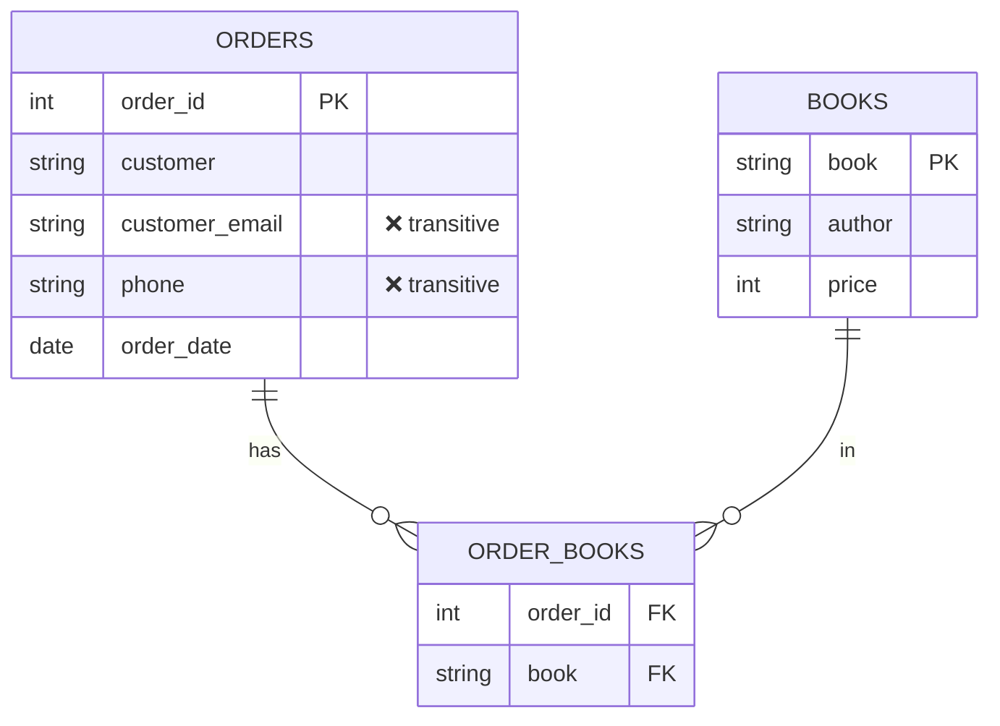

#### Applying 3NF — Remove Transitive Dependencies

```text
RULE: No non-key column can depend on ANOTHER non-key column.
      Every non-key column must depend ONLY on the primary key.

  In the "orders" table:
    order_id → customer           ← OK (depends on PK)
    customer → customer_email     ← TRANSITIVE! email depends on customer, not order_id
    customer → phone              ← TRANSITIVE! phone depends on customer, not order_id
    order_id → order_date         ← OK (depends on PK)

  "customer_email" doesn't describe the ORDER — it describes the CUSTOMER.
  If Alice changes her email, you'd have to update EVERY order row.
  (Row 1 still has alice@mail.com, row 3 has alice_new@mail.com — inconsistency!)

FIX: Extract customer data into its own table.

  Table: customers
  ┌─────────────┬────────────┬───────────────────┬───────┐
  │ customer_id │ name       │ email             │ phone │
  ├─────────────┼────────────┼───────────────────┼───────┤
  │ C1          │ Alice      │ alice_new@mail.com│ 111   │
  │ C2          │ Bob        │ bob@mail.com      │ 222   │
  └─────────────┴────────────┴───────────────────┴───────┘

  Table: books
  ┌─────────┬──────────┬────────┬───────┐
  │ book_id │ title    │ author │ price │
  ├─────────┼──────────┼────────┼───────┤
  │ B1      │ Java     │ Bloch  │ 45    │
  │ B2      │ SQL      │ Date   │ 35    │
  │ B3      │ Patterns │ GoF    │ 55    │
  └─────────┴──────────┴────────┴───────┘

  Table: orders
  ┌──────────┬─────────────┬──────────┐
  │ order_id │ customer_id │ order_dt │
  ├──────────┼─────────────┼──────────┤
  │ 1        │ C1          │ 2025-01  │
  │ 2        │ C2          │ 2025-02  │
  │ 3        │ C1          │ 2025-03  │
  └──────────┴─────────────┴──────────┘

  Table: order_books
  ┌──────────┬─────────┐
  │ order_id │ book_id │
  ├──────────┼─────────┤
  │ 1        │ B1      │
  │ 1        │ B2      │
  │ 2        │ B2      │
  │ 3        │ B1      │
  │ 3        │ B3      │
  └──────────┴─────────┘
```

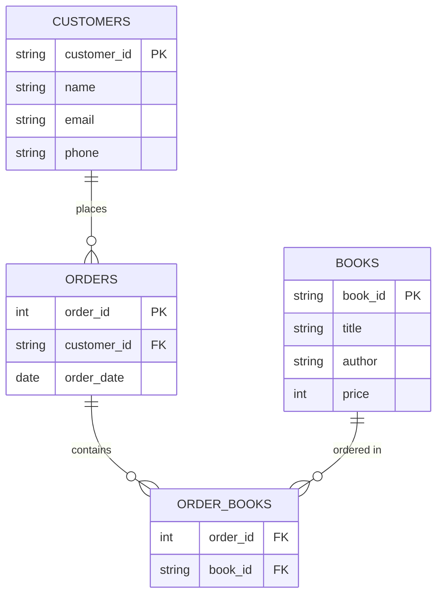

#### Final Result — All Anomalies Solved

```text
  ✅ UPDATE anomaly GONE:
     Alice changes email → update ONE row in customers table.
     All orders automatically reference the updated customer.

  ✅ INSERT anomaly GONE:
     Can add a new book (INSERT into books) without needing an order.
     Can add a new customer without needing an order.

  ✅ DELETE anomaly GONE:
     Delete Bob's orders → Bob still exists in customers table.
     Delete an order → book still exists in books table.

  ✅ No redundancy:
     Alice's name/email/phone stored ONCE.
     Book "SQL" info stored ONCE.
     No conflicting copies of the same data.
```

#### Transformation Summary

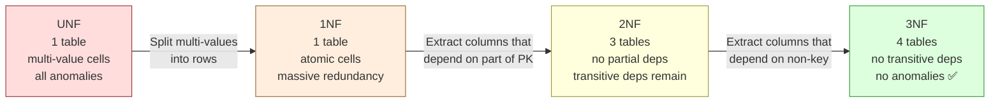

```text
  UNF → 1NF:  "Make every cell atomic"           (split comma-lists into rows)
  1NF → 2NF:  "Remove partial dependencies"      (extract into separate tables)
  2NF → 3NF:  "Remove transitive dependencies"   (non-key → non-key is banned)

  Memory aid (Codd's rule):
    "Every non-key column must depend on
     THE KEY (1NF — there is a key),
     THE WHOLE KEY (2NF — not partial),
     AND NOTHING BUT THE KEY (3NF — not transitive)
     — so help me Codd."
```

### BCNF (Boyce-Codd Normal Form) — Stricter 3NF

```text
BCNF is a stricter version of 3NF. In 3NF, a non-key column can depend
on a CANDIDATE KEY (an alternate key that could be the PK).
BCNF says: NO. Every determinant must be a candidate key.

RULE: For every functional dependency X → Y, X must be a superkey.
      (A superkey = a set of columns that uniquely identifies a row.)
```

#### Continuing the Bookstore Example

```text
Our bookstore grows. Now each book can have MULTIPLE editions
(Hardcover, Paperback, eBook), and each edition has an EDITOR.
Business rules:
  - Each editor works on ONLY ONE edition format (Dr. Ray → Hardcover only)
  - A book can have multiple editions
  - Each book+format combination has exactly one editor

We add this to our schema:

  Table: book_editions (seems fine at first...)
  ┌─────────┬────────────┬────────────┐
  │ book_id │ format     │ editor     │
  ├─────────┼────────────┼────────────┤
  │ B1      │ Hardcover  │ Dr. Ray    │
  │ B1      │ Paperback  │ Ms. Chen   │
  │ B2      │ Hardcover  │ Dr. Ray    │
  │ B2      │ eBook      │ Mr. Patel  │
  │ B3      │ Paperback  │ Ms. Chen   │
  │ B3      │ Hardcover  │ Dr. Kim    │  ← Dr. Kim ALSO does Hardcover!
  └─────────┴────────────┴────────────┘

  Wait — Dr. Kim also does Hardcover? Let's reconsider.
  Actually: each editor works on only one format, BUT multiple
  editors can work on the same format.

  Candidate keys:
    (book_id, format)  — one editor per book+format ✅
    (book_id, editor)  — one format per book+editor ✅ (editor does one format)

  Functional dependencies:
    (book_id, format)  → editor   ← OK, (book_id, format) is a candidate key
    editor → format               ← ❌ VIOLATION! editor is NOT a superkey
                                      Dr. Ray always means Hardcover,
                                      but "Dr. Ray" alone can't identify a row

  3NF check: editor is part of a candidate key → 3NF allows this. ✅
  BCNF check: editor → format, but editor is not a superkey → VIOLATION! ❌

  PROBLEM in practice:
    If Dr. Ray switches to Paperback, we update row 1 but forget row 3:
    Row 1: (B1, Hardcover, Dr. Ray)  ← updated to Paperback
    Row 3: (B2, Hardcover, Dr. Ray)  ← still says Hardcover!
    Inconsistency — which format does Dr. Ray actually work on?

FIX: Decompose so every determinant is a superkey.

  Table: editor_formats (editor determines format)
  ┌────────────┬────────────┐
  │ editor     │ format     │
  ├────────────┼────────────┤
  │ Dr. Ray    │ Hardcover  │
  │ Ms. Chen   │ Paperback  │
  │ Mr. Patel  │ eBook      │
  │ Dr. Kim    │ Hardcover  │
  └────────────┴────────────┘
  editor → format ✅ (editor is the PK = superkey)

  Table: book_editors (which editor works on which book)
  ┌─────────┬────────────┐
  │ book_id │ editor     │
  ├─────────┼────────────┤
  │ B1      │ Dr. Ray    │
  │ B1      │ Ms. Chen   │
  │ B2      │ Dr. Ray    │
  │ B2      │ Mr. Patel  │
  │ B3      │ Ms. Chen   │
  │ B3      │ Dr. Kim    │
  └─────────┴────────────┘
  (book_id, editor) is the PK ✅

  Now:
    Dr. Ray switches format → update ONE row in editor_formats
    To find format: JOIN book_editors + editor_formats
    No inconsistency possible!
```

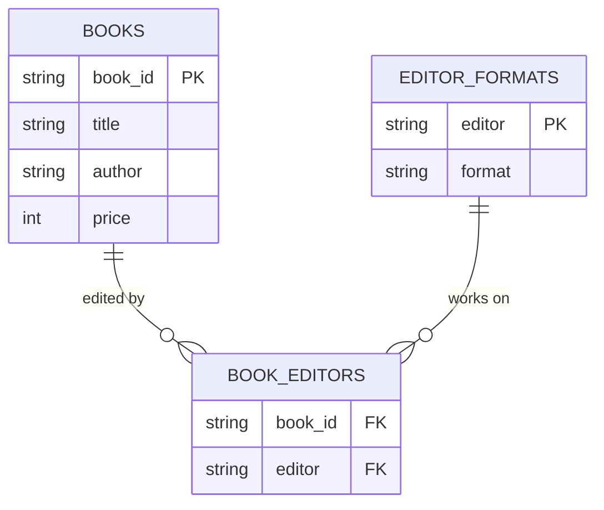

```text
PRACTICAL NOTE:
  Most 3NF designs are already BCNF. The difference only matters
  when a table has overlapping candidate keys — which is rare.
  Our bookstore only hit this because editor determines format
  AND (book_id, editor) is also a candidate key.
  For interviews: know it exists. For daily work: 3NF is usually enough.
```

### 4NF (Fourth Normal Form) — No Multi-Valued Dependencies

```text
4NF deals with MULTI-VALUED DEPENDENCIES.
A multi-valued dependency exists when one column independently
determines multiple values of two or more OTHER columns.

RULE: A table must be in BCNF, and have NO multi-valued dependencies
      (unless the dependent column is part of a superkey).
```

#### Continuing the Bookstore Example

```text
Our bookstore now tracks two things about each book:
  1. Which FORMATS it's available in (Hardcover, Paperback, eBook)
  2. Which LANGUAGES it's been translated into (English, Spanish, French)

A junior developer puts both in one table:

  Table: book_availability
  ┌─────────┬────────────┬──────────┐
  │ book_id │ format     │ language │
  ├─────────┼────────────┼──────────┤
  │ B1      │ Hardcover  │ English  │
  │ B1      │ Hardcover  │ Spanish  │
  │ B1      │ Paperback  │ English  │
  │ B1      │ Paperback  │ Spanish  │
  │ B2      │ Hardcover  │ English  │
  │ B2      │ Hardcover  │ French   │
  │ B2      │ eBook      │ English  │
  │ B2      │ eBook      │ French   │
  └─────────┴────────────┴──────────┘

  Composite PK: (book_id, format, language)

  PROBLEM:
    Book B1 has 2 formats and 2 languages.
    Formats and languages are INDEPENDENT — a Hardcover doesn't "choose"
    which languages it comes in. The book is in ALL format × language combos.

    So we need ALL combinations:
      B1 × 2 formats × 2 languages = 4 rows
      B2 × 2 formats × 2 languages = 4 rows

    If B1 gets a French translation, we add TWO rows:
      (B1, Hardcover, French)
      (B1, Paperback, French)
    If B1 gets an eBook format, we add TWO rows:
      (B1, eBook, English)
      (B1, eBook, Spanish)
    → Cartesian product explosion!
    → Forget one combination → inconsistent data.

  MULTI-VALUED DEPENDENCIES:
    book_id →→ format    (B1 independently has {Hardcover, Paperback})
    book_id →→ language  (B1 independently has {English, Spanish})
    The →→ notation means "multi-valued dependency"

    Formats and languages have NOTHING to do with each other,
    but they're forced into the same table → every combination needed.

FIX: Split independent multi-valued facts into separate tables.

  Table: book_formats
  ┌─────────┬────────────┐
  │ book_id │ format     │
  ├─────────┼────────────┤
  │ B1      │ Hardcover  │
  │ B1      │ Paperback  │
  │ B2      │ Hardcover  │
  │ B2      │ eBook      │
  └─────────┴────────────┘

  Table: book_languages
  ┌─────────┬──────────┐
  │ book_id │ language │
  ├─────────┼──────────┤
  │ B1      │ English  │
  │ B1      │ Spanish  │
  │ B2      │ English  │
  │ B2      │ French   │
  └─────────┴──────────┘

  ✅ B1 gets French translation → ONE row in book_languages. Done.
  ✅ B1 gets eBook format → ONE row in book_formats. Done.
  ✅ No cartesian product. No redundancy.
  ✅ Formats and languages are truly independent → stored independently.

  Before: 8 rows (with redundancy, all combinations)
  After:  8 rows across 2 tables (no redundancy, no combinations)
  Add French to B1: Before adds 2 rows, After adds 1 row.
```

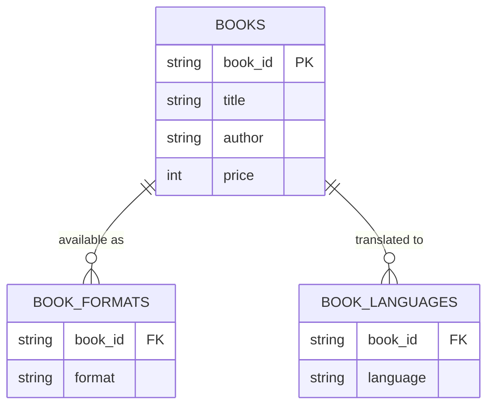

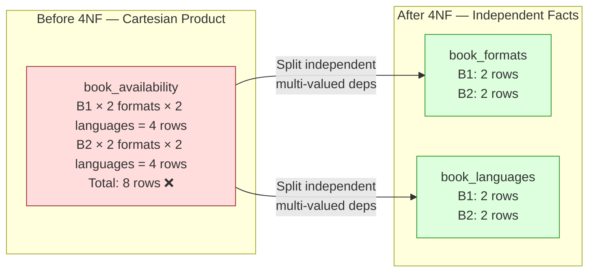

### 5NF (Fifth Normal Form) — No Join Dependencies

```text
5NF deals with JOIN DEPENDENCIES.
A table violates 5NF when it can be decomposed into THREE or more
smaller tables and reconstructed by joining them — without losing data.

This is about facts that involve relationships between THREE entities
where the relationship can't be inferred from pairwise relationships.

RULE: A table is in 5NF if every join dependency is implied by
      the candidate keys. No spurious tuples when you join.
```

#### Continuing the Bookstore Example

```text
Our bookstore has SUPPLIERS. We need to track:
  which SUPPLIER can supply which BOOK to which WAREHOUSE.

  Not every supplier carries every book.
  Not every supplier ships to every warehouse.
  Not every book is stocked at every warehouse.
  The three-way fact is: "Supplier X can deliver Book Y to Warehouse Z."

  Table: supply_chain
  ┌──────────┬─────────┬────────────┐
  │ supplier │ book_id │ warehouse  │
  ├──────────┼─────────┼────────────┤
  │ Acme     │ B1      │ NYC        │
  │ Acme     │ B1      │ LA         │
  │ Acme     │ B2      │ NYC        │
  │ Globe    │ B1      │ NYC        │
  │ Globe    │ B3      │ LA         │
  └──────────┴─────────┴────────────┘

  Composite PK: (supplier, book_id, warehouse)

  QUESTION: Can we decompose this into three pairwise tables
            and reconstruct the original by joining?

  Let's try decomposing:

    supplier_books:       (which supplier carries which book)
    ┌──────────┬─────────┐
    │ supplier │ book_id │
    ├──────────┼─────────┤
    │ Acme     │ B1      │
    │ Acme     │ B2      │
    │ Globe    │ B1      │
    │ Globe    │ B3      │
    └──────────┴─────────┘

    supplier_warehouses:  (which supplier ships to which warehouse)
    ┌──────────┬────────────┐
    │ supplier │ warehouse  │
    ├──────────┼────────────┤
    │ Acme     │ NYC        │
    │ Acme     │ LA         │
    │ Globe    │ NYC        │
    │ Globe    │ LA         │
    └──────────┴────────────┘

    book_warehouses:      (which book is stocked at which warehouse)
    ┌─────────┬────────────┐
    │ book_id │ warehouse  │
    ├─────────┼────────────┤
    │ B1      │ NYC        │
    │ B1      │ LA         │
    │ B2      │ NYC        │
    │ B3      │ LA         │
    └─────────┴────────────┘

  Now JOIN all three:
    Acme  × B1 × NYC  ✅ (was in original)
    Acme  × B1 × LA   ✅ (was in original)
    Acme  × B2 × NYC  ✅ (was in original)
    Acme  × B2 × LA   ❌ SPURIOUS! (Acme can ship B2, Acme ships to LA,
                          B2 is at LA... but Acme does NOT supply B2 to LA!)
    Globe × B1 × NYC  ✅ (was in original)
    Globe × B1 × LA   ❌ SPURIOUS! (Globe carries B1, Globe ships to LA,
                          B1 is at LA... but Globe does NOT supply B1 to LA!)
    Globe × B3 × LA   ✅ (was in original)
    Globe × B3 × NYC  ❌ SPURIOUS! (Globe carries B3, Globe ships to NYC,
                          but B3 is NOT at NYC... this one actually doesn't appear)

  The join creates FAKE rows!
    "Acme supplies B2 to LA" — NEVER TRUE, but the join infers it.
    "Globe supplies B1 to LA" — NEVER TRUE, but the join infers it.

  This means: the three-way relationship CANNOT be decomposed into
  pairwise relationships. The fact "Acme delivers B1 to NYC" requires
  all three together. You can't infer it from pairs.

  → The original table is ALREADY in 5NF. Keep it as one table.
```

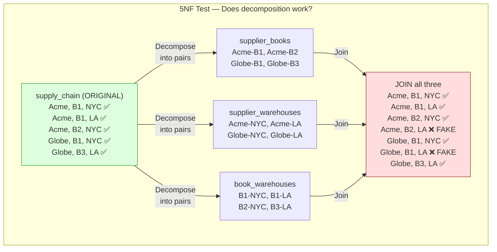

```text
WHEN CAN YOU DECOMPOSE? (table violates 5NF → should be split)

  Different scenario — the bookstore has a business rule:
    "If a supplier carries a book, AND the supplier ships to a warehouse,
     AND the book is stocked at that warehouse,
     THEN the supplier supplies that book to that warehouse."

  In this case, the three-way fact CAN be inferred from pairwise facts!
  The supply_chain table is REDUNDANT — decompose into three tables.

  EXAMPLE with this rule:
    Acme carries B1         (supplier_books)
    Acme ships to LA        (supplier_warehouses)
    B1 is stocked at LA     (book_warehouses)
    → Therefore: Acme supplies B1 to LA ← automatically true!
    → No need to store the three-way fact. It's implied.

  This only works if ALL three pairs being true guarantees the triple.
  In our original scenario, that guarantee doesn't hold:
    Acme carries B2, Acme ships to LA, B2 at LA ← but Acme does NOT supply B2 to LA.
  → Cannot decompose → already in 5NF.
```

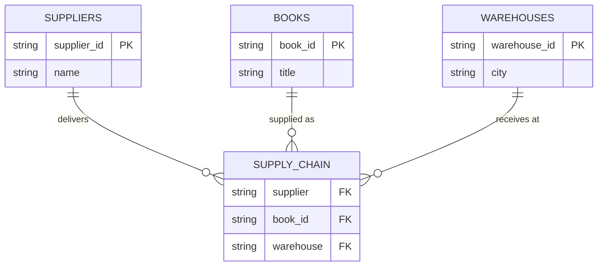

```text
PRACTICAL REALITY:

  ✅ 1NF, 2NF, 3NF:  Essential. You should ALWAYS normalize to at least 3NF.
  ✅ BCNF:            Almost always achieved if you do 3NF properly.
                      Bookstore hit it with the editor → format dependency.
  ⚠️ 4NF:             Relevant when you have independent multi-valued attributes.
                      Bookstore hit it with formats × languages on the same book.
                      Easy to spot: "cartesian product explosion" in a table.
  ⚠️ 5NF:             Very rare in practice. Only matters for complex three-way
                      relationships like supplier-book-warehouse.
                      Most developers never encounter a 5NF violation.

  INTERVIEW TIP:
    Know 1NF-3NF deeply with examples (always asked).
    Know BCNF exists and when it differs from 3NF (sometimes asked).
    Know 4NF concept — "independent multi-valued facts" (occasionally asked).
    Know 5NF exists — "join dependencies" (rarely asked, but impressive to mention).
```

### Complete Normal Form Progression

```mermaid
graph LR
    UNF["UNF<br/>No rules"]
    NF1["1NF<br/>Atomic values<br/>Has a PK"]
    NF2["2NF<br/>No partial deps<br/>(whole key)"]
    NF3["3NF<br/>No transitive deps<br/>(nothing but the key)"]
    BCNF["BCNF<br/>Every determinant<br/>is a superkey"]
    NF4["4NF<br/>No multi-valued<br/>dependencies"]
    NF5["5NF<br/>No join<br/>dependencies"]

    UNF -->|"Atomic cells"| NF1
    NF1 -->|"Remove partial"| NF2
    NF2 -->|"Remove transitive"| NF3
    NF3 -->|"Stricter determinants"| BCNF
    BCNF -->|"Split independent MVDs"| NF4
    NF4 -->|"No spurious joins"| NF5

    style UNF fill:#fdd,stroke:#933
    style NF1 fill:#fed,stroke:#963
    style NF2 fill:#ffd,stroke:#993
    style NF3 fill:#dfd,stroke:#393
    style BCNF fill:#cfc,stroke:#393
    style NF4 fill:#cef,stroke:#369
    style NF5 fill:#ccf,stroke:#339
```

```text
BOOKSTORE EXAMPLE — FULL PROGRESSION:

  UNF:  book_orders (one table, comma-separated books/authors/prices)
  1NF:  book_orders (one row per book per order, atomic cells)
  2NF:  orders + books + order_books (remove partial deps on composite PK)
  3NF:  + customers extracted (customer_email depended on customer, not order)
  BCNF: + editor_formats + book_editors (editor → format was non-superkey determinant)
  4NF:  + book_formats + book_languages (independent multi-valued facts separated)
  5NF:  supply_chain kept as-is (three-way fact can't be decomposed without spurious rows)

NORMAL FORM   RULE                                        PRACTICAL NEED
─────────────────────────────────────────────────────────────────────────
1NF           Atomic values, has a primary key             Always ✅
2NF           No partial dependencies (whole key)          Always ✅
3NF           No transitive dependencies (nothing but key) Always ✅
BCNF          Every determinant is a superkey              Almost always ✅
4NF           No independent multi-valued dependencies     Sometimes ⚠️
5NF           No join dependencies                         Rarely ⚠️
6NF           Every table = one attribute + key            Academic only 🎓
```

### Normalized Design

```text
BEFORE (one big table):
  orders: order_id, product_name, product_price, customer_name, customer_email

AFTER (3NF — three tables):
  customers: customer_id, name, email
  products:  product_id, name, price
  orders:    order_id, customer_id (FK), product_id (FK), quantity, order_date

  No data duplication.
  Change customer email → update ONE row in customers table.
  Product price change → update ONE row in products table.
```

---

## 7. Denormalization

```text
Denormalization = INTENTIONALLY adding redundancy for READ PERFORMANCE.

  Normalized (3 JOINs to get order details):
    SELECT o.id, c.name, p.name, p.price
    FROM orders o
    JOIN customers c ON o.customer_id = c.id
    JOIN products p ON o.product_id = p.id;

  Denormalized (no JOINs — all data in one table):
    SELECT id, customer_name, product_name, product_price
    FROM order_details;

  Trade-off:
    Normalized:     slow reads (JOINs), fast writes, no redundancy, easy updates
    Denormalized:   fast reads (no JOINs), slow writes, redundancy, hard updates

WHEN TO DENORMALIZE:
  ✅ Read-heavy workloads (99% reads, 1% writes)
  ✅ Reporting/analytics tables (materialized views)
  ✅ Search indexes (Elasticsearch — fully denormalized documents)
  ✅ Caching (Redis stores denormalized objects)
  ❌ Write-heavy workloads (inconsistency risk)
  ❌ Primary transactional tables (use normalized + JOINs)

COMMON TECHNIQUES:
  - Add computed columns: total_price = quantity × unit_price
  - Store aggregates: order_count on customer table
  - Materialized views: pre-computed JOIN results refreshed periodically
  - Duplicate columns: store customer_name in orders table
```

---

## 8. Indexes

### What An Index Is

```text
An index is a SEPARATE data structure that makes lookups fast.
It exists alongside the table, like the index at the back of a textbook.

WITHOUT index (sequential scan):
  "Find workflow where name = 'Deploy Pipeline'"
  → Scan ALL rows in the table, one by one
  → 1,000,000 rows → check each one → O(n) → SLOW

WITH index on name:
  "Find workflow where name = 'Deploy Pipeline'"
  → Look up 'Deploy Pipeline' in the B-tree index → O(log n)
  → Index points directly to the row on disk
  → 1,000,000 rows → ~20 comparisons → FAST

  Without index:  1,000,000 row reads
  With index:     ~20 reads (log₂ 1,000,000 ≈ 20)
```

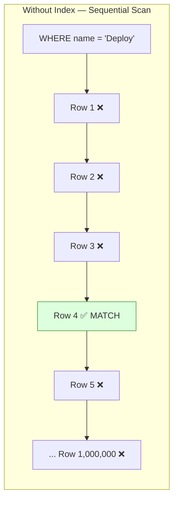

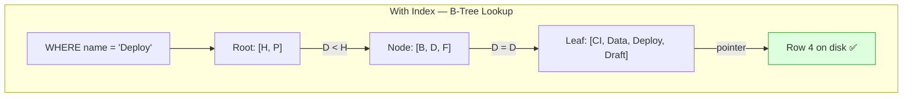

### B-Tree Index (Default) — Internal Structure

```text
PostgreSQL's default index type is B-Tree (balanced tree).
Every index page holds many keys (high fan-out) → tree is very shallow.

  CREATE INDEX idx_workflow_name ON workflows(name);
```

```text
HOW A B-TREE IS STRUCTURED:

  ┌─────────────────────────────────────────────────────────────────────┐
  │                          ROOT NODE                                 │
  │            ┌──────────┬──────────┬──────────┐                      │
  │            │   "H"    │   "P"    │   "V"    │                      │
  │            └──┬───────┴──┬───────┴──┬───────┘                      │
  │               │          │          │                               │
  │        ┌──────┘     ┌────┘     ┌────┘                              │
  │        ▼            ▼          ▼                                    │
  │   INTERNAL      INTERNAL    INTERNAL                               │
  │   ┌────┬────┐  ┌────┬────┐ ┌────┬────┐                            │
  │   │"B" │"E" │  │"K" │"M" │ │"R" │"T" │                            │
  │   └─┬──┴─┬──┘  └─┬──┴─┬──┘ └─┬──┴─┬──┘                           │
  │     │    │        │    │      │    │                                │
  │     ▼    ▼        ▼    ▼      ▼    ▼                               │
  │  ┌─────┐┌─────┐┌─────┐┌─────┐┌─────┐┌─────┐                      │
  │  │A,Ac,││B,Bu,││E,Ex,││K,Ke,││P,Pi,││R,Re,│  ← LEAF NODES       │
  │  │Ar,  ││Ci,D ││F,G, ││L,M, ││Q,   ││S,T, │  (sorted key +      │
  │  │Az   ││e,Dr ││H    ││N,O  ││     ││U,V  │   row pointer)       │
  │  └──┬──┘└──┬──┘└──┬──┘└──┬──┘└──┬──┘└──┬──┘                      │
  │     │      │      │      │      │      │                           │
  │     ▼      ▼      ▼      ▼      ▼      ▼                          │
  │  [Rows]  [Rows]  [Rows]  [Rows]  [Rows]  [Rows]  ← TABLE (heap)  │
  │  on disk on disk on disk on disk on disk on disk                   │
  └─────────────────────────────────────────────────────────────────────┘

  LEAF NODES are LINKED together (doubly-linked list).
  This allows efficient range scans:
    WHERE name BETWEEN 'D' AND 'G'
    → find 'D' in tree → scan right through leaf pages → stop at 'G'
```

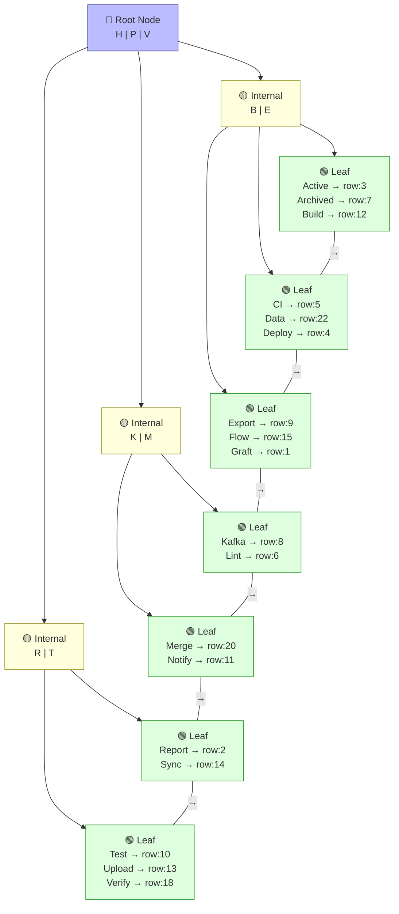

```text
LOOKUP EXAMPLE: WHERE name = 'Deploy'

  Step 1: Start at ROOT [H, P, V]
          'Deploy' starts with 'D' → D < H → go LEFT child

  Step 2: Internal node [B, E]
          D > B and D < E → go MIDDLE child

  Step 3: Leaf node [CI, Data, Deploy]
          Scan entries → found 'Deploy' → pointer says row:4

  Step 4: Go to table heap → read row 4 → return result

  Total: 3 node reads + 1 table read = 4 I/O operations
  vs sequential scan: up to 1,000,000 row reads

RANGE SCAN: WHERE name BETWEEN 'CI' AND 'Flow'

  Step 1: Find 'CI' in tree → leaf node [CI, Data, Deploy]
  Step 2: Follow linked list → next leaf [Export, Flow, Graft]
  Step 3: Read until 'Flow' → stop (Graft > Flow)
  Result: CI, Data, Deploy, Export, Flow — 5 results from 2 leaf pages

  The linked list between leaves makes range queries efficient.
  No need to go back to the root for each key.
```

### B-Tree Properties

```text
PROPERTY                  VALUE
──────────────────────────────────────────────────────────────
Structure                 Balanced tree (all leaves at same depth)
Default in PostgreSQL     Yes (CREATE INDEX uses B-tree)
Time complexity           O(log n) for point lookups
Fan-out                   Hundreds of keys per node (8KB pages)
Tree depth                Usually 3-4 levels even for billions of rows
Leaf nodes                Linked list (efficient range scans)

SUPPORTS OPERATORS:
  =, <, >, <=, >=         ✅ (tree traversal)
  BETWEEN                 ✅ (range scan via leaf linked list)
  LIKE 'abc%'             ✅ (prefix → range scan from 'abc' to 'abd')
  LIKE '%abc'             ❌ (suffix → can't navigate tree from middle)
  IS NULL                 ✅ (NULLs stored at one end of the tree)
  IN (a, b, c)            ✅ (multiple point lookups)

OTHER INDEX TYPES:
  Hash index              Only = (no range). Rarely better than B-tree.
  GIN (Generalized Inverted) Full-text search, JSONB, arrays.
  GiST (Generalized Search)  Geometry, range types, nearest-neighbor.
  BRIN (Block Range)      Very large tables with natural ordering (timestamps).
```

### When To Create Indexes

```text
CREATE an index when:
  ✅ Column is used in WHERE clauses frequently
  ✅ Column is used in JOIN conditions (FK columns)
  ✅ Column is used in ORDER BY
  ✅ Column has HIGH cardinality (many distinct values: email, UUID)

DON'T create an index when:
  ❌ Column has LOW cardinality (boolean: true/false — index barely helps)
  ❌ Table is tiny (< 1000 rows — sequential scan is faster)
  ❌ Table is write-heavy (each INSERT/UPDATE must also update the index)
  ❌ You already have too many indexes (each one slows down writes)

COST OF INDEXES:
  - Disk space: index can be 10-30% of table size
  - Write overhead: every INSERT/UPDATE/DELETE updates the index too
  - Maintenance: indexes can bloat over time → periodic REINDEX
```

### How Indexes Slow Down Writes

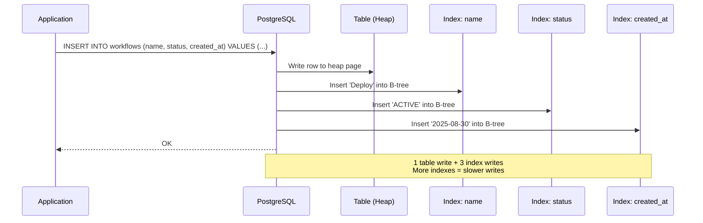

```text
  0 indexes:  INSERT = 1 write (table only)
  3 indexes:  INSERT = 4 writes (table + 3 indexes)
  10 indexes: INSERT = 11 writes (table + 10 indexes)

  Each index also needs page splits when full → more I/O.
  RULE: only create indexes that your queries actually need.
```

### Composite Index — Internal Structure

```text
A composite index stores MULTIPLE columns in each B-tree entry.
Data is sorted by the FIRST column, then by the SECOND within each
first-column group, then by the THIRD within each second-column group.

  CREATE INDEX idx_status_name ON workflows(status, name);
```

```text
INTERNAL STRUCTURE of composite index (status, name):

  The B-tree sorts entries like this:

  ┌──────────────────────────────────────────────────┐
  │              LEAF NODES (sorted)                  │
  ├────────────────┬─────────────────────────────────┤
  │ status         │ name            │ row pointer   │
  ├────────────────┼─────────────────┼───────────────┤
  │ ACTIVE         │ CI Pipeline     │ → row:5       │
  │ ACTIVE         │ Data Sync       │ → row:22      │
  │ ACTIVE         │ Deploy          │ → row:4       │  ← sorted by name
  │ ACTIVE         │ Export          │ → row:9       │     WITHIN 'ACTIVE'
  │ ACTIVE         │ Monitoring      │ → row:11      │
  ├────────────────┼─────────────────┼───────────────┤
  │ ARCHIVED       │ Legacy Import   │ → row:7       │
  │ ARCHIVED       │ Old Backup      │ → row:15      │
  ├────────────────┼─────────────────┼───────────────┤
  │ DRAFT          │ Alpha Test      │ → row:3       │
  │ DRAFT          │ Beta Feature    │ → row:12      │
  │ DRAFT          │ New Workflow    │ → row:1       │
  ├────────────────┼─────────────────┼───────────────┤
  │ PAUSED         │ Batch Job       │ → row:8       │
  │ PAUSED         │ Nightly Sync    │ → row:14      │
  └────────────────┴─────────────────┴───────────────┘

  It's like a phone book:
    First sorted by LAST NAME (status)
    Then sorted by FIRST NAME within each last name group (name)
```

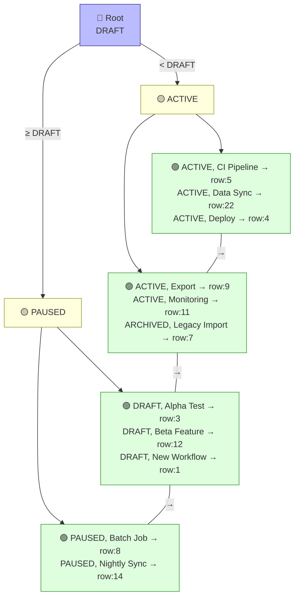

```text
QUERY EXAMPLES against composite index (status, name):

  ✅ WHERE status = 'ACTIVE'
     → Navigate tree to 'ACTIVE' section → scan all entries in that group
     → Uses FIRST column of index → efficient

  ✅ WHERE status = 'ACTIVE' AND name = 'Deploy'
     → Navigate to 'ACTIVE' section → within it, find 'Deploy'
     → Uses BOTH columns → very efficient (single row)

  ✅ WHERE status = 'ACTIVE' ORDER BY name
     → Navigate to 'ACTIVE' section → entries already sorted by name!
     → No extra sort needed → index provides the order for free

  ✅ WHERE status IN ('ACTIVE', 'DRAFT')
     → Two lookups: one for 'ACTIVE' section, one for 'DRAFT' section
     → Combines results

  ❌ WHERE name = 'Deploy' (without status)
     → 'Deploy' is scattered across ACTIVE, ARCHIVED, DRAFT, PAUSED sections
     → Must scan ENTIRE index → no better than sequential scan
     → Can't skip the first column!

  ❌ WHERE name = 'Deploy' AND status = 'ACTIVE'
     → Even though both columns are present, the optimizer CAN use this
     → PostgreSQL is smart enough to rearrange → same as status='ACTIVE' AND name='Deploy'
     → ✅ Actually works! Query planner reorders conditions to match index.
     → The LEFT-TO-RIGHT rule applies to the INDEX structure, not the SQL syntax.
```

### Left-to-Right Rule — Why It Exists

```text
Composite index (A, B, C) is like a sorted filing cabinet:

  Drawer 1: A = "ACTIVE"
    Folder 1: B = "Alpha"
      Sheet 1: C = "2025-01" → row pointer
      Sheet 2: C = "2025-03" → row pointer
    Folder 2: B = "Beta"
      Sheet 1: C = "2025-02" → row pointer

  Drawer 2: A = "DRAFT"
    Folder 1: B = "Delta"
      ...

  QUERY: "Find A=ACTIVE, B=Alpha, C=2025-01"
    Open drawer ACTIVE → folder Alpha → sheet 2025-01 → found! ✅

  QUERY: "Find A=ACTIVE"
    Open drawer ACTIVE → return everything in it ✅

  QUERY: "Find B=Alpha" (skipping A)
    Which drawer? ALL of them could have a folder called "Alpha"
    Must open EVERY drawer and check → full scan ❌

  QUERY: "Find C=2025-01" (skipping A and B)
    Must open every drawer, every folder, check every sheet → full scan ❌

  You can't skip levels in the hierarchy.
  The index is sorted by A first, B second, C third.
  Without knowing A, the B values are scattered across all A groups.
```

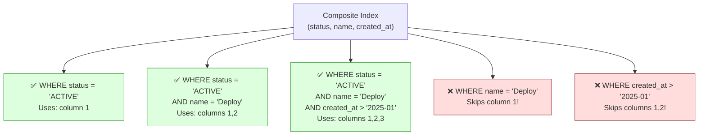

### Covering Index — How It Avoids Table Access

```text
A COVERING INDEX contains ALL columns the query needs.
The database never touches the table — answers entirely from the index.

  Query: SELECT name, status FROM workflows WHERE status = 'ACTIVE';
```

#### Without Covering Index — Index Scan + Table Lookup

```text
  Index on (status) only:

  Step 1: B-tree lookup → find all 'ACTIVE' entries
          Index entry: { status: 'ACTIVE', pointer: row:4 }
          Index entry: { status: 'ACTIVE', pointer: row:5 }
          Index entry: { status: 'ACTIVE', pointer: row:9 }

  Step 2: For EACH pointer → go to table heap → read full row → extract 'name'
          Go to row:4  → read entire row → get name='Deploy'
          Go to row:5  → read entire row → get name='CI Pipeline'
          Go to row:9  → read entire row → get name='Export'

  The table lookups (Step 2) are RANDOM I/O — expensive!
  If 500 rows match → 500 random table reads.
```

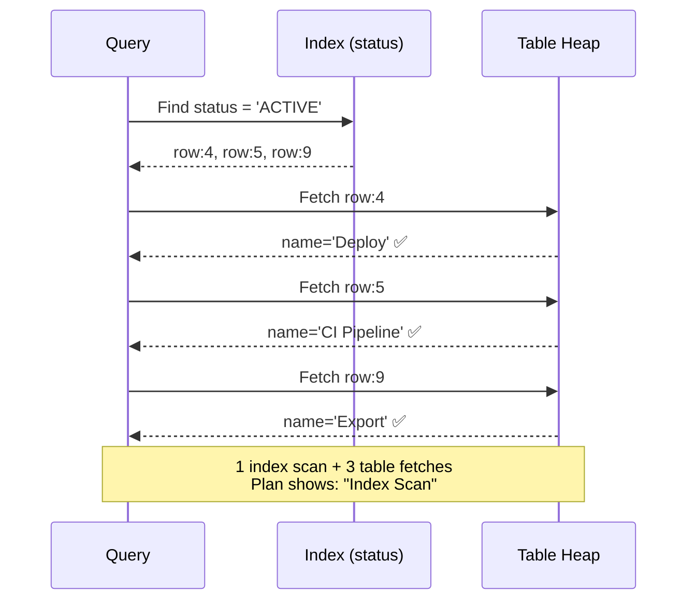

#### With Covering Index — Index Only Scan

```text
  Covering index on (status, name):

  Step 1: B-tree lookup → find all 'ACTIVE' entries
          Index entry: { status: 'ACTIVE', name: 'CI Pipeline', pointer: row:5 }
          Index entry: { status: 'ACTIVE', name: 'Deploy',      pointer: row:4 }
          Index entry: { status: 'ACTIVE', name: 'Export',       pointer: row:9 }

  Step 2: Index already has 'name' → return directly!
          NO table access needed.

  Query plan shows: "Index Only Scan" ← the fastest scan type.
```

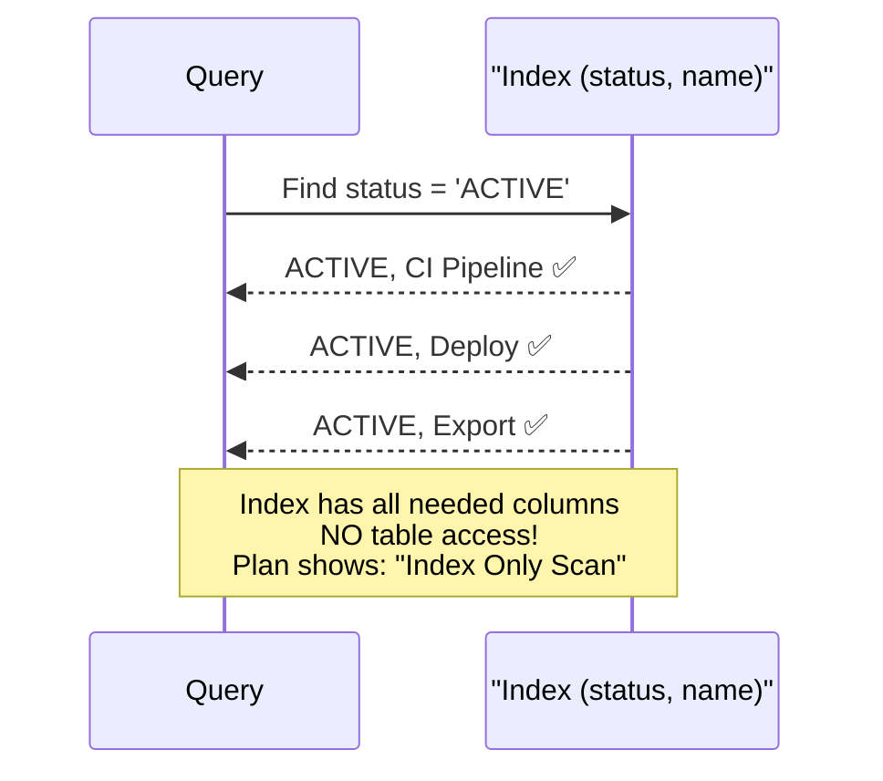

### Covering Index — INCLUDE Clause (PostgreSQL)

```text
PROBLEM with making everything a composite index key:
  CREATE INDEX ON workflows(status, name, created_at, description);
  → Index sorted by ALL four columns → larger B-tree, more page splits
  → 'name', 'created_at', 'description' are in the key even if you
    never search/filter by them — wasted sorting effort

SOLUTION: INCLUDE — store columns in the index but don't sort by them.

  CREATE INDEX idx_status_covering
    ON workflows(status)
    INCLUDE (name, created_at, description);

  status:      in the B-tree KEY (searchable, sorted)
  name:        stored in leaf nodes only (not sorted, not searchable)
  created_at:  stored in leaf nodes only
  description: stored in leaf nodes only

  The index is smaller than (status, name, created_at, description)
  because only 'status' determines the tree structure.
  But the leaf nodes carry enough data to answer:
    SELECT name, created_at, description
    FROM workflows
    WHERE status = 'ACTIVE';
  → Index Only Scan ✅ (no table access)
```

```mermaid
graph TB
    subgraph "Composite Key Index<br/>ON (status, name)"
        CK_ROOT["Root<br/>sorted by status+name"]
        CK_LEAF["Leaf: status, name → row ptr<br/>Searchable: status ✅, name ✅"]
    end

    subgraph "INCLUDE Index<br/>ON (status) INCLUDE (name)"
        INC_ROOT["Root<br/>sorted by status only"]
        INC_LEAF["Leaf: status → row ptr<br/>+ name (stored, not sorted)<br/>Searchable: status ✅, name ❌"]
    end

    CK_ROOT --> CK_LEAF
    INC_ROOT --> INC_LEAF

    style CK_LEAF fill:#ffd,stroke:#993
    style INC_LEAF fill:#dfd,stroke:#393
```

```text
WHEN TO USE INCLUDE:
  ✅ You filter/sort by column A, but also SELECT columns B, C, D
  ✅ You want Index Only Scan without bloating the B-tree key
  ✅ The included columns have high cardinality (long strings, etc.)

WHEN TO USE COMPOSITE KEY instead:
  ✅ You filter/sort by MULTIPLE columns (WHERE A = ? AND B = ?)
  ✅ You need range scans on the second column (WHERE A = ? AND B > ?)

SUMMARY:
  Need to SEARCH by it?  → put in the KEY:     ON (status, name)
  Just need to READ it?  → put in INCLUDE:      ON (status) INCLUDE (name)
```

### Partial Index (Bonus)

```text
An index that only includes rows matching a condition.
Smaller index → less disk, less maintenance, faster lookups.

  -- Only index active workflows (90% of queries filter on ACTIVE)
  CREATE INDEX idx_active_workflows
    ON workflows(name)
    WHERE status = 'ACTIVE';

  SELECT * FROM workflows WHERE status = 'ACTIVE' AND name = 'Deploy';
  → Uses the partial index (small, fast)

  SELECT * FROM workflows WHERE status = 'ARCHIVED' AND name = 'Deploy';
  → Cannot use this index (ARCHIVED rows not in it)

  USE WHEN:
    ✅ Most queries filter on a specific value (status = 'ACTIVE')
    ✅ Only a fraction of rows are relevant (soft-delete: WHERE deleted = false)
    ✅ You want a unique constraint on a subset:
       CREATE UNIQUE INDEX ON users(email) WHERE deleted = false;
       → Two deleted users can have the same email, but active users cannot
```

---

## 9. Query Plans (EXPLAIN)

```text
A query plan shows HOW the database will execute your query.
It reveals whether indexes are used, how tables are joined, and where time is spent.

  EXPLAIN ANALYZE SELECT * FROM workflows WHERE status = 'ACTIVE';

  Output:
    Seq Scan on workflows  (cost=0.00..25.00 rows=500 width=128) (actual time=0.01..0.50 rows=487 loops=1)
      Filter: (status = 'ACTIVE')
      Rows Removed by Filter: 513
    Planning Time: 0.05 ms
    Execution Time: 0.55 ms
```

### Reading a Query Plan

```text
SCAN TYPES (how the DB reads data):

  Seq Scan (Sequential Scan):
    Reads EVERY row in the table. Slow for large tables.
    Used when: no index, or table is small, or query returns most rows.

  Index Scan:
    Uses an index to find rows, then fetches full rows from table.
    Used when: index exists and query is selective (returns few rows).

  Index Only Scan:
    Answers query ENTIRELY from the index (covering index).
    Fastest possible — no table access at all.

  Bitmap Index Scan:
    Uses index to build a bitmap of matching rows, then fetches them.
    Used when: index exists but query returns moderate number of rows.

JOIN TYPES (how tables are combined):

  Nested Loop:
    For each row in table A, scan table B for matches.
    Best for: small tables, or when index exists on join column.
    Complexity: O(n × m) without index, O(n × log m) with index.

  Hash Join:
    Build hash table from smaller table, probe with larger table.
    Best for: medium/large tables without useful indexes.
    Needs memory for hash table.

  Merge Join:
    Both tables sorted on join column, then merged in order.
    Best for: large tables that are already sorted (indexed).
    Very efficient when both sides are pre-sorted.
```

### Interpreting Cost

```text
  (cost=0.00..25.00 rows=500 width=128)
         ↑       ↑      ↑         ↑
    startup   total  estimated  avg row
    cost      cost   rows       size (bytes)

  cost is in arbitrary units (not milliseconds).
  Use EXPLAIN ANALYZE to get actual timing:

  (actual time=0.01..0.50 rows=487 loops=1)
               ↑       ↑      ↑         ↑
          first row  last   actual    times this
          returned   row    rows      node ran

  "rows=500" (estimated) vs "rows=487" (actual)
  → If these differ a lot, statistics are stale → run ANALYZE.
```

---

## 10. Joins

```text
Joins combine rows from two or more tables based on a related column.
```

### INNER JOIN

```text
Returns only rows that have a MATCH in BOTH tables.

  SELECT w.name, s.name AS step_name
  FROM workflows w
  INNER JOIN steps s ON w.id = s.workflow_id;

  workflows:           steps:                   Result:
  ┌────┬──────┐       ┌────┬──────┬──────┐     ┌──────┬──────────┐
  │ id │ name │       │ id │ wf_id│ name │     │ name │ step_name│
  ├────┼──────┤       ├────┼──────┼──────┤     ├──────┼──────────┤
  │ 1  │ CI   │       │ 10 │ 1    │ Build│     │ CI   │ Build    │
  │ 2  │ CD   │       │ 11 │ 1    │ Test │     │ CI   │ Test     │
  │ 3  │ Sync │       │ 12 │ 2    │ Deploy    │ CD   │ Deploy   │
  └────┴──────┘       └────┴──────┴──────┘     └──────┴──────────┘

  Workflow "Sync" (id=3) has NO steps → NOT in result.
```

### LEFT JOIN

```text
Returns ALL rows from the LEFT table, and matching rows from the right.
Non-matching right side = NULL.

  SELECT w.name, s.name AS step_name
  FROM workflows w
  LEFT JOIN steps s ON w.id = s.workflow_id;

  Result:
  ┌──────┬──────────┐
  │ name │ step_name│
  ├──────┼──────────┤
  │ CI   │ Build    │
  │ CI   │ Test     │
  │ CD   │ Deploy   │
  │ Sync │ NULL     │  ← Sync included even with no steps
  └──────┴──────────┘
```

### RIGHT JOIN / FULL OUTER JOIN / CROSS JOIN

```text
RIGHT JOIN:
  Opposite of LEFT JOIN. All rows from RIGHT table, matches from left.
  Rarely used — just swap table order and use LEFT JOIN.

FULL OUTER JOIN:
  All rows from BOTH tables. NULL where no match.
  Use case: finding orphaned records on either side.

CROSS JOIN:
  Every row in A combined with every row in B (Cartesian product).
  A has 100 rows, B has 50 rows → result has 5,000 rows.
  Rarely used intentionally. Usually a bug (forgot the ON clause).
```

### Self Join

```text
A table joined to ITSELF. Useful for hierarchical data.

  Table: employees
  ┌────┬───────┬────────────┐
  │ id │ name  │ manager_id │
  ├────┼───────┼────────────┤
  │ 1  │ Alice │ NULL       │  ← CEO (no manager)
  │ 2  │ Bob   │ 1          │  ← reports to Alice
  │ 3  │ Carol │ 1          │  ← reports to Alice
  │ 4  │ Dave  │ 2          │  ← reports to Bob
  └────┴───────┴────────────┘

  SELECT e.name AS employee, m.name AS manager
  FROM employees e
  LEFT JOIN employees m ON e.manager_id = m.id;

  Result:
  ┌──────────┬─────────┐
  │ employee │ manager │
  ├──────────┼─────────┤
  │ Alice    │ NULL    │
  │ Bob      │ Alice   │
  │ Carol    │ Alice   │
  │ Dave     │ Bob     │
  └──────────┴─────────┘
```

---

## 11. Locking

### Why Locks Exist

```text
Without locks, two concurrent transactions can corrupt data:

  Account balance = $1000

  Transaction A: READ balance → $1000
  Transaction B: READ balance → $1000
  Transaction A: balance = 1000 - 200 = 800 → WRITE $800
  Transaction B: balance = 1000 - 300 = 700 → WRITE $700

  Final balance: $700 (should be $500!)
  $200 disappeared. This is a LOST UPDATE.

  Locks prevent this by making transactions wait:

  Transaction A: LOCK row → READ $1000 → WRITE $800 → UNLOCK
  Transaction B: LOCK row → WAIT... → READ $800 → WRITE $500 → UNLOCK

  Final balance: $500 ✅
```

### Lock Types

```text
SHARED LOCK (S lock / read lock):
  Multiple transactions can hold shared locks simultaneously.
  Used for: SELECT (reading)
  Rule: if any transaction holds a shared lock, no one can write.

EXCLUSIVE LOCK (X lock / write lock):
  Only ONE transaction can hold an exclusive lock.
  Used for: INSERT, UPDATE, DELETE (writing)
  Rule: if any transaction holds an exclusive lock, no one else can read OR write.

  Compatibility matrix:
                    Requesting
                    SHARED    EXCLUSIVE
  Held SHARED      ✅ Yes    ❌ No (must wait)
  Held EXCLUSIVE   ❌ No     ❌ No (must wait)
```

### Lock Granularity

```text
LEVEL          LOCKS                   CONCURRENCY    OVERHEAD
──────────────────────────────────────────────────────────────
Table lock     Entire table            Very low       Very low
Page lock      One disk page (8KB)     Medium         Medium
Row lock       One row                 High           Higher
Column lock    One cell                Very high      Very high (rare)

PostgreSQL uses ROW-LEVEL locking by default.
→ Two transactions can modify DIFFERENT rows simultaneously.
→ Only conflicts when they touch the SAME row.
```

### Row-Level Locking in PostgreSQL

```text
SELECT ... FOR UPDATE:
  Locks the selected rows. Other transactions WAIT if they try
  to update or lock the same rows.

  -- Transaction A:
  BEGIN;
  SELECT * FROM accounts WHERE id = 1 FOR UPDATE;
  -- Row is now LOCKED by Transaction A
  -- Transaction B trying to SELECT FOR UPDATE on the same row → WAITS

  UPDATE accounts SET balance = balance - 200 WHERE id = 1;
  COMMIT;
  -- Lock released → Transaction B can proceed

SELECT ... FOR SHARE:
  Shared lock. Others can also FOR SHARE but cannot FOR UPDATE.

SELECT ... FOR UPDATE SKIP LOCKED:
  If the row is already locked, SKIP it instead of waiting.
  Used for: job queues (pick the next unlocked job).

SELECT ... FOR UPDATE NOWAIT:
  If the row is already locked, ERROR immediately instead of waiting.
  Used when: you can't afford to wait (real-time systems).
```

### Deadlocks

```text
Two transactions each waiting for the other's lock → neither can proceed.

  Transaction A:                    Transaction B:
  ─────────────                    ─────────────
  LOCK row 1 ✅                    LOCK row 2 ✅
  LOCK row 2 ⏳ waiting for B...   LOCK row 1 ⏳ waiting for A...
              ↑ DEADLOCK ↑

  PostgreSQL detects deadlocks automatically.
  One transaction is chosen as the "victim" and rolled back.
  The other transaction proceeds.

  ERROR: deadlock detected
  DETAIL: Process 1234 waits for ShareLock on transaction 5678;
          blocked by process 5678.
          Process 5678 waits for ShareLock on transaction 1234;
          blocked by process 1234.

  PREVENTION:
    1. Always lock rows in the SAME ORDER (e.g., by id ASC)
    2. Keep transactions SHORT (less time holding locks)
    3. Use lock timeouts: SET lock_timeout = '5s';
    4. Use SELECT ... FOR UPDATE NOWAIT where possible
```

---

## 12. Interview Questions

```text
Q: What is a primary key?
A: A column (or set of columns) that uniquely identifies every row.
   Enforces uniqueness + NOT NULL. Creates a clustered index.

Q: What is a foreign key?
A: A column that references the primary key of another table.
   Enforces referential integrity — can't reference a non-existent row.

Q: What is normalization? Why do it?
A: Organizing tables to eliminate data redundancy and anomalies.
   Each fact stored in exactly one place.
   Prevents update, insert, and delete anomalies.

Q: When would you denormalize?
A: When read performance is more important than write consistency.
   Reporting tables, search indexes, caches, materialized views.

Q: What is a composite index?
A: An index on multiple columns. Supports queries that use a LEFT PREFIX
   of the columns. (A,B,C) supports A, A+B, A+B+C but NOT B alone.

Q: What is a covering index?
A: An index that includes all columns needed by a query.
   The database can answer the query from the index alone (Index Only Scan).

Q: What causes a deadlock?
A: Two transactions each hold a lock the other needs.
   Prevention: lock in consistent order, keep transactions short.

Q: INNER JOIN vs LEFT JOIN?
A: INNER JOIN returns only matching rows from both tables.
   LEFT JOIN returns all rows from the left table, with NULLs for non-matches.

Q: What does EXPLAIN ANALYZE show?
A: The actual execution plan used by the database, including real timing,
   row counts, and which indexes were used. Essential for query optimization.
```
