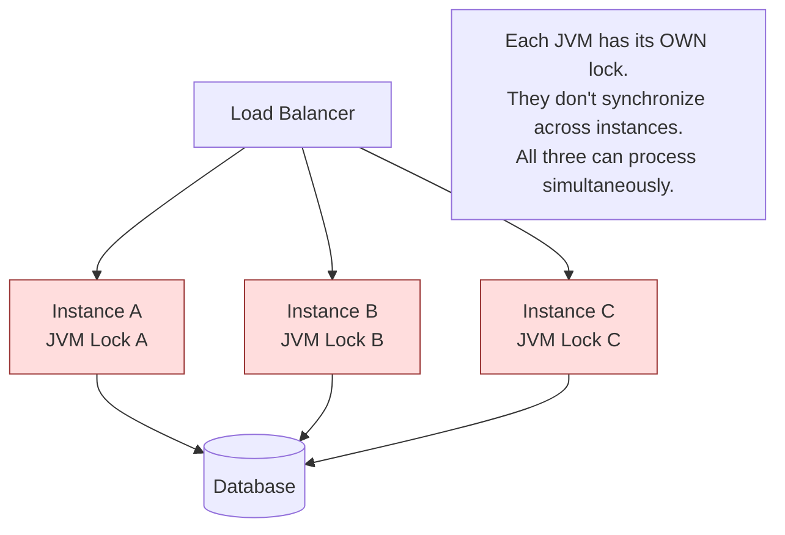
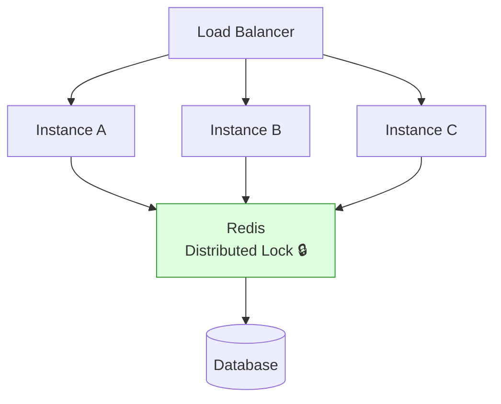
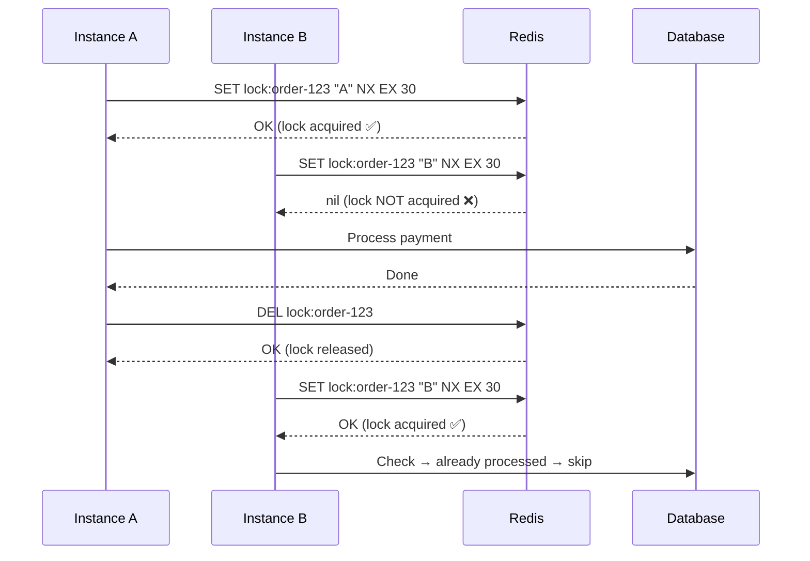
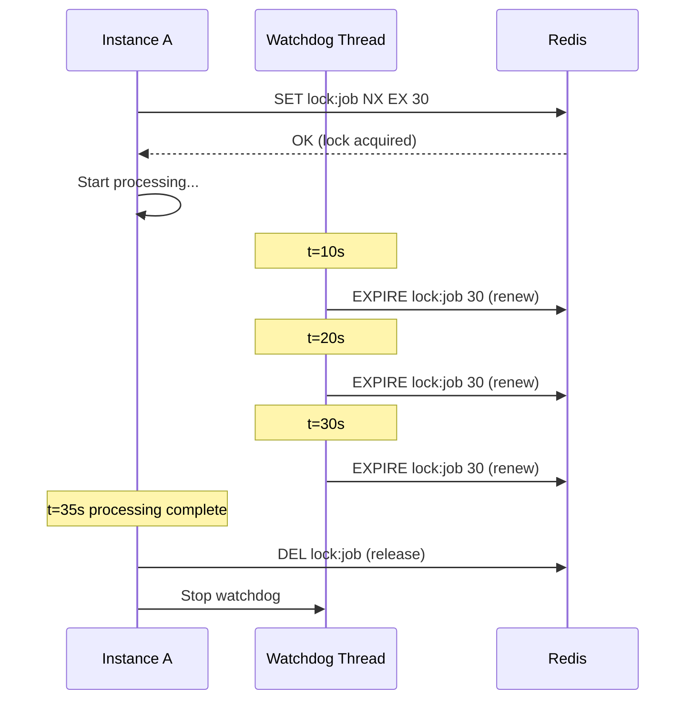
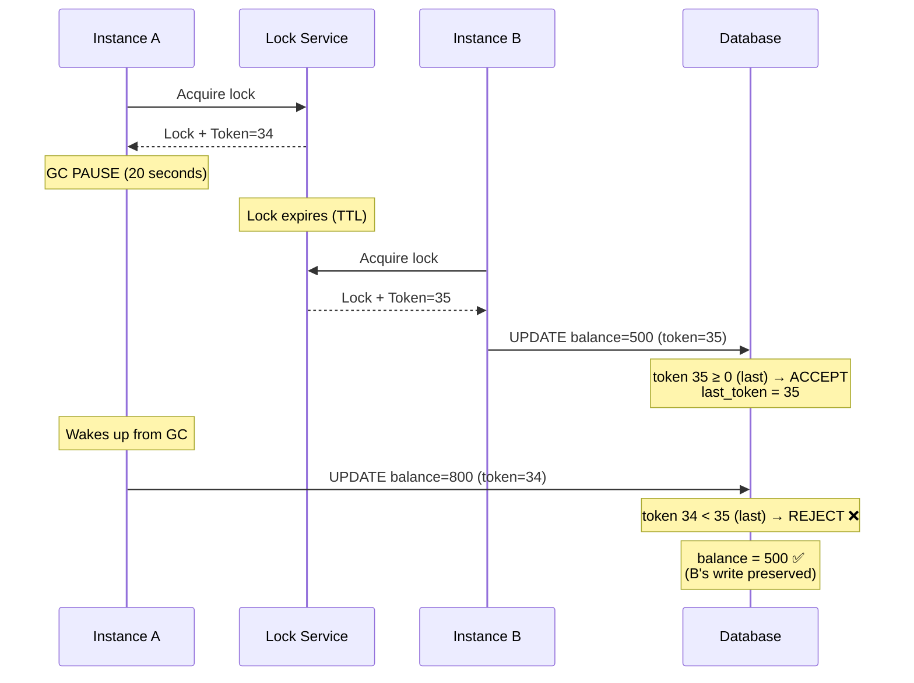
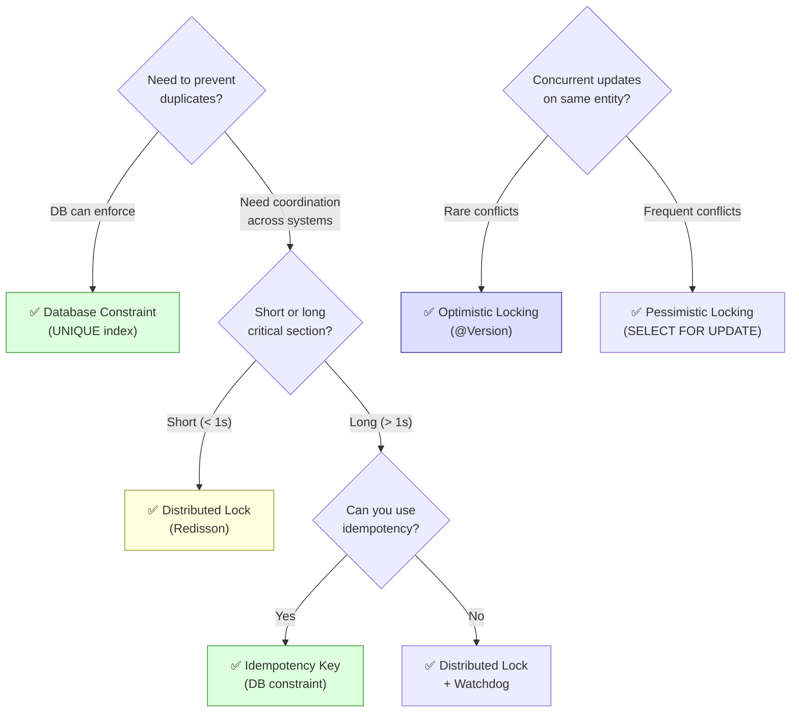

# Distributed Locking

Why single-JVM locks break in multi-instance deployments, how Redis-based
distributed locks work, Redisson, lease/TTL, fencing tokens, and when
to use locks vs database constraints vs idempotency.

---

## 1. The Problem

### Why synchronized / ReentrantLock Fails

```text
Single instance — synchronized works fine:

  @Service
  public class PaymentService {
      public synchronized void processPayment(UUID orderId) {
          if (!isProcessed(orderId)) {
              process(orderId);    // runs exactly once
          }
      }
  }

  Thread A: acquires lock → checks → processes → releases lock
  Thread B: waits → acquires lock → checks (already processed) → skips

  ✅ Works! Only one thread processes the order.

Three instances behind a load balancer — synchronized BREAKS:

  Instance A (JVM 1):  synchronized → check → not processed → process ✅
  Instance B (JVM 2):  synchronized → check → not processed → process ✅
  Instance C (JVM 3):  synchronized → check → not processed → process ✅

  The order is processed THREE TIMES!
  Each JVM has its OWN lock. They don't know about each other.
  synchronized only works within ONE JVM.
```



### What We Need

```text
A lock that ALL instances can see and respect.
The lock must live OUTSIDE any single JVM — in a shared system.

  Instance A ──┐
               │
  Instance B ──┼──► Shared Lock (Redis / DB / ZooKeeper)
               │
  Instance C ──┘

  Only the instance that holds the lock can proceed.
  Others must wait or skip.
```



---

## 2. Redis-Based Distributed Lock

### Basic Concept

```text
Use Redis SET with NX (set if Not eXists) and EX (expiry):

  SET lock:payment:order-123 "instance-A" NX EX 30

  NX: only set if the key does NOT exist (atomic check-and-set)
  EX 30: key expires after 30 seconds (lease / TTL)

  If key didn't exist → SET succeeds → you hold the lock
  If key already exists → SET fails → someone else holds the lock

  To release: DEL lock:payment:order-123
  (only if the value is still "instance-A" — prevents releasing someone else's lock)
```

### Step-by-Step Flow

```text
Instance A:
  SET lock:payment:order-123 "instance-A" NX EX 30
  → OK (lock acquired ✅)
  → process payment
  → DEL lock:payment:order-123 (release)

Instance B (concurrent):
  SET lock:payment:order-123 "instance-B" NX EX 30
  → (nil) — key exists! (lock NOT acquired ❌)
  → skip or wait and retry

Instance C (concurrent):
  SET lock:payment:order-123 "instance-C" NX EX 30
  → (nil) — key exists! (lock NOT acquired ❌)
  → skip or wait and retry
```



### Safe Release (Lua Script)

```text
PROBLEM with simple DEL:
  Instance A: acquires lock (TTL 30s)
  Instance A: processes slowly... takes 35 seconds
  TTL expires at 30s → lock auto-released
  Instance B: acquires the lock at 31s
  Instance A: finishes at 35s → DEL lock → DELETES B's LOCK!
  Instance C: acquires lock → processes AGAIN

  Instance A released a lock it no longer owned.

FIX: only delete if the value matches (atomic check-and-delete):

  -- Lua script (atomic in Redis)
  if redis.call("GET", KEYS[1]) == ARGV[1] then
      return redis.call("DEL", KEYS[1])
  else
      return 0
  end

  KEYS[1] = "lock:payment:order-123"
  ARGV[1] = "instance-A"

  If the lock still belongs to Instance A → delete
  If someone else took it → don't delete (return 0)
```

---

## 3. Lease / TTL — Why It Matters

```text
The TTL (Time To Live) on a distributed lock is called the LEASE.
It's a safety mechanism that prevents DEAD LOCKS.

WITHOUT TTL:
  Instance A acquires lock → crashes → lock is held FOREVER
  No other instance can ever acquire it → system stuck

WITH TTL:
  Instance A acquires lock (TTL = 30s) → crashes
  After 30 seconds → Redis auto-deletes the key
  Instance B can now acquire the lock → system recovers

CHOOSING TTL:
  Too short (5s):
    Instance A is still processing but lock expires
    → Instance B acquires lock → both process → duplicate!
    This is the most dangerous failure mode.

  Too long (5 min):
    Instance A crashes → system waits 5 minutes before recovery
    → 5 minutes of downtime for that operation

  RULE OF THUMB:
    TTL = expected_processing_time × 3

    If processing takes ~5 seconds:  TTL = 15 seconds
    If processing takes ~30 seconds: TTL = 90 seconds

    Or better: use lock renewal (watchdog — see Redisson).
```

---

## 4. Lock Renewal (Watchdog)

```text
PROBLEM:
  TTL = 30s, but processing sometimes takes 45s.
  Lock expires while still processing → another instance acquires it.

SOLUTION: automatically extend the lock while work is in progress.

  Instance A: acquires lock (TTL = 30s)
  Background thread (watchdog):
    Every 10 seconds: if still processing → EXPIRE lock 30s (reset TTL)
    → Lock never expires while Instance A is alive and processing

  Instance A crashes:
    Watchdog thread dies with it → no more renewals
    Lock expires after 30s → Instance B can acquire

  This is exactly what Redisson does (default watchdog timeout = 30s,
  renewal every 10s = timeout/3).
```



---

## 5. Redisson — Production-Ready Distributed Locks

### What It Is

```text
Redisson is a Redis client for Java that provides high-level
distributed data structures, including production-ready locks.

Features over raw Redis SET NX:
  ✅ Automatic lock renewal (watchdog)
  ✅ Reentrant locks (same thread can acquire twice)
  ✅ Fair locks (FIFO ordering)
  ✅ Read/write locks
  ✅ Pub/sub based lock release notification (no polling)
  ✅ RedLock algorithm support (multi-node Redis)
  ✅ Proper Lua-script-based atomic release
```

### Setup

```xml
<!-- pom.xml -->
<dependency>
    <groupId>org.redisson</groupId>
    <artifactId>redisson-spring-boot-starter</artifactId>
    <version>3.30.0</version>
</dependency>
```

```yaml
# application.yaml
spring:
  data:
    redis:
      host: localhost
      port: 6379
```

### Basic Usage

```java
@Service
public class PaymentService {

    private final RedissonClient redisson;

    public PaymentService(RedissonClient redisson) {
        this.redisson = redisson;
    }

    public void processPayment(UUID orderId) {
        RLock lock = redisson.getLock("lock:payment:" + orderId);

        try {
            // Try to acquire lock, wait up to 5s, hold for 30s max
            boolean acquired = lock.tryLock(5, 30, TimeUnit.SECONDS);

            if (!acquired) {
                throw new RuntimeException("Could not acquire lock for order " + orderId);
            }

            // Critical section — only one instance executes this
            if (!isProcessed(orderId)) {
                process(orderId);
            }

        } catch (InterruptedException e) {
            Thread.currentThread().interrupt();
            throw new RuntimeException("Lock acquisition interrupted", e);

        } finally {
            if (lock.isHeldByCurrentThread()) {
                lock.unlock();
            }
        }
    }
}
```

### With Watchdog (Auto-Renewal)

```java
// Don't specify leaseTime → watchdog auto-renews every 10s
boolean acquired = lock.tryLock(5, TimeUnit.SECONDS);
// Lock held until unlock() is called. Watchdog prevents expiry.

// vs

// Specify leaseTime → NO watchdog, lock expires after 30s regardless
boolean acquired = lock.tryLock(5, 30, TimeUnit.SECONDS);
// Lock expires after 30s even if you haven't unlocked.
```

```text
RECOMMENDATION:
  Use watchdog (no leaseTime) for operations with unpredictable duration.
  Use explicit leaseTime when you WANT a hard timeout (safety net).
```

### Lock Types

```java
// Standard lock (exclusive, reentrant)
RLock lock = redisson.getLock("lock:resource");

// Fair lock (FIFO — threads acquire in request order)
RLock fairLock = redisson.getFairLock("lock:resource");

// Read/Write lock (multiple readers OR one writer)
RReadWriteLock rwLock = redisson.getReadWriteLock("lock:resource");
rwLock.readLock().lock();     // multiple threads can hold simultaneously
rwLock.writeLock().lock();    // exclusive — blocks all readers and writers

// Semaphore (limit concurrent access — like @ConcurrencyLimit but distributed)
RSemaphore semaphore = redisson.getSemaphore("sem:resource");
semaphore.trySetPermits(5);   // allow 5 concurrent
semaphore.acquire();          // blocks if all 5 permits taken
semaphore.release();
```

---

## 6. Fencing Tokens

### The Problem Locks Can't Fully Solve

```text
Even with TTL and watchdog, there's a subtle problem:

  1. Instance A acquires lock
  2. Instance A has a long GC pause (20 seconds)
  3. Lock expires (watchdog thread also paused by GC)
  4. Instance B acquires lock
  5. Instance B writes to DB: UPDATE balance = 500
  6. Instance A wakes up from GC, THINKS it still has the lock
  7. Instance A writes to DB: UPDATE balance = 800
  → Instance B's write is overwritten! Lost update.

  The lock expired, but Instance A didn't know.
  This is a fundamental limitation of distributed locks with TTL.
```

### The Solution: Fencing Tokens

```text
A fencing token is a monotonically increasing number given with each lock.

  Lock acquisition #1 → fencing token = 34
  Lock acquisition #2 → fencing token = 35
  Lock acquisition #3 → fencing token = 36
  (always increases, never goes backwards)

  USAGE:
    Instance A acquires lock → token = 34
    Instance A sends request to DB with token 34
    Instance B acquires lock → token = 35 (A's lock expired)
    Instance B sends request to DB with token 35

    DB rule: only accept writes with token ≥ last seen token

    Instance A wakes up from GC, sends write with token 34
    DB: "last token was 35, rejecting token 34" → REJECTED ✅
    Instance B's write (token 35) is preserved.
```



```text
IMPLEMENTATION:
  The fencing token can be:
    - Redis INCR on a counter key
    - Redisson lock's lock ID
    - A database sequence

  The RESOURCE (DB, API, storage) must CHECK the token:
    - Add a "last_token" column to the table
    - UPDATE ... SET ..., last_token = :token WHERE id = :id AND last_token < :token
    - If 0 rows updated → stale token → reject

  Not all systems support fencing tokens.
  This is the gold standard for correctness but adds complexity.
```

---

## 7. Deadlock Risks in Distributed Locks

```text
PROBLEM 1: Acquiring multiple locks in different order

  Instance A: lock("resource-1") → lock("resource-2") → WAIT for resource-2
  Instance B: lock("resource-2") → lock("resource-1") → WAIT for resource-1
  → DEADLOCK (both waiting for each other)

  FIX: Always acquire locks in the SAME ORDER.
    Sort resource IDs alphabetically/numerically.
    Always lock the lower ID first.

    resources = sort(["resource-2", "resource-1"])  → ["resource-1", "resource-2"]
    lock("resource-1") then lock("resource-2")  ← consistent order

PROBLEM 2: Lock acquired but never released (instance crash)

  FIX: TTL / lease on the lock.
  After TTL expires, lock is auto-released.
  Always set a TTL, even with watchdog.

PROBLEM 3: Waiting forever for a lock

  FIX: Use tryLock with timeout, not lock() which waits forever.
    lock.tryLock(5, TimeUnit.SECONDS)  ← give up after 5 seconds
    NOT lock.lock()                     ← waits forever
```

---

## 8. When NOT to Use Distributed Locks

### Alternative: Database Constraints

```text
SCENARIO: Prevent duplicate order processing.

  DISTRIBUTED LOCK:
    lock("order:" + orderId) → check if processed → process → unlock

  DATABASE UNIQUE CONSTRAINT:
    CREATE UNIQUE INDEX idx_payments_order_id ON payments(order_id);

    INSERT INTO payments (order_id, amount) VALUES (?, ?);
    → First insert succeeds
    → Second insert fails: unique constraint violation
    → No lock needed! The DB handles it.

  WHEN DB CONSTRAINT IS BETTER:
    ✅ Simpler (no lock management code)
    ✅ Works even if Redis is down
    ✅ No TTL / expiry issues
    ✅ Database is the source of truth anyway

  WHEN DISTRIBUTED LOCK IS BETTER:
    ✅ Operation involves external side effects (API calls, emails)
    ✅ Need to coordinate across multiple resources
    ✅ Database can't express the constraint
```

### Alternative: Idempotency Keys

```text
SCENARIO: Prevent duplicate API requests.

  Client sends: POST /payments { "idempotencyKey": "abc-123", "amount": 50 }

  Server:
    1. Check: does payment with idempotencyKey="abc-123" exist?
    2. Yes → return existing result (no duplicate processing)
    3. No → process payment → store with idempotencyKey

  No lock needed. The idempotency key + DB unique constraint handles it.

  CREATE UNIQUE INDEX idx_payments_idem_key ON payments(idempotency_key);
```

### Alternative: Optimistic Locking

```text
SCENARIO: Two instances updating the same entity.

  @Version on the entity → UPDATE ... WHERE version = ?
  If version changed → OptimisticLockException → retry

  No distributed lock needed. The database handles conflict detection.
  See: Concurrency-Control/README.md
```

### Decision Guide



```text
RULE OF THUMB:

  1. FIRST try: database constraint (UNIQUE, CHECK)
     Simplest, most reliable, no extra infrastructure.

  2. THEN try: idempotency key + DB constraint
     Works for API duplicate prevention.

  3. THEN try: optimistic locking (@Version)
     Works for concurrent entity updates.

  4. ONLY THEN: distributed lock
     When you need to coordinate across multiple resources
     or prevent concurrent execution of a complex operation
     that can't be expressed as a DB constraint.

  Distributed locks are a LAST RESORT, not a first choice.
```

---

## 9. Interview Questions

```text
Q: Why doesn't synchronized work in a distributed system?
A: synchronized only works within one JVM. Multiple JVMs have separate
   locks — they don't see each other. Need a shared external lock (Redis).

Q: How does a Redis-based distributed lock work?
A: SET key value NX EX ttl. NX ensures only one client sets it (atomic).
   EX sets a TTL so the lock auto-releases if the holder crashes.
   Release: DEL key (only if value matches — Lua script for atomicity).

Q: What is a lease / TTL on a lock?
A: An expiration time on the lock. If the holder crashes, the lock
   auto-releases after the TTL. Prevents permanent deadlocks.

Q: What is a watchdog in Redisson?
A: A background thread that auto-renews the lock's TTL while the holder
   is alive and processing. Prevents premature lock expiry for long operations.
   Stops when the holder crashes (thread dies with the JVM).

Q: What is a fencing token?
A: A monotonically increasing number given with each lock acquisition.
   The resource (DB) rejects writes with a token lower than the last accepted.
   Prevents stale lock holders from corrupting data after GC pauses.

Q: When would you use a distributed lock vs a database constraint?
A: DB constraint for simple uniqueness (duplicate prevention).
   Distributed lock for coordinating complex operations across services
   or preventing concurrent execution of non-idempotent operations.

Q: What is the RedLock algorithm?
A: An algorithm by Redis author for distributed locks across multiple
   independent Redis nodes. Acquire lock on majority (N/2+1) of nodes.
   Controversial — Martin Kleppmann argued it's not safe without fencing.

Q: Name three alternatives to distributed locks.
A: Database unique constraints, idempotency keys, optimistic locking (@Version).
   All simpler and more reliable for their specific use cases.
```
