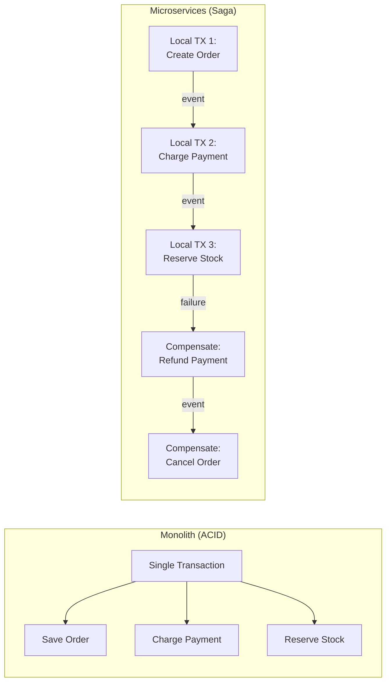
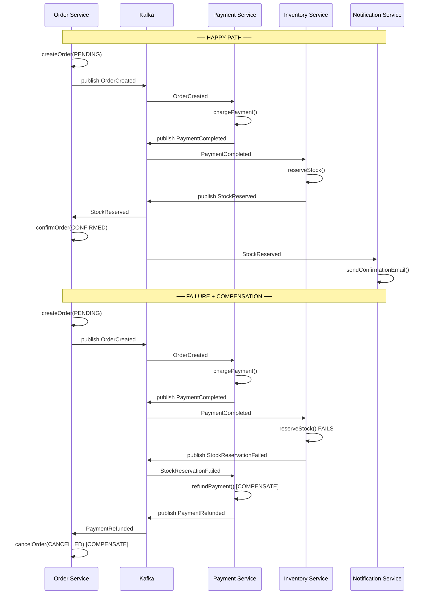
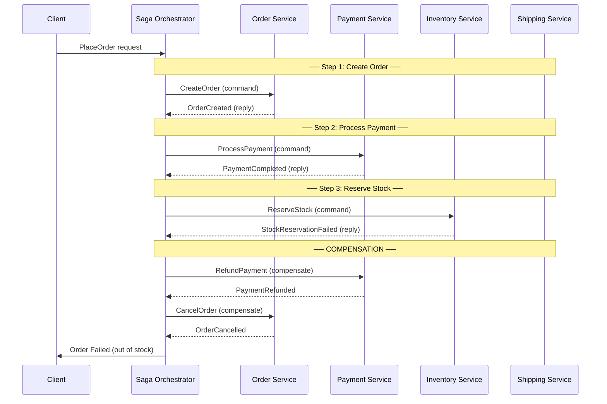
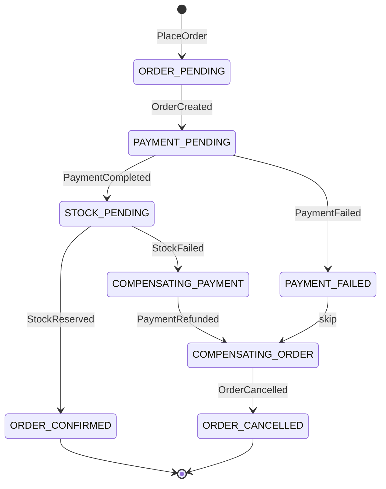
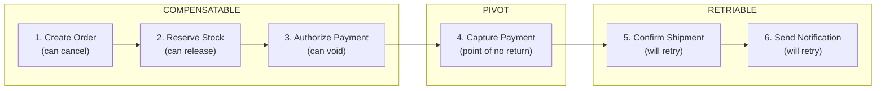
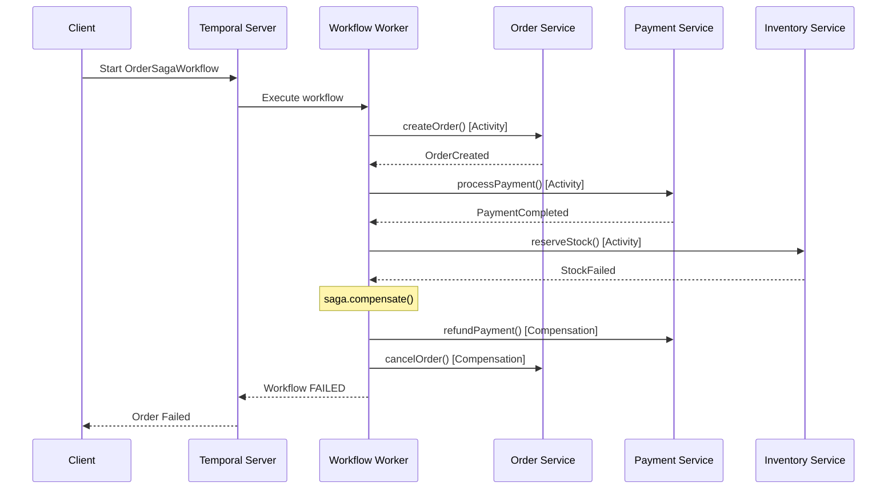

# Saga Pattern — Distributed Transactions in Microservices

Managing data consistency across multiple services without distributed
transactions (2PC). Local transactions + compensating actions.

---

## 1. The Problem — Why Sagas Exist

```text
MONOLITH:
  @Transactional
  public void placeOrder(OrderRequest req) {
      orderRepo.save(order);           // ─┐
      paymentService.charge(req);      //  ├── ALL in ONE transaction
      inventoryService.reserve(req);   //  │   ACID guaranteed
      shippingService.schedule(req);   // ─┘
  }
  If ANY step fails → entire transaction rolls back. Simple.

MICROSERVICES:
  Order Service   → own DB (Postgres)
  Payment Service → own DB (MySQL)
  Inventory Service → own DB (MongoDB)
  Shipping Service  → own DB (Postgres)

  Each service has its OWN database. No shared transaction manager.
  You CANNOT wrap multiple services in a single @Transactional.

  TWO-PHASE COMMIT (2PC)?
    ❌ Slow — holds locks across all participants
    ❌ Fragile — coordinator is SPOF
    ❌ Not supported by many NoSQL databases
    ❌ Doesn't scale in microservices

  SOLUTION: SAGA PATTERN
    A sequence of LOCAL transactions, each in its own service.
    If a step fails → execute COMPENSATING transactions to undo previous steps.
```



---

## 2. Saga Types — Choreography vs Orchestration

### Choreography Saga (Event-Driven)



```text
CHOREOGRAPHY SAGA:
  - No central coordinator
  - Each service listens for events and reacts
  - Each service publishes events after its local transaction
  - Each service knows its own compensating action

  PROS:
    ✅ Loose coupling (services are independent)
    ✅ No single point of failure
    ✅ Simple for 2-4 step flows
    ✅ Easy to add new listeners

  CONS:
    ❌ Hard to understand full flow (logic spread across services)
    ❌ Cyclic dependencies possible
    ❌ Debugging is painful (no central view)
    ❌ Adding steps changes event wiring
    ❌ Risk of event spaghetti in complex flows
```

### Orchestration Saga (Command-Driven)



```text
ORCHESTRATION SAGA:
  - Central Saga Orchestrator directs the flow
  - Sends COMMANDS to services, receives REPLIES
  - Knows the full workflow + compensation logic
  - Implemented as a STATE MACHINE

  PROS:
    ✅ Full flow visible in one place
    ✅ Easy to add/remove/reorder steps
    ✅ Centralized error handling + compensation
    ✅ Easier debugging and monitoring
    ✅ Better for complex flows (5+ steps)

  CONS:
    ❌ Orchestrator is a coupling point
    ❌ Single point of failure (need HA)
    ❌ Risk of becoming "god service"
    ❌ Orchestrator must be stateful (persist saga state)
```

---

## 3. Saga State Machine



```text
SAGA STATE MACHINE:
  Every saga instance has a STATE that tracks progress.
  States: PENDING → IN_PROGRESS → COMPLETED / COMPENSATING → CANCELLED

  PERSISTENCE:
    Saga state MUST be persisted (database table).
    If orchestrator crashes mid-saga → restart from last known state.

    saga_instances table:
    ┌──────────────┬────────────────┬───────────────┬──────────────────┐
    │ saga_id      │ saga_type      │ current_state │ payload (JSON)   │
    ├──────────────┼────────────────┼───────────────┼──────────────────┤
    │ saga-001     │ PlaceOrder     │ STOCK_PENDING │ { orderId: 123 } │
    │ saga-002     │ PlaceOrder     │ CONFIRMED     │ { orderId: 124 } │
    │ saga-003     │ PlaceOrder     │ COMPENSATING  │ { orderId: 125 } │
    └──────────────┴────────────────┴───────────────┴──────────────────┘
```

---

## 4. Compensating Transactions — Deep Dive

```text
FORWARD ACTIONS vs COMPENSATING ACTIONS:

  ┌─────────────────────────┬──────────────────────────────────────┐
  │ Forward Action          │ Compensating Action                  │
  ├─────────────────────────┼──────────────────────────────────────┤
  │ CreateOrder (PENDING)   │ CancelOrder (CANCELLED)              │
  │ ChargePayment           │ RefundPayment                        │
  │ ReserveStock            │ ReleaseStock                         │
  │ DebitWallet             │ CreditWallet                         │
  │ CreateShipment          │ CancelShipment                       │
  │ SendEmail               │ ❌ CANNOT COMPENSATE (pivot)         │
  │ ShipPackage             │ ❌ CANNOT COMPENSATE (pivot)         │
  └─────────────────────────┴──────────────────────────────────────┘

THREE TYPES OF SAGA STEPS:

  1. COMPENSATABLE — can be undone
     Reserve stock → Release stock
     Authorize payment → Void authorization

  2. PIVOT — point of no return, can't be undone
     Capture payment (money charged)
     Ship package (item left warehouse)

  3. RETRIABLE — guaranteed to eventually succeed (idempotent)
     Send notification (retry until success)
     Update read model

  ORDERING RULE:
    Compensatable steps → Pivot step → Retriable steps
    If pivot fails → compensate all previous steps
    After pivot succeeds → only retriable steps remain (they WILL succeed)
```



---

## 5. Spring Boot — Orchestration Saga Implementation

### Saga Definition

```java
@Getter
public enum OrderSagaStep {
    CREATE_ORDER,
    PROCESS_PAYMENT,
    RESERVE_STOCK,
    CONFIRM_ORDER;
}

@Getter
public enum SagaStatus {
    STARTED, IN_PROGRESS, COMPLETED, COMPENSATING, FAILED;
}

@Entity
@Table(name = "saga_instances")
public class SagaInstance {
    @Id
    private UUID sagaId;
    private String sagaType;

    @Enumerated(EnumType.STRING)
    private SagaStatus status;

    @Enumerated(EnumType.STRING)
    private OrderSagaStep currentStep;

    @Column(columnDefinition = "JSONB")
    private String payload;

    private Instant createdAt;
    private Instant updatedAt;
    private int retryCount;
    private String failureReason;
}
```

### Saga Orchestrator

```java
@Service
@RequiredArgsConstructor
@Slf4j
public class OrderSagaOrchestrator {

    private final SagaRepository sagaRepo;
    private final OrderServiceClient orderClient;
    private final PaymentServiceClient paymentClient;
    private final InventoryServiceClient inventoryClient;
    private final KafkaTemplate<String, SagaCommand> kafkaTemplate;

    @Transactional
    public UUID startSaga(PlaceOrderRequest request) {
        SagaInstance saga = new SagaInstance(
            UUID.randomUUID(), "PlaceOrder",
            SagaStatus.STARTED, OrderSagaStep.CREATE_ORDER,
            toJson(request), Instant.now()
        );
        sagaRepo.save(saga);
        executeStep(saga);
        return saga.getSagaId();
    }

    public void handleStepReply(UUID sagaId, StepReply reply) {
        SagaInstance saga = sagaRepo.findById(sagaId)
            .orElseThrow(() -> new SagaNotFoundException(sagaId));

        if (reply.isSuccess()) {
            advanceToNextStep(saga, reply);
        } else {
            startCompensation(saga, reply.getFailureReason());
        }
    }

    private void advanceToNextStep(SagaInstance saga, StepReply reply) {
        switch (saga.getCurrentStep()) {
            case CREATE_ORDER -> {
                saga.setCurrentStep(OrderSagaStep.PROCESS_PAYMENT);
                saga.setStatus(SagaStatus.IN_PROGRESS);
                executeStep(saga);
            }
            case PROCESS_PAYMENT -> {
                saga.setCurrentStep(OrderSagaStep.RESERVE_STOCK);
                executeStep(saga);
            }
            case RESERVE_STOCK -> {
                saga.setCurrentStep(OrderSagaStep.CONFIRM_ORDER);
                executeStep(saga);
            }
            case CONFIRM_ORDER -> {
                saga.setStatus(SagaStatus.COMPLETED);
                sagaRepo.save(saga);
                log.info("Saga {} completed successfully", saga.getSagaId());
            }
        }
    }

    private void executeStep(SagaInstance saga) {
        sagaRepo.save(saga);
        PlaceOrderRequest req = fromJson(saga.getPayload());

        switch (saga.getCurrentStep()) {
            case CREATE_ORDER ->
                kafkaTemplate.send("order-commands", saga.getSagaId().toString(),
                    new SagaCommand("CreateOrder", saga.getSagaId(), req));
            case PROCESS_PAYMENT ->
                kafkaTemplate.send("payment-commands", saga.getSagaId().toString(),
                    new SagaCommand("ProcessPayment", saga.getSagaId(), req));
            case RESERVE_STOCK ->
                kafkaTemplate.send("inventory-commands", saga.getSagaId().toString(),
                    new SagaCommand("ReserveStock", saga.getSagaId(), req));
            case CONFIRM_ORDER ->
                kafkaTemplate.send("order-commands", saga.getSagaId().toString(),
                    new SagaCommand("ConfirmOrder", saga.getSagaId(), req));
        }
    }

    private void startCompensation(SagaInstance saga, String reason) {
        log.warn("Saga {} failed at step {}: {}",
            saga.getSagaId(), saga.getCurrentStep(), reason);
        saga.setStatus(SagaStatus.COMPENSATING);
        saga.setFailureReason(reason);
        compensateStep(saga);
    }

    private void compensateStep(SagaInstance saga) {
        sagaRepo.save(saga);
        switch (saga.getCurrentStep()) {
            case RESERVE_STOCK -> {
                // stock reservation failed → compensate payment
                saga.setCurrentStep(OrderSagaStep.PROCESS_PAYMENT);
                kafkaTemplate.send("payment-commands", saga.getSagaId().toString(),
                    new SagaCommand("RefundPayment", saga.getSagaId(), null));
            }
            case PROCESS_PAYMENT -> {
                // payment refunded → compensate order
                saga.setCurrentStep(OrderSagaStep.CREATE_ORDER);
                kafkaTemplate.send("order-commands", saga.getSagaId().toString(),
                    new SagaCommand("CancelOrder", saga.getSagaId(), null));
            }
            case CREATE_ORDER -> {
                // order cancelled → saga fully compensated
                saga.setStatus(SagaStatus.FAILED);
                sagaRepo.save(saga);
                log.info("Saga {} fully compensated", saga.getSagaId());
            }
            default -> {
                saga.setStatus(SagaStatus.FAILED);
                sagaRepo.save(saga);
            }
        }
    }
}
```

### Participant Service (Payment)

```java
@Service
@RequiredArgsConstructor
@Slf4j
public class PaymentSagaParticipant {

    private final PaymentService paymentService;
    private final KafkaTemplate<String, StepReply> replyTemplate;

    @KafkaListener(topics = "payment-commands", groupId = "payment-service")
    public void handleCommand(SagaCommand command) {
        try {
            switch (command.getCommandType()) {
                case "ProcessPayment" -> {
                    paymentService.charge(command.getPayload());
                    replyTemplate.send("saga-replies", command.getSagaId().toString(),
                        StepReply.success(command.getSagaId(), "PaymentCompleted"));
                }
                case "RefundPayment" -> {
                    paymentService.refund(command.getPayload());
                    replyTemplate.send("saga-replies", command.getSagaId().toString(),
                        StepReply.success(command.getSagaId(), "PaymentRefunded"));
                }
            }
        } catch (Exception e) {
            replyTemplate.send("saga-replies", command.getSagaId().toString(),
                StepReply.failure(command.getSagaId(), e.getMessage()));
        }
    }
}
```

---

## 6. Spring Boot — Choreography Saga Implementation

```java
// ── ORDER SERVICE ──
@Service
@RequiredArgsConstructor
public class OrderService {
    private final OrderRepository orderRepo;
    private final KafkaTemplate<String, OrderEvent> kafkaTemplate;

    @Transactional
    public Order createOrder(CreateOrderRequest req) {
        Order order = Order.builder()
            .status(OrderStatus.PENDING)
            .customerId(req.customerId())
            .items(req.items())
            .total(req.total())
            .build();
        orderRepo.save(order);

        kafkaTemplate.send("order-events", order.getId().toString(),
            new OrderCreatedEvent(order.getId(), req.customerId(), req.total()));
        return order;
    }

    @KafkaListener(topics = "inventory-events", groupId = "order-service")
    public void handleInventoryEvent(InventoryEvent event) {
        if (event instanceof StockReservedEvent e) {
            orderRepo.updateStatus(e.orderId(), OrderStatus.CONFIRMED);
        } else if (event instanceof StockReservationFailedEvent e) {
            orderRepo.updateStatus(e.orderId(), OrderStatus.CANCELLED);
        }
    }

    @KafkaListener(topics = "payment-events", groupId = "order-service")
    public void handlePaymentEvent(PaymentEvent event) {
        if (event instanceof PaymentRefundedEvent e) {
            orderRepo.updateStatus(e.orderId(), OrderStatus.CANCELLED);
        }
    }
}

// ── PAYMENT SERVICE ──
@Service
@RequiredArgsConstructor
public class PaymentSagaHandler {
    private final PaymentService paymentService;
    private final KafkaTemplate<String, PaymentEvent> kafkaTemplate;

    @KafkaListener(topics = "order-events", groupId = "payment-service")
    public void handleOrderCreated(OrderCreatedEvent event) {
        try {
            paymentService.charge(event.orderId(), event.total());
            kafkaTemplate.send("payment-events", event.orderId().toString(),
                new PaymentCompletedEvent(event.orderId()));
        } catch (InsufficientFundsException e) {
            kafkaTemplate.send("payment-events", event.orderId().toString(),
                new PaymentFailedEvent(event.orderId(), e.getMessage()));
        }
    }

    @KafkaListener(topics = "inventory-events", groupId = "payment-service")
    public void handleStockFailure(StockReservationFailedEvent event) {
        // COMPENSATE: refund payment because stock is unavailable
        paymentService.refund(event.orderId());
        kafkaTemplate.send("payment-events", event.orderId().toString(),
            new PaymentRefundedEvent(event.orderId()));
    }
}

// ── INVENTORY SERVICE ──
@Service
@RequiredArgsConstructor
public class InventorySagaHandler {
    private final InventoryService inventoryService;
    private final KafkaTemplate<String, InventoryEvent> kafkaTemplate;

    @KafkaListener(topics = "payment-events", groupId = "inventory-service")
    public void handlePaymentCompleted(PaymentCompletedEvent event) {
        try {
            inventoryService.reserve(event.orderId());
            kafkaTemplate.send("inventory-events", event.orderId().toString(),
                new StockReservedEvent(event.orderId()));
        } catch (OutOfStockException e) {
            kafkaTemplate.send("inventory-events", event.orderId().toString(),
                new StockReservationFailedEvent(event.orderId(), e.getMessage()));
        }
    }
}
```

---

## 7. Saga with Temporal (Production-Grade)

```text
TEMPORAL / CADENCE — production workflow orchestration engine.

WHY Temporal over hand-rolled saga:
  ✅ Built-in state persistence (no manual saga table)
  ✅ Automatic retries with backoff
  ✅ Compensation built into the framework
  ✅ Timeout handling per step
  ✅ Visibility into running workflows (web UI)
  ✅ Handles worker crashes gracefully
  ❌ Additional infrastructure (Temporal server)
  ❌ Learning curve
```

```java
// Temporal Workflow Definition
@WorkflowInterface
public interface OrderSagaWorkflow {
    @WorkflowMethod
    OrderResult placeOrder(PlaceOrderRequest request);
}

@ActivityInterface
public interface OrderActivities {
    CreateOrderResult createOrder(PlaceOrderRequest req);
    void cancelOrder(UUID orderId);
}

@ActivityInterface
public interface PaymentActivities {
    PaymentResult processPayment(UUID orderId, BigDecimal amount);
    void refundPayment(UUID orderId);
}

@ActivityInterface
public interface InventoryActivities {
    void reserveStock(UUID orderId, List<OrderItem> items);
    void releaseStock(UUID orderId);
}

// Workflow Implementation
public class OrderSagaWorkflowImpl implements OrderSagaWorkflow {

    private final OrderActivities orderActivities = Workflow.newActivityStub(
        OrderActivities.class, ActivityOptions.newBuilder()
            .setStartToCloseTimeout(Duration.ofSeconds(30))
            .setRetryOptions(RetryOptions.newBuilder().setMaximumAttempts(3).build())
            .build());

    private final PaymentActivities paymentActivities = Workflow.newActivityStub(
        PaymentActivities.class, ActivityOptions.newBuilder()
            .setStartToCloseTimeout(Duration.ofSeconds(30))
            .build());

    private final InventoryActivities inventoryActivities = Workflow.newActivityStub(
        InventoryActivities.class, ActivityOptions.newBuilder()
            .setStartToCloseTimeout(Duration.ofSeconds(30))
            .build());

    @Override
    public OrderResult placeOrder(PlaceOrderRequest request) {
        Saga saga = new Saga(new Saga.Options.Builder().build());

        try {
            // Step 1: Create Order
            CreateOrderResult order = orderActivities.createOrder(request);
            saga.addCompensation(orderActivities::cancelOrder, order.orderId());

            // Step 2: Process Payment
            paymentActivities.processPayment(order.orderId(), request.total());
            saga.addCompensation(paymentActivities::refundPayment, order.orderId());

            // Step 3: Reserve Stock
            inventoryActivities.reserveStock(order.orderId(), request.items());
            saga.addCompensation(inventoryActivities::releaseStock, order.orderId());

            return OrderResult.success(order.orderId());

        } catch (ActivityFailure e) {
            saga.compensate();  // Runs ALL registered compensations in reverse
            throw e;
        }
    }
}
```



---

## 8. Saga Patterns Comparison

```text
┌────────────────────┬────────────────────┬────────────────────┬────────────────────┐
│ Aspect             │ Choreography       │ Custom Orchestrator│ Temporal/Camunda   │
├────────────────────┼────────────────────┼────────────────────┼────────────────────┤
│ Complexity         │ Low (simple flows) │ Medium             │ Low (framework)    │
│ Coupling           │ Loose              │ Medium             │ Medium             │
│ Visibility         │ Poor               │ Good               │ Excellent (Web UI) │
│ State persistence  │ Manual per service │ Manual (saga table)│ Built-in           │
│ Compensation       │ Manual per service │ Manual (switch)    │ saga.compensate()  │
│ Retry/timeout      │ Manual             │ Manual             │ Built-in           │
│ Infrastructure     │ Just Kafka         │ Kafka + DB         │ Temporal Server    │
│ Learning curve     │ Low                │ Medium             │ Medium             │
│ Best for           │ 2-3 step flows     │ 3-5 step flows     │ 5+ complex flows   │
└────────────────────┴────────────────────┴────────────────────┴────────────────────┘
```

---

## 9. Production Considerations

```text
1. IDEMPOTENCY:
   Every saga step MUST be idempotent.
   If "ProcessPayment" is retried, don't charge twice.
   Use idempotency keys (orderId + step) in payment gateway.

2. TIMEOUT HANDLING:
   What if a step never responds?
   - Set deadline per step (e.g., payment must complete in 30s)
   - On timeout → treat as failure → compensate
   - Dead saga detector: cron job finds stuck sagas

3. ORDERING:
   Compensating actions must run in REVERSE order.
   Forward: Order → Payment → Stock
   Compensate: Stock → Payment → Order (reverse)

4. OBSERVABILITY:
   - Log saga_id in every service (correlation)
   - Track saga state transitions (metrics)
   - Alert on stuck/long-running sagas
   - Dashboard: sagas by state (pending, completed, failed)

5. CONCURRENT SAGAS:
   Two sagas for same orderId? Use optimistic locking.
   Saga table: version column + UPDATE WHERE version = expected

6. SAGA RECOVERY:
   On orchestrator restart:
   - Query all sagas with status IN_PROGRESS or COMPENSATING
   - Resume from current step
   - This is why saga state MUST be persisted
```

---

## 10. Interview Questions

### Q1: What's the difference between 2PC and Saga?

```text
TWO-PHASE COMMIT (2PC):
  - Coordinator asks all participants: "Can you commit?"
  - All say YES → coordinator says "COMMIT"
  - Any says NO → coordinator says "ROLLBACK"
  - SYNCHRONOUS, BLOCKING, holds locks during prepare phase
  - Strong consistency (ACID across services)

SAGA:
  - Each service commits its OWN local transaction
  - If a step fails → run compensating transactions
  - ASYNCHRONOUS, NON-BLOCKING
  - Eventual consistency (not ACID across services)
  - Uses semantic undo (refund, cancel) instead of rollback

WHY SAGA WINS in microservices:
  - No global locks → better performance
  - No coordinator SPOF (or use resilient orchestrator)
  - Works with any database (no XA support needed)
  - Scales better (each service independent)

TRADE-OFF:
  2PC = strong consistency, poor availability
  Saga = eventual consistency, high availability
  (CAP theorem: you must choose)
```

### Q2: How do you handle a saga where compensation is impossible?

```text
Example: Email already sent, package already shipped.

STRATEGIES:
  1. ORDER STEPS CAREFULLY:
     Put non-compensatable (pivot) steps LAST
     All compensatable steps first → pivot → retriable steps

  2. TWO-PHASE BUSINESS LOGIC:
     First: RESERVE (compensatable)
       → Reserve stock, authorize (not capture) payment
     Then: CONFIRM (non-compensatable)
       → Deduct stock, capture payment, ship
     Failure during reserve → easy to undo
     Only confirm after all reserves succeed

  3. ACCEPT AND FIX LATER:
     Package shipped but payment failed later?
     → Create a return/refund workflow
     → Not every failure needs instant compensation
     → Business process handles edge cases

  4. SAGA DESIGN RULE:
     Compensatable → Pivot → Retriable
     Never put a non-compensatable step before a step that might fail
```

### Q3: Choreography vs Orchestration — when to pick which?

```text
CHOREOGRAPHY when:
  - 2-3 services, simple linear flow
  - Services must remain fully independent
  - No complex branching or conditions
  - Team prefers event-driven architecture
  - Example: OrderCreated → Payment → Notification

ORCHESTRATION when:
  - 4+ services, complex flow
  - Branching logic (if payment type = card vs wallet)
  - Need central monitoring/visibility
  - Complex compensation logic
  - Need timeouts per step
  - Example: Travel booking (flight + hotel + car + insurance)

HYBRID (common):
  - Orchestrate the critical business path
  - Choreograph side effects (notifications, analytics)
```

### Q4: How do you test a saga?

```text
UNIT TESTS:
  - Test each saga step in isolation
  - Test compensation logic for each step
  - Test state transitions (mock event/command handlers)

INTEGRATION TESTS:
  - Use Testcontainers (Kafka + databases)
  - Run full saga happy path
  - Run saga with failure at each step → verify compensation
  - Verify idempotency (send same event twice → no duplicate effect)

CONTRACT TESTS:
  - Verify event schemas between services (Pact / Schema Registry)
  - Producer publishes expected event format
  - Consumer handles expected event format

CHAOS TESTS:
  - Kill a service mid-saga → verify recovery
  - Introduce network delays → verify timeout handling
  - Duplicate events → verify idempotency
```

### Q5: Your saga is stuck — payment charged but stock service is down. What do you do?

```text
IMMEDIATE:
  1. Saga orchestrator detects timeout (no reply from inventory)
  2. Saga enters COMPENSATING state
  3. Orchestrator sends RefundPayment to payment service
  4. After refund → CancelOrder → saga FAILED

IF ORCHESTRATOR IS ALSO DOWN:
  1. Dead saga detector (cron) finds sagas stuck > threshold
  2. Resumes compensation from last known state
  3. Or: manual intervention dashboard

PREVENTION:
  1. Set reasonable timeouts per step
  2. Implement dead saga recovery job
  3. Alert on sagas older than expected duration
  4. Store enough state to resume from any point
  5. Make compensation steps RETRIABLE (they must eventually succeed)
```
