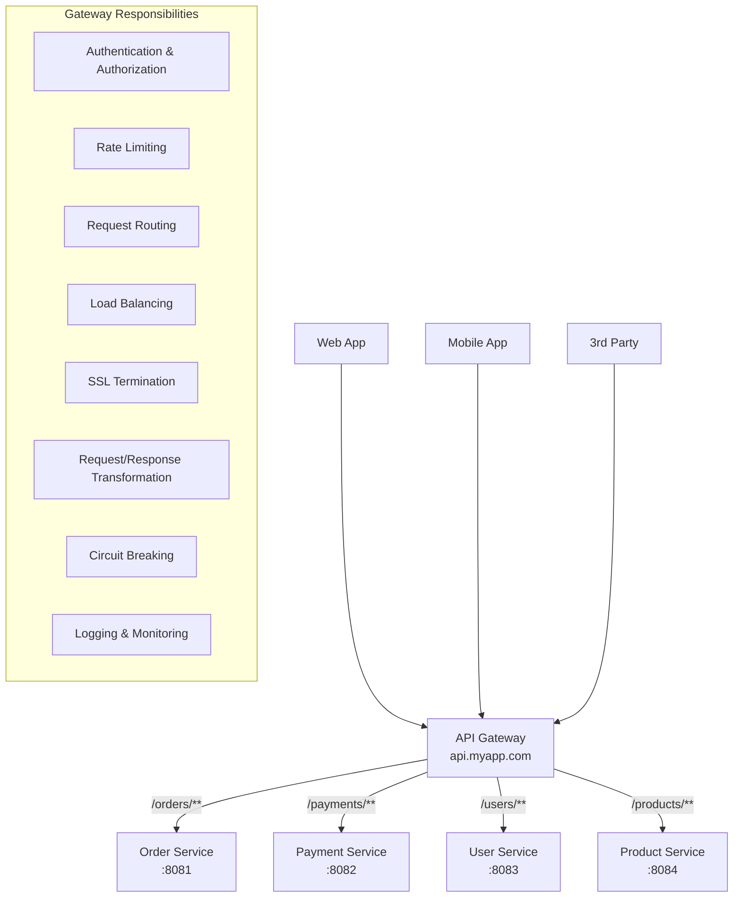
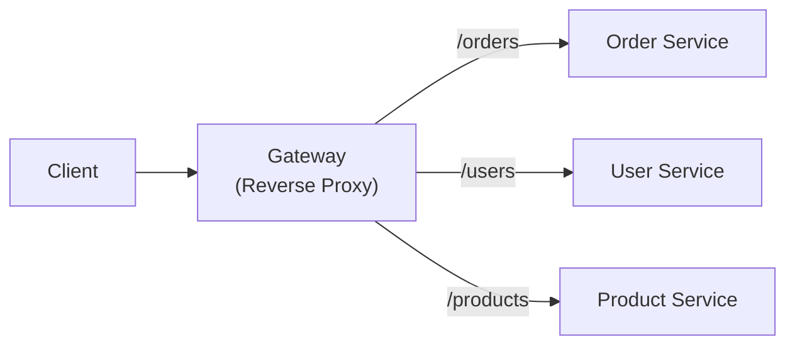
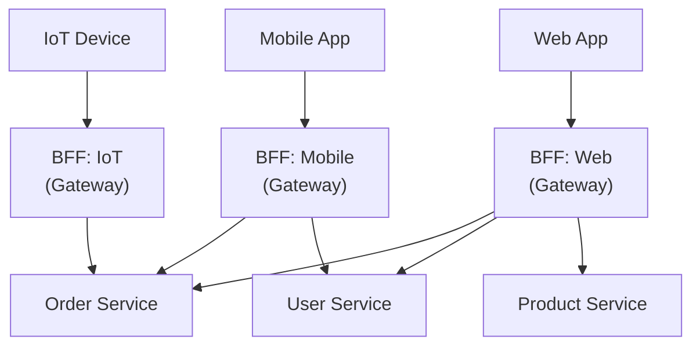
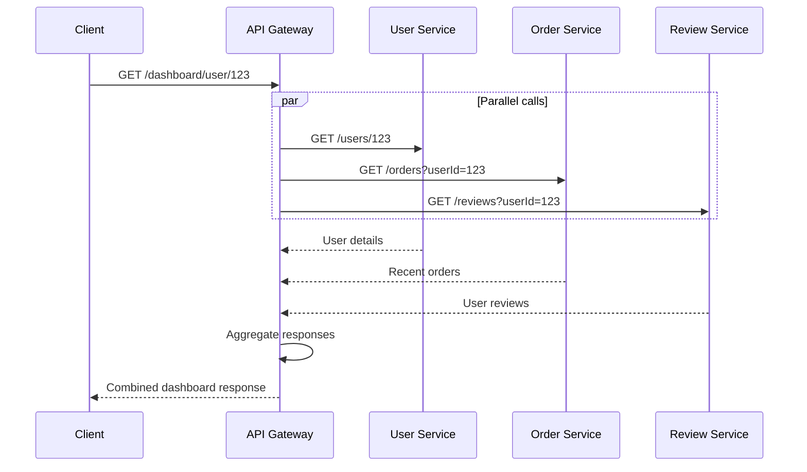
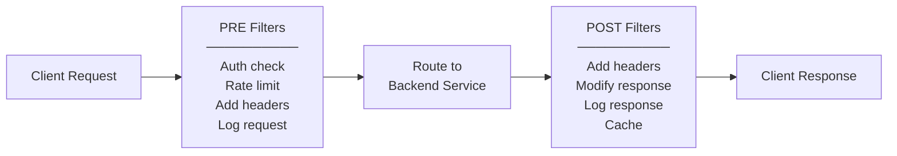
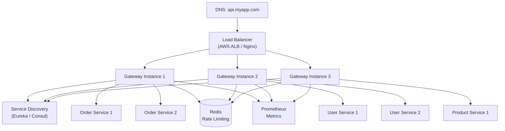

# API Gateway Pattern — Single Entry Point for Microservices

Routing, authentication, rate limiting, load balancing, and request
aggregation at the edge. Spring Cloud Gateway implementation.

---

## 1. Why API Gateway?

```text
WITHOUT API GATEWAY:
  Client must know EVERY service URL:
    Mobile App ──▶ http://order-service:8081/orders
                ──▶ http://payment-service:8082/payments
                ──▶ http://user-service:8083/users
                ──▶ http://inventory-service:8084/stock
                ──▶ http://notification-service:8085/notifications

  PROBLEMS:
    1. CLIENT COMPLEXITY — client tracks N service URLs
    2. NO SINGLE AUTH — each service implements its own auth
    3. CORS EVERYWHERE — each service handles CORS separately
    4. NO RATE LIMITING — no central throttling
    5. PROTOCOL MISMATCH — some services use gRPC, some REST
    6. NO AGGREGATION — client makes 5 calls for one page
    7. TIGHT COUPLING — client directly depends on service topology

WITH API GATEWAY:
  Client → Gateway → Services (one URL to rule them all)
    Mobile App ──▶ https://api.myapp.com/orders
                ──▶ https://api.myapp.com/payments
                ──▶ https://api.myapp.com/users

  Gateway handles: routing, auth, rate limiting, CORS, SSL, aggregation
```



---

## 2. Gateway Responsibilities — Deep Dive

```text
┌──────────────────────────────────────────────────────────────────────────┐
│                        API GATEWAY RESPONSIBILITIES                      │
├────────────────────┬─────────────────────────────────────────────────────┤
│ ROUTING            │ Map external URL to internal service               │
│                    │ /api/orders → order-service:8081/orders            │
│                    │ Path rewriting, header-based routing               │
├────────────────────┼─────────────────────────────────────────────────────┤
│ AUTHENTICATION     │ Validate JWT/OAuth2 token at the edge              │
│                    │ Reject unauthenticated requests BEFORE routing     │
│                    │ Pass user context (userId, roles) to services      │
├────────────────────┼─────────────────────────────────────────────────────┤
│ RATE LIMITING      │ Limit requests per client/IP/API key               │
│                    │ 100 req/min per user, 1000 req/min per API key     │
│                    │ Prevent abuse, protect downstream services         │
├────────────────────┼─────────────────────────────────────────────────────┤
│ LOAD BALANCING     │ Distribute requests across service instances       │
│                    │ Round-robin, least connections, weighted           │
│                    │ Integrates with service discovery (Eureka)         │
├────────────────────┼─────────────────────────────────────────────────────┤
│ CIRCUIT BREAKING   │ Stop routing to failing services                   │
│                    │ Return fallback response when service is down      │
│                    │ Resilience4j integration                           │
├────────────────────┼─────────────────────────────────────────────────────┤
│ SSL TERMINATION    │ Handle HTTPS at gateway, HTTP internally           │
│                    │ One cert to manage, simpler internal networking    │
├────────────────────┼─────────────────────────────────────────────────────┤
│ REQUEST TRANSFORM  │ Add/remove headers, rewrite paths                  │
│                    │ Add X-Request-Id for tracing                       │
│                    │ Convert protocols (REST ↔ gRPC)                    │
├────────────────────┼─────────────────────────────────────────────────────┤
│ RESPONSE CACHING   │ Cache GET responses (short TTL)                    │
│                    │ Reduce load on backend services                    │
├────────────────────┼─────────────────────────────────────────────────────┤
│ LOGGING/MONITORING │ Centralized access logs                            │
│                    │ Metrics (request count, latency, error rate)       │
│                    │ Distributed tracing correlation                    │
├────────────────────┼─────────────────────────────────────────────────────┤
│ API COMPOSITION    │ Aggregate data from multiple services              │
│                    │ One client call → gateway calls 3 services         │
│                    │ Reduces client round-trips                         │
└────────────────────┴─────────────────────────────────────────────────────┘
```

---

## 3. Gateway Architecture Patterns

### Pattern 1: Simple Reverse Proxy



```text
  Simplest form: just routing + auth.
  Each request maps to exactly one backend service.
  No aggregation, no transformation.
  Example: Nginx, Spring Cloud Gateway, Kong
```

### Pattern 2: Backend for Frontend (BFF)



```text
  BACKEND FOR FRONTEND (BFF):
    - One gateway per CLIENT TYPE
    - Web BFF returns rich HTML-friendly responses
    - Mobile BFF returns compact, bandwidth-efficient responses
    - IoT BFF returns minimal payloads

  WHY:
    Different clients have DIFFERENT needs:
    - Web: full product details + reviews + recommendations
    - Mobile: compact product card + thumbnail
    - IoT: just the price and availability

  WHEN TO USE:
    ✅ Multiple client types with different data needs
    ✅ Client teams can own their BFF
    ❌ Overkill if only one client type
    ❌ Code duplication across BFFs (shared logic in libraries)
```

### Pattern 3: API Composition Gateway



```text
  API COMPOSITION:
    Gateway aggregates data from multiple services into one response.
    Client makes ONE call instead of three.

  BENEFITS:
    ✅ Fewer round-trips (especially important for mobile)
    ✅ Simpler client code
    ✅ Gateway handles partial failures (return what's available)

  RISKS:
    ❌ Gateway becomes complex (business logic creep)
    ❌ Gateway latency = MAX(all backend calls)
    ❌ Error handling: what if one service fails?

  RULE: Keep aggregation SIMPLE in the gateway.
    Complex joins / transformations → use a dedicated BFF or GraphQL.
```

---

## 4. Spring Cloud Gateway — Implementation

### Dependencies

```xml
<dependency>
    <groupId>org.springframework.cloud</groupId>
    <artifactId>spring-cloud-starter-gateway</artifactId>
</dependency>
<dependency>
    <groupId>org.springframework.cloud</groupId>
    <artifactId>spring-cloud-starter-netflix-eureka-client</artifactId>
</dependency>
<dependency>
    <groupId>org.springframework.cloud</groupId>
    <artifactId>spring-cloud-starter-circuitbreaker-reactor-resilience4j</artifactId>
</dependency>
```

### Route Configuration (YAML)

```yaml
server:
  port: 8080

spring:
  application:
    name: api-gateway
  cloud:
    gateway:
      routes:
        # ── Order Service ──
        - id: order-service
          uri: lb://ORDER-SERVICE          # lb:// = load-balanced via Eureka
          predicates:
            - Path=/api/orders/**
          filters:
            - StripPrefix=1                # /api/orders/123 → /orders/123
            - name: CircuitBreaker
              args:
                name: orderServiceCB
                fallbackUri: forward:/fallback/orders
            - name: RequestRateLimiter
              args:
                redis-rate-limiter.replenishRate: 10
                redis-rate-limiter.burstCapacity: 20

        # ── User Service ──
        - id: user-service
          uri: lb://USER-SERVICE
          predicates:
            - Path=/api/users/**
          filters:
            - StripPrefix=1
            - AddRequestHeader=X-Gateway-Source, api-gateway

        # ── Product Service ──
        - id: product-service
          uri: lb://PRODUCT-SERVICE
          predicates:
            - Path=/api/products/**
            - Method=GET,POST,PUT,DELETE
          filters:
            - StripPrefix=1

        # ── Header-based routing ──
        - id: v2-order-service
          uri: lb://ORDER-SERVICE-V2
          predicates:
            - Path=/api/orders/**
            - Header=X-API-Version, v2
          filters:
            - StripPrefix=1

      default-filters:
        - name: Retry
          args:
            retries: 3
            statuses: BAD_GATEWAY,SERVICE_UNAVAILABLE
            methods: GET
            backoff:
              firstBackoff: 100ms
              maxBackoff: 500ms
              factor: 2

eureka:
  client:
    service-url:
      defaultZone: http://localhost:8761/eureka/
```

### Route Configuration (Java DSL)

```java
@Configuration
public class GatewayConfig {

    @Bean
    public RouteLocator customRoutes(RouteLocatorBuilder builder) {
        return builder.routes()
            .route("order-service", r -> r
                .path("/api/orders/**")
                .filters(f -> f
                    .stripPrefix(1)
                    .addRequestHeader("X-Request-Source", "gateway")
                    .circuitBreaker(cb -> cb
                        .setName("orderServiceCB")
                        .setFallbackUri("forward:/fallback/orders"))
                    .retry(retryConfig -> retryConfig
                        .setRetries(3)
                        .setStatuses(HttpStatus.SERVICE_UNAVAILABLE)))
                .uri("lb://ORDER-SERVICE"))

            .route("user-service", r -> r
                .path("/api/users/**")
                .and()
                .method(HttpMethod.GET)
                .filters(f -> f
                    .stripPrefix(1)
                    .addResponseHeader("X-Response-Time",
                        String.valueOf(System.currentTimeMillis())))
                .uri("lb://USER-SERVICE"))

            .build();
    }
}
```

---

## 5. Gateway Filters — Pre and Post



### Custom Pre-Filter: JWT Authentication

```java
@Component
@RequiredArgsConstructor
public class JwtAuthenticationFilter implements GlobalFilter, Ordered {

    private final JwtTokenProvider tokenProvider;

    private static final List<String> PUBLIC_PATHS = List.of(
        "/api/auth/login", "/api/auth/register", "/api/health"
    );

    @Override
    public Mono<Void> filter(ServerWebExchange exchange, GatewayFilterChain chain) {
        String path = exchange.getRequest().getURI().getPath();

        // Skip auth for public endpoints
        if (PUBLIC_PATHS.stream().anyMatch(path::startsWith)) {
            return chain.filter(exchange);
        }

        String authHeader = exchange.getRequest().getHeaders()
            .getFirst(HttpHeaders.AUTHORIZATION);

        if (authHeader == null || !authHeader.startsWith("Bearer ")) {
            exchange.getResponse().setStatusCode(HttpStatus.UNAUTHORIZED);
            return exchange.getResponse().setComplete();
        }

        String token = authHeader.substring(7);

        try {
            Claims claims = tokenProvider.validateAndGetClaims(token);

            // Pass user context to downstream services
            ServerHttpRequest modifiedRequest = exchange.getRequest().mutate()
                .header("X-User-Id", claims.getSubject())
                .header("X-User-Roles", claims.get("roles", String.class))
                .header("X-Correlation-Id", UUID.randomUUID().toString())
                .build();

            return chain.filter(exchange.mutate().request(modifiedRequest).build());

        } catch (JwtException e) {
            exchange.getResponse().setStatusCode(HttpStatus.UNAUTHORIZED);
            return exchange.getResponse().setComplete();
        }
    }

    @Override
    public int getOrder() {
        return -100;  // Run before other filters
    }
}
```

### Custom Pre-Filter: Request Logging

```java
@Component
@Slf4j
public class RequestLoggingFilter implements GlobalFilter, Ordered {

    @Override
    public Mono<Void> filter(ServerWebExchange exchange, GatewayFilterChain chain) {
        long startTime = System.currentTimeMillis();
        String requestId = UUID.randomUUID().toString();

        ServerHttpRequest request = exchange.getRequest().mutate()
            .header("X-Request-Id", requestId)
            .build();

        log.info("REQUEST  [{}] {} {} from {}",
            requestId,
            request.getMethod(),
            request.getURI().getPath(),
            request.getRemoteAddress());

        return chain.filter(exchange.mutate().request(request).build())
            .then(Mono.fromRunnable(() -> {
                long duration = System.currentTimeMillis() - startTime;
                log.info("RESPONSE [{}] {} {} → {} ({}ms)",
                    requestId,
                    request.getMethod(),
                    request.getURI().getPath(),
                    exchange.getResponse().getStatusCode(),
                    duration);
            }));
    }

    @Override
    public int getOrder() {
        return -200;  // Run first
    }
}
```

### Rate Limiting with Redis

```java
@Configuration
public class RateLimiterConfig {

    @Bean
    public KeyResolver userKeyResolver() {
        return exchange -> {
            String userId = exchange.getRequest().getHeaders().getFirst("X-User-Id");
            if (userId != null) {
                return Mono.just(userId);
            }
            // Fallback to IP address
            return Mono.just(
                exchange.getRequest().getRemoteAddress().getAddress().getHostAddress());
        };
    }

    @Bean
    public KeyResolver apiKeyResolver() {
        return exchange -> {
            String apiKey = exchange.getRequest().getHeaders().getFirst("X-API-Key");
            return Mono.just(apiKey != null ? apiKey : "anonymous");
        };
    }
}
```

```yaml
spring:
  cloud:
    gateway:
      routes:
        - id: order-service
          uri: lb://ORDER-SERVICE
          predicates:
            - Path=/api/orders/**
          filters:
            - name: RequestRateLimiter
              args:
                redis-rate-limiter.replenishRate: 50    # 50 req/sec sustained
                redis-rate-limiter.burstCapacity: 100   # burst up to 100
                redis-rate-limiter.requestedTokens: 1   # 1 token per request
                key-resolver: "#{@userKeyResolver}"
  data:
    redis:
      host: localhost
      port: 6379
```

---

## 6. Fallback Handling

```java
@RestController
@RequestMapping("/fallback")
@Slf4j
public class FallbackController {

    @GetMapping("/orders")
    public ResponseEntity<Map<String, Object>> ordersFallback() {
        log.warn("Order service is down — returning fallback response");
        return ResponseEntity.status(HttpStatus.SERVICE_UNAVAILABLE)
            .body(Map.of(
                "status", "SERVICE_UNAVAILABLE",
                "message", "Order service is temporarily unavailable",
                "timestamp", Instant.now(),
                "fallback", true
            ));
    }

    @GetMapping("/users")
    public ResponseEntity<Map<String, Object>> usersFallback() {
        return ResponseEntity.status(HttpStatus.SERVICE_UNAVAILABLE)
            .body(Map.of(
                "status", "SERVICE_UNAVAILABLE",
                "message", "User service is temporarily unavailable",
                "timestamp", Instant.now()
            ));
    }
}
```

---

## 7. Gateway Architecture — Production Setup



```text
PRODUCTION CHECKLIST:
  ✅ Multiple gateway instances behind a load balancer
  ✅ Service discovery (Eureka/Consul) for dynamic routing
  ✅ Redis for distributed rate limiting
  ✅ Circuit breakers on all routes
  ✅ Health check endpoints (/actuator/health)
  ✅ Centralized logging (ELK stack)
  ✅ Distributed tracing (Zipkin/Jaeger)
  ✅ Prometheus metrics (/actuator/prometheus)
  ✅ SSL/TLS termination at gateway or LB
  ✅ CORS configuration
  ✅ Request size limits
  ✅ Timeout configuration per route
```

---

## 8. CORS Configuration

```java
@Configuration
public class CorsConfig {

    @Bean
    public CorsWebFilter corsWebFilter() {
        CorsConfiguration corsConfig = new CorsConfiguration();
        corsConfig.setAllowedOrigins(List.of(
            "https://myapp.com", "https://admin.myapp.com"));
        corsConfig.setAllowedMethods(List.of("GET", "POST", "PUT", "DELETE", "OPTIONS"));
        corsConfig.setAllowedHeaders(List.of("*"));
        corsConfig.setExposedHeaders(List.of("X-Request-Id", "X-Total-Count"));
        corsConfig.setAllowCredentials(true);
        corsConfig.setMaxAge(3600L);

        UrlBasedCorsConfigurationSource source = new UrlBasedCorsConfigurationSource();
        source.registerCorsConfiguration("/**", corsConfig);

        return new CorsWebFilter(source);
    }
}
```

---

## 9. API Gateway Options Comparison

```text
┌─────────────────────┬───────────────┬────────────┬────────────┬─────────────┐
│ Feature             │ Spring Cloud  │ Kong       │ AWS API    │ Nginx       │
│                     │ Gateway       │            │ Gateway    │             │
├─────────────────────┼───────────────┼────────────┼────────────┼─────────────┤
│ Language            │ Java          │ Lua/Go     │ Managed    │ C           │
│ Reactive            │ ✅ Netty      │ ❌         │ N/A        │ ❌          │
│ Service Discovery   │ Eureka/Consul │ DNS        │ AWS native │ DNS/config  │
│ Rate Limiting       │ Redis-based   │ Built-in   │ Built-in   │ Module      │
│ Auth                │ Spring Sec    │ Plugins    │ Cognito    │ Module      │
│ Circuit Breaker     │ Resilience4j  │ Plugin     │ ❌         │ ❌          │
│ Custom Filters      │ Java code     │ Lua/Go     │ Lambda     │ Lua         │
│ WebSocket           │ ✅            │ ✅         │ ✅         │ ✅          │
│ gRPC                │ ✅            │ ✅         │ ❌ (REST)  │ ✅          │
│ Best for            │ Spring apps   │ Multi-lang │ AWS native │ High perf   │
│ Deployment          │ Self-managed  │ Self/Cloud │ Serverless │ Self-managed│
└─────────────────────┴───────────────┴────────────┴────────────┴─────────────┘
```

---

## 10. Interview Questions

### Q1: Why not let clients call microservices directly?

```text
PROBLEMS without a gateway:
  1. Client must know every service URL (tight coupling)
  2. No centralized auth (each service re-validates tokens)
  3. No rate limiting (abuse hits services directly)
  4. CORS headaches (configure on every service)
  5. No SSL termination point (certs on every service)
  6. No request aggregation (client makes N calls)
  7. Service topology leaks to clients
  8. Protocol mismatch (some services are gRPC)
  9. No centralized logging/monitoring at the edge

GATEWAY provides:
  Single entry point, auth, rate limiting, routing, SSL,
  load balancing, circuit breaking, logging — all in one place.
```

### Q2: How do you prevent the API Gateway from becoming a bottleneck?

```text
  1. SCALE HORIZONTALLY — multiple gateway instances behind LB
  2. NON-BLOCKING — Spring Cloud Gateway uses Netty (reactive)
     Don't use Zuul 1 (blocking, thread-per-request)
  3. KEEP GATEWAY THIN — only routing + cross-cutting concerns
     No business logic in the gateway!
  4. CACHE — cache frequent GET responses (Redis, in-memory)
  5. RATE LIMIT — protect gateway itself from overload
  6. CIRCUIT BREAK — don't wait for slow services
  7. TIMEOUT — short timeouts, fail fast
  8. CONNECTION POOL — tune connection pools to backend services
  9. MONITOR — alert on gateway latency/error rate spikes
```

### Q3: What's the difference between API Gateway and Load Balancer?

```text
  LOAD BALANCER (L4/L7):
    - Distributes traffic across instances of SAME service
    - Operates at TCP/HTTP level
    - No application logic (just round-robin, health checks)
    - Examples: Nginx, AWS ALB, HAProxy

  API GATEWAY (L7):
    - Routes to DIFFERENT services based on path/headers
    - Application-aware (understands REST, auth, rate limiting)
    - Cross-cutting concerns (auth, transform, aggregate)
    - Examples: Spring Cloud Gateway, Kong, AWS API Gateway

  IN PRACTICE — use BOTH:
    Client → Load Balancer → API Gateway instances → Backend Services
    LB distributes across gateway instances
    Gateway routes to different services
```

### Q4: BFF vs Single Gateway?

```text
  SINGLE GATEWAY:
    One gateway for all clients (web, mobile, IoT)
    ✅ Simple — one codebase, one deployment
    ❌ All clients get same response shape
    ❌ Gateway becomes complex with client-specific logic

  BFF (Backend for Frontend):
    One gateway per client type
    ✅ Optimized responses per client
    ✅ Client teams own their BFF
    ✅ Mobile BFF can strip unnecessary data
    ❌ Code duplication across BFFs
    ❌ More services to maintain

  DECISION:
    Start with single gateway.
    Split into BFF when client needs diverge significantly.
```

### Q5: How do you handle API versioning at the gateway?

```text
  OPTION 1 — URL Path:
    /api/v1/orders → ORDER-SERVICE-V1
    /api/v2/orders → ORDER-SERVICE-V2

  OPTION 2 — Header:
    X-API-Version: 2 → route to v2 service
    No header → default to latest stable version

  OPTION 3 — Query Param:
    /api/orders?version=2

  BEST PRACTICE:
    - Header-based for internal APIs
    - URL-based for public APIs (more discoverable)
    - Gateway routes based on version → different service instances
    - Or same service handles multiple versions internally
```
