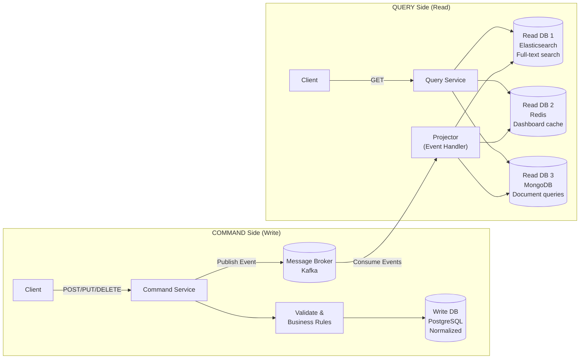
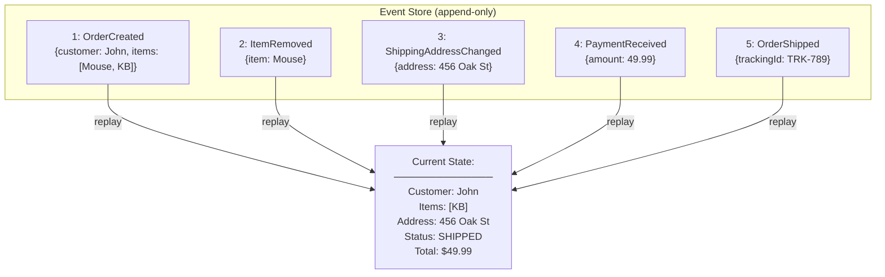
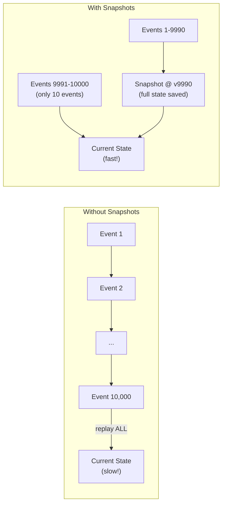
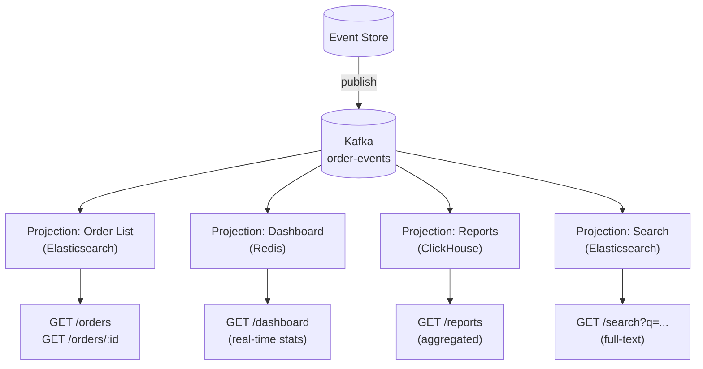

# CQRS & Event Sourcing — Separating Reads from Writes

Command Query Responsibility Segregation with Event Sourcing for audit
trails, temporal queries, and independently scalable read/write models.

---

## 1. The Problem — Why Separate Reads and Writes?

```text
TRADITIONAL CRUD:
  ┌──────────────────────────────────────────────────────┐
  │  REST API                                            │
  │  ├── GET  /orders      → SELECT * FROM orders JOIN.. │
  │  ├── GET  /orders/123  → SELECT .. WHERE id = 123    │
  │  ├── POST /orders      → INSERT INTO orders (..)     │
  │  ├── PUT  /orders/123  → UPDATE orders SET .. WHERE  │
  │  └── DELETE /orders/123 → DELETE FROM orders WHERE   │
  │                                                       │
  │  Same model, same DB, same schema for reads & writes │
  └──────────────────────────────────────────────────────┘

  PROBLEMS AT SCALE:
    1. READS dominate (90-99% of traffic) → DB overloaded
    2. Read queries need JOINs across 5+ tables → slow
    3. Write schema (normalized) ≠ read schema (denormalized)
    4. Can't scale reads independently from writes
    5. Complex reports block transactional writes (lock contention)
    6. Different storage needs: relational for writes, search for reads

CQRS SOLUTION:
  ┌──────────────┐              ┌──────────────┐
  │ WRITE SIDE   │              │ READ SIDE    │
  │ ──────────── │    events    │ ──────────── │
  │ Commands     │──────────────▶ Projections  │
  │ Normalized   │              │ Denormalized │
  │ Postgres     │              │ Elasticsearch│
  │ ACID         │              │ Fast queries │
  │ 1% traffic   │              │ 99% traffic  │
  └──────────────┘              └──────────────┘
```

---

## 2. CQRS Architecture



```text
CQRS CORE IDEA:
  COMMAND = "do something" (create, update, delete)
    → Validated, processed, stored in write-optimized DB
    → Publishes domain event

  QUERY = "get something" (read, search, report)
    → Served from read-optimized DB (denormalized, pre-joined)
    → No business logic, just data retrieval

  Events SYNC the two sides:
    Write DB changes → Event published → Read DB updated

  CONSISTENCY:
    ⚠️ EVENTUAL — read side may lag behind write side
    The lag is typically milliseconds to seconds
    Client writes → reads back immediately → might see stale data
```

---

## 3. CQRS Without Event Sourcing

```text
  You CAN use CQRS without Event Sourcing.
  This is the SIMPLER and MORE COMMON approach.

  Write Side: Normal JPA entities → PostgreSQL
  Read Side: Denormalized views → Elasticsearch / Redis
  Sync: Domain events via Kafka connect the two

  NO event store, NO replay — just separate read/write models.
```

### Spring Boot Implementation

```java
// ── COMMAND SIDE ──

// Command (value object)
public record CreateOrderCommand(
    UUID customerId,
    List<OrderItemDto> items,
    String shippingAddress
) {}

// Command Handler (Write Service)
@Service
@RequiredArgsConstructor
@Slf4j
public class OrderCommandService {

    private final OrderRepository orderRepo;
    private final KafkaTemplate<String, OrderEvent> kafkaTemplate;

    @Transactional
    public UUID createOrder(CreateOrderCommand cmd) {
        // Validate
        if (cmd.items().isEmpty()) {
            throw new InvalidOrderException("Order must have at least one item");
        }

        // Create aggregate
        Order order = Order.builder()
            .id(UUID.randomUUID())
            .customerId(cmd.customerId())
            .status(OrderStatus.CREATED)
            .items(mapItems(cmd.items()))
            .total(calculateTotal(cmd.items()))
            .shippingAddress(cmd.shippingAddress())
            .createdAt(Instant.now())
            .build();

        // Persist (write-optimized, normalized)
        orderRepo.save(order);

        // Publish event for read side
        kafkaTemplate.send("order-events", order.getId().toString(),
            new OrderCreatedEvent(
                order.getId(), order.getCustomerId(),
                order.getItems(), order.getTotal(),
                order.getShippingAddress(), order.getCreatedAt()
            ));

        return order.getId();
    }

    @Transactional
    public void updateOrderStatus(UUID orderId, OrderStatus newStatus) {
        Order order = orderRepo.findById(orderId)
            .orElseThrow(() -> new OrderNotFoundException(orderId));

        OrderStatus oldStatus = order.getStatus();
        order.setStatus(newStatus);
        order.setUpdatedAt(Instant.now());
        orderRepo.save(order);

        kafkaTemplate.send("order-events", orderId.toString(),
            new OrderStatusChangedEvent(orderId, oldStatus, newStatus, Instant.now()));
    }
}

// ── QUERY SIDE ──

// Read Model (denormalized document)
@Document(indexName = "orders")
@Getter @Setter
public class OrderReadModel {
    @Id
    private String orderId;
    private String customerId;
    private String customerName;     // denormalized from User service
    private String customerEmail;    // denormalized from User service
    private String status;
    private List<OrderItemView> items;
    private BigDecimal total;
    private String shippingAddress;
    private Instant createdAt;
    private Instant updatedAt;
}

// Projector (builds read model from events)
@Service
@RequiredArgsConstructor
@Slf4j
public class OrderProjector {

    private final OrderReadModelRepository readRepo;
    private final UserServiceClient userClient;

    @KafkaListener(topics = "order-events", groupId = "order-projector")
    public void project(OrderEvent event) {
        switch (event) {
            case OrderCreatedEvent e -> handleOrderCreated(e);
            case OrderStatusChangedEvent e -> handleStatusChanged(e);
            default -> log.warn("Unknown event type: {}", event.getClass());
        }
    }

    private void handleOrderCreated(OrderCreatedEvent e) {
        // Enrich with user data (denormalize)
        UserDto user = userClient.getUser(e.customerId());

        OrderReadModel model = new OrderReadModel();
        model.setOrderId(e.orderId().toString());
        model.setCustomerId(e.customerId().toString());
        model.setCustomerName(user.name());
        model.setCustomerEmail(user.email());
        model.setStatus("CREATED");
        model.setItems(mapToView(e.items()));
        model.setTotal(e.total());
        model.setShippingAddress(e.shippingAddress());
        model.setCreatedAt(e.createdAt());

        readRepo.save(model);
        log.info("Projected OrderCreated → read model for {}", e.orderId());
    }

    private void handleStatusChanged(OrderStatusChangedEvent e) {
        readRepo.findById(e.orderId().toString()).ifPresent(model -> {
            model.setStatus(e.newStatus().name());
            model.setUpdatedAt(e.timestamp());
            readRepo.save(model);
        });
    }
}

// Query Service (reads from Elasticsearch)
@RestController
@RequestMapping("/api/orders")
@RequiredArgsConstructor
public class OrderQueryController {

    private final OrderReadModelRepository readRepo;
    private final ElasticsearchOperations esOps;

    @GetMapping("/{orderId}")
    public OrderReadModel getOrder(@PathVariable String orderId) {
        return readRepo.findById(orderId)
            .orElseThrow(() -> new OrderNotFoundException(orderId));
    }

    @GetMapping("/search")
    public List<OrderReadModel> search(
            @RequestParam(required = false) String status,
            @RequestParam(required = false) String customerName,
            @RequestParam(required = false) BigDecimal minTotal) {

        // Fast query on denormalized Elasticsearch index — no JOINs
        var criteria = new Criteria();
        if (status != null) criteria = criteria.and("status").is(status);
        if (customerName != null) criteria = criteria.and("customerName").contains(customerName);
        if (minTotal != null) criteria = criteria.and("total").greaterThan(minTotal);

        var query = new CriteriaQuery(criteria);
        return esOps.search(query, OrderReadModel.class)
            .getSearchHits().stream()
            .map(SearchHit::getContent)
            .toList();
    }

    @GetMapping("/customer/{customerId}")
    public List<OrderReadModel> getByCustomer(@PathVariable String customerId) {
        return readRepo.findByCustomerIdOrderByCreatedAtDesc(customerId);
    }
}
```

---

## 4. Event Sourcing — Events as Source of Truth

```text
TRADITIONAL (State-Based):
  orders table: { id: 123, status: SHIPPED, total: 99.99, items: [...] }
  Each UPDATE overwrites previous state. History is LOST.

  What was the order total BEFORE the discount was applied?
  When did the status change from PENDING to PAID?
  Who changed the shipping address?
  → UNKNOWN. State was overwritten.

EVENT SOURCING:
  Don't store current state. Store every STATE CHANGE as an event.
  Current state = fold(all events from the beginning)
```



```text
EVENT SOURCING GUARANTEES:
  ✅ Complete audit trail — every change is recorded
  ✅ Time travel — reconstruct state at ANY point in time
  ✅ Debug by replay — reproduce any bug by replaying events
  ✅ Multiple projections — same events build different views
  ✅ No data loss — events are immutable, append-only

EVENT SOURCING CHALLENGES:
  ❌ Complexity — projections, snapshots, versioning
  ❌ Querying — can't SELECT directly, need projections
  ❌ Schema evolution — changing event format is HARD
  ❌ Performance — long event streams need snapshots
  ❌ Learning curve — very different mental model
```

### Spring Boot Event Sourcing Implementation

```java
// ── DOMAIN EVENTS ──

public sealed interface OrderEvent {
    UUID orderId();
    Instant timestamp();
    int version();
}

public record OrderCreated(UUID orderId, UUID customerId,
    List<OrderItem> items, BigDecimal total,
    Instant timestamp, int version) implements OrderEvent {}

public record ItemAdded(UUID orderId, OrderItem item,
    Instant timestamp, int version) implements OrderEvent {}

public record ItemRemoved(UUID orderId, String productId,
    Instant timestamp, int version) implements OrderEvent {}

public record OrderPaid(UUID orderId, BigDecimal amount,
    String paymentRef, Instant timestamp, int version) implements OrderEvent {}

public record OrderShipped(UUID orderId, String trackingId,
    Instant timestamp, int version) implements OrderEvent {}

// ── EVENT STORE ──

@Entity
@Table(name = "event_store")
public class StoredEvent {
    @Id @GeneratedValue(strategy = GenerationType.IDENTITY)
    private Long sequenceNumber;

    @Column(nullable = false)
    private UUID aggregateId;

    @Column(nullable = false)
    private String aggregateType;

    @Column(nullable = false)
    private String eventType;

    @Column(nullable = false)
    private int version;

    @Column(columnDefinition = "JSONB", nullable = false)
    private String payload;

    @Column(nullable = false)
    private Instant timestamp;
}

@Repository
public interface EventStoreRepository extends JpaRepository<StoredEvent, Long> {

    @Query("SELECT e FROM StoredEvent e WHERE e.aggregateId = :id " +
           "AND e.aggregateType = :type ORDER BY e.version ASC")
    List<StoredEvent> findByAggregate(
        @Param("id") UUID aggregateId,
        @Param("type") String aggregateType);

    @Query("SELECT e FROM StoredEvent e WHERE e.aggregateId = :id " +
           "AND e.aggregateType = :type AND e.version > :fromVersion " +
           "ORDER BY e.version ASC")
    List<StoredEvent> findByAggregateFromVersion(
        @Param("id") UUID aggregateId,
        @Param("type") String aggregateType,
        @Param("fromVersion") int fromVersion);
}

// ── AGGREGATE (applies events to build state) ──

public class OrderAggregate {
    private UUID orderId;
    private UUID customerId;
    private List<OrderItem> items = new ArrayList<>();
    private BigDecimal total = BigDecimal.ZERO;
    private OrderStatus status;
    private int version = 0;

    private final List<OrderEvent> uncommittedEvents = new ArrayList<>();

    // ── COMMAND HANDLERS (validate + produce events) ──

    public static OrderAggregate create(UUID customerId, List<OrderItem> items) {
        OrderAggregate order = new OrderAggregate();
        BigDecimal total = items.stream()
            .map(i -> i.price().multiply(BigDecimal.valueOf(i.quantity())))
            .reduce(BigDecimal.ZERO, BigDecimal::add);

        order.apply(new OrderCreated(
            UUID.randomUUID(), customerId, items, total,
            Instant.now(), order.version + 1));
        return order;
    }

    public void addItem(OrderItem item) {
        if (status != OrderStatus.CREATED) {
            throw new IllegalStateException("Cannot add items to " + status + " order");
        }
        apply(new ItemAdded(orderId, item, Instant.now(), version + 1));
    }

    public void markPaid(BigDecimal amount, String paymentRef) {
        if (status != OrderStatus.CREATED) {
            throw new IllegalStateException("Cannot pay for " + status + " order");
        }
        if (amount.compareTo(total) < 0) {
            throw new IllegalArgumentException("Insufficient payment amount");
        }
        apply(new OrderPaid(orderId, amount, paymentRef, Instant.now(), version + 1));
    }

    // ── EVENT HANDLERS (mutate state) ──

    private void apply(OrderEvent event) {
        mutate(event);
        uncommittedEvents.add(event);
    }

    public void mutate(OrderEvent event) {
        switch (event) {
            case OrderCreated e -> {
                this.orderId = e.orderId();
                this.customerId = e.customerId();
                this.items = new ArrayList<>(e.items());
                this.total = e.total();
                this.status = OrderStatus.CREATED;
            }
            case ItemAdded e -> {
                this.items.add(e.item());
                this.total = this.total.add(
                    e.item().price().multiply(BigDecimal.valueOf(e.item().quantity())));
            }
            case ItemRemoved e -> {
                this.items.removeIf(i -> i.productId().equals(e.productId()));
                recalculateTotal();
            }
            case OrderPaid e -> {
                this.status = OrderStatus.PAID;
            }
            case OrderShipped e -> {
                this.status = OrderStatus.SHIPPED;
            }
        }
        this.version = event.version();
    }

    // ── RECONSTITUTION (rebuild from event history) ──

    public static OrderAggregate fromEvents(List<OrderEvent> events) {
        OrderAggregate order = new OrderAggregate();
        events.forEach(order::mutate);
        return order;
    }

    public List<OrderEvent> getUncommittedEvents() {
        return Collections.unmodifiableList(uncommittedEvents);
    }

    public void clearUncommittedEvents() {
        uncommittedEvents.clear();
    }
}

// ── EVENT STORE SERVICE ──

@Service
@RequiredArgsConstructor
public class EventStore {

    private final EventStoreRepository repository;
    private final ObjectMapper objectMapper;
    private final KafkaTemplate<String, String> kafkaTemplate;

    @Transactional
    public void saveEvents(String aggregateType, UUID aggregateId,
                           List<OrderEvent> events, int expectedVersion) {
        // Optimistic concurrency check
        List<StoredEvent> existing = repository.findByAggregate(aggregateId, aggregateType);
        int currentVersion = existing.isEmpty() ? 0 :
            existing.getLast().getVersion();

        if (currentVersion != expectedVersion) {
            throw new ConcurrencyException(
                "Expected version " + expectedVersion + " but found " + currentVersion);
        }

        for (OrderEvent event : events) {
            StoredEvent stored = new StoredEvent();
            stored.setAggregateId(aggregateId);
            stored.setAggregateType(aggregateType);
            stored.setEventType(event.getClass().getSimpleName());
            stored.setVersion(event.version());
            stored.setPayload(toJson(event));
            stored.setTimestamp(event.timestamp());
            repository.save(stored);

            // Publish for projections
            kafkaTemplate.send("order-events", aggregateId.toString(), toJson(event));
        }
    }

    public List<OrderEvent> loadEvents(String aggregateType, UUID aggregateId) {
        return repository.findByAggregate(aggregateId, aggregateType)
            .stream()
            .map(this::deserialize)
            .toList();
    }

    public OrderAggregate loadAggregate(UUID orderId) {
        List<OrderEvent> events = loadEvents("Order", orderId);
        if (events.isEmpty()) {
            throw new AggregateNotFoundException("Order", orderId);
        }
        return OrderAggregate.fromEvents(events);
    }
}

// ── APPLICATION SERVICE ──

@Service
@RequiredArgsConstructor
public class OrderApplicationService {

    private final EventStore eventStore;

    @Transactional
    public UUID createOrder(CreateOrderCommand cmd) {
        OrderAggregate order = OrderAggregate.create(cmd.customerId(), cmd.items());
        eventStore.saveEvents("Order", order.getOrderId(),
            order.getUncommittedEvents(), 0);
        order.clearUncommittedEvents();
        return order.getOrderId();
    }

    @Transactional
    public void addItem(UUID orderId, OrderItem item) {
        OrderAggregate order = eventStore.loadAggregate(orderId);
        int expectedVersion = order.getVersion();
        order.addItem(item);
        eventStore.saveEvents("Order", orderId,
            order.getUncommittedEvents(), expectedVersion);
    }

    @Transactional
    public void markPaid(UUID orderId, BigDecimal amount, String paymentRef) {
        OrderAggregate order = eventStore.loadAggregate(orderId);
        int expectedVersion = order.getVersion();
        order.markPaid(amount, paymentRef);
        eventStore.saveEvents("Order", orderId,
            order.getUncommittedEvents(), expectedVersion);
    }
}
```

---

## 5. Snapshots — Performance Optimization



```java
@Entity
@Table(name = "snapshots")
public class Snapshot {
    @Id
    private UUID aggregateId;
    private String aggregateType;
    private int version;

    @Column(columnDefinition = "JSONB")
    private String state;      // serialized aggregate state

    private Instant createdAt;
}

@Service
@RequiredArgsConstructor
public class SnapshotStore {

    private final SnapshotRepository snapshotRepo;
    private final EventStoreRepository eventRepo;
    private static final int SNAPSHOT_INTERVAL = 100;

    public OrderAggregate loadWithSnapshot(UUID orderId) {
        // 1. Load latest snapshot
        Optional<Snapshot> snapshot = snapshotRepo.findById(orderId);

        OrderAggregate aggregate;
        int fromVersion;

        if (snapshot.isPresent()) {
            // Restore from snapshot
            aggregate = deserialize(snapshot.get().getState());
            fromVersion = snapshot.get().getVersion();
        } else {
            aggregate = new OrderAggregate();
            fromVersion = 0;
        }

        // 2. Replay only events AFTER snapshot
        List<StoredEvent> recentEvents = eventRepo
            .findByAggregateFromVersion(orderId, "Order", fromVersion);

        recentEvents.stream()
            .map(this::deserialize)
            .forEach(aggregate::mutate);

        // 3. Take new snapshot if needed
        if (aggregate.getVersion() - fromVersion >= SNAPSHOT_INTERVAL) {
            saveSnapshot(orderId, aggregate);
        }

        return aggregate;
    }

    private void saveSnapshot(UUID aggregateId, OrderAggregate aggregate) {
        Snapshot snap = new Snapshot();
        snap.setAggregateId(aggregateId);
        snap.setAggregateType("Order");
        snap.setVersion(aggregate.getVersion());
        snap.setState(serialize(aggregate));
        snap.setCreatedAt(Instant.now());
        snapshotRepo.save(snap);
    }
}
```

---

## 6. Multiple Projections from Same Events



```java
// Projection 1: Order details (Elasticsearch)
@Service
@KafkaListener(topics = "order-events", groupId = "order-detail-projector")
public class OrderDetailProjector {
    @Autowired private ElasticsearchOperations esOps;

    @KafkaHandler
    public void on(OrderCreated event) {
        OrderDetailView view = new OrderDetailView(
            event.orderId(), event.customerId(), event.items(),
            event.total(), "CREATED", event.timestamp());
        esOps.save(view);
    }

    @KafkaHandler
    public void on(OrderShipped event) {
        // Update existing document
        UpdateQuery query = UpdateQuery.builder(event.orderId().toString())
            .withScript("ctx._source.status = 'SHIPPED';" +
                         "ctx._source.trackingId = '" + event.trackingId() + "'")
            .build();
        esOps.update(query, IndexCoordinates.of("orders"));
    }
}

// Projection 2: Dashboard stats (Redis)
@Service
@KafkaListener(topics = "order-events", groupId = "dashboard-projector")
public class DashboardProjector {
    @Autowired private RedisTemplate<String, String> redis;

    @KafkaHandler
    public void on(OrderCreated event) {
        redis.opsForValue().increment("stats:orders:total");
        redis.opsForValue().increment("stats:orders:today:" + today());
        redis.opsForHash().increment("stats:revenue", today(),
            event.total().doubleValue());
    }

    @KafkaHandler
    public void on(OrderShipped event) {
        redis.opsForValue().increment("stats:orders:shipped:today:" + today());
    }
}

// Projection 3: Reporting (ClickHouse / OLAP)
@Service
@KafkaListener(topics = "order-events", groupId = "reporting-projector")
public class ReportingProjector {
    @Autowired private JdbcTemplate clickhouse;

    @KafkaHandler
    public void on(OrderCreated event) {
        clickhouse.update(
            "INSERT INTO order_facts (order_id, customer_id, total, status, " +
            "created_date, created_hour) VALUES (?, ?, ?, ?, ?, ?)",
            event.orderId(), event.customerId(), event.total(),
            "CREATED", event.timestamp().atZone(ZoneId.of("UTC")).toLocalDate(),
            event.timestamp().atZone(ZoneId.of("UTC")).getHour());
    }
}
```

---

## 7. Handling Eventual Consistency

```text
THE #1 CHALLENGE WITH CQRS:

  Client POSTs order → Write DB updated → Event published → Read DB updated
                   ↑                                              ↑
                 instant                               milliseconds-seconds later

  Client POSTs order, then immediately GETs orders list:
    → Read model not updated yet → order NOT in the list!
    → "I just created an order, where is it?!"

SOLUTIONS:

  1. READ YOUR OWN WRITES:
     After write → return the created entity directly from write response
     Client uses the response data, not a subsequent GET
     POST /orders → 201 { orderId: 123, status: CREATED, ... }

  2. WRITE-THROUGH TO READ CACHE:
     Update write DB + read cache in same flow (before returning)
     Not true CQRS but solves the UX problem

  3. POLLING / WEBSOCKET:
     Client subscribes to updates via WebSocket
     Read model updated → push notification to client
     UI shows "Processing..." then updates when ready

  4. VERSIONED READS:
     POST returns a version number
     GET includes "If-Version-At-Least: 5"
     Query service waits until projection catches up to version 5

  5. ACCEPT IT:
     Most dashboards / list views tolerate ~1s delay
     Only the "just created" view needs immediate consistency
     Return the write response for that one case
```

---

## 8. CQRS + Event Sourcing Decision Matrix

```text
┌─────────────────────────────────────────────────────────────────────┐
│                    WHEN TO USE WHAT                                  │
├─────────────────────┬───────────────────────────────────────────────┤
│ Simple CRUD app     │ Neither. Standard JPA + REST is fine.         │
│                     │ Don't add complexity you don't need.          │
├─────────────────────┼───────────────────────────────────────────────┤
│ Read-heavy app      │ CQRS only (no Event Sourcing).               │
│ (dashboard, search) │ Separate read model in Elasticsearch/Redis.  │
│                     │ Sync via domain events.                       │
├─────────────────────┼───────────────────────────────────────────────┤
│ Audit trail needed  │ Event Sourcing (+ CQRS for querying).        │
│ (finance, legal)    │ Events = audit log. Projections = queries.   │
├─────────────────────┼───────────────────────────────────────────────┤
│ Complex domain      │ Event Sourcing + CQRS.                       │
│ (trading, gaming)   │ Domain events capture rich business logic.   │
│                     │ Multiple projections for different views.     │
├─────────────────────┼───────────────────────────────────────────────┤
│ Multi-model queries │ CQRS with multiple read databases.           │
│ (search + reports)  │ Elasticsearch for search, ClickHouse for BI. │
│                     │ Same events, different projections.           │
└─────────────────────┴───────────────────────────────────────────────┘
```

---

## 9. Interview Questions

### Q1: What is CQRS and when would you use it?

```text
CQRS = separate the write model (commands) from the read model (queries).

USE WHEN:
  - Reads vastly outnumber writes (10:1 or more)
  - Read queries need different schema than write schema
  - Need to scale reads independently
  - Complex search/filter/aggregation queries
  - Different storage tech for reads (Elasticsearch, Redis)

DON'T USE WHEN:
  - Simple CRUD application
  - Strong consistency required (can't tolerate eventual)
  - Small team / small scale
```

### Q2: How do you handle the delay between write and read in CQRS?

```text
  1. Return the write result directly (read-your-own-writes)
  2. Optimistic UI (show the change immediately, reconcile later)
  3. WebSocket push when projection is updated
  4. Versioned reads (wait for projection to catch up)
  5. Most use cases tolerate sub-second delay — just accept it
```

### Q3: Event Sourcing — how do you handle schema evolution?

```text
  Events are IMMUTABLE — you can't change old events.
  But event schemas WILL change over time.

  STRATEGIES:
  1. UPCASTING: Transform old events to new format on read
     v1: { total: 100 }
     v2: { total: 100, currency: "USD" }
     Upcaster: if no currency → add "USD" as default

  2. VERSIONED EVENTS: Include version in event type
     OrderCreatedV1, OrderCreatedV2
     Aggregate handles both versions

  3. WEAK SCHEMA: Use JSON (flexible) not Avro (strict)
     Add fields → backward compatible
     Remove fields → ignore unknown fields on read

  4. EVENT MIGRATION: Rewrite event store (rare, risky)
     Read old events → transform → write to new store
     Last resort — breaks immutability principle
```

### Q4: What are snapshots and when do you need them?

```text
  Without snapshots: load aggregate = replay ALL events from beginning
    Order with 10,000 events → replay 10,000 events → slow

  Snapshot = serialized aggregate state at a point in time
    Save snapshot every N events (e.g., every 100)
    Load = restore snapshot + replay events AFTER snapshot
    10,000 events → snapshot at 9,900 + replay 100 events → fast

  WHEN:
    ✅ Aggregates with many events (>100)
    ✅ Performance-sensitive load times
    ❌ Not needed for short-lived aggregates
    ❌ Adds complexity (snapshot storage, invalidation)
```

### Q5: Can you use CQRS without Event Sourcing?

```text
  YES — this is the MORE COMMON approach.

  CQRS without ES:
    Write side: normal JPA entities, PostgreSQL
    Read side: denormalized views, Elasticsearch
    Sync: domain events via Kafka

  CQRS with ES:
    Write side: event store (append-only log)
    Read side: projections built from events

  Most teams start with CQRS-only.
  Add Event Sourcing only if audit trail / replay is required.
```
