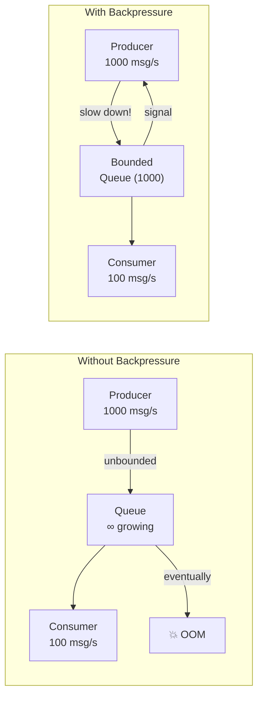
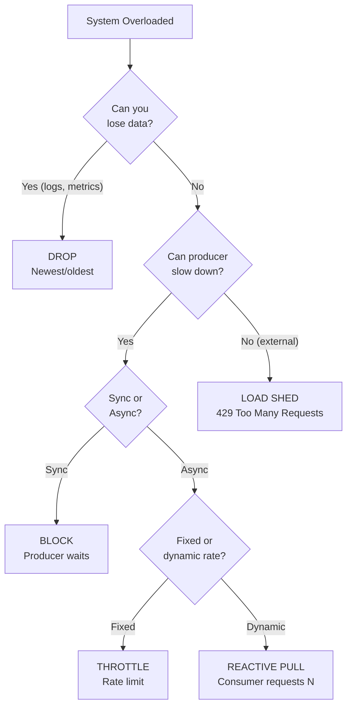
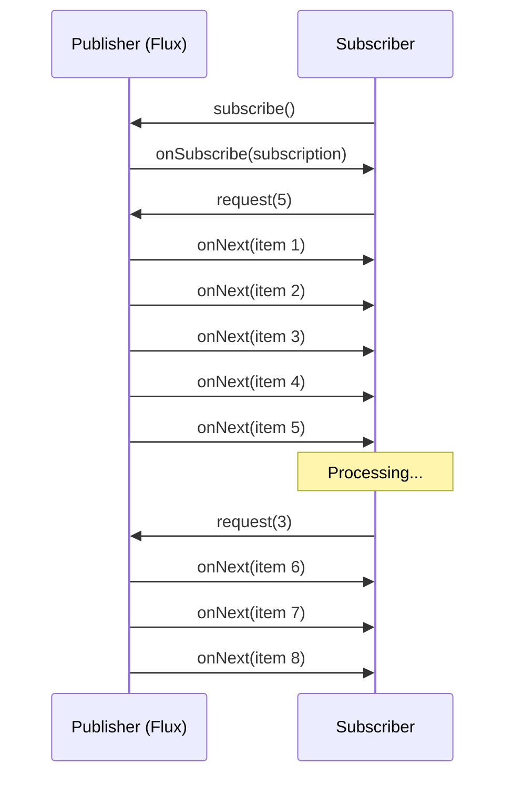
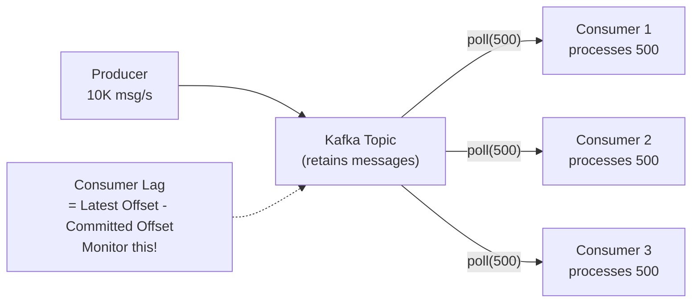
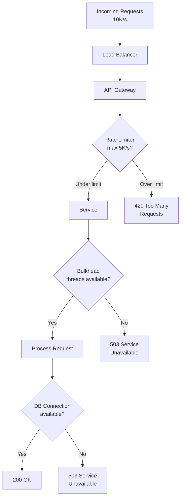
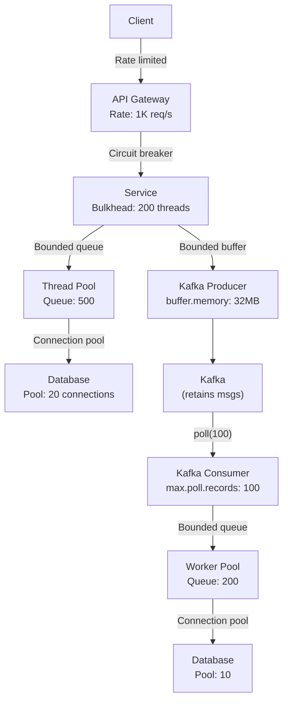

# Backpressure Pattern — Protecting Systems from Overload

Flow control mechanisms to prevent fast producers from overwhelming slow
consumers. Reactive streams, rate limiting, and load shedding in Spring Boot.

---

## 1. The Problem — Why Backpressure?

```text
WITHOUT BACKPRESSURE:

  Producer (1000 msg/s) ──▶ Consumer (100 msg/s)

  What happens:
    Second 1:  900 messages queued
    Second 2:  1800 messages queued
    Second 10: 9000 messages queued
    ...
    Eventually: OutOfMemoryError / Disk full / System crash

  REAL-WORLD EXAMPLES:
    - HTTP client sends 10K requests → server can handle 1K/s
    - Kafka producer writes 1M msg/s → consumer processes 100K/s
    - Database receives 5K queries/s → connection pool has 50 connections
    - Upstream service returns results faster than downstream can persist

  SYMPTOMS OF MISSING BACKPRESSURE:
    1. MEMORY EXPLOSION — unbounded queues grow until OOM
    2. LATENCY SPIKES — queued messages wait longer and longer
    3. CASCADING FAILURE — overloaded service fails → upstream fails
    4. DATA LOSS — messages dropped when buffers overflow
    5. THREAD EXHAUSTION — all threads blocked waiting
```



---

## 2. Backpressure Strategies

```text
┌──────────────────────┬───────────────────────────────────────────────┐
│ Strategy             │ Description                                   │
├──────────────────────┼───────────────────────────────────────────────┤
│ 1. BUFFERING         │ Queue messages (bounded buffer)               │
│                      │ When buffer full → apply another strategy     │
├──────────────────────┼───────────────────────────────────────────────┤
│ 2. DROPPING          │ Drop newest or oldest messages                │
│                      │ Accept data loss (metrics, logs)              │
├──────────────────────┼───────────────────────────────────────────────┤
│ 3. BLOCKING          │ Producer blocks until consumer catches up     │
│                      │ Synchronous backpressure (thread waits)       │
├──────────────────────┼───────────────────────────────────────────────┤
│ 4. THROTTLING        │ Limit producer rate to match consumer         │
│                      │ Rate limiting (token bucket, sliding window)  │
├──────────────────────┼───────────────────────────────────────────────┤
│ 5. LOAD SHEDDING     │ Reject requests when overloaded               │
│                      │ Return 429/503 (try again later)              │
├──────────────────────┼───────────────────────────────────────────────┤
│ 6. SCALING           │ Auto-scale consumers to match load            │
│                      │ Horizontal scaling, more Kafka partitions     │
├──────────────────────┼───────────────────────────────────────────────┤
│ 7. REACTIVE PULL     │ Consumer requests N items at a time           │
│                      │ Reactive Streams (Project Reactor, RxJava)    │
└──────────────────────┴───────────────────────────────────────────────┘
```



---

## 3. Reactive Streams Backpressure (Project Reactor)

```text
REACTIVE STREAMS SPEC (java.util.concurrent.Flow):
  Publisher → produces items
  Subscriber → consumes items
  Subscription → subscriber requests N items (backpressure signal)

  FLOW:
    1. Subscriber subscribes to Publisher
    2. Publisher sends onSubscribe(subscription)
    3. Subscriber calls subscription.request(10)  ← "give me 10 items"
    4. Publisher sends 10 items via onNext()
    5. Subscriber processes, then requests more
    6. If subscriber is slow → doesn't request → publisher waits

  KEY INSIGHT:
    Consumer PULLS data at its own pace.
    Producer doesn't push faster than consumer can handle.
```



### Spring WebFlux Backpressure

```java
// ── Reactive Controller with backpressure ──
@RestController
@RequestMapping("/api/events")
public class EventStreamController {

    @GetMapping(produces = MediaType.TEXT_EVENT_STREAM_VALUE)
    public Flux<ServerSentEvent<OrderEvent>> streamEvents() {
        return orderEventFlux
            .onBackpressureBuffer(1000)    // buffer up to 1000
            .onBackpressureDrop(event ->   // if buffer full → drop
                log.warn("Dropping event due to backpressure: {}", event))
            .map(event -> ServerSentEvent.<OrderEvent>builder()
                .id(event.id().toString())
                .event(event.type())
                .data(event)
                .build());
    }
}

// ── Backpressure strategies in Reactor ──
@Service
public class BackpressureExamples {

    // Strategy 1: BUFFER — queue items when consumer is slow
    public Flux<Data> buffered(Flux<Data> source) {
        return source
            .onBackpressureBuffer(
                1000,                                    // max buffer size
                dropped -> log.warn("Buffer full, dropped: {}", dropped),
                BufferOverflowStrategy.DROP_OLDEST        // drop oldest when full
            );
    }

    // Strategy 2: DROP — drop items consumer can't keep up with
    public Flux<Data> dropped(Flux<Data> source) {
        return source
            .onBackpressureDrop(item ->
                log.warn("Dropped due to backpressure: {}", item));
    }

    // Strategy 3: LATEST — keep only the latest item
    public Flux<Data> latest(Flux<Data> source) {
        return source
            .onBackpressureLatest();  // consumer always gets the most recent
    }

    // Strategy 4: ERROR — signal error when overwhelmed
    public Flux<Data> errored(Flux<Data> source) {
        return source
            .onBackpressureError();  // throws OverflowException
    }

    // Strategy 5: RATE LIMIT — limit emission rate
    public Flux<Data> rateLimited(Flux<Data> source) {
        return source
            .limitRate(100);  // request 100 at a time from upstream
    }

    // Strategy 6: SAMPLE — emit only the latest per time window
    public Flux<Data> sampled(Flux<Data> source) {
        return source
            .sample(Duration.ofMillis(100));  // 1 item per 100ms max
    }
}
```

---

## 4. Kafka Consumer Backpressure

```text
KAFKA'S BUILT-IN BACKPRESSURE:

  Kafka uses a PULL model — consumers poll for messages.
  If consumer is slow → it just polls less frequently.
  Messages are retained on Kafka → no data loss.
  The "backpressure signal" is consumer lag.

  CONSUMER LAG = latest offset - consumer's committed offset
  If lag grows → consumer is falling behind → need action.

  CONTROLS:
    max.poll.records = 500          max messages per poll()
    max.poll.interval.ms = 300000   max time between polls
    fetch.max.bytes = 52428800      max data per fetch
```



```java
@Service
@Slf4j
public class BackpressuredKafkaConsumer {

    // ── Approach 1: Control poll batch size ──
    @KafkaListener(
        topics = "high-volume-events",
        groupId = "processor",
        properties = {
            "max.poll.records=100",           // process 100 at a time
            "max.poll.interval.ms=60000",     // 60s max processing time
            "fetch.min.bytes=1",
            "fetch.max.wait.ms=500"
        }
    )
    public void consume(List<ConsumerRecord<String, Event>> records,
                        Acknowledgment ack) {
        log.info("Processing batch of {} records", records.size());
        for (ConsumerRecord<String, Event> record : records) {
            processEvent(record.value());
        }
        ack.acknowledge();  // commit offset after full batch processed
    }

    // ── Approach 2: Pause/Resume based on downstream pressure ──
    @Autowired
    private KafkaListenerEndpointRegistry registry;

    @Scheduled(fixedDelay = 5000)
    public void checkBackpressure() {
        int pendingTasks = taskExecutor.getQueueSize();

        MessageListenerContainer container =
            registry.getListenerContainer("myListener");

        if (pendingTasks > 1000 && !container.isContainerPaused()) {
            log.warn("Backpressure: pausing consumer (pending: {})", pendingTasks);
            container.pause();
        } else if (pendingTasks < 100 && container.isContainerPaused()) {
            log.info("Backpressure relieved: resuming consumer");
            container.resume();
        }
    }
}
```

### Kafka Consumer Pause/Resume Pattern

```java
@Component
@RequiredArgsConstructor
@Slf4j
public class AdaptiveKafkaConsumer implements ConsumerSeekAware {

    private final SlowDownstreamService downstream;
    private final MeterRegistry meterRegistry;

    @KafkaListener(
        id = "adaptiveConsumer",
        topics = "events",
        containerFactory = "batchListenerFactory"
    )
    public void consume(List<ConsumerRecord<String, Event>> records,
                        Consumer<?, ?> consumer) {
        // Check if downstream can handle more
        if (downstream.isOverloaded()) {
            log.warn("Downstream overloaded — pausing partitions");
            consumer.pause(consumer.assignment());

            // Schedule resume check
            Executors.newSingleThreadScheduledExecutor()
                .schedule(() -> {
                    if (!downstream.isOverloaded()) {
                        consumer.resume(consumer.assignment());
                        log.info("Downstream recovered — resuming");
                    }
                }, 5, TimeUnit.SECONDS);
            return;
        }

        // Process records
        for (var record : records) {
            try {
                downstream.process(record.value());
                meterRegistry.counter("events.processed").increment();
            } catch (Exception e) {
                meterRegistry.counter("events.failed").increment();
                log.error("Failed to process event", e);
            }
        }
    }
}
```

---

## 5. HTTP Backpressure — Load Shedding



```java
// ── Load Shedding with Semaphore ──
@RestController
@RequestMapping("/api/orders")
@Slf4j
public class OrderController {

    // Max 100 concurrent requests
    private final Semaphore semaphore = new Semaphore(100);

    @PostMapping
    public ResponseEntity<?> createOrder(@RequestBody CreateOrderRequest req) {
        if (!semaphore.tryAcquire()) {
            log.warn("Load shedding: rejecting request (no capacity)");
            return ResponseEntity.status(HttpStatus.SERVICE_UNAVAILABLE)
                .header("Retry-After", "5")
                .body(Map.of("error", "Server overloaded, try again later"));
        }

        try {
            Order order = orderService.create(req);
            return ResponseEntity.status(HttpStatus.CREATED).body(order);
        } finally {
            semaphore.release();
        }
    }
}

// ── Load Shedding with Resilience4j Bulkhead ──
@Service
public class OrderService {

    @Bulkhead(name = "orderService", fallbackMethod = "createOrderFallback",
              type = Bulkhead.Type.SEMAPHORE)
    public Order createOrder(CreateOrderRequest req) {
        return processOrder(req);
    }

    private Order createOrderFallback(CreateOrderRequest req, Exception e) {
        throw new ServiceOverloadedException("Order service is at capacity");
    }
}
```

```yaml
resilience4j:
  bulkhead:
    instances:
      orderService:
        maxConcurrentCalls: 100        # max concurrent requests
        maxWaitDuration: 500ms         # wait for slot before rejecting
```

---

## 6. Thread Pool Backpressure

```java
// ── Bounded Thread Pool with rejection policy ──
@Configuration
public class AsyncConfig {

    @Bean("boundedExecutor")
    public ThreadPoolTaskExecutor boundedExecutor() {
        ThreadPoolTaskExecutor executor = new ThreadPoolTaskExecutor();
        executor.setCorePoolSize(10);
        executor.setMaxPoolSize(50);
        executor.setQueueCapacity(100);  // BOUNDED queue — backpressure!

        // When queue is full → caller runs the task itself (slows down producer)
        executor.setRejectedExecutionHandler(new CallerRunsPolicy());

        executor.setThreadNamePrefix("bounded-");
        executor.initialize();
        return executor;
    }
}

// ── Rejection policies ──
// CallerRunsPolicy   → caller thread executes task (natural backpressure)
// AbortPolicy        → throws RejectedExecutionException (load shedding)
// DiscardPolicy      → silently drops task (data loss, use for non-critical)
// DiscardOldestPolicy → drops oldest queued task (keep latest)

@Service
@RequiredArgsConstructor
@Slf4j
public class EventProcessor {

    @Qualifier("boundedExecutor")
    private final ThreadPoolTaskExecutor executor;

    public void processAsync(Event event) {
        try {
            executor.execute(() -> {
                heavyProcessing(event);
            });
        } catch (RejectedExecutionException e) {
            log.warn("Task rejected — system overloaded. Event: {}", event.id());
            // Could: retry later, send to DLQ, alert
        }
    }

    // Monitor queue depth for alerting
    @Scheduled(fixedDelay = 10000)
    public void monitorBackpressure() {
        int queueSize = executor.getThreadPoolExecutor().getQueue().size();
        int activeCount = executor.getActiveCount();
        int poolSize = executor.getPoolSize();

        log.info("Thread pool: active={}/{}, queue={}/{}",
            activeCount, poolSize, queueSize, executor.getQueueCapacity());

        if (queueSize > executor.getQueueCapacity() * 0.8) {
            log.warn("BACKPRESSURE WARNING: queue is 80% full");
        }
    }
}
```

---

## 7. Database Backpressure (Connection Pool)

```text
DATABASE BACKPRESSURE:
  Application sends queries faster than DB can handle.
  Connection pool is the backpressure mechanism.

  HikariCP (default in Spring Boot):
    maximumPoolSize = 10        → max 10 concurrent DB connections
    connectionTimeout = 30000   → wait 30s for connection, then fail
    minimumIdle = 5             → keep 5 connections ready

  WHEN ALL 10 CONNECTIONS ARE BUSY:
    Thread 11 requests connection → waits (backpressure!)
    After 30s timeout → SQLTransientConnectionException → 503

  MONITORING:
    HikariCP exposes metrics:
    hikaricp_connections_active    — currently in use
    hikaricp_connections_pending   — waiting for connection
    hikaricp_connections_timeout   — timed out waiting

    Alert when: pending > 0 for sustained period
```

```yaml
spring:
  datasource:
    hikari:
      maximum-pool-size: 20
      minimum-idle: 5
      connection-timeout: 10000   # 10s — fail fast
      idle-timeout: 300000
      max-lifetime: 600000
      pool-name: OrderDB-Pool
      metrics-tracker-factory: com.zaxxer.hikari.metrics.prometheus.PrometheusMetricsTrackerFactory
```

---

## 8. End-to-End Backpressure Architecture



```text
BACKPRESSURE AT EVERY LAYER:

  1. API GATEWAY → Rate limiting (token bucket)
  2. SERVICE → Bulkhead (max concurrent requests)
  3. THREAD POOL → Bounded queue + rejection policy
  4. DATABASE → Connection pool (max connections)
  5. KAFKA PRODUCER → buffer.memory limit
  6. KAFKA CONSUMER → max.poll.records + pause/resume
  7. WORKER POOL → Bounded queue for async processing

  EACH LAYER protects the next layer from overload.
  If ANY layer is overwhelmed → backpressure propagates upstream.
```

---

## 9. Interview Questions

### Q1: What is backpressure and why does it matter?

```text
  Backpressure = flow control mechanism where a slow consumer signals
  a fast producer to slow down.

  Without it: unbounded queues → OOM, latency spikes, cascading failures.

  ANALOGY: Highway on-ramp traffic light.
    Highway (consumer) can handle 2000 cars/hour.
    On-ramp light (backpressure) lets 1 car through every 6 seconds.
    Without the light → highway jams → everyone stops.
```

### Q2: How does Reactive Streams handle backpressure?

```text
  Subscriber calls subscription.request(N) — "give me N items."
  Publisher sends at most N items, then waits.
  Subscriber processes, requests more.

  In Project Reactor:
    Flux.range(1, 1_000_000)
        .limitRate(100)     // request 100 at a time
        .subscribe(...)

  The subscriber controls the pace. Publisher never overwhelms.
```

### Q3: How do you implement backpressure for Kafka consumers?

```text
  1. max.poll.records — limit batch size per poll
  2. Pause/resume — pause consumer when downstream is slow
  3. Monitor consumer lag — alert when lag grows
  4. Scale consumers — add instances (up to partition count)
  5. Bounded internal queue — between consumer thread and worker threads
```

### Q4: What's the difference between backpressure and rate limiting?

```text
  RATE LIMITING:
    Fixed rate cap applied to INCOMING requests
    "Max 100 req/s per user, regardless of system load"
    Protects from abuse, enforces quotas
    Applied at API Gateway / load balancer

  BACKPRESSURE:
    Dynamic flow control based on CONSUMER capacity
    "Slow down because I can't keep up right now"
    Adapts to system state (CPU, queue depth, DB load)
    Applied between producer and consumer

  OVERLAP:
    Rate limiting IS a form of backpressure (fixed rate).
    True backpressure is ADAPTIVE — adjusts based on load.
```

### Q5: Your Kafka consumer lag is growing. What do you do?

```text
  1. CHECK: Is consumer processing time increasing? (slow dependency?)
  2. SCALE: Add more consumer instances (up to partition count)
  3. PARTITIONS: Add more partitions for more parallelism
  4. BATCH: Process records in batches (bulk DB inserts)
  5. ASYNC: Process records asynchronously (thread pool)
  6. OPTIMIZE: Profile consumer code (slow queries? external APIs?)
  7. SKIP: Can you skip/sample non-critical events?

  ANTI-PATTERN: Don't increase max.poll.interval.ms to hide the problem.
  That just delays the rebalance — the lag keeps growing.
```
